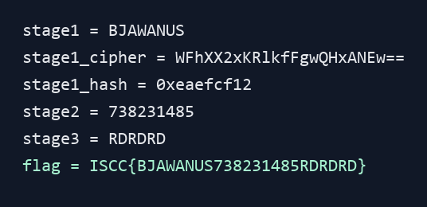

## Reverse

### 拆弹专家 定时炸弹

#### 题目信息

| 项目 | 内容 |
| --- | --- |
| 比赛来源 | 2026ISCC |
| 题目分类 | Reverse |
| 题目名称 | 拆弹专家 定时炸弹 |
| 附件 | attachment-21.cpp |
| SHA256 | 8CC8C2DB02F08D7237C6F3BFCC04CC13AA42D09BF1DE5554E444E2D7440F799B |

#### 解题思路

附件是 C++ 源码，程序整体是三阶段拆弹校验。成功分支会输出固定前缀 ISCC{，然后把三段输入密码依次拼接，最后输出右花括号。因此目标是恢复三个阶段的正确输入。

第一阶段使用自定义魔方风格变换、PKCS7 填充、Base64 编码和 FNV1a32 哈希。源码注释给出生成校验值的明文是 BJAWANUS，但仍需要复刻算法验证。第二阶段参数由第一阶段哈希派生，第三阶段迷宫路径又由第一阶段哈希和第二阶段数字共同派生，三个阶段是串联关系。

#### 技术实施

第一阶段密钥由异或恢复为 R U F R' D2。对 BJAWANUS 进行同样的加法与置换后得到 Base64 密文 WFhXX2xKRlkfFgwQHxANEw==，继续计算 FNV1a32 得到 0xeaefcf12。该值与 0xA5A5A5A5 异或后等于源码中的 0x4F4A6AB7，第一段输入成立。

第二阶段用这个哈希生成 g_a 系数和隐藏解。LCG 每轮更新后，第一项取一位数，其余四项取两位数，组合得到 738231485。代入源码中的五个方程后，目标值与程序派生值一致。

第三阶段使用 atoi(password2) 与 stage1_hash 乘以 0x9E3779B1 后的结果异或生成迷宫 seed。源码中额外开路条件写成 r % 100 小于负数，因此永远不会触发，迷宫只保留保证从左上到右下的主路径。复现 LCG 后得到路径 RDRDRD。

#### 关键命令

```powershell
python .\scripts\solve.py
```

#### 验证输出



#### 完整关键代码

```python
import base64


def fnv1a32(data: bytes) -> int:
    h = 0x811C9DC5
    for b in data:
        h ^= b
        h = (h * 0x01000193) & 0xFFFFFFFF
    return h


def pkcs7_pad(data: bytes, block: int = 8) -> bytes:
    pad = block - (len(data) % block)
    if pad == 0:
        pad = block
    return data + bytes([pad]) * pad


def invert_perm(perm):
    inv = [0] * 8
    for old, new in enumerate(perm):
        inv[new] = old
    return inv


def add_array(indexes, value):
    out = [0] * 8
    for index in indexes:
        out[index] = value
    return out


def build_moves():
    moves = {
        "R": {"perm": [0, 5, 2, 1, 4, 7, 6, 3], "add": add_array([1, 3, 5, 7], 1)},
        "L": {"perm": [2, 1, 6, 3, 0, 5, 4, 7], "add": add_array([0, 2, 4, 6], 2)},
        "U": {"perm": [0, 1, 6, 2, 4, 5, 7, 3], "add": add_array([2, 3, 6, 7], 3)},
        "D": {"perm": [1, 5, 2, 3, 0, 4, 6, 7], "add": add_array([0, 1, 4, 5], 4)},
        "F": {"perm": [0, 1, 2, 3, 6, 4, 7, 5], "add": add_array([4, 5, 6, 7], 5)},
        "B": {"perm": [1, 3, 0, 2, 4, 5, 6, 7], "add": add_array([0, 1, 2, 3], 6)},
    }
    inverse_specs = [
        ("R'", "R", [1, 3, 5, 7], 7),
        ("L'", "L", [0, 2, 4, 6], 8),
        ("U'", "U", [2, 3, 6, 7], 9),
        ("D'", "D", [0, 1, 4, 5], 10),
        ("F'", "F", [4, 5, 6, 7], 11),
        ("B'", "B", [0, 1, 2, 3], 12),
    ]
    for name, base, indexes, value in inverse_specs:
        moves[name] = {"perm": invert_perm(moves[base]["perm"]), "add": add_array(indexes, value)}
    return moves


def expand_key(key: str):
    seq = []
    moves = build_moves()
    for token in key.split():
        token = token.upper()
        times = 1
        if token.endswith("2"):
            token = token[:-1]
            times = 2
        if token not in moves:
            raise ValueError(f"unknown move: {token}")
        seq.extend([token] * times)
    return seq


def mofang_cipher(plaintext: str, key: str) -> bytes:
    moves = build_moves()
    data = pkcs7_pad(plaintext.encode())
    out = []
    for offset in range(0, len(data), 8):
        block = list(data[offset : offset + 8])
        for move in expand_key(key):
            spec = moves[move]
            temp = [(block[i] + spec["add"][i]) & 0xFF for i in range(8)]
            next_block = [0] * 8
            for old, new in enumerate(spec["perm"]):
                next_block[new] = temp[old]
            block = next_block
        out.extend(block)
    return base64.b64encode(bytes(out))


def lcg(state: int) -> int:
    return (state * 1664525 + 1013904223) & 0xFFFFFFFF


def derive_stage2(stage1_hash: int) -> str:
    base_a = [2, 3, 4, 5, 6]
    g_a = [base_a[i] + ((stage1_hash >> (i * 6)) & 0x3) for i in range(5)]

    state = stage1_hash ^ 0x12345678
    x = []
    for i in range(5):
        state = lcg(state)
        x.append(state % 10 if i == 0 else 10 + (state % 90))

    checks = [
        g_a[0] * x[0] + x[1] + x[4],
        x[0] + g_a[1] * x[1] + x[2],
        x[1] + g_a[2] * x[2] + x[3],
        x[2] + g_a[3] * x[3] + x[4],
        x[0] + x[3] + g_a[4] * x[4],
    ]
    assert checks == [151, 144, 144, 220, 701]
    return f"{x[0]}{x[1]:02d}{x[2]:02d}{x[3]:02d}{x[4]:02d}"


def derive_stage3(stage1_hash: int, password2: str) -> str:
    seed = (int(password2) ^ ((stage1_hash * 0x9E3779B1) & 0xFFFFFFFF)) & 0xFFFFFFFF
    state = seed ^ 0x9E3779B9
    x = 0
    y = 0
    path = []
    while (x, y) != (3, 3):
        state = lcg(state)
        can_right = x < 3
        can_down = y < 3
        if can_right and can_down:
            move = "R" if (state & 1) else "D"
        elif can_right:
            move = "R"
        else:
            move = "D"
        if move == "R":
            x += 1
        else:
            y += 1
        path.append(move)
    return "".join(path)


def main():
    password1 = "BJAWANUS"
    cipher = mofang_cipher(password1, "R U F R' D2")
    stage1_hash = fnv1a32(cipher)
    assert (stage1_hash ^ 0xA5A5A5A5) == 0x4F4A6AB7

    password2 = derive_stage2(stage1_hash)
    password3 = derive_stage3(stage1_hash, password2)
    print(f"stage1 = {password1}")
    print(f"stage1_cipher = {cipher.decode()}")
    print(f"stage1_hash = 0x{stage1_hash:08x}")
    print(f"stage2 = {password2}")
    print(f"stage3 = {password3}")
    print(f"flag = ISCC{{{password1}{password2}{password3}}}")


if __name__ == "__main__":
    main()
```

#### 问题与解决

本机 MinGW 无法识别 std=c++17 选项，去掉后又因为缺少 timeapi.h 无法原样编译附件。由于附件给出了完整源码，最终使用 Python 复刻三段校验逻辑，并用断言验证第一阶段混淆哈希和第二阶段方程目标。

#### 知识点总结

源码逆向题可以优先定位成功输出和输入拼接方式，再沿着校验函数恢复约束。当前题目的关键是注意三关之间的状态依赖，先恢复第一阶段哈希，再继续派生第二阶段和第三阶段，能保证结果和程序逻辑保持一致。

#### 最终 flag

`ISCC{BJAWANUS738231485RDRDRD}`
