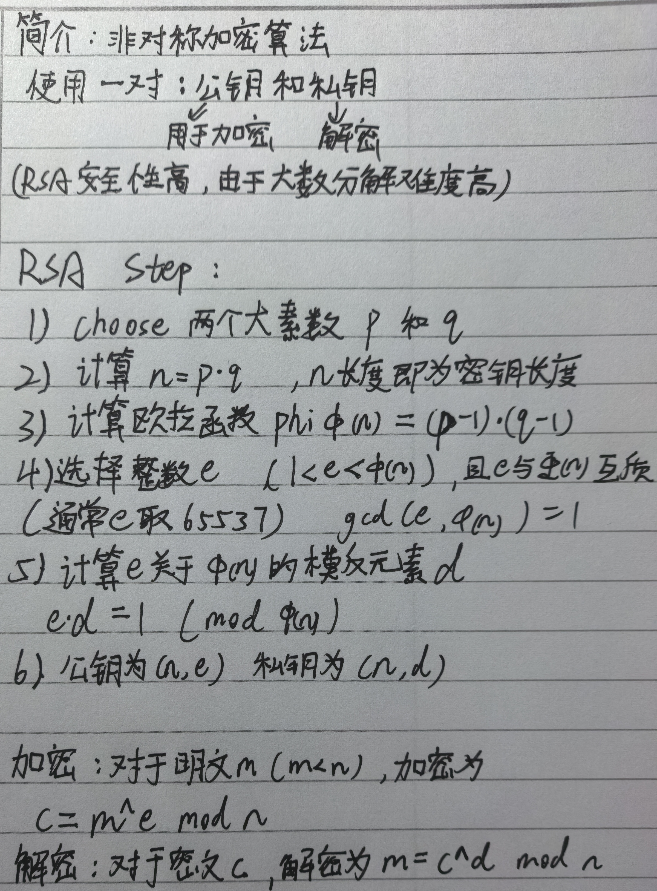

_<font style="color:#DF2A3F;"></font>_

<font style="color:#000000;">1.</font>_<font style="color:#DF2A3F;">getPrime(X)</font>_<font style="color:rgba(255, 255, 255, 0.8);background-color:rgb(35, 39, 56);"> 是 PyCryptodome 库中 </font>_<font style="color:#DF2A3F;">Crypto.Util.number</font>_<font style="color:#000000;">模块提供的一个函数，用于生成一个</font><font style="color:#DF2A3F;">X</font>**<font style="color:#DF2A3F;">位</font>****<font style="color:#000000;">的随机素数</font>**<font style="color:#000000;">。</font>

2.`<font style="color:rgb(15, 17, 21);background-color:rgb(235, 238, 242);">bytes_to_long</font>`<font style="color:rgb(15, 17, 21);"> 是密码学编程中常用的一个函数，它的作用是将</font>**<font style="color:rgb(15, 17, 21);">字节串（bytes）转换为一个长整数（long integer）</font>**<font style="color:rgb(15, 17, 21);">。</font>

<font style="color:rgb(15, 17, 21);">如：</font>

1. <font style="color:rgb(15, 17, 21);">取一个字节串（比如</font><font style="color:rgb(15, 17, 21);"> </font>`<font style="color:rgb(15, 17, 21);background-color:rgb(235, 238, 242);">b'flag{abc123}'</font>`<font style="color:rgb(15, 17, 21);">）。</font>
2. <font style="color:rgb(15, 17, 21);">将这个字节串看作一个</font>**<font style="color:rgb(15, 17, 21);">非常大的、以256为基数的数字</font>**<font style="color:rgb(15, 17, 21);">。（因为一个字节byte有8位bits，可以表示 </font>`<font style="color:rgb(15, 17, 21);background-color:rgb(235, 238, 242);">2^8 = 256</font>`<font style="color:rgb(15, 17, 21);"> 种不同的值，即0到255）</font>
3. <font style="color:rgb(15, 17, 21);">将这个“数字”转换成我们数学中常用的十进制整数。</font>

**<font style="color:rgb(15, 17, 21);">举个例子：</font>**<font style="color:rgb(15, 17, 21);">  
</font><font style="color:rgb(15, 17, 21);">假设我们有一个很短的字节串</font><font style="color:rgb(15, 17, 21);"> </font>`<font style="color:rgb(15, 17, 21);background-color:rgb(235, 238, 242);">b'\x01\x02'</font>`<font style="color:rgb(15, 17, 21);">。</font>

+ <font style="color:rgb(15, 17, 21);">第一个字节是</font><font style="color:rgb(15, 17, 21);"> </font>`<font style="color:rgb(15, 17, 21);background-color:rgb(235, 238, 242);">\x01</font>`<font style="color:rgb(15, 17, 21);">，其十进制值是</font><font style="color:rgb(15, 17, 21);"> </font>`<font style="color:rgb(15, 17, 21);background-color:rgb(235, 238, 242);">1</font>`<font style="color:rgb(15, 17, 21);">。</font>
+ <font style="color:rgb(15, 17, 21);">第二个字节是</font><font style="color:rgb(15, 17, 21);"> </font>`<font style="color:rgb(15, 17, 21);background-color:rgb(235, 238, 242);">\x02</font>`<font style="color:rgb(15, 17, 21);">，其十进制值是</font><font style="color:rgb(15, 17, 21);"> </font>`<font style="color:rgb(15, 17, 21);background-color:rgb(235, 238, 242);">2</font>`<font style="color:rgb(15, 17, 21);">。</font>

<font style="color:rgb(15, 17, 21);">转换过程就像我们计算一个两位数：</font><font style="color:rgb(15, 17, 21);">  
</font>`<font style="color:rgb(15, 17, 21);background-color:rgb(235, 238, 242);">这个数字 = (第一个字节的值) * (256)^1 + (第二个字节的值) * (256)^0</font>`<font style="color:rgb(15, 17, 21);">  
</font>`<font style="color:rgb(15, 17, 21);background-color:rgb(235, 238, 242);">b'\x01\x02'</font>`<font style="color:rgb(15, 17, 21);"> </font><font style="color:rgb(15, 17, 21);">转换为整数就是</font><font style="color:rgb(15, 17, 21);"> </font>`<font style="color:rgb(15, 17, 21);background-color:rgb(235, 238, 242);">1 * 256 + 2 * 1 = 258</font>`<font style="color:rgb(15, 17, 21);">。</font>

`<font style="color:rgb(15, 17, 21);background-color:rgb(235, 238, 242);">b'flag{******}'</font>`<font style="color:rgb(15, 17, 21);"> </font><font style="color:rgb(15, 17, 21);">要长得多，所以转换后会得到一个非常非常大的整数。</font>

### <font style="color:rgb(15, 17, 21);">为什么在RSA中需要这么做？</font>
**<font style="color:rgb(15, 17, 21);">RSA加密算法</font>**<font style="color:rgb(15, 17, 21);">的核心数学操作（如 </font>`<font style="color:rgb(15, 17, 21);background-color:rgb(235, 238, 242);">pow(m, e, n)</font>`<font style="color:rgb(15, 17, 21);">）是针对</font>**<font style="color:rgb(15, 17, 21);">整数</font>**<font style="color:rgb(15, 17, 21);">进行的。它无法直接处理字符串。</font>

<font style="color:rgb(15, 17, 21);">所以，加密的标准步骤是：</font>

1. <font style="color:rgb(15, 17, 21);">将明文消息（字符串）</font><font style="color:#DF2A3F;">转换</font><font style="color:rgb(15, 17, 21);">为字节串。</font>`<font style="color:rgb(15, 17, 21);background-color:rgb(235, 238, 242);">b'flag{...}'</font>`<font style="color:rgb(15, 17, 21);"> 就是这个字节串。</font>
2. <font style="color:rgb(15, 17, 21);">使用</font><font style="color:rgb(15, 17, 21);"> </font>`<font style="color:rgb(15, 17, 21);background-color:rgb(235, 238, 242);">bytes_to_long</font>`<font style="color:rgb(15, 17, 21);"> </font><font style="color:rgb(15, 17, 21);">将这个字节串转换为一个大的整数</font><font style="color:rgb(15, 17, 21);"> </font>`<font style="color:rgb(15, 17, 21);background-color:rgb(235, 238, 242);">m</font>`<font style="color:rgb(15, 17, 21);">。</font>
3. <font style="color:rgb(15, 17, 21);">对整数 </font>`<font style="color:rgb(15, 17, 21);background-color:rgb(235, 238, 242);">m</font>`<font style="color:rgb(15, 17, 21);"> 进行加密操作 </font>`<font style="color:#DF2A3F;background-color:rgb(235, 238, 242);">c = m^e mod n</font>`<font style="color:rgb(15, 17, 21);">，得到密文整数 </font>`<font style="color:rgb(15, 17, 21);background-color:rgb(235, 238, 242);">c</font>`<font style="color:rgb(15, 17, 21);">。</font>

**<font style="color:rgb(15, 17, 21);">解密</font>**<font style="color:rgb(15, 17, 21);">则是相反的过程：</font>

1. <font style="color:#DF2A3F;">对密文整数 </font>`<font style="color:#DF2A3F;background-color:rgb(235, 238, 242);">c</font>`<font style="color:#DF2A3F;"> 进行解密操作 </font>`<font style="color:#DF2A3F;background-color:rgb(235, 238, 242);">m = c^d mod n</font>`<font style="color:rgb(15, 17, 21);">，得到原始的明文的整数形式 </font>`<font style="color:rgb(15, 17, 21);background-color:rgb(235, 238, 242);">m</font>`<font style="color:rgb(15, 17, 21);">。</font>
2. <font style="color:rgb(15, 17, 21);">使用 </font>`<font style="color:#DF2A3F;background-color:rgb(235, 238, 242);">long_to_bytes</font>`<font style="color:rgb(15, 17, 21);"> 将这个整数 </font>`<font style="color:rgb(15, 17, 21);background-color:rgb(235, 238, 242);">m</font>`<font style="color:rgb(15, 17, 21);"> 转换回字节串。</font>
3. <font style="color:rgb(15, 17, 21);">将</font><font style="color:#DF2A3F;">字节串解码</font><font style="color:rgb(15, 17, 21);">，就得到了原始的字符串明文 </font>`<font style="color:rgb(15, 17, 21);background-color:rgb(235, 238, 242);">'flag{...}'</font>`<font style="color:rgb(15, 17, 21);">。</font>

### <font style="color:rgb(15, 17, 21);">总结</font>
| <font style="color:rgb(15, 17, 21);">函数</font> | <font style="color:rgb(15, 17, 21);">作用</font> | <font style="color:rgb(15, 17, 21);">类比</font> |
| --- | --- | --- |
| `<font style="color:rgb(15, 17, 21);background-color:rgb(235, 238, 242);">bytes_to_long</font>` | <font style="color:rgb(15, 17, 21);">将字节串转换为一个大整数</font> | <font style="color:rgb(15, 17, 21);">把一句话“翻译”成一个巨大的号码</font> |
| `<font style="color:rgb(15, 17, 21);background-color:rgb(235, 238, 242);">long_to_bytes</font>` | <font style="color:rgb(15, 17, 21);">将一个大整数转换回字节串</font> | <font style="color:rgb(15, 17, 21);">把那个巨大的号码“翻译”回原来那句话</font> |


<font style="color:rgb(15, 17, 21);">在你提供的代码中：</font><font style="color:rgb(15, 17, 21);">  
</font>`<font style="color:rgb(15, 17, 21);background-color:rgb(235, 238, 242);">m = bytes_to_long(b'flag{******}')</font>`<font style="color:rgb(15, 17, 21);">  
</font><font style="color:rgb(15, 17, 21);">这行代码的目的就是为了得到整数</font><font style="color:rgb(15, 17, 21);"> </font>`<font style="color:rgb(15, 17, 21);background-color:rgb(235, 238, 242);">m</font>`<font style="color:rgb(15, 17, 21);">，以便后续进行</font><font style="color:rgb(15, 17, 21);"> </font>`<font style="color:rgb(15, 17, 21);background-color:rgb(235, 238, 242);">pow(m, e, n)</font>`<font style="color:rgb(15, 17, 21);"> </font><font style="color:rgb(15, 17, 21);">的加密运算。</font>

<font style="color:rgb(128, 0, 128);"></font>

<font style="color:rgb(128, 0, 128);">3.字符串通过bytes_to_long</font><font style="color:rgb(128, 0, 128);">➡</font><font style="color:rgb(128, 0, 128);">m（明文）</font>

<font style="color:rgb(128, 0, 128);">e（加密指数Encryption exponent）通常是一个比较小的质数（如 3, 17, 65537）</font>

<font style="color:rgb(128, 0, 128);">n：模数（Modulus）。这是公钥的另一部分，它是一个极其巨大的数，由两个或多个大质数相乘得到，即 n = p * q（在标准RSA中）</font>

<font style="color:rgb(128, 0, 128);">· mod：取模运算。意思是求 m^e 除以 n 后的余数。因为 m^e 本身可能大得不可思议（远超宇宙原子总数），取模运算可以确保结果 c 是一个小于 n 的数，使其可以被处理和存储。</font>

<font style="color:rgb(128, 0, 128);">· c：密文（Ciphertext），即加密后的结果。它看起来就像一个随机的大整数。  
</font><font style="color:rgb(128, 0, 128);">直观比喻</font>

<font style="color:rgb(128, 0, 128);"></font>

<font style="color:rgb(128, 0, 128);">想象一下加密就像把一个秘密信息放进一个巨大的、有无数圈的密码转盘里：</font>

<font style="color:rgb(128, 0, 128);"></font>

<font style="color:rgb(128, 0, 128);">1. m（明文）：你想发送的秘密数字（比如 10）。</font>

<font style="color:rgb(128, 0, 128);">2. e（公钥）：告诉你将转盘顺时针转动多少圈（比如 5 圈）。</font>

<font style="color:rgb(128, 0, 128);">3. n（模数）：转盘上一共有多少格（比如 15 格）。</font>

<font style="color:rgb(128, 0, 128);">4. 加密操作 m^e mod n：</font>

<font style="color:rgb(128, 0, 128);">   · 你先使劲转动转盘：10^5 = 100,000。这相当于转了100,000圈。</font>

<font style="color:rgb(128, 0, 128);">   · 但转盘只有15格，转再多圈，最终停下来时指针指向的格子只和“总圈数除以15的余数”有关。</font>

<font style="color:rgb(128, 0, 128);">   · 所以我们计算 100,000 ÷ 15 的余数。15 * 6666 = 99990，100,000 - 99,990 = 10。</font>

<font style="color:rgb(128, 0, 128);">   · 所以最终指针指向第 10 格。</font>

<font style="color:rgb(128, 0, 128);">5. c（密文）：你告诉别人最终指针指向了 10 这个格子。光看 10 这个结果，没人能猜到你是从 10 开始转了 5 圈到的，还是从其他地方转来的。这就是加密。</font>

<font style="color:rgb(128, 0, 128);"></font>

<font style="color:rgb(128, 0, 128);">为什么这个操作是加密？</font>

<font style="color:rgb(128, 0, 128);"></font>

<font style="color:rgb(128, 0, 128);">这个公式是单向函数：</font>

<font style="color:rgb(128, 0, 128);"></font>

<font style="color:rgb(128, 0, 128);">· 正向计算（加密）很容易：给定 m, e, n，计算机可以很快算出 c。</font>

<font style="color:rgb(128, 0, 128);">· 反向计算（解密）极其困难：如果只知道 c, e, n，想倒推出原始的 m 是什么，在数学上被称为“求模的e次根”问题。当 n 非常大（比如2048位）时，即使用世界上最快的计算机，也需要花上亿年的时间来暴力破解。</font>

<font style="color:rgb(128, 0, 128);"></font>

<font style="color:rgb(128, 0, 128);">只有持有私钥 d 的人，才能通过另一个公式 m = c^d mod n 轻松地解密，恢复出原始信息 m。</font>


<font style="color:rgb(128, 0, 128);">n = p*q*r # 由三个质数相乘得到巨大的模数</font>

<font style="color:rgb(128, 0, 128);">c = pow(m, e, n) # 这就是在计算 c = m^e mod n</font>

<font style="color:rgb(128, 0, 128);">print("c=", c) # 输出密文</font>

<font style="color:rgb(128, 0, 128);">这段代码正是使用公钥 (e, n) 对信息 m（即flag）进行加密，产生了你需要去解密的密文 c。</font>


**<font style="color:rgb(128, 0, 128);">部分 含义 角色</font>**

<font style="color:rgb(128, 0, 128);">c = m^e mod n RSA加密核心公式 用公钥把明文变成密文</font>

<font style="color:rgb(128, 0, 128);">m = c^d mod n RSA解密核心公式 用私钥把密文变回明文</font>

<font style="color:rgb(128, 0, 128);">n 模数 公钥的另一部分，决定加密强度</font>

+ `**<font style="color:rgb(15, 17, 21);background-color:rgb(235, 238, 242);">e</font>**`<font style="color:rgb(15, 17, 21);"> = 锁门的方法（公开）</font><font style="color:rgb(128, 0, 128);">加密指数 公钥的一部分</font>
+ `**<font style="color:rgb(15, 17, 21);background-color:rgb(235, 238, 242);">d</font>**`<font style="color:rgb(15, 17, 21);"> = 开门的钥匙（私有）</font><font style="color:#cdd6f4;background-color:#1e1e2e;">d = pow(e, -1, phi_n)</font>
+ `**<font style="color:rgb(15, 17, 21);background-color:rgb(235, 238, 242);">c</font>**`<font style="color:rgb(15, 17, 21);"> = 锁好的门 </font><font style="color:rgb(128, 0, 128);">c 密文 加密后的结果，看起来像乱码</font>
+ `**<font style="color:rgb(15, 17, 21);background-color:rgb(235, 238, 242);">m</font>**`<font style="color:rgb(15, 17, 21);"> = 门内的东西 </font><font style="color:rgb(128, 0, 128);">m 明文的数字形式 想要保护的信息</font>

<font style="color:rgb(15, 17, 21);">只有用正确的钥匙 </font>`<font style="color:rgb(15, 17, 21);background-color:rgb(235, 238, 242);">d</font>`<font style="color:rgb(15, 17, 21);"> 才能打开锁着的门 </font>`<font style="color:rgb(15, 17, 21);background-color:rgb(235, 238, 242);">c</font>`<font style="color:rgb(15, 17, 21);"> 得到里面的东西 </font>`<font style="color:rgb(15, 17, 21);background-color:rgb(235, 238, 242);">m</font>`<font style="color:rgb(15, 17, 21);">。</font>

<font style="color:rgb(128, 0, 128);"></font>

<font style="color:rgb(128, 0, 128);">在RSA加解密的过程中，公钥与私钥可以分别用做加密与解密。使用公钥加密的信息，可以用私钥解密。使用私钥加密的信息，可以用公钥解密。加解密的数学过程是相同的。</font>

```plain
b'flag{...}' 
    ↓ bytes_to_long()
m (明文数字) → 被RSA加密 → c (密文)
    ↑ long_to_bytes()        ↓ 给你解密
b'flag{...}' ← 你的目标   c (你拿到的)
```

`<font style="color:rgb(15, 17, 21);background-color:rgb(235, 238, 242);">gcd</font>`<font style="color:rgb(15, 17, 21);"> 是 </font>**<font style="color:rgb(15, 17, 21);">最大公约数</font>**<font style="color:rgb(15, 17, 21);">（Greatest Common Divisor）</font>**<font style="color:rgb(15, 17, 21);">gcd(a, b)</font>**<font style="color:rgb(15, 17, 21);"> = 能同时整除 a 和 b 的</font>**<font style="color:rgb(15, 17, 21);">最大正整数。</font>**

<font style="color:rgb(15, 17, 21);">在RSA的欧拉定理中：</font>

<font style="color:rgb(15, 17, 21);">如果 gcd(m, n) = 1，那么 m^φ(n) ≡ 1 mod n</font>

<font style="color:rgb(15, 17, 21);">如果 </font>`<font style="color:rgb(15, 17, 21);background-color:rgb(235, 238, 242);">gcd(m, n) ≠ 1</font>`<font style="color:rgb(15, 17, 21);">，欧拉定理不直接适用，需要</font><font style="color:#DF2A3F;">中国剩余定理</font><font style="color:rgb(15, 17, 21);">等其他方法。</font>

<font style="color:rgb(15, 17, 21);">由于模数是 2 的幂，我们可以使用 Pohlig-Hellman 算法，这比 Pollard Rho 更高效</font>

**<font style="color:rgb(15, 17, 21);">Pollard Rho 算法</font>**

**<font style="color:rgb(15, 17, 21);"></font>**

**<font style="color:rgb(15, 17, 21);"></font>**

**<font style="color:rgb(15, 17, 21);"></font>**

1. <font style="color:rgba(0, 0, 0, 0.5) !important;">使用 sympy 的 discrete_log 或 gmpy2 求解 e，高效且省内存。</font>
2. <font style="color:rgba(0, 0, 0, 0.5) !important;">正确解方程组得到 p、q、r，验证是否为质数。</font>
3. <font style="color:rgba(0, 0, 0, 0.5) !important;">计算 n、phi (n)、d，解密 c 得到 m，转换为 flag。</font>


