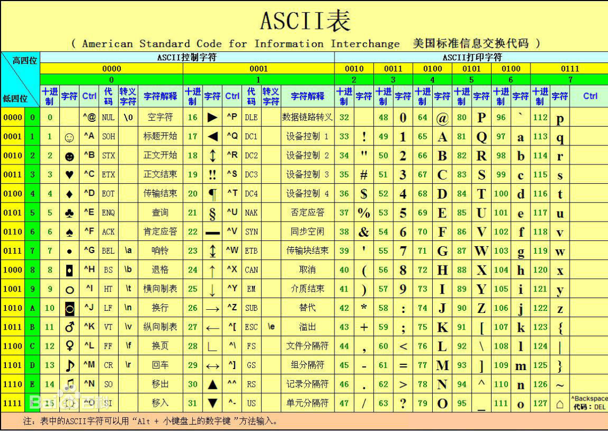
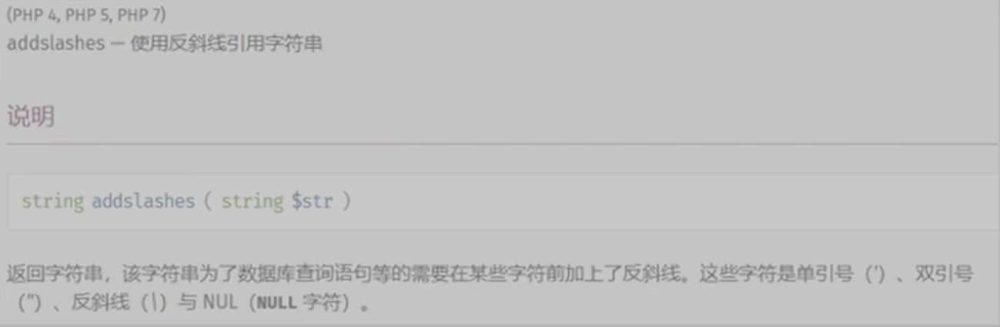
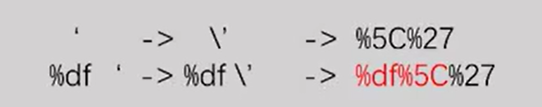
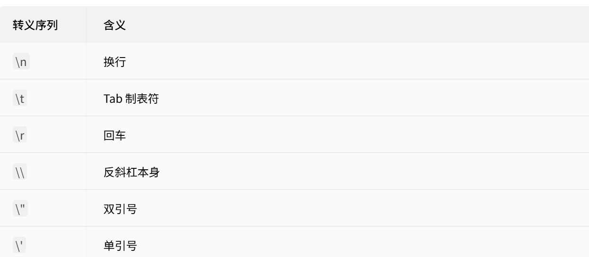
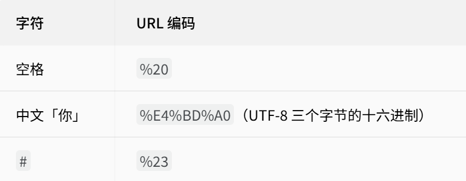
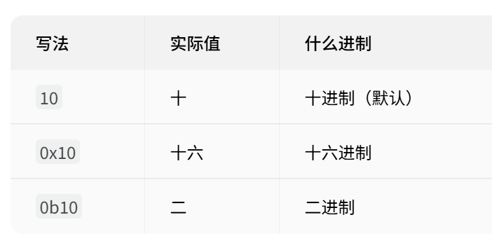
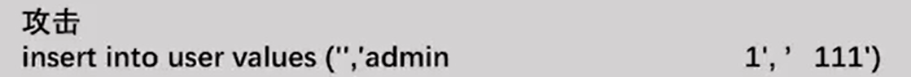

SQL（Structured Query Language）结构化查询语言，是一种关系型数据库查询的标准编程语言，用于存取数据以及查询、更新、删除和管理关系型数据库（即SQL是一种数据库查询语言）

SQL 注入（SQL Injection）是一种常见的 Web 攻击方式，攻击者通过构造恶意 SQL 语句，将其注入到应用程序中，从而操纵数据库执行非授权操作。

原理：web应用程序在接收相关数据参数时未做好过滤，将其直接带入到数据库中查询，导致攻击者可以拼接执行构造的SQL语句。

SQLmap

# 宽字节注入

## ASCII

American Standard Code for Information Interchange，美国信息交换标准代码

## GBK

GBK全称《汉字内码扩展规范》（GBK即“国标”、扩展”汉语拼音的第一个字母，英文名称：Chinese Internal Code
Speification）

## URL转码

## addslashes函数

如何从addslashes函数逃逸出来？
1. \前面再加一个\（或单数个)，变成'，这样\被转义了，逃出了限制。
2. 把\弄没，这样单引号生效。
## 原理
宽字节注入是利用mysql的一个特性，mysql在使用GBK编码的时候，
会认为两个字符是一个汉字（**汉字的第一个字节**落在 0x81–0xFE（129–254），但必须和第二个字节配对才算一个汉字）如果字节值 > 0x80（128），它就被认为是双字节字符的第一个字节。

## 什么是转义
正常情况下每个字符有固定含义。**转义**就是借一个特殊符号当开关，临时改变下一个字符的含义。
### 1. 特殊功能字符→变成普通文本
引号在代码里用来包裹字符串，那字符串里面本身就要写引号怎么办？
`print('It's mine')   # 错！第二个单引号把字符串给截断了`
`print('It\'s mine')  # 对！\' 告诉 Python「这是个普通单引号，不是字符串结尾」`
### 2. 普通字母→变成特殊功能

反过来，给普通字母加 \，让它变成有特殊功能的：

### 3. URL 百分号转义

URL 里有些字符不能直接用（比如中文、空格），就用 % + 十六进制编码代替：

% 就是 URL 里的转义标记，和字符串里的 \ 是同一个思路。
## 进制标记

# 基于约束的SQL攻击

这是经典的 **INSERT 型 SQL 注入**。

# 报错注入
