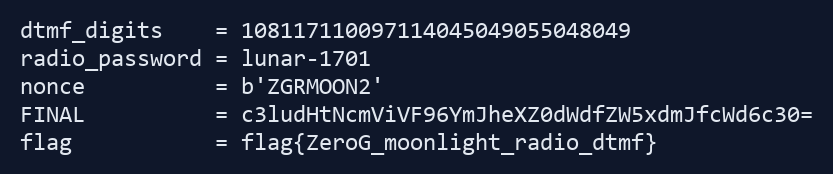

## Crypto

### Cry_02.Lunar LCG / 月面伪随机

#### 题目信息

| 项目 | 内容 |
| --- | --- |
| 比赛来源 | ZeroG |
| 题目分类 | Crypto |
| 题目名称 | Cry_02.Lunar LCG / 月面伪随机 |
| 题面 | ZeroG 月面中继站使用一个轻量级伪随机数发生器生成通信密钥流。开发人员说：“我们没有直接使用固定密钥，而是每次用随机数发生器生成密钥流，应该足够安全。” Fen 查看遥测日志后发现，中继站在加密前泄露了几次连续的 PRNG 状态。请分析附件，恢复密钥流并解出 flag。 |
| 附件 | `lunar_lcg.zip` |
| Flag 格式 | `flag{...}` |
| 附件 SHA256 | `3DBE071242C3D47BA22A5891D920CFF48A9F7157C87F36F439B0A8AB256DA0E7` |

#### 解题思路

附件很简洁，只有 `README.txt`、`output.txt` 和 `encrypt.py`。这类题最适合先看实现，再决定是从密文入手还是从状态泄露入手。

读完 `encrypt.py` 后可以确认，题目用的是标准线性同余生成器 LCG。每次先更新内部状态，再取新状态的最低 8 位作为一个字节的密钥流，然后对明文逐字节异或。

题面已经提醒了关键点：连续的 PRNG 状态泄露足够恢复参数。既然 `output.txt` 里直接给出了多个连续 state，那么不需要猜测密文结构，也不需要爆破种子，直接从递推公式反推 `a` 和 `c` 就够了。

#### 技术实施

先看加密核心逻辑：

```python
class LunarLCG:
    def __init__(self, m, a, c, state):
        self.m = m
        self.a = a
        self.c = c
        self.state = state

    def next_state(self):
        self.state = (self.a * self.state + self.c) % self.m
        return self.state

    def next_byte(self):
        return self.next_state() & 0xff
```

`output.txt` 给出了模数 `m`、6 个连续泄露状态，以及最终密文：

```text
m = 170141183460469231731687303715884105727
leak_states = [
    48077378362307815584689819960136019875,
    100310108693164117002347749113390493183,
    145646689101109657050476193569066602802,
    63949818470656288394594660187785964270,
    46314465195318558087862397882705709486,
    103138436636073932218183299598776830813,
]
ciphertext = 39fe07de62fdc9bf74bbbcbd7e202386ca9e40451b46c74968e30fff138a95
```

LCG 满足：

```text
state[i + 1] = a * state[i] + c mod m
```

用前三个状态就能直接解出参数。把式子写开：

```text
state1 = a * state0 + c mod m
state2 = a * state1 + c mod m
```

两式相减可得：

```text
state2 - state1 = a * (state1 - state0) mod m
```

所以：

```text
a = (state2 - state1) * (state1 - state0)^(-1) mod m
c = state1 - a * state0 mod m
```

代入之后得到：

```text
a = 47706504925832043350690201375217556277
c = 106332766362414553063251587032479728762
```

接着把这组参数代回去检查所有泄露状态，6 个状态之间的递推全部成立，说明参数恢复无误。

由于题目说泄露发生在加密前，而且 `next_byte()` 每次都会先 `next_state()`，所以恢复密钥流时应该从最后一个泄露状态继续往前推，生成与密文等长的字节流，再逐字节异或。

最终解密结果直接落成标准 flag：

```text
flag{ZeroG_lcg_stream_recovery}
```

#### 关键命令

```powershell
D:\CaptureTheFlag\CTFTool\7-Zip\7z.exe x -y lunar_lcg.zip -oevidence
python .\scripts\solve.py
```

#### 完整关键代码

```python
from ast import literal_eval
from pathlib import Path


ROOT = Path(__file__).resolve().parents[1]
OUTPUT = ROOT / "evidence" / "output.txt"


def parse_output(path: Path) -> tuple[int, list[int], bytes]:
    text = path.read_text(encoding="utf-8")

    m_line = next(line for line in text.splitlines() if line.startswith("m = "))
    m = int(m_line.split("=", 1)[1].strip())

    states_block = text.split("leak_states =", 1)[1].split("ciphertext =", 1)[0].strip()
    states = list(literal_eval(states_block))

    ct_line = next(line for line in text.splitlines() if line.startswith("ciphertext = "))
    ciphertext = bytes.fromhex(ct_line.split("=", 1)[1].strip())

    return m, states, ciphertext


def recover_lcg_params(m: int, states: list[int]) -> tuple[int, int]:
    if len(states) < 3:
        raise ValueError("need at least 3 consecutive states")

    s0, s1, s2 = states[:3]
    numerator = (s2 - s1) % m
    denominator = (s1 - s0) % m
    a = (numerator * pow(denominator, -1, m)) % m
    c = (s1 - a * s0) % m
    return a, c


def keystream_from_state(m: int, a: int, c: int, state: int, length: int) -> bytes:
    out = bytearray()
    for _ in range(length):
        state = (a * state + c) % m
        out.append(state & 0xFF)
    return bytes(out)


def main() -> None:
    m, states, ciphertext = parse_output(OUTPUT)
    a, c = recover_lcg_params(m, states)

    for i in range(len(states) - 1):
        assert (a * states[i] + c) % m == states[i + 1]

    ks = keystream_from_state(m, a, c, states[-1], len(ciphertext))
    plaintext = bytes(x ^ y for x, y in zip(ciphertext, ks))
    flag = plaintext.decode("ascii")

    assert flag.startswith("flag{") and flag.endswith("}")

    print(f"a = {a}")
    print(f"c = {c}")
    print(f"flag = {flag}")


if __name__ == "__main__":
    main()
```

#### 验证输出

运行脚本后得到：

```text
a = 47706504925832043350690201375217556277
c = 106332766362414553063251587032479728762
flag = flag{ZeroG_lcg_stream_recovery}
```

其中脚本还会逐项断言所有泄露状态都满足同一组 LCG 参数，因此不是只撞对了一个明文前缀，而是完整复原了生成器。

#### 知识点总结

这题的关键不是“LCG 不安全”这句结论本身，而是要看到连续状态泄露已经把问题从伪随机分析降成了模逆运算。只要 `m` 已知，并且 `state1 - state0` 在模 `m` 下可逆，就能从三个连续状态直接恢复 `a` 和 `c`。

遇到这类题时，优先确认泄露的是内部 state、输出值还是截断值。如果拿到的是完整连续 state，通常应该先走参数恢复，再谈 keystream 和解密，效率会高很多。

#### 最终 flag

```text
flag{ZeroG_lcg_stream_recovery}
```

## Reverse

### Re_03.Nebula Patch / 星云补丁

#### 题目信息

| 项目 | 内容 |
| --- | --- |
| 比赛来源 | ZeroG |
| 题目分类 | Reverse |
| 题目名称 | Re_03.Nebula Patch / 星云补丁 |
| 题面 | ZeroG 深空探测器的星云模块内置了一段许可证校验逻辑。工程师为了阻止逆向分析，加入了反调试检测和多层逻辑判断。Fen 留下了一句话：“如果星云不让你观察它，那就改变观测路径。”请逆向分析程序，绕过阻碍，恢复正确输入并得到 flag。 |
| 附件 | `nebula_patch.zip` |
| Flag 格式 | `flag{...}` |
| 附件 SHA256 | `0669C03109929EDC4DDFF0DDC7E05DC030EC7606DCD3AB5D8AD6D5889C3B6501` |

#### 解题思路

附件解压后只有一个 stripped 的 ELF 可执行文件和简短说明。题面已经明确说程序会做反调试，而且 Fen 给出的提示是“改变观测路径”，因此这题最自然的方向不是硬挂调试器，而是先把输入校验和 flag 生成逻辑静态拆开。

先用 `file`、`strings`、`readelf`、`objdump` 做基础摸底，可以确认样本是 `ELF 64-bit LSB pie executable, x86-64, stripped, dynamically linked`。字符串里能直接看到几条关键提示，例如 `Nebula distortion detected.`、`Nebula gate collapsed.`、`Access granted.`，说明程序至少有反调试分支、失败分支和成功分支。

继续顺着主函数往下梳理后，可以发现前面的确有两层反调试检测，但真正决定输入是否正确的逻辑并不复杂，而且其中还混入了一条故意吓人的死分支。把这些噪声去掉后，整个题目就变成了两步：先逆出正确口令，再用口令派生种子去解密内置 flag。

#### 技术实施

程序入口附近先调用 `ptrace(PTRACE_TRACEME, ...)`，随后还会读取 `/proc/self/status`，查找 `TracerPid:` 是否为 0。只要探测到调试器，就会输出：

```text
[!] Nebula distortion detected.
```

除此之外，在 `0x126a` 一带还有一个看起来像关键校验的逻辑块。这个块最终会把某个计算结果的低字节拿去和 `0x42` 比较。把该块单独拎出来计算后，可以确认低字节固定是 `0xD4`，因此跳去：

```text
[!] Nebula gate collapsed.
```

的路径在正常程序流里根本不可达，这一段只是干扰分析视线的障眼法。

真正的输入处理使用 `fgets` 读取字符串，并去掉行尾换行。随后会检查长度是否等于 `0x12`，也就是 18 个字符，不满足就直接输出：

```text
[-] Input error.
```

校验目标字节位于 `.rodata` 的 `0x2110`，内容为：

```text
04 8e b3 88 fa 73 d9 1f 81 04 8b 0c aa 3a 56 a1 37 85
```

循环初始寄存器状态可以整理成下面三个值：

```text
acc = 0x6d
r9  = 0x67
r10 = 0x17
```

每一轮都会对输入字节做异或、循环左移和累加，然后把结果并入 `acc`，最后与目标字节比较：

```python
tmp = rol8(input[i] ^ (r9 & 0xff), (i % 6) + 1)
tmp = (tmp + (r10 & 0xff)) & 0xff
acc ^= tmp
assert acc == target[i]
r9 += 0x0b
r10 += 0x17
```

由于每轮都会把当前 `acc` 与目标数组直接比较，所以并不需要爆破输入，而是可以逐字节反推：

```python
z = acc ^ target[i]
y = (z - (r10 & 0xff)) & 0xff
input[i] = ror8(y, (i % 6) + 1) ^ (r9 & 0xff)
```

按这个逆过程恢复出来的 18 字节口令为：

```text
Nebula-7F3A-Vector
```

口令正确后，程序会进入成功分支，先输出：

```text
[+] Access granted.
[+] Flag:
```

接着用口令生成一个 32 位种子。对应逻辑可以还原为：

```python
esi = 0x9E3779B9
edi = 0x4E42554C

for i, b in enumerate(passcode_bytes):
    eax = (b << ((i & 3) * 8)) & 0xffffffff
    eax ^= edi
    eax = (eax + esi) & 0xffffffff
    esi = (esi + 0x045D9F3B) & 0xffffffff
    eax = rol32(eax, 5)
    edi = eax ^ 0x7F4A7C15

seed = eax ^ 0xBF4BAC18
```

把刚恢复出的口令代入后，得到的种子是：

```text
0x8887cf28
```

真正的 flag 密文位于 `.rodata` 的 `0x20e0`，长度为 `0x22` 字节：

```text
9d270153e1de3787561d569097d80ab42ed5a79b67e355a915f33bcfe93e6d5707af
```

程序会以这个种子为初始状态，每 4 字节调用一次 `xorshift32`，再和递增的单字节掩码一起异或生成明文：

```python
def xorshift32(x):
    x ^= (x << 13) & 0xffffffff
    x ^= (x >> 17) & 0xffffffff
    x ^= (x << 5) & 0xffffffff
    return x & 0xffffffff


eax = seed
edi = 0x42

for i, enc in enumerate(flag_data):
    if (i & 3) == 0:
        eax = xorshift32(eax)
    out[i] = enc ^ (edi & 0xff) ^ ((eax >> ((i & 3) * 8)) & 0xff)
    edi += 0x0d
```

最终可以完整解出静态 flag。

#### 关键命令

```powershell
D:\CaptureTheFlag\CTFTool\7-Zip\7z.exe x -y nebula_patch.zip -oevidence
python .\scripts\solve.py
```

#### 完整关键代码

```python
from pathlib import Path


PASS_TARGET = bytes.fromhex("048eb388fa73d91f81048b0caa3a56a13785")
FLAG_DATA = bytes.fromhex(
    "9d270153e1de3787561d569097d80ab42ed5a79b67e355a915f33bcfe93e6d5707af"
)


def rol8(value: int, count: int) -> int:
    value &= 0xFF
    count &= 7
    return ((value << count) | (value >> (8 - count))) & 0xFF


def ror8(value: int, count: int) -> int:
    value &= 0xFF
    count &= 7
    return ((value >> count) | (value << (8 - count))) & 0xFF


def rol32(value: int, count: int) -> int:
    value &= 0xFFFFFFFF
    count &= 31
    return ((value << count) | (value >> (32 - count))) & 0xFFFFFFFF


def recover_passcode() -> str:
    acc = 0x6D
    r9 = 0x67
    r10 = 0x17
    recovered = []

    for index, target in enumerate(PASS_TARGET):
        z = acc ^ target
        y = (z - (r10 & 0xFF)) & 0xFF
        plain = ror8(y, (index % 6) + 1) ^ (r9 & 0xFF)
        recovered.append(plain)

        tmp = rol8(plain ^ (r9 & 0xFF), (index % 6) + 1)
        tmp = (tmp + (r10 & 0xFF)) & 0xFF
        acc ^= tmp
        r9 += 0x0B
        r10 += 0x17

    return bytes(recovered).decode("ascii")


def derive_seed(passcode: str) -> int:
    esi = 0x9E3779B9
    edi = 0x4E42554C
    eax = 0

    for index, byte in enumerate(passcode.encode("ascii")):
        eax = ((byte << ((index & 3) * 8)) & 0xFFFFFFFF) ^ edi
        eax = (eax + esi) & 0xFFFFFFFF
        esi = (esi + 0x045D9F3B) & 0xFFFFFFFF
        eax = rol32(eax, 5)
        edi = eax ^ 0x7F4A7C15

    return eax ^ 0xBF4BAC18


def xorshift32(value: int) -> int:
    value ^= (value << 13) & 0xFFFFFFFF
    value ^= (value >> 17) & 0xFFFFFFFF
    value ^= (value << 5) & 0xFFFFFFFF
    return value & 0xFFFFFFFF


def decode_flag(seed: int) -> str:
    eax = seed
    edi = 0x42
    output = bytearray()

    for index, item in enumerate(FLAG_DATA):
        if (index & 3) == 0:
            eax = xorshift32(eax)
        key_byte = (eax >> ((index & 3) * 8)) & 0xFF
        output.append(item ^ (edi & 0xFF) ^ key_byte)
        edi += 0x0D

    return output.decode("ascii")


def main() -> None:
    passcode = recover_passcode()
    seed = derive_seed(passcode)
    flag = decode_flag(seed)

    print(f"binary  = {Path(__file__).resolve().parent.parent / 'evidence' / 'nebula_patch'}")
    print(f"passcode= {passcode}")
    print(f"seed    = 0x{seed:08x}")
    print(f"flag    = {flag}")


if __name__ == "__main__":
    main()
```

#### 验证输出

运行复现脚本后得到：

```text
binary  = C:\Users\glj07\Desktop\Codex工作区\Writeup\CTF\ZeroG\Reverse\Re_03.Nebula Patch\evidence\nebula_patch
passcode= Nebula-7F3A-Vector
seed    = 0x8887cf28
flag    = flag{ZeroG_nebula_patch_antidebug}
```

这一步同时验证了三件事：口令恢复正确、种子推导正确、最终解密结果满足标准 flag 格式，因此整条逆向链路是闭合的。

#### 知识点总结

这题的关键不是和反调试机制正面对抗，而是先判断哪些逻辑真正参与结果生成。`ptrace` 和 `TracerPid` 检查确实存在，但并不影响静态还原数据流；那个通往 `Nebula gate collapsed` 的比较分支更是纯粹的烟雾弹。把这些噪声剥掉以后，题目核心只剩一个可逆的逐字节校验器和一个简单的 `xorshift32` 解码器。

遇到类似题型时，优先判断输入是否逐轮与常量比较。如果每轮状态都被立刻校验，往往意味着可以直接从比较值反推出明文输入，而不必陷入爆破或者动态 patch 的思路里。题面里的“改变观测路径”，本质上正是在提醒这件事。

#### 最终 flag

```text
flag{ZeroG_nebula_patch_antidebug}
```

## Misc

### Misc_02.Moonlight Radio / 月光电台

#### 题目信息

| 项目 | 内容 |
| --- | --- |
| 比赛来源 | ZeroG |
| 题目分类 | Misc |
| 题目名称 | Misc_02.Moonlight Radio / 月光电台 |
| 题面 | ZeroG 空间站在月背通信窗口中收到了一段短暂的无线电信号。Fen 说这段音频像是旧时代电话系统的声音；Hugo 在遥测数据里发现了一个加密帧；N1 认为这些声音并不是随机噪声；A 留下了一条推导公式；Gnaw 只说了一句话：“把数字重新变成字符，然后让月光打开遥测帧。” |
| 附件 | `player_moonlight_radio.zip` |
| Flag 格式 | `flag{...}` |
| 附件 SHA256 | `2055D1D120C1580ED39A7B63EE1A9336E884CC395D37FAC4158EB6CB9C99C291` |

#### 解题思路

这题的第一层线索其实已经写在题面里了。`radio.wav` 不是摩斯码，而是“旧时代电话系统的声音”，因此最先想到的就是 DTMF 电话按键音。再结合提示里说的“把数字重新变成字符”，很自然就会猜到音频先还原数字，再按某种字符编码解释。

附件解开后有 `radio.wav`、`telemetry.dat` 和 `README.txt`。其中 `README.txt` 已经直接给出了密钥派生公式：

```text
key = sha256("ZeroG::" + radio_password + "::www.pwnstars.online")
```

所以整道题的链路非常清楚：先从音频里提取 `radio_password`，再拿它去解 `telemetry.dat`，最后看明文里还藏了什么二次编码。

#### 技术实施

先分析 `radio.wav`。这段音频是 8 kHz 单声道 PCM，音符长度和间隔都比较规整，频谱上能明显看到 DTMF 的双频结构。对每个音符窗口做 FFT 后，分别在低频组 `697/770/852/941` 和高频组 `1209/1336/1477/1633` 中选出能量最强的两个频点，就能还原按键序列：

```text
108117110097114045049055048049
```

题面提示“每 3 位分组，尝试作为 ASCII 码解释”，于是把这串数字按三位切开：

```text
108 117 110 097 114 045 049 055 048 049
```

对应 ASCII 后得到：

```text
lunar-1701
```

这就是 `radio_password`。随后读取 `telemetry.dat`，前 16 字节可以拆成两部分：

```text
ZGTELv2\nZGRMOON2
```

前 8 字节 `ZGTELv2\n` 是格式标识，后 8 字节 `ZGRMOON2` 才是真正参与解密的 `nonce`。结合同赛事 `StarTrail` 的实现模式，可以确认这里复用了相同的自定义流加密：

```text
xorstream-sha256-ctr
```

其密钥流块生成方式为：

```text
sha256(key + nonce + counter.to_bytes(4, "big"))
```

将所有块拼接后，与 `telemetry.dat[16:]` 逐字节异或即可得到明文。解出的遥测正文中包含最终字段：

```text
FINAL=c3ludHtNcmViVF96YmJheXZ0dWdfZW5xdmJfcWd6c30=
```

这一步继续按常见组合处理。先做 Base64 解码，得到：

```text
synt{MrebT_zbbayvtug_enqvb_qgzs}
```

`synt` 很像 `flag` 的 ROT13 形式，因此整串再做一次 ROT13，最终恢复出正确 flag。

关键输出如下：



#### 关键命令

```powershell
python "C:\Users\glj07\Desktop\Codex工作区\Writeup\CTF\零重力\Misc\Misc_02.Moonlight Radio\scripts\solve.py"
```

#### 完整关键代码

```python
import base64
import codecs
import hashlib
import pathlib
import wave

import numpy as np


ROOT = pathlib.Path(__file__).resolve().parents[1]
BASE = ROOT / "outputs" / "moonlight_radio"


DTMF_LOW = [697, 770, 852, 941]
DTMF_HIGH = [1209, 1336, 1477, 1633]
DTMF_KEYS = {
    (697, 1209): "1",
    (697, 1336): "2",
    (697, 1477): "3",
    (697, 1633): "A",
    (770, 1209): "4",
    (770, 1336): "5",
    (770, 1477): "6",
    (770, 1633): "B",
    (852, 1209): "7",
    (852, 1336): "8",
    (852, 1477): "9",
    (852, 1633): "C",
    (941, 1209): "*",
    (941, 1336): "0",
    (941, 1477): "#",
    (941, 1633): "D",
}


def detect_dtmf_digits(wav_path: pathlib.Path) -> str:
    with wave.open(str(wav_path), "rb") as wav:
        data = np.frombuffer(wav.readframes(wav.getnframes()), dtype=np.int16).astype(np.float32)
        sample_rate = wav.getframerate()

    start = 0.5
    step = 0.24
    tone_len = 0.18
    digits = []

    for index in range(40):
        begin = int((start + index * step) * sample_rate)
        end = int((start + index * step + tone_len) * sample_rate)
        if end > len(data):
            break

        segment = data[begin:end]
        if np.sqrt(np.mean(segment**2)) < 1000:
            continue

        window = np.hanning(len(segment))
        spectrum = np.abs(np.fft.rfft(segment * window))
        freqs = np.fft.rfftfreq(len(segment), 1 / sample_rate)

        def pick(targets: list[int]) -> int:
            best_freq = targets[0]
            best_power = -1.0
            for target in targets:
                idx = int(np.argmin(np.abs(freqs - target)))
                lo = max(0, idx - 2)
                hi = min(len(spectrum), idx + 3)
                local = lo + int(np.argmax(spectrum[lo:hi]))
                power = spectrum[local]
                if power > best_power:
                    best_power = power
                    best_freq = min(targets, key=lambda item: abs(item - freqs[local]))
            return best_freq

        low = pick(DTMF_LOW)
        high = pick(DTMF_HIGH)
        digits.append(DTMF_KEYS[(low, high)])

    return "".join(digits)


def xorstream_sha256_ctr(ciphertext: bytes, key: bytes, nonce: bytes) -> bytes:
    output = bytearray()
    counter = 0
    offset = 0
    while offset < len(ciphertext):
        block = hashlib.sha256(key + nonce + counter.to_bytes(4, "big")).digest()
        chunk = ciphertext[offset : offset + 32]
        output.extend(bytes(a ^ b for a, b in zip(chunk, block)))
        offset += len(chunk)
        counter += 1
    return bytes(output)


def main() -> None:
    digits = detect_dtmf_digits(BASE / "radio.wav")
    password = "".join(chr(int(digits[i : i + 3])) for i in range(0, len(digits), 3))

    telemetry = (BASE / "telemetry.dat").read_bytes()
    nonce = telemetry[8:16]
    ciphertext = telemetry[16:]

    seed = f"ZeroG::{password}::www.pwnstars.online".encode()
    key = hashlib.sha256(seed).digest()
    plaintext = xorstream_sha256_ctr(ciphertext, key, nonce).decode("utf-8", errors="replace")

    final_line = next(line for line in plaintext.splitlines() if line.startswith("FINAL="))
    encoded = final_line.split("=", 1)[1]
    rot13_text = base64.b64decode(encoded).decode()
    flag = codecs.decode(rot13_text, "rot_13")

    print(f"dtmf_digits = {digits}")
    print(f"radio_password = {password}")
    print(f"nonce = {nonce!r}")
    print(plaintext)
    print(flag)


if __name__ == "__main__":
    main()
```

#### 验证输出

运行脚本后可以稳定得到以下关键结果：

```text
dtmf_digits = 108117110097114045049055048049
radio_password = lunar-1701
nonce = b'ZGRMOON2'
flag{ZeroG_moonlight_radio_dtmf}
```

其中 `dtmf_digits`、`radio_password`、`nonce` 和最终 flag 能完整对应整条解题链路，说明音频识别、密钥派生、遥测解密和尾部编码转换都没有走偏。

#### 知识点总结

这题最关键的是把题面提示拆成两步执行，而不是一上来就直接硬啃 `telemetry.dat`。电话按键音对应 DTMF，这一步如果识别出来，后面的“数字重新变成字符”就会顺理成章地落到三位 ASCII 上。

另一个值得记住的点是，题目虽然在 `README.txt` 里给了 KDF，但并没有明说 `telemetry.dat` 的头部结构。遇到这类自定义二进制帧时，先把明显的 magic 和可能的 nonce、version 拆出来，再结合同系列题目的实现习惯去验证，会比从密文盲猜省力很多。

最后那层 `Base64 + ROT13` 其实不复杂，但很容易因为看到 `synt{...}` 半可读字符串就停住。只要意识到 `synt` 正好是 `flag` 的 ROT13，整个尾巴就能顺手收掉。

#### 最终 flag

```text
flag{ZeroG_moonlight_radio_dtmf}
```

### Misc_03.Blackbox Telemetry / 黑匣子遥测

#### 题目信息

| 项目 | 内容 |
| --- | --- |
| 比赛来源 | ZeroG |
| 题目分类 | Misc |
| 题目名称 | Misc_03.Blackbox Telemetry / 黑匣子遥测 |
| 题面 | ZeroG 空间站在一次微重力实验后出现短暂通信中断。Pwnstars 实验室从损坏的黑匣子中恢复出了 `blackbox.db`、`events.log`、`fragment.bin` 三份文件，需要按正确时间线重排碎片，并用任务名开箱恢复最终 flag。 |
| 附件 | `player_blackbox_telemetry.zip` |
| Flag 格式 | `flag{...}` 或 `Pwnsatrs{...}` |
| 附件 SHA256 | `C222A1751C8AC2DEAC756F859B1CAC349E853E9DC3D96275008A7798DBDEA87A` |

#### 解题思路

附件解开后有 `blackbox.db`、`events.log`、`fragment.bin` 和 `README.txt`。题面已经把方向说得很清楚：数据库里有遥测帧，日志能判断真正顺序，ZIP 可能缺少末尾目录但本地文件头足够提取。

先看日志，里面明确提示数据库时间戳不可靠，并且给出了真正应该采用的帧顺序：

```text
ACCEPT frame_id=ZG-FRAME-7A status=ok seq=00
ACCEPT frame_id=ZG-FRAME-1C status=ok seq=01
ACCEPT frame_id=ZG-FRAME-9F status=ok seq=02
ACCEPT frame_id=ZG-FRAME-4B status=ok seq=03
ACCEPT frame_id=ZG-FRAME-2E status=ok seq=04
ACCEPT frame_id=ZG-FRAME-8D status=ok seq=05
```

同时日志中还藏着两个关键值：

```text
archive password partA=timeline
repair missing_offset=177 missing_length=32
archive password partB=-0427
```

因此解题路线就变成：按日志 `seq` 重排数据库中的 payload，逐个做 `base64+zlib` 解码，拼出损坏 ZIP；再用 `fragment.bin` 在 offset 177 处替换缺失的 32 字节；最后从修复后的 ZIP 本地文件头提取内容。

#### 技术实施

数据库 `telemetry` 表包含 `frame_id`、`timestamp`、`encoding`、`payload`、`crc32` 和 `comment`。虽然表内有 timestamp，但日志已说明这些时间戳不可靠，所以不能按数据库时间排序。

按 `events.log` 的 `ACCEPT` 顺序读取 payload 后，先 base64 解码，再 zlib 解压。解出的第一段以 `PK\x03\x04` 开头，说明确实是 ZIP 的 local file header。

拼接后得到一个损坏 ZIP。这里最容易出错的点是 `missing_offset=177 missing_length=32` 的含义：它不是“在 177 处插入 32 字节”，而是“177 处原本缺失或损坏的 32 字节需要由 fragment 替换”。如果做插入，后面的本地文件头会被整体推后，`NOTE.txt` 会 CRC 错误。

正确修复方式如下：

```python
repaired_zip = damaged_zip[:177] + fragment + damaged_zip[177 + len(fragment):]
```

修复后的 ZIP 没有中央目录，所以普通 `unzip` 无法正常按目录列出。但 local file header 中包含文件名、压缩方式、压缩大小、原始大小和 CRC，足够手工解析。最终提取出两个文件：

```text
NOTE.txt
enc_flag.bin
```

`NOTE.txt` 给出了最后一步的密钥派生方式：

```text
key = sha256(mission_name + "::" + archive_password + "::Pwnstars")
```

其中 `Mission` 为 `ZeroG-First-Launch`，日志里的两个片段拼起来得到 `archive_password=timeline-0427`。对 `enc_flag.bin` 使用 SHA256 派生出的 32 字节 key 循环异或，即可得到明文 flag。

#### 关键命令

```powershell
D:\CaptureTheFlag\CTFTool\7-Zip\7z.exe x -y player_blackbox_telemetry.zip -oevidence
python .\scripts\solve_blackbox_telemetry.py
```

#### 完整关键代码

```python
import base64
import binascii
import hashlib
import pathlib
import re
import sqlite3
import struct
import zlib


CASE_DIR = pathlib.Path(__file__).resolve().parents[1]
EVIDENCE_DIR = CASE_DIR / "evidence" / "blackbox_telemetry"
OUTPUT_DIR = CASE_DIR / "outputs"


def parse_local_zip(blob: bytes) -> dict[str, bytes]:
    files = {}
    off = 0
    while True:
        sig = blob.find(b"PK\x03\x04", off)
        if sig < 0:
            break
        fields = struct.unpack_from("<IHHHHHIIIHH", blob, sig)
        _, _, _, method, _, _, crc32, comp_size, _, name_len, extra_len = fields
        name_start = sig + 30
        name = blob[name_start:name_start + name_len].decode()
        data_start = name_start + name_len + extra_len
        comp = blob[data_start:data_start + comp_size]
        if method == 8:
            data = zlib.decompress(comp, -15)
        elif method == 0:
            data = comp
        else:
            raise ValueError(f"unsupported ZIP method {method} for {name}")
        if (binascii.crc32(data) & 0xFFFFFFFF) != crc32:
            raise ValueError(f"CRC mismatch for {name}")
        files[name] = data
        off = data_start + comp_size
    return files


def main() -> None:
    db_path = EVIDENCE_DIR / "blackbox.db"
    log_text = (EVIDENCE_DIR / "events.log").read_text(encoding="utf-8")
    fragment = (EVIDENCE_DIR / "fragment.bin").read_bytes()

    con = sqlite3.connect(db_path)
    rows = {
        frame_id: payload
        for frame_id, payload in con.execute("select frame_id, payload from telemetry")
    }

    accepted = []
    for match in re.finditer(r"ACCEPT frame_id=(\S+) status=ok seq=(\d+)", log_text):
        accepted.append((int(match.group(2)), match.group(1)))
    accepted.sort()

    chunks = []
    for _, frame_id in accepted:
        raw = base64.b64decode(rows[frame_id])
        chunks.append(zlib.decompress(raw))

    damaged_zip = b"".join(chunks)
    repaired_zip = damaged_zip[:177] + fragment + damaged_zip[177 + len(fragment):]
    OUTPUT_DIR.mkdir(exist_ok=True)
    (OUTPUT_DIR / "recovered_replace.zip").write_bytes(repaired_zip)

    files = parse_local_zip(repaired_zip)
    note = files["NOTE.txt"].decode()
    enc_flag = files["enc_flag.bin"]

    mission = re.search(r"Mission\s*:\s*(\S+)", note).group(1)
    part_a = re.search(r"partA=([^\s]+)", log_text).group(1)
    part_b = re.search(r"partB=([^\s]+)", log_text).group(1)
    archive_password = part_a + part_b

    key_material = f"{mission}::{archive_password}::Pwnstars"
    key = hashlib.sha256(key_material.encode()).digest()
    flag = bytes(c ^ key[i % len(key)] for i, c in enumerate(enc_flag)).decode()
    print(flag)


if __name__ == "__main__":
    main()
```

#### 验证输出

运行复现脚本后输出：

```text
flag{ZeroG_blackbox_timeline_recovered}
```

脚本同时会校验 local file header 中记录的 CRC。如果修复 ZIP 时误把 `fragment.bin` 插入而不是替换，`NOTE.txt` 的 CRC 会对不上；当前脚本能稳定通过 CRC 校验并输出 flag，说明时间线重排、缺失片段修复和解密链路都是闭合的。

#### 知识点总结

这题的核心是把“时间线”和“文件结构”分开处理。数据库 timestamp 是干扰项，真正顺序来自日志 `ACCEPT seq`；ZIP 中央目录缺失也不是终点，因为 local file header 本身就保存了足够的提取信息。

处理损坏 ZIP 时要注意 offset 提示的语义。题目说缺失 offset 和 length 时，通常应优先理解为指定范围被损坏，需要用恢复片段替换；只有当长度变化能被其他结构证实时，才考虑插入。

最后的加密部分没有必要猜算法。`NOTE.txt` 已经给出 KDF，密文长度与 flag 长度一致，直接用 SHA256 结果循环异或即可得到可读 flag。

#### 最终 flag

```text
flag{ZeroG_blackbox_timeline_recovered}
```
