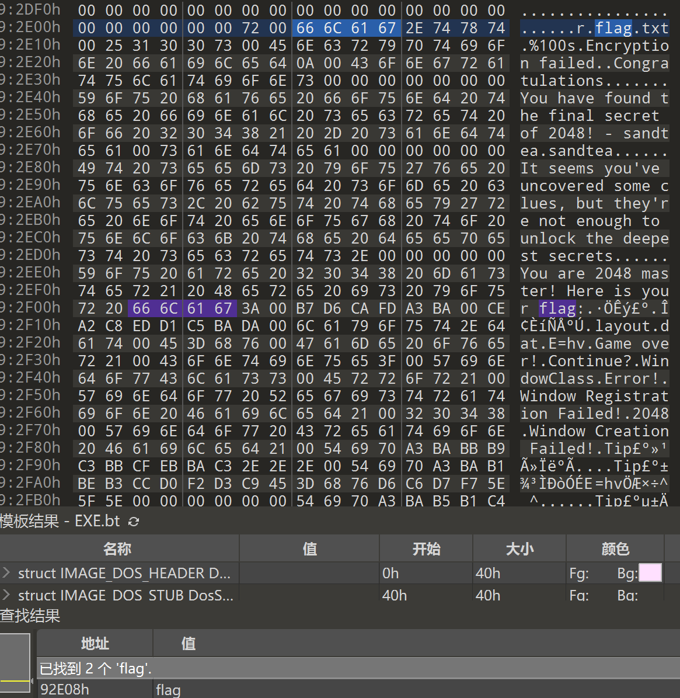
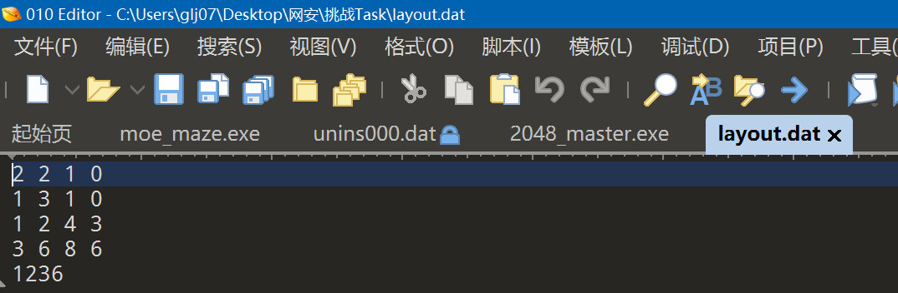
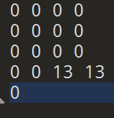
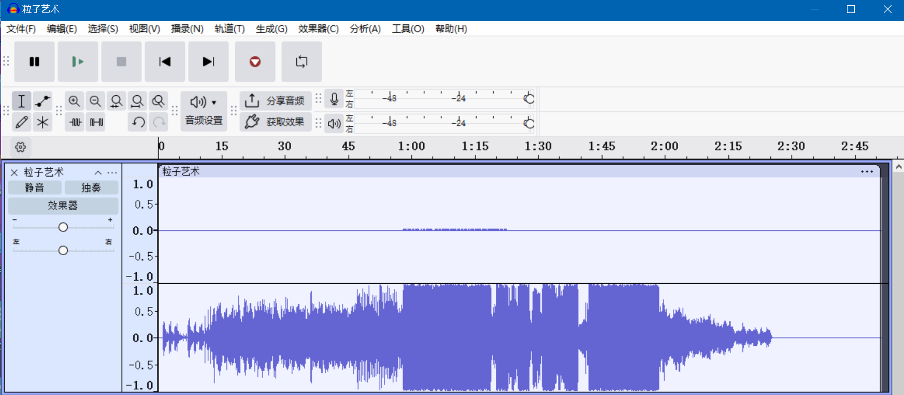
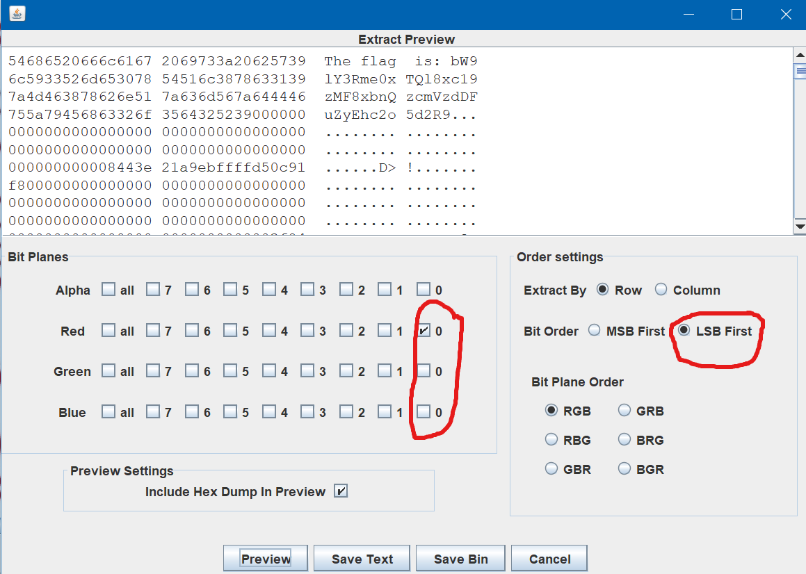

+ 解压得2048_master.exe
+ 运行后显示：
+ 退出，发现layout.dat，内含程序数据
+ 用010editor分别打开2048_master.exe和layout.dat得到：
+ 
+ 
+ 修改layout数据如下：
+ 运行得flag：


## 冲刺，冲刺！你正走在路上，耳边传来这样的声音，还没反应过来，就被撞倒了。

你费劲地爬起来，好像看到了什么信息，回过神来那人早已扬长而去，那我缺的这个道歉这块？

上述文案纯属看图说话，玩个梗，无恶意

+ 解压得rush.gif
+ 截取二维码，在画图3D中打开，用补齐左上角定位点，扫描得flag。


## FLAG就在图中。

什么，你说你看不见 FLAG？注意 CRC！

+ 解压得
+ 使用[随波逐流]CTF编码工具试试修复高宽，意外获得flag。
+ 


## 一只手捂住耳朵 另一只手打开音乐 似乎听到了不一样的声音

flag 形式以moectf{}包裹提交，忽略大小写。

+ 解压得 粒子艺术.wav
+ 用Audacity打开



+ 发现一个声道是摩斯密码
+ 分离声道
+ 保留密码声道并导出。
+ 将导出的MP3文件放入摩尔斯电码音频解码器

[https://morsecodemagic.com/zh/%E6%91%A9%E5%B0%94%E6%96%AF%E7%94%B5%E7%A0%81%E9%9F%B3%E9%A2%91%E8%A7%A3%E7%A0%81%E5%99%A8/](https://morsecodemagic.com/zh/%E6%91%A9%E5%B0%94%E6%96%AF%E7%94%B5%E7%A0%81%E9%9F%B3%E9%A2%91%E8%A7%A3%E7%A0%81%E5%99%A8/)

+ 解得flag。


## 这是一张普通的图片，但是一个个像素看过去似乎有些蹊跷？

+ 解压得xidian.png
+ 题目提示和LSB有关，故选用Stegsolve工具
+ Analyse选择Data Extract
+ 选择LSB First，尝试多种组合得到flag。


解压得：Augustine's Way.md

```markdown
## Augustine's Way

### 75

你有了解过移位密码吗？

`npfdug{f3tz_Bv9v5u1of!}`
```

+ 打开 凯撒密码 加密/解密 - 锤子在线工具[https://www.toolhelper.cn/SymmetricEncryption/CaesarCipher](https://www.toolhelper.cn/SymmetricEncryption/CaesarCipher)
+ 将`npfdug{f3tz_Bv9v5u1of!}`输入
+ 解得`moectf{e3sy_Au9u5t1ne!}`


## 题目

```python
from Crypto.Util.number import *
from gmpy2 import next_prime
from functools import reduce
from secret import flag

assert len(flag) == 38
assert flag[:7] == b'moectf{'
assert flag[-1:] == b'}'

def main():
    # 生成一个512位的大素数p
    p = getPrime(512)
    # 通过从p开始连续计算114514个下一个素数得到q
    q = int(reduce(lambda res, _: next_prime(res), range(114514), p))
    #可以用nextprime
    # 计算n，即p和q的乘积，这是RSA算法中的模数
    n = p * q
    # 选择公钥指数e，这里使用常见的65537
    e = 65537

    # 将flag转换为长整型
    m = bytes_to_long(flag)

    # 使用RSA加密：计算c = m^e mod n
    c = pow(m, e, n)

    # 打印输出n和c
    print(f'{n = }')
    print(f'{c = }')

if __name__ == '__main__':
    main()

"""
n = 96742777571959902478849172116992100058097986518388851527052638944778038830381328778848540098201307724752598903628039482354215330671373992156290837979842156381411957754907190292238010742130674404082688791216045656050228686469536688900043735264177699512562466087275808541376525564145453954694429605944189276397
c = 17445962474813629559693587749061112782648120738023354591681532173123918523200368390246892643206880043853188835375836941118739796280111891950421612990713883817902247767311707918305107969264361136058458670735307702064189010952773013588328843994478490621886896074511809007736368751211179727573924125553940385967
"""
```

解密：实际上，因为 `p` 和 `q` 很接近，直接 Fermat 分解可能更快：

```python
from math import isqrt
from Crypto.Util.number import long_to_bytes
n = 96742777571959902478849172116992100058097986518388851527052638944778038830381328778848540098201307724752598903628039482354215330671373992156290837979842156381411957754907190292238010742130674404082688791216045656050228686469536688900043735264177699512562466087275808541376525564145453954694429605944189276397
c = 17445962474813629559693587749061112782648120738023354591681532173123918523200368390246892643206880043853188835375836941118739796280111891950421612990713883817902247767311707918305107969264361136058458670735307702064189010952773013588328843994478490621886896074511809007736368751211179727573924125553940385967
def fermat_factor(n):
    # 使用费马分解法对整数n进行因数分解
    # 费马分解法的基本思想是将n表示为两个平方数的差：n = a² - b² = (a-b)(a+b)
    # 计算n的整数平方根并加1，作为初始值
    a = isqrt(n) + 1
    # 进入无限循环，直到找到合适的a和b使得n可以表示为平方差
    while True:
        # 计算b² = a² - n
        b2 = a*a - n
        # 计算b²的整数平方根
        b = isqrt(b2)
        # 检查b²是否是完全平方数（即b²是否等于b的平方）
        if b*b == b2:
            # 如果找到，返回两个因数：(a-b)和(a+b)
            return a - b, a + b
        # 如果没找到，增加a的值继续尝试
        a += 1
p, q = fermat_factor(n)
print("p =", p)
print("q =", q)
n = p * q
e = 65537
phi = (p - 1) * (q - 1)
d = pow(e, -1, phi)
m = pow(c, d, n)
print(long_to_bytes(m))
```

解得：p = 9835790642950870702456388102541833011851580184211232019829465812360043670916676289614924432072209183922656300400121695605187082642402117584019839297179867

q = 9835790642950870702456388102541833011851580184211232019829465812360043670916676289614924432072209183922656300400121695605187082642402117584019839337925591

b'**moectf{vv0W_p_m1nu5_q_i5_r34l1y_sm4lI}**'


## 题目

```python
from Crypto.Util.number import *
from secret import flag

assert len(flag) == 35
assert flag[:7] == b'moectf{'
assert flag[-1:] == b'}'

def main():
    # 生成两个512位的大素数p和q
    p = getPrime(512)
    q = getPrime(512)

    # 计算n，即p和q的乘积，这是RSA模数
    n = p * q
    # 设置公钥指数e为65537，这是一个常用的固定值
    e = 65537

    # 将flag转换为长整型
    m = bytes_to_long(flag)

    # 使用RSA加密：计算c = m^e mod n
    c = pow(m, e, n)
    # 计算hint = (p + q)^2 mod n，这是一个提示信息
    hint = pow(p + q, 2, n)

    # 输出n、加密后的密文c和提示hint
    print(f'{n = }')
    print(f'{c = }')
    print(f'{hint = }')

if __name__ == '__main__':
    main()

"""
n = 83917281059209836833837824007690691544699901753577294450739161840987816051781770716778159151802639720854808886223999296102766845876403271538287419091422744267873129896312388567406645946985868002735024896571899580581985438021613509956651683237014111116217116870686535030557076307205101926450610365611263289149
c = 69694813399964784535448926320621517155870332267827466101049186858004350675634768405333171732816667487889978017750378262941788713673371418944090831542155613846263236805141090585331932145339718055875857157018510852176248031272419248573911998354239587587157830782446559008393076144761176799690034691298870022190
hint = 5491796378615699391870545352353909903258578093592392113819670099563278086635523482350754035015775218028095468852040957207028066409846581454987397954900268152836625448524886929236711403732984563866312512753483333102094024510204387673875968726154625598491190530093961973354413317757182213887911644502704780304
"""
```

解密：

```python
from Crypto.Util.number import long_to_bytes
import gmpy2

n = 83917281059209836833837824007690691544699901753577294450739161840987816051781770716778159151802639720854808886223999296102766845876403271538287419091422744267873129896312388567406645946985868002735024896571899580581985438021613509956651683237014111116217116870686535030557076307205101926450610365611263289149
c = 69694813399964784535448926320621517155870332267827466101049186858004350675634768405333171732816667487889978017750378262941788713673371418944090831542155613846263236805141090585331932145339718055875857157018510852176248031272419248573911998354239587587157830782446559008393076144761176799690034691298870022190
hint = 5491796378615699391870545352353909903258578093592392113819670099563278086635523482350754035015775218028095468852040957207028066409846581454987397954900268152836625448524886929236711403732984563866312512753483333102094024510204387673875968726154625598491190530093961973354413317757182213887911644502704780304
e = 65537

# 找 k
for k in range(1, 10):
    val = hint + k * n
    root, exact = gmpy2.iroot(val, 2)
    if exact:
        S = int(root)
        print(f"k = {k}, S = {S}")
        break

# 求 p, q
D2 = S*S - 4*n
D, exact = gmpy2.iroot(D2, 2)
if exact:
    D = int(D)
    p = (S + D) // 2
    q = (S - D) // 2
    assert p * q == n
    print("p =", p)
    print("q =", q)

# 解密
phi = (p - 1) * (q - 1)
d = pow(e, -1, phi)
m = pow(c, d, n)
print(long_to_bytes(m))
```

解得：k = 4, S = 18470541968644424341853360787392124964912376035057025304283994397475806910690870232956788598297125214076864380379470271723684322545326168920856938288029630

p = 10407000088959425169419203940606545581520363832679548727898058943637902824586736063534210492690389402499379844542729949917492266301734929472912145381387041

q = 8063541879684999172434156846785579383392012202377476576385935453837904086104134169422578105606735811577484535836740321806192056243591239447944792906642589

b'moectf{Ma7hm4t1c5_is_@_k1nd_0f_a2t}'

## 1. 已知条件
我们有：

n=p⋅q_n_=_p_⋅_q_hint=(p+q)2modn_hin__t_=(_p_+_q_)2mod_n_c=memodn,e=65537_c_=_m__e_mod_n_,_e_=65537

因为 hint=(p+q)2modn_hin__t_=(_p_+_q_)2mod_n_，且 p+q<n_p_+_q_<_n_（因为 p,q_p_,_q_ 都是 512 位，p+q_p_+_q_ 最多 513 位，而 n_n_ 是 1024 位，所以 p+q<n_p_+_q_<_n_），所以实际上：

hint=(p+q)2_hin__t_=(_p_+_q_)2

因为 (p+q)2<n2(_p_+_q_)2<_n_2，但这里模 n_n_ 之后还是等于 (p+q)2(_p_+_q_)2，只要 (p+q)2<n(_p_+_q_)2<_n_ 就成立。我们来验证一下：

p,q≈2512_p_,_q_≈2512，所以 p+q≈2513_p_+_q_≈2513，平方后约为 2102621026，而 n≈21024_n_≈21024，所以 (p+q)2>n(_p_+_q_)2>_n_，因此不能直接说 hint=(p+q)2_hin__t_=(_p_+_q_)2，需要小心。

---

## 2. 利用 hint 求 p+q_p_+_q_
我们有：

hint≡(p+q)2(modn)_hin__t_≡(_p_+_q_)2(mod_n_)

即：

(p+q)2=hint+kn(_p_+_q_)2=_hin__t_+_kn_

其中 k_k_ 是某个正整数。

因为 p+q≈2n_p_+_q_≈2_n_，数量级是 25132513，平方是 2102621026，而 n≈21024_n_≈21024，所以 k≈21026/21024=22=4_k_≈21026/21024=22=4 左右。因此 k_k_ 很小，我们可以枚举 k_k_。

---

设：

S=p+q_S_=_p_+_q_

那么：

S2=hint+kn_S_2=_hin__t_+_kn_S=hint+kn_S_=_hin__t_+_kn_

我们检查 k_k_ 使得 hint+kn_hint_+_kn_ 为完全平方数，并且 S_S_ 为整数。

