# 一、MISC
## 1.签个到吧
#### 别告诉我你连签到题都不会 flag{xxxxxxxx}

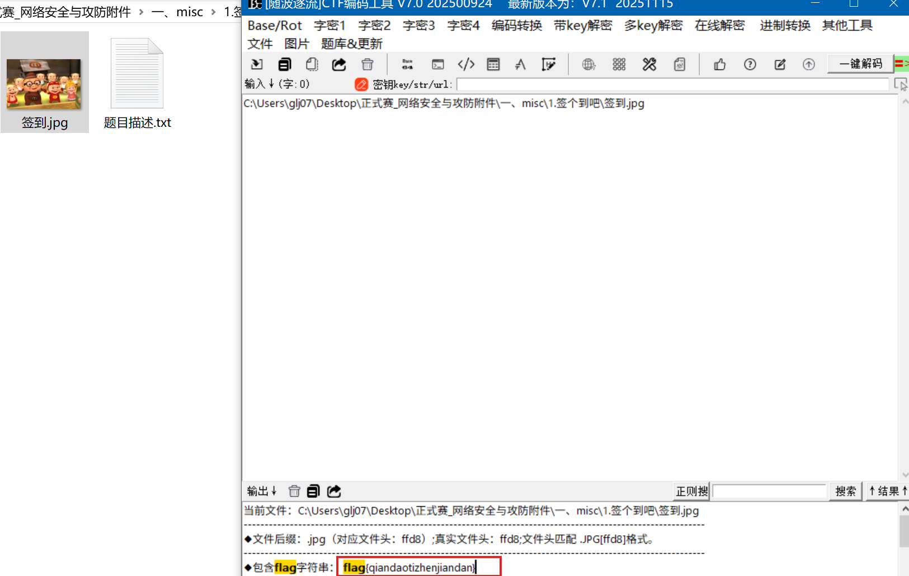

flag{qiandaotizhenjiandan}

## 2.一眼盯帧
#### 什么东西一闪而过了？cdusec{xxxxx}

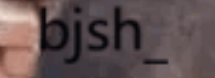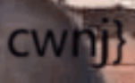

cdusec{dwa_bjsh_cwnj}

## 3.坏图片
#### 图片怎么打不开了 flag{xxxxxxxxx}
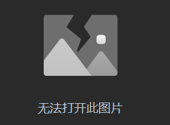

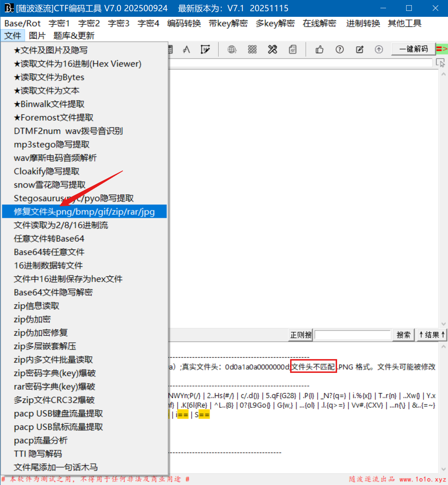

flag{do_you_have_galgame}

旮旯给木

## 4.矮图片
#### 图片下面还有什么 flag{xxxxxxxxx}
随波逐流自动修复高宽

可爱大白


flag{He1l0_d4_ba1}

## 5.黑丝上的flag
#### 是你喜欢的黑丝 BaseCTF{xxxxxxxxx}


直觉Stegsolve应该要出场了

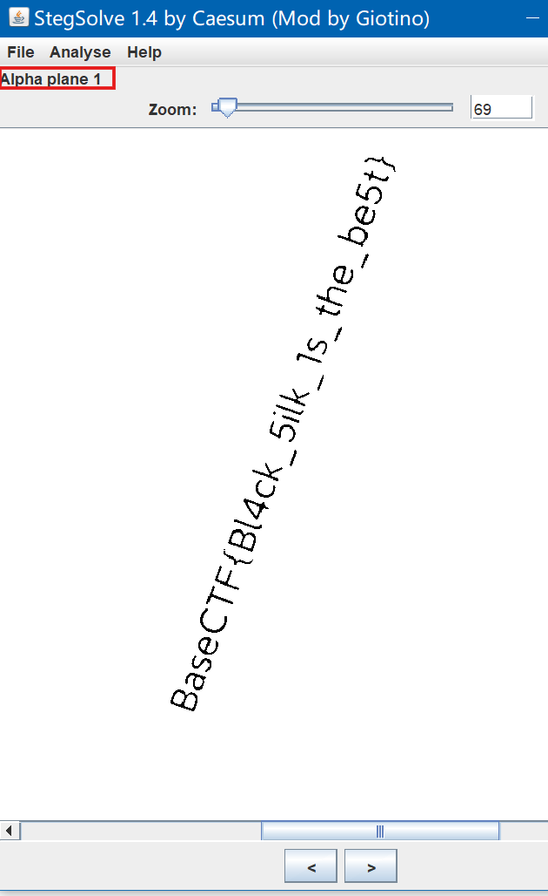

BaseCTF{Bl4ck_5ilk_1s_the_be5t}

## 6.海上遇到了鲨鱼
#### 你会流量分析吧 BaseCTF{xxxxxxxxx}
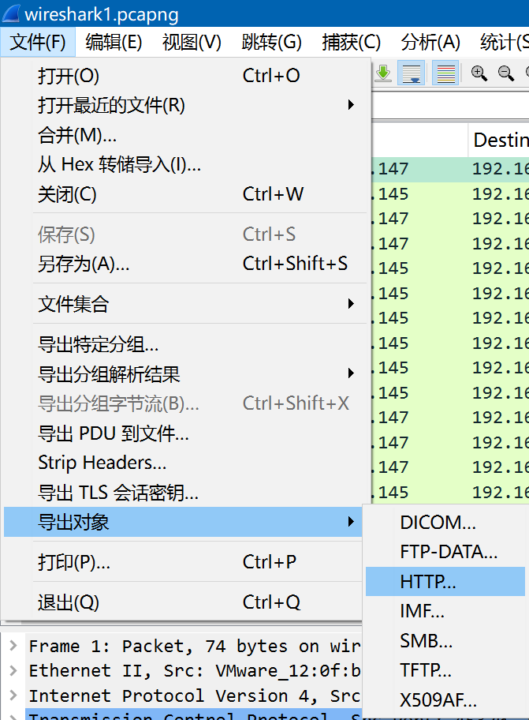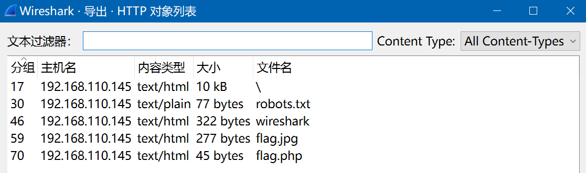

果然有文件，保存查看。答案在flag.php里

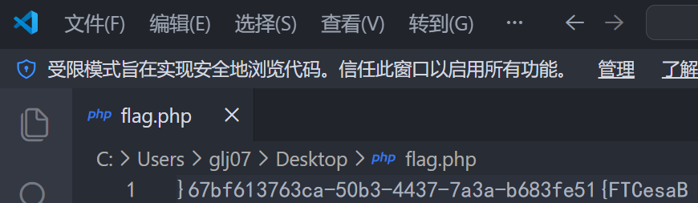

}67bf613763ca-50b3-4437-7a3a-b683fe51{FTCesaB

SRK反转即可

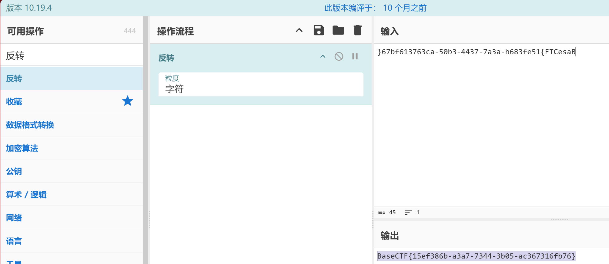

BaseCTF{15ef386b-a3a7-7344-3b05-ac367316fb76}

## 7.海上又遇了鲨鱼
#### 流量分析＋1 BaseCTF{xxxxxxxxx}
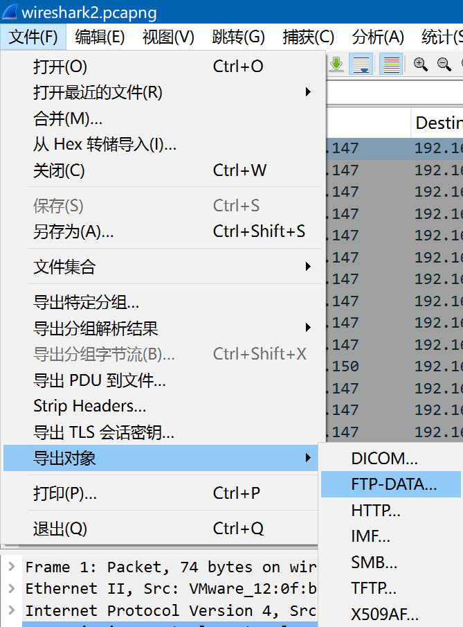

运气不错。

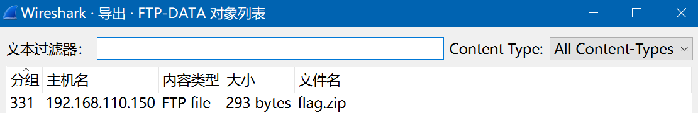

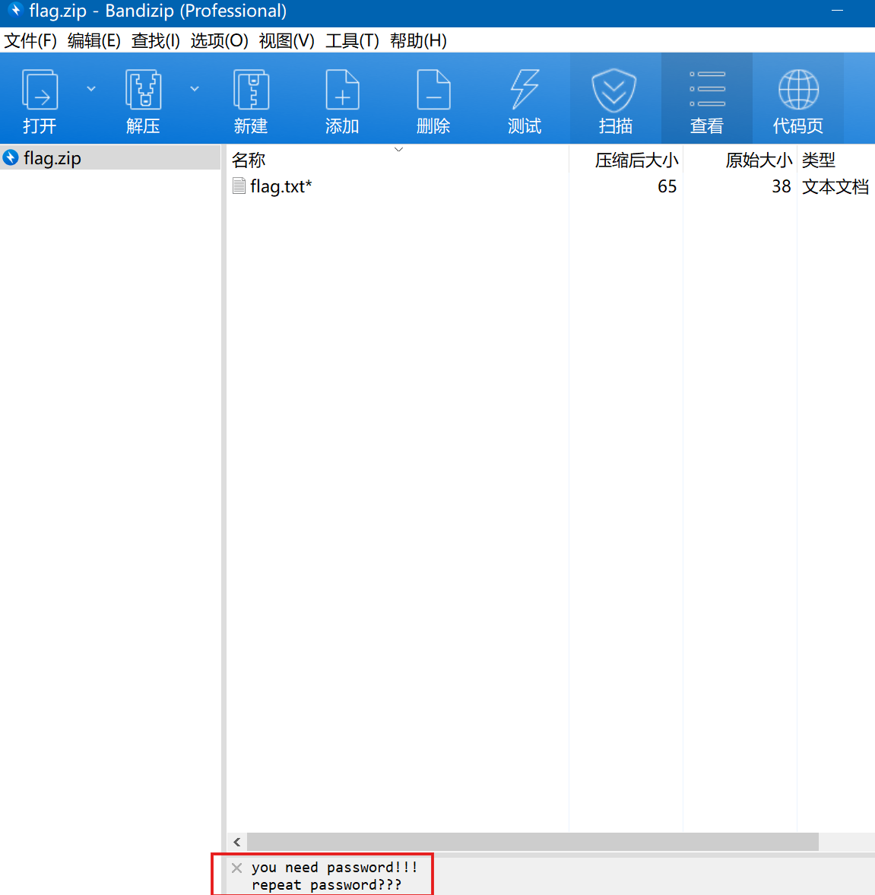

加密压缩包解密

首先查看是不是**伪加密**

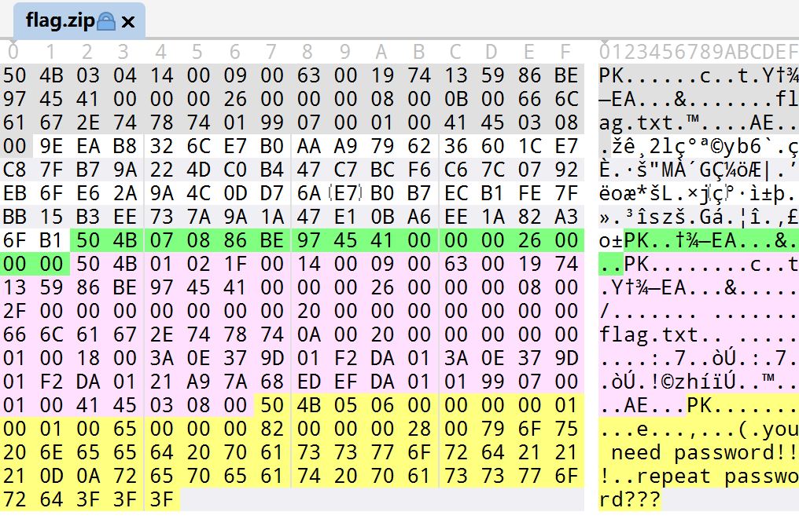

捣鼓一会儿，一无所获。转向原先流量包找线索。

密码其实还是在TCP追踪流里面：

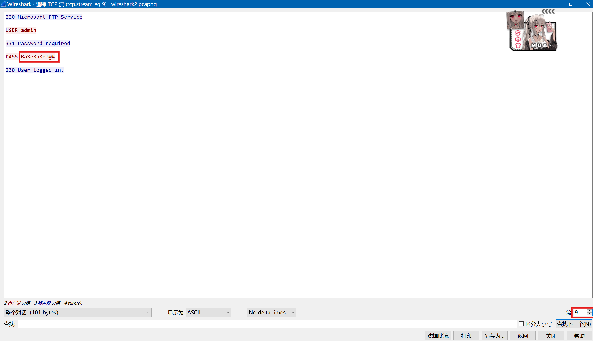

Ba3eBa3e!@#

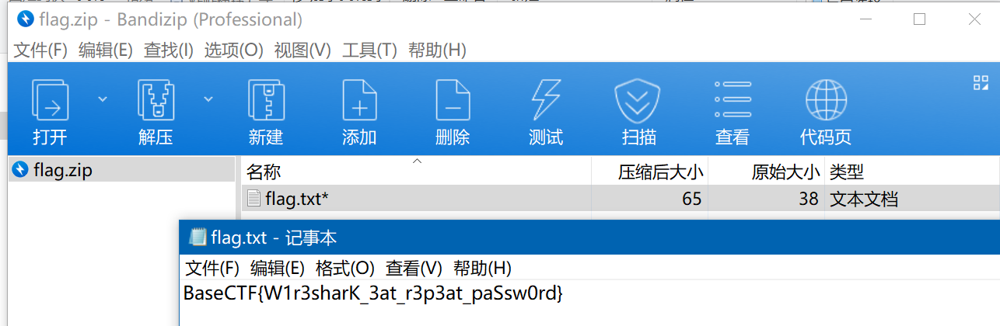

BaseCTF{W1r3sharK_3at_r3p3at_paSsw0rd}

## 8.OSINT
#### 付师兄上学期去四川警察学院交换的时候拍下了这张图片，猜猜这座桥名字是啥吧 flag{xx省xx市xx区xx桥}


我第一反应找图片经纬度信息，然后用bigemap锁定。没发现，只能看图了。

四川。图中出现佳乐酒业、X洲酒店、时光X等信息。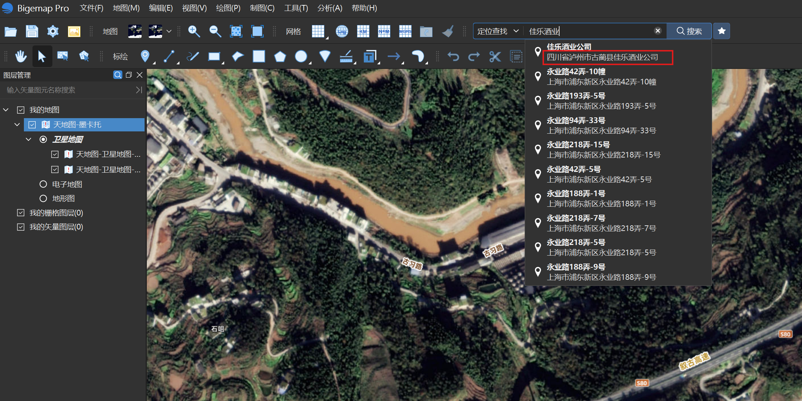

但是离线地图太糊了。附近没看到什么桥。

四川警察学院位于泸州市，确定了市。

接下来搜就行。

flag{四川省泸州市江阳区沱江三桥}

## 9.27262524热身一下
#### 压缩包里还是压缩包 提示：密码6位数 NSSCTF{xxxxxxxxx} 
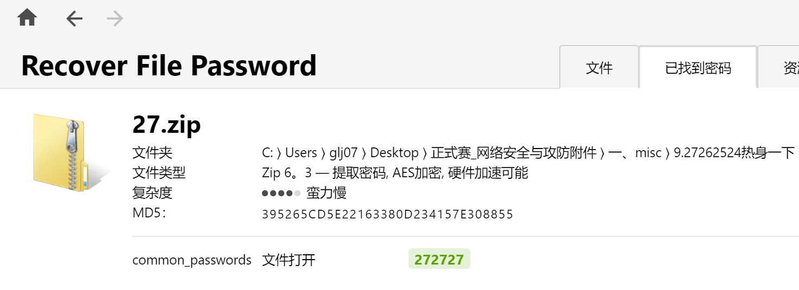

推测下一个解压密码262626。以此类推。套娃套了二十几个压缩包。


好不容易一层层揭开面纱，结果还有隐藏的二维码

需要foremost分离文件

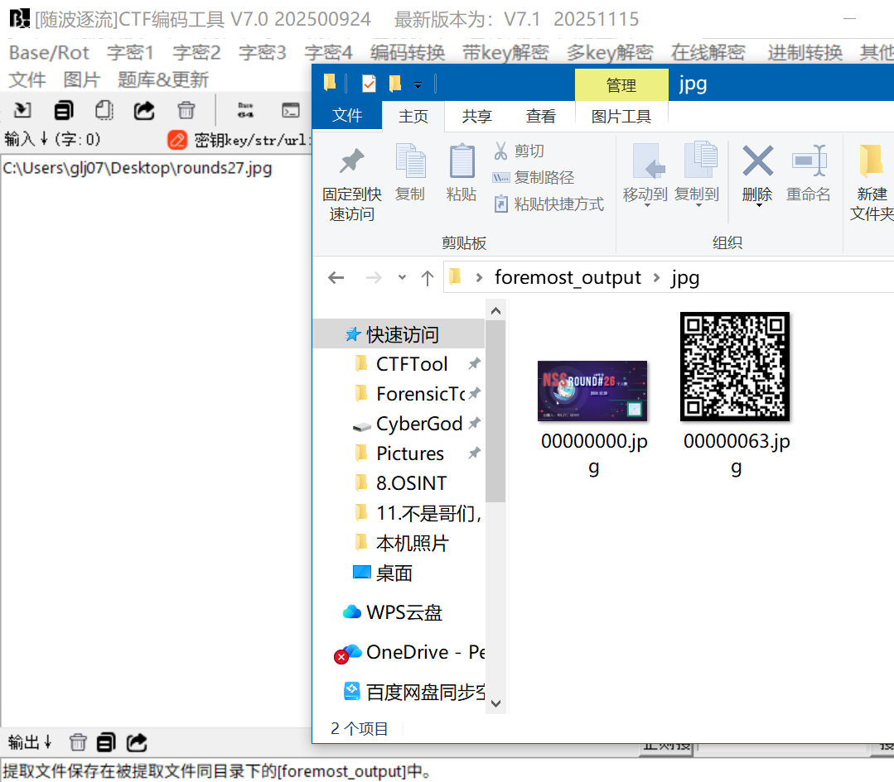

NSSCTF{The_competition_has_so_far_held_26_rounds}

## 10.反方向的雪
#### 雪的英文是什么 flag{xxxxxxxxx}


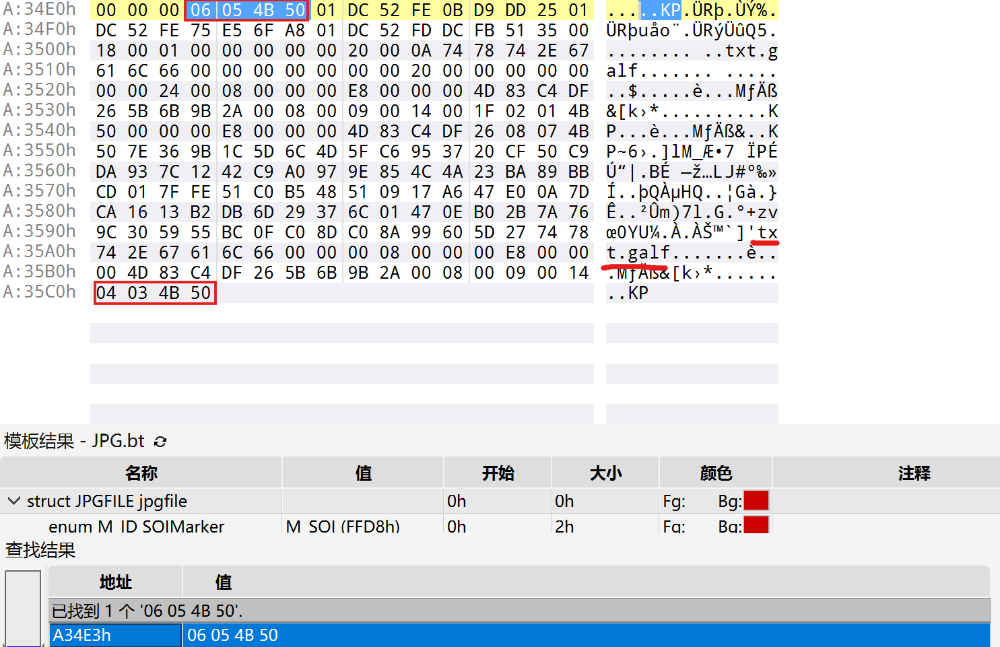

题目提示反方向

反过来看是个zip，内含flag.txt

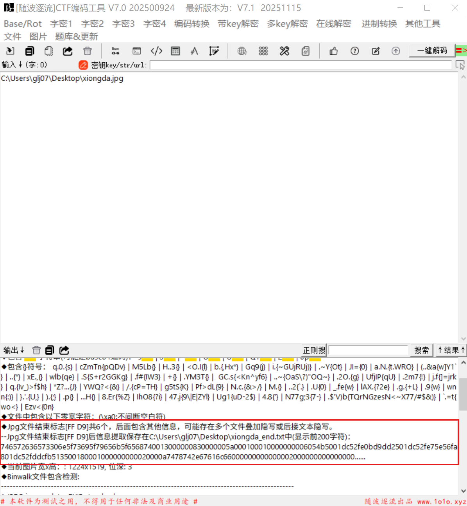

> 746572636573306e5f73695f79656b5f6568740013000000830000005a000100010000000006054b5001dc52fe0bd9dd2501dc52fe75e56fa801dc52fddcfb513500180001000000000020000a7478742e67616c66000000000000002000000000000000240008000000e80000004d83c4df265b6b9b2a000800090014001f02014b50000000e80000004d83c4df2608074b507e369b1c5d6c4d5fc6953720cf50c9da937c1242c9a0979e854c4a23ba89bbcd017ffe51c0b548510917a647e00a7dca1613b2db6d29376c01470eb02b7a769c305955bc0fc08dc08a99605d277478742e67616c6600000008000000e80000004d83c4df265b6b9b2a00080009001404034b50
>

写一个脚本反转

```python
hex_str = "746572636573306e5f73695f79656b5f6568740013000000830000005a000100010000000006054b5001dc52fe0bd9dd2501dc52fe75e56fa801dc52fddcfb513500180001000000000020000a7478742e67616c66000000000000002000000000000000240008000000e80000004d83c4df265b6b9b2a000800090014001f02014b50000000e80000004d83c4df2608074b507e369b1c5d6c4d5fc6953720cf50c9da937c1242c9a0979e854c4a23ba89bbcd017ffe51c0b548510917a647e00a7dca1613b2db6d29376c01470eb02b7a769c305955bc0fc08dc08a99605d277478742e67616c6600000008000000e80000004d83c4df265b6b9b2a00080009001404034b50"
# 反转字节顺序（每两个字符为一个字节）
bytes_list = [hex_str[i:i+2] for i in range(0, len(hex_str), 2)]
reversed_bytes = bytes_list[::-1]
reversed_hex = ''.join(reversed_bytes)
# 转换为二进制数据
binary_data = bytes.fromhex(reversed_hex)
# 写入zip文件
with open('restored.zip', 'wb') as f:
    f.write(binary_data)
print("已生成restored.zip文件")
```

获得压缩包

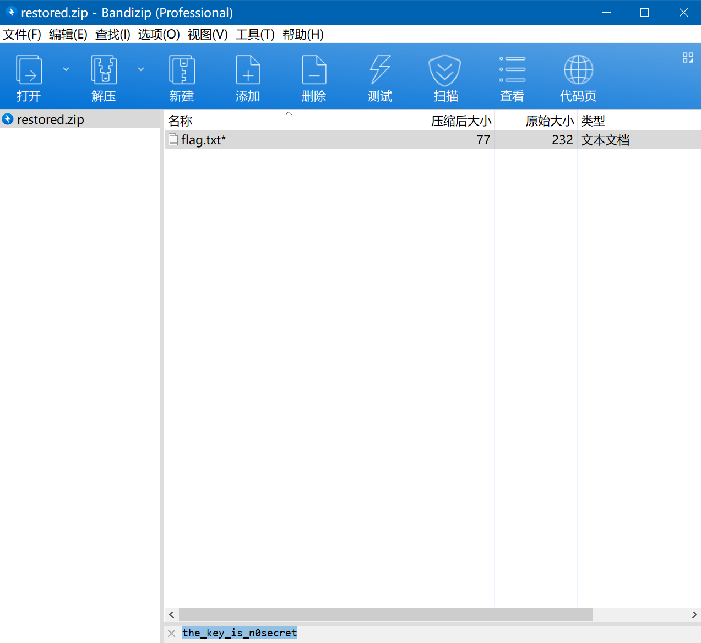

尝试n0secret发现并非解压密码。

爆破：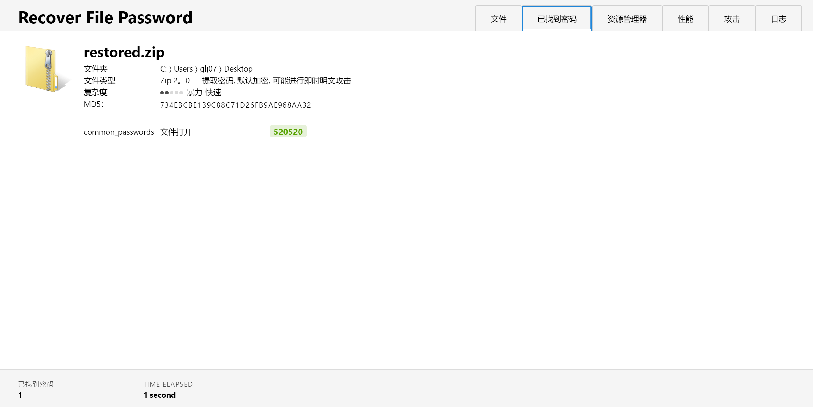520520

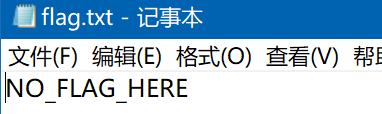

根据题目提示snow加解密。这里附上snow下载链接

[https://gitcode.com/open-source-toolkit/a4d1d/?utm_source=tools_gitcode&index=bottom&type=card&&isLogin=1&isLogin=1](https://gitcode.com/open-source-toolkit/a4d1d/?utm_source=tools_gitcode&index=bottom&type=card&&isLogin=1&isLogin=1)

密码尝试n0secret

```plain
SNOW.EXE -C -p "n0secret" flag.txt 1.txt
```

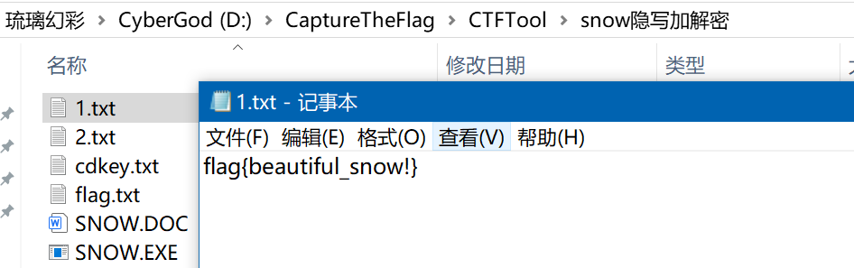

flag{beautiful_snow!}

## 11.不是哥们，一百多页？
#### 图片怎么打不开了 flag{xxxxxxxxx}
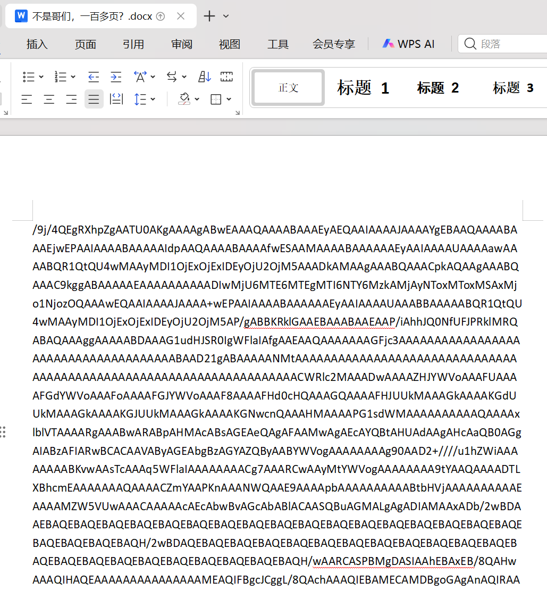

全选，放到赛博大厨，base64解码+渲染图像，解出一个高雅人士。

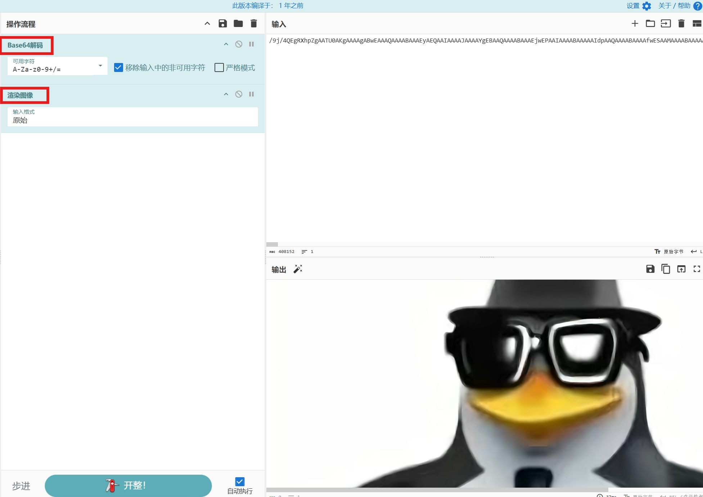

导出jpg


放入随波逐流，发现很多内容。

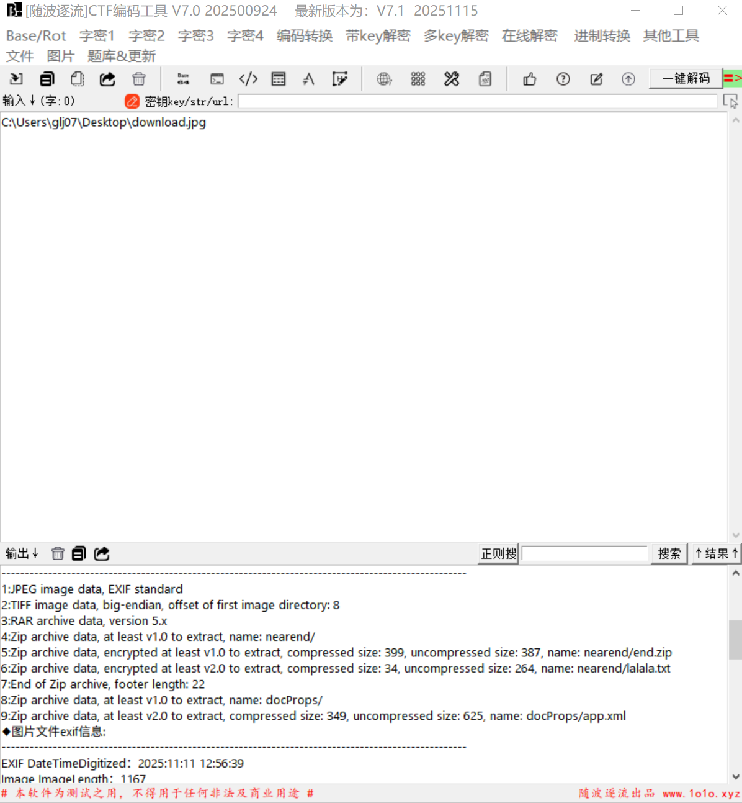

不妨binwalk和foremost都提取一遍。

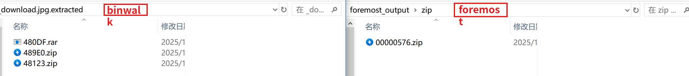

对比两者，似乎binwalk内容更多。但多出的部分是损坏的。有用的“nearend”文件夹两者都有。

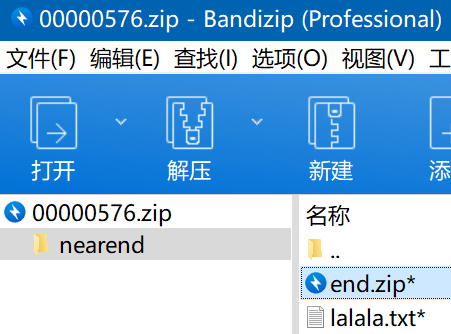

已加密。

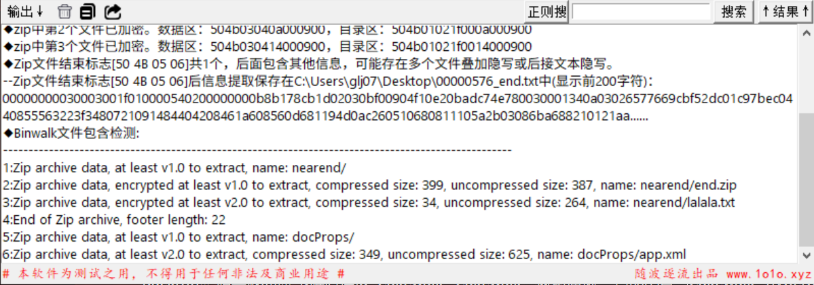

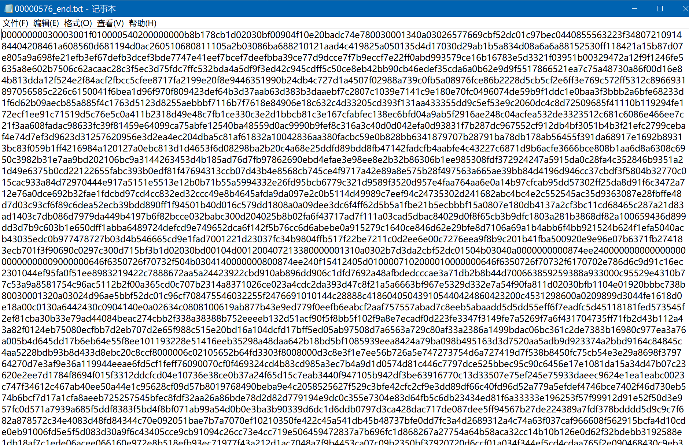

后面的就中式留白一下叭~（其实是做不出没招了）

[00000576_end.txt](2025 警铮杯/file-20260404073352735.txt)[00000576.zip](2025 警铮杯/file-20260404073352822.zip)

# 二、crypto
## 12.ez_rsa
#### 很简单的rsa BaseCTF{xxxxxxxx}
```python
from Crypto.Util.number import *
import gmpy2
m=bytes_to_long(b'BaseCTF{th1s_is_fake_fl4g}')
e=65537
p=getPrime(512)
q=getPrime(512)
n=p*q
not_phi=(p+2)*(q+2)
c=pow(m,e,n)
print(n)
print(not_phi)
print(c)
'''
96557532552764825748472768984579682122986562613246880628804186193992067825769559200526147636851266716823209928173635593695093547063827866240583007222790344897976690691139671461342896437428086142262969360560293350630096355947291129943172939923835317907954465556018515239228081131167407674558849860647237317421
96557532552764825748472768984579682122986562613246880628804186193992067825769559200526147636851266716823209928173635593695093547063827866240583007222790384900615665394180812810697286554008262030049280213663390855887077502992804805794388166197820395507600028816810471093163466639673142482751115353389655533205
37077223015399348092851894372646658604740267343644217689655405286963638119001805842457783136228509659145024536105346167019011411567936952592106648947994192469223516127472421779354488529147931251709280386948262922098480060585438392212246591935850115718989480740299246709231437138646467532794139869741318202945
'''
```

```python
from Crypto.Util.number import *
import gmpy2 #运用库可以精简计算
# 从注释中获取的实际值
n = 96557532552764825748472768984579682122986562613246880628804186193992067825769559200526147636851266716823209928173635593695093547063827866240583007222790344897976690691139671461342896437428086142262969360560293350630096355947291129943172939923835317907954465556018515239228081131167407674558849860647237317421
not_phi = 96557532552764825748472768984579682122986562613246880628804186193992067825769559200526147636851266716823209928173635593695093547063827866240583007222790384900615665394180812810697286554008262030049280213663390855887077502992804805794388166197820395507600028816810471093163466639673142482751115353389655533205
c = 37077223015399348092851894372646658604740267343644217689655405286963638119001805842457783136228509659145024536105346167019011411567936952592106648947994192469223516127472421779354488529147931251709280386948262922098480060585438392212246591935850115718989480740299246709231437138646467532794139869741318202945
e = 65537
# 计算p+q
# not_phi = (p+2)*(q+2) = p*q + 2p + 2q + 4 = n + 2(p+q) + 4
# 所以 (p+q) = (not_phi - n - 4) / 2
s = (not_phi - n - 4) // 2
# 现在我们有 n = p*q 和 s = p+q
# 所以 p 和 q 是方程 x² - s*x + n = 0 的根（韦达定理~）
# 计算判别式德尔塔 D = s² - 4n
D = s**2 - 4*n
# 计算平方根
sqrt_D = gmpy2.isqrt(D)
# 验证一下平方根是否正确
if sqrt_D**2 != D:
    print("错误：判别式不是完全平方数")
else:
    # 计算p和q
    p = (s + sqrt_D) // 2
    q = (s - sqrt_D) // 2
    # 验证p*q是否等于n
    if p*q != n:
        print("错误：p*q != n")
    else:
        # 计算欧拉函数 φ(n) = (p-1)*(q-1)
        phi = (p-1)*(q-1)
        # 计算私钥d，d是e在模phi下的逆元
        d = gmpy2.invert(e, phi)
        # 解密密文c，m = c^d mod n
        m = pow(c, d, n)
        # 将明文转换为bytes
        flag = long_to_bytes(m)
        print(flag.decode())
```

BaseCTF{it_1s_ez!!}

## 13.Is this only base
#### 不仅仅是base flag{xxxxxxxx}
> cSF3MCFsZiFycSF7XyF3M31wZ2U0X3NmX2Q=
>
> 这是今年的第11月呢
>

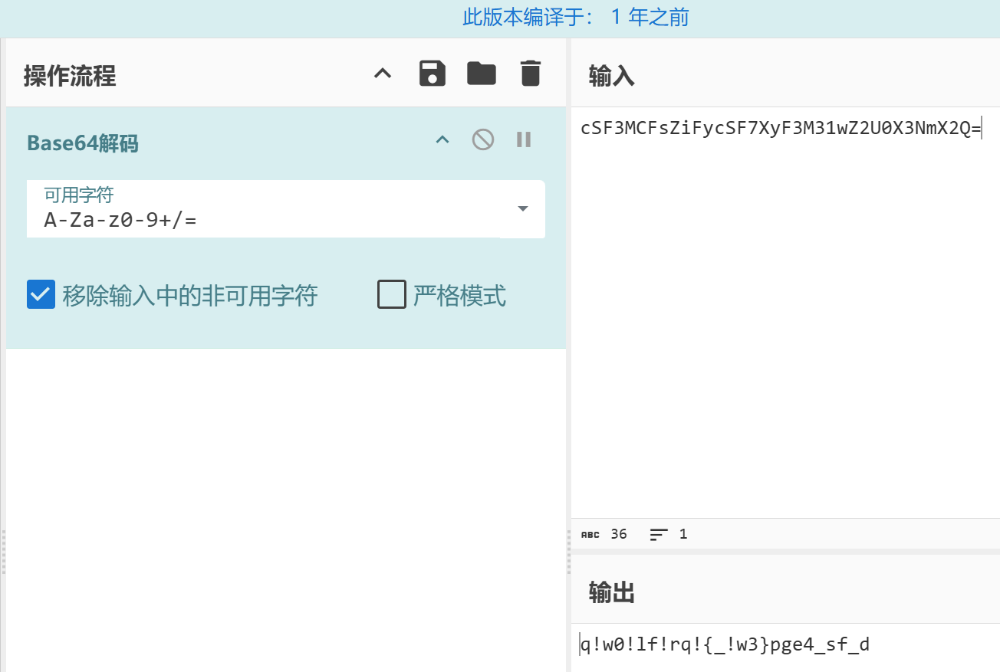

> q!w0!lf!rq!{_!w3}pge4_sf_d
>

没有flag，但是有了{}。可能和凯撒密码有关。题目提示11，解密时设置偏移量-11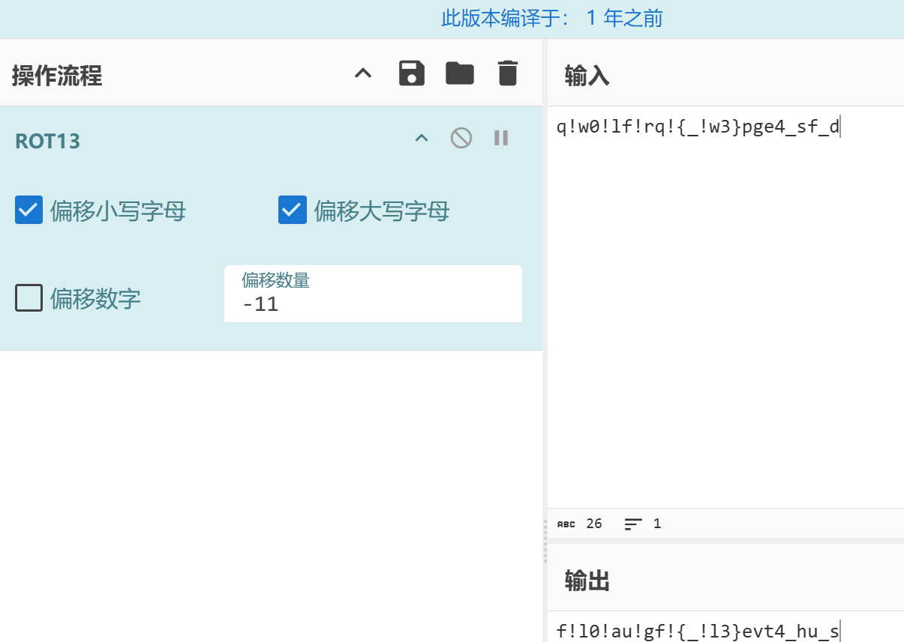

> f!l0!au!gf!{_!l3}evt4_hu_s
>

猜测和栅栏密码有关。解密后在第11栏获得flag：

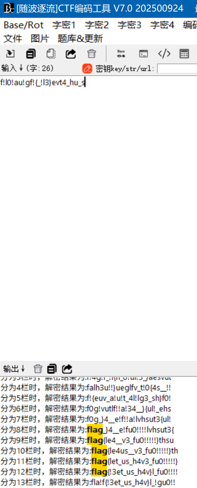

flag{let_us_h4v3_fu0!!!!!}

## 14.异或
#### 很简单的异或 flag{xxxxxxxx}
```python
x = 'flag我也不知道'
key = 3
secret=''
for i in x:
    secret += chr(key^(ord(i)))
print(secret)
# 告诉你secret吧：secret=eobdxfy\{lq~
```

```python
secret = 'eobdxfy{lq~'
key = 3
plain = ''
for c in secret:
    plain += chr(ord(c) ^ key)
print(plain)
```

flag{ezxor}

# 三、reverse
## 15.You are good at ida
#### 很简单的reverse flag{xxxxxxxx}
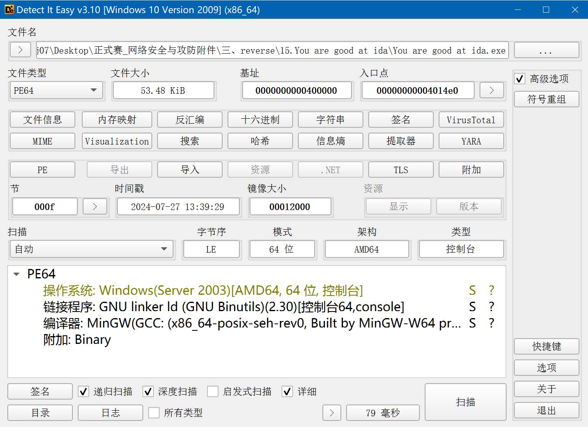

用IDA64位打开：

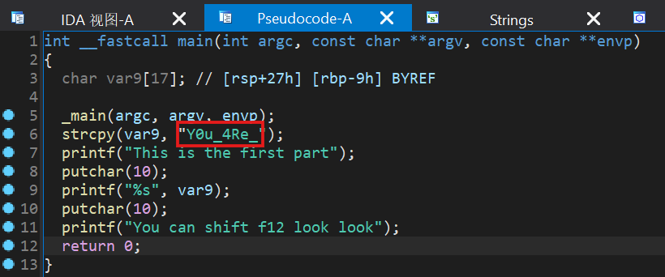

Shift+F12查看字符串。双击。

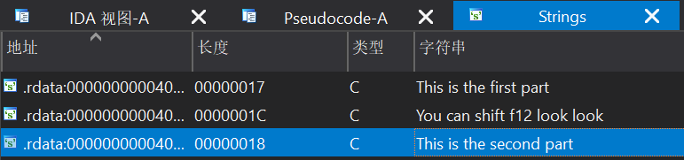

定位到数据，双击“second”。

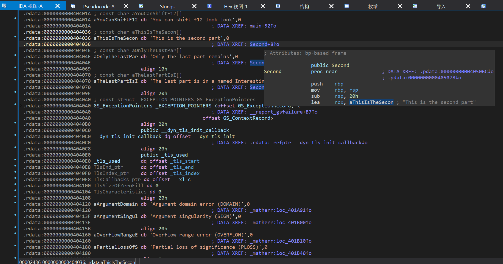

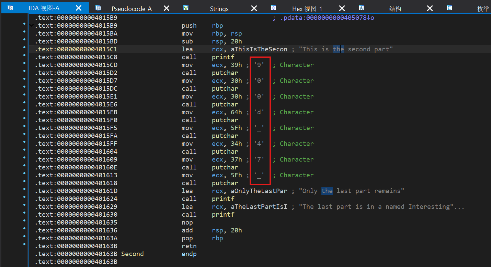

最后部分在interesting。其实就在正下方。

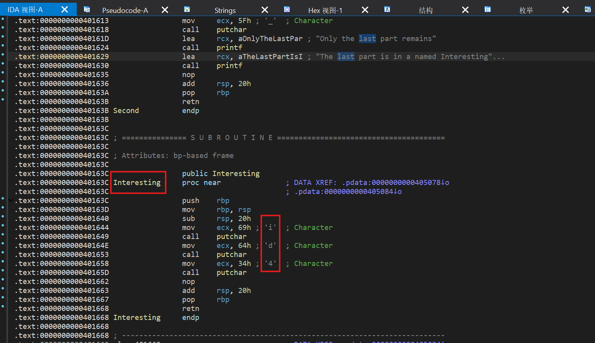

flag{Y0u_4Re_900d_47_id4}

## 16.UPX mini
#### Do you know upx ? BaseCTF{xxxxxxxx}
没难度，直接upx脱壳exe

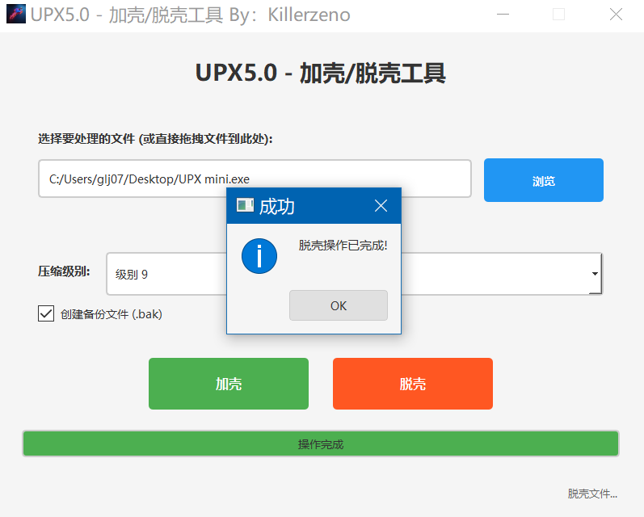

打开ida查看即可

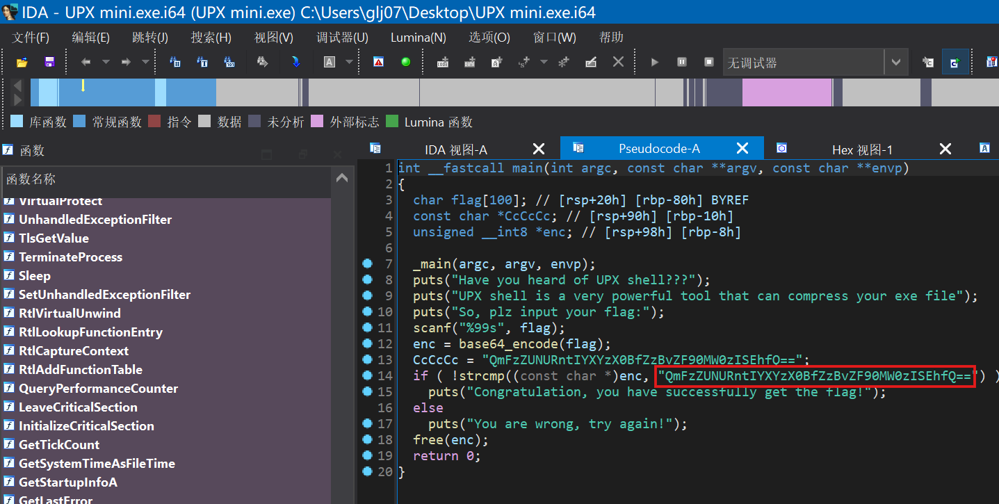

显然base64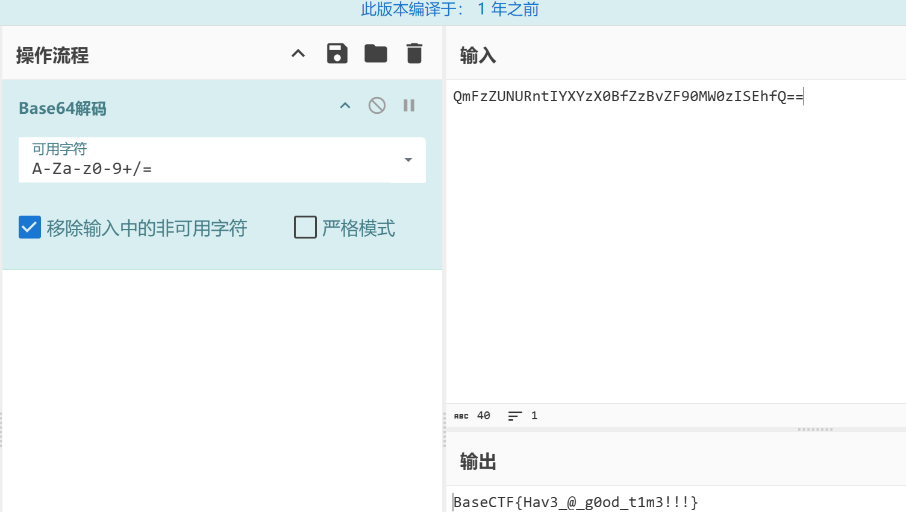BaseCTF{Hav3_@_g0od_t1m3!!!}


