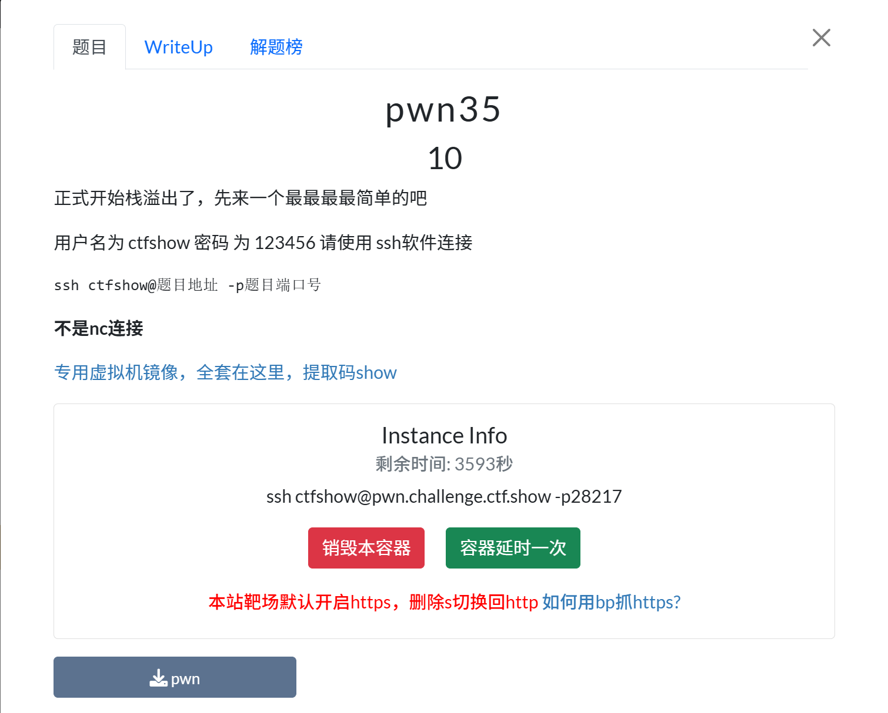
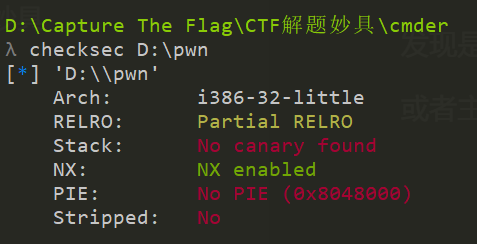
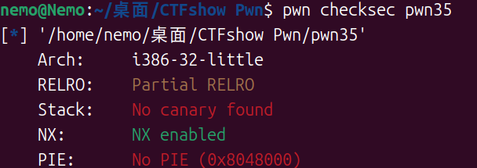
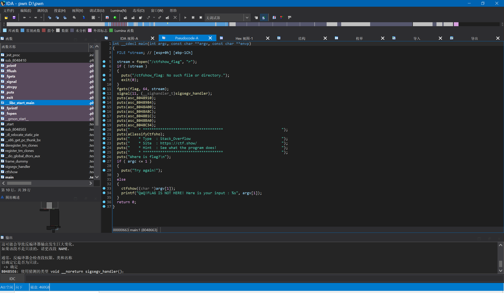

主机cmder看：

或者把[pwn](https://so.csdn.net/so/search?q=pwn&spm=1001.2101.3001.7020)文件拖进虚拟机加上可执行权限，使用checksec命令查看文件的信息。

1.cd "/home/nemo/桌面/CTFshow Pwn"

2.chmod +x pwn35

3.ls (即 list directory contents，列出目前工作目录所含的文件及子目录)

4. pwn checksec pwn35

发现是32位的，并且RELRO 与 NX保护开启。

放入ida-32位

ssh ctfshow@pwn.challenge.ctf.show -p28217

