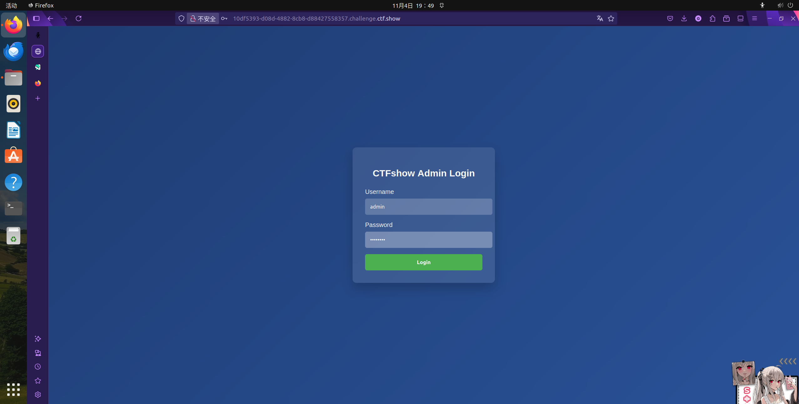
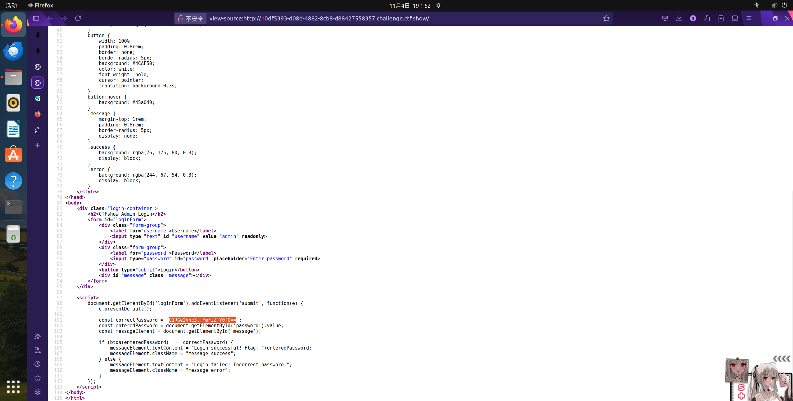
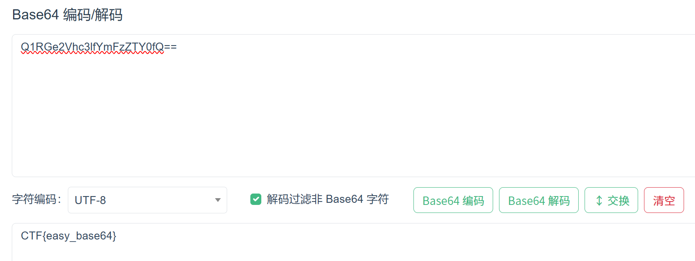
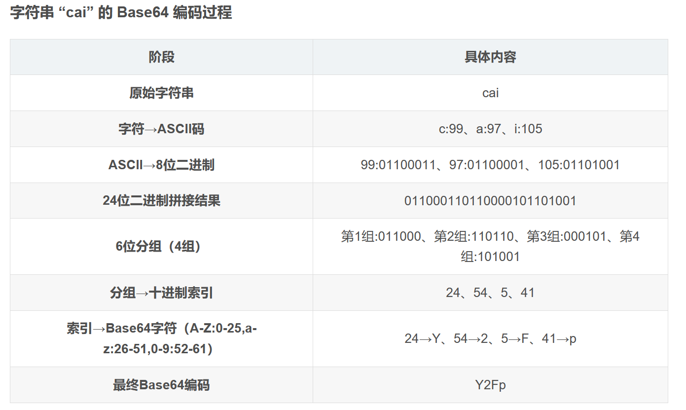
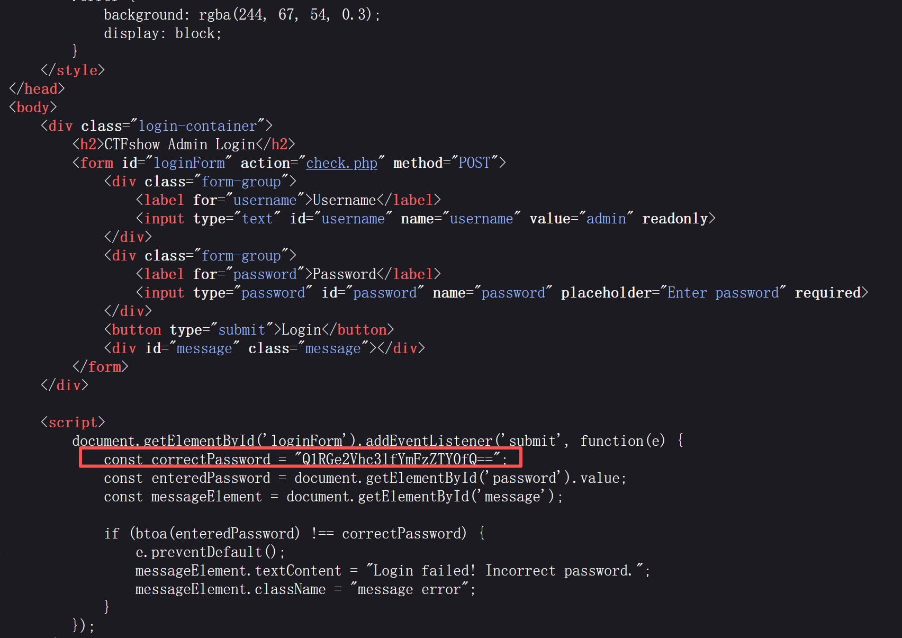
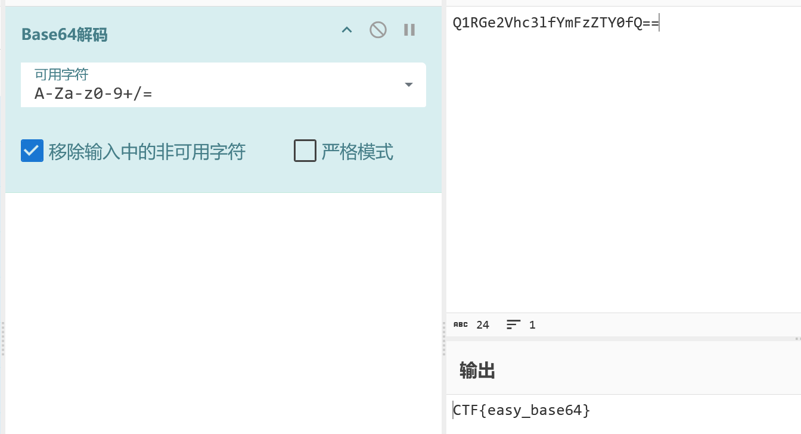
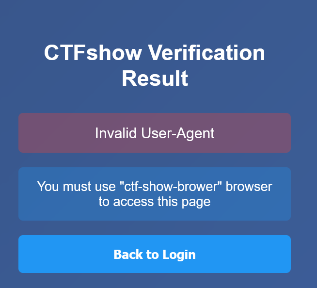
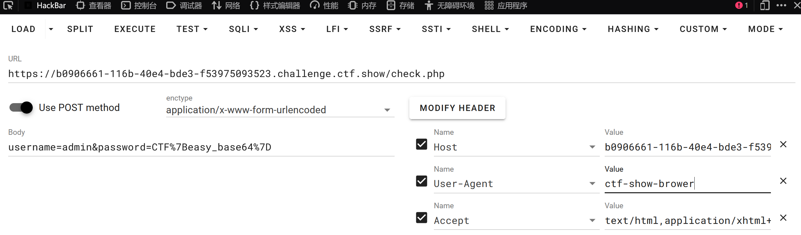
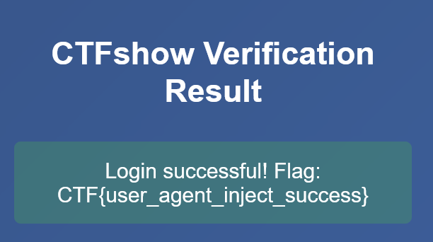
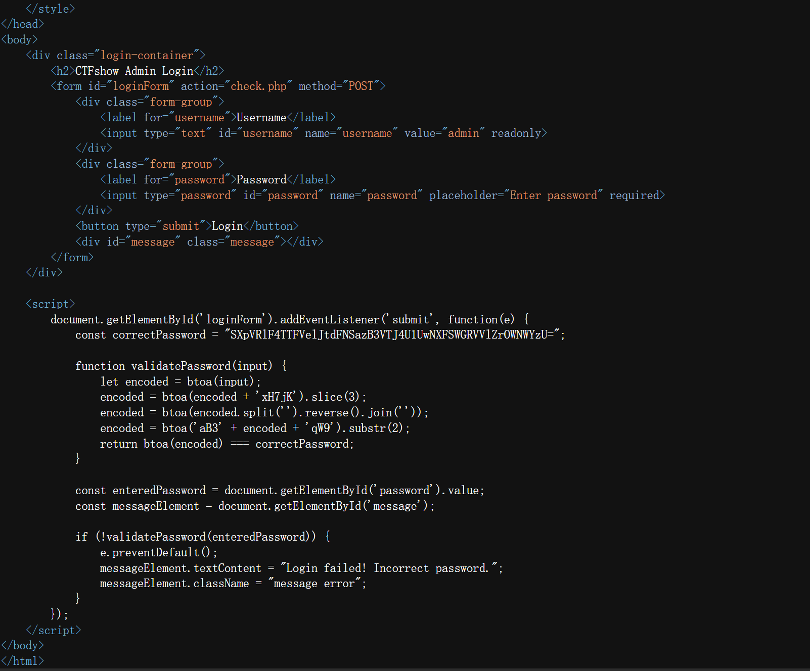

## Base64编码隐藏

平时只知道解码，不知道base怎么来的。这里找了一个base64的具体过程：

CTF{easy_base64}
## HTTP头注入


密码：CTF{easy_base64}

修改UA为ctf-show-brower


CTF{user_agent_inject_success}
## Base64多层嵌套解码



```
    document. getElementById('loginForm').addEventListener('submit', function(e) {
    const correctPassword = "SXpVR1F4TTFVe1JtdFNSazB3VTJ4U1UwNXFSWGRVV1ZrOWNWYzU=";
    function validatePassword(input){
	    let encoded = btoa(input);
	    encoded = btoa(encoded + 'xH7jK').slice(3);
	    encoded = btoa(encoded.split('').reverse(). join(''));
	    encoded = btoa('aB3' + encoded + 'qW9'). substr(2);
	    return btoa(encoded) === correctPassword;
    }
    const enteredPassword = document.getElementById('password').value;
    const messageElement = document.getElementById('message');
    if (!validatePassword (enteredPassword)){
	    e. preventDefault();
	    messageElement. textContent = "Login failed! Incorrect password.";
	    messageElement. className = "message error";
    }
    });

```
