## Base64编码隐藏
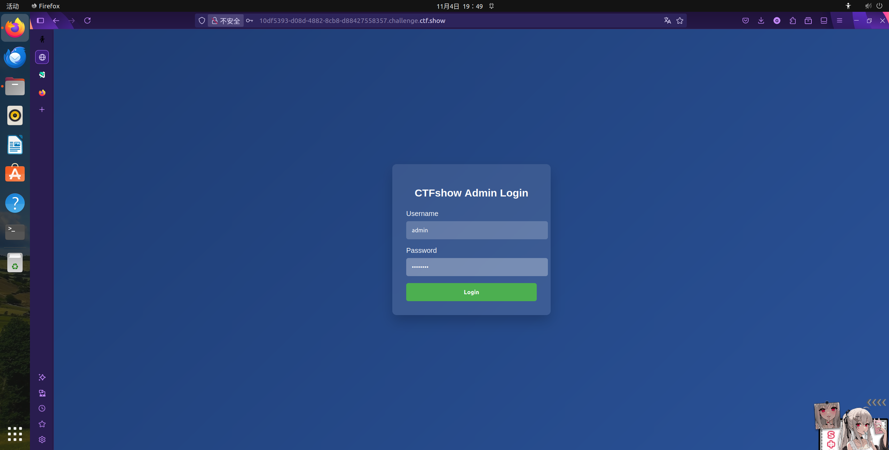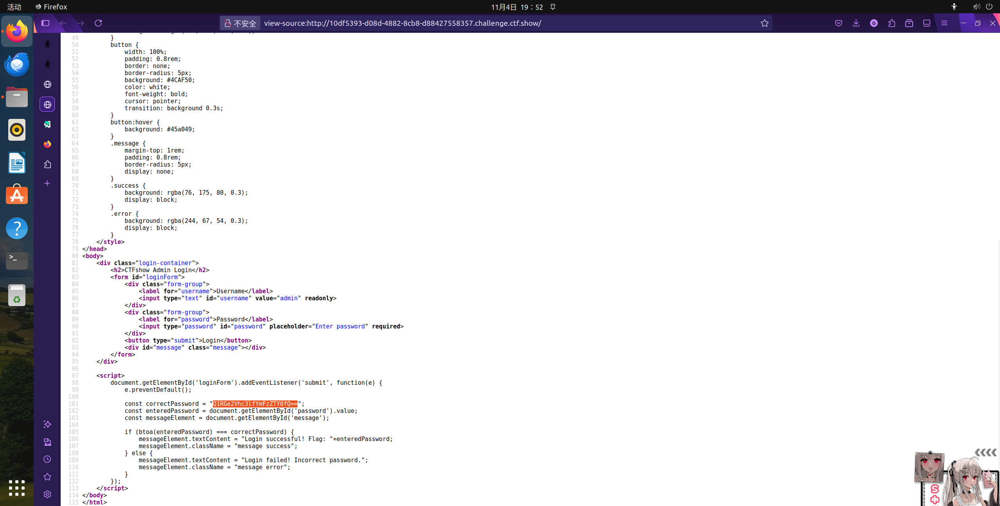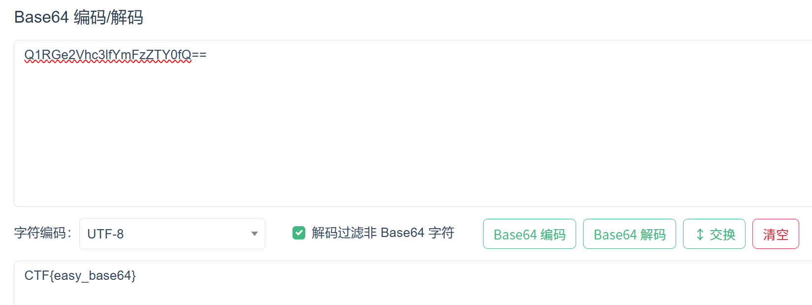
平时只知道解码，不知道base怎么来的。这里找了一个base64的具体过程：
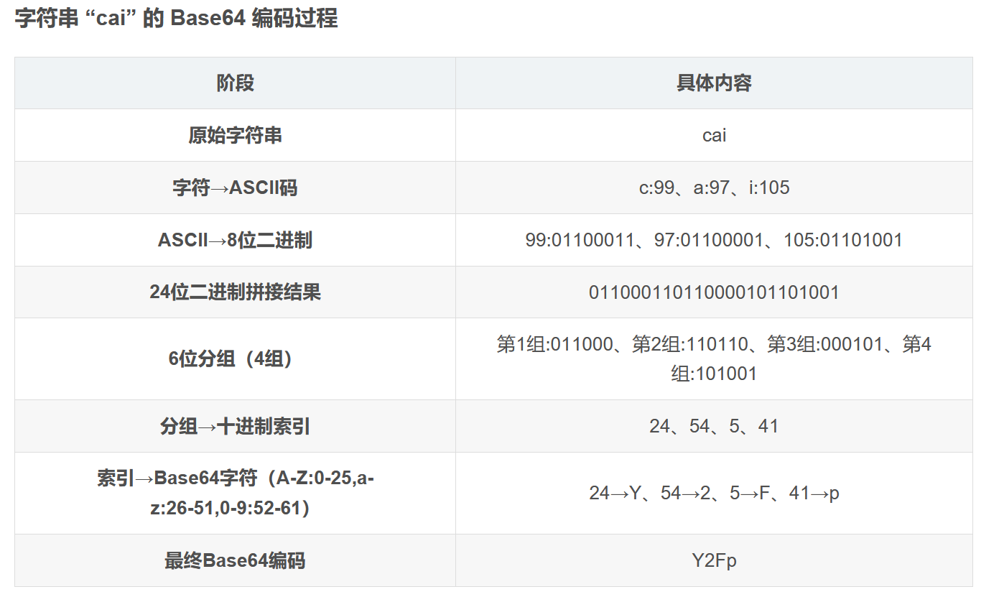
CTF{easy_base64}
## HTTP头注入

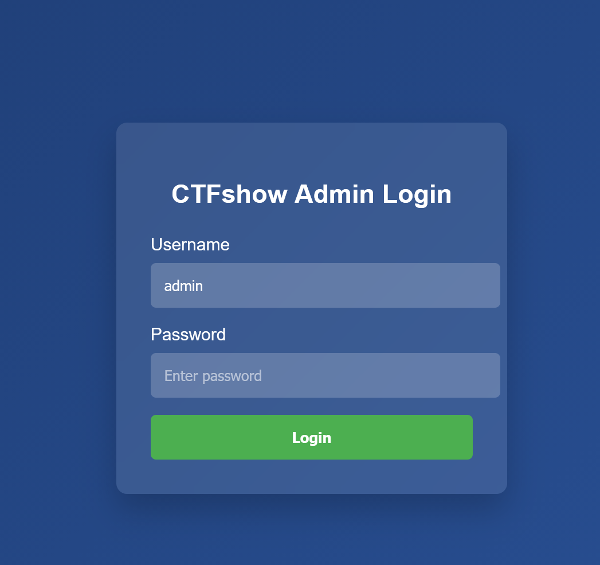
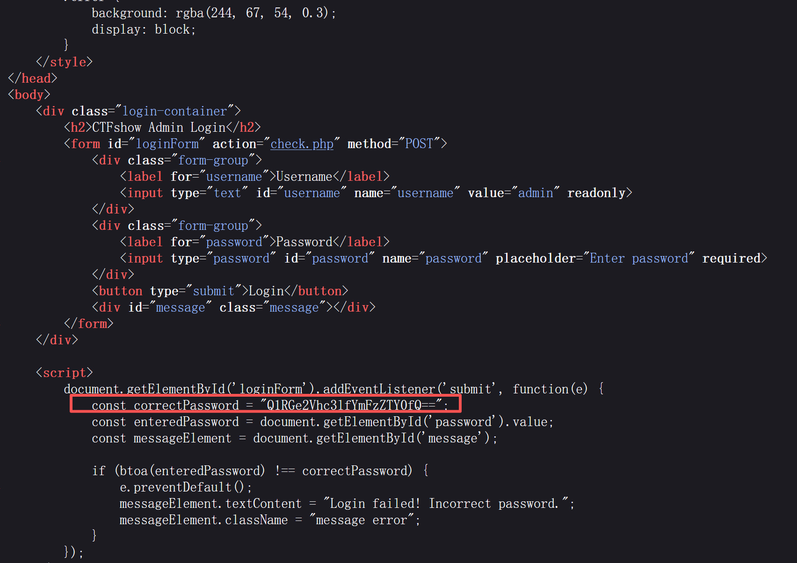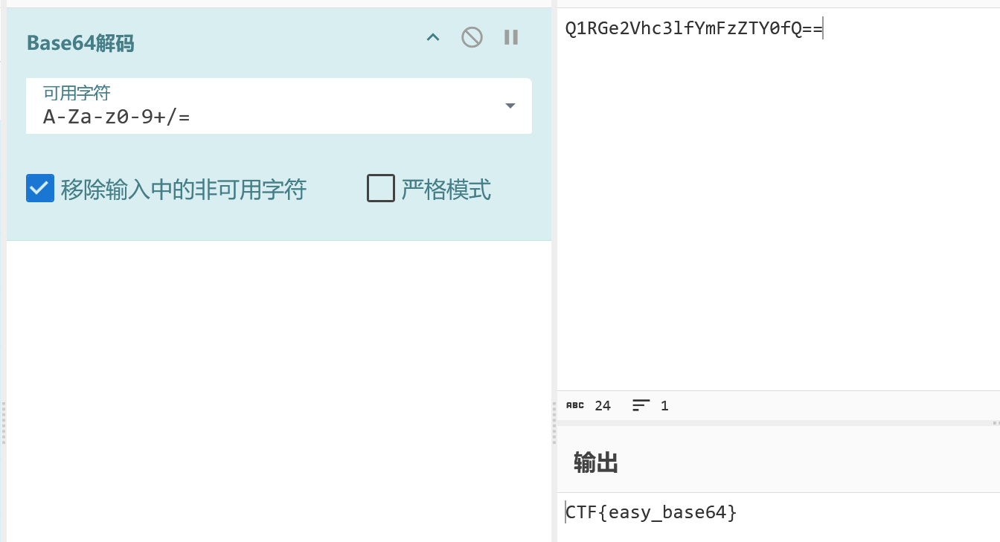密码：CTF{easy_base64}
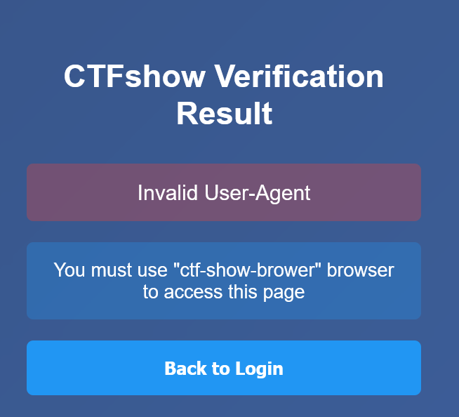
修改UA为ctf-show-brower
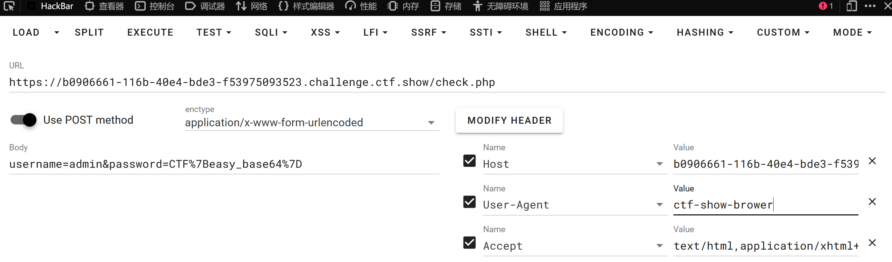
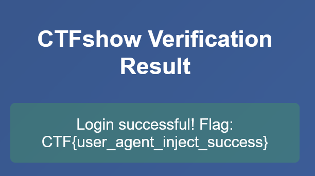
CTF{user_agent_inject_success}
## Base64多层嵌套解码
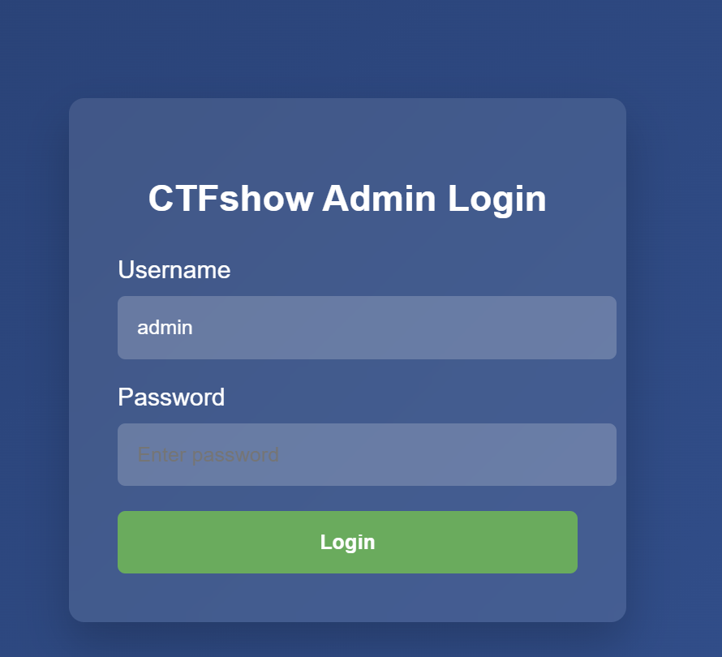

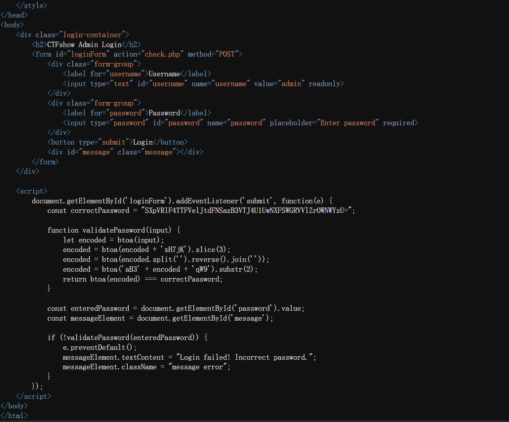
```
    document. getElementById('loginForm').addEventListener('submit', function(e) {
    const correctPassword = "SXpVRlF4TTFVelJtdFNSazB3VTJ4U1UwNXFSWGRVVlZrOWNWYzU=";
    function validatePassword(input){
	    let encoded = btoa(input);
	    encoded = btoa(encoded + 'xH7jK').slice(3);
	    encoded = btoa(encoded.split('').reverse(). join(''));
	    encoded = btoa('aB3' + encoded + 'qW9'). substr(2);
	    return btoa(encoded) === correctPassword;
    }
    const enteredPassword = document.getElementById('password').value;
    const messageElement = document.getElementById('message');
    if (!validatePassword (enteredPassword)){
	    e. preventDefault();
	    messageElement. textContent = "Login failed! Incorrect password.";
	    messageElement. className = "message error";
    }
    });

```
考点是 JS 逆向。
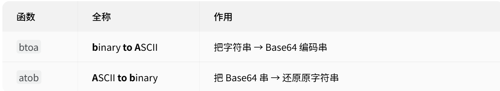
注意：
**binary = 原始字节数据**：JavaScript 的字符串底层就是一串字节（每个字符本质是 0~255 的数值）。这些字节可能是：

可打印字符（H、e、l…）
不可打印的（换行符 \n、空字节 \x00、乱码 \xFF…）

对计算机来说，它们都是数据、都是字节流，所以统称 "binary"（二进制数据）。

btoa("Hello") 的输入就是这 5 个字节：48 65 6C 6C 6F。

**ASCII = 编码后的可打印文本**
因为 Base64 编码后的结果，只使用 ASCII 字符集中的 64 个可打印字符：
`A-Z  a-z  0-9  +  /   =`

解读题目代码：
```
encoded = btoa(input);                          // 1. 密码先 base64
encoded = btoa(encoded + 'xH7jK').slice(3);     // 2. 拼盐再 base64（在密码学中，通过在密码任意固定位置插入特定字符串，让散列后的结果和使用原始密码的散列结果不相符，这样一个过程我们称之为“加盐”）；slice(3)指从第 3 个索引开始拿（对应第 4 个字符），也就是丢弃了前 3 个字符。为什么错开一位？因为索引从 0 开始数，而人说话习惯从 1 开始数
encoded = btoa(encoded.split('').reverse().join('')); // 3.split('')拆成单个字符数组，.reverse()数组倒序，.join('') 拼回字符串。这三步合起来的效果就是：字符串整体反转。最后再 base64 编码
encoded = btoa('aB3' + encoded + 'qW9').substr(2);    // 4. 加前后缀再 base64，砍掉前2字符
return btoa(encoded) === correctPassword;       // 5. 最后再 base64 一次比较
```
**substr和slice的区别：**

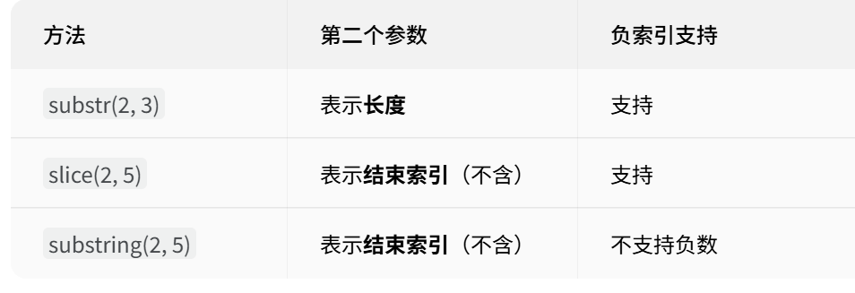
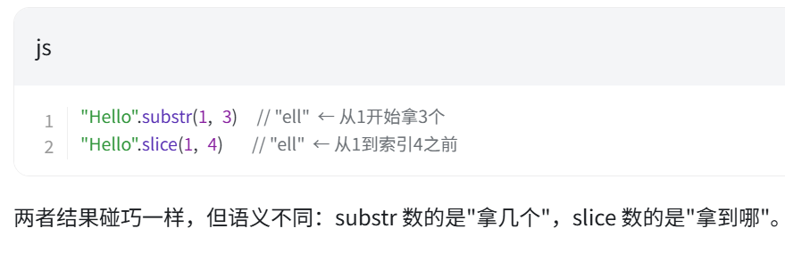
开始解答：
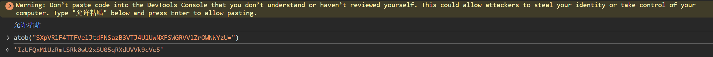
'IzUFQxM1UzRmtSRk0wU2xSU05qRXdUVVk9cVc5'


密码：#A7316
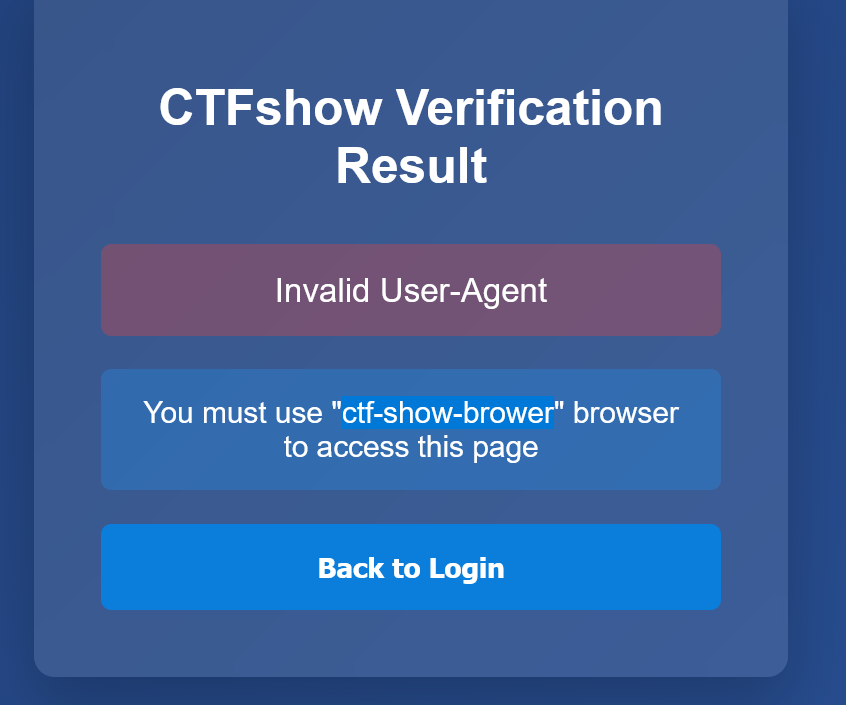

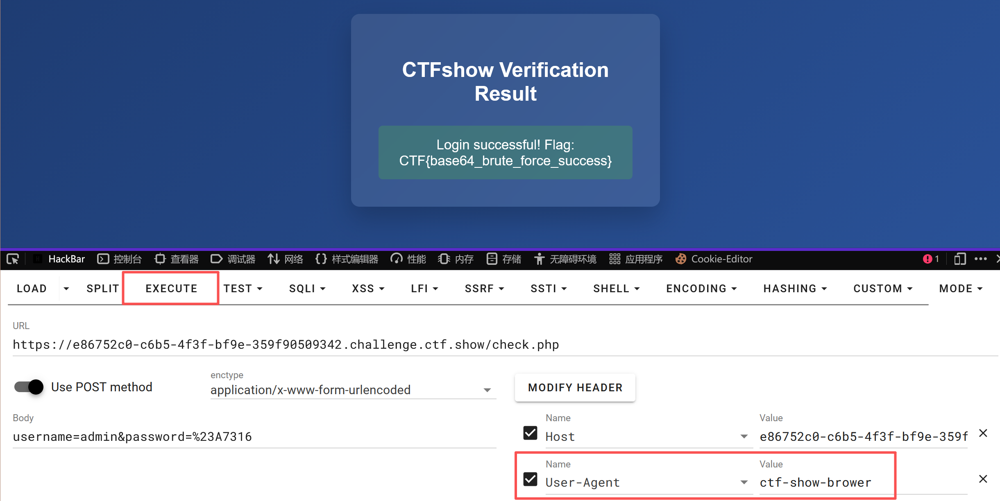

CTF{base64_brute_force_success}