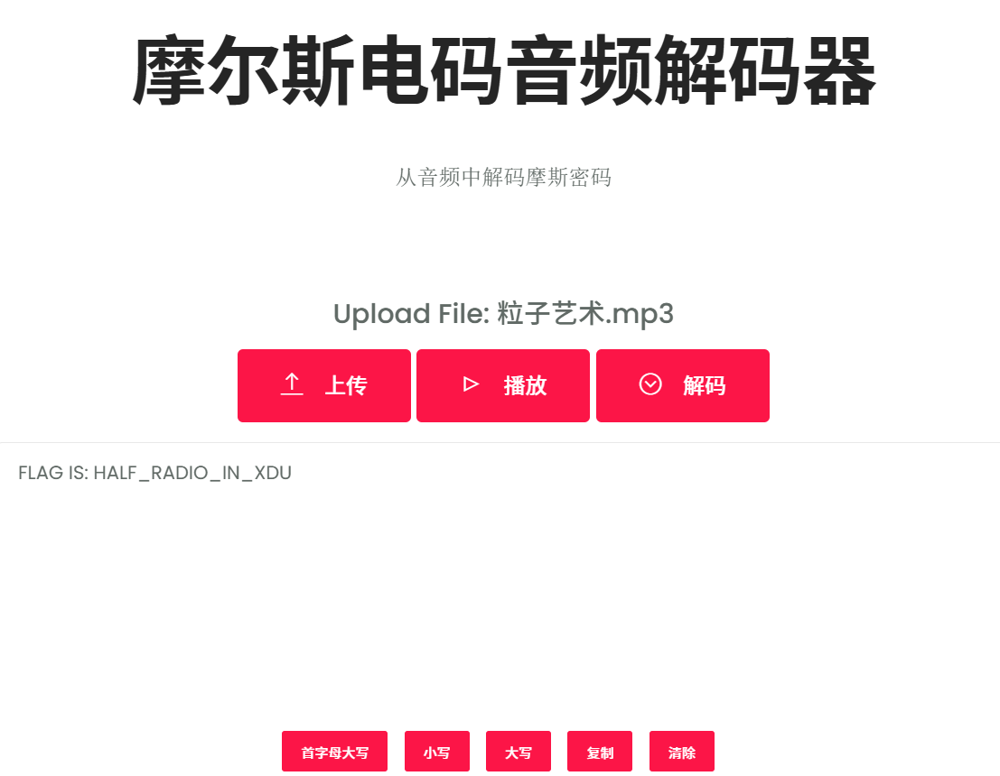

题目：一只手捂住耳朵 另一只手打开音乐 似乎听到了不一样的声音

flag 形式以moectf{}包裹提交，忽略大小写。

+ 解压得 粒子艺术.wav
+ 用Audacity打开

+ 发现一个声道是摩斯密码
+ 分离声道
+ 保留密码声道并导出。
+ 将导出的MP3文件放入摩尔斯电码音频解码器

[https://morsecodemagic.com/zh/%E6%91%A9%E5%B0%94%E6%96%AF%E7%94%B5%E7%A0%81%E9%9F%B3%E9%A2%91%E8%A7%A3%E7%A0%81%E5%99%A8/](https://morsecodemagic.com/zh/%E6%91%A9%E5%B0%94%E6%96%AF%E7%94%B5%E7%A0%81%E9%9F%B3%E9%A2%91%E8%A7%A3%E7%A0%81%E5%99%A8/)

+ 解得flag。

