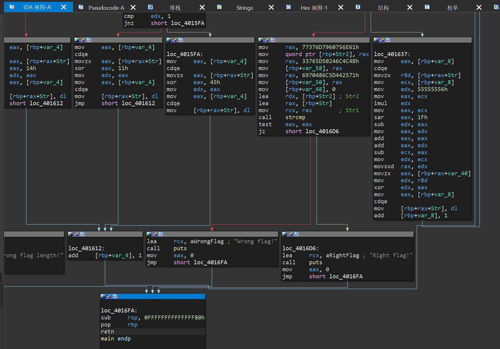
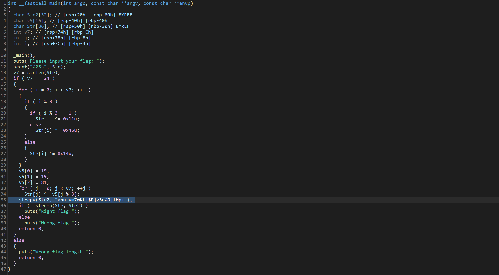

题目内容：

no xor，no encrypt.

【难度：签到】


解答：

● 用IDA打开

+ 
+ 按F5反编译成c语言代码
+ 
+ **anu`ym7wKLl$P]v3q%D]lHpi** 试着解密
+ <font style="color:rgb(15, 17, 21);">由于XOR操作是可逆的，我们只需要按相反的顺序和相同的密钥进行XOR就能解密。</font>

```python
# 已知的加密后字符串
encrypted_str = "anu`ym7wKLl$P]v3q%D]lHpi"

# v5数组
v5 = [19, 19, 81]

# 第一步：逆向第二轮XOR（与v5的XOR）
step1 = []
for j in range(len(encrypted_str)):
    # 与v5[j%3]再次XOR，抵消原来的操作
    step1.append(ord(encrypted_str[j]) ^ v5[j % 3])

# 第二步：逆向第一轮XOR（根据索引的不同进行不同的XOR）
original_flag = []
for i in range(len(step1)):
    if i % 3:
        if i % 3 == 1:
            # 逆向i%3==1的情况，原来的操作为XOR 0x11
            original_char = step1[i] ^ 0x11
        else:
            # 逆向i%3==2的情况，原来的操作为XOR 0x45
            original_char = step1[i] ^ 0x45
    else:
        # 逆向i%3==0的情况，原来的操作为XOR 0x14
        original_char = step1[i] ^ 0x14
    original_flag.append(chr(original_char))

# 组合结果并输出
flag = ''.join(original_flag)
print("解密得到的flag:", flag)
```

<font style="color:rgb(0, 0, 0);">解密过程说明：</font>

1. <font style="color:rgb(0, 0, 0);">代码首先对输入的 flag 进行了第一轮 XOR 加密：</font>
    - <font style="color:rgb(0, 0, 0);">当索引 i%3==0 时，与 0x14 进行 XOR</font>
    - <font style="color:rgb(0, 0, 0);">当索引 i%3==1 时，与 0x11 进行 XOR</font>
    - <font style="color:rgb(0, 0, 0);">当索引 i%3==2 时，与 0x45 进行 XOR</font>
2. <font style="color:rgb(0, 0, 0);">然后进行了第二轮 XOR 加密，使用 v5 数组 [19, 19, 81]，根据索引 j%3 循环使用数组元素</font>
3. <font style="color:rgb(0, 0, 0);">解密时需要逆向这个过程：</font>
    - <font style="color:rgb(0, 0, 0);">先对加密字符串与 v5 数组进行 XOR，还原到第一轮加密后的状态</font>
    - <font style="color:rgb(0, 0, 0);">再根据索引位置，使用对应的密钥进行 XOR，完全还原原始 flag</font>

<font style="color:rgb(0, 0, 0);"></font>

### <font style="color:rgb(0, 0, 0);">1. 先明确代码里的</font><font style="color:rgb(0, 0, 0);"> </font>`<font style="color:rgb(0, 0, 0);">v5</font>`<font style="color:rgb(0, 0, 0);"> </font><font style="color:rgb(0, 0, 0);">原始定义（回顾上下文）</font>
<font style="color:rgb(0, 0, 0);">在你之前提供的 </font>`<font style="color:rgba(0, 0, 0, 0.85) !important;">main</font>`<font style="color:rgb(0, 0, 0);"> 函数代码中，</font>`<font style="color:rgba(0, 0, 0, 0.85) !important;">v5</font>`<font style="color:rgb(0, 0, 0);"> 的定义和使用是这样的：</font>

```c
char v5[16]; // [rsp+40h] [rbp-40h]  // 定义一个16字节的字符数组v5
// ... 中间代码省略 ...
v5[0] = 19;   // 给v5第1个元素赋值19
v5[1] = 19;   // 给v5第2个元素赋值19
v5[2] = 81;   // 给v5第3个元素赋值81
// ... 后续使用 ...
for (j = 0; j < v7; ++j)
  Str[j] ^= v5[j % 3];  // 用v5[j%3]作为密钥，对Str进行XOR加密
```

<font style="color:rgb(0, 0, 0);">你说的</font><font style="color:rgb(0, 0, 0);"> </font>`<font style="color:rgba(0, 0, 0, 0.85) !important;">v5 = [19, 19, 81]</font>`<font style="color:rgb(0, 0, 0);">，本质是对这段代码的简化描述 —— 即</font><font style="color:rgb(0, 0, 0);"> </font>`<font style="color:rgba(0, 0, 0, 0.85) !important;">v5</font>`<font style="color:rgb(0, 0, 0);"> </font><font style="color:rgb(0, 0, 0);">数组的前 3 个有效元素是</font><font style="color:rgb(0, 0, 0);"> </font>`<font style="color:rgba(0, 0, 0, 0.85) !important;">19、19、81</font>`<font style="color:rgb(0, 0, 0);">，后续元素未赋值（不影响加密逻辑）。</font>

### <font style="color:rgb(0, 0, 0);">2.</font><font style="color:rgb(0, 0, 0);"> </font>`<font style="color:rgb(0, 0, 0);">v5</font>`<font style="color:rgb(0, 0, 0);"> </font><font style="color:rgb(0, 0, 0);">的核心作用：第二轮 XOR 加密的 “循环密钥”</font>
<font style="color:rgb(0, 0, 0);">在整个 flag 验证流程中，</font>`<font style="color:rgba(0, 0, 0, 0.85) !important;">v5</font>`<font style="color:rgb(0, 0, 0);"> </font><font style="color:rgb(0, 0, 0);">是</font>**<font style="color:rgb(0, 0, 0) !important;">第二轮加密的关键</font>**<font style="color:rgb(0, 0, 0);">，具体逻辑如下：</font>

#### <font style="color:rgb(0, 0, 0);">（1）先明确加密流程（回顾）</font>
<font style="color:rgb(0, 0, 0);">用户输入的原始 flag（存在 </font>`<font style="color:rgba(0, 0, 0, 0.85) !important;">Str</font>`<font style="color:rgb(0, 0, 0);"> 中），会经过 </font>**<font style="color:rgb(0, 0, 0) !important;">两轮 XOR 加密</font>**<font style="color:rgb(0, 0, 0);">，最终与预设的目标字符串 </font>`<font style="color:rgba(0, 0, 0, 0.85) !important;">Str2</font>`<font style="color:rgb(0, 0, 0);">（</font>`<font style="color:rgba(0, 0, 0, 0.85) !important;">"anu</font>`<font style="color:rgb(0, 0, 0);">ym7wKLl$P]v3q%D]lHpi"</font>`<font style="color:rgba(0, 0, 0, 0.85) !important;">）比较——若相等则验证通过。 而 </font>`<font style="color:rgb(0, 0, 0);">v5` 负责 </font>**<font style="color:rgb(0, 0, 0) !important;">第二轮加密</font>**<font style="color:rgb(0, 0, 0);">：</font>

#### <font style="color:rgb(0, 0, 0);">（2）</font>`<font style="color:rgb(0, 0, 0);">v5</font>`<font style="color:rgb(0, 0, 0);"> </font><font style="color:rgb(0, 0, 0);">的 “循环使用” 逻辑</font>
<font style="color:rgb(0, 0, 0);">第二轮加密的核心代码是：</font>

```c
for (j = 0; j < v7; ++j)  // v7是flag长度（固定24）
  Str[j] ^= v5[j % 3];    // 关键：v5[j%3]
```

<font style="color:rgb(0, 0, 0);">这里的</font><font style="color:rgb(0, 0, 0);"> </font>`<font style="color:rgba(0, 0, 0, 0.85) !important;">j % 3</font>`<font style="color:rgb(0, 0, 0);">（取余运算）决定了</font><font style="color:rgb(0, 0, 0);"> </font>`<font style="color:rgba(0, 0, 0, 0.85) !important;">v5</font>`<font style="color:rgb(0, 0, 0);"> </font><font style="color:rgb(0, 0, 0);">的</font>**<font style="color:rgb(0, 0, 0) !important;">循环使用规则</font>**<font style="color:rgb(0, 0, 0);">：</font>

+ <font style="color:rgb(0, 0, 0);">当</font><font style="color:rgb(0, 0, 0);"> </font>`<font style="color:rgb(0, 0, 0);">j=0</font>`<font style="color:rgb(0, 0, 0);"> </font><font style="color:rgb(0, 0, 0);">时：</font>`<font style="color:rgb(0, 0, 0);">0%3=0</font>`<font style="color:rgb(0, 0, 0);"> </font><font style="color:rgb(0, 0, 0);">→ 用</font><font style="color:rgb(0, 0, 0);"> </font>`<font style="color:rgb(0, 0, 0);">v5[0] = 19</font>`<font style="color:rgb(0, 0, 0);"> </font><font style="color:rgb(0, 0, 0);">作为密钥；</font>
+ <font style="color:rgb(0, 0, 0);">当</font><font style="color:rgb(0, 0, 0);"> </font>`<font style="color:rgb(0, 0, 0);">j=1</font>`<font style="color:rgb(0, 0, 0);"> </font><font style="color:rgb(0, 0, 0);">时：</font>`<font style="color:rgb(0, 0, 0);">1%3=1</font>`<font style="color:rgb(0, 0, 0);"> </font><font style="color:rgb(0, 0, 0);">→ 用</font><font style="color:rgb(0, 0, 0);"> </font>`<font style="color:rgb(0, 0, 0);">v5[1] = 19</font>`<font style="color:rgb(0, 0, 0);"> </font><font style="color:rgb(0, 0, 0);">作为密钥；</font>
+ <font style="color:rgb(0, 0, 0);">当</font><font style="color:rgb(0, 0, 0);"> </font>`<font style="color:rgb(0, 0, 0);">j=2</font>`<font style="color:rgb(0, 0, 0);"> </font><font style="color:rgb(0, 0, 0);">时：</font>`<font style="color:rgb(0, 0, 0);">2%3=2</font>`<font style="color:rgb(0, 0, 0);"> </font><font style="color:rgb(0, 0, 0);">→ 用</font><font style="color:rgb(0, 0, 0);"> </font>`<font style="color:rgb(0, 0, 0);">v5[2] = 81</font>`<font style="color:rgb(0, 0, 0);"> </font><font style="color:rgb(0, 0, 0);">作为密钥；</font>
+ <font style="color:rgb(0, 0, 0);">当</font><font style="color:rgb(0, 0, 0);"> </font>`<font style="color:rgb(0, 0, 0);">j=3</font>`<font style="color:rgb(0, 0, 0);"> </font><font style="color:rgb(0, 0, 0);">时：</font>`<font style="color:rgb(0, 0, 0);">3%3=0</font>`<font style="color:rgb(0, 0, 0);"> </font><font style="color:rgb(0, 0, 0);">→ 再次用</font><font style="color:rgb(0, 0, 0);"> </font>`<font style="color:rgb(0, 0, 0);">v5[0] = 19</font>`<font style="color:rgb(0, 0, 0);">；</font>
+ <font style="color:rgb(0, 0, 0);">以此类推，直到遍历完整个 24 位的 flag。</font>

<font style="color:rgb(0, 0, 0);">简单说：</font>`<font style="color:rgba(0, 0, 0, 0.85) !important;">v5</font>`<font style="color:rgb(0, 0, 0);"> </font><font style="color:rgb(0, 0, 0);">的 3 个元素</font><font style="color:rgb(0, 0, 0);"> </font>`<font style="color:rgba(0, 0, 0, 0.85) !important;">[19,19,81]</font>`<font style="color:rgb(0, 0, 0);"> </font><font style="color:rgb(0, 0, 0);">会按 “19→19→81→19→19→81...” 的顺序，循环对每一位 flag 进行 XOR 加密。</font>

### <font style="color:rgb(0, 0, 0);">3. 为什么用 XOR 加密？为什么用 “循环密钥”？</font>
#### <font style="color:rgb(0, 0, 0);">（1）XOR 加密的特性（决定</font><font style="color:rgb(0, 0, 0);"> </font>`<font style="color:rgb(0, 0, 0);">v5</font>`<font style="color:rgb(0, 0, 0);"> </font><font style="color:rgb(0, 0, 0);">可逆向）</font>
<font style="color:rgb(0, 0, 0);">XOR（异或）运算有个关键特性：</font>**<font style="color:rgb(0, 0, 0) !important;">对同一个数据用同一个密钥做两次 XOR，会还原原始数据</font>**<font style="color:rgb(0, 0, 0);">（即</font><font style="color:rgb(0, 0, 0);"> </font>`<font style="color:rgba(0, 0, 0, 0.85) !important;">a ^ key ^ key = a</font>`<font style="color:rgb(0, 0, 0);">）。</font><font style="color:rgb(0, 0, 0);">这也是我们之前能 “解密” 的核心 —— 只要知道</font><font style="color:rgb(0, 0, 0);"> </font>`<font style="color:rgba(0, 0, 0, 0.85) !important;">v5</font>`<font style="color:rgb(0, 0, 0);"> </font><font style="color:rgb(0, 0, 0);">的值，就能反向对</font><font style="color:rgb(0, 0, 0);"> </font>`<font style="color:rgba(0, 0, 0, 0.85) !important;">Str2</font>`<font style="color:rgb(0, 0, 0);"> </font><font style="color:rgb(0, 0, 0);">做 XOR，还原出第一轮加密后的 flag，再进一步还原原始 flag。</font>

#### <font style="color:rgb(0, 0, 0);">（2）循环密钥的作用（简单加密，增加破解难度）</font>
<font style="color:rgb(0, 0, 0);">如果直接用一个固定密钥（比如只用 19）对所有位加密，破解难度很低；而用</font><font style="color:rgb(0, 0, 0);"> </font>`<font style="color:rgba(0, 0, 0, 0.85) !important;">[19,19,81]</font>`<font style="color:rgb(0, 0, 0);"> </font><font style="color:rgb(0, 0, 0);">循环，相当于每 3 位用不同的密钥组合，既实现了简单的加密逻辑，又比 “单密钥” 更难直接猜测（必须知道循环规律和 3 个密钥值才能破解）。</font>

### <font style="color:rgb(0, 0, 0);">总结</font>
`<font style="color:rgba(0, 0, 0, 0.85) !important;">v5 = [19, 19, 81]</font>`<font style="color:rgb(0, 0, 0);"> </font><font style="color:rgb(0, 0, 0);">不是随机的数字，而是 flag 验证代码中</font><font style="color:rgb(0, 0, 0);"> </font>**<font style="color:rgb(0, 0, 0) !important;">第二轮 XOR 加密的 “循环密钥数组”</font>**<font style="color:rgb(0, 0, 0);">：</font>

+ <font style="color:rgb(0, 0, 0);">功能：按 “19→19→81” 的循环顺序，对第一轮加密后的 flag 做二次加密；</font>
+ <font style="color:rgb(0, 0, 0);">关键：由于 XOR 特性，它既是加密的 “钥匙”，也是解密的 “钥匙”—— 知道这 3 个值，才能反向还原出用户输入的原始正确 flag。</font>

