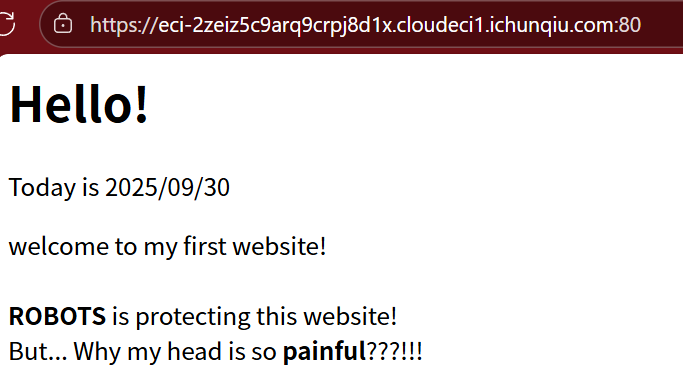
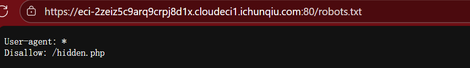
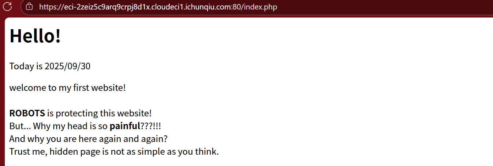

题目内容：

什么叫机器人控制了我的头？



解答：

<font style="color:rgb(15, 17, 21);">这提示我们查看 </font>`<font style="color:rgb(15, 17, 21);background-color:rgb(235, 238, 242);">/robots.txt</font>`<font style="color:rgb(15, 17, 21);"> 文件，这是网站用来与搜索引擎爬虫（机器人）通信的标准文件。</font>



<font style="color:rgb(15, 17, 21);">这明确告诉我们有一个隐藏页面：</font>`<font style="color:rgb(15, 17, 21);background-color:rgb(235, 238, 242);">/hidden.php</font>`<font style="color:rgb(15, 17, 21);">。</font>

<font style="color:rgb(15, 17, 21);">网页说：</font>**<font style="color:rgb(15, 17, 21);">But... Why my head is so painful???!!!</font>**

<font style="color:rgb(15, 17, 21);">“头” = HTTP 头（Headers），</font>

+ <font style="color:rgb(15, 17, 21);">可能要求修改 </font>`<font style="color:rgb(15, 17, 21);background-color:rgb(235, 238, 242);">User-Agent</font>`<font style="color:rgb(15, 17, 21);">、</font>`<font style="color:rgb(15, 17, 21);background-color:rgb(235, 238, 242);">Referer</font>`<font style="color:rgb(15, 17, 21);">、</font>`<font style="color:rgb(15, 17, 21);background-color:rgb(235, 238, 242);">X-Forwarded-For</font>`<font style="color:rgb(15, 17, 21);"> 等请求头</font>
+ <font style="color:rgb(15, 17, 21);">先尝试直接访问</font><font style="color:rgb(15, 17, 21);background-color:rgb(235, 238, 242);">/hidden.php</font><font style="color:rgb(15, 17, 21);">  
</font>
+ 没那么简单。。。意味着单一条件可能不够，需要组合多个头部，正如题目的multi所提示

### <font style="color:rgb(15, 17, 21);">组合头部</font>
<font style="color:rgb(15, 17, 21);">常见需要组合的头部：</font>

+ `<font style="color:rgb(15, 17, 21);background-color:rgb(235, 238, 242);">User-Agent: Robot</font>`<font style="color:rgb(15, 17, 21);">（伪装成机器人）</font>
+ `<font style="color:rgb(15, 17, 21);background-color:rgb(235, 238, 242);">Referer: <目标网站></font>`<font style="color:rgb(15, 17, 21);">（表明来源）</font>
+ `<font style="color:rgb(15, 17, 21);background-color:rgb(235, 238, 242);">X-Forwarded-For: 127.0.0.1</font>`<font style="color:rgb(15, 17, 21);">（伪装成本地访问）</font>
+ <font style="color:rgb(15, 17, 21);">可能还需要 </font>`<font style="color:rgb(15, 17, 21);background-color:rgb(235, 238, 242);">X-CTF: true</font>`<font style="color:rgb(15, 17, 21);"> 等自定义头</font>

### <font style="color:rgb(15, 17, 21);"></font><font style="color:rgb(15, 17, 21);">使用 HEAD 方法</font>
+ <font style="color:rgb(15, 17, 21);">“头很痛”可能暗示使用</font><font style="color:rgb(15, 17, 21);"> </font>`<font style="color:rgb(15, 17, 21);background-color:rgb(235, 238, 242);">HEAD</font>`<font style="color:rgb(15, 17, 21);"> </font><font style="color:rgb(15, 17, 21);">请求</font>
+ <font style="color:rgb(15, 17, 21);">响应头里可能包含 flag</font>

```python
import requests

target = "https://eci-2zeiz5c9arq9crpj8d1x.cloudeci1.ichunqiu.com:80"
hidden_url = target + "/hidden.php"

# 测试各种头部组合
tests = [
    {"name": "1. 普通访问", "headers": {&#125;&#125;,
    {"name": "2. Robot UA", "headers": {"User-Agent": "Robot"&#125;&#125;,
    {"name": "3. Robot + Referer", "headers": {"User-Agent": "Robot", "Referer": target&#125;&#125;,
    {"name": "4. Robot + X-Forwarded-For", "headers": {"User-Agent": "Robot", "X-Forwarded-For": "127.0.0.1"&#125;&#125;,
    {"name": "5. Robot + X-CTF", "headers": {"User-Agent": "Robot", "X-CTF": "true"&#125;&#125;,
    {"name": "6. 全部组合", "headers": {
        "User-Agent": "Robot",
        "Referer": target,
        "X-Forwarded-For": "127.0.0.1",
        "X-CTF": "true"
    &#125;&#125;,
]

for test in tests:
    print(f"\n=== {test['name']} ===")
    try:
        r = requests.get(hidden_url, headers=test['headers'], verify=False, timeout=5)
        if "flag" in r.text.lower() or "ctf" in r.text.lower():
            print(">>> 🚩 Possible flag here!")
        print(r.text)
        # 检查响应头
        for h, v in r.headers.items():
            if 'flag' in h.lower() or 'ctf' in h.lower():
                print(f">>> 🚩 Header {h}: {v}")
    except Exception as e:
        print("Error:", e)

# 测试 HEAD 方法
print("\n=== 7. HEAD + Robot ===")
try:
    r = requests.head(hidden_url, headers={"User-Agent": "Robot"}, verify=False, timeout=5)
    print("HEAD response headers:")
    for h, v in r.headers.items():
        print(f"{h}: {v}")
        if 'flag' in h.lower() or 'ctf' in h.lower():
            print(f">>> 🚩 Header {h}: {v}")
except Exception as e:
    print("Error:", e) 
```

flag{e6c421da-4941-447c-a22a-6f09984bdd21}

## <font style="color:rgb(15, 17, 21);">解题成功的关键</font>
1. **<font style="color:rgb(15, 17, 21);">使用 HEAD 方法</font>**<font style="color:rgb(15, 17, 21);">而不是 GET</font>
2. **<font style="color:rgb(15, 17, 21);">正确的 HTTP 头部组合</font>**<font style="color:rgb(15, 17, 21);">：User-Agent + Referer + X-Forwarded-For</font>
    - `<font style="color:rgb(15, 17, 21);background-color:rgb(235, 238, 242);">User-Agent: Robot</font>`
    - `<font style="color:rgb(15, 17, 21);background-color:rgb(235, 238, 242);">Referer: https://eci-2zeiz5c9arq9crpj8d1x.cloudeci1.ichunqiu.com</font>`
    - `<font style="color:rgb(15, 17, 21);background-color:rgb(235, 238, 242);">X-Forwarded-For: 127.0.0.1</font>`
