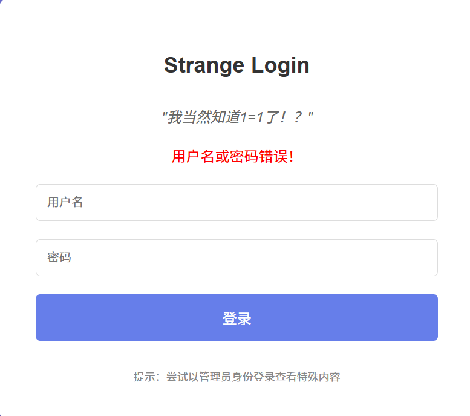
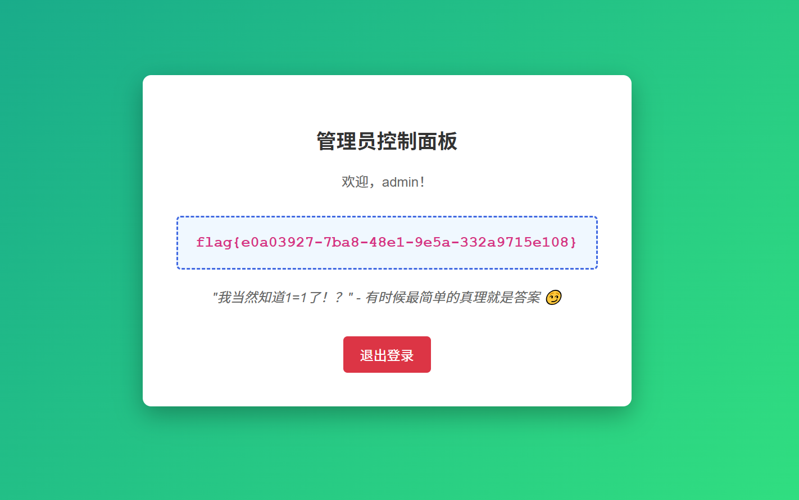

<font style="color:rgba(0, 0, 0, 0.85);">题目内容：</font>

<font style="color:rgba(0, 0, 0, 0.85);">我当然知道1=1了！？</font>



<font style="color:rgba(0, 0, 0, 0.85);">解题：</font><font style="color:rgb(0, 0, 0);">这很可能是在暗示可以利用 SQL 注入的方式进行登录。</font>

<font style="color:rgb(0, 0, 0);">SQL 注入是一种常见的网络攻击手段，</font>**<u><font style="color:rgb(0, 0, 0);">通过在输入框（如用户名或密码框）中输入特定的 SQL 语句，来绕过正常的登录验证逻辑</font></u>**<font style="color:rgb(0, 0, 0);">。</font>**<u><font style="color:#DF2A3F;">“1=1” 是一个恒成立的条件，在 SQL 语句中可以用于构造永真的查询条件。</font></u>**

<font style="color:rgb(0, 0, 0);">假设后台的登录验证 SQL 语句类似</font><font style="color:rgb(0, 0, 0);"> </font>`<font style="color:rgba(0, 0, 0, 0.85) !important;">SELECT * FROM users WHERE username = '$username' AND password = '$password'</font>`<font style="color:rgb(0, 0, 0);">，当我们在用户名或密码输入框中输入包含 SQL 注入的内容时，就可能改变这个查询的逻辑。</font>

<font style="color:rgb(0, 0, 0);">比如，在用户名输入框输入 </font>`<font style="color:rgba(0, 0, 0, 0.85) !important;">admin' OR '1'='1</font>`<font style="color:rgb(0, 0, 0);">，密码输入框随意输入（或者也构造类似的注入语句），这样拼接后的 SQL 语句可能变成 </font>`<font style="color:rgba(0, 0, 0, 0.85) !important;">SELECT * FROM users WHERE username = 'admin' OR '1'='1' AND password = '$password'</font>`<font style="color:rgb(0, 0, 0);">。由于 </font>`<font style="color:rgba(0, 0, 0, 0.85) !important;">'1'='1'</font>`<font style="color:rgb(0, 0, 0);"> 恒成立，可能就会绕过密码验证，以 </font>`<font style="color:rgba(0, 0, 0, 0.85) !important;">admin</font>`<font style="color:rgb(0, 0, 0);">（管理员）身份登录，从而查看特殊内容。</font>

<font style="color:rgb(0, 0, 0);"></font>

### <font style="color:rgb(0, 0, 0);">核心思路：利用 SQL 逻辑漏洞绕过登录验证</font>
<font style="color:rgb(0, 0, 0);">假设登录表单的后端 SQL 查询逻辑大致为：</font>

**<font style="color:rgba(0, 0, 0, 0.85);">sql</font>**

```sql
SELECT * FROM users WHERE username = '[输入的用户名]' AND password = '[输入的密码]'
```

<font style="color:rgb(0, 0, 0);">当查询结果不为空时，登录成功。我们需要构造特殊输入，让这个查询恒为真，从而绕过验证。</font>

### <font style="color:rgb(0, 0, 0);">具体注入方法（分场景尝试）</font>
#### <font style="color:rgb(0, 0, 0);">1. 最简单的万能密码（针对用户名 / 密码任意一方）</font>
+ **<font style="color:rgb(0, 0, 0) !important;">用户名输入</font>**<font style="color:rgb(0, 0, 0);">：</font>`<font style="color:rgba(0, 0, 0, 0.85) !important;">admin' OR 1=1#</font>`<font style="color:rgb(0, 0, 0);">密码任意输入（如 123）</font><font style="color:rgb(0, 0, 0);">拼接后 SQL 变为：</font>**<font style="color:rgba(0, 0, 0, 0.85);">sql</font>**

```sql
SELECT * FROM users WHERE username = 'admin' OR 1=1#' AND password = '123'
```

    - `<font style="color:rgb(0, 0, 0);">OR 1=1</font>`<font style="color:rgb(0, 0, 0);"> </font><font style="color:rgb(0, 0, 0);">使条件恒成立</font>
    - `<font style="color:rgb(0, 0, 0);">#</font>`<font style="color:rgb(0, 0, 0);"> </font><font style="color:rgb(0, 0, 0);">注释掉后面的密码判断部分（MySQL 中</font>`<font style="color:rgb(0, 0, 0);">#</font>`<font style="color:rgb(0, 0, 0);">是注释符，也可用</font>`<font style="color:rgb(0, 0, 0);">--</font><font style="color:rgb(0, 0, 0);"> </font>`<font style="color:rgb(0, 0, 0);">代替，注意后面有空格）</font>
+ **<font style="color:rgb(0, 0, 0) !important;">如果用户名固定为 admin，也可只注入密码</font>**<font style="color:rgb(0, 0, 0);">：</font><font style="color:rgb(0, 0, 0);">用户名输入</font>`<font style="color:rgba(0, 0, 0, 0.85) !important;">admin</font>`<font style="color:rgb(0, 0, 0);">，密码输入</font>`<font style="color:rgba(0, 0, 0, 0.85) !important;">' OR 1=1#</font>`

#### <font style="color:rgb(0, 0, 0);">2. 处理引号被转义的情况（单引号被过滤）</font>
<font style="color:rgb(0, 0, 0);">如果输入的</font>`<font style="color:rgba(0, 0, 0, 0.85) !important;">'</font>`<font style="color:rgb(0, 0, 0);">被转义为</font>`<font style="color:rgba(0, 0, 0, 0.85) !important;">\'</font>`<font style="color:rgb(0, 0, 0);">，可尝试：</font>

+ <font style="color:rgb(0, 0, 0);">用双引号</font>`<font style="color:rgb(0, 0, 0);">"</font>`<font style="color:rgb(0, 0, 0);">代替单引号（若后端用双引号包裹参数）：</font><font style="color:rgb(0, 0, 0);">用户名：</font>`<font style="color:rgb(0, 0, 0);">admin" OR 1=1#</font>`
+ <font style="color:rgb(0, 0, 0);">利用 SQL 语句的其他逻辑（如数字型注入，若参数未用引号包裹）：</font><font style="color:rgb(0, 0, 0);">用户名：</font>`<font style="color:rgb(0, 0, 0);">admin OR 1=1#</font>`

#### <font style="color:rgb(0, 0, 0);">3. 进阶：获取管理员真实信息（若需要正确用户名 / 密码）</font>
<font style="color:rgb(0, 0, 0);">如果题目需要实际的管理员账号密码（而非单纯绕过），可尝试：</font>

+ **<font style="color:rgb(0, 0, 0) !important;">猜解用户名长度</font>**<font style="color:rgb(0, 0, 0);">：</font><font style="color:rgb(0, 0, 0);">用户名输入</font>`<font style="color:rgb(0, 0, 0);">' AND LENGTH(username)=5#</font>`<font style="color:rgb(0, 0, 0);">（通过返回结果判断长度是否为 5）</font>
+ **<font style="color:rgb(0, 0, 0) !important;">逐字符猜解用户名</font>**<font style="color:rgb(0, 0, 0);">：</font><font style="color:rgb(0, 0, 0);">用户名输入</font>`<font style="color:rgb(0, 0, 0);">' AND SUBSTR(username,1,1)='a'#</font>`<font style="color:rgb(0, 0, 0);">（判断用户名第 1 个字符是否为 a）</font><font style="color:rgb(0, 0, 0);">（类似方法可猜解密码）</font>

### <font style="color:rgb(0, 0, 0);">关键原理</font>
+ **<font style="color:rgb(0, 0, 0) !important;">逻辑恒真</font>**<font style="color:rgb(0, 0, 0);">：</font>`<font style="color:rgb(0, 0, 0);">OR 1=1</font>`<font style="color:rgb(0, 0, 0);"> </font><font style="color:rgb(0, 0, 0);">让 WHERE 条件永远成立，无论用户名密码是否正确</font>
+ **<font style="color:rgb(0, 0, 0) !important;">注释截断</font>**<font style="color:rgb(0, 0, 0);">：</font>`<font style="color:rgb(0, 0, 0);">#</font>`<font style="color:rgb(0, 0, 0);">或</font>`<font style="color:rgb(0, 0, 0);">--</font><font style="color:rgb(0, 0, 0);"> </font>`<font style="color:rgb(0, 0, 0);">忽略后续 SQL 语句，消除原始查询的密码验证部分</font>
+ **<font style="color:rgb(0, 0, 0) !important;">闭合引号</font>**<font style="color:rgb(0, 0, 0);">：注入的</font>`<font style="color:rgb(0, 0, 0);">'</font>`<font style="color:rgb(0, 0, 0);">用于闭合 SQL 语句中原本的引号，使注入的逻辑生效</font>

### <font style="color:rgb(0, 0, 0);">注意事项</font>
1. <font style="color:rgb(0, 0, 0);">不同数据库的注释符可能不同（如 MySQL 用</font>`<font style="color:rgb(0, 0, 0);">#</font>`<font style="color:rgb(0, 0, 0);">，Oracle 用</font>`<font style="color:rgb(0, 0, 0);">--</font><font style="color:rgb(0, 0, 0);"> </font>`<font style="color:rgb(0, 0, 0);">）</font>
2. <font style="color:rgb(0, 0, 0);">若遇到过滤（如过滤</font>`<font style="color:rgb(0, 0, 0);">OR</font>`<font style="color:rgb(0, 0, 0);">、</font>`<font style="color:rgb(0, 0, 0);">=</font>`<font style="color:rgb(0, 0, 0);">），可尝试大小写变形（</font>`<font style="color:rgb(0, 0, 0);">Or</font>`<font style="color:rgb(0, 0, 0);">、</font>`<font style="color:rgb(0, 0, 0);">1=1</font>`<font style="color:rgb(0, 0, 0);">→</font>`<font style="color:rgb(0, 0, 0);">1 Like 1</font>`<font style="color:rgb(0, 0, 0);">）或编码绕过</font>




