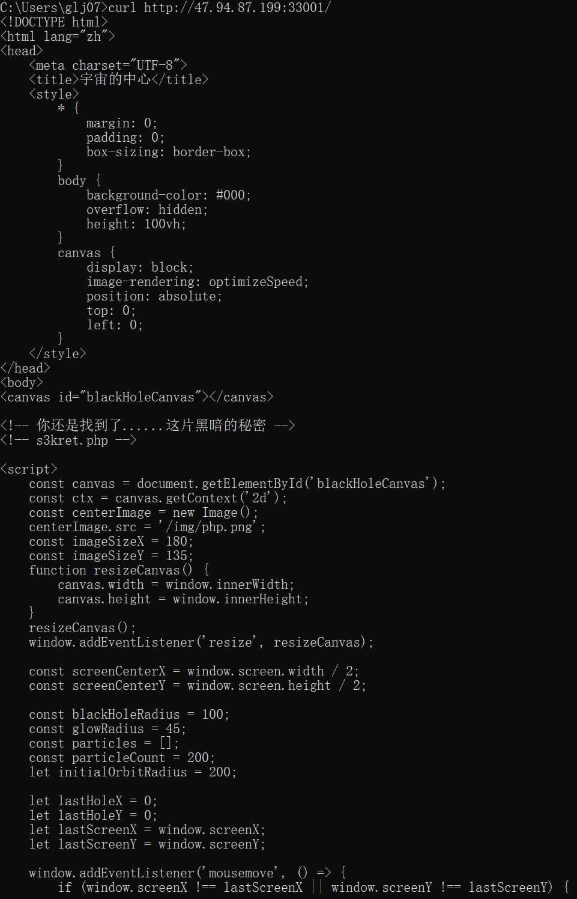
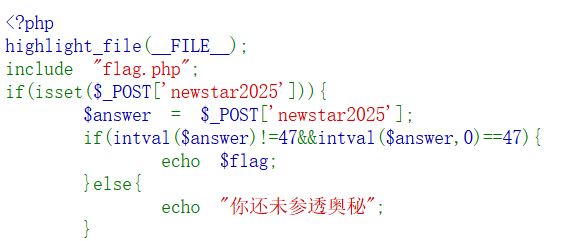

题目内容：

所有光线都逃不出去......但我知道这不会难倒你的

（本题下发后，请通过http访问相应的ip和port，例如 nc ip port ，改为http://ip:port/）

容器地址： nc 47.94.87.199 33001

解答：

+ <font style="color:rgb(15, 17, 21);">访问方式：</font>`<font style="color:rgb(15, 17, 21);background-color:rgb(235, 238, 242);">http://47.94.87.199:33001/</font>`

<font style="color:rgb(15, 17, 21);">html</font>

```plain
<!-- 你还是找到了......这片黑暗的秘密 -->
<!-- s3kret.php -->
```

<font style="color:rgb(15, 17, 21);">这说明存在一个隐藏文件：</font>`<font style="color:rgb(15, 17, 21);background-color:rgb(235, 238, 242);">s3kret.php</font>`<font style="color:rgb(15, 17, 21);">。</font>

访问：http://47.94.87.199:33001/s3kret.php



### <font style="color:rgb(0, 0, 0);">分析代码逻辑</font>
<font style="color:rgb(0, 0, 0);">代码首先包含了</font><font style="color:rgb(0, 0, 0);"> </font>`<font style="color:rgba(0, 0, 0, 0.85) !important;">flag.php</font>`<font style="color:rgb(0, 0, 0);"> </font><font style="color:rgb(0, 0, 0);">文件（里面应该存放着我们需要的</font><font style="color:rgb(0, 0, 0);"> </font>`<font style="color:rgba(0, 0, 0, 0.85) !important;">flag</font>`<font style="color:rgb(0, 0, 0);">），然后判断是否通过</font><font style="color:rgb(0, 0, 0);"> </font>`<font style="color:rgba(0, 0, 0, 0.85) !important;">POST</font>`<font style="color:rgb(0, 0, 0);"> </font><font style="color:rgb(0, 0, 0);">方法提交了名为</font><font style="color:rgb(0, 0, 0);"> </font>`<font style="color:rgba(0, 0, 0, 0.85) !important;">newstar2025</font>`<font style="color:rgb(0, 0, 0);"> </font><font style="color:rgb(0, 0, 0);">的参数。如果提交了，就将该参数的值赋给</font><font style="color:rgb(0, 0, 0);"> </font>`<font style="color:rgba(0, 0, 0, 0.85) !important;">$answer</font>`<font style="color:rgb(0, 0, 0);">，接着进行关键判断：</font>

+ `<font style="color:rgb(0, 0, 0);">intval($answer) != 47</font>`<font style="color:rgb(0, 0, 0);">：要求</font><font style="color:rgb(0, 0, 0);"> </font>`<font style="color:rgb(0, 0, 0);">$answer</font>`<font style="color:rgb(0, 0, 0);"> </font><font style="color:rgb(0, 0, 0);">转换为整数后不等于 47。</font>
+ `<font style="color:rgb(0, 0, 0);">intval($answer, 0) == 47</font>`<font style="color:rgb(0, 0, 0);">：</font>`<font style="color:rgb(0, 0, 0);">intval</font>`<font style="color:rgb(0, 0, 0);"> 函数第二个参数为 </font>`<font style="color:rgb(0, 0, 0);">0</font>`<font style="color:rgb(0, 0, 0);"> 时，会根据字符串的格式自动判断进制。这里要求 </font>`<font style="color:rgb(0, 0, 0);">$answer</font>`<font style="color:rgb(0, 0, 0);"> 转换为整数后等于 47。</font>

<font style="color:rgb(0, 0, 0);">执行：</font>

+ <font style="color:rgb(0, 0, 0);">curl -X POST </font>[http://47.94.87.199:33001/s3kret.php](http://47.94.87.199:33001/s3kret.php)<font style="color:rgb(0, 0, 0);"> -d "newstar2025=057"</font>

得到flag{a64a70f1-1435-4e2d-832b-c1d7e678d4e7}


接下来解释绕过原理：

## <font style="color:rgb(15, 17, 21);">1. PHP</font><font style="color:rgb(15, 17, 21);"> </font>`<font style="color:rgb(15, 17, 21);background-color:rgb(235, 238, 242);">intval()</font>`<font style="color:rgb(15, 17, 21);"> </font><font style="color:rgb(15, 17, 21);">函数的行为</font>
`<font style="color:rgb(15, 17, 21);background-color:rgb(235, 238, 242);">intval($var, $base)</font>`<font style="color:rgb(15, 17, 21);"> </font><font style="color:rgb(15, 17, 21);">的第二个参数是</font>**<font style="color:rgb(15, 17, 21);">进制基数</font>**<font style="color:rgb(15, 17, 21);">：</font>

+ `<font style="color:rgb(15, 17, 21);background-color:rgb(235, 238, 242);">intval($answer)</font>`<font style="color:rgb(15, 17, 21);"> </font><font style="color:rgb(15, 17, 21);">默认</font><font style="color:rgb(15, 17, 21);"> </font>`<font style="color:rgb(15, 17, 21);background-color:rgb(235, 238, 242);">$base = 10</font>`<font style="color:rgb(15, 17, 21);">（十进制）</font>
+ `<font style="color:rgb(15, 17, 21);background-color:rgb(235, 238, 242);">intval($answer, 0)</font>`<font style="color:rgb(15, 17, 21);"> </font><font style="color:rgb(15, 17, 21);">中</font><font style="color:rgb(15, 17, 21);"> </font>`<font style="color:rgb(15, 17, 21);background-color:rgb(235, 238, 242);">$base = 0</font>`<font style="color:rgb(15, 17, 21);"> </font><font style="color:rgb(15, 17, 21);">表示</font>**<font style="color:rgb(15, 17, 21);">自动检测进制</font>**

---

## <font style="color:rgb(15, 17, 21);">2. 自动检测进制规则（base=0）</font>
+ <font style="color:rgb(15, 17, 21);">如果字符串以</font><font style="color:rgb(15, 17, 21);"> </font>`<font style="color:rgb(15, 17, 21);background-color:rgb(235, 238, 242);">0x</font>`<font style="color:rgb(15, 17, 21);"> </font><font style="color:rgb(15, 17, 21);">或</font><font style="color:rgb(15, 17, 21);"> </font>`<font style="color:rgb(15, 17, 21);background-color:rgb(235, 238, 242);">0X</font>`<font style="color:rgb(15, 17, 21);"> </font><font style="color:rgb(15, 17, 21);">开头 → 当作</font>**<font style="color:rgb(15, 17, 21);">十六进制</font>**
+ <font style="color:rgb(15, 17, 21);">如果字符串以</font><font style="color:rgb(15, 17, 21);"> </font>`<font style="color:rgb(15, 17, 21);background-color:rgb(235, 238, 242);">0</font>`<font style="color:rgb(15, 17, 21);"> </font><font style="color:rgb(15, 17, 21);">开头 → 当作</font>**<font style="color:rgb(15, 17, 21);">八进制</font>**
+ <font style="color:rgb(15, 17, 21);">否则 → 当作</font>**<font style="color:rgb(15, 17, 21);">十进制</font>**

---

## <font style="color:rgb(15, 17, 21);">3. 我们的绕过 payload：</font>`<font style="color:rgb(15, 17, 21);background-color:rgb(235, 238, 242);">057</font>`
### <font style="color:rgb(15, 17, 21);"> </font>`<font style="color:rgb(15, 17, 21);background-color:rgb(235, 238, 242);">intval("057", 0)</font>`<font style="color:rgb(15, 17, 21);">（自动检测进制）</font>
+ <font style="color:rgb(15, 17, 21);">字符串以</font><font style="color:rgb(15, 17, 21);"> </font>`<font style="color:rgb(15, 17, 21);background-color:rgb(235, 238, 242);">0</font>`<font style="color:rgb(15, 17, 21);"> </font><font style="color:rgb(15, 17, 21);">开头 → 按</font>**<font style="color:rgb(15, 17, 21);">八进制</font>**<font style="color:rgb(15, 17, 21);">解析</font>
+ <font style="color:rgb(15, 17, 21);">八进制</font><font style="color:rgb(15, 17, 21);"> </font>`<font style="color:rgb(15, 17, 21);background-color:rgb(235, 238, 242);">057</font>`<font style="color:rgb(15, 17, 21);"> </font><font style="color:rgb(15, 17, 21);">=</font><font style="color:rgb(15, 17, 21);"> </font>`<font style="color:rgb(15, 17, 21);background-color:rgb(235, 238, 242);">5*8 + 7 = 40 + 7 = 47</font>`
+ **<font style="color:rgb(15, 17, 21);">所以</font>****<font style="color:rgb(15, 17, 21);"> </font>**`**<font style="color:rgb(15, 17, 21);background-color:rgb(235, 238, 242);">intval("057", 0) = 47</font>**`

`<font style="color:rgb(15, 17, 21);background-color:rgb(235, 238, 242);">47 == 47</font>`<font style="color:rgb(15, 17, 21);"> </font><font style="color:rgb(15, 17, 21);">✅</font><font style="color:rgb(15, 17, 21);"> 成立</font>

---

## <font style="color:rgb(15, 17, 21);">4. 条件满足</font>
<font style="color:rgb(15, 17, 21);">php</font>

<font style="color:rgb(15, 17, 21);">if(intval($answer) != 47 && intval($answer, 0) == 47)</font>

<font style="color:rgb(15, 17, 21);">代入</font><font style="color:rgb(15, 17, 21);"> </font>`<font style="color:rgb(15, 17, 21);background-color:rgb(235, 238, 242);">$answer = "057"</font>`<font style="color:rgb(15, 17, 21);">：</font>

+ `<font style="color:rgb(15, 17, 21);background-color:rgb(235, 238, 242);">intval("057") = 57</font>`<font style="color:rgb(15, 17, 21);"> </font><font style="color:rgb(15, 17, 21);">→</font><font style="color:rgb(15, 17, 21);"> </font>`<font style="color:rgb(15, 17, 21);background-color:rgb(235, 238, 242);">57 != 47</font>`<font style="color:rgb(15, 17, 21);"> </font><font style="color:rgb(15, 17, 21);">✅</font><font style="color:rgb(15, 17, 21);"> true</font>
+ `<font style="color:rgb(15, 17, 21);background-color:rgb(235, 238, 242);">intval("057", 0) = 47</font>`<font style="color:rgb(15, 17, 21);"> </font><font style="color:rgb(15, 17, 21);">→</font><font style="color:rgb(15, 17, 21);"> </font>`<font style="color:rgb(15, 17, 21);background-color:rgb(235, 238, 242);">47 == 47</font>`<font style="color:rgb(15, 17, 21);"> </font><font style="color:rgb(15, 17, 21);">✅</font><font style="color:rgb(15, 17, 21);"> true</font>
+ `<font style="color:rgb(15, 17, 21);background-color:rgb(235, 238, 242);">true && true</font>`<font style="color:rgb(15, 17, 21);"> </font><font style="color:rgb(15, 17, 21);">→ 条件成立，输出 flag</font>

---

## <font style="color:rgb(15, 17, 21);">5. 另一个 payload：</font>`<font style="color:rgb(15, 17, 21);background-color:rgb(235, 238, 242);">0x2f</font>`<font style="color:rgb(15, 17, 21);"> </font><font style="color:rgb(15, 17, 21);">的原理</font>
+ `<font style="color:rgb(15, 17, 21);background-color:rgb(235, 238, 242);">intval("0x2f")</font>`<font style="color:rgb(15, 17, 21);"> </font><font style="color:rgb(15, 17, 21);">十进制解析，遇到</font><font style="color:rgb(15, 17, 21);"> </font>`<font style="color:rgb(15, 17, 21);background-color:rgb(235, 238, 242);">0</font>`<font style="color:rgb(15, 17, 21);"> </font><font style="color:rgb(15, 17, 21);">后遇到</font><font style="color:rgb(15, 17, 21);"> </font>`<font style="color:rgb(15, 17, 21);background-color:rgb(235, 238, 242);">x</font>`<font style="color:rgb(15, 17, 21);"> </font><font style="color:rgb(15, 17, 21);">不是数字，停止 → 返回</font><font style="color:rgb(15, 17, 21);"> </font>`<font style="color:rgb(15, 17, 21);background-color:rgb(235, 238, 242);">0</font>`
+ `<font style="color:rgb(15, 17, 21);background-color:rgb(235, 238, 242);">0 != 47</font>`<font style="color:rgb(15, 17, 21);"> </font><font style="color:rgb(15, 17, 21);">✅</font><font style="color:rgb(15, 17, 21);"> true</font>
+ `<font style="color:rgb(15, 17, 21);background-color:rgb(235, 238, 242);">intval("0x2f", 0)</font>`<font style="color:rgb(15, 17, 21);"> </font><font style="color:rgb(15, 17, 21);">十六进制解析 →</font><font style="color:rgb(15, 17, 21);"> </font>`<font style="color:rgb(15, 17, 21);background-color:rgb(235, 238, 242);">0x2f = 47</font>`
+ `<font style="color:rgb(15, 17, 21);background-color:rgb(235, 238, 242);">47 == 47</font>`<font style="color:rgb(15, 17, 21);"> </font><font style="color:rgb(15, 17, 21);">✅</font><font style="color:rgb(15, 17, 21);"> true</font>

---

## <font style="color:rgb(15, 17, 21);">总结</font>
<font style="color:rgb(15, 17, 21);">这个漏洞利用的是</font>**<u><font style="color:#01B2BC;"> PHP 在不同进制下对同一字符串解析结果不同</font></u>**<font style="color:rgb(15, 17, 21);"> 的特性，通过八进制/十六进制与十进制的转换差异来满足矛盾条件。</font>

<font style="color:rgb(15, 17, 21);">这就是 CTF 中常见的 </font>**<u><font style="color:#DF2A3F;">PHP 类型混淆/进制混淆 漏洞</font></u>**<font style="color:rgb(15, 17, 21);">。</font>

