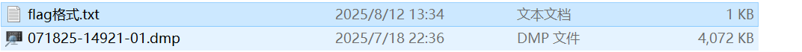
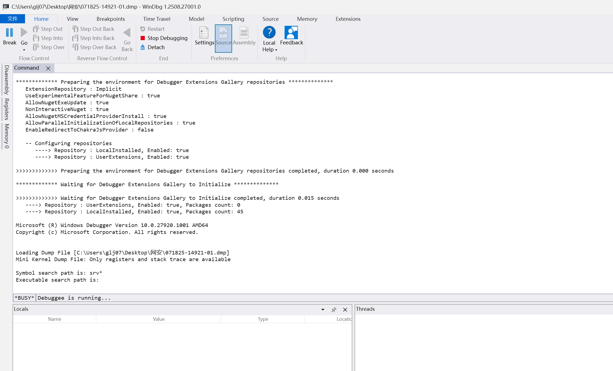

题目内容：

小吉的机械革命笔记本又双叒叕蓝屏了！这次他不想再坐以待毙！他发来了他在C:\Windows\Minidump\的蓝屏文件，请你帮忙分析一下，让机革摆脱舍友的歧视。听说大伙看蓝屏日志都用的是WinDbg，操作也很简单，好像要敲什么!analyze -v?

flag{崩溃类型(即蓝屏显示的终止代码)_故障进程}

解答：

+ 输入analyze -v得到

这里的关键信息：

+ `**0xEF**` - **蓝屏终止代码**（STOP CODE）

`CRITICAL_PROCESS_DIED` (对应十六进制 0xEF)

+ `**svchost.exe**` - 故障进程
+ `**CRITICAL_PROCESS**` - 崩溃类型描述

## 正确的flag格式：
**flag{CRITICAL_PROCESS_DIED_svchost.exe}**

