## 哈基米南北绿豆


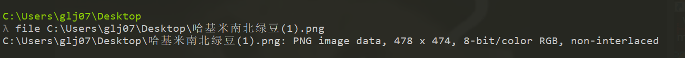

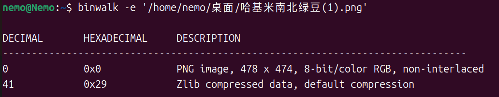

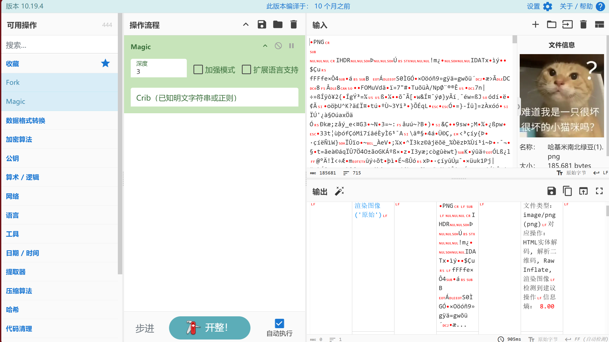

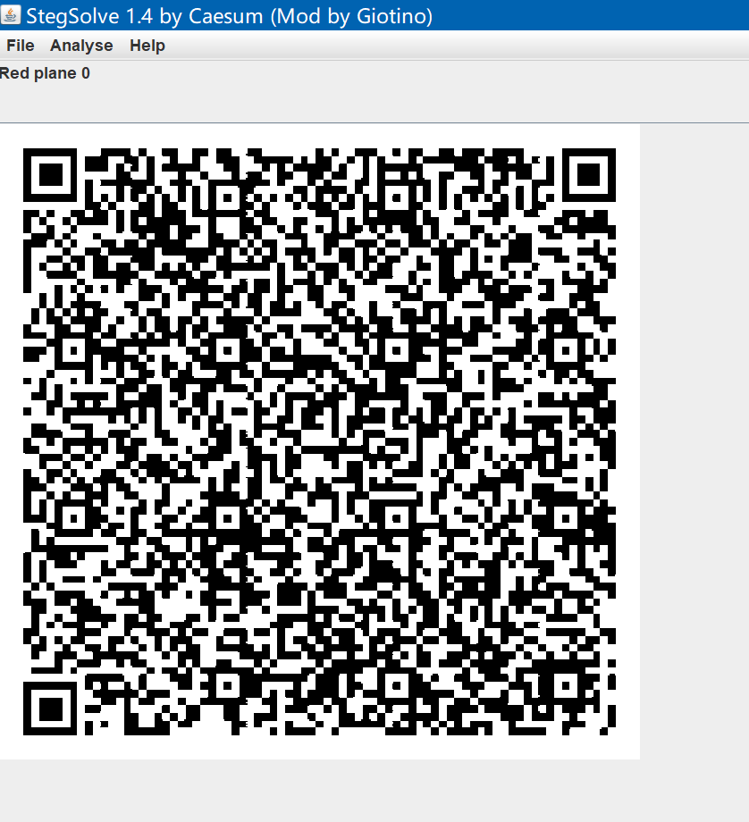

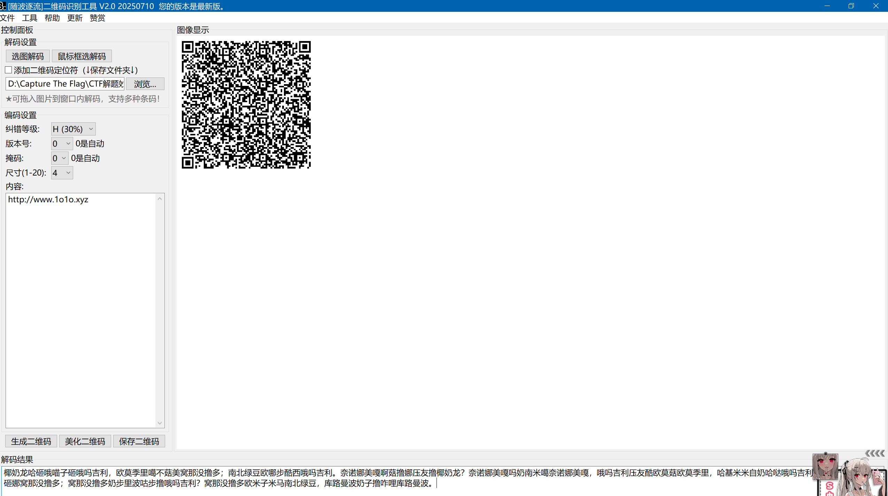

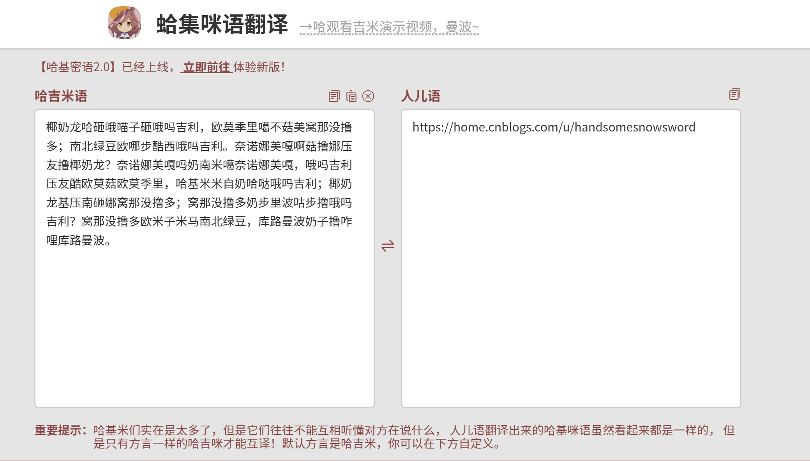


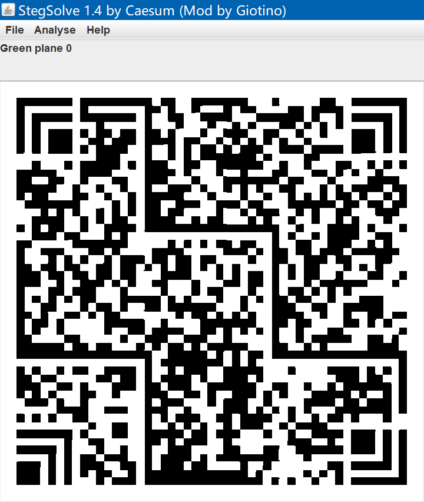

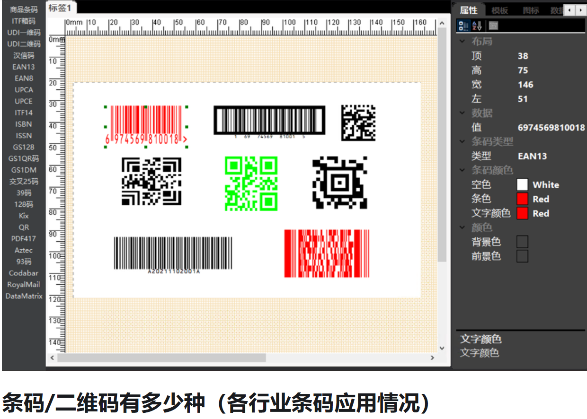

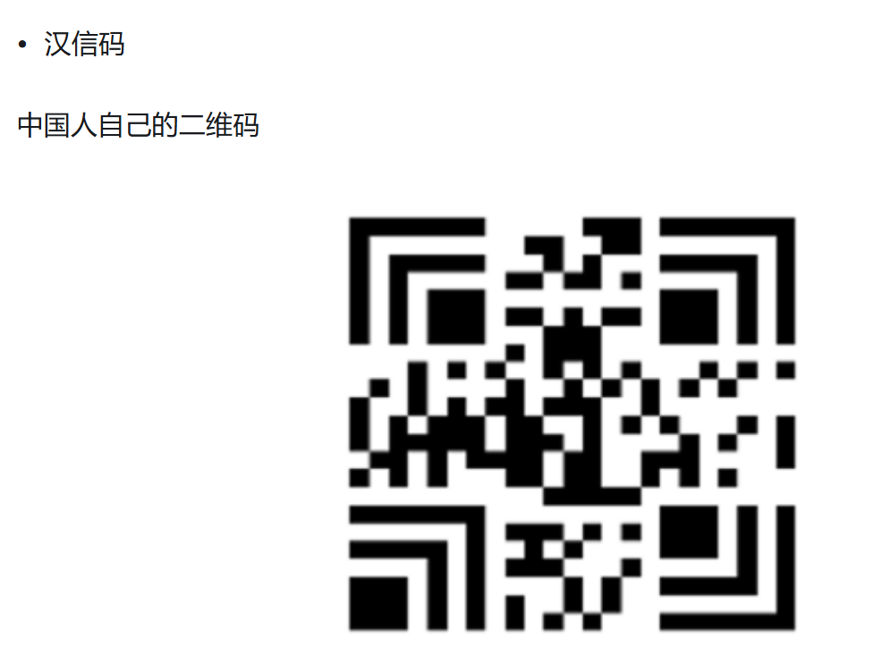

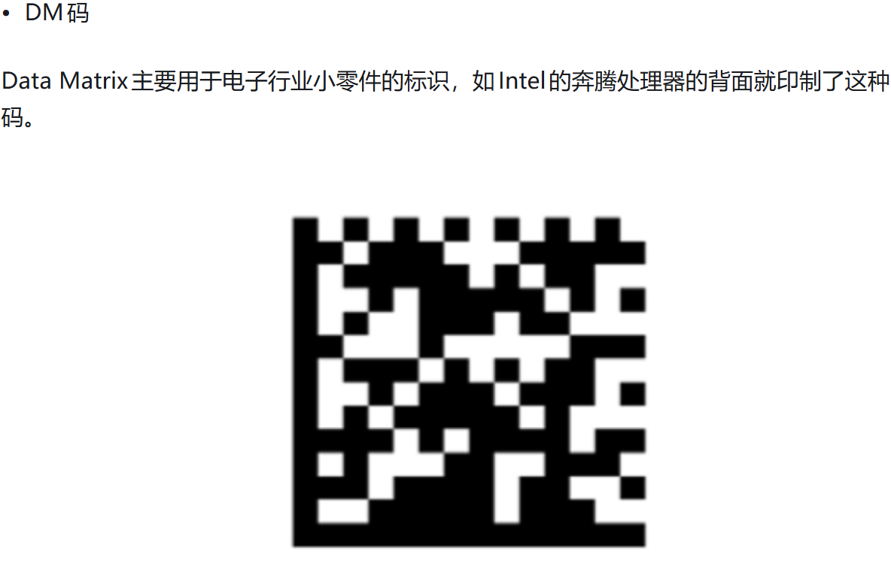、

猜测是和汉信和DM有关。

## 曼波曼波曼波

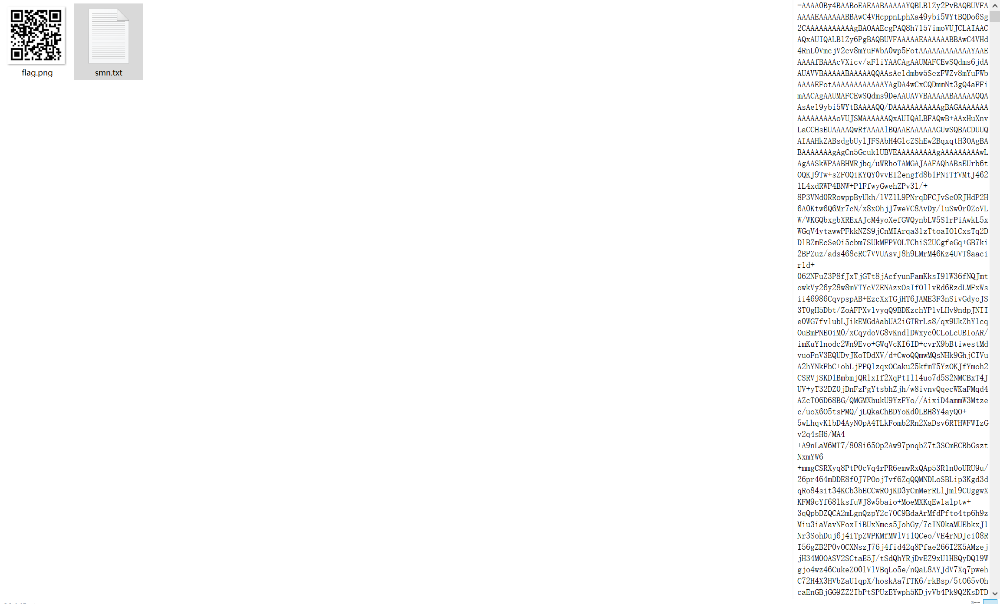

直接扫二维码


666我是个不信邪的小伙（

+ smn.txt开头有等号猜测和base64编码相关：**<u>Base64 编码时需要将二进制数据按 3 个字节（24 位）为一组，转换成 4 个 6 位的 Base64 字符，所以有时会在结尾填充=。</u>**
+ 而这个文件=在最开头非常扎眼，推测文本被倒置。同时考虑到文本量过于庞大，大概率是图片转换过来的数据。

使用SRK（CyberChef的汉化版）反转、解码、渲染图像

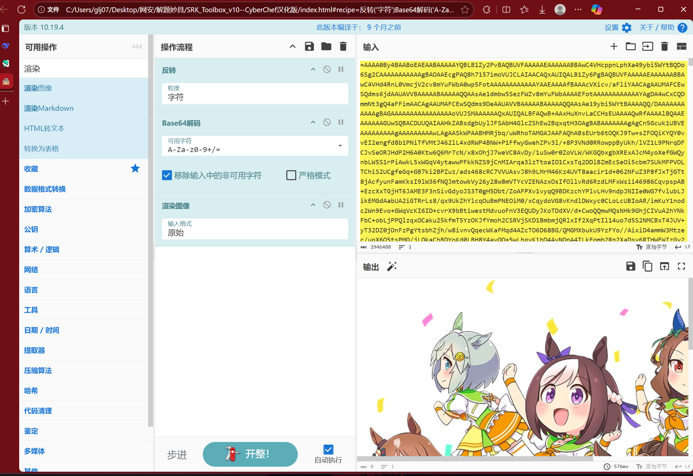

+ 
+ 用**foremost**提取得到压缩包（Foremost 是一款常用于文件提取和数据恢复的工具，尤其在Misc（杂项）、Forensics（取证）和Steganography（隐写术）类题目中经常使用。它的核心功能是从磁盘镜像、二进制文件或存储设备中提取隐藏或删除的文件，基于文件的头部（Header）和尾部（Footer）签名进行识别。）
+ 根据提示，内层压缩包xixi.zip的密码是XYCTF2025
+ 外层的图片和内层压缩包的图片一样，怀疑是双图盲水印，使用**<u>随波逐流双图盲水印解密</u>**即可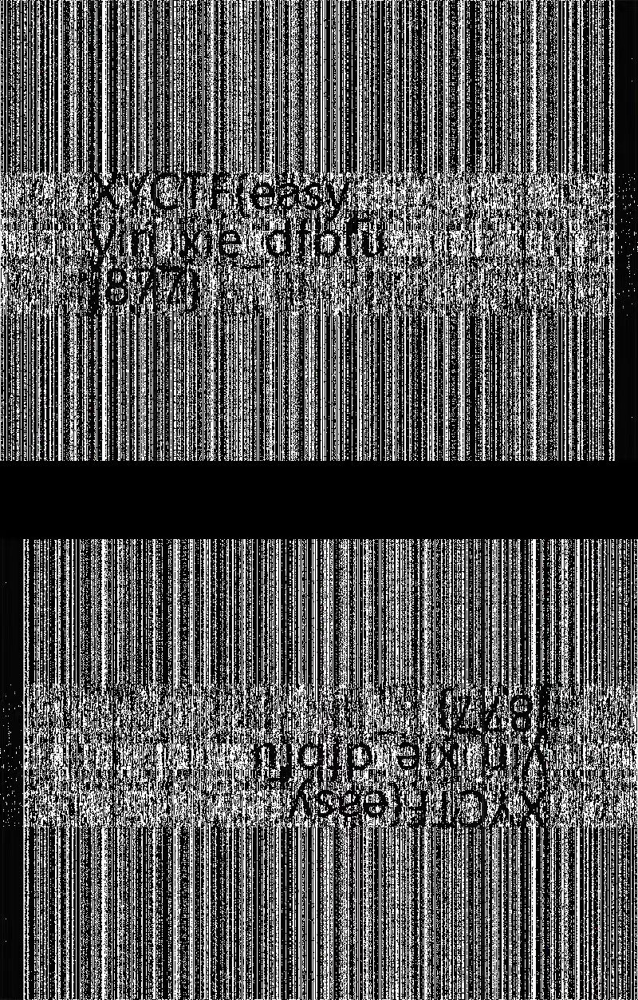

得到flag。

## 明日方舟寻访模拟器

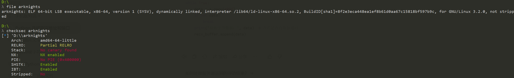

## 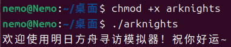
chmod +x arknights

./arknights


## 逐项解释：
### `ELF 64-bit LSB executable`
+ **ELF**: Executable and Linkable Format，Linux 标准可执行文件格式
+ **64-bit**: 64位程序
+ **LSB**: Least Significant Byte，小端序（数据存储方式）
+ **executable**: 可执行文件（不是库文件或对象文件）

### `x86-64, version 1 (SYSV)`
+ **x86-64**: AMD64/Intel 64 架构（64位x86处理器）
+ **SYSV**: System V ABI，Unix 系统调用规范

### `dynamically linked`
+ **动态链接**：运行时需要外部库文件（如 [libc.so](https://libc.so/)）
+ 与之相对的是 `statically linked`（静态链接）

### `interpreter /lib64/ld-linux-x86-64.so.2`
+ **解释器**：程序加载器，负责加载和运行程序
+ 这是 Linux 的动态链接器路径

### `BuildID[sha1]=8f2e3eca448ea1ef8b61d0aa67c15818bf597b9c`
+ **构建ID**：文件的唯一标识符，用于调试和版本管理

### `for GNU/Linux 3.2.0`
+ **目标系统**：为 GNU/Linux 3.2.0 系统编译

### `not stripped`
+ **未剥离**：包含调试符号信息（函数名、变量名等）
+ 这对逆向分析和调试很有帮助
+ 如果是 `stripped` 则移除了这些信息

---

## 这对 CTF Pwn 的意义：
1. **64位程序** → 使用 64 位 ROP gadgets，参数通过寄存器传递
2. **动态链接** → 可能需要泄露 libc 地址
3. **未剥离** → 逆向分析更容易，可以直接看到函数名
4. **ELF 格式** → 标准 Linux 可执行文件

---

## 下一步分析建议：
bash

```plain
# 检查安全机制
checksec arknights

# 查看引用的库
ldd arknights

# 查看符号表（函数名）
nm arknights

# 或者用 objdump
objdump -t arknights | head -20

# 用 strings 查看字符串
strings arknights | grep -i flag
```

这是一个标准的 **64位 Linux Pwn 题目**，你可以开始分析漏洞了！

## "无标题文档"

## 为什么是 127.0.0.1？
### 1. **本地回环地址**
+ `127.0.0.1` 是标准的本地回环地址（localhost）
+ 任何计算机上，`127.0.0.1` 都指向自己


33060 8080 端口常用

nmap -


若-p-扫描所有，太慢

可以针对性

如果扫的慢，可以后面加一个-pn 用pin扫描

CVE

nday永恒之蓝

无影-图形化解密

1day

service


wordpress

博客搭建hexo

apache cve

.dockerfile

<?php 标签

## "掩码爆破"

题目：好像总共6位。看到密码的第三个是字母a

解答：使用Advanced Archive Password Recovery掩码破解压缩包密码：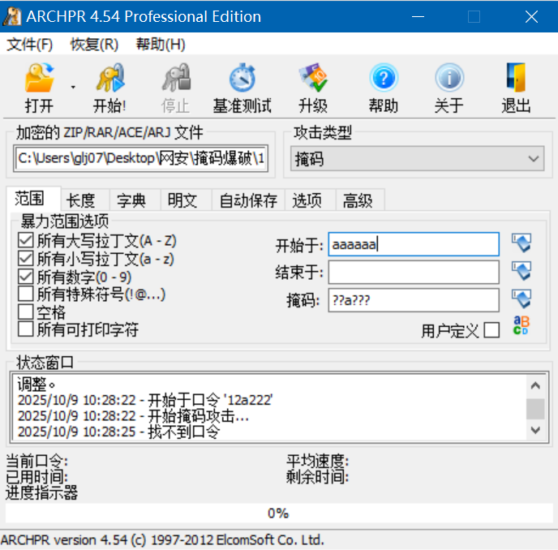

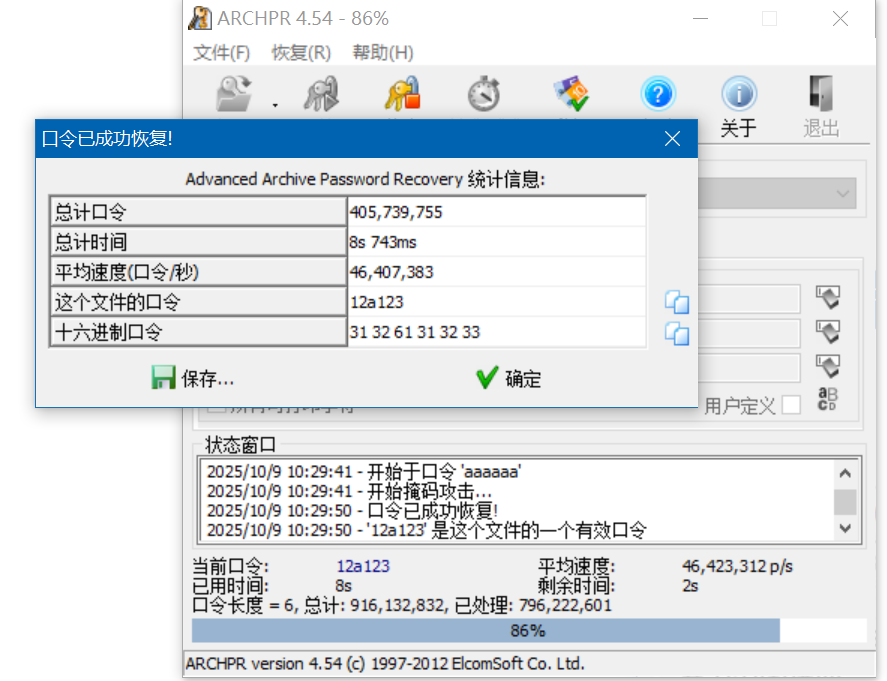

仅耗八秒解得flag{zxcdascdqw1wsascq1wdwdsq}

（ps：我试验了一下，不选择掩码直接爆破需要花17分钟）

## 幽清晨成员大头照解密

题目：

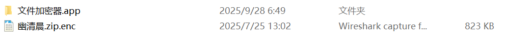

思路：

enc 文件 通常表示 加密文件（Encrypted File），并没有统一的标准格式，而是由加密软件或工具自定义生成的加密后文件。

解得密码后，**使用原加密软件的解密功能（如“文件加密器.app”），输入密码解密成原始文件。**

**破解这个幽清晨.zip.enc 密码的大致方向：**

**1. 判断加密类型**

查看文件头（用 WinHex 或 CyberChef 看前几十字节）：

+ <u> 如果开头有 Salted__ 等字符串，可能是 OpenSSL 格式的加密（AES-256-CBC 等）。</u>
+ <u>如果开头 8 字节类似魔数（如 53 61 6C 74 65 64 是"Salted"），说明有 salt。</u>
+ <u>如果完全随机高熵，可能是 AES 或流加密。</u>
+ <u>如果熵较低，可能是简单 XOR 或异或加密。</u>

2. 手动猜密码，试试可能撞大运

**3.**** 使用 CyberChef 进行算法+密码测试**

如果知道或猜测算法，可在 CyberChef 用以下流程：

示例：AES 解密测试

[AES Decrypt]

- Key: 幽清晨 （UTF8 或 Hex）

- IV: 000000...（或同 Key）

- Mode: CBC（常见）

然后看输出是否出现 PK 头。

**4. 暴力破解/字典攻击**

如果简单密码不对，需用工具做字典攻击或暴力破解。

工具推荐：

·<u> John the Ripper（支持加密 ZIP 破解）</u>

<u>· hashcat（需知道加密算法，性能强大）</u>

· 如果是自制加密器，可能要自己写脚本。

**5. 已知明文攻击（如果加密前是 ZIP）**

如果加密算法是流加密（如 XOR、RC4）或块加密但模式是流模式，可以利用 ZIP 文件头固定字节（50 4B 03 04…）进行已知明文攻击，恢复密钥。

**在 CyberChef 用 XOR Brute Force 并设置 Crib = PK 就是一种已知明文攻击。**

**6. 分析“文件加密器.app”**

如果这个 app 是你或认识的人写的，可以：

· 反编译或查看其源代码（如果是 Python 等脚本）。

· 分析加密逻辑（是否使用固定密钥、固定 IV、简单 XOR 等）。


**解答过程：**

+ 尝试用winhex打开，选择工具—磁盘工具—通过文件类型恢复，勾选Archive，显示未成功识别文件。
+ 将幽清晨拖入CyberChef，用Magic尝试自动识别加密/编码方式，输出了乱码
+ 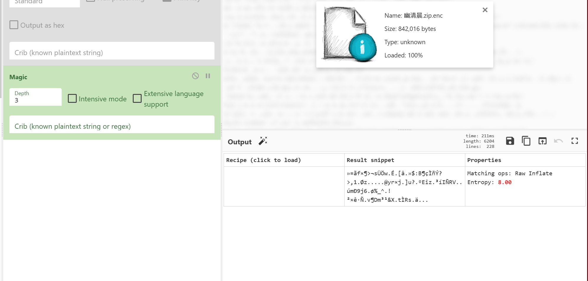

**Entropy: 8.00** → 熵值很高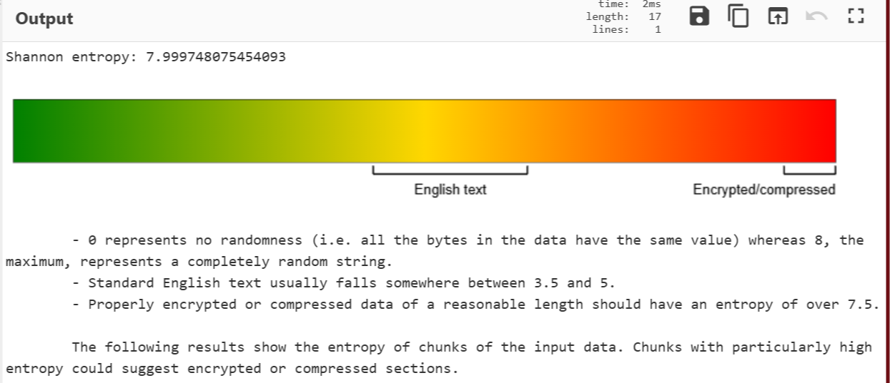

**<u>如果熵值 ≈ 7.8~8.0，基本确定是加密数据。</u>**

**<u>如果熵值 ≈ 6.0~7.0，可能是压缩数据（ZIP 本身熵高，但不会接近 8）。</u>**

### **用 CyberChef 尝试 XOR 解密**
+ 使用 **XOR Brute Force**，Key length 从 1 到 8，**Crib** 填 `PK`。
+ 观察是否有密钥能解出 `PK` 开头的数据。

## ✅ 正确参数设置
| 参数 | 推荐值 | 说明 |
| --- | --- | --- |
| **Key length** | `1`→ `4`<br/>（先试 1，再试 2） | 密钥太长会导致结果太多，先从短的开始 |
| **Sample length** | `10` | 不需要 100，只要检查前几个字节是否出现 `PK`即可 |
| **Scheme** | `Standard` | ✅ |
| **Null preserving** | □ 不勾选 | ✅ |
| **Print key** | ✅ **必须勾选** | 这样才会显示是哪个密钥解出的 |
| **Output as hex** | □ 不勾选 | 我们要看原始字节或文本结果 |
| **Crib** | `PK` | ✅ 正确 |


**Sample offset** 是指从文件开头跳过多少字节后开始取样（用于密钥测试），

+ 大多数情况用 0，因为加密通常从文件头开始。

**需要调整 offset 的情况**

+ 如果加密时**跳过了文件头**（比如前 100 字节是明文元数据，之后才是加密内容），就要把 offset 设为 100，这样 Brute Force 会从偏移 100 处开始测试密钥。
+ 或者已知 ZIP 文件头在原文件中的偏移量（比如加密后 `PK` 出现在偏移 2753 处），但这里我们是要找密钥，所以 offset 应设为 0。

  
 得：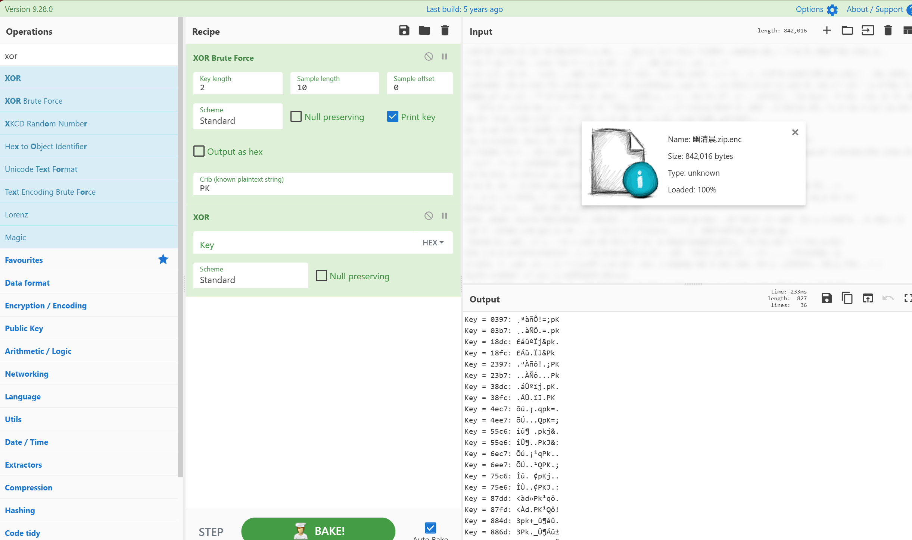

<u>真正有效的密钥是那些解密后 </u>`<u>PK</u>`<u> 以正常大写字母形式出现的</u>

+ 然鹅，输入key输出依旧乱码

分析：

1. **加密算法不是 XOR**
2. **XOR 密钥长度 > 2**
3. **加密算法是 AES/DES/RC4 等对称加密**
4. **加密前有自定义文件头或压缩**


+ 找到site.pyc
+ 考虑使用decompyle3或**uncompyle6 **反编译
+ **反编译**`**site.pyc**`**时遭遇了解析错误**，错误核心是无法识别偏移量 418 处的`END_FINALLY`指令对应的控制流结构。这种问题通常源于 Pyc 文件损坏、Python 版本不匹配、反编译工具兼容性不足，或 Pyc 文件被故意混淆。
+ **目标**`**site.pyc**`**大概率被混淆过**

| **工具** | **优势** | **劣势** |
| :--- | :--- | :--- |
| **uncompyle6** | - 直接反编译`.pyc`<br/>为 Python 代码，支持多版本（2.7-3.12）- 命令行工具，简单易用 | - 对高度混淆的字节码可能失败- 反编译结果需人工调整格式 |
| **pycdc** | - 轻量级，反编译速度快- 对部分混淆代码有更好的兼容性 | - 对最新 Python 版本（如 3.12+）支持有限- 反编译结果可读性略逊于 uncompyle6 |
| **IDA Pro** | - 强大的二进制分析能力- 支持动态调试和插件扩展 | - 需复杂工具链，反编译效果差- 商业授权，成本高 |


+ <u>想试试</u><u>用</u>`<u>pycdc</u>`<u>反编译 </u>但是没下载到（哭）


**<u>思路：要解出 flag，首先得分析 “文件加密器.app” 的加密逻辑，再对加密后的 “1.zip.enc” 进行解密。</u>**

### 1. 分析 “文件加密器.app” 的加密方式
“文件加密器.app” 是 macOS 应用，从其 `Contents/Resources` 里的文件（如 `__boot__.py`、`gui_wrapper.py` 等 Python 相关文件）来看，它大概率是用 Python 开发并通过打包工具（如 py2app）生成的。

+ 找到核心加密代码：重点查看 `gui_wrapper.py` 或 `__boot__.py` 等文件，寻找与加密相关的函数，比如涉及密钥生成、加密算法（如 AES、DES 等对称加密，或 RSA 等非对称加密）调用的部分。
+ 确定加密参数：像密钥长度、加密模式（ECB、CBC 等）、初始向量（IV，如果有）、填充方式等。

### 2. 对 “1.zip.enc” 进行解密
根据第一步分析出的加密方式，进行逆向解密操作。

+ 如果是对称加密（如 AES）：需要获取正确的密钥和 IV（若加密模式需要），然后使用相应的解密函数对 “1.zip.enc” 进行解密，得到原始的 “1.zip” 文件。
+ 如果是非对称加密：则需要对应的私钥来解密。
+ 解密工具选择：可以使用 Python 编写解密脚本（调用 `cryptography` 等第三方库），或者使用专业的加密 / 解密工具（如 OpenSSL 等），根据加密算法和参数进行操作。

### 3. 提取 flag
解密得到 “1.zip” 后，解压该文件，查看其中的内容，flag 通常会以文本形式存在于解压后的文件中（如某个 txt 文件里）。

需要注意的是，实际操作中可能会遇到各种问题，比如加密逻辑复杂、需要动态调试 “文件加密器.app” 来获取运行时的密钥等，这就需要结合更专业的逆向工程工具（如 GDB、IDA Pro 等）来进一步分析。

**编辑****分享**

如何使用Python编写解密脚本？

怎样获取“文件加密器.app”中的密钥？

有哪些工具可以辅助分析“文件加密器.app”的加密逻辑？


先压缩再加密，我应当先解密再解压。

没招了，超详细问ai  
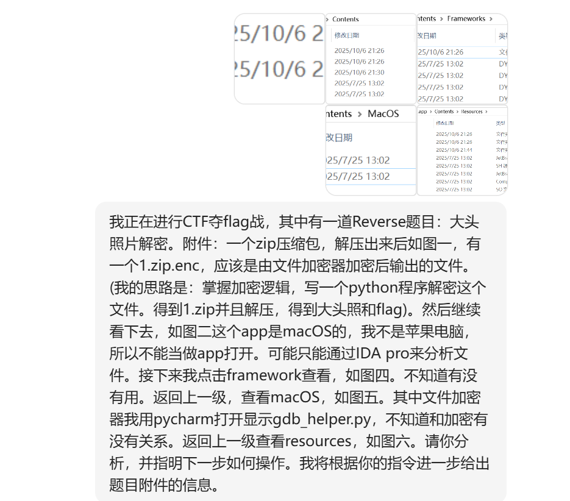  
 

  
 前16字节 AES

bkcrack解明文更好

## "这羽毛球怎么只有一半啊（恼_）"

题目：所以下半身是什么呢（ww

+ 解压得可爱的小草神.png
+ 题目提示图片缺少下半部分，故使用[随波逐流]CTF编码工具修复高宽
+ 拖入得羽毛球-修复高宽.png，得到flag。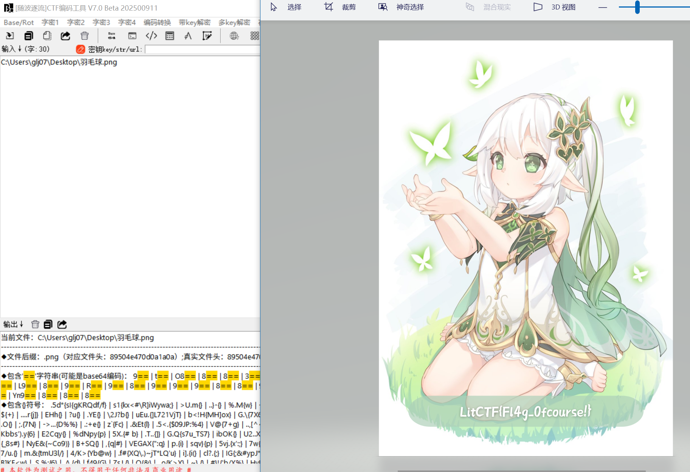

## "baby_eval"

题目：

<?php  
highlight_file(__FILE__);  
// flag还是在/flag  
if(isset($_POST['code'])){  
$code = $_POST['code'];  
if (preg_match('/[b-zA-Z]/', $code)) {  
die('Detected forbidden characters!');  
}  
system($code);  
}  
?>


要解决这道 Web 题目，核心是突破**<u>字母过滤限制</u>** 并执行系统命令读取 `/flag` 文件

核心矛盾：`system()` 支持执行 Linux 系统命令，但`code`参数**不能包含任何字母**，需用「无字母命令」读取 `/flag`。

### 二、关键技术：Linux 无字母命令构造
Linux 系统中，命令和文件路径可通过 **ASCII 码（十进制 / 八进制）转义** 表示，无需直接写字母。例如：

+ 命令 `cat`（用于读取文件）的 ASCII 码：`c(99)、a(97)、t(116)`
+ 文件路径 `/flag` 的 ASCII 码：`/(47)、f(102)、l(108)、a(97)、g(103)`

在 Bash 终端中，`$'\xXX'` 或 `$'XXX'`（XXX 为八进制）可将 ASCII 码转义为对应字符，例如：

+ `$'\x63\x61\x74'` 等价于 `cat`（63 是 c 的十六进制 ASCII 码，61 是 a，74 是 t）
+ `$'\x2f\x66\x6c\x61\x67'` 等价于 `/flag`（2f 是 / 的十六进制 ASCII 码）
+ 目标命令是 `cat /flag`（读取 /flag 文件），将其转为 **纯 ASCII 码转义格式**（无任何字母）：最终可执行的`code`参数为：

**bash**

```bash
code=$'\143\141\164' /??a?
```

#### 2. 发送 POST 请求
通过工具（如 Burp Suite、Postman）或脚本向目标 URL `http://152.32.191.198:33387/` 发送 POST 请求，携带上述`code`参数。

以 **Burp Suite** 为例：

1. 打开 Burp，配置浏览器代理，访问目标 URL；
2. 拦截请求，将请求方法从 `GET` 改为 `POST`；
3. 在请求体中添加参数：code=$'\143\141\164' /??a?
4. 发送请求，查看响应，即可看到 `/flag` 文件的内容（即 flag 值）。


## 1. 原理解读
sh

code=$'\143\141\164' /??a?

这里分为两部分：

1. `**$'\143\141\164'**`  
这是 Bash 的 ANSI-C 引号语法，`$'...'` 里面的反斜杠后跟八进制数字会被转换成对应的 ASCII 字符。
    - `\143` 八进制 → 十进制 99 → ASCII 字符 `'c'`
    - `\141` 八进制 → 十进制 97 → ASCII 字符 `'a'`
    - `\164` 八进制 → 十进制 116 → ASCII 字符 `'t'`  
所以 `$'\143\141\164'` 在展开后就是 `cat`。
2. `**/??a?**`  
这是通配符匹配文件名：
    - `/` 根目录开始
    - `??a?` 表示：第1个字符任意，第2个字符任意，第3个字符是 `a`，第4个字符任意。  
在根目录下，符合这个模式的文件名可能是 `flag`（`fl` 任意吗？不是，这里 `/??a?` 在根目录下匹配，比如 `/bin` 是 4 个字符，但第三个字符不是 `a`）。  
实际上，更可能是用来匹配 `/flag` 吗？不，`/flag` 是 5 个字符 `/ f l a g`，不符合 4 个字符的模式。  
所以 `/??a?` 可能匹配到 `/bin/bash` 吗？不，那是 8 个字符。  
其实这里 `/??a?` 可能是笔误或者需要具体环境测试，更常见的是用 `/??a?` 匹配 `/bin/cat` 吗？也不对，`/bin/cat` 是 8 个字符。

---

## 2. 为什么这样能绕过过滤
原题的过滤是：

php

preg_match('/[b-zA-Z]/', $code)

它禁止 `b-z` 和 `A-Z`，但允许：

+ 小写字母 `a`
+ 数字、符号、通配符、空格、`$`、反斜杠、单引号等

`$'\143\141\164'` 这个字符串里，字面上只有 `$ \ 1 4 3 1 4 1 1 6 4 '` 这些字符，没有任何 `b-zA-Z`，所以能通过过滤。

但是在 `system($code)` 执行时，Shell 会先进行 ANSI-C 转义，把 `$'\143\141\164'` 变成 `cat`，然后执行。

---

## 3. 后半部分 `/??a?` 的作用
如果直接 `$'\143\141\164' /????` 就是 `cat /flag`（假设 flag 文件在根目录且名为 4 字符）。  
但这里你写的是 `/??a?`，这是 4 个字符，第三个字符必须是 `a`。  
在根目录下，常见 4 字符文件名且第三个字符是 `a` 的有：

+ 可能没有 `flag`（因为第三个字符是 `l` 不是 `a`）
+ 可能是 `/data`、`/var?` 等，但一般根目录下没有这样的文件。

所以 `/??a?` 可能匹配不到 `/flag`，除非文件名第三个字母是 `a`。  
如果题目环境根目录下有一个文件名为 `f?ag` 之类的，或者 `/etc/passwd` 是 11 个字符，不匹配。

---

## 4. 更合理的 payload
为了读 `/flag`，应该用：

sh

code=$'\143\141\164' /????    # 匹配 /flag

或者

sh

code=$'\143\141\164' /???a?   # 如果 flag 是 5 个字符且第三个是 a

但 `/flag` 是 5 个字符 `/ f l a g`，所以用 `/?????` 匹配。

---

## 5. 总结
你给出的 `code=$'\143\141\164' /??a?` 是一个**用八进制转义绕过字母过滤**的方法

## "Basic_Number_theory"

数论并非那么简单...答案用SPCCTF{}包裹

tips：试着了解一下费马小定理、同余运算的规则

```python
from Cryptodome.Util.number import *

flag=b'SPCCTF{********}'

def gift(m, prime):
    """
    计算模素数下的平方根
    参数:
        m: 被开方数
        prime: 模数，必须是一个素数
    返回:
        m 在模 prime 下的平方根，即满足 x^2 ≡ m (mod prime) 的 x 值
    """
    return pow(m, (prime + 1) // 2, prime)

m = bytes_to_long(flag)
p = getPrime(256)
q = getPrime(256)

print(f'p = {p}')
print(f'q = {q}')
print(f'gift1 = {gift(m, p)}')
print(f'gift2 = {gift(m, q)}')

'''
p = 105567001902149483225233801278030547652749833525571608392930512645364400245999
q = 81511997683966846473333390828680375856568631631277717336250575831122994340471
gift1 = 105419799642658114984760815640014033297217363704585842609128111376906603236722
gift2 = 81364795424475478232860405190663861501036161810291951552448174562665197331194
'''
```

解密：

通过中国剩余定理（CRT），从给定的素数 p、q 以及模平方根值还原出原始 flag：

```python
from Crypto.Util.number import long_to_bytes
p = 105567001902149483225233801278030547652749833525571608392930512645364400245999
q = 81511997683966846473333390828680375856568631631277717336250575831122994340471
gift1 = 105419799642658114984760815640014033297217363704585842609128111376906603236722
gift2 = 81364795424475478232860405190663861501036161810291951552448174562665197331194
# 计算所有可能的平方根组合（每个模数有两个可能的平方根）
x_p_candidates = [gift1, p - gift1]
x_q_candidates = [gift2, q - gift2]
# 使用中国剩余定理寻找满足条件的m
n = p * q
for x_p in x_p_candidates:
    for x_q in x_q_candidates:
        # 计算满足以下条件的m:
        # m ≡ x_p (mod p)
        # m ≡ x_q (mod q)
        # 利用扩展欧几里得算法计算模逆
        inv_p = pow(p, -1, q)  # p在模q下的逆元
        k = (x_q - x_p) * inv_p % q
        m = x_p + k * p 
        # 将结果转换为字节并尝试解析flag
        try:
            flag = long_to_bytes(m)
            if flag.startswith(b'SPCCTF{') and flag.endswith(b'}'):
                print("Found flag:", flag.decode())
        except:
            continue
```

### 


## "basics"

基础，答案用utflag{}包裹[binary.txt](basics/1763080711015-a6595b2e-cc67-4734-8140-49a1cfd054c7.txt)

排除零宽隐写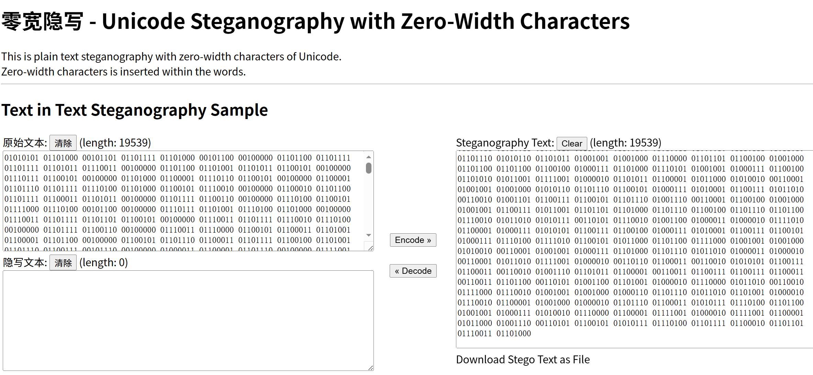

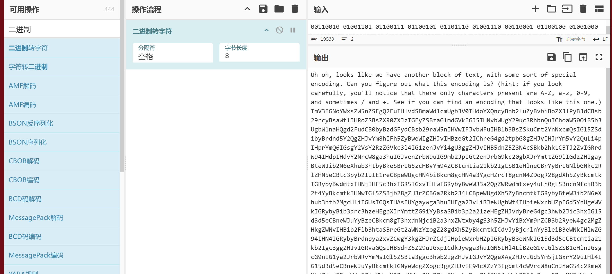

只有 A-Z, a-z, 0-9, 以及 `/` 和 `+` 出现

猜测base64编码方式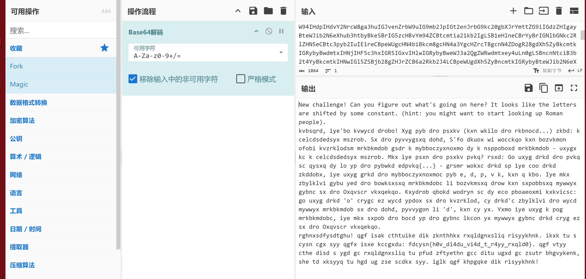

罗马人。明显是凯撒密码

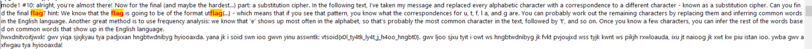

信息中的每一个字母都被另一个独特的字母替换了

工具：[https://quipqiup.com/](https://quipqiup.com/)

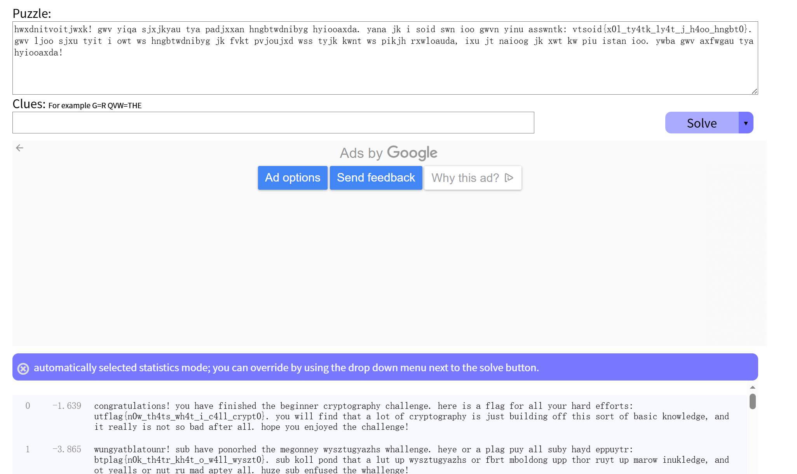

utflag{n0w_th4ts_wh4t_i_c4ll_crypt0}

## "CTF决赛"

## OA入侵分析
### hacker 对目标系统进行用户爆破，成功登陆后台的帐号密码是？格式如test/123456。
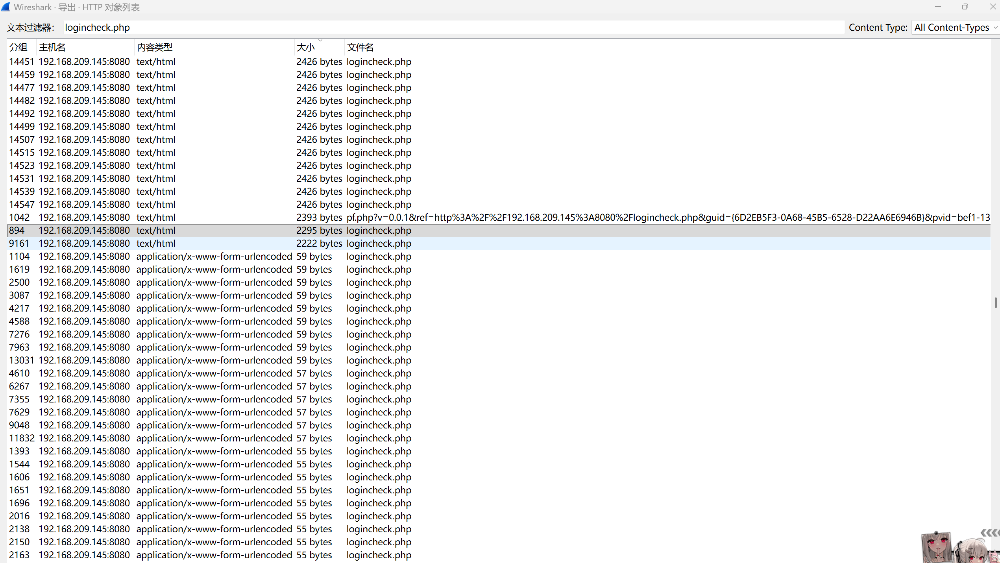

按大小排序，发现两个比较特殊的logincheck.php，打开看看。

## F12_

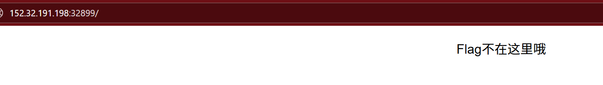

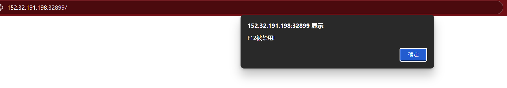直接

**Ctrl+Shift+C** 打开元素选择器

**Ctrl+Shift+J** 打开控制台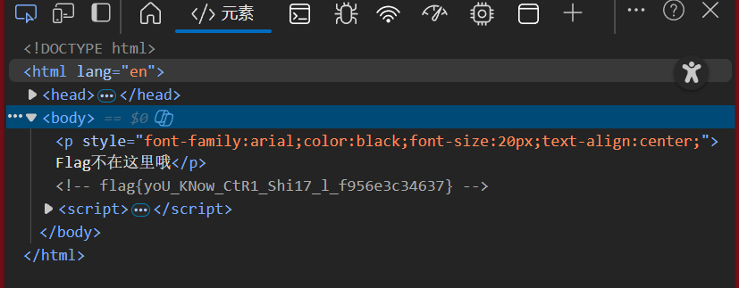

## "ida使用"

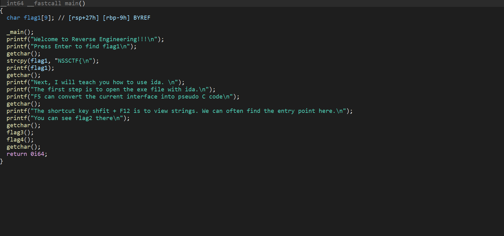NSSCTF{IDA_1s_4_VeRy_ImporTant_t0ol_iN_rever5e_en8ine3ring}

## PNG_Master

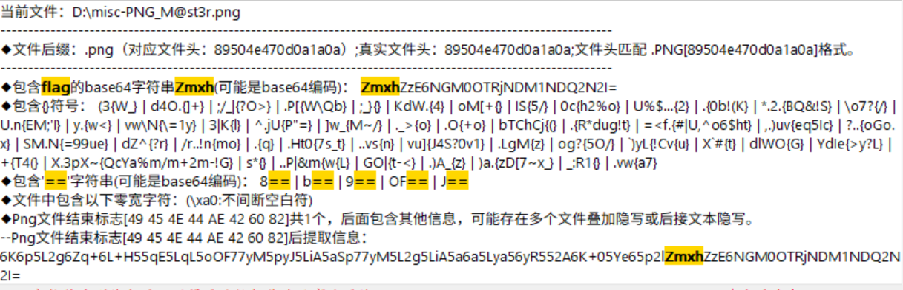

+ 让你难过的事情，有一天，你一定会笑着说出来flag1:4c494c4354467b
+ 第二段，LSB隐写，RGB最低位,打开Stegsolve：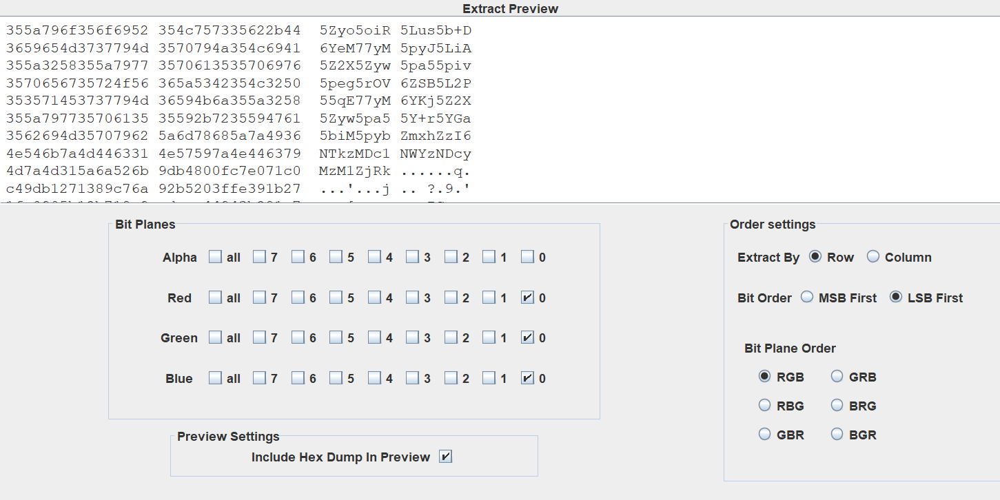

放入SRK，使用magic

在我们心里，有一块地方是无法锁住的，那块地方叫做希望flag2:5930755f3472335f4d

+ 第三段，pngcheck

pngcheck -v 150041_misc-PNG_M@st3r.png

chunk IDAT at offset 0x6f7bb, length 270

这一块异常，提取出来，然后zlib解压，得到压缩包

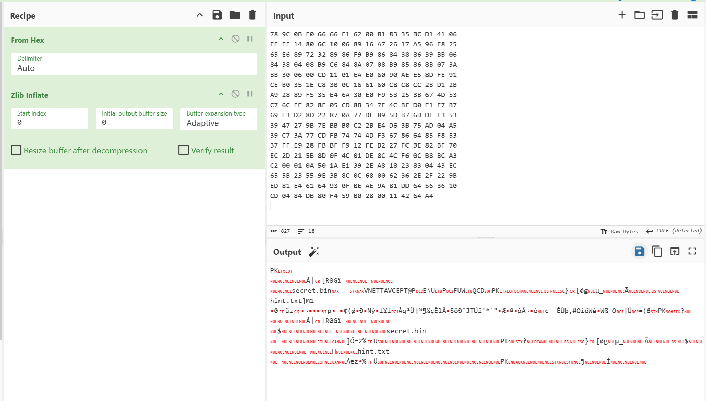

hint是零宽隐写，提示secret与文件名异或

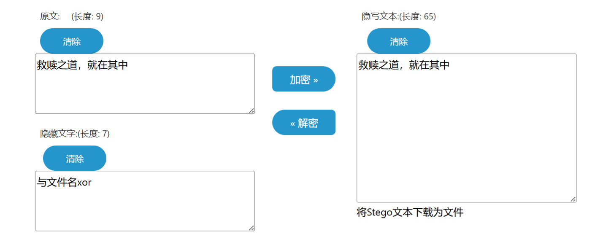

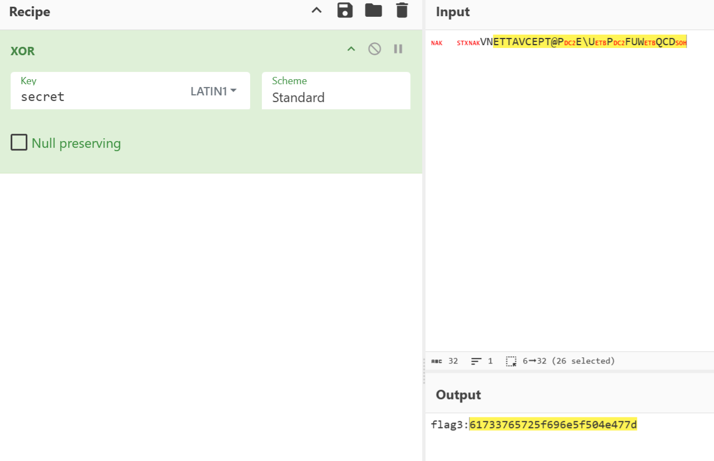

得到flag3:61733765725f696e5f504e477d

三段值十六进制解码得到最终flag

LILCTF{Y0u_4r3_Mas7er_in_PNG}

## twoEs1

two Es, too Ez! 用SPCCTF{}包裹


试着了解一下扩展欧几里得算法


```plain
import gmpy2

# 已知参数
n = 77653027019410283582708662091841984922043011758121679079881183020813164663803315218162399044305258074482737579924642303624296916990420038267507847806411365847770079739424288020008734096352715536212355610499244337263033620679172659903396470522388964976403280440005666750783772493205491694203801534799771603973
e1 = 1550550838
e2 = 4196113069
c1 = 10879882027555312937608696756143487708492509877667613620249639748606727334006539946052668627697088875994270713711095280209616987454727654075073679556671706894288288425066016765935927179268631914629763649753266424293357163466575462028472324055698901991171526421270840161635556574472647431065514324250656887711
c2 = 3011958986718808526365150648555525977083765700624932707761381505508399298854491454270664897732491521128964864382168158216240628717617068568110917894811504799962807736416471284350198523924590448858301736435406723758509936349838419125901147351088181623044341056413457153562300106346324761118425649126782967195

# 计算扩展欧几里得系数
s, s1, s2 = gmpy2.gcdext(e1, e2)

# 处理负指数（如果有的话）
if s1 < 0:
    s1 = -s1
    c1 = gmpy2.invert(c1, n)  # 求模逆
if s2 < 0:
    s2 = -s2
    c2 = gmpy2.invert(c2, n)  # 求模逆

# 计算明文
m = (pow(c1, s1, n) * pow(c2, s2, n)) % n

# 转换为字节并输出
from Crypto.Util.number import long_to_bytes
print(long_to_bytes(m).decode())
```

```plain
import gmpy2

# 已知参数
n = 77653027019410283582708662091841984922043011758121679079881183020813164663803315218162399044305258074482737579924642303624296916990420038267507847806411365847770079739424288020008734096352715536212355610499244337263033620679172659903396470522388964976403280440005666750783772493205491694203801534799771603973
e1 = 1550550838
e2 = 4196113069
c1 = 10879882027555312937608696756143487708492509877667613620249639748606727334006539946052668627697088875994270713711095280209616987454727654075073679556671706894288288425066016765935927179268631914629763649753266424293357163466575462028472324055698901991171526421270840161635556574472647431065514324250656887711
c2 = 3011958986718808526365150648555525977083765700624932707761381505508399298854491454270664897732491521128964864382168158216240628717617068568110917894811504799962807736416471284350198523924590448858301736435406723758509936349838419125901147351088181623044341056413457153562300106346324761118425649126782967195

# 计算扩展欧几里得系数
s, s1, s2 = gmpy2.gcdext(e1, e2)

# 处理负指数（如果有的话）
if s1 < 0:
    s1 = -s1
    c1 = gmpy2.invert(c1, n)  # 求模逆
if s2 < 0:
    s2 = -s2
    c2 = gmpy2.invert(c2, n)  # 求模逆

# 计算明文
m = (pow(c1, s1, n) * pow(c2, s2, n)) % n

# 转换为字节并输出
from Crypto.Util.number import long_to_bytes
print(long_to_bytes(m).decode())
```

## twoEs2

好像。。比刚刚twoEs1难一点？答案用SPCCTF{}包裹


两个e咋不互素？

```python
from Cryptodome.Util.number import *
import random

flag=b"SPCCTF{********}"

p, q = getPrime(512), getPrime(512)
n = p * q

e1 = random.getrandbits(32)
e2 = random.getrandbits(32)

m = bytes_to_long(flag)
c1 = pow(m, e1, n)
c2 = pow(m, e2, n)

print(f'{n = }')
print(f'{e1 = }')
print(f'{e2 = }')
print(f'{c1 = }')
print(f'{c2 = }')

'''
n = 97600241525101615748091592571664660926639880623676630098513390980179339048294452878617774530804846547759693682625720452045482941031433063601264167464483345140203593650062234011147495096867025786848883396312986373098722431552517575960894385653813275110519118159478403718867113163144951756435064109978693850991
e1 = 3739335288
e2 = 3124897683
c1 = 33002001040793361121205743705051566694083960204437803400110996553874970546459769940895274538944142911035661180721041433582055055901827086366079458238180515982882281159369335115689197909674012289803866694817803339799332165760217770985620911446230237865457225365735286754884597360255964535103536362788889343153
c2 = 28612632923221914052449458260170537094022260373135401108346955487860713981145320349945832078855063911329616383875004373295934310132767249858424266864981319085969453037587482565982836138763906635775429377847559657878241052164215585546465219419202751784070881845017799754069244601020027997406547478196338470880
'''
```

```python
import gmpy2
from Crypto.Util.number import long_to_bytes

n = 97600241525101615748091592571664660926639880623676630098513390980179339048294452878617774530804846547759693682625720452045482941031433063601264167464483345140203593650062234011147495096867025786848883396312986373098722431552517575960894385653813275110519118159478403718867113163144951756435064109978693850991
e1 = 3739335288
e2 = 3124897683
c1 = 33002001040793361121205743705051566694083960204437803400110996553874970546459769940895274538944142911035661180721041433582055055901827086366079458238180515982882281159369335115689197909674012289803866694817803339799332165760217770985620911446230237865457225365735286754884597360255964535103536362788889343153
c2 = 28612632923221914052449458260170537094022260373135401108346955487860713981145320349945832078855063911329616383875004373295934310132767249858424266864981319085969453037587482565982836138763906635775429377847559657878241052164215585546465219419202751784070881845017799754069244601020027997406547478196338470880

g = gmpy2.gcd(e1, e2)
print("gcd(e1, e2) =", g)

e1p = e1 // g
e2p = e2 // g

# 扩展欧几里得
gcd, s, t = gmpy2.gcdext(e1p, e2p)
print("gcd(e1', e2') =", gcd)
print("s, t =", s, t)

# 注意 s 或 t 可能是负数
if s < 0:
    c1_inv = gmpy2.invert(c1, n)
    part1 = pow(c1_inv, -s, n)
else:
    part1 = pow(c1, s, n)

if t < 0:
    c2_inv = gmpy2.invert(c2, n)
    part2 = pow(c2_inv, -t, n)
else:
    part2 = pow(c2, t, n)

M = (part1 * part2) % n

# 现在 M = m^3
# 开三次方
m, exact = gmpy2.iroot(M, 3)
if exact:
    print("Found m:")
    print(long_to_bytes(int(m)).decode())
else:
    print("Cube root not exact, need to check padding etc.")
```

gcd(e1, e2) = 3

gcd(e1', e2') = 1

s, t = 263546427 -315366631

Found m:

SPCCTF{3z_C0mm0n_M0du1u5_4774ck}

## "word-3"

文件是个伪加密。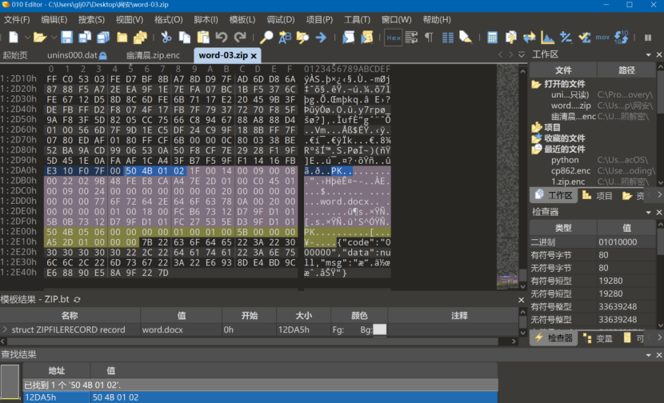

将09 00改成00 00（奇数是伪加密）

解压得到word.docx

+ 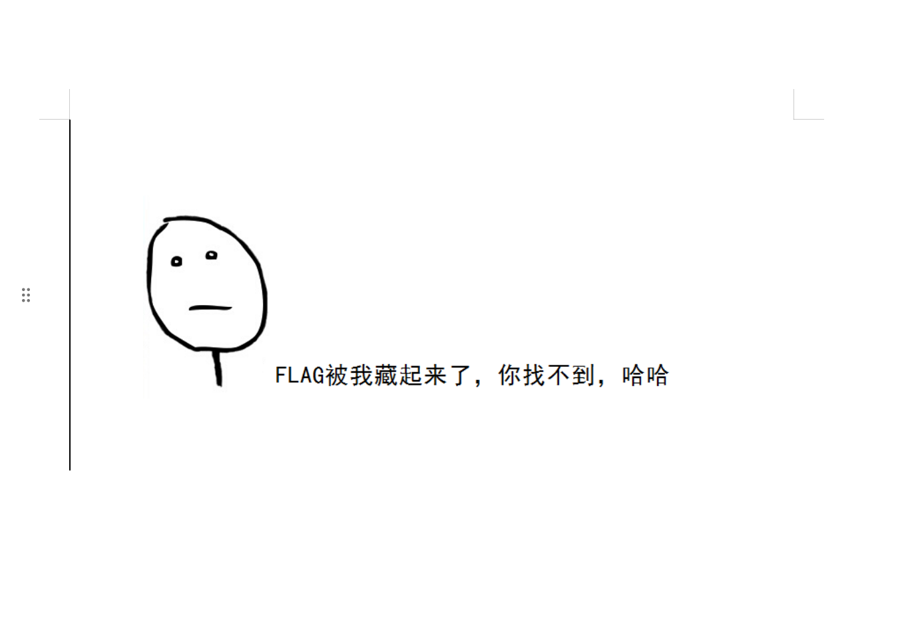

放入ctf随波逐流工具得文件内含zip标志

+ 更改后缀解压：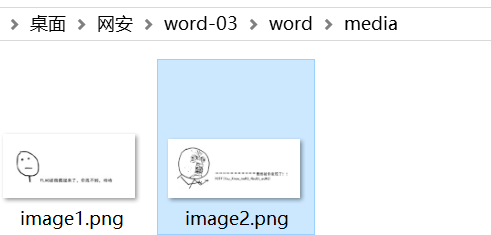

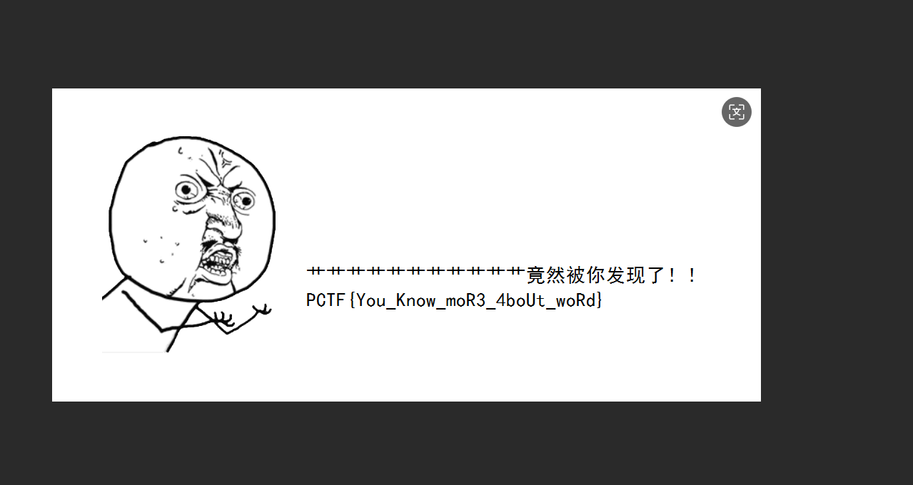

## X0r

题目内容：

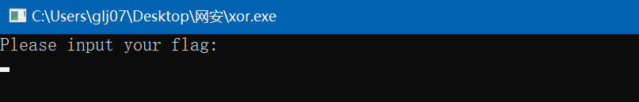

解答：

● 用IDA打开：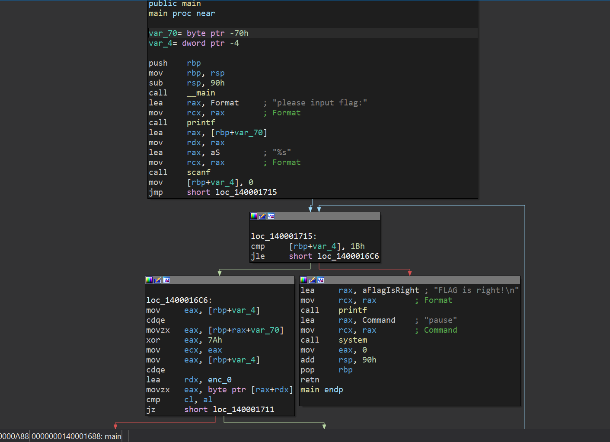

+ 按F5反编译成c语言代码：

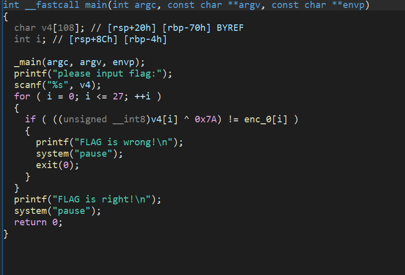

```plain
for ( i = 0; i <= 27; ++i )
{
    if ( ((unsigned __int8)v4[i] ^ 0x7A) != enc_0[i] )
    {
        printf("FLAG is wrong!\n");
        system("pause");
        exit(0);
    }
}
```

意思是：

+ 用户输入的 `v4[i]` 与 `0x7A` 异或。
+ 结果必须等于 `enc_0[i]`（`enc_0` 是程序里已有的数组，存放加密后的数据）。
+ 循环长度是 28（`i` 从 0 到 27）。

## 2. 解密方法
+ 由于XOR操作是可逆的，我们只需要按相反的顺序和相同的密钥进行XOR就能解密。

所以只要在 IDA 里找到 `enc_0` 数组的内容（应该是 28 个字节），然后每个字节与 `0x7A` 异或，就能得到 flag。

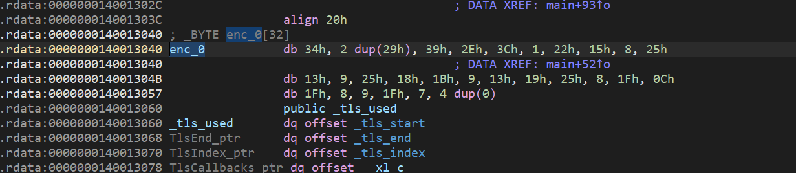

```python
def decrypt_flag(enc_data, xor_key=0x7A):
    flag = ''.join([chr(byte ^ xor_key) for byte in enc_data])
    return flag
enc_0 = [
    0x34, 0x29, 0x29, 0x39, 0x2E, 0x3C, 0x01, 0x22, 0x15, 0x08, 0x25,
    0x13, 0x09, 0x25, 0x18, 0x18, 0x09, 0x13, 0x19, 0x25, 0x08, 0x1F, 0x0C,
    0x1F, 0x08, 0x09, 0x1F, 0x07, 0x00, 0x00, 0x00, 0x00
]
flag = decrypt_flag(enc_0)
print(f"解密后的 flag: {flag}")
```

NSSCTF{Xor_is_basic_reverse}


