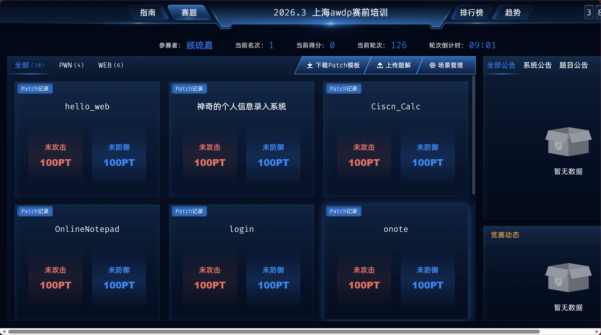

openvpn下载地址：[https://softradar.com/openvpn/download/de/](https://softradar.com/openvpn/download/de/)



<font style="color:#000000;background-color:rgba(255, 255, 255, 0);"></font>

<font style="color:#000000;background-color:rgba(255, 255, 255, 0);"></font>

<font style="color:#000000;background-color:rgba(255, 255, 255, 0);"></font>

<font style="color:#000000;background-color:rgba(255, 255, 255, 0);">打包命令：</font>`<font style="color:#000000;background-color:rgba(255, 255, 255, 0);">tar czvf patch.tar.gz patch.sh patch_ok</font>`

<font style="color:#000000;background-color:rgba(255, 255, 255, 0);">示例patch.sh：</font>

```plain
#!/bin/bash
cp xxx.php /var/www/html/xxx.php
```

<font style="color:#000000;background-color:rgba(255, 255, 255, 0);">注意： 请严格按patch示例进行patch，请在linux环境下进行编辑、压缩；直接使用cp覆盖目标文件，patch.sh压缩前赋值为777即可，其余操作可能导致patch.sh脚本执行失败。</font>

<font style="color:#000000;background-color:rgba(255, 255, 255, 0);"></font>


加权区别：

chmod 655


