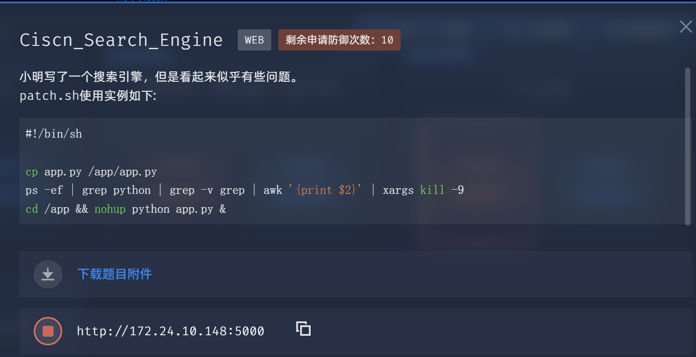
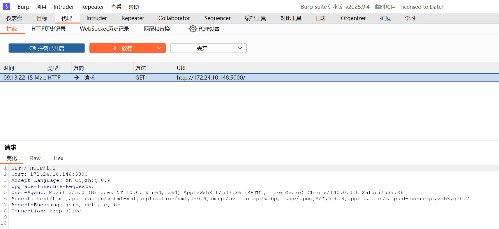
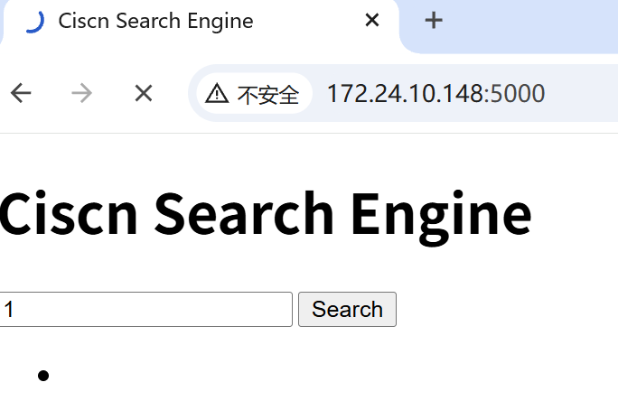
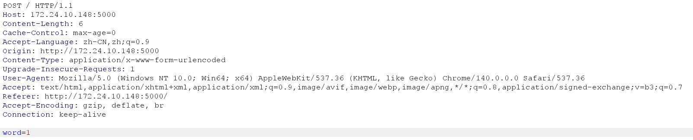
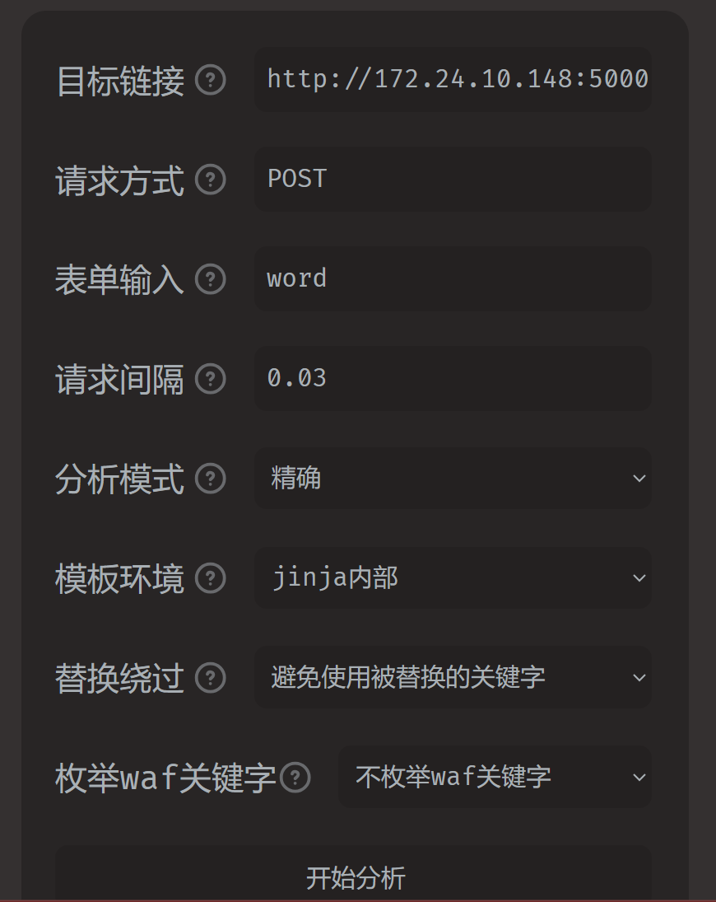
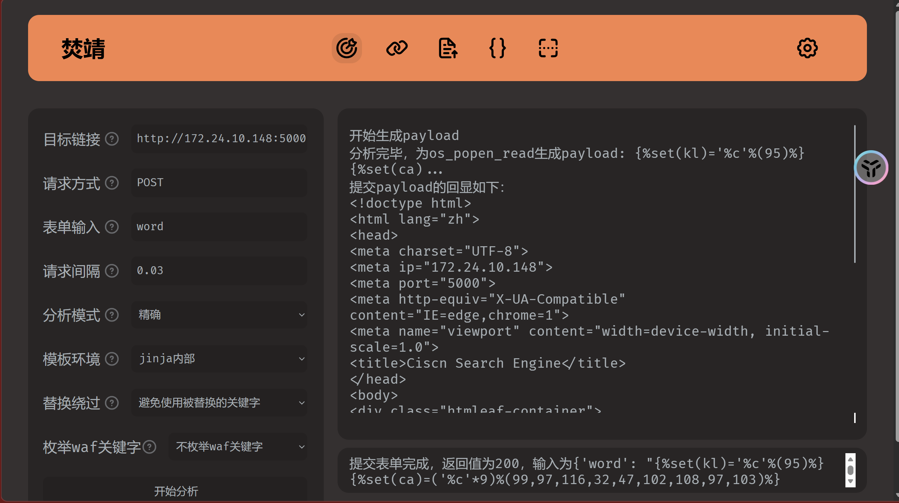
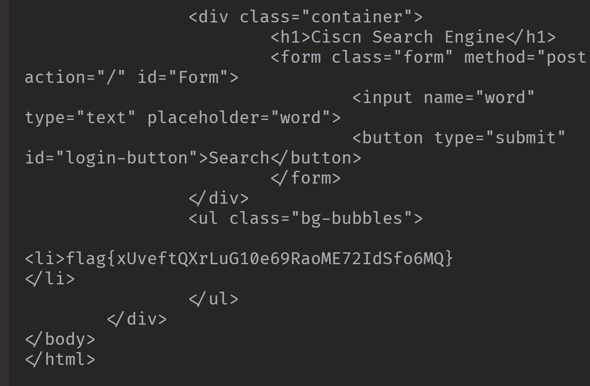

## 题目描述
<font style="color:#000000;background-color:rgba(255, 255, 255, 0);">小明写了一个搜索引擎，但是看起来似乎有些问题。</font>

```bash
#!/bin/sh

cp app.py /app/app.py
ps -ef | grep python | grep -v grep | awk '{print $2}' | xargs kill -9 
cd /app && nohup python app.py &
```

实例入口：http://172.24.10.148:5000

## 攻击
首先在Burpsuite里抓包。

打开内嵌浏览器，开启拦截





输入东西。看看反馈。



看到可攻击参数word。

cmd输入fenjing webui



开始分析。结束后cat /flag

  


flag{xUveftQXrLuG10e69RaoME72IdSfo6MQ}

## 防御
```python
from flask import *
import os
from waf import waf
import re

app = Flask(__name__)

pattern = r'([0-9]{1,3}\.[0-9]{1,3}\.[0-9]{1,3}\.[0-9]{1,3}):([0-9]{2,5})'
content = '''<!doctype html>
<html lang="zh">
<head>
<meta charset="UTF-8">
<meta ip="%s">
<meta port="%s">
<meta http-equiv="X-UA-Compatible" content="IE=edge,chrome=1"> 
<meta name="viewport" content="width=device-width, initial-scale=1.0">
<title>Ciscn Search Engine</title>
</head>
<body>
<div class="htmleaf-container">
	<div class="wrapper">
		<div class="container">
			<h1>Ciscn Search Engine</h1>
			<form class="form" method="post" action="/" id="Form">
				<input name="word" type="text" placeholder="word">
				<button type="submit" id="login-button">Search</button>
			</form>
		</div>
		<ul class="bg-bubbles">
			<li>%s</li>
		</ul>
	</div>
</body>
</html>'''

@app.route("/", methods=["GET", "POST"])
def index():
	ip, port = re.findall(pattern,request.host).pop()
	if request.method == 'POST' and request.form.get("word"):
		word = request.form.get("word")
		if not waf(word):
			word = "Hacker!"
	else:
		word = ""

	return render_template_string(content % (str(ip), str(port), str(word)))


if __name__ == '__main__':
	app.run(host="0.0.0.0", port=int(os.getenv("PORT")))
```

### 核心漏洞
word 直接被拼进模板字符串，再交给 render_template_string 渲染。

关键风险点：

+ 先用 content % (ip, port, word) 把用户输入拼进模板字符串
+ 然后 render_template_string 会把字符串当成 Jinja 模板执行

  如果用户输入 &#123;&#123;7*7&#125;&#125;，Jinja 会把它当成表达式执行并输出 49。这就是 **SSTI**。

### 修复
1. 不让用户输入参与“模板编译阶段”
2. 只让用户输入参与“变量渲染阶段”
3. 并且对输出做转义，避免 XSS

所以修复后的关键变化是：

+ 使用 render_template_string(content, ip=..., port=..., word=...) 传参
+ 模板里用 &#123;&#123; word|e &#125;&#125; 输出，|e 会把 <、>、{ 等转义成安全文本
+ 加了 request.host 解析兜底，避免正则找不到导致 pop() 崩溃

  为什么这就能挡住攻击

+ 攻击者输入的 &#123;&#123;...&#125;&#125; 不再进入模板源码，而只是变量值
+ Jinja 不会把变量内容再当模板执行
+ |e 让所有特殊字符变成普通文本输出
+ 所以 &#123;&#123;7*7&#125;&#125; 只会显示成字面文本，而不会执行

  什么是 Jinja  
  Jinja 是 Flask 默认的模板引擎。

+ 模板里 &#123;&#123; ... &#125;&#125; 会输出表达式结果
+ &#123;% ... %&#125; 是控制结构，比如循环和判断
+ |e 是过滤器，表示“转义为安全的 HTML 文本”

  一个简单例子：

  Hello &#123;&#123; name &#125;&#125;

  如果 name = ""，

+ 不转义会造成 XSS
+ &#123;&#123; name|e &#125;&#125; 会输出 <script>...，浏览器不会执行

```python
from flask import *
import os
from waf import waf
import re

app = Flask(__name__)

pattern = r'([0-9]{1,3}\.[0-9]{1,3}\.[0-9]{1,3}\.[0-9]{1,3}):([0-9]{2,5})'
content = '''<!doctype html>
<html lang="zh">
<head>
<meta charset="UTF-8">
<meta ip="&#123;&#123; ip &#125;&#125;">
<meta port="&#123;&#123; port &#125;&#125;">
<meta http-equiv="X-UA-Compatible" content="IE=edge,chrome=1"> 
<meta name="viewport" content="width=device-width, initial-scale=1.0">
<title>Ciscn Search Engine</title>
</head>
<body>
<div class="htmleaf-container">
  <div class="wrapper">
    <div class="container">
      <h1>Ciscn Search Engine</h1>
      <form class="form" method="post" action="/" id="Form">
        <input name="word" type="text" placeholder="word">
        <button type="submit" id="login-button">Search</button>
      </form>
    </div>
    <ul class="bg-bubbles">
      <li>&#123;&#123; word|e &#125;&#125;</li>
    </ul>
  </div>
</body>
</html>'''

@app.route("/", methods=["GET", "POST"])
def index():
    ip = "0.0.0.0"
    port = "80"
    match = re.findall(pattern, request.host)
    if match:
        ip, port = match.pop()
    elif ":" in request.host:
        ip, port = request.host.rsplit(":", 1)

    if request.method == 'POST' and request.form.get("word"):
        word = request.form.get("word")
        if not waf(word):
            word = "Hacker!"
    else:
        word = ""

    return render_template_string(content, ip=str(ip), port=str(port), word=word)


if __name__ == '__main__':
    app.run(host="0.0.0.0", port=int(os.getenv("PORT")))
```

改动点如下：

1. content 里的占位符
+ 原本是 %s，改成 Jinja 变量
+ meta 里变成 &#123;&#123; ip &#125;&#125; / &#123;&#123; port &#125;&#125;
+ 用户输入输出变成 &#123;&#123; word|e &#125;&#125;
2. 渲染方式
+ 原来：render_template_string(content % (ip, port, word))
+ 改成：render_template_string(content, ip=..., port=..., word=...)
3. request.host 解析兜底
+ 原来：re.findall(...).pop()，匹配不到会异常
+ 改成：
    - 先设默认 ip = "0.0.0.0", port = "80"
    - 正则有匹配才 pop()
    - 否则用 rsplit(":", 1) 兜底


[patch.tar.gz](Ciscn_Search_Engine/1773538513173-c7ee1458-424a-4a11-acd2-d82ffd5ddfb2.gz)
