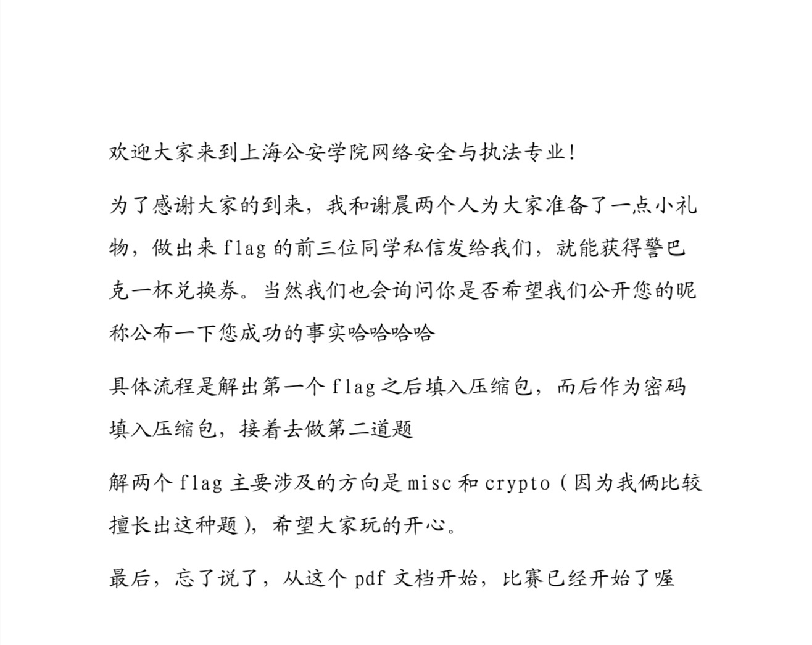
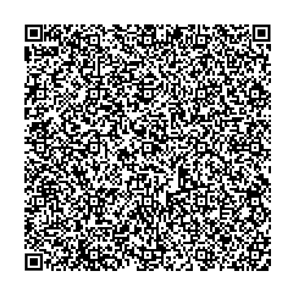

pdf

+ 先搜索文档内隐藏flag，无收获。
+ 放入010editor，Ctrl＋F搜索文字“flag”等，没有线索。
+ 拉到最后发现“1.png”字样，猜测文档含zip压缩包。
+ 搜索找到zip文件头：50 4B 03 04 和文件尾：50 4B
+ 把.pdf后缀改成.zip
+ 解压，得到1.png
+ 使用画图3D，将二维码定位点补齐。得到：
+ 
+ 扫描复制文本得二十四字核心价值观密码：公正公正公正友善公正公正民主公正法治法治诚信民主自由诚信和谐和谐和谐和谐民主平等诚信平等法治敬业和谐富强法治平等平等友善敬业法治民主和谐民主和谐自由公正诚信自由平等诚信平等平等爱国和谐民主和谐和谐平等诚信平等公正和谐公正爱国和谐和谐公正诚信自由法治诚信和谐
+ 使用AmanCTF或CTF随波逐流等工具解码
+ 解得flag：flag{M31_y0u_q14n_X13_ch3n}

