## 模拟测试第二场
### 单选题
#### 1.大数据分析时代思维的转变包含？
答：更全面、更复杂、更广泛
#### 2.在传销犯罪中，以下哪一张可视图能够更直观的展示传销组织层级关系（箭头为推荐人指向被推荐人）？
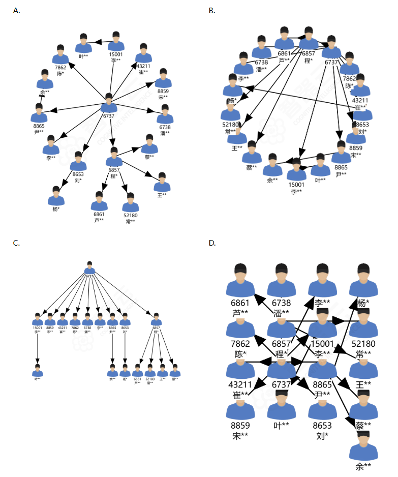
A 星型辐射图（强调单点发散，弱化逐级传递）、B 环形网状图（双向交错，无法体现层级深浅）、D 网格拓扑图（非层级化）都不能直观体现"从上到下、一层压一层"的传销组织形态。
答：C

#### 3.警方根据线索了解到，位于四川省泸州市的某建筑材料企业可能存在发票虚开的情况，并且已知该企业的股东包括周斌和李刚。请查询符合以上条件的企业是哪家？
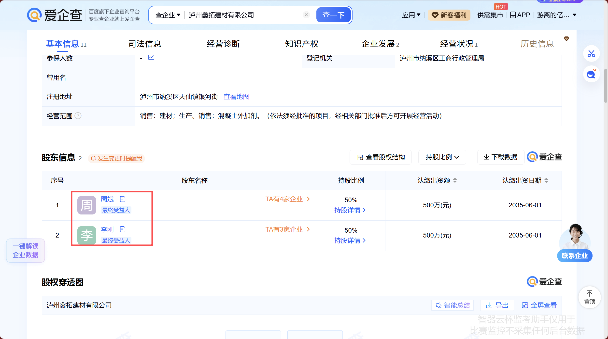
答：泸州鑫拓建材有限公司
#### 4.在一起假酒案中，警方通过审讯了解到买家大多通过与手机号“17073080485”联系来购买假酒，请查询该手机号的归属地是？
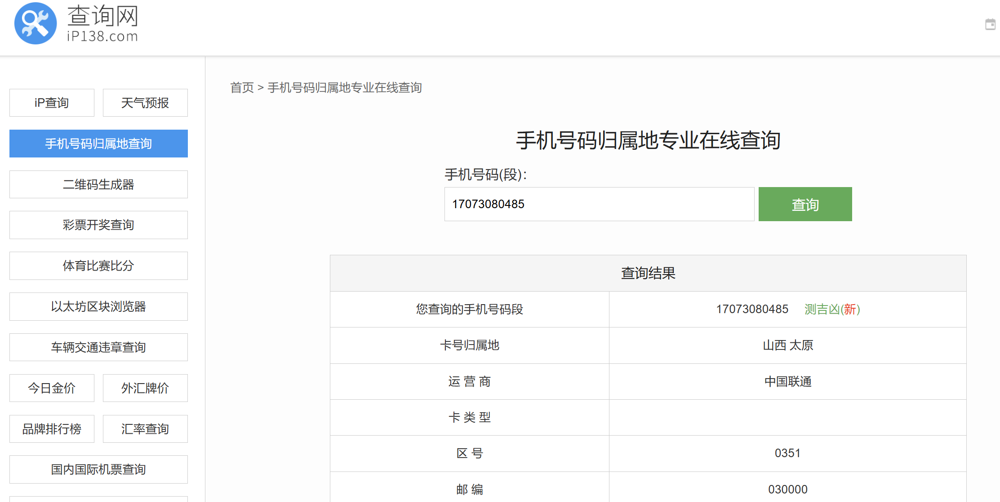答：山西 太原
#### 5.在一起诈骗案中，警方追查到诈骗资金主要流入卡号“6214839085670877”中，需要前往对应开户银行调取交易流水数据进一步分析研判，请查询该卡的开户银行是？
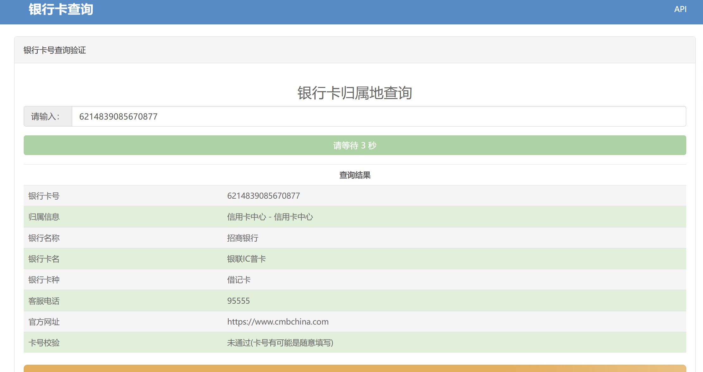
答：招商银行
#### 6.把银行交易数据的借贷标志清洗成以下哪种格式最合适？
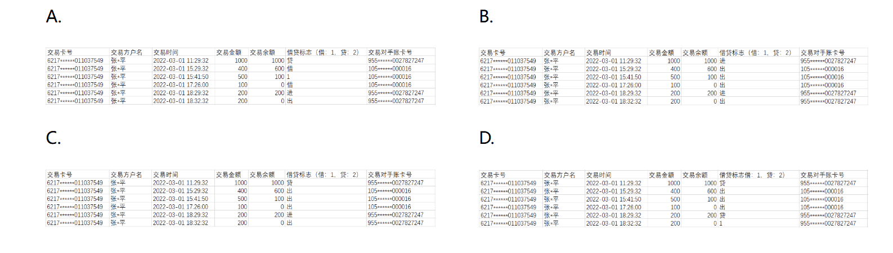
这道题考的是**数据清洗标准化**，核心原则是"借贷标志"这类字段清洗后必须**格式统一、类型一致**，不能混入多种写法
答：B
#### 7.根据银行流水数据中的IP/MAC地址做团伙分析时，如何判断这些银行卡可能是一个团伙在使用？
团伙作案最典型的特征就是"一人持多卡、多卡共用同一设备"。多张银行卡共用同一批设备/网络地址，说明由同一伙人交替操作。
答：登陆过一些相同的IP/MAC地址
#### 8.下表为调取的张某的话单数据，现想要分析出跟张某在凌晨有过短时间通话记录的对方号码，请问该如何建立关系模型？
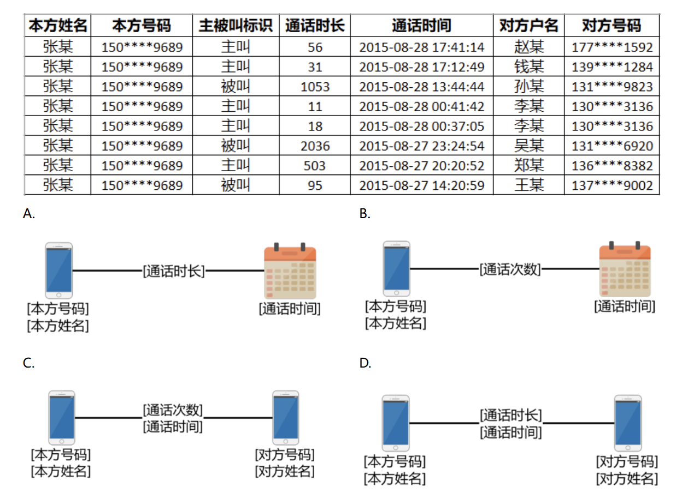
答案：D
#### 9.下图是某地警官根据调取到的银行交易流水找到的几位嫌疑人的交易情况，请问其中交易净和（交易净和=流入金额-流出金额）最大的账户是哪一个
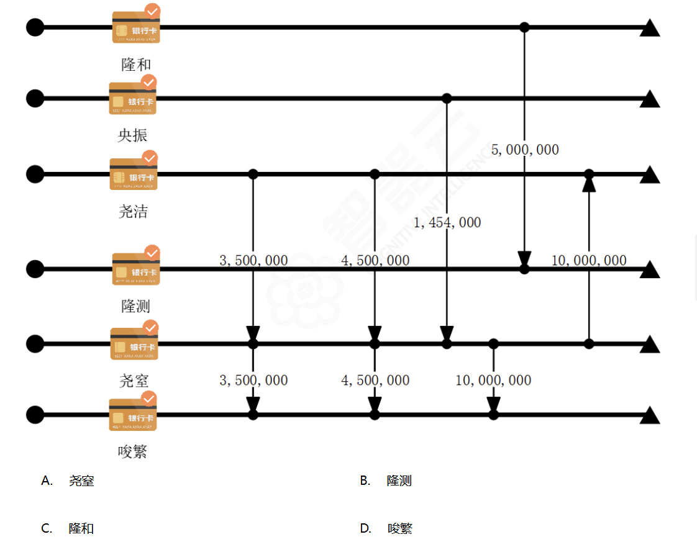
A：1454000-10000000-10000000
B：5000000
C：-5000000
D：3500000+4500000+10000000
答案：D
#### 10做物流分析时，如果要呈现寄件人与收件人之间的寄收关系以及他们对应的寄收地址，请问该如何建立关系模型？
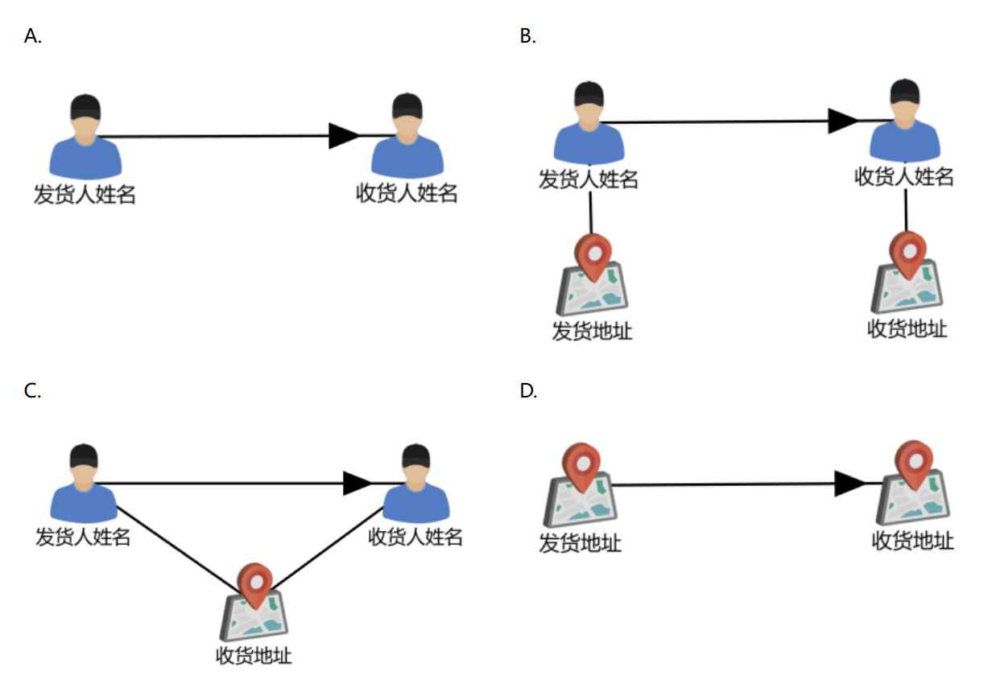
答案：B
#### 11.下图是某地警官找到的嫌疑人卡号与对应IP/MAC地址的关系图，请问和李西最有可能为同一团伙的人员是谁？
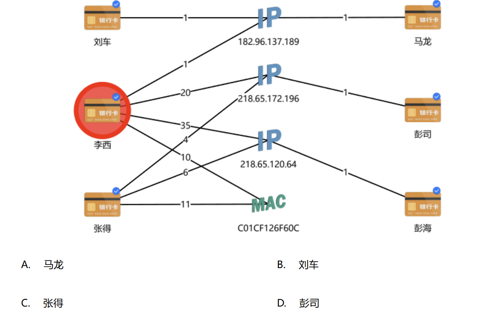
**MAC 地址是设备唯一标识**，两张银行卡若共用同一 MAC，说明是**同一台物理设备**在操作，还同时共享两个 IP，可锁定同一团伙。
答：C
#### 12.在分析酒店住宿信息时，要分析是否存在疑似同住的人员，以下哪一个最能够判断为同住人员？
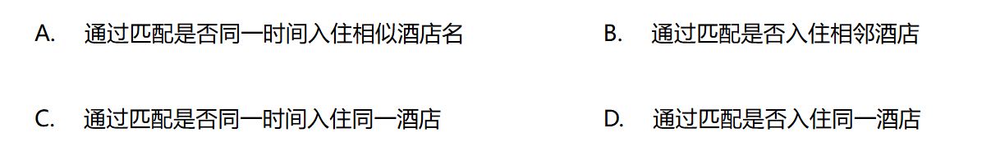
时空吻合最多。
答：C
#### 13.下图中，与两位嫌疑人有三个共同交易对手的账户是哪一个？
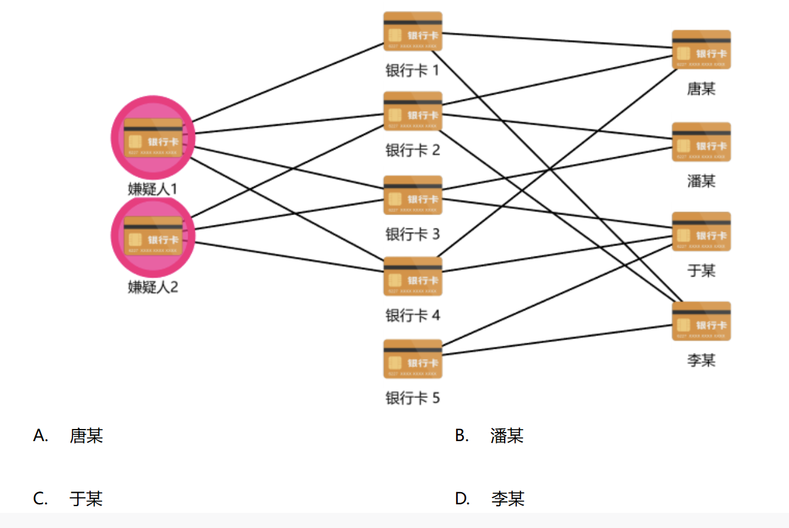答：A
#### 14.下表是嫌疑车辆的卡口数据，一般嫌疑车辆会频繁在某个地点进行货物转移，现需要通过分析嫌疑车辆通过卡口的次数，判断车辆的主要交货地点，请问如何建模分析最简单？
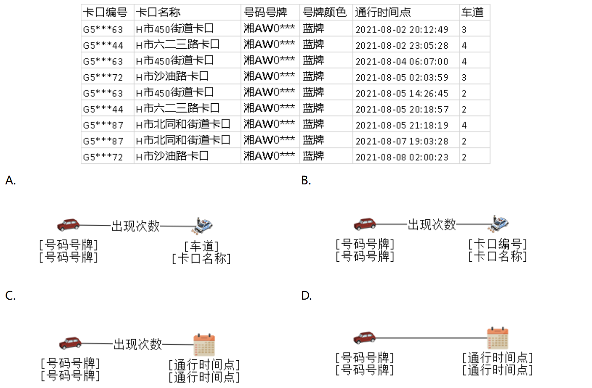
答：B
#### 15.警方已经锁定某盗窃案中的三名嫌疑人，下图是每个车次对应的乘车人员，请问与这三个嫌疑人同一天乘坐相同车次共超过3次（包含3次）的人员是谁？
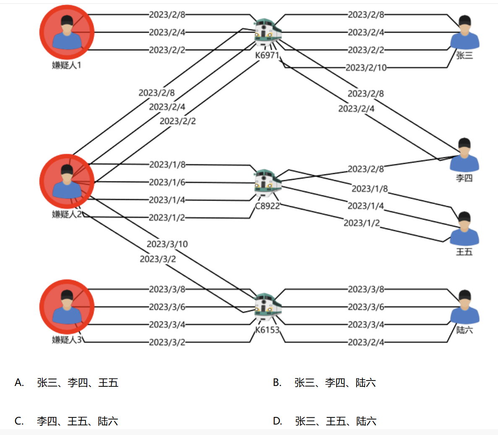
除了李四
答：D
### 多选题
#### 16.手机上可以查询企业信息的APP有哪些？
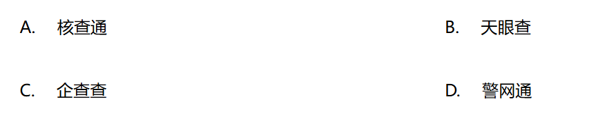
不了解 应该都可以吧。题目表述很模糊。如果意思是大众手机上能用的，那要去掉警用的选项。
答：ABCD
#### 17.在一起洗钱案件中，警方通过研判分析掌握了该洗钱团伙作案银行卡对应的IP地址，请问这5个IP地址在哪些地方？ IP地址如下：1.0.2.49、1.1.6.203、1.2.7.209、36.159.0.214、14.197.144.191
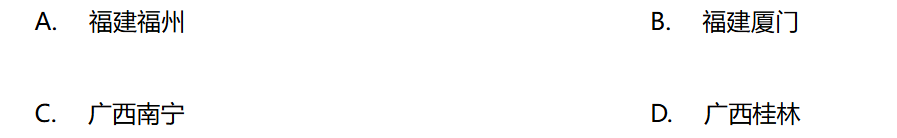
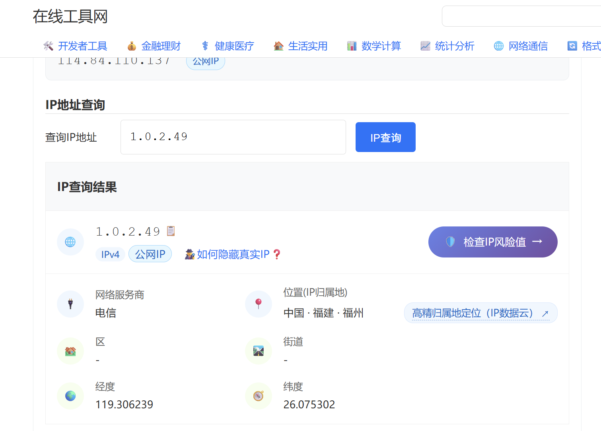
1.0.2.49 福建 福州
1.1.6.203 福建 福州
1.2.7.209 福建 福州
36.159.0.214 广西 南宁
14.197.144.191 广西 南宁
答：AC
#### 18.在资金分析的过程中，存在大量资金转入多家公司账户的情况，针对下表中的工商数据，以下哪些分析模型可以帮助我们分析公司是否真实经营？
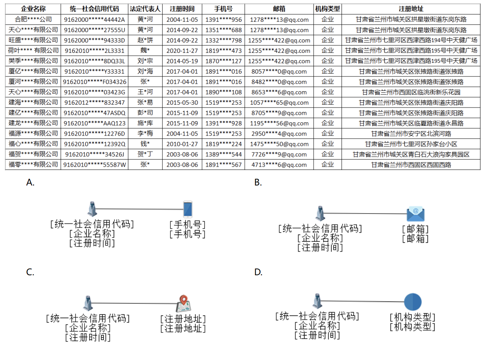
显然D没有任何用处。看是否空壳经营，最主要分析那些重复复用的，比如手机号，邮箱和地址。
答：ABC
#### 19.警方根据线索调取了嫌疑人张某的银行交易流水数据，现需要追踪其大额资金去向账户即资金净收入大于等于100万的对方账户，请问以下哪些账户符合这一交易特征？
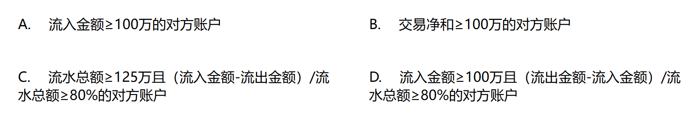
因为题目说的是净收入。所以A排除。B交易净和正确。C：125万×80% = 100万 正确。D错误
答：BC
#### 20.下表是几张银行卡的银行交易流水总表，张易在2018-09-30 04:44:00收到任红的一笔300万的资金为嫌疑资金，现需要对这笔资金进行追踪，请问仅根据下表这300万资金最终去向了哪些账户？
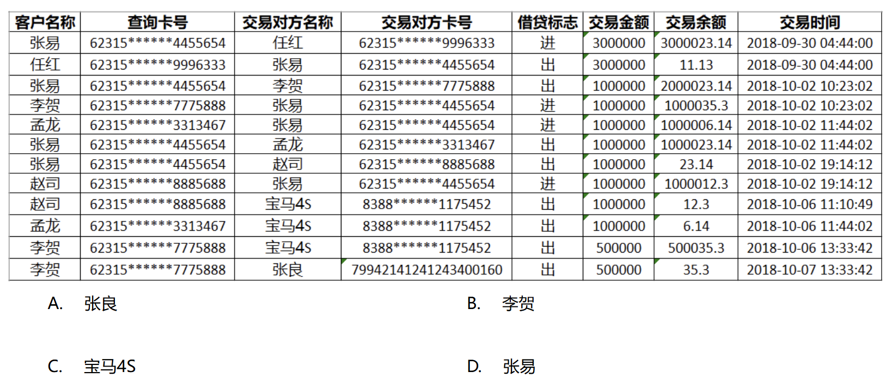