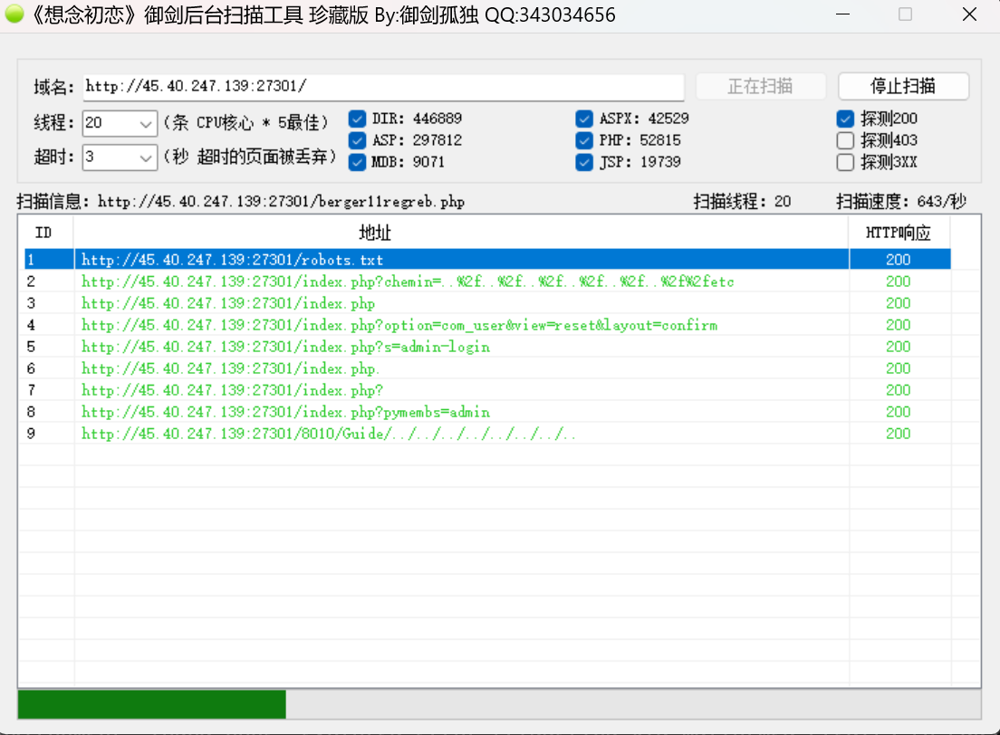
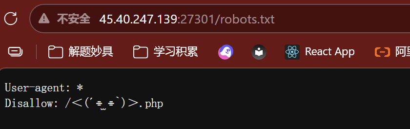
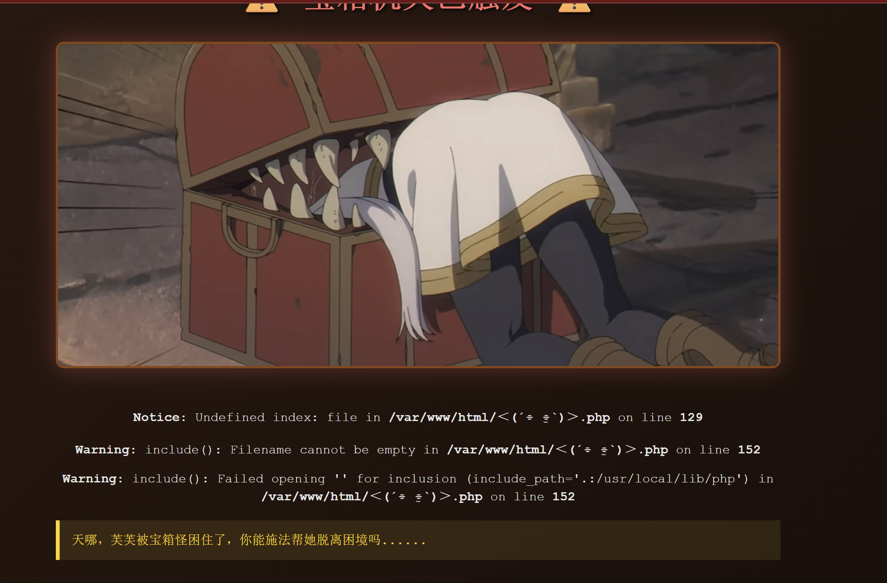

Web1：

[http://45.40.247.139:27301/%EF%BC%9C%28%C2%B4%E2%8C%AF%20%CC%AB%E2%8C%AF%60%29%EF%BC%9E.php](http://45.40.247.139:27301/%EF%BC%9C%28%C2%B4%E2%8C%AF%20%CC%AB%E2%8C%AF%60%29%EF%BC%9E.php)

24238872008887005351990714360791

web2：

1 题目信息  
2 来源 楚慧杯  
3 分类 Misc  
4 题目名称 game_go_1  
5 题目提示 原始两段边界处都有短横线 拼接后flag不是标准UUID格式  
6 附件 gamego的附件.zip  
7 解题思路  
8 我判断是游戏资源打包题 因为exe体积异常且提示强调拼接 我需要在资源数据与脚本中寻找可拼接片段  
9 技术实施  
10 我使用规范目录初始化后解压附件  
11 我对gamego.exe使用pefile检查叠加数据并导出为CAB  
12 我用7zip解包得到RPG Maker工程  
13 我用rubymarshal解析rvdata2对象字符串  
14 我从脚本数据中定位flag后半段  
15 关键步骤  
16 我在可执行文件中发现叠加数据为MSCF格式 这是CAB文件 说明游戏资源被整体封装在exe中  
17 我解包后得到Data目录  
18 我解析Weapons.rvdata2得到DASCTF{和片段1168cb17-31ff-43b7-  
19 我解包Scripts.rvdata2生成脚本目录 在脚本57815762_flag.rb中得到后半段-b586-8414d383afce}  
20 按题目提示两段边界都带短横线 直接拼接得到完整flag DASCTF{1168cb17-31ff-43b7--b586-8414d383afce}  
21 问题与解决  
22 我需要解析Ruby Marshal结构 安装并使用rubymarshal读取rvdata2 才能稳定提取字符串并定位片段  
23 证据路径  
24 叠加数据文件 C:\Users\glj07\Desktop\Codex工作区\临时分析\楚慧杯\Misc\game_go_1\evidence\overlay.cab  
25 解包目录 C:\Users\glj07\Desktop\Codex工作区\临时分析\楚慧杯\Misc\game_go_1\evidence\overlay_extracted  
26 前半段文件 C:\Users\glj07\Desktop\Codex工作区\临时分析\楚慧杯\Misc\game_go_1\evidence\overlay_extracted\Data\Weapons.rvdata2  
27 后半段文件 C:\Users\glj07\Desktop\Codex工作区\临时分析\楚慧杯\Misc\game_go_1\evidence\scripts_dump\57815762_flag.rb  
28 关键代码  
29 叠加数据提取  
30 import pefile  
31 pe = pefile.PE(exe_path)  
32 offset = pe.get_overlay_data_start_offset()  
33 with open(exe_path,"rb") as f:  
34     f.seek(offset)  
35     data = f.read()  
36 with open(out_path,"wb") as w:  
37     w.write(data)  
38 读取Weapons.rvdata2并筛选字符串  
39 from rubymarshal import reader  
40 from collections import deque  
41 obj = reader.load(open(data_path,"rb"))  
42 def collect_strings(obj):  
43     out = []  
44     dq = deque([obj])  
45     seen = set()  
46     while dq:  
47         cur = dq.popleft()  
48         if id(cur) in seen:  
49             continue  
50         seen.add(id(cur))  
51         if hasattr(cur,"value") and isinstance(cur.value,(bytes,str)):  
52             cur = cur.value  
53         if isinstance(cur, bytes):  
54             try:  
55                 s = cur.decode("utf8")  
56             except Exception:  
57                 s = cur.decode("latin1","ignore")  
58             out.append(s)  
59         elif isinstance(cur, str):  
60             out.append(cur)  
61         elif isinstance(cur,(list,tuple)):  
62             dq.extend(cur)  
63         elif isinstance(cur, dict):  
64             dq.extend(cur.keys())  
65             dq.extend(cur.values())  
66         elif hasattr(cur,"**dict**"):  
67             dq.extend(cur.**dict**.values())  
68     return out  
69 for s in collect_strings(obj):  
70     if "DASCTF{" in s or "1168cb17-31ff-43b7-" in s:  
71         print(s)  
72 脚本目录定位flag片段  
73 rg "[0-9a-fA-F]{6,}" scripts_dump  
74 知识点总结  
75 我掌握了PE叠加数据提取和CAB解包方法  
76 我理解了RPG Maker VX Ace资源结构与rvdata2解析流程  
77 参考资料  
78 rubymarshal库说明  
79 RPG Maker VX Ace rvdata2数据结构说明  
80 7zip使用说明  
81 pefile库说明  
82 最终 flag DASCTF{1168cb17-31ff-43b7--b586-8414d383afce}  
83 日期 2026-03-10  
84 署名 Writeup by 琉璃幻彩

