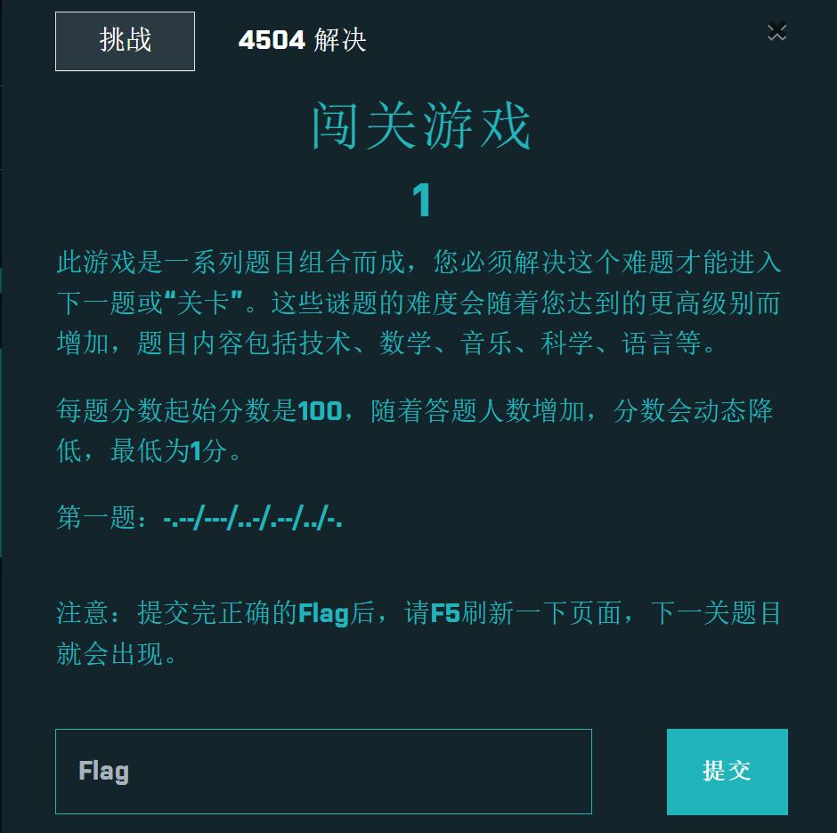
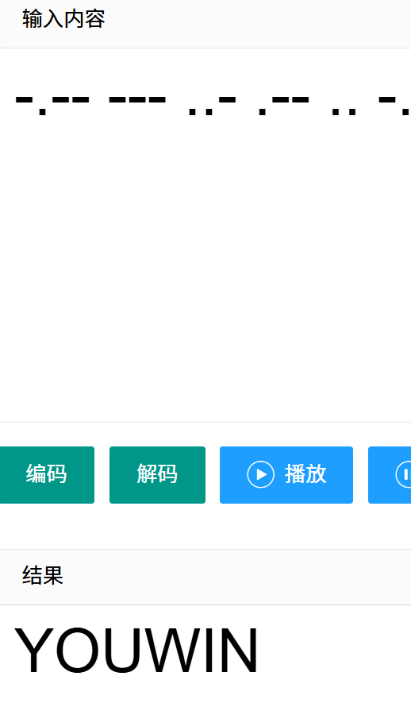
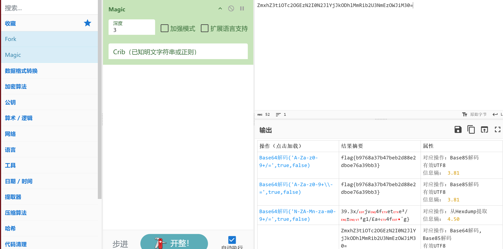
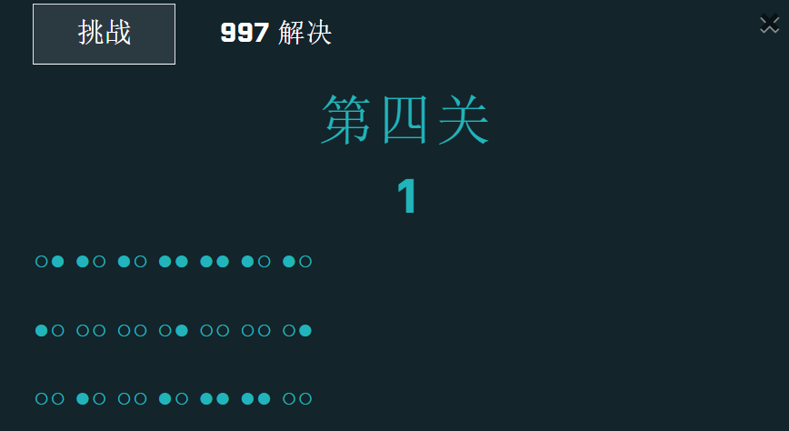
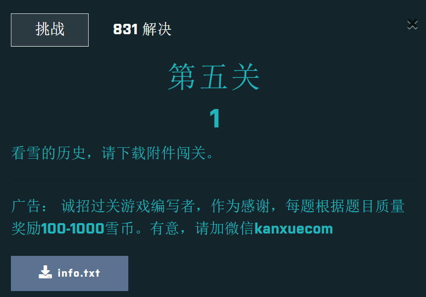
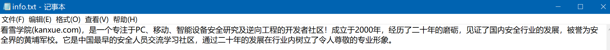
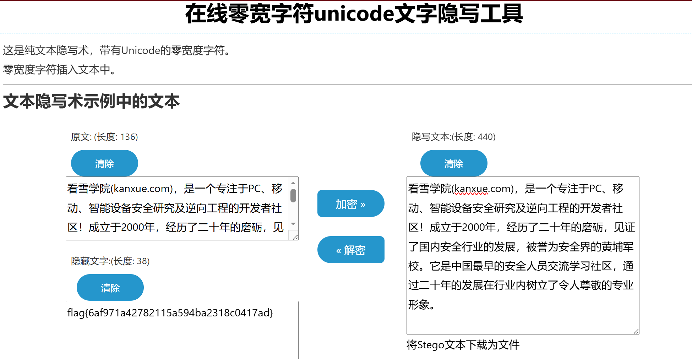
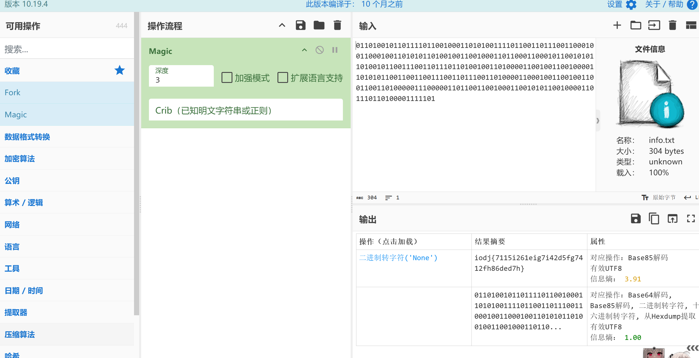
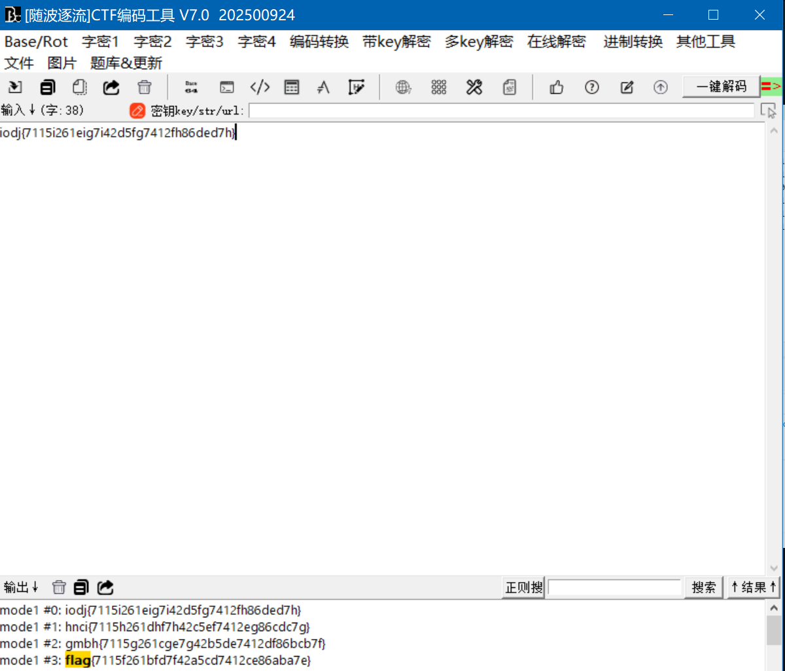

## 第一关

摩斯密码，去掉斜杠

YOUWIN

## 第二关

flag{62d0cbb2c69133b52f386701726f29c1}

## 第三关

看到= 想到base64编码

这里SRK一把梭

flag{b9768a37b47beb2d88e2dboe76a39bb3}

然而答案不对。

继续处理b9768a37b47beb2d88e2dboe76a39bb3

这看起来像一个 **MD5 哈希**（32 位十六进制数），但 MD5 哈希字符范围是 `0-9a-f`，而这里有一个字符 `o`不符合 MD5 格式。

其实不要想复杂，把o改成0，答案正确：

flag{b9768a37b47beb2d88e2db0e76a39bb3}

## 第四关

先猜一波：011010111110101000000100000100100010111100，没啥用

搜索棋盘解密，不太对

涨芝士了，原来是**<u>盲文</u>**

○● ●○ ●○ ●● ●● ●○ ●○

●○ ○○ ○○ ○● ○○ ○○ ○●

○○ ●○ ○○ ●○ ●● ●● ○○

 i    k    a   n   x   u    e 

答案：ikanxue

## 第五关

大概率是文本[隐写术加密](https://tool.bfw.wiki/tool/1695021695027599.html)

零宽隐写

flag{6af971a42782115a594ba2318c0417ad}

## 第六关

iodj{7115i261eig7i42d5fg7412fh86ded7h}

明显凯撒密码

flag偏移3位

或者随波逐流：

flag{7115f261bfd7f42a5cd7412ce86aba7e}

## 第七关

