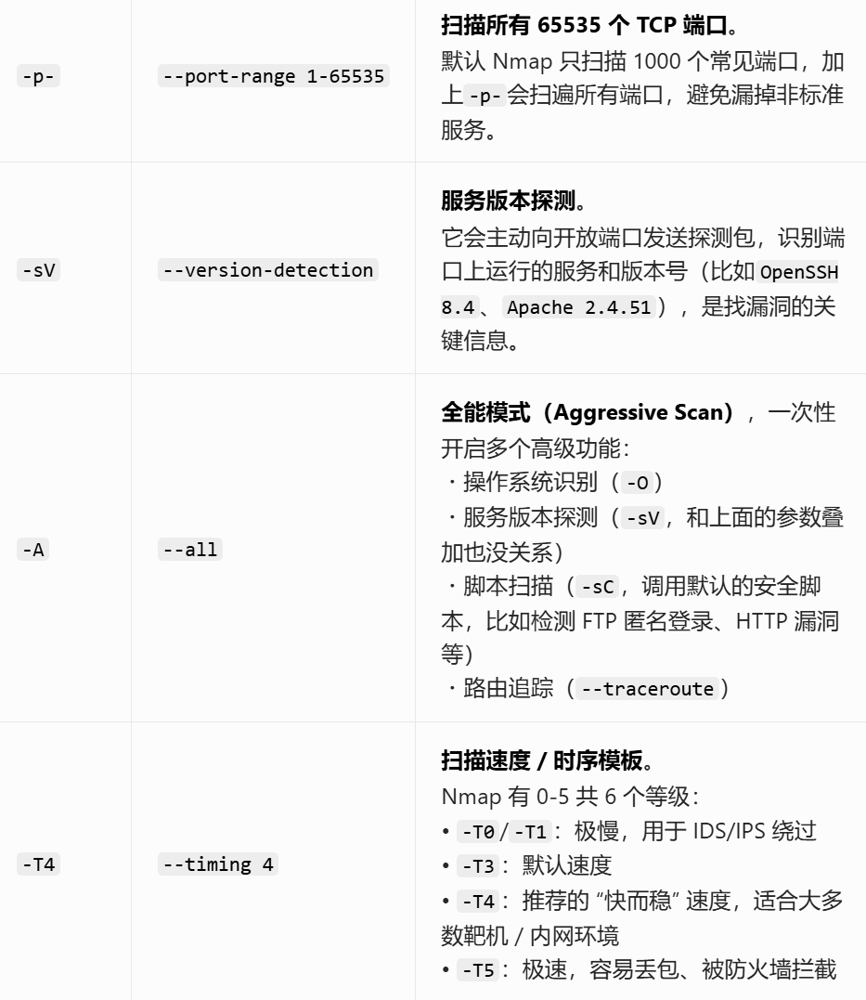
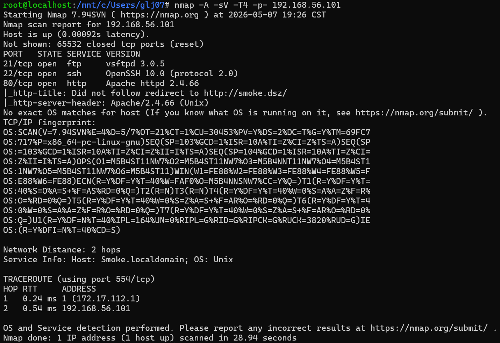

## Smoke

| 靶机   | Smoke          |
| ---- | -------------- |
| 作者   | Sublarge       |
| 靶机ID | 607            |
| 系统   | Linux          |
| 难度   | Medium         |
| 靶机IP | 192.168.56.101 |


```
nmap -A -sV -T4 -p- 192.168.56.101
```

先得添加host，不然没法访问
```
echo "192.168.56.101 smoke.dsz" >> /etc/hosts
```
访问
```
curl http://smoke.dsz
```
网页具体信息：
```
<!DOCTYPE html>
<html>
<head>
    <link href="data:image/x-icon;base64,iVBORw0KGgoAAAANSUhEUgAAABAAAAAQCAIAAACQkWg2AAAACXBIWXMAAAsTAAALEwEAmpwYAAAAB3RJTUUH1gQSFA8qQC+y8wAAAB10RVh0Q29tbWVudABDcmVhdGVkIHdpdGggVGhlIEdJTVDvZCVuAAABd0lEQVQoz5WSy07CQBSGTzuF6Y1buQSiCYSgYli7MC54AZc+gC/CE7kzrPQBjDsNIdF4I8oCwr1gO51OOy4aAbGS+K/OTM6X85/5R2g0GvAfSesHjPyj3LyasrIKxch3fXHiSN0Fvv4wbCZuAobsnld7Scw4wIhEhiSCEc/IbgqzZicTMuG0NEpi9jhRLzuZOUXBJRK4ITOfr1yIy6oYIwDQ7KSX3QDgcWFgR9ZtrwCLIQAoJ8j2pVG9Xg8qDsJe0j5MWcW4g5FvMUQ8cRvQXeAplXY0mlfpftI+zpu1tBURed/CHhdCAADoWfiml3gxlYUraZKXVdxKwq6lPx8mqvM97QcQaEalV1O57cffTGVXdzKKa8isNdI3l/6tzly+eM4BQDlOQl4pVEECLDSHUowUNCqsdedVelYZAEB7rIUkfVKYHaQs4okTIjEuJKJePMoCY1fvRghwN9R9gIJKs4orCtxm6Gmq3I/01lDnob+1PdbWR/+lL5mtm+fskIeBAAAAAElFTkSuQmCC" rel="icon" type="image/x-icon" />
    <meta name="viewport" content="width=device-width, initial-scale=1">
    <title>SmokePing Latency Page for Network Latency Grapher</title>
    <link rel="stylesheet" type="text/css" href="css/smokeping-print.css" media="print">
    <link rel="stylesheet" type="text/css" href="css/smokeping-screen.css" media="screen">
    <script>
        window.options = {
            step: 300
        }
    </script>
</head>
<body id="body">

<div class="sidebar" id="sidebar">
    <div class="sidebar-header">
        <div class="logo">
            <A HREF="https://oss.oetiker.ch/smokeping/counter.cgi/2.009000"></a>
        </div>
    </div>

    <div class="sidebar-menu">
    <br><br>
        <ul class="menu">
        <li class="menuitem"><a class="menulink" href="/"><B>HOME</B></a></li></ul>
        <form method="get" action="" enctype="multipart/form-data" name="hswitch"><div class="filter"><label for="filter" class="filter-label">Filter:</label><div class="filter-text"><input type="text" name="filter"  size="15" id="filter" onchange="hswitch.submit()" placeholder="Filter menu..." /></div></div></form><ul class="menu">
<li class="menuitem"><a class="menulink" href="?target=_charts">Charts</a>
</li><li class="menuitem"><a class="menulink" href="?target=Ping">Alpine</a>
</li></ul>

        <div class="logo">
            <A HREF="https://oss.oetiker.ch/rrdtool/"></a>
        </div>
    </div>
</div>

<div class="navbar">
    <div class="navbar-menu"><a id="menu-button" href="#">Toggle Menu</a></div>
    <div class="navbar-refresh"><a id="refresh-button" href="#">Auto Refresh</a></div>
    <div class="navbar-user"><div class="icon-person"></div>Guest</div>
</div>

<div class="main">
    <h1>Network Latency Grapher</h1>
    <h2>Welcome to the SmokePing website of <b>Insert Company Name Here</b>.  Here you will learn all about the latency of our network.</h2>

    <div class="overview">

    </div>

    <div class="details">

    </div>
</div>
<hr>
<div class="footer">
    <p class="footer-right"><small>Running on <A HREF="https://oss.oetiker.ch/smokeping/counter.cgi/2.009000">SmokePing-2.9.0</A> by <A HREF="https://tobi.oetiker.ch/">Tobi&nbsp;Oetiker</A> and Niko&nbsp;Tyni</small></p>
    <p><small>Maintained by <a href="mailto:root@localhost">Super User</a></small></p>
</div>

<script src="js/prototype.js" type="text/javascript"></script>
<script src="js/scriptaculous/scriptaculous.js?load=builder,effects,dragdrop" type="text/javascript"></script>
<script src="js//cropper/cropper.js" type="text/javascript"></script>
<script src="js/smokeping.js" type="text/javascript"></script>

</body>
</html>
```