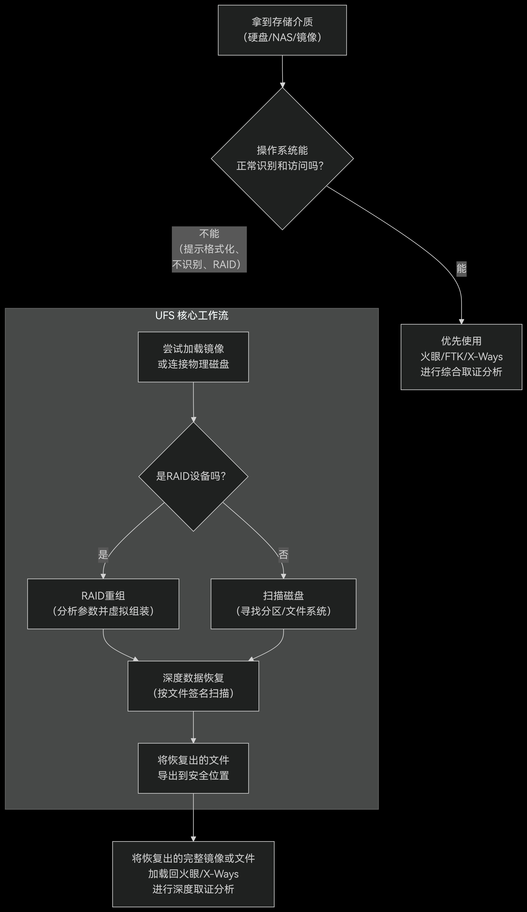

1. 证据固定与预处理：

   · 对所有压缩包（.zip, .rar）和镜像文件进行解压和哈希值校验，确保数据完整。

2. 分头分析：

   · 主战场（电脑、服务器）：使用 【火眼证据分析】 加载所有 .E01 磁盘镜像。这是你的核心工作台。

   · 移动端战场：使用 【雷电APP智能分析】 加载手机备份文件。

   · 网络战场：使用 【网镜互联网取证】 分析网络流量包。

   · 特种设备战场：对于物联网设备的 .bin 文件，先用 【火眼证据分析】 尝试解析，若无法识别，可能需要使用 010 Editor 等进行二进制结构分析。

3. 关联分析：

   · 使用 【综合查询】 功能，将不同检材中发现的IP地址、邮箱、用户名、手机号等关键信息进行跨源关联。

   · 使用 【苍穹AI引擎】 进行智能行为画像和线索关联。

4. 证据固定：

   · 对所有重要的发现进行截图，并记录在取证报告中。

1. **<font style="color:rgb(15, 17, 21);">证据固定</font>**<font style="color:rgb(15, 17, 21);">：</font>
    - **<font style="color:rgb(15, 17, 21);">线下硬盘</font>**<font style="color:rgb(15, 17, 21);"> </font><font style="color:rgb(15, 17, 21);">-></font><font style="color:rgb(15, 17, 21);"> </font>**<font style="color:rgb(15, 17, 21);">网探高速复制机</font>**
    - **<font style="color:rgb(15, 17, 21);">线上服务器</font>**<font style="color:rgb(15, 17, 21);"> </font><font style="color:rgb(15, 17, 21);">-></font><font style="color:rgb(15, 17, 21);"> </font>**<font style="color:rgb(15, 17, 21);">网探勘验 V7（在线勘验）</font>**
    - **<font style="color:rgb(15, 17, 21);">互联网内容</font>**<font style="color:rgb(15, 17, 21);"> </font><font style="color:rgb(15, 17, 21);">-></font><font style="color:rgb(15, 17, 21);"> </font>**<font style="color:rgb(15, 17, 21);">网镜 V6</font>**
    - **<font style="color:rgb(15, 17, 21);">云端数据</font>**<font style="color:rgb(15, 17, 21);"> </font><font style="color:rgb(15, 17, 21);">-></font><font style="color:rgb(15, 17, 21);"> </font>**<font style="color:rgb(15, 17, 21);">雷电云取证</font>**
2. **<font style="color:rgb(15, 17, 21);">证据分析</font>**<font style="color:rgb(15, 17, 21);">：</font>
    - **<font style="color:rgb(15, 17, 21);">通用分析</font>**<font style="color:rgb(15, 17, 21);"> </font><font style="color:rgb(15, 17, 21);">-></font><font style="color:rgb(15, 17, 21);"> </font>**<font style="color:rgb(15, 17, 21);">网探勘验 V7（离线分析）</font>**<font style="color:rgb(15, 17, 21);"> </font><font style="color:rgb(15, 17, 21);">/ 火眼 / X-Ways</font>
    - **<font style="color:rgb(15, 17, 21);">数据库分析</font>**<font style="color:rgb(15, 17, 21);"> </font><font style="color:rgb(15, 17, 21);">-></font><font style="color:rgb(15, 17, 21);"> </font>**<font style="color:rgb(15, 17, 21);">数据库取证工具</font>**
    - **<font style="color:rgb(15, 17, 21);">宏观关联分析</font>**<font style="color:rgb(15, 17, 21);"> -> </font>**<font style="color:rgb(15, 17, 21);">网钜数据分析软件 V4</font>**


+ <font style="color:rgb(15, 17, 21);">在等待火眼加载和分析检材的这段时间，</font>**<font style="color:rgb(15, 17, 21);">绝不是空闲时间</font>**<font style="color:rgb(15, 17, 21);">，而是并行开展其他关键工作的黄金时间。高效利用这段时间能极大提升你的整体取证速度。</font>

### **<font style="color:rgb(15, 17, 21);">你可以立即开展的并行工作</font>**
<font style="color:rgb(15, 17, 21);">根据你手头的资源，你可以参考以下流程图来决策如何高效利用这段等待时间：</font>

### **<font style="color:rgb(15, 17, 21);">1. 处理其他检材（首选）</font>**
<font style="color:rgb(15, 17, 21);">如果案件有其他独立的证据，立即开始处理它们。</font>

+ **<font style="color:rgb(15, 17, 21);">手机镜像</font>**<font style="color:rgb(15, 17, 21);">： 如果还有手机备份文件（如</font><font style="color:rgb(15, 17, 21);"> </font>`<font style="color:rgb(15, 17, 21);background-color:rgb(235, 238, 242);">.ab</font>`<font style="color:rgb(15, 17, 21);">、</font>`<font style="color:rgb(15, 17, 21);background-color:rgb(235, 238, 242);">.tar</font>`<font style="color:rgb(15, 17, 21);"> </font><font style="color:rgb(15, 17, 21);">或厂商备份），立即用</font><font style="color:rgb(15, 17, 21);"> </font>**<font style="color:rgb(15, 17, 21);">【雷电APP智能分析】</font>**<font style="color:rgb(15, 17, 21);"> </font><font style="color:rgb(15, 17, 21);">加载它。手机分析和电脑分析是完全独立的过程，可以完美并行。</font>
+ **<font style="color:rgb(15, 17, 21);">内存镜像</font>**<font style="color:rgb(15, 17, 21);">： 如果你有内存镜像文件（</font>`<font style="color:rgb(15, 17, 21);background-color:rgb(235, 238, 242);">.mem</font>`<font style="color:rgb(15, 17, 21);">,</font><font style="color:rgb(15, 17, 21);"> </font>`<font style="color:rgb(15, 17, 21);background-color:rgb(235, 238, 242);">.raw</font>`<font style="color:rgb(15, 17, 21);">），可以打开</font><font style="color:rgb(15, 17, 21);"> </font>**<font style="color:rgb(15, 17, 21);">Volatility</font>**<font style="color:rgb(15, 17, 21);"> </font><font style="color:rgb(15, 17, 21);">或火眼的内存分析模块，开始分析运行进程、网络连接、提取密码等。</font>
+ **<font style="color:rgb(15, 17, 21);">网络流量包</font>**<font style="color:rgb(15, 17, 21);">： 如果你有</font><font style="color:rgb(15, 17, 21);"> </font>`<font style="color:rgb(15, 17, 21);background-color:rgb(235, 238, 242);">Flower.pcap</font>`<font style="color:rgb(15, 17, 21);"> </font><font style="color:rgb(15, 17, 21);">或其他流量包，用</font><font style="color:rgb(15, 17, 21);"> </font>**<font style="color:rgb(15, 17, 21);">【网镜】</font>**<font style="color:rgb(15, 17, 21);"> </font><font style="color:rgb(15, 17, 21);">或</font><font style="color:rgb(15, 17, 21);"> </font>**<font style="color:rgb(15, 17, 21);">Wireshark</font>**<font style="color:rgb(15, 17, 21);"> </font><font style="color:rgb(15, 17, 21);">打开，开始筛选和分析网络协议、寻找异常连接或数据外传痕迹。</font>

### **<font style="color:rgb(15, 17, 21);">2. 为即将到来的深度分析做准备（次选）</font>**
<font style="color:rgb(15, 17, 21);">如果这是你唯一的检材，那么就为火眼分析结束后的工作做铺垫。</font>

+ **<font style="color:rgb(15, 17, 21);">配置苍穹AI引擎</font>**<font style="color:rgb(15, 17, 21);">：</font>
    - <font style="color:rgb(15, 17, 21);">启动苍穹AI引擎，确保模型已加载。</font>
    - <font style="color:rgb(15, 17, 21);">提前构思好你的</font>**<font style="color:rgb(15, 17, 21);">语义搜索指令</font>**<font style="color:rgb(15, 17, 21);">。例如，想好你要问AI的问题，比如“找出所有与资金转移相关的通信记录”或“总结用户的网络搜索行为特征”。</font>
+ **<font style="color:rgb(15, 17, 21);">整理关键词列表</font>**<font style="color:rgb(15, 17, 21);">：</font>
    - <font style="color:rgb(15, 17, 21);">打开一个记事本，根据案件背景，列出所有需要搜索的</font>**<font style="color:rgb(15, 17, 21);">关键词</font>**<font style="color:rgb(15, 17, 21);">。例如：</font>
        * **<font style="color:rgb(15, 17, 21);">姓名/昵称</font>**<font style="color:rgb(15, 17, 21);">： “起早王”、“倩倩”、“雨蓝”</font>
        * **<font style="color:rgb(15, 17, 21);">联系方式</font>**<font style="color:rgb(15, 17, 21);">： 手机号、邮箱、QQ号</font>
        * **<font style="color:rgb(15, 17, 21);">金融信息</font>**<font style="color:rgb(15, 17, 21);">： 银行卡号、“支付”、“转账”、“比特币”</font>
        * **<font style="color:rgb(15, 17, 21);">案件相关词</font>**<font style="color:rgb(15, 17, 21);">： “项目代号”、“黑话”、“暗语”</font>
    - <font style="color:rgb(15, 17, 21);">这能让你在火眼分析结束后，立刻在</font>**<font style="color:rgb(15, 17, 21);">综合查询</font>**<font style="color:rgb(15, 17, 21);">框里进行批量搜索，而不是临时思考。</font>
+ **<font style="color:rgb(15, 17, 21);">准备密码字典</font>**<font style="color:rgb(15, 17, 21);">：</font>
    - <font style="color:rgb(15, 17, 21);">如果预计会遇到加密文件，提前打开你的密码字典文件（如</font><font style="color:rgb(15, 17, 21);"> </font>`<font style="color:rgb(15, 17, 21);background-color:rgb(235, 238, 242);">rockyou.txt</font>`<font style="color:rgb(15, 17, 21);">），或者根据已知信息（嫌疑人生日、宠物名等）生成一个自定义字典。</font>

### **<font style="color:rgb(15, 17, 21);">3. 环境与工具准备（基础保障）</font>**
+ **<font style="color:rgb(15, 17, 21);">打开辅助工具</font>**<font style="color:rgb(15, 17, 21);">： 提前打开你可能会用到的所有辅助工具，如</font><font style="color:rgb(15, 17, 21);"> </font>**<font style="color:rgb(15, 17, 21);">SQLite Expert</font>**<font style="color:rgb(15, 17, 21);">（用于分析数据库）、</font>**<font style="color:rgb(15, 17, 21);">Navicat</font>**<font style="color:rgb(15, 17, 21);">、</font>**<font style="color:rgb(15, 17, 21);">010 Editor</font>**<font style="color:rgb(15, 17, 21);"> </font><font style="color:rgb(15, 17, 21);">等，让它们处于待命状态。</font>
+ **<font style="color:rgb(15, 17, 21);">整理工作区</font>**<font style="color:rgb(15, 17, 21);">： 在桌面上创建好用于存放本次分析输出的文件夹，例如“截图”、“导出文件”、“报告素材”等，便于后续整理证据。</font>

---

### **<font style="color:rgb(15, 17, 21);">行动建议：</font>**<font style="color:rgb(15, 17, 21);">  
</font>**<font style="color:rgb(15, 17, 21);">现在，请立即检查你的案件文件夹，看看是否有手机备份、内存镜像或流量包文件。如果有，马上用对应的工具打开它们。如果没有，就立刻打开一个记事本，开始列出你的第一版关键词列表。</font>**
<font style="color:rgb(15, 17, 21);"></font>


<font style="color:rgb(15, 17, 21);">假设你有一个嫌疑磁盘的镜像</font><font style="color:rgb(15, 17, 21);"> </font>`<font style="color:rgb(15, 17, 21);background-color:rgb(235, 238, 242);">suspect.dd</font>`<font style="color:rgb(15, 17, 21);">，一个典型分析流程是：</font>

**<font style="color:rgb(15, 17, 21);">初步评估</font>**<font style="color:rgb(15, 17, 21);">：</font>

1. <font style="color:rgb(15, 17, 21);">bash</font>

```plain
binwalk suspect.dd          # 查看文件结构
strings suspect.dd | less   # 提取字符串快速浏览
```

**<font style="color:rgb(15, 17, 21);">文件系统分析</font>**<font style="color:rgb(15, 17, 21);">：</font>

2. <font style="color:rgb(15, 17, 21);">bash</font>

```plain
fls -r suspect.dd           # 递归列出所有文件和已删除文件
# 或者直接打开 Autopsy 图形化分析
autopsy
```

**<font style="color:rgb(15, 17, 21);">文件雕刻</font>**<font style="color:rgb(15, 17, 21);">：</font>

3. <font style="color:rgb(15, 17, 21);">bash</font><font style="color:rgb(15, 17, 21);">foremost -i suspect.dd -o output_foremost/  # 尝试恢复各种格式文件</font>

**<font style="color:rgb(15, 17, 21);">批量信息提取</font>**<font style="color:rgb(15, 17, 21);">：</font>

4. <font style="color:rgb(15, 17, 21);">bash</font><font style="color:rgb(15, 17, 21);">bulk_extractor -o output_bulk/ suspect.dd   # 提取邮件、URL等敏感信息</font>
5. **<font style="color:rgb(15, 17, 21);">深入分析特定文件</font>**<font style="color:rgb(15, 17, 21);">：</font>
    - <font style="color:rgb(15, 17, 21);">用</font><font style="color:rgb(15, 17, 21);"> </font>`<font style="color:rgb(15, 17, 21);background-color:rgb(235, 238, 242);">ExifTool</font>`<font style="color:rgb(15, 17, 21);"> </font><font style="color:rgb(15, 17, 21);">分析图片元数据。</font>
    - <font style="color:rgb(15, 17, 21);">用</font><font style="color:rgb(15, 17, 21);"> </font>`<font style="color:rgb(15, 17, 21);background-color:rgb(235, 238, 242);">Volatility</font>`<font style="color:rgb(15, 17, 21);"> </font><font style="color:rgb(15, 17, 21);">分析内存镜像（如果有）。</font>
    - <font style="color:rgb(15, 17, 21);">用 </font>`<font style="color:rgb(15, 17, 21);background-color:rgb(235, 238, 242);">Wireshark</font>`<font style="color:rgb(15, 17, 21);"> 分析网络流量包。</font>

