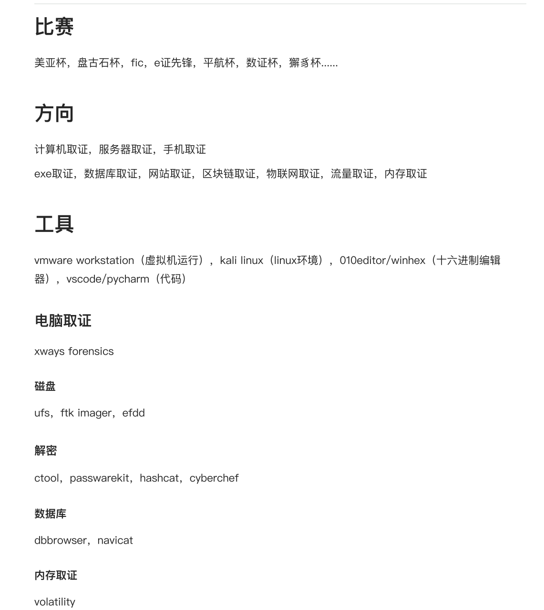
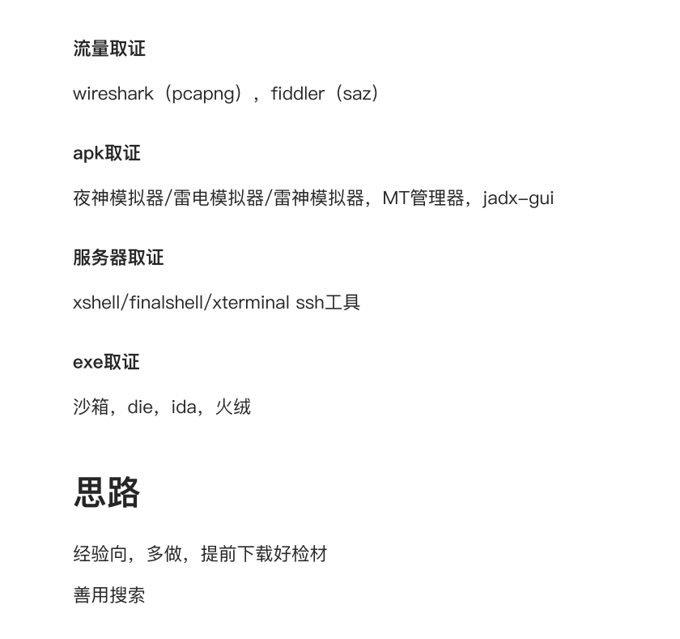

弘连工具

链接: [https://pan.baidu.com/s/1ZdYm74LqqLKtxEV_8BrXWg](https://pan.baidu.com/s/1ZdYm74LqqLKtxEV_8BrXWg) 提取码: bpjm 

--来自百度网盘超级会员v4的分享

（一）工具链接：[https://pan.baidu.com/s/1uNe-HxdRG_bKByYDJlX41g](https://pan.baidu.com/s/1uNe-HxdRG_bKByYDJlX41g)，提取码：0714；

（二）公开赛事检材：[https://kdocs.cn/l/ceK160ZwKrAe](https://kdocs.cn/l/ceK160ZwKrAe)；

（三）Forensics-Wiki取证工具包链接：[https://pan.baidu.com/s/18kHMsXfeL9VitXr2yRBMBw?pwd=wiki](https://pan.baidu.com/s/18kHMsXfeL9VitXr2yRBMBw?pwd=wiki)。

### **工具分类解析**
#### **一、 磁盘镜像与证据管理**
这类工具用于获取、挂载和管理原始证据。

| 工具名称 | 主要用途 |
| --- | --- |
| **Arsenal Image Mounter** | 将磁盘镜像文件（如.E01, .dd）挂载为Windows虚拟磁盘，便于只读访问。 |
| **UFS Explorer Professional Recovery** | 功能强大的数据恢复和镜像挂载工具，支持复杂RAID重组。 |
| **Mount Image Pro** | 另一款专业的镜像文件挂载工具。 |
| **流火镜像大师** | 国产的镜像挂载与仿真工具。 |
| **X-Ways Forensics** | 顶级的综合磁盘取证平台，以速度快、资源占用低著称。 |

#### **二、 移动设备取证**
专门用于从手机等移动设备中提取和分析数据。

| 工具名称 | 主要用途 |
| --- | --- |
| **UFED (Cellebrite)** | 全球顶尖的手机物理取证工具，能破解锁屏、深度提取数据。 |
| **iBackup Viewer Pro** | 专门用于解析和查看苹果iTunes备份文件的内容。 |
| **forensic_for_phonebak_0224** | likely 某专用于手机备份取证的脚本或工具。 |
| **Honglian (弘连)** | 国产的综合取证分析平台，功能类似火眼。 |

#### **三、 密码恢复与破解**
用于破解加密文件、系统密码或网络服务。

| 工具名称 | 主要用途 |
| --- | --- |
| **HYDRA** | 网络服务在线密码爆破工具（如SSH, FTP, HTTP登录）。 |
| **Kon-Boot** | 绕过Windows/macOS系统登录密码，无需修改密码即可进入系统。 |
| **foxmail密码查看** | 恢复或查看Foxmail邮件客户端中保存的账户密码。 |
| **RDS_2024** | likely 是 `R-Studio`  网络版，强大的数据恢复工具，也用于破解简单密码。 |

#### **四、 文件与数据恢复**
用于恢复被删除的文件或修复损坏的文件。

| 工具名称 | 主要用途 |
| --- | --- |
| **Exce'recovery3 / 乱码修复** | 专门用于修复损坏的Microsoft Excel文件。 |
| **Fatbeans** | likely 是 `FinalData` ，经典的数据恢复软件。 |
| **相机DAT视频文件数据恢复** | 专门恢复特定格式（如监控摄像头）的视频文件。 |
| **恢复大师永恒之蓝专修版** | 针对特定病毒（如永恒之蓝勒索病毒）的文件修复工具。 |

#### **五、 数据库与文件分析**
用于深入分析特定类型的文件。

| 工具名称 | 主要用途 |
| --- | --- |
| **SQLite Expert Professional** | 专门用于查看、编辑和分析SQLite数据库文件（常见于手机App）。 |
| **Navicat Premium** | 强大的数据库管理工具，支持多种数据库（MySQL, SQLite等）。 |
| **NTFS Log Tracker** | 分析NTFS文件系统的日志（$LogFile），追踪文件操作历史。 |
| **FileLocator Pro** | 强大的文件内容搜索工具，可快速在全盘搜索关键词。 |

#### **六、 网络与流量分析**
用于分析网络行为和通信内容。

| 工具名称 | 主要用途 |
| --- | --- |
| **fiddler-everywhere** | Web调试代理工具，捕获和分析HTTP/HTTPS流量。 |
| **CTF-NetA-V2.6.4** | likely 是一个网络分析或流量包解析的CTF专用工具。 |
| **pa_script-master** | likely 是用于网络取证或分析的Python脚本集合。 |

#### **七、 逆向工程与专项工具**
用于分析程序、破解或进行专项检查。

| 工具名称 | 主要用途 |
| --- | --- |
| **CFF Explorer** | 强大的PE文件（Windows可执行文件）编辑器，用于逆向分析。 |
| **010 Editor** | 二进制文件编辑器，通过模板解析文件结构。 |
| **HV与vmware冲突脚本** | 解决Hyper-V和VMware虚拟机软件冲突的脚本。 |
| **本地沙箱** | 用于在隔离环境中安全地运行和分析可疑程序。 |
| **取证工具包** | 一个集成了多种常用取证小工具的便携包。 |

#### **八、 系统与辅助工具**
提供系统维护和辅助功能。

| 工具名称 | 主要用途 |
| --- | --- |
| **Virtual Forensic Computing** | 证据仿真工具，可直接启动嫌疑人的磁盘镜像。 |
| **雷电模拟器** | 安卓模拟器，用于运行和测试安卓应用。 |
| **图吧工具箱 / 吾爱专用工具箱** | 集成了大量硬件检测、系统维护和实用小工具的合集。 |
| **qBittorrent** | BT种子下载工具，用于分享或获取大型文件（如工具、镜像）。 |
| **sd-webui-aki** | Stable Diffusion WebUI 的整合包，用于AI绘图，可能与生成验证码等有关。 |

#### **九、 AI智能分析**
| 工具名称 | 主要用途 |
| --- | --- |
| **苍穹AI模型** | 用于智能语义分析、数据关联和行为画像的AI引擎。 |

---

### **总结与应用场景**
这个工具集覆盖了从**数据提取、数据恢复、密码破解、日志分析、网络取证到AI智能关联**的完整取证链条。

**结合你之前的题目，这个工具集能让你：**

1. 用 **Arsenal/X-Ways** 加载磁盘镜像。
2. 用 **UFED/iBackup** 提取手机数据。
3. 用 **SQLite Expert/Navicat** 分析App数据库。
4. 用 **HYDRA/Kon-Boot** 破解加密保护。
5. 用 **FileLocator** 进行全局关键词搜索。
6. 用 **苍穹AI** 进行智能行为分析。
7. 用 **Virtual Forensic Computing** 仿真运行证据系统。

这完全是一个专业数字 forensic 实验室的装备水平。

