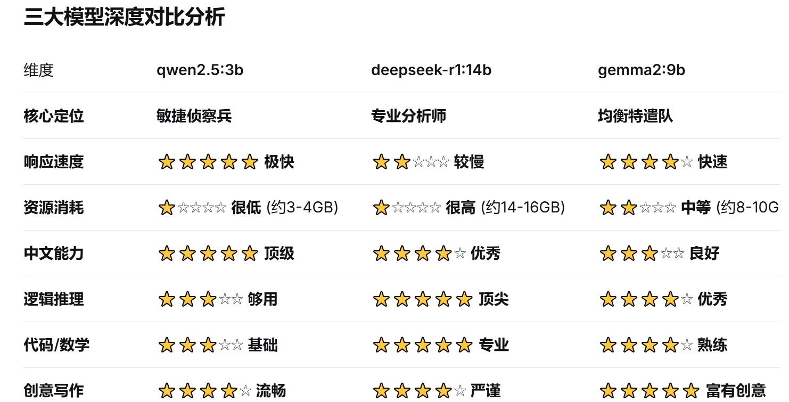

    - **qwen2.5:3b**（通义千问3B版本）
        * **优势**：模型较小，推理速度快，内存占用低。对中文支持非常好（由阿里开发），适合处理中文任务。对于一般的问答、文本分析等任务，如果对质量要求不是极高，这个模型可以快速给出结果。
        * **劣势**：由于参数较少，在复杂推理、逻辑性要求高的任务上可能表现不如更大模型。
    - **deepseek-r1:14b**（深度求索14B版本）
        * **优势**：参数规模较大，具有更强的理解和推理能力，尤其在数学、代码、逻辑推理等方面表现突出。对中英文支持都很好。
        * **劣势**：需要更多的内存和显存，推理速度较慢。
    - **gemma3:12b**（谷歌Gemma 12B版本）
        * **优势**：由谷歌开发，基于Gemini技术，在英文任务上表现优秀，同时也在多语言任务上有不错的表现。在代码生成、数学推理和常识推理方面有较好的能力。
+   


### **实战选择指南：什么情况用什么模型**
#### **1. 选择 【qwen2.5:3b】的情况 - “快速响应与日常任务”**
**使用时机：**

+ **初步证据筛查**：需要快速扫描大量文本，找出初步线索。
+ **实时交互对话**：当你需要与AI进行多轮、快速的问答时。
+ **资源紧张时**：同时运行多个大型程序，电脑内存/显存压力大。
+ **处理简单查询**：如格式转换、基础信息提取、简单摘要。

**举例：**

“从这段聊天记录里快速找出所有提到‘转账’的句子。”  
“把这份日志里所有的时间戳提取出来，整理成表格。”  
“用一句话概括这篇文档的核心内容。”

#### **2. 选择 【deepseek-r1:14b】的情况 - “复杂分析与专业任务”**
**使用时机：**

+ **深度逻辑推理**：需要理解复杂案情、推断作案手法或动机。
+ **代码分析与逆向**：分析恶意软件代码、解密算法或复杂脚本。
+ **数学计算与统计**：处理加密数据、进行概率分析或数据统计。
+ **综合性报告撰写**：需要结构严谨、逻辑清晰的长篇分析报告。

**举例：**

“分析这个网络攻击的完整攻击链，推断攻击者的下一步可能行动。”  
“解释这段加密算法的原理，并给出破解思路。”  
“根据这些财务数据，找出异常交易并分析其模式。”

#### **3. 选择 【gemma2:9b】的情况 - “平衡性能与创意任务”**
**使用时机：**

+ **需要兼顾速度与质量**：当任务比简单查询复杂，但又不需要deepseek那样的深度时。
+ **创意性任务**：生成调查假设、模拟嫌疑人心理画像、构思调查方向。
+ **多语言任务**：处理混合中英文的检材内容。
+ **作为备选**：当deepseek负载过高或响应太慢时的优质替代。

**举例：**

“基于目前的线索，生成三个可能的调查方向。”  
“为这份证据清单创建一个分类体系。”  
“将这段中文技术文档的关键部分翻译成英文摘要。”

---

### **高级策略与工作流建议**
#### **“侦察→分析→验证”三级工作流**
对于重要任务，可以采用组合拳：

1. **第一波：qwen2.5:3b 快速侦察**
    - 用qwen快速处理原始数据，提取关键信息和初步模式。
    - **目标**：快速了解全局，缩小焦点。
2. **第二波：deepseek-r1:14b 深度分析**
    - 将qwen提炼出的关键信息交给deepseek进行深度推理和复杂分析。
    - **目标**：获得深度洞察和专业结论。
3. **第三波：gemma2:9b 交叉验证**
    - 用gemma对deepseek的结论进行二次验证或提供不同角度的解读。
    - **目标**：确保结论的稳健性。

#### **硬件资源监控策略**
+ **开任务管理器**，实时监控GPU显存使用情况。
+ **规则**：选择模型时，确保其所需显存 < **可用显存的80%**。
+ **如果显存告急**：立即降级到更小的模型（如从deepseek降到gemma或qwen）。

#### **给你的具体操作指令**
在你的Ollama中，使用以下命令调用不同模型：

bash

```plain
# 快速任务 - 使用 qwen
ollama run qwen2.5:3b "快速总结这份文档的要点：[文档内容]"

# 深度分析 - 使用 deepseek  
ollama run deepseek-r1:14b "详细分析这个攻击代码的工作原理：[代码片段]"

# 平衡任务 - 使用 gemma
ollama run gemma2:9b "为这些证据创建一个调查时间线：[证据列表]"
```

### **总结：你的AI特遣队**
把这三个模型想象成你的专属调查团队：

+ **qwen2.5:3b** 是你的**现场侦察员** - 反应最快，负责初步排查。
+ **deepseek-r1:14b** 是你的**首席分析师** - 能力最强，攻坚复杂问题。
+ **gemma2:9b** 是你的**全能特工** - 平衡性好，什么任务都能胜任。


cd C:\Users\glj07\AppData\Local\Programs\Ollama

ollama serve


