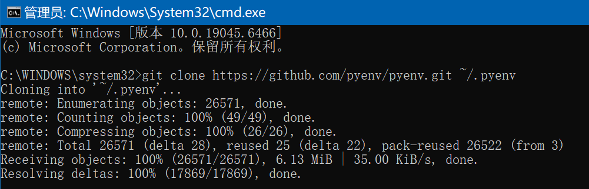
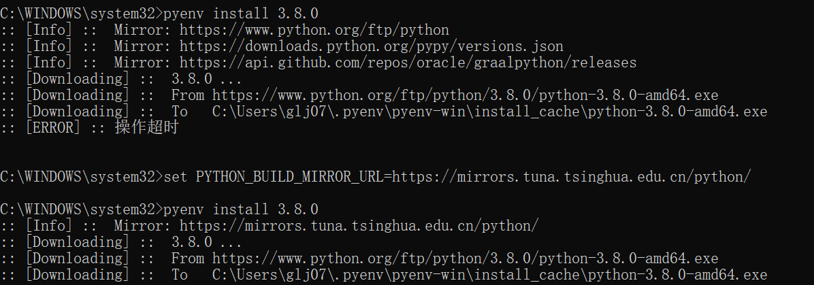

## 1. 使用 pyenv（推荐）
```bash
# Windows (通过 WSL 或 git bash)
git clone https://github.com/pyenv/pyenv.git ~/.pyenv
```



```bash
# 查看可安装的版本
pyenv install --list

# 安装特定版本
pyenv install 3.8.0

# 查看已安装的版本
pyenv versions

# 全局切换版本
pyenv global 3.9.7

# 为特定项目切换版本
pyenv local 3.11.2

# 查看当前使用的版本
pyenv version
```

安装经常超时。

```bash
set PYTHON_BUILD_MIRROR_URL=https://mirrors.tuna.tsinghua.edu.cn/python/
set PYTHON_BUILD_MIRROR_URL_SKIP_CHECKSUM=1
pyenv install 3.8.0
```

```bash
# 使用pyenv切换到3.8.0
pyenv shell 3.8.0

# 创建虚拟环境
python -m venv myenv_38

# 激活虚拟环境
myenv_38\Scripts\activate

# 现在使用的就是3.8.0，完全独立
python --version
pip list

# 停用虚拟环境
deactivate
```

## 2. 使用 conda（适合数据科学）
```bash
# 创建新环境并指定Python版本
conda create -n myenv python=3.8

# 激活环境
conda activate myenv

# 查看所有环境
conda env list

# 在当前环境中更改Python版本
conda install python=3.9
```

## 3. 使用 venv（Python内置）
```bash
# 创建虚拟环境（使用系统默认Python）
python -m venv myenv

# 激活环境
# Windows
myenv\Scripts\activate

# 停用环境
deactivate
```


