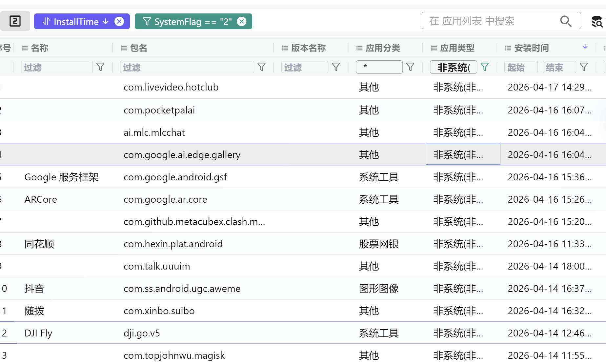
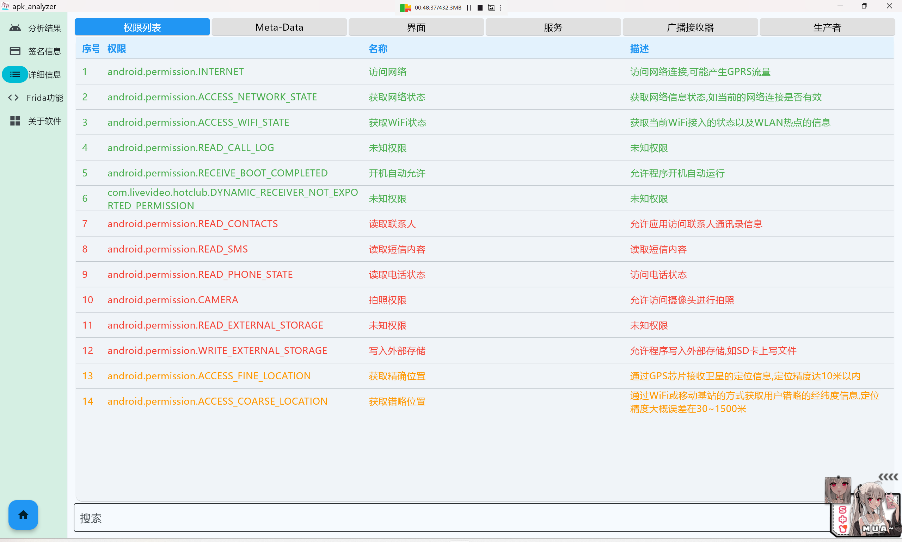
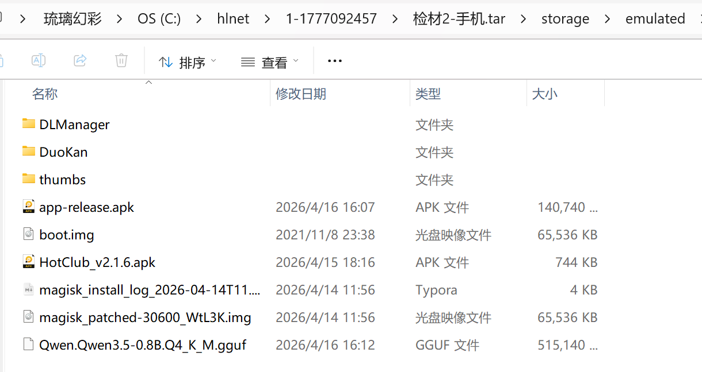

前言：
FIC-{e404d6e66586e9460c23755afab5a872bcf78ab4}

某日, 警方接到举报, 举报人称近期互联网上出现了一涉黄网站极为活跃并大肆推广。警方跟进线索分析后,找到相应的网站进行了摸排调查,最终锁定网站的运营者李安弘,警方在对其实施抓捕的现场对电子数据进行了提取固定。

通过对李安弘的审讯, 警方了解到, 其雇佣了技术人员帮忙架设淫秽视频平台, 并找到境外团队对网站进行推广, 经过审讯和调查, 该嫌疑人还有多种其他违法行为,用以牟利。

请各位参赛选手对检材进行分析, 尝试还原整个案件和关键信息。

com.ss.android.ugc.aweme

9ed2@99y8.com.cn

11.com.livevideo.hotclub
  已确认

      3. 20260414
      4. 5
      5. Qwen3.5-0.8B
     6. A B D
     7. file:///android_asset/www/index.html
     8. 编码方式：Base64
     9. 上传 URL：https://api.sp-live88.com/collect/userdata
     10. user_collection
     11. TXqH7sVn8bR4kL2mN9pW6xJ3cY5dF1gA
     12. getContactsList

  高置信，正在补最后一层证据记录

      13. wk_9628874a3c6b403593766496fa985893.db
      14. TK7mR3hS8vY7tY1nZ4kL9otSzgjLj6tP8v

