前言：
**FIC-{e404d6e66586e9460c23755afab5a872bcf78ab4}**
哈希值：
SHA256：
830d0227bd16768648245e1aefe5d6583dd1d077b43b86422066b198ea169efa

某日, 警方接到举报, 举报人称近期互联网上出现了一涉黄网站极为活跃并大肆推广。警方跟进线索分析后,找到相应的网站进行了摸排调查,最终锁定网站的运营者李安弘,警方在对其实施抓捕的现场对电子数据进行了提取固定。

通过对李安弘的审讯, 警方了解到, 其雇佣了技术人员帮忙架设淫秽视频平台, 并找到境外团队对网站进行推广, 经过审讯和调查, 该嫌疑人还有多种其他违法行为,用以牟利。

请各位参赛选手对检材进行分析, 尝试还原整个案件和关键信息。


## 计算机

> **题目**
>
> 1. 分析计算机检材，操作系统版本号为
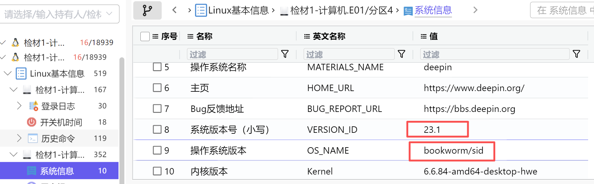

这里有个问题，题目问操作系统版本号，但是正确答案在火眼里是在系统版本号栏目的。
不能轻信火眼。由上图知操作系统叫deepin：
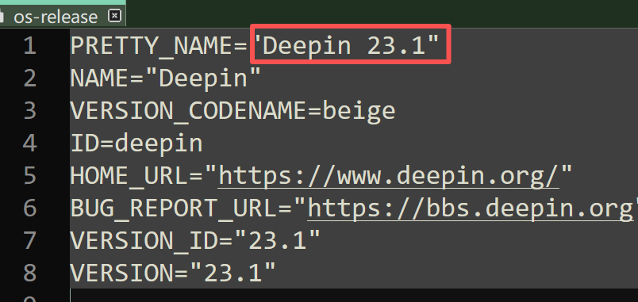
因此确定是23.1
usr/lib/os-release
`bookworm/sid` 通常来自 `/etc/debian_version`，表示 Deepin 基于的 Debian 分支，并非 Deepin 的版本号。
23.1

2.分析计算机检材，李安弘曾收到一份免费领取token的邮件的疑似钓鱼邮件，其发送用户邮箱为
我来我也会被钓。太诱人了免费token。
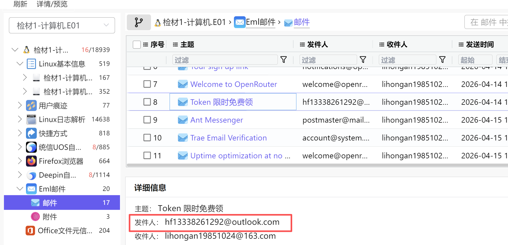
hf13338261292@outlook.com

3.分析计算机检材，李安弘电脑中记录的黄金换现金的商家联系方式

 2. 分析计算机检材，推广设计图中的apk
 3. 分析计算机检材，李安弘电脑vpn软件开放的代理端口为
 4. 分析计算机检材，李安弘电脑中AI软件当前使用的模型类型为
 5. 分析计算机检材，李安弘电脑中AI软件当前使用的模型apiKey为
 6. 分析计算机检材，李安弘电脑中勒索软件提供的解密服务联系方式为
7. 分析计算机检材，李安弘电脑中记录的存放黄金的保险柜编号是
8. 分析计算机检材，李安弘电脑中记录的保险柜密码是


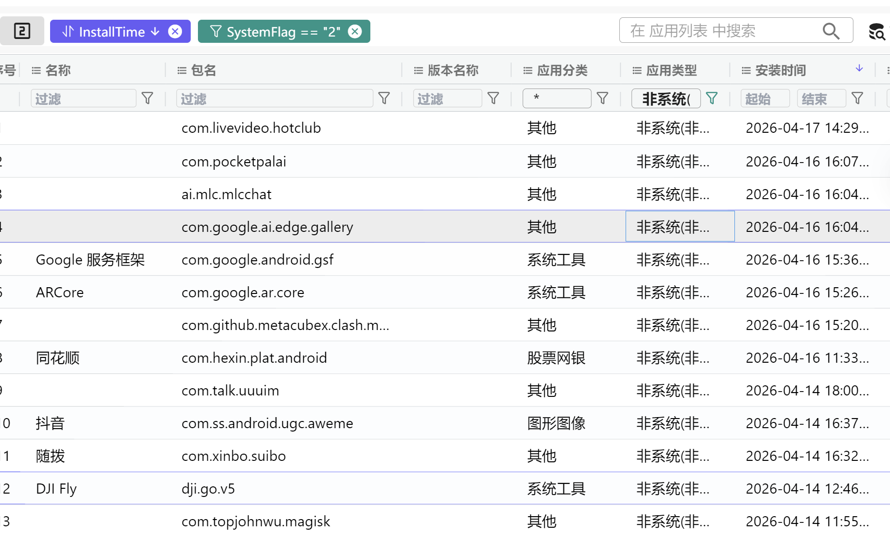


com.ss.android.ugc.aweme

9ed2@99y8.com.cn


11.com.livevideo.hotclub
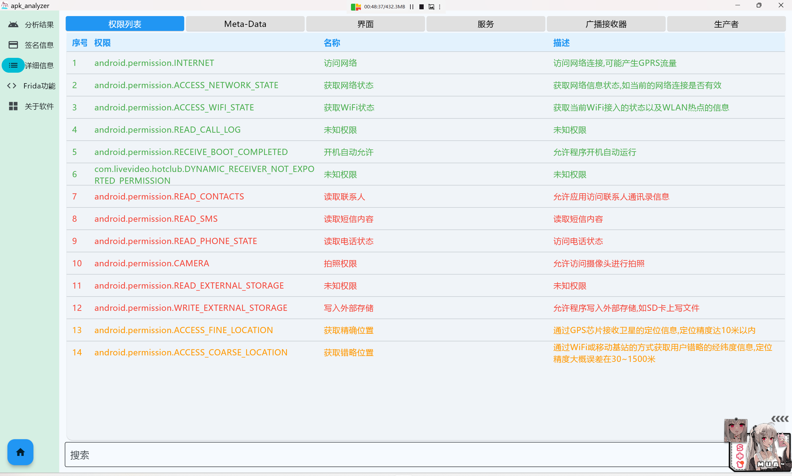  已确认

      3. 20260414
      4. 5
      5. Qwen3.5-0.8B
     6. A B D
     7. file:///android_asset/www/index.html
     8. 编码方式：Base64
     9. 上传 URL：https://api.sp-live88.com/collect/userdata
     10. user_collection
     11. TXqH7sVn8bR4kL2mN9pW6xJ3cY5dF1gA
     12. getContactsList

  高置信，正在补最后一层证据记录

      13. wk_9628874a3c6b403593766496fa985893.db
      14. TK7mR3hS8vY7tY1nZ4kL9otSzgjLj6tP8v

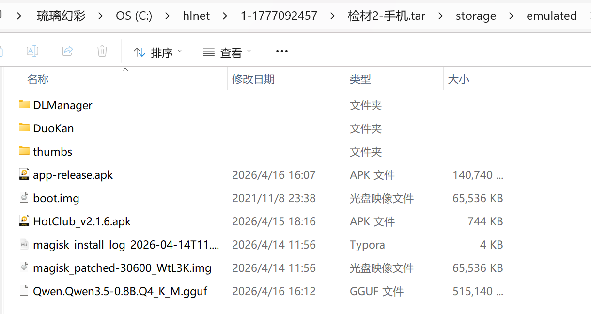记住，按题号序号对应答案！

## 服务器

服务器仿真

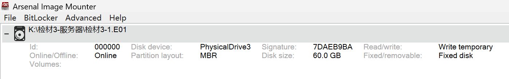
注意！Vmware必须管理员权限打开！不然没权限仿真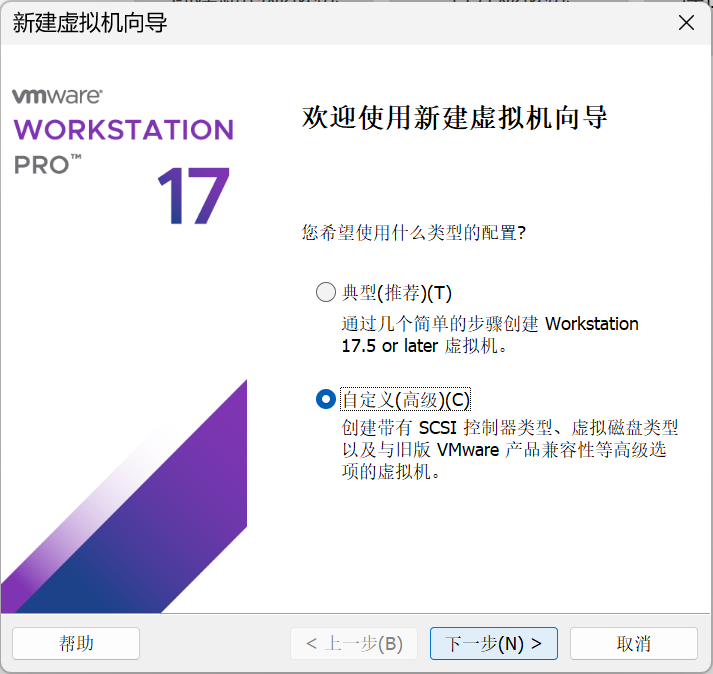
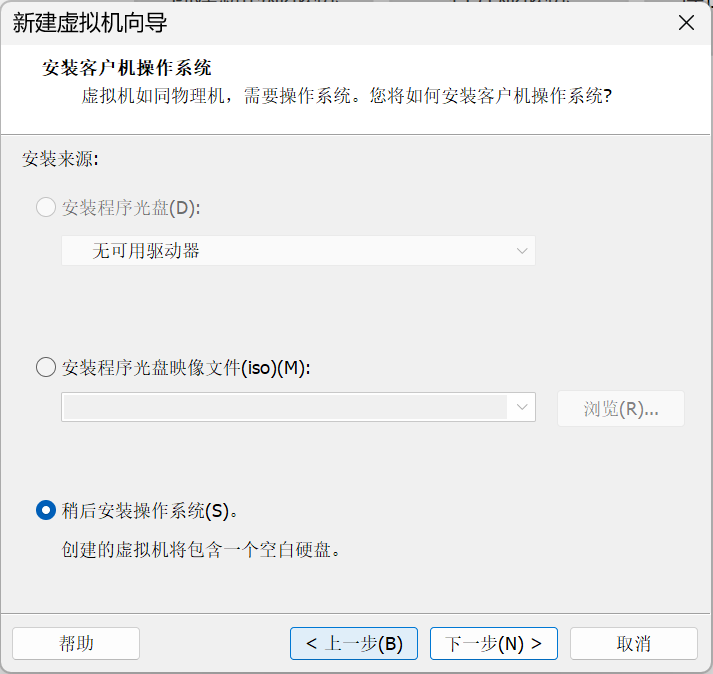


> **题目**
>
> 1. 该服务器主机操作系统版本为


2. 该服务器根分区硬盘的uuid号为
11.00 分
【不区分大小写】【不区分空格】【不区分换行符 (不考虑末尾)】【不区分全半角】
【参考格式：a1b2-c3】
3. 该服务器中最新的docker镜像创建时间为
10.00 分
【不区分大小写】【不区分空格】【不区分换行符 (不考虑末尾)】【不区分全半角】
【参考格式：2020-01-01T00:00:00.012345678Z】
4. 该服务器根分区快照路径为
11.00 分
【不区分大小写】【不区分空格】【不区分换行符 (不考虑末尾)】【不区分全半角】
【参考格式：/abc/def】
5. 该网站后台管理入口对应的文件名为
11.00 分
【不区分大小写】【不区分空格】【不区分换行符 (不考虑末尾)】【不区分全半角】
【参考格式：123.txt】
6. 该网站设置的icp备案号为
10.00 分
【不区分大小写】【不区分空格】【不区分换行符 (不考虑末尾)】【不区分全半角】
【参考格式：icp123】
7. 该网站设置的主域名为
12.00 分
【不区分大小写】【不区分空格】【不区分换行符 (不考虑末尾)】【不区分全半角】
【参考格式：abc.com】
8. 该网站分类3中，视频的拼音为
12.00 分
【不区分大小写】【不区分空格】【不区分换行符 (不考虑末尾)】【不区分全半角】
【参考格式：abc】
9. 该站点设置页面中，被使用的前端模板来自于哪个源文件？
13.00 分
【不区分大小写】【不区分空格】【不区分换行符 (不考虑末尾)】【不区分全半角】
【参考格式：abc.def】
10. 该网站的伪静态规则配置文件sm3值为
12.00 分
【不区分大小写】【不区分空格】【不区分换行符 (不考虑末尾)】【不区分全半角】
【参考格式：ABC123】
11. 该网站关联的数据库的ip地址为
11.00 分
【不区分大小写】【不区分空格】【不区分换行符 (不考虑末尾)】【不区分全半角】
【参考格式：1.1.1.1】
12. 该网站数据库使用了哪一类容器技术
10.00 分
【不区分大小写】【不区分空格】【不区分换行符 (不考虑末尾)】【不区分全半角】
【参考格式：abc】

13. 运行在4000端口的备份数据库版本号为
11.00 分
【不区分大小写】【不区分空格】【不区分换行符 (不考虑末尾)】【不区分全半角】
【参考格式：v1.1.1】

14. 新注册用户数量最多的日期为
11.00 分
【不区分大小写】【不区分空格】【不区分换行符 (不考虑末尾)】【不区分全半角】
【参考格式：2000/1/1】

15. 马慧美最后一次登录该网站的ip为
12.00 分
【不区分大小写】【不区分空格】【不区分换行符 (不考虑末尾)】【不区分全半角】
【参考格式：1.1.1.1】

16. 以下哪个文件系统未被使用
12.00 分

A. ntfs

B. btrfs

C. xfs

D. lvm17. 该服务器安装了以下那些数据库服务
13.00 分

A. mysql

B. GuessDB

C. tidb

D. postgresql

E. mariadb

## 互联网

> **题目**
>
> 1. 售卖卡密的公开群组ID为
> 2. 备份数据库中视频图片的文件名为
> 3. ngrok提供的域名为


1.
2. 20260606
3. 20260414
4. wk_9628874a3c6b403593766496fa985893.db
5. 9ed2@99y8.com.cn
6. TK7mR3hS8vY7tY1nZ4kL9otSzgjLj6tP8v
7. 79663f
8. 5
9. Qwen3.5-0.8B

10. 米脂县
11. ABD
12. file:///android_asset/www/index.html
13. Base64;https://api.sp-live88.com/collect/userdata
14. user_collection
15. TXqH7sVn8bR4kL2mN9pW6xJ3cY5dF1gA
16. getContactsList
17. backup.sp-live88.xyz:8443

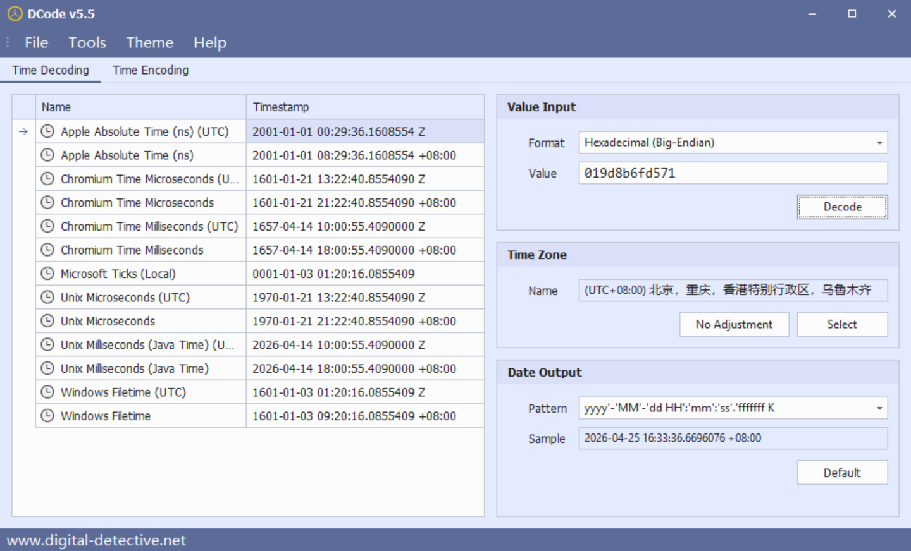

## 二进制
先挂载U盘：
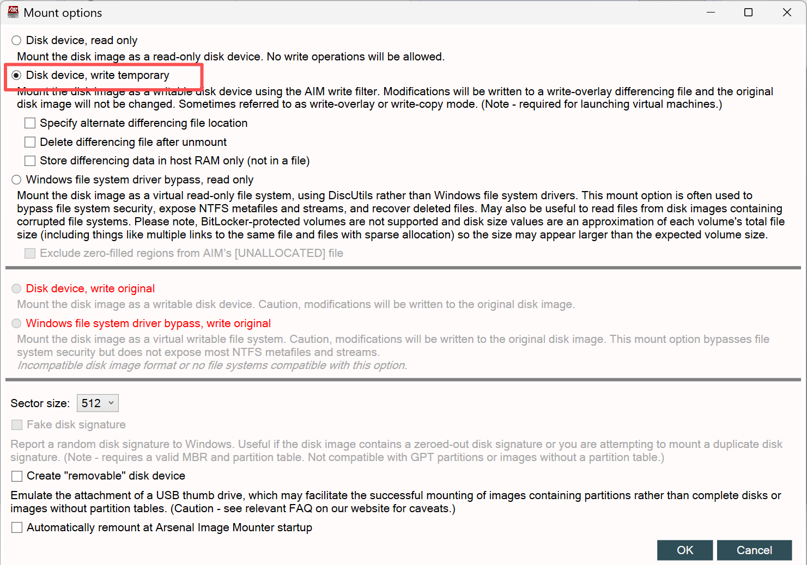
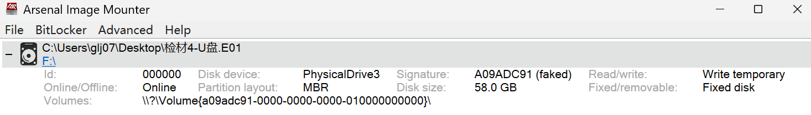
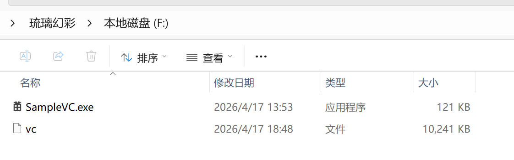

 **题目**
1.分析u盘检材，找到其中保存的加密程序SampleVC.exe，请给出这个exe程序的md5值（答案格式：c4ca4238a0b923820dcc509a6f75849b）
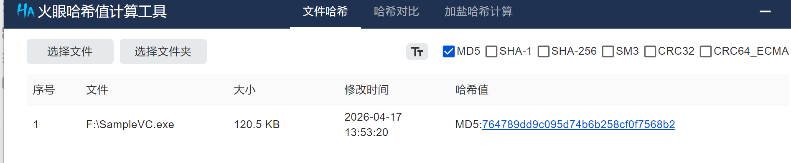
764789dd9c095d74b6b258cf0f7568b2

 2. 分析SampleVC.exe，该程序编译的日期可能是什么？（答案格式：2025-06-06）
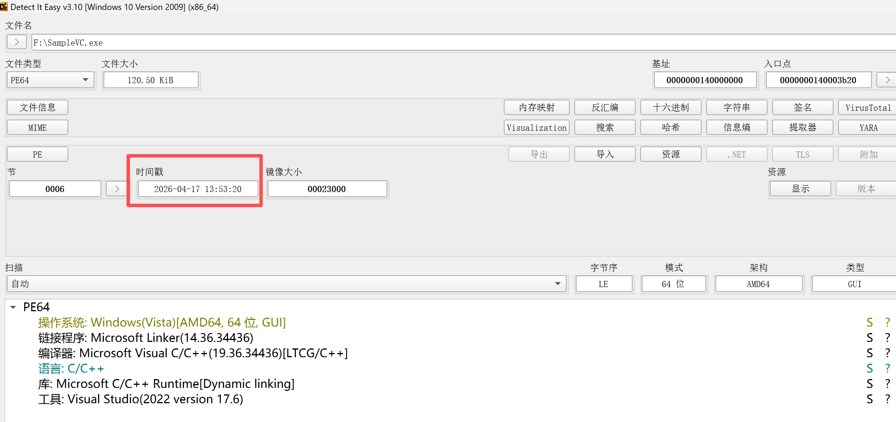
2026-04-17

 3. 分析SampleVC.exe，正确的密码是什么？（答案格式：abcdefghABCDEFGH）
 
由上题DIE看到程序64为，用×64 IDA打开。
分析main函数，这里是WinMain
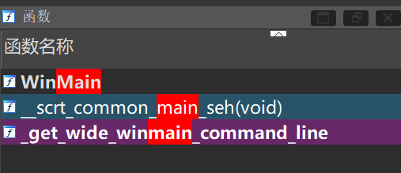
```
int __stdcall WinMain(HINSTANCE hInstance, HINSTANCE hPrevInstance, LPSTR lpCmdLine, int nShowCmd)
{
  HCURSOR CursorW; // rax
  HWND Window; // rax
  HWND v8; // rbx
  HACCEL AcceleratorsW; // rbx
  WNDCLASSEXW v11; // [rsp+60h] [rbp-59h] BYREF
  struct tagMSG Msg; // [rsp+B0h] [rbp-9h] BYREF
  INITCOMMONCONTROLSEX picce; // [rsp+E0h] [rbp+27h] BYREF
  int pvParam[4]; // [rsp+E8h] [rbp+2Fh] BYREF

  LoadStringW(hInstance, 0x67u, &WindowName, 100);
  LoadStringW(hInstance, 0x6Du, &ClassName, 100);
  v11.cbSize = 80;
  v11.lpfnWndProc = (WNDPROC)sub_1400024A0;
  v11.style = 3;
  *(_QWORD *)&v11.cbClsExtra = 0i64;
  v11.hInstance = hInstance;
  v11.hIcon = LoadIconW(hInstance, (LPCWSTR)0x6B);
  CursorW = LoadCursorW(0i64, (LPCWSTR)0x7F00);
  *(__m128i *)&v11.hbrBackground = _mm_load_si128((const __m128i *)&xmmword_1400058A0);
  v11.hCursor = CursorW;
  v11.lpszClassName = &ClassName;
  v11.hIconSm = LoadIconW(hInstance, (LPCWSTR)0x6C);
  RegisterClassExW(&v11);
  SystemParametersInfoW(0x30u, 0, pvParam, 0);
  ::hInstance = hInstance;
  Window = CreateWindowExW(
             0,
             &ClassName,
             &WindowName,
             0,
             (pvParam[2] - pvParam[0] - 500) / 2,
             (pvParam[3] - pvParam[1] - 300) / 2,
             500,
             300,
             0i64,
             0i64,
             hInstance,
             0i64);
  v8 = Window;
  if ( Window )
  {
    ShowWindow(Window, nShowCmd);
    UpdateWindow(v8);
    picce.dwSize = 8;
    picce.dwICC = 255;
    InitCommonControlsEx(&picce);
    AcceleratorsW = LoadAcceleratorsW(hInstance, (LPCWSTR)0x6D);
    while ( GetMessageW(&Msg, 0i64, 0, 0) )
    {
      if ( !TranslateAcceleratorW(Msg.hwnd, AcceleratorsW, &Msg) )
      {
        TranslateMessage(&Msg);
        DispatchMessageW(&Msg);
      }
    }
    LODWORD(Window) = Msg.wParam;
  }
  return (int)Window;
}
```
其中，最重要的一句话是：

`v11.lpfnWndProc = (WNDPROC)sub_1400024A0;`
这说明：**`sub_1400024A0` = 这个窗口的窗口过程（Window Procedure / WndProc）**
Windows 会把这个窗口收到的几乎所有消息，都丢给它处理。
也就是说：**`WinMain` 负责启动程序；`sub_1400024A0` 负责程序怎么表现、怎么响应用户。**


PleaseRunAsAdmin
 4.分析u盘检材，利用SampleVC.exe解密U盘中被加密的文件，解密后的文件的后缀是什么？（答案格式：exe）


 5.分析u盘检材，找到被加密的交易记录，统计李安弘虚拟币收款地址钱包总收款金额为【参考格式：1.00】
前面密码还没用到，肯定这一题需要。

在sampleVC里挂载文件。密码PleaseRunAsAdmin
发现不对。其实密码也提示管理员权限运行。