## 前言
## 一、手机取证
### 1.该手机的device_name是？
全局搜索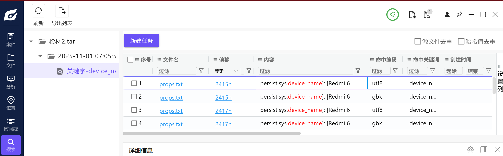

`检材2.tar/adb/lspd/log/props.txt` 可以看到设备信息：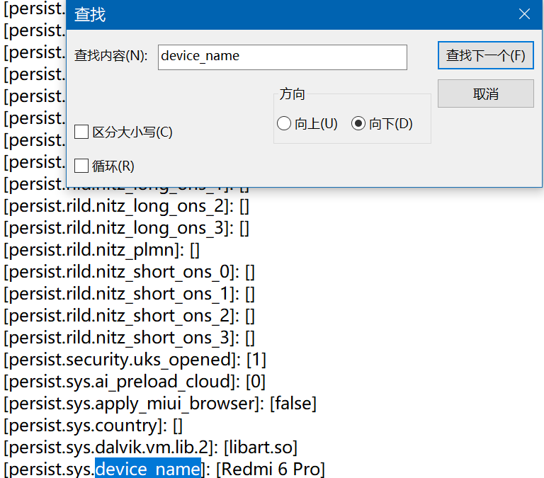

Redmi 6 Pro

### 2.嫌疑人pc开机密码是什么？
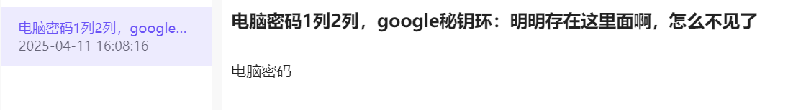一般手机中记录密码的地方: 远控相关软件记录、手机便签、照片等。浏览该软件安装软件列表, 没有远程连接相关软件. 查看便签相关软件, 该设备安装了三个软件: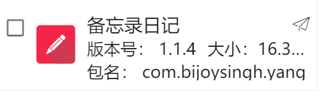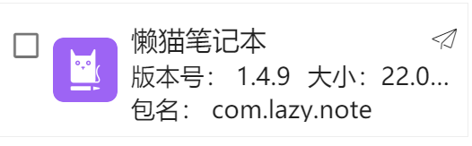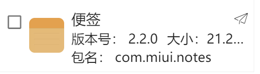

`/data/{packageName}` 路径下翻找记录, 最终在"备忘录日记"的路径下找到相关内容:

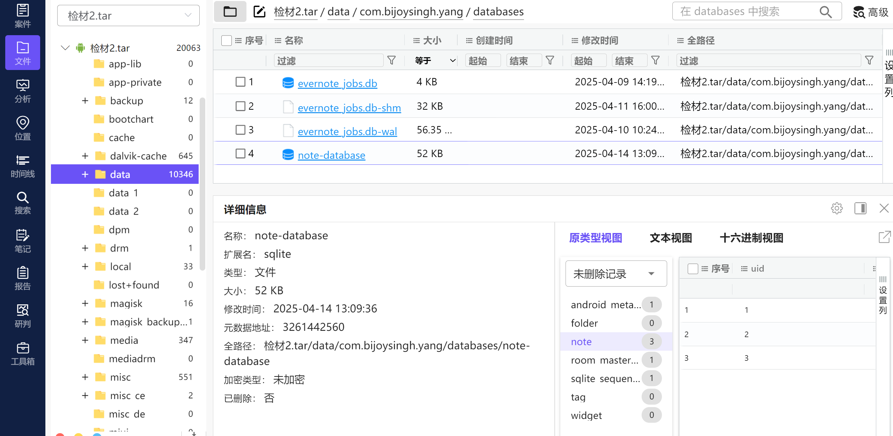自适应所有列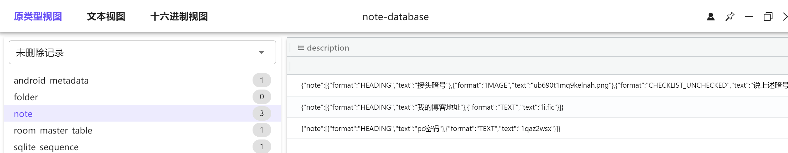

1qaz2wsx

### 3.嫌疑人接头暗号是什么？
如上图，接头暗号是

{"note":[{"format":"HEADING","text":"接头暗号"},{"format":"IMAGE","text":"ub690t1mq9kelnah.png"},{"format":"CHECKLIST_UNCHECKED","text":"说上述暗号"}

即一张文本命名为ub690t1mq9kelnah.png的图片

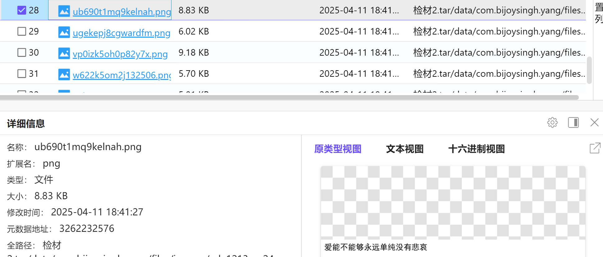

<u>爱能不能够永远单纯没有悲哀</u>

### 4.嫌疑人存放的秘钥环是多少？
全局搜索秘钥环

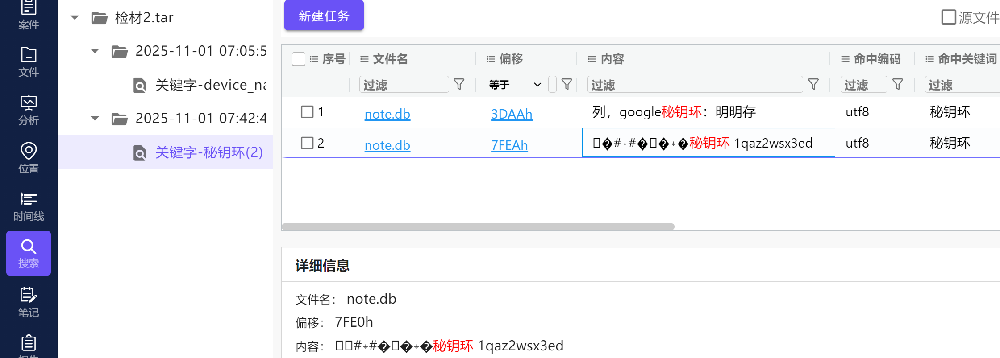

注意！这里直接看可能不完整。要打开后看，如下：

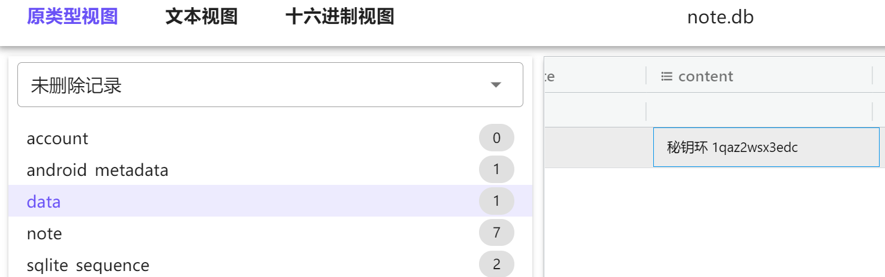

<u>1qaz2wsx3edc</u>

### 5.嫌疑人一生中最重要的日子是什么时候？
翻一翻图片就出来了（在OCR用不了的情况下）

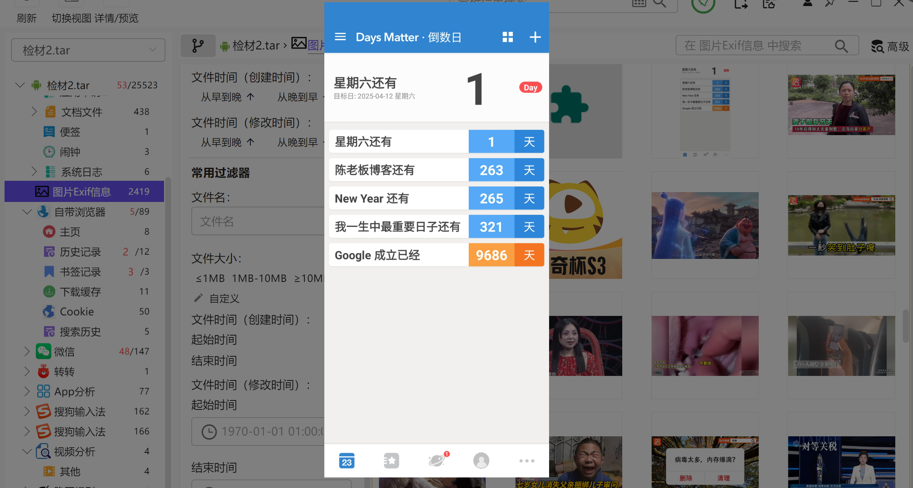

<u>2026-02-26</u>

### 6.嫌疑人微信生成的聊天记录数据库文件名称是什么？
随便选择一条聊天记录, 点击"跳转到源文件":

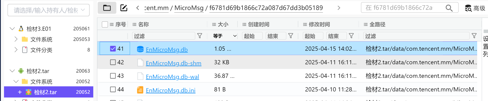

<u>EnMicroMsg.db</u>

### 7.嫌疑人微信账号对应的 UIN 为多少？
Unique Identification Number，即“唯一标识号码”或“唯一身份识别码”

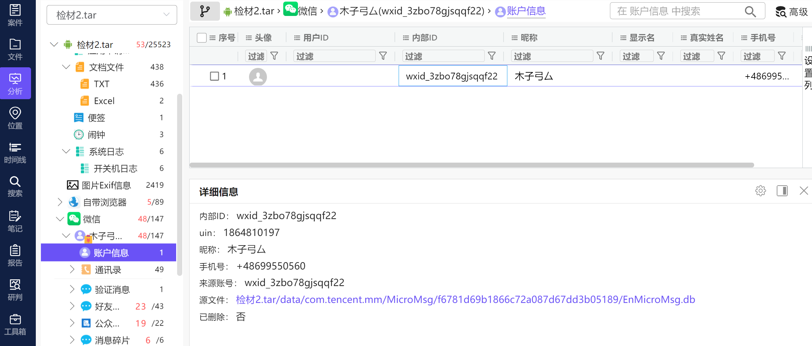

<u>1864810197</u>

### 8.嫌疑人微信聊天记录数据库的加密秘钥是什么？
知道uin了，用ForensicTool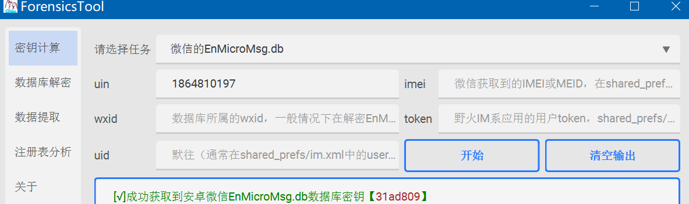

### 9.请分析检材二，请分析"手机"检材，并回答，嫌疑人“欠条.rar”的解压密码是多少？
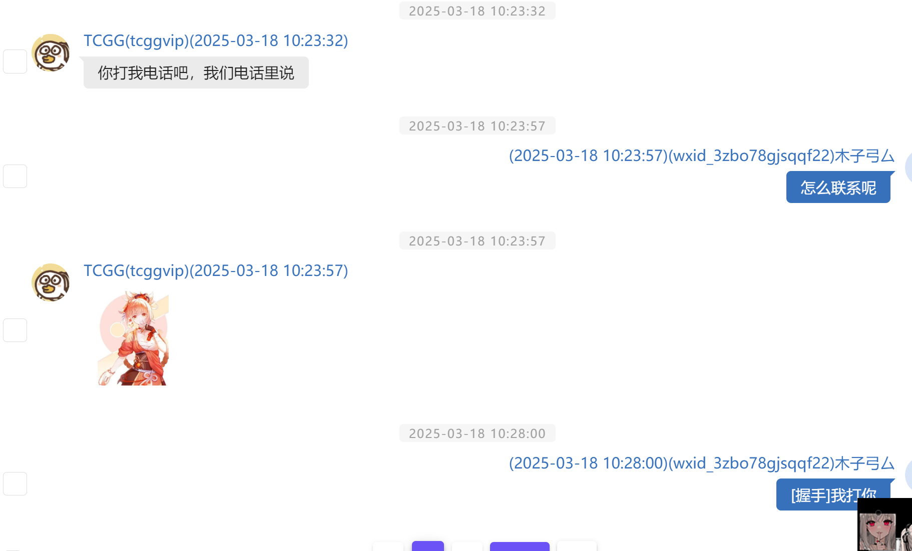

推断手机号码藏在图片里  
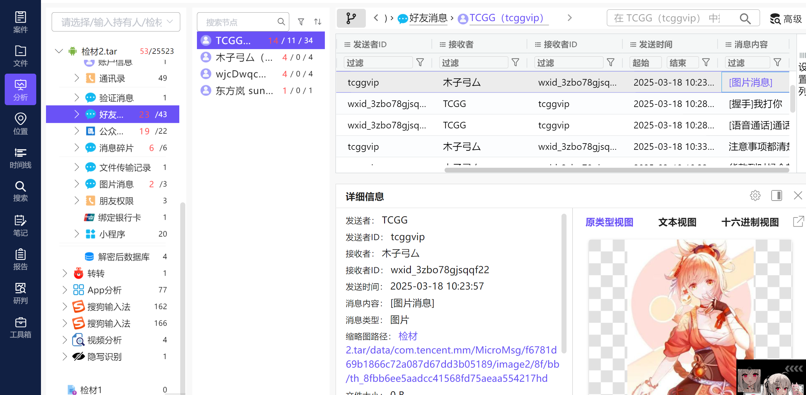

在微信的文件存储目录 `检材2.tar/data/com.tencent.mm/MicroMsg/f6781d69b1866c72a087d67dd3b05189/image2/8f/bb/` 中找到 2 张相似的图片:

怀疑是图片拼接题

Stegsolve——Analyse——Image Combiner

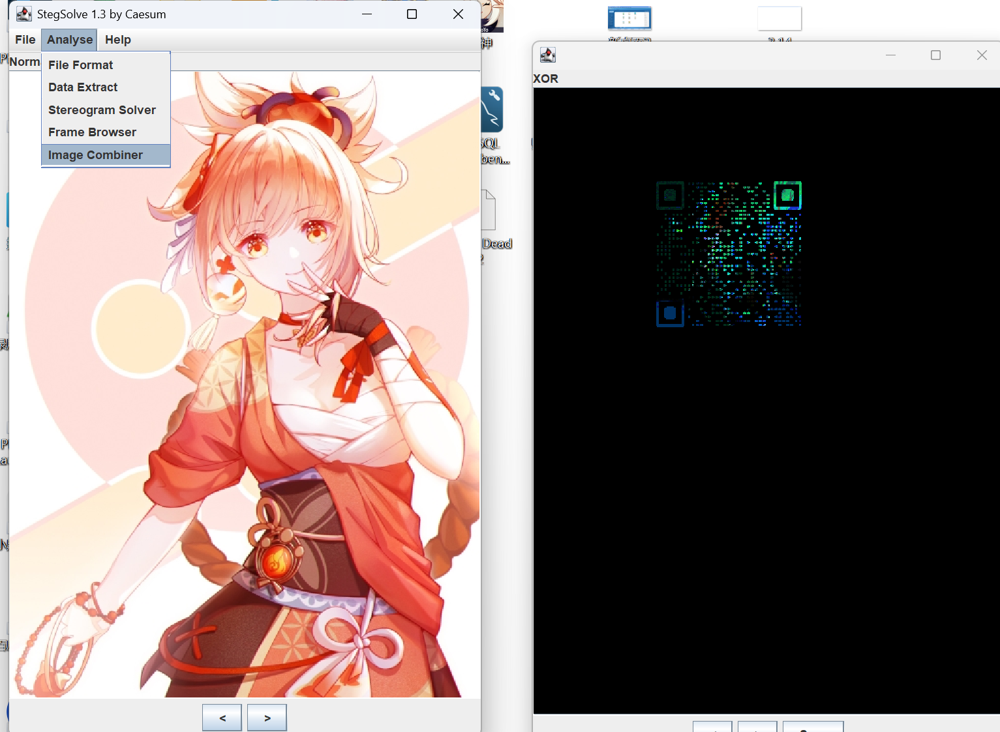

果然可以找到一个二维码

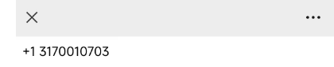

如图，得到陈某的电话13170010703，也是欠条的密码：3170010703

（也能这样子做）

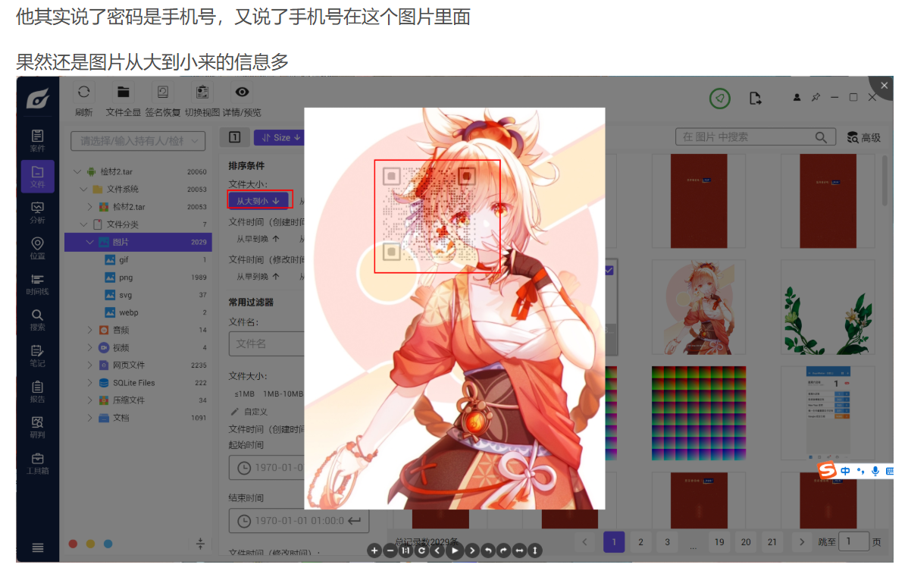

### 10.请分析检材二，请分析"手机"检材，并回答，嫌疑人“欠条.rar”解压后，其中VeraCrypt容器的MD5值是多少？
纯送分，第九题解出来就简单了

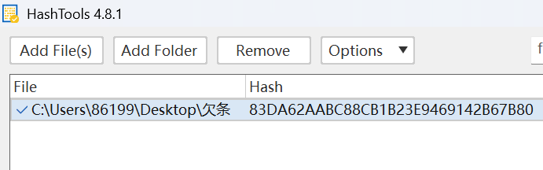

### 11.嫌疑人提供的“欠条.rar”解压后，其中"1.png"图上显示的VeraCrypt容器密码是多少？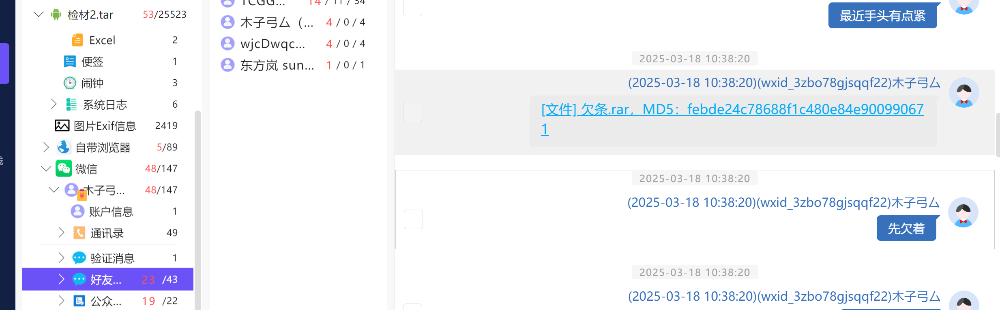
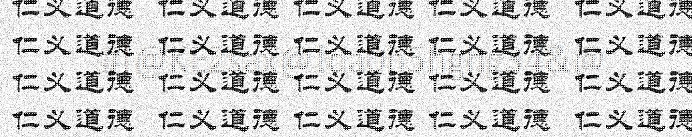

可以看到屏幕当中有一串字符，应该是相关的密码，其实我觉得挺清楚的，但是也可以对比度加强点啥的

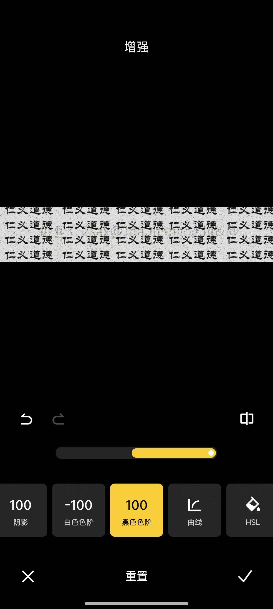

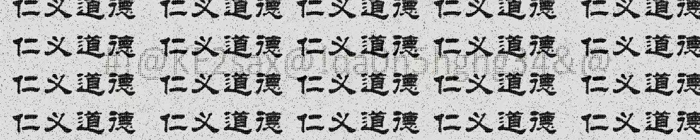

确实会更清楚点

反正是这个#!@KE2sax@!da0h5hghg34&@

### 12.请分析检材二，请分析"手机"检材，并回答，嫌疑人李某全名是什么？
李某全名根据那张在欠条vc里的图片可以直接看到是

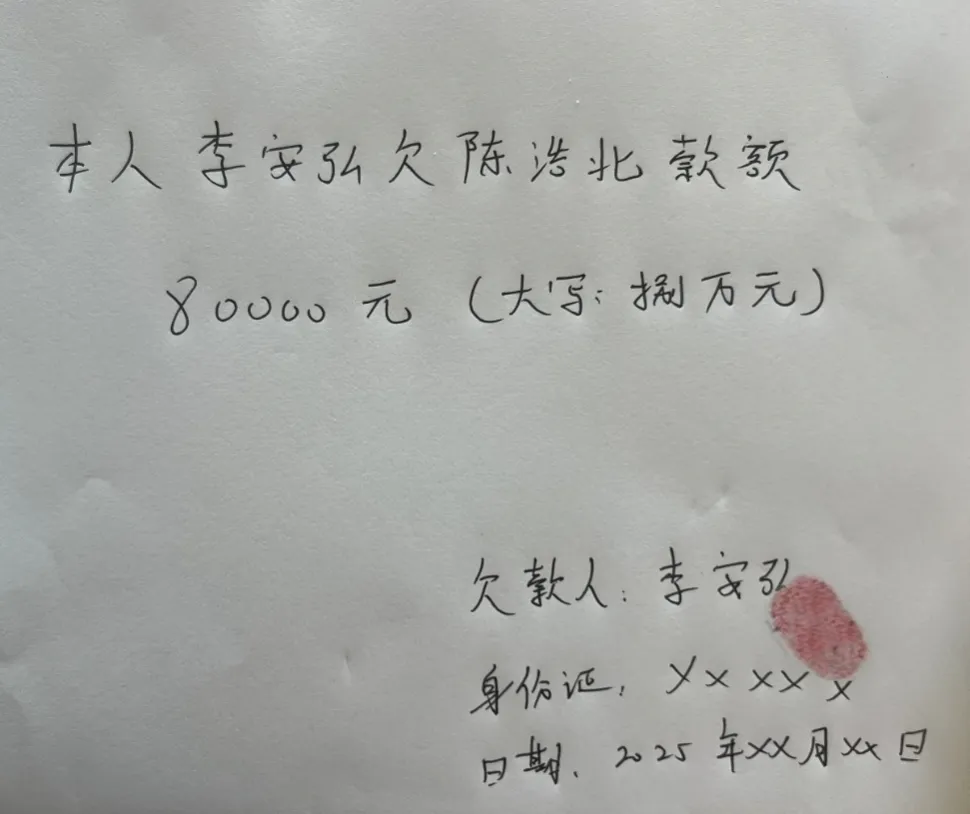

所以李某可知为李安弘，陈某为陈浩北（可以解下边的题目）

其实这道题不用解出欠条也能知道（）

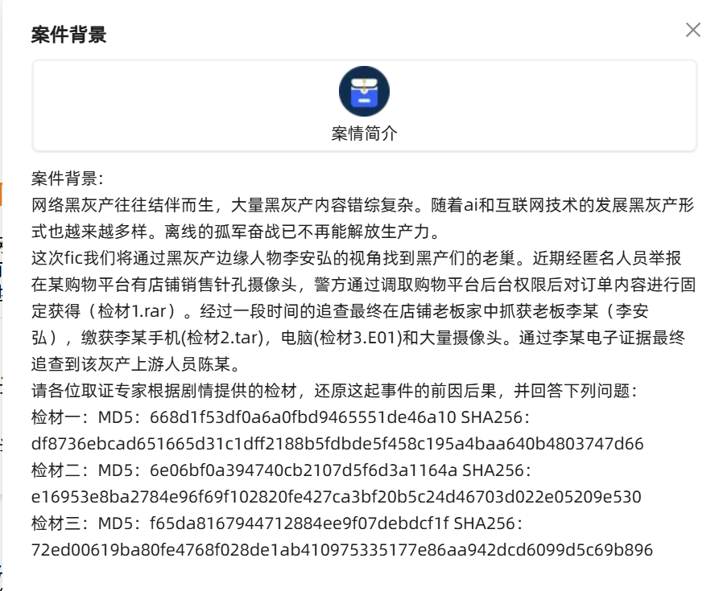

毕竟案件背景里直接写了嫌疑人叫李安弘

### 13.请分析检材二，请分析"手机"检材，并回答，嫌疑人欠款金额是多少？

如图，8w元（给我蒙对了，爽死我了）

（这次属于我所对标的手机取证到此为止，难度其实不高，主要在于没能发现两张图片可以通过stegstove发现二维码，如果找到这个的话可以多做很多题，可惜了，还有一些简单题没能做出来也蛮不应该的，唉，盘古石杯再接再厉吧）

## 

