# <font style="color:#000000;">前言</font>
<font style="color:#000000;">容器密码：cqpu@qz2025#$%^&*fgs45</font>

# <font style="color:#000000;">电子取证</font>
## <font style="color:#000000;">一、手机取证</font>
### <font style="color:#000000;">1.该机主的QQ号为？（标准格式：123）（2分）</font>


直接看并无QQ。藏在了关联账户里。

<font style="color:rgb(82, 196, 26);">1203494553</font>

### <font style="color:#000000;">2.该机主的微信号为？（标准格式：abcdefg）（2分）</font>
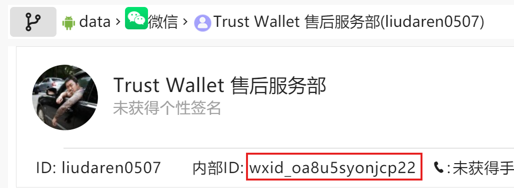

<font style="color:rgb(82, 196, 26);">wxid_oa8u5syonjcp22</font>

### <font style="color:#000000;">3.请问该手机机主微信共有个现有好友？（标准格式：12）（2分）</font>


<font style="color:rgb(82, 196, 26);">16</font>

### <font style="color:#000000;">4.请分析机主的银行卡卡号是多少？（标准格式：按照实际值填写）（4分）</font>


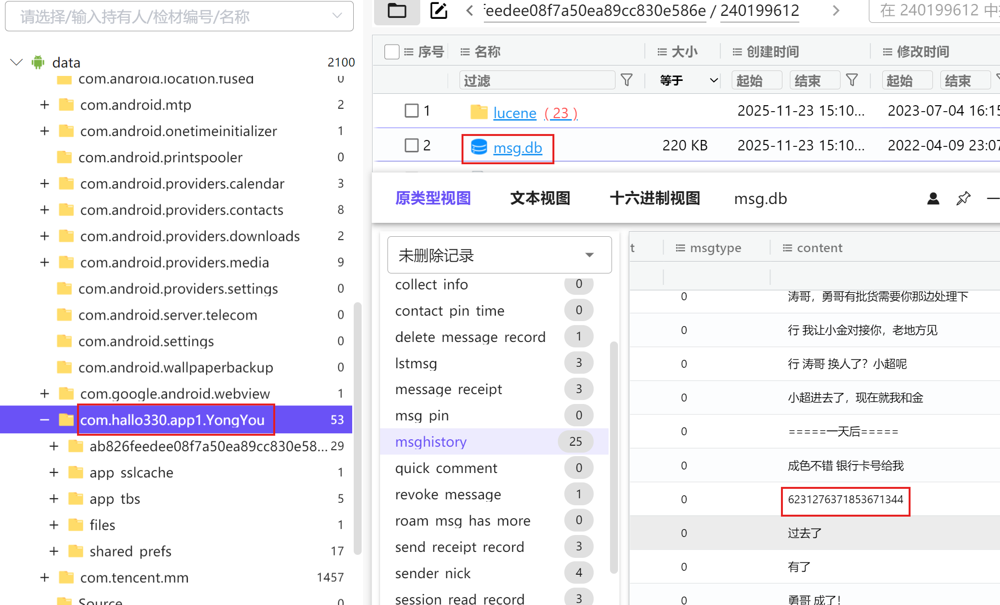

<font style="color:rgb(82, 196, 26);">6231276371853671344</font>

### <font style="color:#000000;">5.请分析出幕后老大王子勇的最新手机号码是多少？（标准格式：1234567）（4分）</font>
<font style="color:#000000;">和上题在一起，往下翻</font>


<font style="color:rgb(82, 196, 26);">19371263751</font>

### <font style="color:#000000;">6.请分析幕后老大的可疑的银行卡卡号是多少？（标准格式：按照实际值填写）（4分）</font>
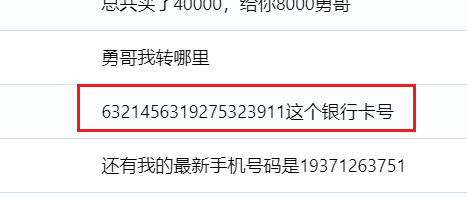

<font style="color:rgb(82, 196, 26);">6321456319275323911</font>

## <font style="color:#000000;">二、计算机取证</font>
### <font style="color:#000000;">7.请问计算机的网卡MAC地址是多少。（标准格式：00-0S-25-C6-E3-5F）（2分）</font>
物理网卡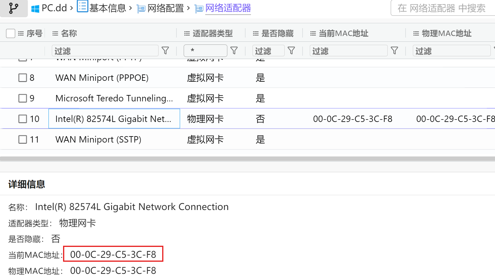

<font style="color:rgb(82, 196, 26);">00-0C-29-C5-3C-F8</font>

### <font style="color:#000000;">8.请问计算机管理员用户的设置密码时间是什么时候。（标准格式：1970/06/17 23:25:41）（4分）</font>
<font style="color:#000000;">法一：基本信息</font>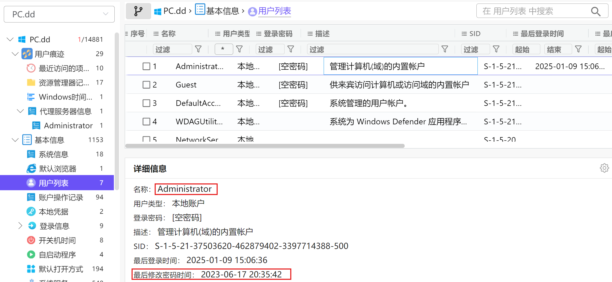

<font style="color:#000000;">法二：看操作记录，最后修改时间</font>

<font style="color:rgb(82, 196, 26);">2023/06/17 20:35:42</font>

### <font style="color:#000000;">9.分析数据文件夹中的表格文件共有有多少个两个字的姓名人数。（标准格式：10)（4分）</font>
有个虚拟机

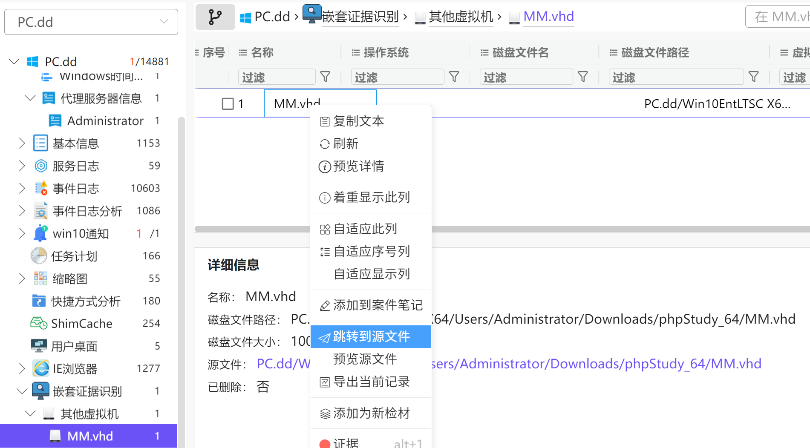

注意：需要复制到全英文路径才能正常打开！

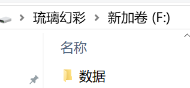

大数据题目内有多个表格。

我选择将数据合并到一个表格中。尝试：

数据——获取数据——导入数据

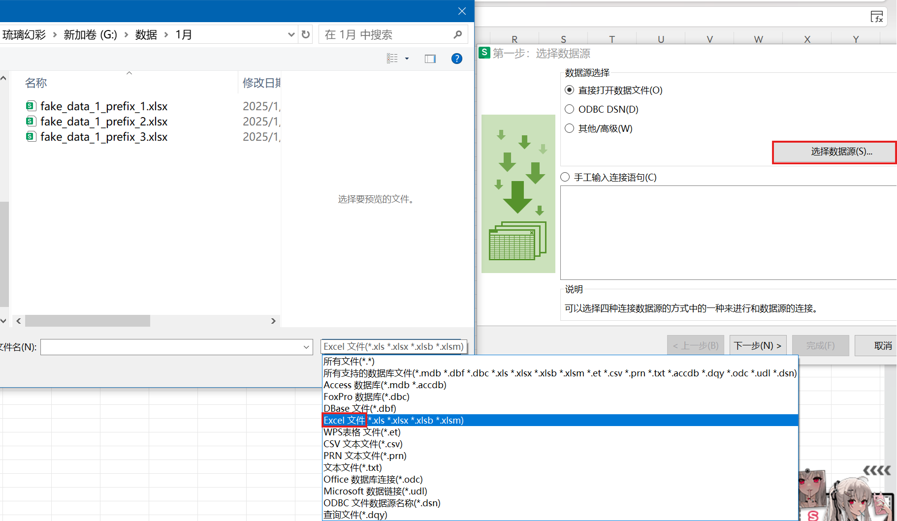

若出现以下报错，说明未安装<font style="color:#000000;">Access 2010 数据库引擎</font>


比赛时如果未安装，那就干脆复制粘贴了，也不慢。

[https://gitcode.com/open-source-toolkit/3adbd/?utm_source=tools_gitcode&index=top&type=card&&uuid_tt_dd=10_17094728390-1753000400481-265244&isLogin=1&from_id=141970921&from_link=db888d5734c15f90f2e38711ba81e403](https://gitcode.com/open-source-toolkit/3adbd/?utm_source=tools_gitcode&index=top&type=card&&uuid_tt_dd=10_17094728390-1753000400481-265244&isLogin=1&from_id=141970921&from_link=db888d5734c15f90f2e38711ba81e403)


实际上应该要数据清理，删除重复值。不过按题目问法，文件里多少就多少，保持原样。

```plain
=COUNTIF(A2:A1001,"??")
```

<font style="color:rgb(82, 196, 26);">908</font>

### 10.<font style="color:rgb(51, 51, 51);">请分析数据文件夹中表格共有多少姓陈的人。（标准格式：10）（4分）</font>
Excel筛选

```plain
=COUNTIF(A2:A1001,"陈*")
```

104/6

### 11.<font style="color:rgb(51, 51, 51);">请问计算机映射盘的挂载位置盘符是什么。（标准格式：B）（4分）</font>


挂载完就发现多了个E盘，所以是E

## <font style="color:#000000;">服务器取证</font>
### <font style="color:#000000;">12.该服务器的操作系统版本是？(格式：1.1.2001)（2分）</font>


<font style="color:rgb(82, 196, 26);">7.9.2009</font>

### <font style="color:#000000;">13.网站的域名是？(格式：www.example.com)（2分）</font>
<font style="color:#000000;">服务器站点信息</font>


<font style="color:rgb(82, 196, 26);">www.honglian7001.com</font>

### <font style="color:#000000;">14.Web.01虚拟机中设置的静态ip是什么？(格式：172.0.0.1)（4分）</font>
<font style="color:#000000;">看网络接口ens33</font>

<font style="color:#000000;">法一：火眼网络信息</font>


法二：连接虚拟机**ifconfig**

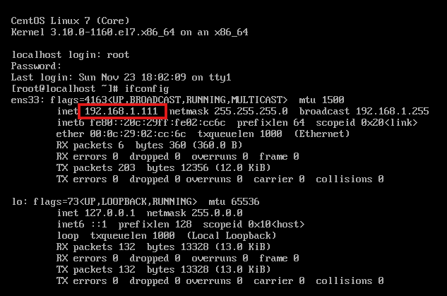

法三：连接虚拟机**ip a**

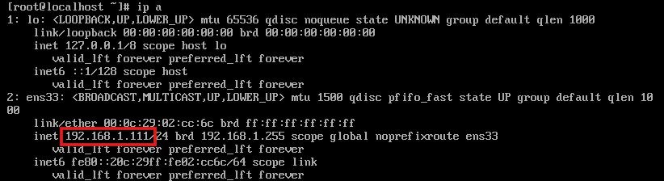

<font style="color:rgb(82, 196, 26);">192.168.1.111</font>

### 15.<font style="color:rgb(51, 51, 51);">Web.01中的ssh端口号是多少？(格式：8080)（4分）</font>
```plain
systemctl status sshd
```

若inactive则激活启用一下

```plain
systemctl start sshd
```


<font style="color:rgb(82, 196, 26);">7001</font>

### <font style="color:#000000;">16.80端口所对应的服务是？(格式：apache)（4分）</font>
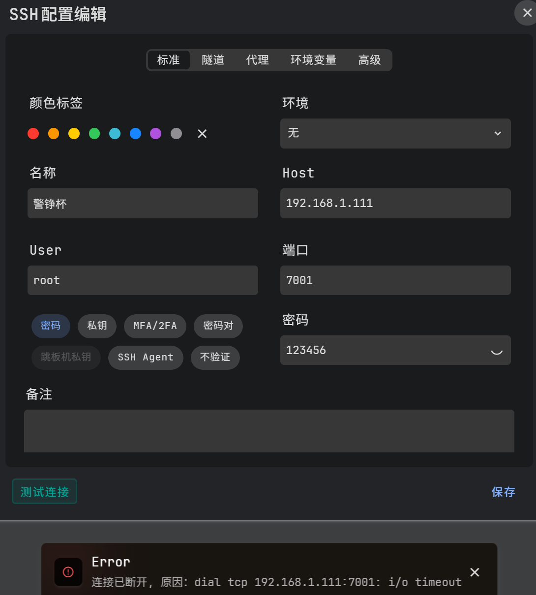

**错误原因是什么呢？**

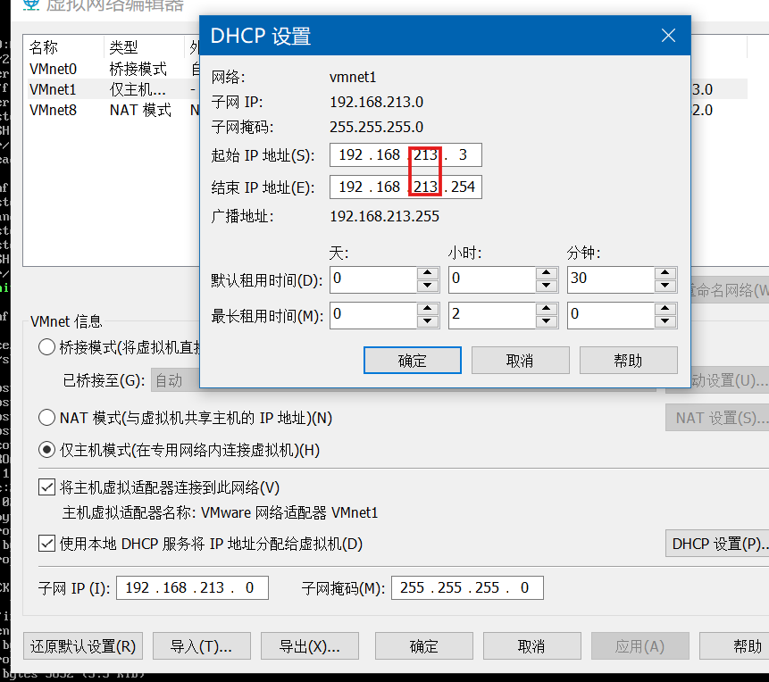

**<font style="color:#000000;">ip未对应就连不上ssh！修改子网IP:192.168.</font>****<font style="color:#000000;background-color:#DF2A3F;">1</font>****<font style="color:#000000;">.0</font>**

**<font style="color:#000000;">还有注意点：改完默认ip为128-254。得改成</font>****<font style="color:#000000;background-color:#DF2A3F;">3-254</font>****<font style="color:#000000;">。因为原本是192.168.1.111。否则也连不上</font>**


**<font style="color:#000000;">netstat -tunlp </font>**

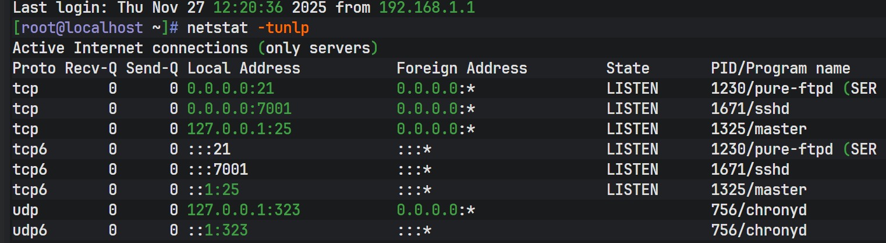

<font style="color:#000000;">未见80端口</font>

```plain
systemctl status nginx
systemctl start nginx
systemctl status nginx
```

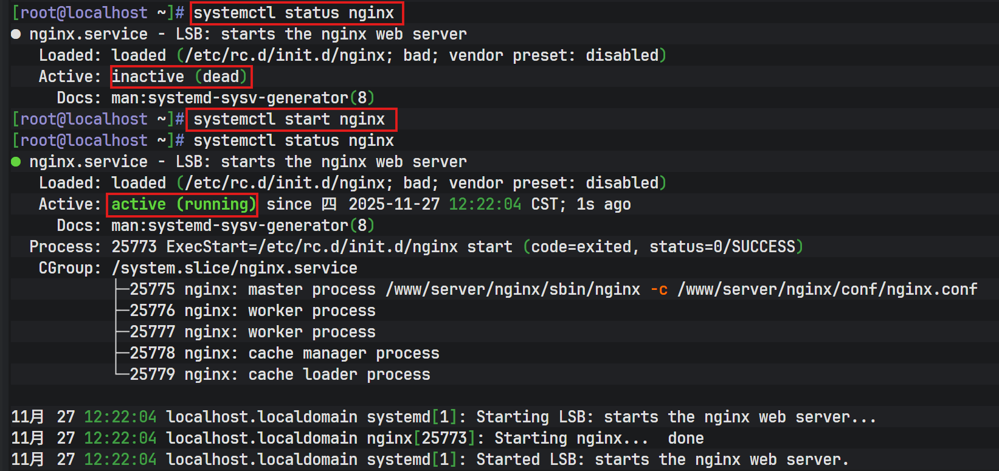

<font style="color:rgb(82, 196, 26);">nginx</font>

### <font style="color:#000000;">17.mysql数据库的版本是？(格式：1.1.11)（4分）</font>
法一：火眼一把梭

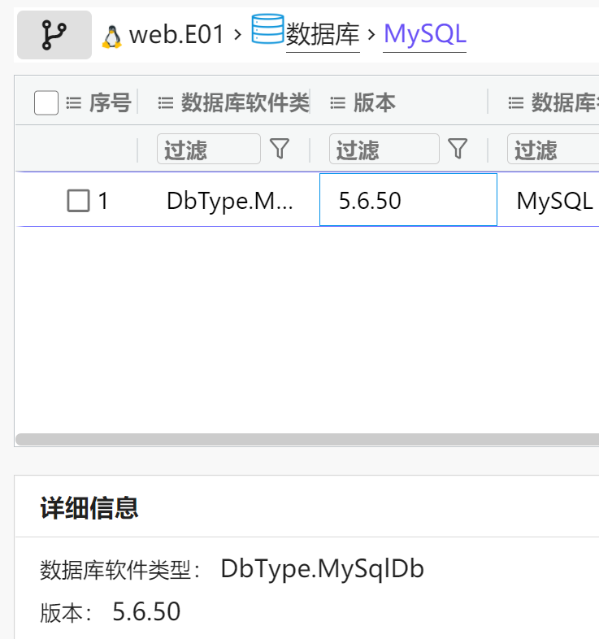

法二：故技重施，举一反三

```plain
systemctl status mysql
systemctl start mysql
systemctl status mysql
```


**<font style="color:#000000;">mysql -V</font>**


<font style="color:rgb(82, 196, 26);">5.6.50</font>

### <font style="color:#000000;">18.该网站的数据库名是？(格式：ads_fdcx1234)（4分）</font>


<font style="color:rgb(82, 196, 26);">www_honglian7001</font>

### <font style="color:#000000;">19.该数据库名下有多少张表？(格式：55)（4分）</font>
**<font style="color:#000000;">启动宝塔：bt default</font>**


> 外网面板地址: http://:8888/d42e9f35
>
> 内网面板地址: [http://192.168.1.111:8888/d42e9f35](http://192.168.1.111:8888/d42e9f35)
>
> username: yun9tinp
>
> password: bc955e14
>

正如提示所说，无法访问面板，于是检查防火墙/安全组是否有放行面板[8888]端口

**<font style="color:#000000;">firewall-cmd --zone=public --remove-port=8888/tcp --permanent</font>**

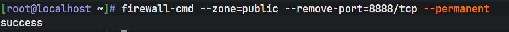

只能尝试添加网卡：

虚拟机设置——添加——网络适配器——仅主机


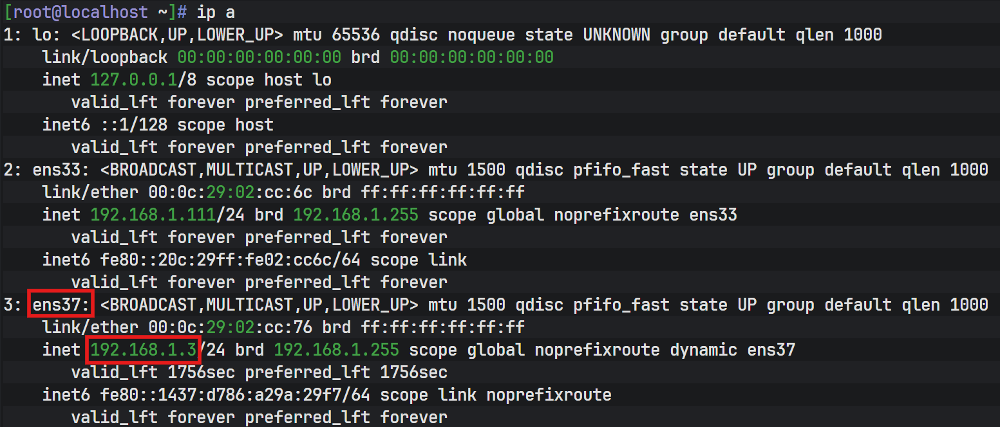

出现额外的**<font style="color:#000000;">ens37</font>**


于是就可以连上啦~


可以看到本题的数据库，所以我们直接看看phpMyadmin


所以一共17张表，本题答案为17

当然啦，我们也可以不登宝塔，直接看看mysql的配置文件database.php


在finalshell下边有文件

这边有登录密码，我们利用这个也可以在navicat进行mysql的连接

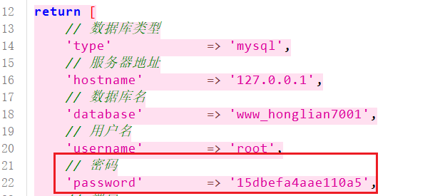

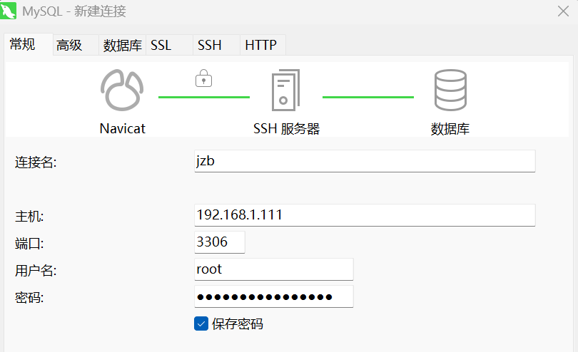

打开来看这个数据库也可以发现名下有17张表


所以答案为17


### 20.<font style="color:rgb(51, 51, 51);">该网站后台登录密码的密码额外加密字符是？(格式：ijia62asdz)（6分）</font>
这题问我们后台登录密码的密码额外加密字符，其实就是问我们配置文件里对密码的一种放到数据库的存储方式

我们直接看就好了其实

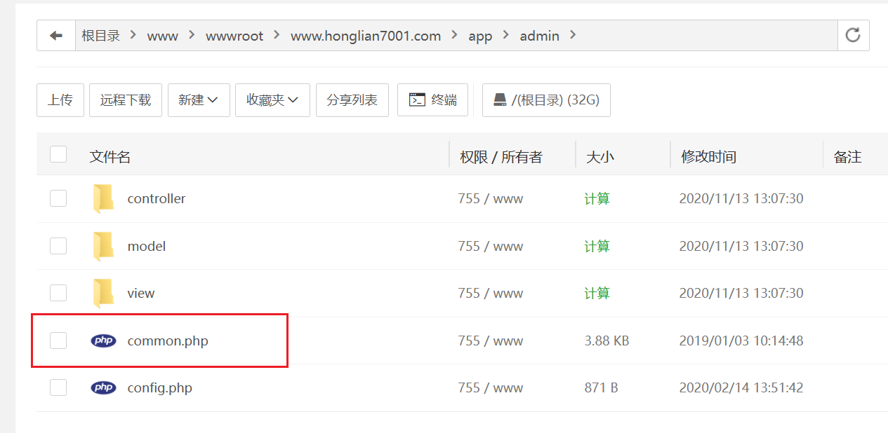

在管理员目录下看common.php

就可以看到我们密码的存储方式了

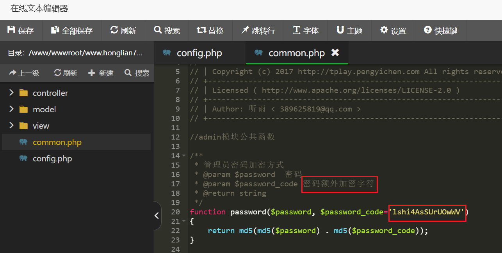

<font style="color:rgb(77, 77, 77);">所以密码的额外加密字符就是lshi4AsSUrUOwWV</font>

<font style="color:rgb(77, 77, 77);">最后存到数据库的密码是先把密码算md5，再算lshi4AsSUrUOwWV的md5，最后算字符串相接的md5</font>

<font style="color:rgb(77, 77, 77);">所以我们可以以此绕过密码</font>

<font style="color:rgb(77, 77, 77);">至少本题答案是lshi4AsSUrUOwWV</font>


### 21.<font style="color:rgb(51, 51, 51);">在网站后台查看到的完美通讯app有多少用户？(格式：1234)（4分）</font>
这一题我们就必须先看看完美通讯后台了

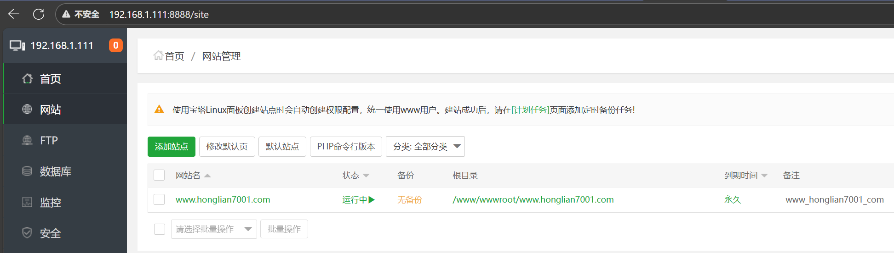

网站已经确定是www.honglian7001.com了

我们要登录这个网站，发现进不去，怀疑是域名还没有正式解析到我的IP

所以首先需要绕过DNS服务器


我们可以借助仿真直接修改Hosts文件

当然其实就是以管理员身份来运行了C:\Windows\System32\drivers\etc\hosts

后边加上静态映射


末尾加这样子一行就好了

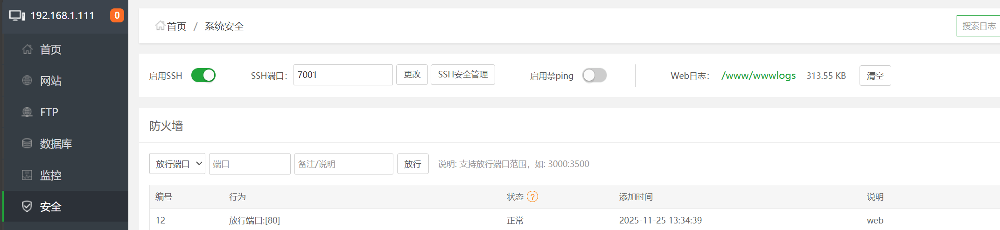

端口是80，所以我们需要这边再放行一下端口80

最后就可以上去啦

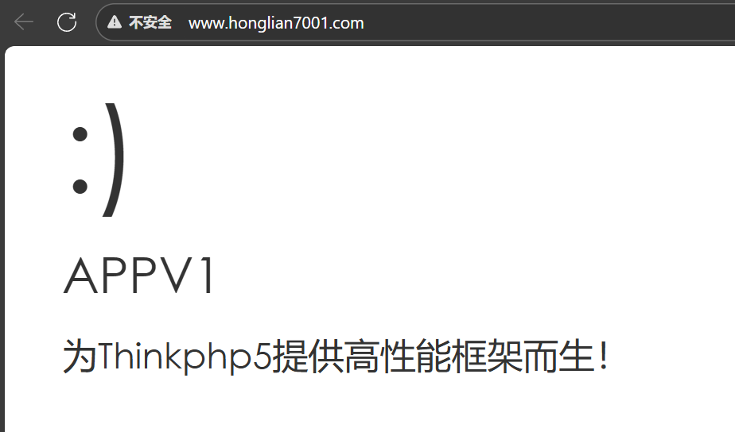

成功上去了，接下来找一下后台

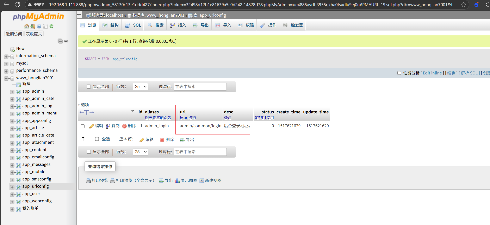

在数据库里有一个url配置表

在里边我们看到了后台在/admin/commom/login的位置

过去看一下

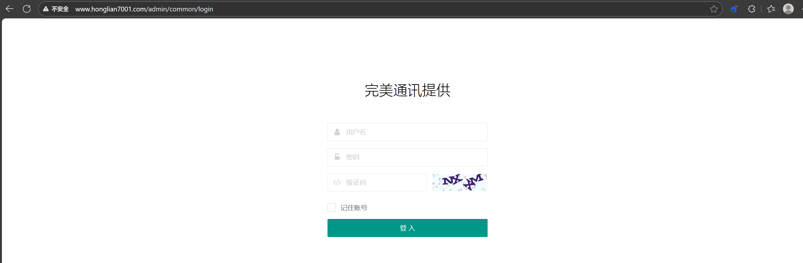

成功找到后台，现在需要登录，我们上一题已经知道了密码的存储方式，所以我们可以利用这存储方式进行绕密

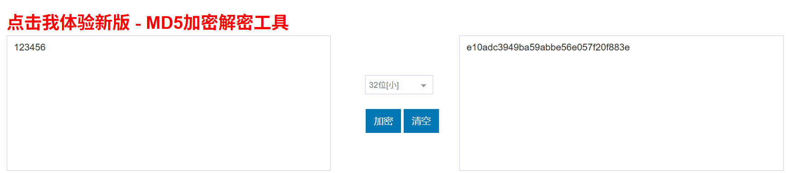

先算123456的md5

然后算额外的<font style="color:rgb(77, 77, 77);">lshi4AsSUrUOwWV的md5</font>


最后拼起来，然后再进行一次md5计算

e10adc3949ba59abbe56e057f20f883e7f5918fe56f4a01d8b206f6a8aee40f2


9eb2b9ad495a75f80f9cf67ed08bbaae


更改数据库


成功通过密码123456登录网站


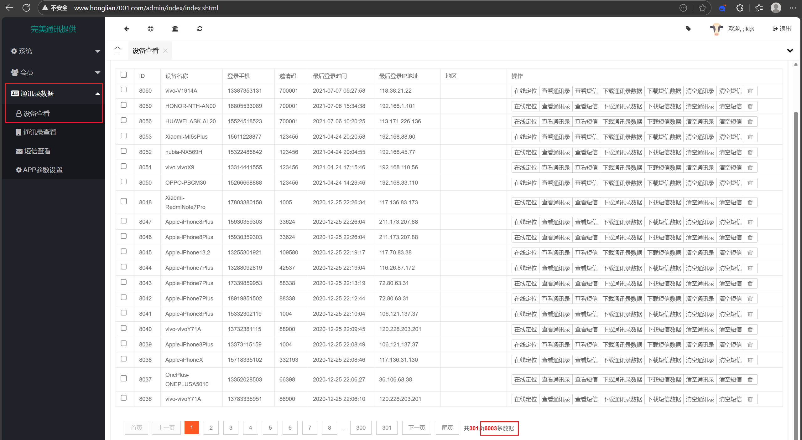

最后直接设备查看，看看一共多少条


6003

### <font style="color:#000000;">22.完美通讯app的登录邀请码是？(格式：1234567)（4分）</font>
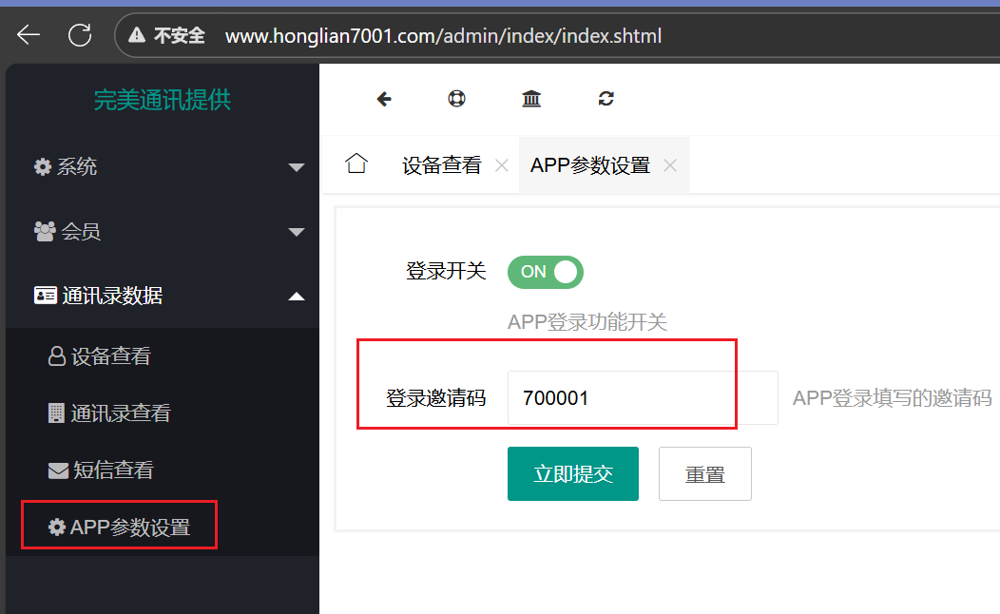

<font style="color:#000000;">700001</font>

