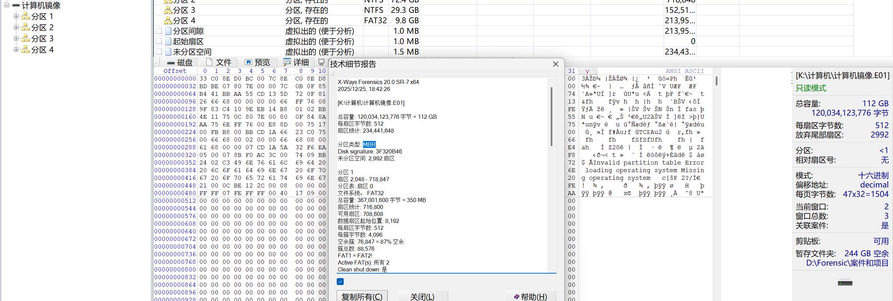
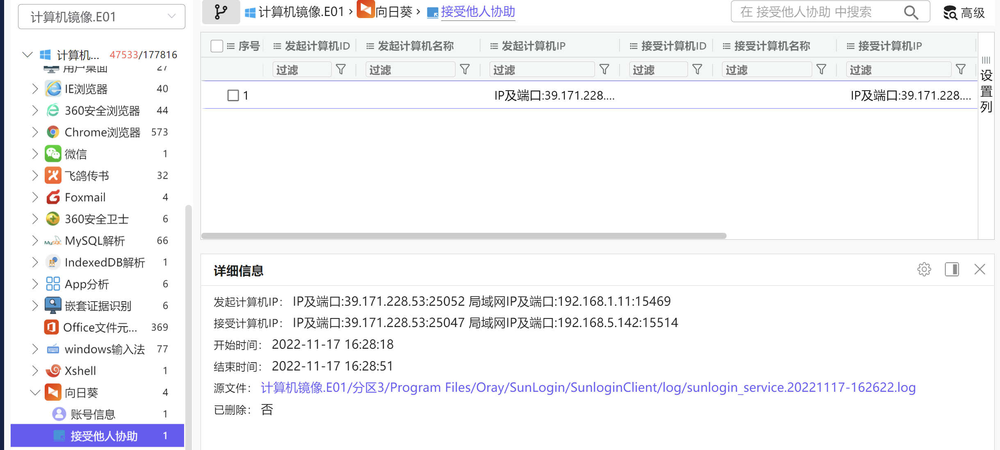
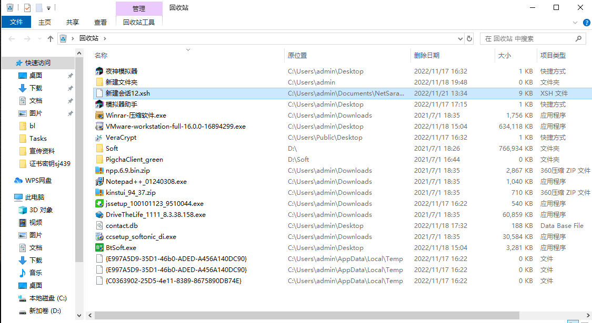
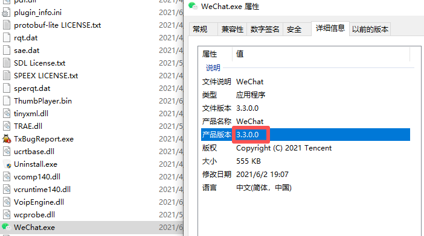
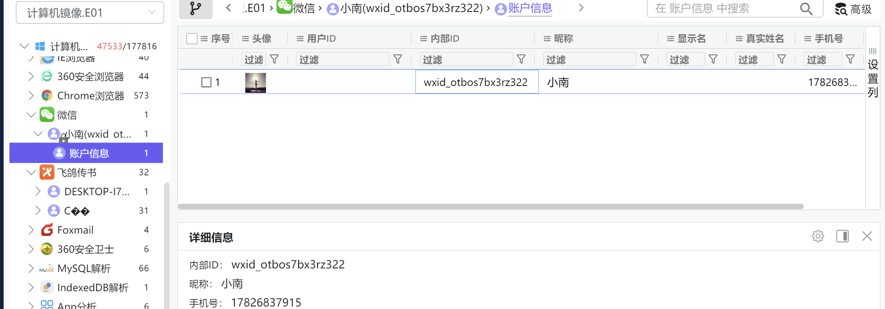
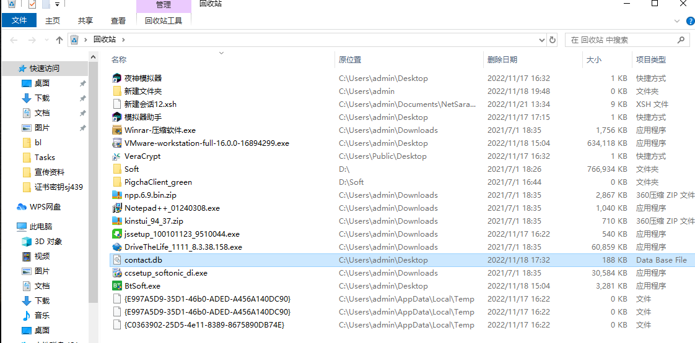
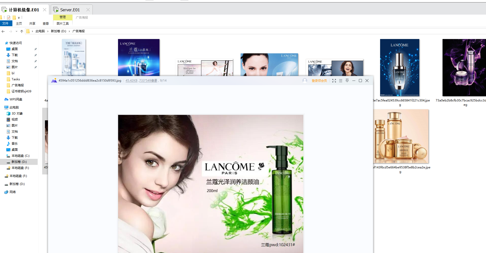
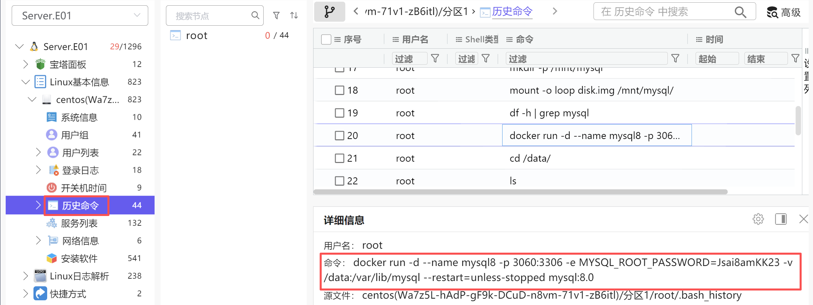

# **1、分析服务器磁盘镜像，其源盘SHA256值是？（答案格式：大写）**

2

3

39.171.228.53

4.

### 8、分析计算机镜像，请确认计算机曾登录过微信id为？（标准格式：abc_123）

### 10、分析计算机镜像，请确认涉案同伙【王一恒】所在的地址为（标准格式：杭州）
全局搜索都没有

经验之谈：回收站必看

且勾选显示隐藏文件

可疑的db文件

102431#

720

099165-113190-094248-084568-616814-263637-293931-333927

4C-1D-96-9C-FB-2B

VC密码：zxcQWE321#  
经验之谈：WPS看看历史记录。

经验之谈：做服务器必须看历史命令！

sudo nmcli connection up ens33

