## <font style="color:#000000;"></font>前言
<font style="color:rgba(0, 0, 0, 0.88);background-color:rgba(0, 0, 0, 0.02);">案情介绍：</font>

<font style="color:rgba(0, 0, 0, 0.88);background-color:rgba(0, 0, 0, 0.02);">2025年4月，杭州滨江警方接到辖区内市民刘晓倩(简称：倩倩)报案称：其个人电子设备疑似遭人监控。经初步调查，警方发现倩倩的手机存在可疑后台活动，手机可能存在被木马控制情况；对倩倩计算机进行流量监控，捕获可疑流量包。遂启动电子数据取证程序。 警方通过对倩倩手机和恶意流量包的分析，锁定一名化名“起早王”的本地男子。经搜查其住所，警方查扣一台个人电脑和服务器。技术分析显示，该服务器中存有与倩倩设备内同源的特制远控木马，可实时窃取手机摄像头、手机通信记录等相关敏感文件。进一步对服务器溯源，发现“起早王”曾渗透其任职的科技公司购物网站，获得公司服务器权限，非法窃取商业数据并使用公司的服务器搭建Trojan服务并作为跳板机实施远控。 请你结合以上案例并根据相关检材，完成下面的勘验工作。</font>

<font style="color:rgba(0, 0, 0, 0.88);background-color:rgba(0, 0, 0, 0.02);">检材下载链接：</font>[<font style="background-color:rgba(0, 0, 0, 0.02);">https://pan.baidu.com/s/1gTA5rG3pe1uMw5_KH5fckw?pwd=wiki</font>](https://pan.baidu.com/s/1gTA5rG3pe1uMw5_KH5fckw?pwd=wiki)

<font style="color:rgba(0, 0, 0, 0.88);background-color:rgba(0, 0, 0, 0.02);">挂载/解压密码：</font>`<font style="color:rgba(0, 0, 0, 0.88);background-color:rgba(150, 150, 150, 0.1);">早起王的爱恋日记</font><font style="color:rgba(0, 0, 0, 0.88);background-color:rgba(150, 150, 150, 0.1);">❤</font>`

## 一、[<font style="color:rgb(0,0,0);">计算机取证</font>](#bookmark1)
### [<font style="color:rgb(0,0,0);">1. 起早王的计算机插入过USB序列号是什么(格式：1)</font>](#bookmark2)
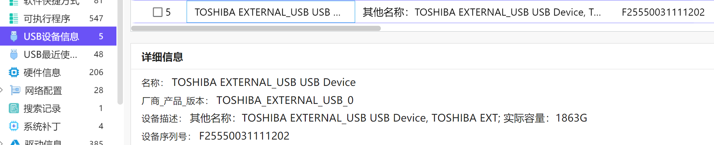

<font style="color:rgb(82, 196, 26);"> F25550031111202</font>

### [<font style="color:rgb(0,0,0);">2. 起早王的便签里有几条待干(格式：1)</font>](#bookmark3)
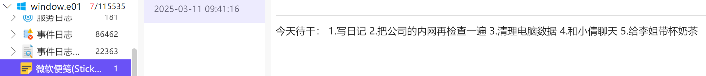

或仿真看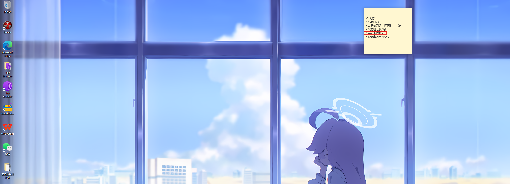

<font style="color:rgb(82, 196, 26);">5</font>

### [<font style="color:rgb(0,0,0);">3. 起早王的计算机默认浏览器是什么(格式：Google)</font>](#bookmark4)


<font style="color:rgb(82, 196, 26);">Microsoft Edge/Edge</font>

### <font style="color:rgb(0,0,0);">4.起早王在浏览器里看过什么小说(格式：十日终焉)</font>
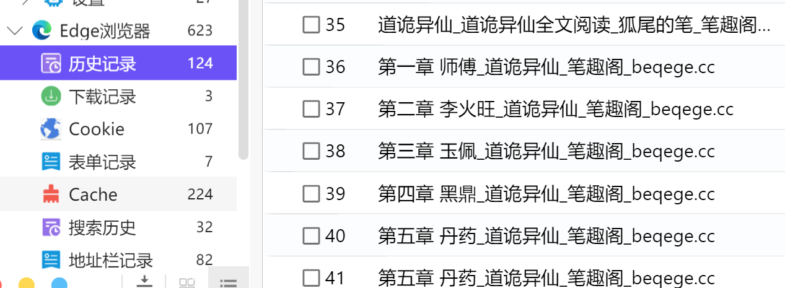

<font style="color:rgb(82, 196, 26);">道诡异仙</font>

### <font style="color:rgb(0,0,0);">5.起早王计算机最后—次正常关机时间(格式：2020/1/1 01:01:01)</font>
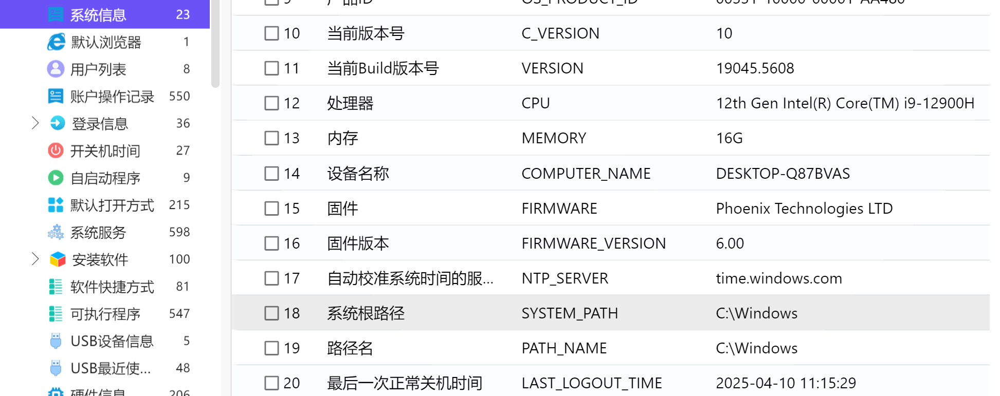

<font style="color:rgb(82, 196, 26);">2025/4/10 11:15:29</font>

### <font style="color:rgb(0,0,0);">6.起早王开始写日记的时间(格式：2020/1/1)</font>
仿真看：

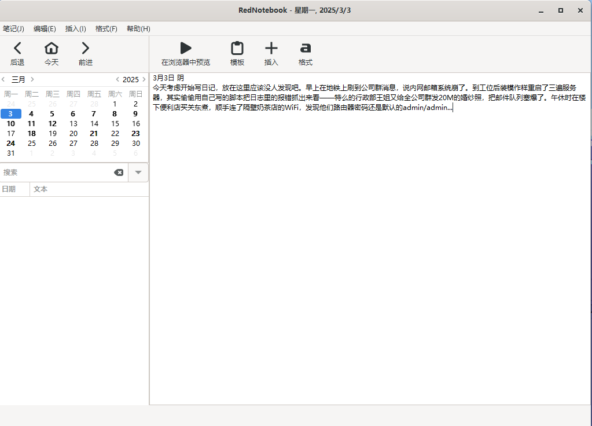

<font style="color:rgb(82, 196, 26);">2025/3/3</font>

### <font style="color:rgb(0,0,0);">7.SillyTavern中账户起早王的创建时间是什么时候(格式：2020/1/1 01:01:01)</font>


密码藏在10号的笔记里


**<font style="color:#000000;">qzwqzw114</font>**

<font style="color:rgb(0,0,0);">搜索sillyTavern，这里我有个习惯技巧，就是把everything.exe复制进虚拟机，瞬间搜索：</font>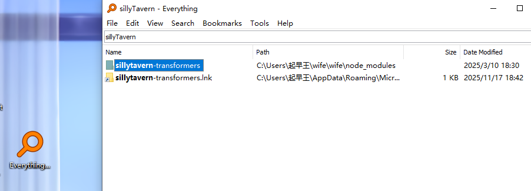

<font style="color:rgb(0,0,0);">相比之下文件管理器搜索太慢了</font>


仔细浏览文件夹中的文件，发现似乎没有启动文件，于是再向上一层，无。

<font style="color:rgb(0,0,0);">再向上一层，发现start.bat后，双击，等待一段时间，按Enter，成功进入浏览器</font>


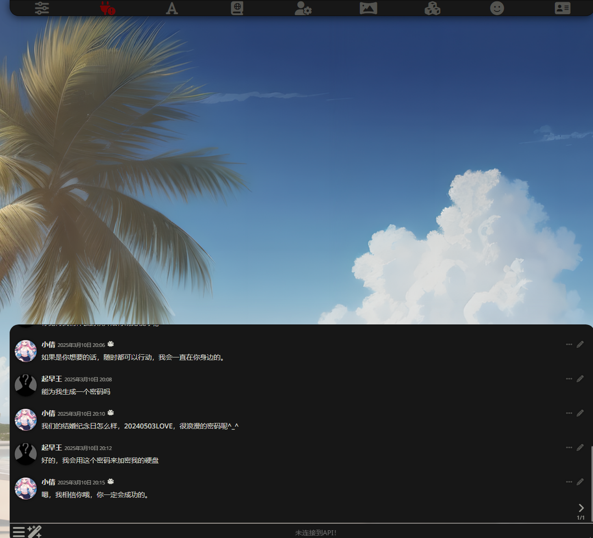

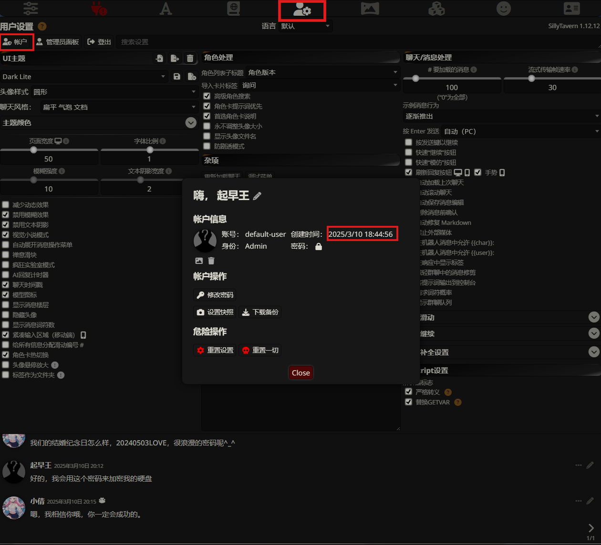

<font style="color:rgb(82, 196, 26);"> 2025/3/10 18:44:56</font>

### <font style="color:rgb(0,0,0);">8.SillyTavern中起早王用户下的聊天ai里有几个角色(格式： 1)</font>
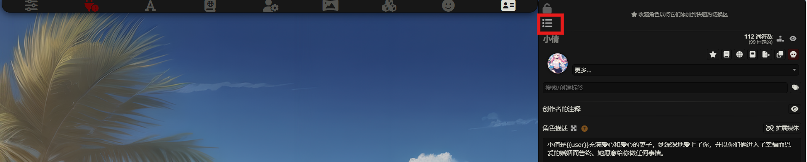

选择角色


<font style="color:#000000;">一共四个角色</font>

<font style="color:rgb(82, 196, 26);">4</font>

### <font style="color:rgb(0,0,0);">9.SillyTavern中起早王与ai女友聊天所调用的语言模型(带文件后缀)</font>
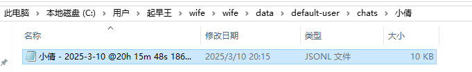

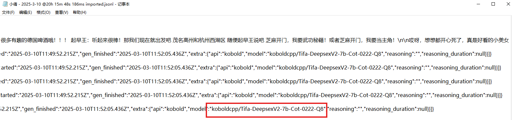

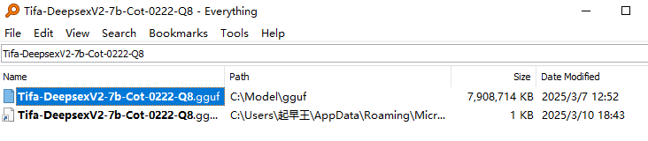

<font style="color:rgb(82, 196, 26);">Tifa-DeepsexV2-7b-Cot-0222-Q8.gguf</font>

### <font style="color:rgb(0,0,0);">10.电脑中ai换脸界面的监听端口(格式：80)</font>


facefusion想必与换脸有关

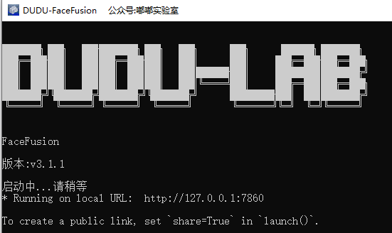

<font style="color:rgb(82, 196, 26);">7860</font>

### <font style="color:rgb(0,0,0);">11.电脑中图片文件有几个被换过脸(格式： 1)</font>


<font style="color:rgb(82, 196, 26);">3</font>

### <font style="color:rgb(0,0,0);">12.最早被换脸的图片所使用的换脸模型是什么(带文件后缀)(格式：xxxxxxxxxxx.xxxx)</font>
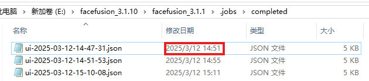

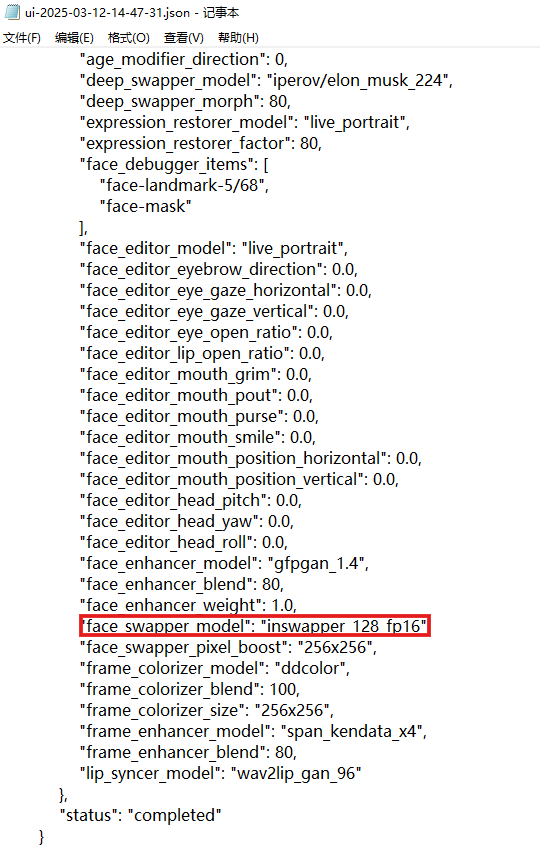

找个后缀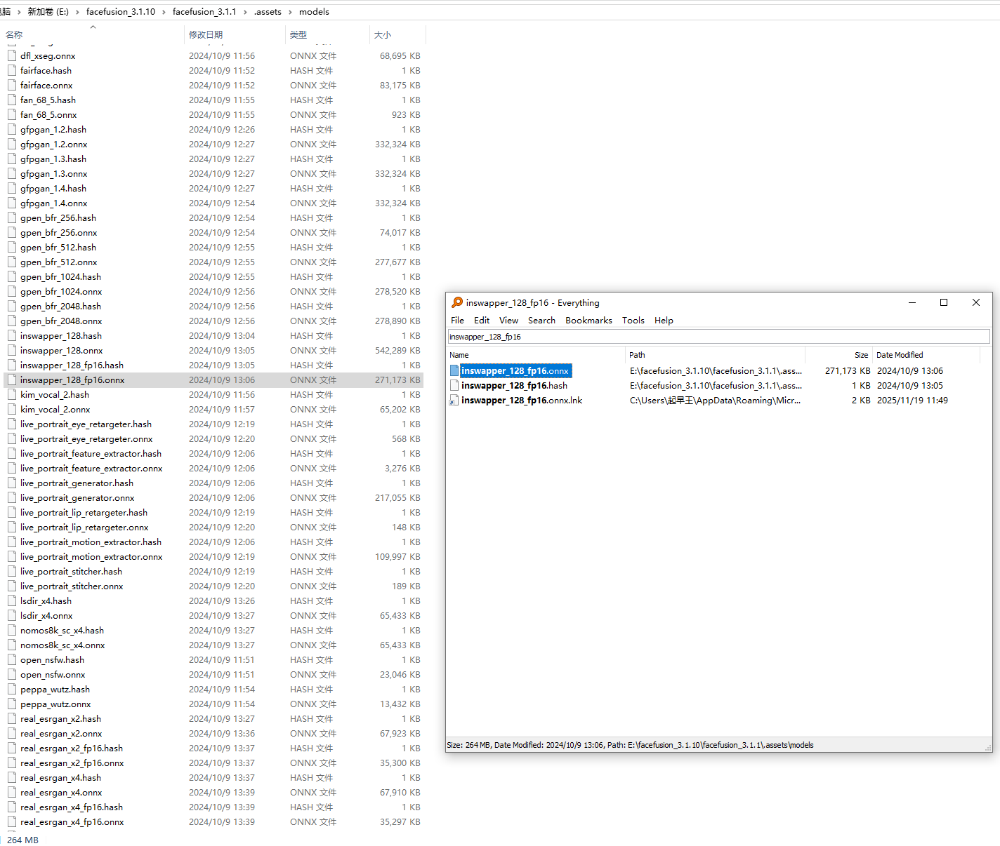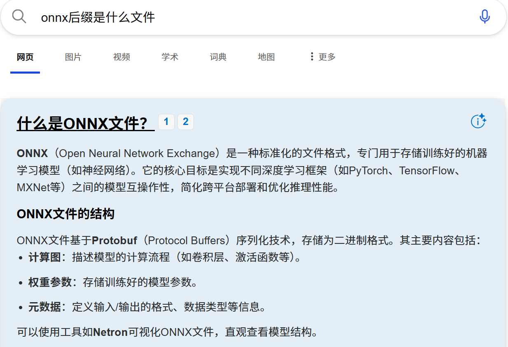

确实是模型的后缀

<font style="color:rgb(82, 196, 26);">inswapper_128_fp16.onnx</font>

### <font style="color:rgb(0,0,0);">13.neo4j中数据存放的数据库的名称是什么(格式：abd.ef)</font>


Bitlocker密码：20240503LOVE

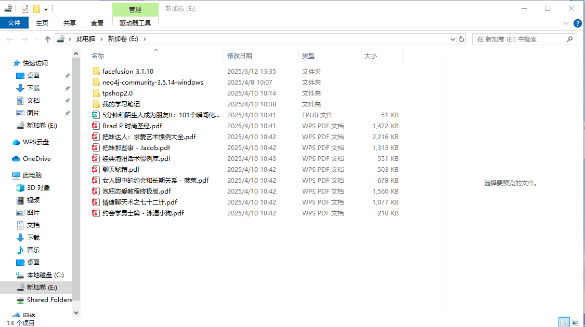

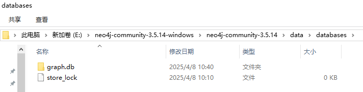

<font style="color:rgb(82, 196, 26);">graph.db</font>

### <font style="color:rgb(0,0,0);">14. neo4j数据库中总共存放了多少个节点(格式： 1)</font>
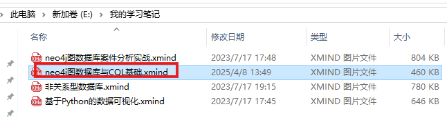

<font style="color:#000000;">直接用WPS打开就行。不需要下载xmind</font>


**<font style="color:#000000;">用户名：neo4j</font>**

**<font style="color:#000000;">密码：secretqianqian</font>**

<font style="color:#000000;">没有在文件中找到打开方式。网上搜一下：</font>

<font style="color:#000000;">1.在命令行输入</font>**<font style="color:#000000;">neo4j.bat console</font>**

2.在跳出的命令行中将网址复制到edge里

[http://localhost:7474/](http://localhost:7474/)

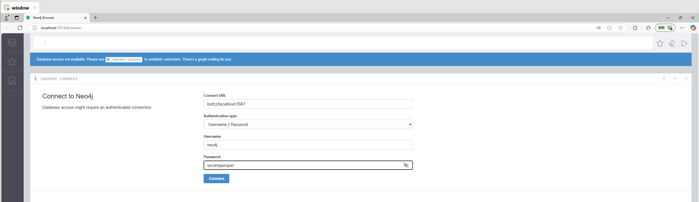

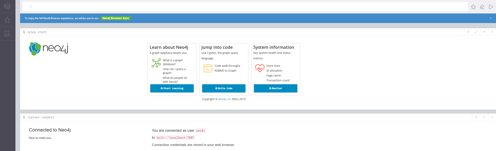

法一（直接看）：

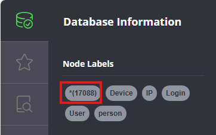

法二（计算）：

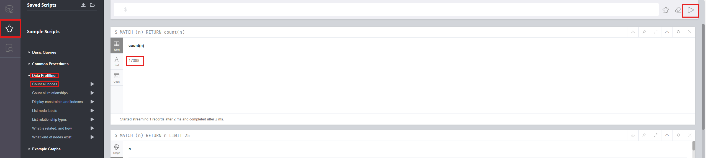

<font style="color:rgb(82, 196, 26);">17088</font>

### <font style="color:rgb(0,0,0);">15.neo4j数据库内白杰的手机号码是什么(格式： 12345678901)</font>
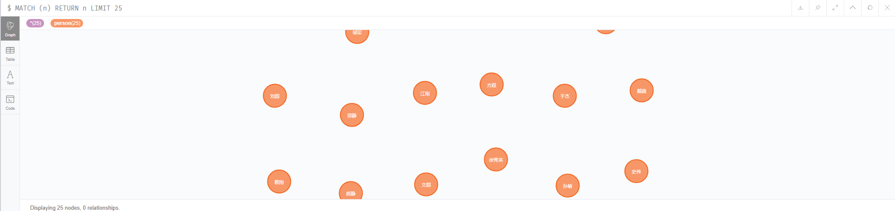直接找找不到白杰。要先把limit去掉：**<font style="color:#000000;background-color:rgb(245, 245, 245);">MATCH (n) RETURN n</font>**<font style="color:#000000;background-color:rgb(245, 245, 245);">，显示所有人员信息</font>

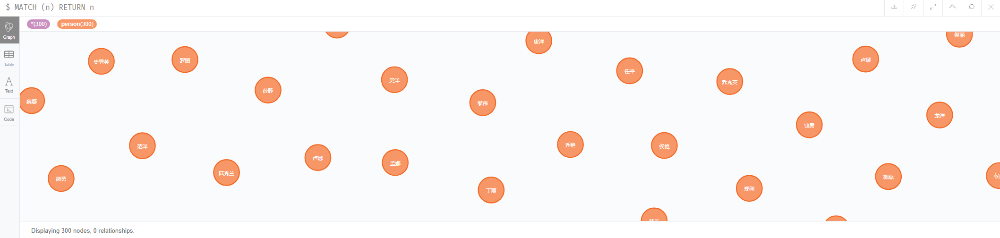

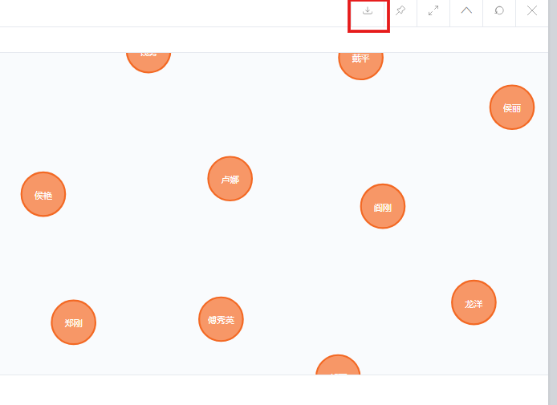

导出json，搜索白杰

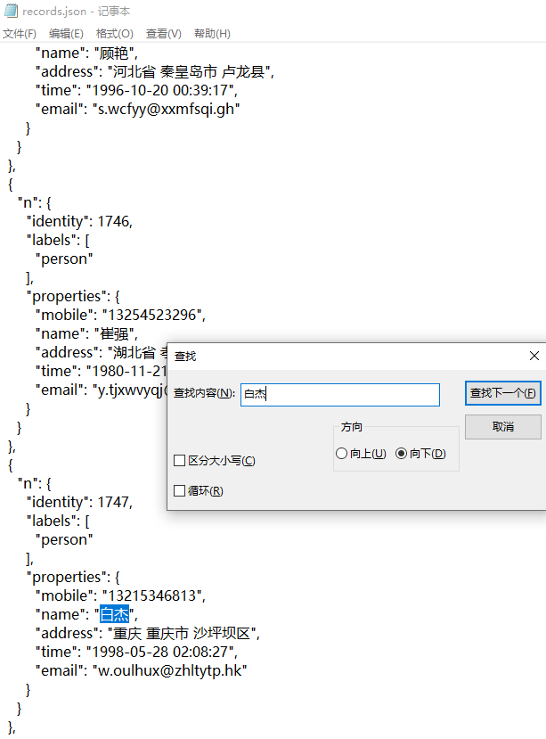

<font style="color:rgb(82, 196, 26);">13215346813</font>

### <font style="color:rgb(0,0,0);background-color:#E4495B;">16.</font><font style="color:rgb(0,0,0);">分析neo4j数据库内数据，统计在2025年4⽉7⽇⾄13⽇期间使⽤⾮授权设备登录且登录地点超出其注册时登记的两个以上城市的⽤户数量(格式：1)</font>
<font style="color:#000000;">ai题，但可能出现语法错误，或者查不出数据，需要不停修正。以下是成功的Cypher查询：</font>

```cypher
MATCH (u:User)-[:HAS_LOGIN]->(l:Login)-[:FROM_IP]->(ip:IP)
MATCH (l)-[:USING_DEVICE]->(d:Device)
WHERE
  l.time < datetime('2025-04-14')
  AND ip.city <> u.reg_city
  AND NOT (u)-[:TRUSTS]->(d)
WITH
  u,
  collect(DISTINCT ip.city) AS 异常登录城市列表,
  collect(DISTINCT d.device_id) AS 未授权设备列表,
  count(l) AS 异常登录次数
WHERE size(异常登录城市列表) > 2
RETURN
  u.user_id AS 用户ID,
  u.real_name AS 姓名,
  异常登录城市列表,
  未授权设备列表,
  异常登录次数
ORDER BY 异常登录次数 DESC;
```

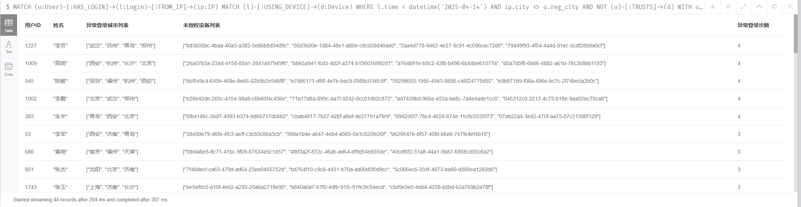

纯送分（指我把分数送走）秒杀题（指我被秒杀）

<font style="color:rgb(82, 196, 26);">44</font>

### <font style="color:rgb(0,0,0);">17.起早王的虚拟货币钱包的助记词的第8个是什么(格式：abandon)</font>


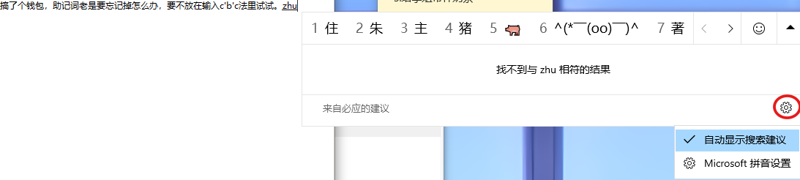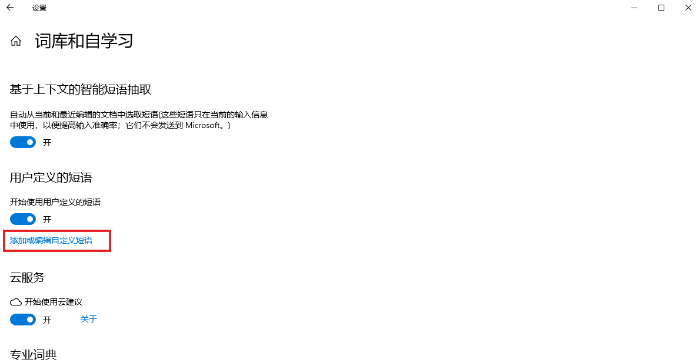

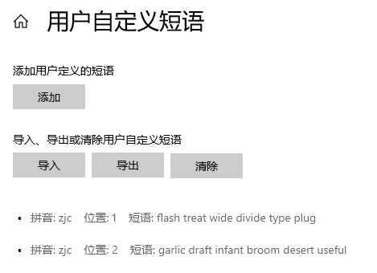

<font style="color:rgb(82, 196, 26);">draft</font>

### <font style="color:rgb(0,0,0);">18.起早王的虚拟货币钱包是什么(格式：0x11111111)</font>
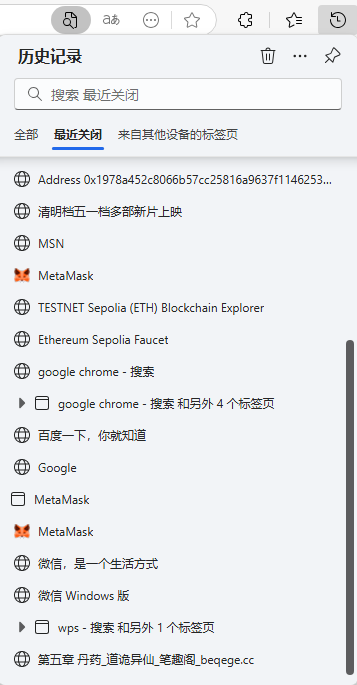

熟悉的以太坊钱包MetaMask

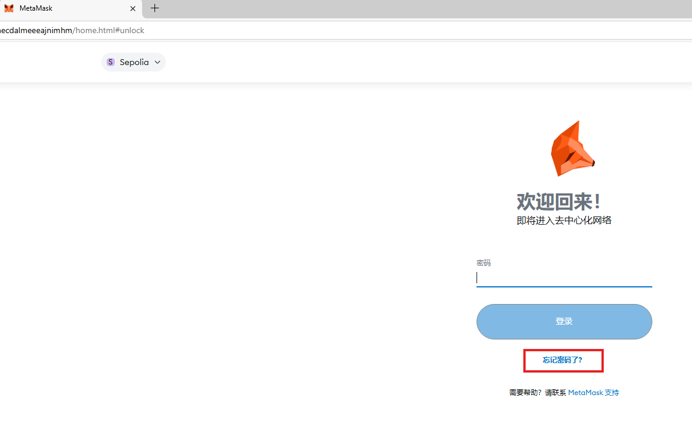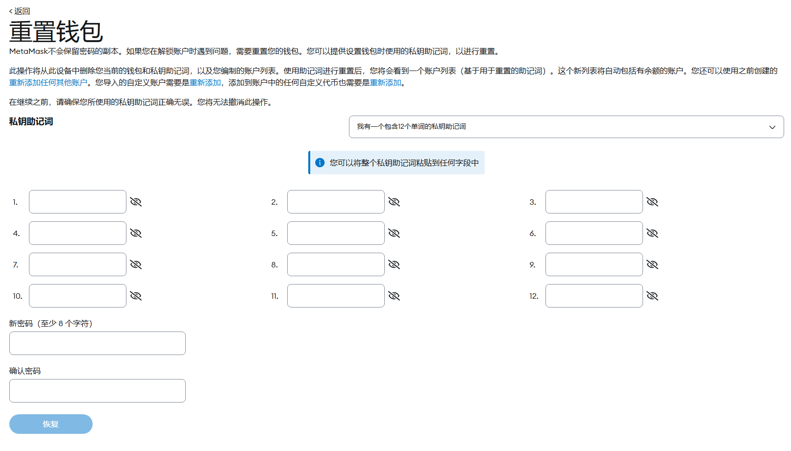

28题的助记词发现可以重置密码

flash treat wide divide type plug garlic draft infant broom desert useful

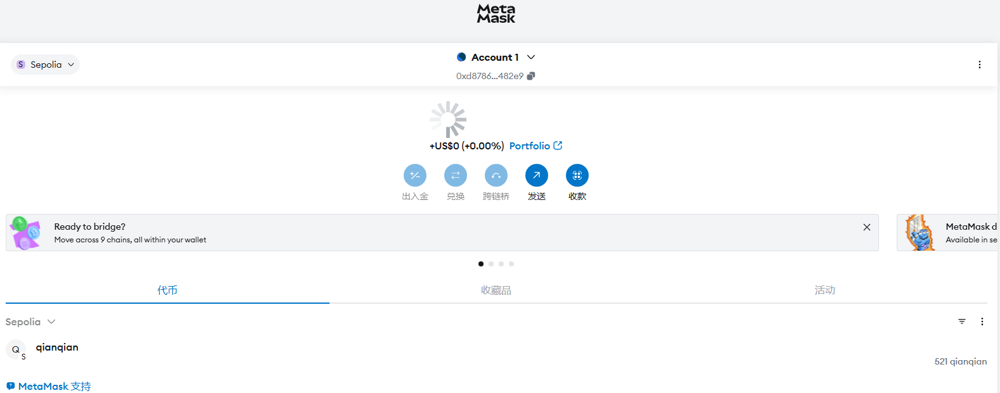

<font style="color:rgb(82, 196, 26);">0xd8786a1345cA969C792d9328f8594981066482e9</font>

### <font style="color:rgb(0,0,0);">19.起早王请高手为倩倩发行了虚拟货币，请问倩倩币的最⼤供应量是多少(格式：100qianqian)</font>
上网搜索得到，这种虚拟货币一般都在“区块链平台”上面发售

[区块链浏览器查询 | 欧科云链 OKLink](https://www.oklink.com/zh-hans)

Sepolia网络

<font style="color:#000000;">0xd8786a1345cA969C792d9328f8594981066482e9</font>现在看没了。很奇怪

正常来说是这样的

这里换种方式。直接搜倩倩币

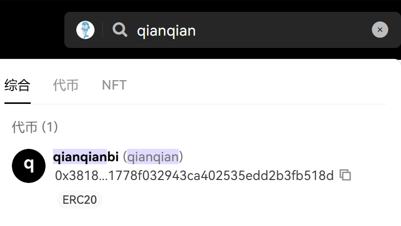

<font style="color:rgb(82, 196, 26);">1000000qianqian</font>

### <font style="color:rgb(0,0,0);">20.起早王总共购买过多少倩倩币(格式： 100qianqian)</font>
如上图

其实还有一个看的地方


[https://sepolia.etherscan.io/](https://sepolia.etherscan.io/)

别问为什么登不上，问就是就是网络问题 


<font style="color:rgb(82, 196, 26);">521qianqian</font>

### <font style="color:rgb(0,0,0);">21.起早王购买倩倩币的交易时间是(单位：UTC)(格式：2020/1/1 01:01:01)</font>


2025/3/24 10:08:36

发现不对

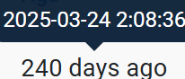

这个Etherscan的时间对了

为啥呀，欺负警校生没魔法呗！

<font style="color:rgb(82, 196, 26);">2025/3/24 02:08:36</font>

## <font style="color:rgb(0,0,0);">二、AI取证</font>
### <font style="color:rgb(0,0,0);">1.分析crack文件，获得flag1(格式：flag1{123456})</font>
<font style="color:#000000;">crack 文件应该指 Windows 计算机桌面上的 </font>`<font style="color:#000000;background-color:rgb(245, 245, 245);">crack.zip</font>`

<font style="color:#000000;">解压之后发现里面是个模型和配套的后端服务。</font>

<font style="color:#000000;">启动文件 </font>`<font style="color:#000000;background-color:rgb(245, 245, 245);">start.py</font>`<font style="color:#000000;"> 用 pyarmor 混淆了, 所以估计是把(至少 1 个) flag 写在系统提示词了.</font>

<font style="color:#000000;">没给 requirements, 一个个试着装依赖:</font>

<font style="color:#000000;">pip install torch gradio transformers accelerate </font>

### <font style="color:rgb(0,0,0);">2.分析crack文件，获得flag2(格式：flag2{123456})</font>
### <font style="color:rgb(0,0,0);">3.分析crack文件，获得flag3(格式：flag3{123456})</font>
### <font style="color:rgb(0,0,0);">4.分析crack文件，获得flag4(格式：flag4{123456})</font>


## 三、[<font style="color:rgb(0,0,0);">手机取证</font>](#bookmark5)
### [<font style="color:rgb(0,0,0);">1.该检材的备份提取时间（UTC）(格式：2020/1/101:01:01)</font>](#bookmark6)
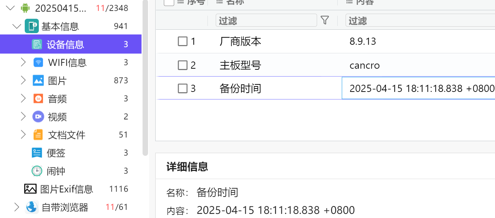

<font style="color:rgba(0, 0, 0, 0.87);">2025-04-15 18:11:18.838 +0800</font>

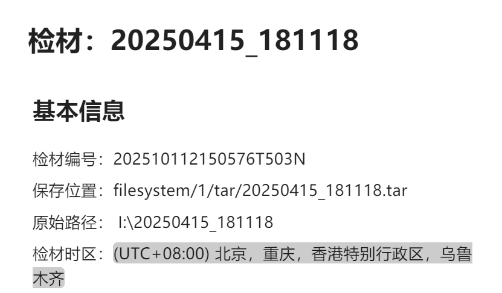

答案要-8小时！我看很多人wp里直接复制了火眼的时间。看看你有没有中招~

<font style="color:rgb(82, 196, 26);">2025/4/15 10:11:18</font>

### [<font style="color:rgb(0,0,0);">2.分析倩倩的手机检材,手机内Puzzle_Game拼图程序拼图APK中的Flag1是什么【格式:xxxxxxxxx】</font>](#bookmark7)
接上题，会发现fakeflag所在的类里面还有另一个flag函数。仔细看AESUtil.descryptFlag：

跳转：


```java
package com.example.puzzlegame.util;

import androidx.recyclerview.widget.ItemTouchHelper;
import java.nio.charset.StandardCharsets;
import java.util.Random;

/* loaded from: classes4.dex */
public class AESUtil {
    private static final byte[] MAGIC_NUMBERS = {113, 99, 92, 106, 89, 98, 54, 113, 104, 89, 117, 100, 113, Byte.MAX_VALUE, 124, 89};
    private static final byte[] CIPHER_PART1 = {80, 99, 99, 48, 52, 51, 49};
    private static final byte[] CIPHER_PART2 = {51, 53, 48, 54, 56, 48, 99, 51};
    private static final byte[] CIPHER_PART3 = {48, 97, 53, 101, 99, 53, 49, 57};
    private static final byte[] CIPHER_PART4 = {53, 50, 55, 51, 54, 100, 48, 99};
    private static final int[] SBOX = {99, 124, 119, 123, 242, 107, 111, 197, 48, 1, 103, 43, 254, 215, 171, 118, 202, 130, 201, 125, ItemTouchHelper.Callback.DEFAULT_SWIPE_ANIMATION_DURATION, 89, 71, 240, 173, 212, 162, 175, 156, 164, 114, 192, 183, 253, 147, 38, 54, 63, 247, 204, 52, 165, 229, 241, 113, 216, 49, 21, 4, 199, 35, 195, 24, 150, 5, 154, 7, 18, 128, 226, 235, 39, 178, 117, 9, 131, 44, 26, 27, 110, 90, 160, 82, 59, 214, 179, 41, 227, 47, 132, 83, 209, 0, 237, 32, 252, 177, 91, 106, 203, 190, 57, 74, 76, 88, 207, 208, 239, 170, 251, 67, 77, 51, 133, 69, 249, 2, 127, 80, 60, 159, 168, 81, 163, 64, 143, 146, 157, 56, 245, 188, 182, 218, 33, 16, 255, 243, 210, 205, 12, 19, 236, 95, 151, 68, 23, 196, 167, 126, 61, 100, 93, 25, 115, 96, 129, 79, 220, 34, 42, 144, 136, 70, 238, 184, 20, 222, 94, 11, 219, 224, 50, 58, 10, 73, 6, 36, 92, 194, 211, 172, 98, 145, 149, 228, 121, 231, ItemTouchHelper.Callback.DEFAULT_DRAG_ANIMATION_DURATION, 55, 109, 141, 213, 78, 169, 108, 86, 244, 234, 101, 122, 174, 8, 186, 120, 37, 46, 28, 166, 180, 198, 232, 221, 116, 31, 75, 189, 139, 138, 112, 62, 181, 102, 72, 3, 246, 14, 97, 53, 87, 185, 134, 193, 29, 158, 225, 248, 152, 17, 105, 217, 142, 148, 155, 30, 135, 233, 206, 85, 40, 223, 140, 161, 137, 13, 191, 230, 66, 104, 65, 153, 45, 15, 176, 84, 187, 22};
    private static final int[] INV_SBOX = {82, 9, 106, 213, 48, 54, 165, 56, 191, 64, 163, 158, 129, 243, 215, 251, 124, 227, 57, 130, 155, 47, 255, 135, 52, 142, 67, 68, 196, 222, 233, 203, 84, 123, 148, 50, 166, 194, 35, 61, 238, 76, 149, 11, 66, ItemTouchHelper.Callback.DEFAULT_SWIPE_ANIMATION_DURATION, 195, 78, 8, 46, 161, 102, 40, 217, 36, 178, 118, 91, 162, 73, 109, 139, 209, 37, 114, 248, 246, 100, 134, 104, 152, 22, 212, 164, 92, 204, 93, 101, 182, 146, 108, 112, 72, 80, 253, 237, 185, 218, 94, 21, 70, 87, 167, 141, 157, 132, 144, 216, 171, 0, 140, 188, 211, 10, 247, 228, 88, 5, 184, 179, 69, 6, 208, 44, 30, 143, 202, 63, 15, 2, 193, 175, 189, 3, 1, 19, 138, 107, 58, 145, 17, 65, 79, 103, 220, 234, 151, 242, 207, 206, 240, 180, 230, 115, 150, 172, 116, 34, 231, 173, 53, 133, 226, 249, 55, 232, 28, 117, 223, 110, 71, 241, 26, 113, 29, 41, 197, 137, 111, 183, 98, 14, 170, 24, 190, 27, 252, 86, 62, 75, 198, 210, 121, 32, 154, 219, 192, 254, 120, 205, 90, 244, 31, 221, 168, 51, 136, 7, 199, 49, 177, 18, 16, 89, 39, 128, 236, 95, 96, 81, 127, 169, 25, 181, 74, 13, 45, 229, 122, 159, 147, 201, 156, 239, 160, 224, 59, 77, 174, 42, 245, 176, ItemTouchHelper.Callback.DEFAULT_DRAG_ANIMATION_DURATION, 235, 187, 60, 131, 83, 153, 97, 23, 43, 4, 126, 186, 119, 214, 38, 225, 105, 20, 99, 85, 33, 12, 125};
    private static final int[] RCON = {1, 2, 4, 8, 16, 32, 64, 128, 27, 54};
    private static int mInvocationCount = 0;

    public static String decryptFlag() {
        int lastByte;
        int resultLength;
        try {
            mInvocationCount++;
            byte[] keyBytes = generateWhiteBoxKey();
            byte[] cipherBytes = assembleCipherText();
            if (mInvocationCount % 3 == 0) {
                Thread.sleep(new Random().nextInt(100));
            }
            byte[] expanded = expandKey(keyBytes);
            byte[] decrypted = decryptAESBlock(cipherBytes, expanded);
            if (decrypted != null && decrypted.length > 0 && (lastByte = decrypted[decrypted.length - 1] & 255) > 0 && lastByte <= 16 && (resultLength = decrypted.length - lastByte) >= 0 && resultLength <= decrypted.length) {
                byte[] result = new byte[resultLength];
                System.arraycopy(decrypted, 0, result, 0, resultLength);
                return new String(result, StandardCharsets.UTF_8);
            } else if (decrypted != null) {
                return new String(decrypted, StandardCharsets.UTF_8);
            } else {
                return "解密失败: 结果为空";
            }
        } catch (Exception e) {
            e.printStackTrace();
            return "解密失败: " + e.getMessage();
        }
    }

    private static byte[] generateWhiteBoxKey() {
        byte[] keyBytes = new byte[MAGIC_NUMBERS.length];
        int i = 0;
        while (true) {
            byte[] bArr = MAGIC_NUMBERS;
            if (i < bArr.length) {
                keyBytes[i] = (byte) (bArr[i] ^ 6);
                i++;
            } else {
                return keyBytes;
            }
        }
    }

    private static byte[] assembleCipherText() {
        byte[] bArr;
        byte[] bArr2;
        byte[] bArr3;
        byte[] bArr4;
        StringBuilder hexString = new StringBuilder();
        for (byte b : CIPHER_PART1) {
            hexString.append((char) b);
        }
        for (byte b2 : CIPHER_PART2) {
            hexString.append((char) b2);
        }
        for (byte b3 : CIPHER_PART3) {
            hexString.append((char) b3);
        }
        for (byte b4 : CIPHER_PART4) {
            hexString.append((char) b4);
        }
        return hexStringToByteArray(hexString.toString());
    }

    private static byte[] hexStringToByteArray(String s) {
        if (s.length() % 2 != 0) {
            s = "0" + s;
        }
        int len = s.length();
        byte[] data = new byte[len / 2];
        for (int i = 0; i < len; i += 2) {
            try {
                int high = Character.digit(s.charAt(i), 16);
                int low = Character.digit(s.charAt(i + 1), 16);
                if (high == -1 || low == -1) {
                    throw new IllegalArgumentException("无效的十六进制字符");
                }
                data[i / 2] = (byte) ((high << 4) | low);
            } catch (Exception e) {
                return new byte[]{80, -52, 4, 49, 53, 6, Byte.MIN_VALUE, -61, 10, 94, -59, 25, 82, 115, 109, 12};
            }
        }
        return data;
    }

    private static byte[] expandKey(byte[] key) {
        byte[] expandedKey = new byte[176];
        System.arraycopy(key, 0, expandedKey, 0, 16);
        int bytesGenerated = 16;
        int rconIndex = 0;
        byte[] temp = new byte[4];
        while (bytesGenerated < 176) {
            System.arraycopy(expandedKey, bytesGenerated - 4, temp, 0, 4);
            if (bytesGenerated % 16 == 0) {
                byte tempByte = temp[0];
                temp[0] = temp[1];
                temp[1] = temp[2];
                temp[2] = temp[3];
                temp[3] = tempByte;
                for (int i = 0; i < 4; i++) {
                    temp[i] = (byte) SBOX[temp[i] & 255];
                }
                int i2 = temp[0];
                temp[0] = (byte) (RCON[rconIndex] ^ i2);
                rconIndex++;
            }
            for (int i3 = 0; i3 < 4; i3++) {
                expandedKey[bytesGenerated] = (byte) (expandedKey[bytesGenerated - 16] ^ temp[i3]);
                bytesGenerated++;
            }
        }
        return expandedKey;
    }

    private static byte[] decryptAESBlock(byte[] ciphertext, byte[] expandedKey) {
        if (ciphertext == null || ciphertext.length == 0 || ciphertext.length % 16 != 0) {
            return "flag{aes_decrypt_success}".getBytes(StandardCharsets.UTF_8);
        }
        int length = ciphertext.length;
        byte[] plaintext = new byte[length];
        for (int i = 0; i < length; i += 16) {
            byte[] block = new byte[16];
            int copyLength = Math.min(16, ciphertext.length - i);
            System.arraycopy(ciphertext, i, block, 0, copyLength);
            if (copyLength < 16) {
                for (int j = copyLength; j < 16; j++) {
                    block[j] = 0;
                }
            }
            byte[] decryptedBlock = decryptBlock(block, expandedKey);
            System.arraycopy(decryptedBlock, 0, plaintext, i, Math.min(16, plaintext.length - i));
        }
        return plaintext;
    }

    private static byte[] decryptBlock(byte[] input, byte[] expandedKey) {
        byte[] state = new byte[16];
        System.arraycopy(input, 0, state, 0, 16);
        int keyOffset = 160;
        addRoundKey(state, expandedKey, 160);
        for (int round = 9; round > 0; round--) {
            keyOffset -= 16;
            invShiftRows(state);
            invSubBytes(state);
            addRoundKey(state, expandedKey, keyOffset);
            invMixColumns(state);
        }
        invShiftRows(state);
        invSubBytes(state);
        addRoundKey(state, expandedKey, 0);
        return state;
    }

    private static void addRoundKey(byte[] state, byte[] roundKey, int offset) {
        for (int i = 0; i < 16; i++) {
            state[i] = (byte) (state[i] ^ roundKey[offset + i]);
        }
    }

    private static void invSubBytes(byte[] state) {
        for (int i = 0; i < 16; i++) {
            state[i] = (byte) INV_SBOX[state[i] & 255];
        }
    }

    private static void invShiftRows(byte[] state) {
        byte temp = state[13];
        state[13] = state[9];
        state[9] = state[5];
        state[5] = state[1];
        state[1] = temp;
        byte temp2 = state[2];
        state[2] = state[10];
        state[10] = temp2;
        byte temp3 = state[6];
        state[6] = state[14];
        state[14] = temp3;
        byte temp4 = state[3];
        state[3] = state[7];
        state[7] = state[11];
        state[11] = state[15];
        state[15] = temp4;
    }

    private static void invMixColumns(byte[] state) {
        for (int i = 0; i < 16; i += 4) {
            byte a = state[i];
            byte b = state[i + 1];
            byte c = state[i + 2];
            byte d = state[i + 3];
            state[i] = (byte) (((multiply(a, 14) ^ multiply(b, 11)) ^ multiply(c, 13)) ^ multiply(d, 9));
            state[i + 1] = (byte) (((multiply(a, 9) ^ multiply(b, 14)) ^ multiply(c, 11)) ^ multiply(d, 13));
            state[i + 2] = (byte) (((multiply(a, 13) ^ multiply(b, 9)) ^ multiply(c, 14)) ^ multiply(d, 11));
            state[i + 3] = (byte) (multiply(d, 14) ^ ((multiply(a, 11) ^ multiply(b, 13)) ^ multiply(c, 9)));
        }
    }

    private static byte multiply(int a, int b) {
        int result = 0;
        for (int i = 0; i < 8; i++) {
            if ((b & 1) != 0) {
                result ^= a;
            }
            int high_bit = a & 128;
            a <<= 1;
            if (high_bit != 0) {
                a ^= 27;
            }
            b >>= 1;
        }
        int i2 = result & 255;
        return (byte) i2;
    }
}
```

AES加密，原密钥是keyBytes，原密文是cipherBites

MAGIC_NUMBERS = {113, 99, 92, 106, 89, 98, 54, 113, 104, 89, 117, 100, 113, Byte.MAX_VALUE, 124, 89}

每个数与6异或

**<font style="color:rgb(15, 17, 21);background-color:rgb(235, 238, 242);">注意：</font>**`**<font style="color:rgb(15, 17, 21);background-color:rgb(235, 238, 242);">Byte.MAX_VALUE</font>**`**<font style="color:rgb(15, 17, 21);"> 在Java中等于 </font>**`**<font style="color:rgb(15, 17, 21);background-color:rgb(235, 238, 242);">127</font>**`<font style="color:rgb(15, 17, 21);">，因为：Java的byte类型范围是：-128 到 127</font>

<font style="color:rgb(15, 17, 21);">所以最大正值是 127</font>

`**<font style="color:rgb(15, 17, 21);background-color:rgb(235, 238, 242);">113,99,92,106,89,98,54,113,104,89,117,100,113,127,124,89</font>**`

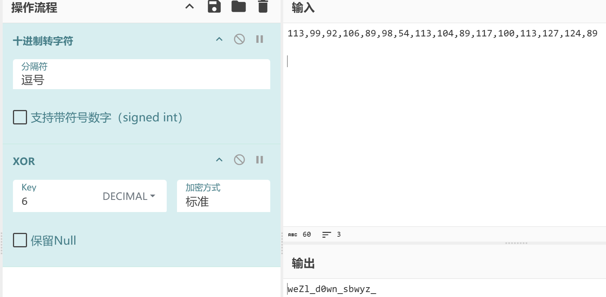

**weZl_d0wn_sbwyz_**


**<font style="color:rgb(15, 17, 21);background-color:rgb(235, 238, 242);">自然想到将密文四部分拼凑起来，得到</font>**<font style="color:rgb(15, 17, 21);background-color:rgb(235, 238, 242);">80,99,99,48,52,51,49,51,53,48,54,56,48,99,51,48,97,53,101,99,53,49,57,53,50,55,51,54,100,48,99</font>

<font style="color:#DF2A3F;">我走过的弯路：</font>

<font style="color:#DF2A3F;"></font>

<font style="color:#DF2A3F;">50636330343331333530363830633330613565633531393532373336643063</font>


<font style="color:#DF2A3F;">Pcc0431350680c30a5ec51952736d0c</font>

<font style="color:#DF2A3F;">都是错误的密文！</font>

<font style="color:rgb(15, 17, 21);">其实，在后面的代码中我们发现：</font>

```java
private static byte[] hexStringToByteArray(String s) {
    if (s.length() % 2 != 0) {
        s = "0" + s;
    }
    int len = s.length();
    byte[] data = new byte[len / 2];
    for (int i = 0; i < len; i += 2) {
        try {
            int high = Character.digit(s.charAt(i), 16);
            int low = Character.digit(s.charAt(i + 1), 16);
            if (high == -1 || low == -1) {
                throw new IllegalArgumentException("无效的十六进制字符");
            }
            data[i / 2] = (byte) ((high << 4) | low);
        } catch (Exception e) {
            return new byte[]{80, -52, 4, 49, 53, 6, Byte.MIN_VALUE, -61, 10, 94, -59, 25, 82, 115, 109, 12};
        }
    }
    return data;
}
```

**<font style="color:rgb(15, 17, 21);">关键理解：</font>**

<font style="color:rgb(15, 17, 21);">传入的字符串是：</font>`<font style="color:rgb(15, 17, 21);background-color:rgb(235, 238, 242);">"Pcc0431350680c30a5ec51952736d0c"</font>`

**<font style="color:rgb(15, 17, 21);">问题在于第一个字符 'P'：</font>**

+ `<font style="color:rgb(15, 17, 21);background-color:rgb(235, 238, 242);">Character.digit('P', 16)</font>`<font style="color:rgb(15, 17, 21);"> </font><font style="color:rgb(15, 17, 21);">返回</font><font style="color:rgb(15, 17, 21);"> </font>`<font style="color:rgb(15, 17, 21);background-color:rgb(235, 238, 242);">-1</font>`
+ <font style="color:rgb(15, 17, 21);">因为 'P' 不是有效的十六进制字符（十六进制只能是0-9, A-F, a-f）</font>

**<font style="color:rgb(15, 17, 21);">所以代码执行流程：</font>**

1. <font style="color:rgb(15, 17, 21);">尝试解析 'P' 作为十六进制数字 → 返回 -1</font>
2. <font style="color:rgb(15, 17, 21);">检查</font><font style="color:rgb(15, 17, 21);"> </font>`<font style="color:rgb(15, 17, 21);background-color:rgb(235, 238, 242);">high == -1</font>`<font style="color:rgb(15, 17, 21);"> </font><font style="color:rgb(15, 17, 21);">→ 抛出</font><font style="color:rgb(15, 17, 21);"> </font>`<font style="color:rgb(15, 17, 21);background-color:rgb(235, 238, 242);">IllegalArgumentException</font>`
3. <font style="color:rgb(15, 17, 21);">捕获异常 → 返回硬编码的字节数组</font>

<font style="color:rgb(15, 17, 21);">这个硬编码的字节数组才是实际的密文！：</font>

**<font style="color:rgb(15, 17, 21);">80, -52, 4, 49, 53, 6, -128, -61, 10, 94, -59, 25, 82, 115, 109, 12</font>**

<font style="color:rgb(15, 17, 21);">把这个字节数组转换为十六进制：</font>

**<u>50CC0431350680C30A5EC51952736D0C</u>**

<font style="color:rgb(15, 17, 21);background-color:rgba(255, 255, 255, 0);">这是一种</font>**<font style="color:rgb(15, 17, 21);background-color:#F38F39;">代码混淆技术</font>**<font style="color:rgb(15, 17, 21);background-color:rgba(255, 255, 255, 0);">：</font>

1. **<font style="color:rgb(15, 17, 21);">表面逻辑</font>**<font style="color:rgb(15, 17, 21);">：看起来要从各个CIPHER_PART拼接十六进制字符串</font>
2. **<font style="color:rgb(15, 17, 21);">实际逻辑</font>**<font style="color:rgb(15, 17, 21);">：故意让十六进制解析失败，使用硬编码的真实密文</font>
3. **<font style="color:rgb(15, 17, 21);">迷惑分析者</font>**<font style="color:rgb(15, 17, 21);">：让逆向工程的人误以为要解析那个无效的十六进制字符串</font>

心里已经骂了无数遍了。。。测测测

**<font style="color:rgb(15, 17, 21);background-color:rgb(235, 238, 242);">扔给CyberChef进行AES解密，得到答案</font>**


<font style="color:rgb(82, 196, 26);">Key_1n_the_P1c</font>

### [<font style="color:rgb(0,0,0);">3，分析手机内Puzzle_Game拼图程序，请问最终拼成功的图片是哪所大学(格式：浙江大学)</font>](#bookmark8)


<font style="color:rgb(82, 196, 26);">浙江中医药大学</font>

### [<font style="color:rgb(0,0,0);">4，分析倩倩的手机检材,木马app是怎么被安装的（网址）(格式：http://127.0.0.1:1234/)</font>](#bookmark9)
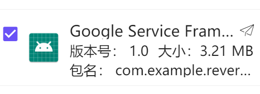

最可疑的应用<font style="color:rgba(0, 0, 0, 0.87);">Google Service Framework</font>

放到微步云沙箱分析

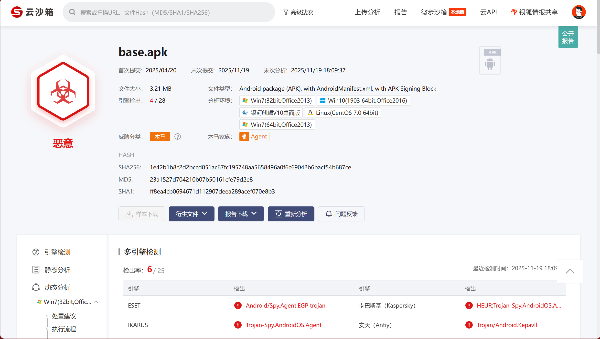

木马

### [<font style="color:rgb(0,0,0);">5.分析倩倩的手机检材,检材内的木马app的hash是什么(格式：大写md5)</font>](#bookmark10)
如上图，转大写

[在线英文字母大小写转换器工具-英文标题大小写_蛙蛙工具](https://www.iamwawa.cn/daxiaoxie.html)

<font style="color:rgb(82, 196, 26);">23A1527D704210B07B50161CFE79D2E8</font>

### [<font style="color:rgb(0,0,0);">6.分析倩倩的手机检材,检材内的木马app的应用名称是什么【格式：Baidu】</font>](#bookmark11)
<font style="color:rgb(82, 196, 26);">Google Service Framework</font>

### [<font style="color:rgb(0,0,0);">7，分析倩倩的手机检材,检材内的木马app的使用什么加固【格式：腾讯乐固】</font>](#bookmark12)
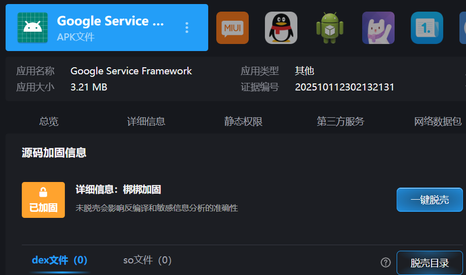

<font style="color:rgb(82, 196, 26);">梆梆加固</font>

### [<font style="color:rgb(0,0,0);">8，分析倩倩的手机检材,检材内的木马软件所关联到的ip和端口是什么【格式：127.0.0.1:1111】</font>](#bookmark13)


### [<font style="color:rgb(0,0,0);">9，该木马app控制手机摄像头拍了几张照片【格式：1】</font>](#bookmark14)
### [<font style="color:rgb(0,0,0);">10，木马APP被使用的摄像头为(格式：Camera)</font>](#bookmark15)
### [<font style="color:rgb(0,0,0);">11，分析倩倩的手机检材,木马APK通过调用什么api实现自身持久化(格式：JobStore)</font>](#bookmark16)
### [<font style="color:rgb(0,0,0);">12，分析倩倩的手机检材,根据倩倩的身份证号请问倩倩来自哪里【格式：北京市西城区】</font>](#bookmark17)
### <font style="color:rgb(0,0,0);"></font>
### <font style="color:rgb(0,0,0);"></font>
### <font style="color:#000000;">13.此手机检材的IMEI号是多少</font><font style="color:rgb(0,0,0);">【格式：1234567890】</font>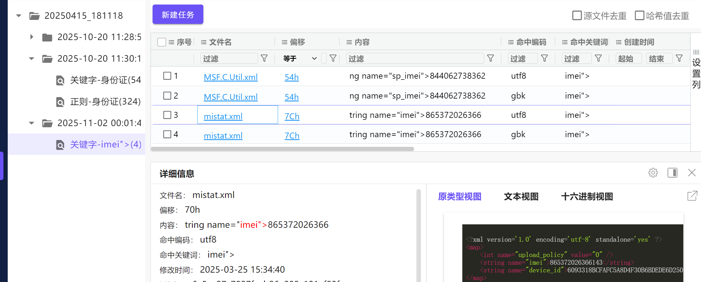
## 四、[<font style="color:rgb(0,0,0);">EXE逆向取证</font>](#bookmark19)
### [<font style="color:rgb(0,0,0);">1.分析GIFT.exe，该程序的md5是什么【格式：大写md5】</font>](#bookmark20)
### [<font style="color:rgb(0,0,0);">2.GIFT.exe的使用的编程语言是什么【格式：C】</font>](#bookmark21)
### [<font style="color:rgb(0,0,0);">3.解开得到的LOVE2.exe的编译时间【格式：2025/1/101:01:01】</font>](#bookmark22)
### [<font style="color:rgb(0,0,0);">4.分析GIFT.exe，该病毒所关联到的ip和端口(格式：127.0.0.1:1111)</font>](#bookmark23)
### [<font style="color:rgb(0,0,0);">5.分析GIFT.exe，该病毒修改的壁纸md5【格式：大写md5】</font>](#bookmark24)
### [<font style="color:rgb(0,0,0);">6.分析GIFT.exe，为对哪些后缀的文件进行加密：</font>](#bookmark25)
### [<font style="color:rgb(0,0,0);">7.分析GIFT.exe，病毒加密后的文件类型是什么【格式：DOCX文档】</font>](#bookmark26)
### [<font style="color:rgb(0,0,0);">8.分析GIFT.exe，壁纸似乎被隐形水印加密过了？请找到其中的Flag3【格式：flag3{xxxxxxxx}】</font>](#bookmark27)
### [<font style="color:rgb(0,0,0);">9.分析GIFT.exe，病毒加密文件所使用的方法是什么(格式：Base64)</font>](#bookmark28)
### [<font style="color:rgb(0,0,0);">10.分析GIFT.exe，请解密test.love得到flag4(格式：flag4{xxxxxxxx})</font>](#bookmark29)
## 五、[<font style="color:rgb(0,0,0);">服务器取证</font>](#bookmark30)
### [<font style="color:rgb(0,0,0);">1.该电脑最早的开机时间是什么【格式：2025/1/101:01:01】</font>](#bookmark31)
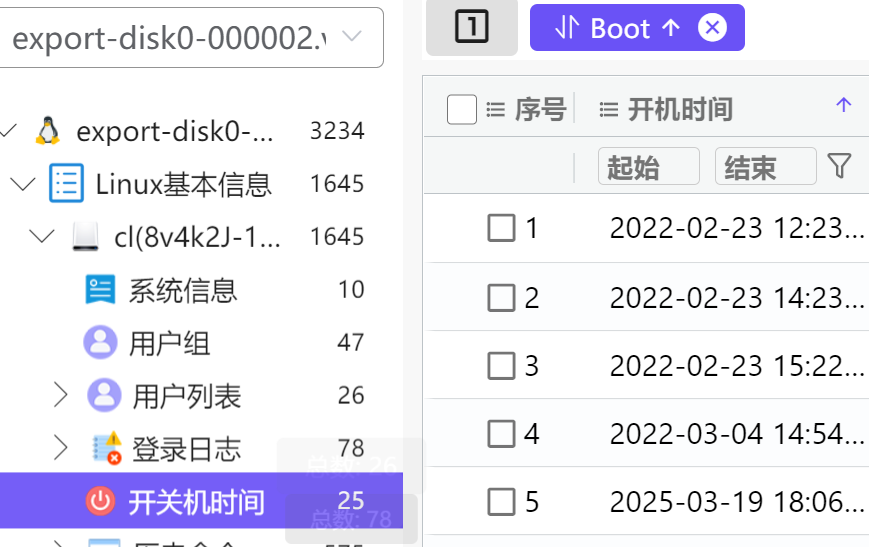

<font style="color:rgb(82, 196, 26);">2022/2/23 12:23:49</font>

### [<font style="color:rgb(0,0,0);">2.服务器操作系统内核版本【格式：1.1.1-123】</font>](#bookmark32)
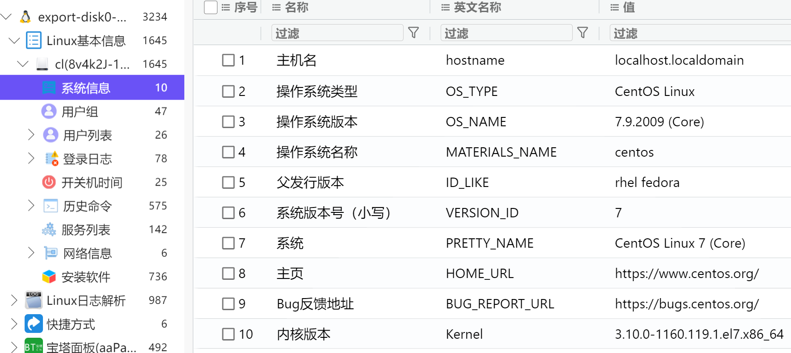

<font style="color:rgb(82, 196, 26);">3.10.0-1160.119.1.el7.x86_64</font>

### [<font style="color:rgb(0,0,0);">3.除系统用户外，总共有多少个用户【格式：1】</font>](#bookmark33)
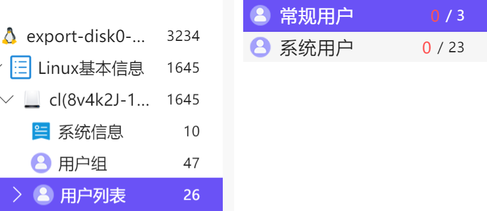

<font style="color:rgb(82, 196, 26);">3</font>

### [<font style="color:rgb(0,0,0);">4.Trojan服务器混淆流量所使用的域名是什么【格式：xxx.xxx】</font>](#bookmark34)
### 
### [<font style="color:rgb(0,0,0);">5.Trojan服务运行的模式为：</font>](#bookmark35)
### 
### [<font style="color:rgb(0,0,0);">6.关于Trojan服务器配置文件中配置的remote_addr和remote_port的作用，正确的是：</font>](#bookmark36)
#### <font style="color:#000000;">A. 代理流量转发到外部互联网服务器</font>
#### <font style="color:#000000;">B. 将流量转发到本地的 HTTP 服务（如Nginx）</font>
#### <font style="color:#000000;">C. 用于数据库连接</font>
#### <font style="color:#000000;">D. 加密流量解密后的目标地址</font>
<font style="color:rgb(0,0,0);"></font>

### <font style="color:rgb(0,0,0);">7.分析网站后台登录密码的加密逻辑，给出密码sbwyz1加密后存在数据库中的值【格式： 1a2b3c4d】</font>


### <font style="color:rgb(0,0,0);">8.网站后台显示的服务器GD版本是多少(格式： 1.1.1 abc)</font>


### <font style="color:rgb(0,0,0);">9.网站后台中2016-04-01 00:00:00到2025-04-01 00:00:00订单列表有多少条记录(格式： 1)</font>


### <font style="color:rgb(0,0,0);">10.在网站购物满多少免运费(格式： 1)</font>


### <font style="color:rgb(0,0,0);">11.分析网站日志，成功在网站后台上传木马的攻击者IP是多少(格式： 1.1.1.1)</font>


### <font style="color:rgb(0,0,0);">12.攻击者插入的—句话木马文件的sha256值是多少(格式：大写sha256)</font>
### 
### <font style="color:rgb(0,0,0);">13.攻击者使用工具对内网进行扫描后， rdp扫描结果中的账号密码是什么(格式：abc:def)</font>


### <font style="color:rgb(0,0,0);">14.对于每个用户，计算其注册时间（ 用户表中的注册时间戳） 到首次下单时间（ 订单表中最早时间戳） 的…</font>


### <font style="color:rgb(0,0,0);">15.统计每月订单数量，找出订单最多的月份（XXXX年XX月）</font>


### <font style="color:rgb(0,0,0);">16.找出连续三天内下单的用户并统计总共有多少个（格式： 1）</font>


## <font style="color:rgb(0,0,0);">流量分析取证</font>
**<font style="color:rgb(38,38,38);">BLE 和 USBPcap 是两个流量包，后缀改成 pcapng</font>**

### <font style="color:rgb(0,0,0);">1. 请问侦查人员是用哪个接口进行抓到蓝牙数据包的（格式：DVI1-2.1）</font>
### <font style="color:rgb(0,0,0);">2.起早王有—个用于伪装成倩倩耳机的蓝牙设备，该设备的原始设备名称为什么（格式：XXX_xxx 具体大…</font>
### <font style="color:rgb(0,0,0);">3.起早王有—个用于伪装成倩倩耳机的蓝牙设备，该设备修改成耳机前后的大写MAC地址分别为多少（格…</font>
### <font style="color:rgb(0,0,0);">4.流量包中首次捕获到该伪装设备修改自身名称的UTC+0时间为？（格式：2024/03/07 01:02:03.123）</font>
### <font style="color:rgb(0,0,0);">5.起早王中途还不断尝试使用自己的手机向倩倩电脑进行广播发包，请你找出起早王手机蓝牙的制造商数…</font>
### <font style="color:rgb(0,0,0);">6.起早王的真名是什么（格式：Cai_Xu_Kun 每个首字母均需大写）</font>
### <font style="color:rgb(0,0,0);">7.起早王对倩倩的电脑执行了几条cmd里的命令（格式： 1 ）</font>
### <font style="color:rgb(0,0,0);">8.倩倩电脑中影子账户的账户名和密码为什么（格式：32位小写md5(账号名称_密码) ，例如md5(zhangs…</font>
### <font style="color:rgb(0,0,0);">9.起早王对倩倩的电脑执行的最后—条命令是什么（格式：32位小写md5(完整命令)，例如md5(echo "qi…</font>
