## <font style="color:#000000;">前言</font>
<font style="color:#000000;background-color:rgba(0, 0, 0, 0.02);">案情介绍：</font>

<font style="color:#000000;background-color:rgba(0, 0, 0, 0.02);">2025年4月，杭州滨江警方接到辖区内市民刘晓倩(简称：倩倩)报案称：其个人电子设备疑似遭人监控。经初步调查，警方发现倩倩的手机存在可疑后台活动，手机可能存在被木马控制情况；对倩倩计算机进行流量监控，捕获可疑流量包。遂启动电子数据取证程序。 警方通过对倩倩手机和恶意流量包的分析，锁定一名化名“起早王”的本地男子。经搜查其住所，警方查扣一台个人电脑和服务器。技术分析显示，该服务器中存有与倩倩设备内同源的特制远控木马，可实时窃取手机摄像头、手机通信记录等相关敏感文件。进一步对服务器溯源，发现“起早王”曾渗透其任职的科技公司购物网站，获得公司服务器权限，非法窃取商业数据并使用公司的服务器搭建Trojan服务并作为跳板机实施远控。 请你结合以上案例并根据相关检材，完成下面的勘验工作。</font>

<font style="color:#000000;background-color:rgba(0, 0, 0, 0.02);">检材下载链接：</font>[<font style="color:#000000;background-color:rgba(0, 0, 0, 0.02);">https://pan.baidu.com/s/1gTA5rG3pe1uMw5_KH5fckw?pwd=wiki</font>](https://pan.baidu.com/s/1gTA5rG3pe1uMw5_KH5fckw?pwd=wiki)

<font style="color:#000000;background-color:rgba(0, 0, 0, 0.02);">挂载/解压密码：</font>`<font style="color:#000000;background-color:rgba(150, 150, 150, 0.1);">早起王的爱恋日记</font><font style="color:#000000;background-color:rgba(150, 150, 150, 0.1);">❤</font>`

## <font style="color:#000000;">一、手机取证</font>
### <font style="color:#000000;">1.手机的主板型号是什么(格式:abcdef)</font>
#### 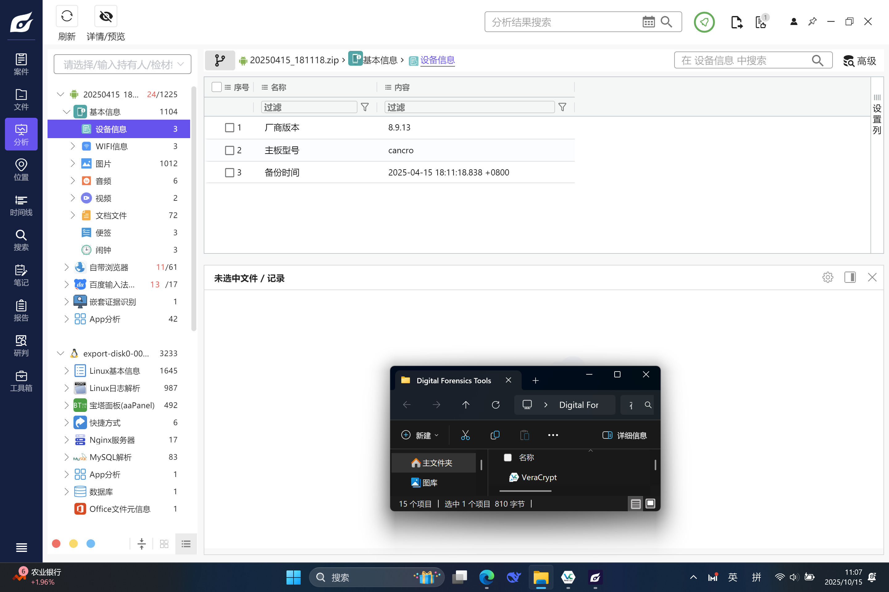
<font style="color:rgb(82, 196, 26);">cancro</font>

### 2.倩倩的妈妈可能是哪里人(格式:北京人)
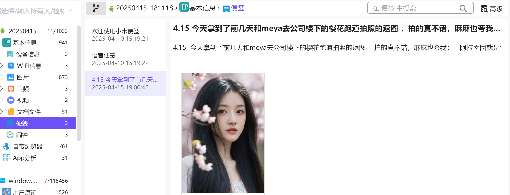

<font style="color:rgb(82, 196, 26);">上海人</font>

### 3.起早王对倩倩的手机进行了监控,倩倩在什么时候发现不对劲并上网搜索(格式:2020-01-01 01:01:01)
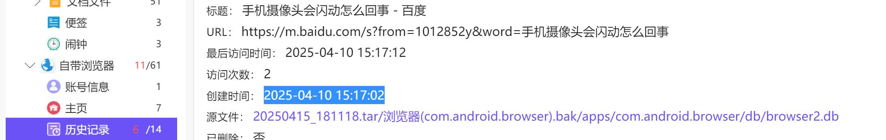<font style="color:rgb(82, 196, 26);">2025-04-10 15:17:12</font>

### 4.倩倩的出生日期是什么(格式：2000-01-01)
在剪切板处发现身份证号<font style="color:rgba(0, 0, 0, 0.87);">310104200108110624</font>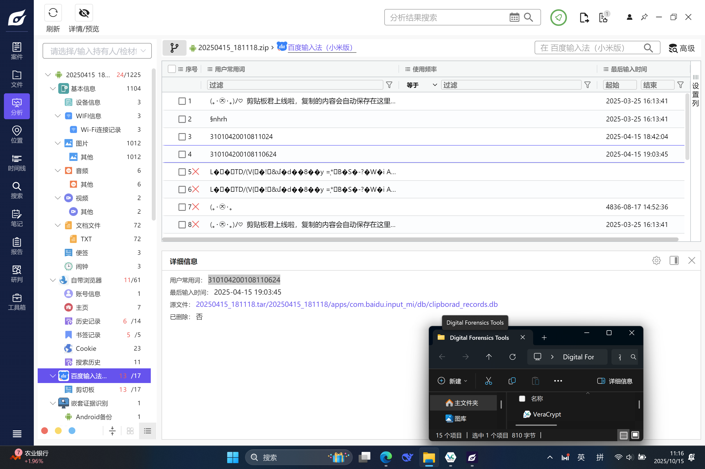

<font style="color:rgb(82, 196, 26);">2001-08-11</font>

### 5.手机内Puzzle_Game拼图程序拼图APK的SHA256值是多少(格式:123456789abcdef······)
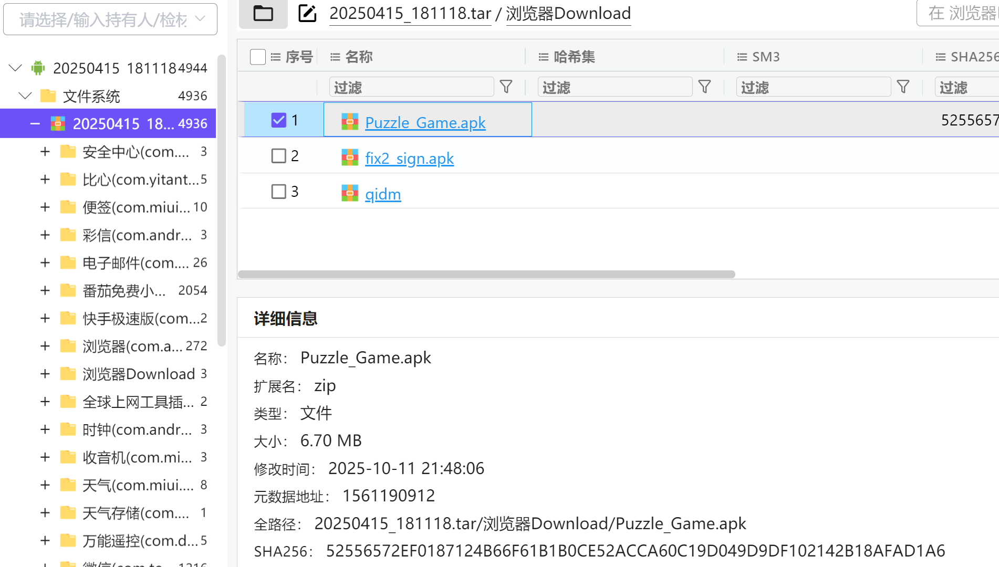

直接右键计算结果是大写的。如果格式小写可以：

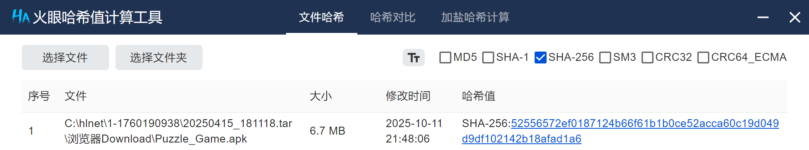

<font style="color:rgb(82, 196, 26);">52556572ef0187124b66f61b1b0ce52acca60c19d049d9df102142b18afad1a6</font>

### 6.手机内Puzzle_Game拼图程序拼图APK中有一个fakeFlag。请问fakeFlag中必然出现的一句英文是什么？(格式:I_l0ve_SPC!)
雷电APP智能分析——jadx反编译查看源码，搜fakeflag（类/方法/代码什么的全勾）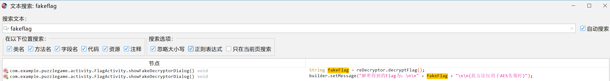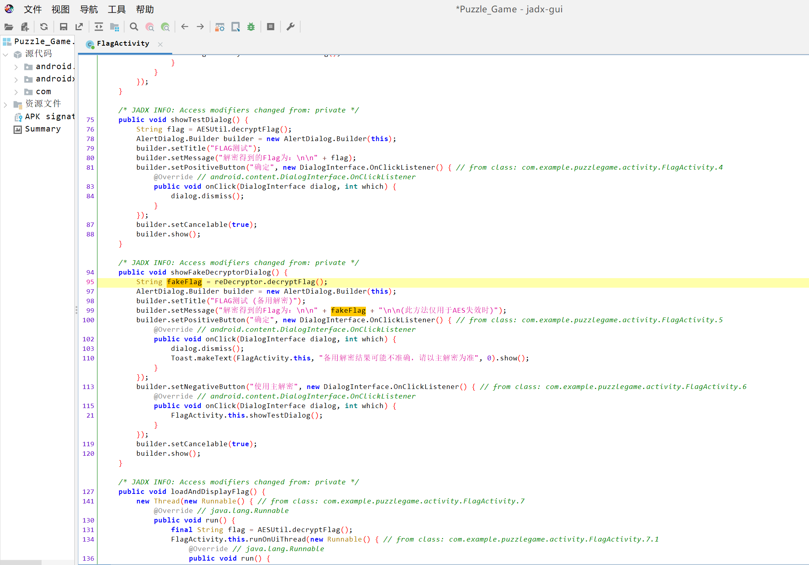会发现fakeflag是由一个方法赋值的，单击方法查看定义，会发现这个方法return的内容中，有一个常值变量。推断这个即为答案。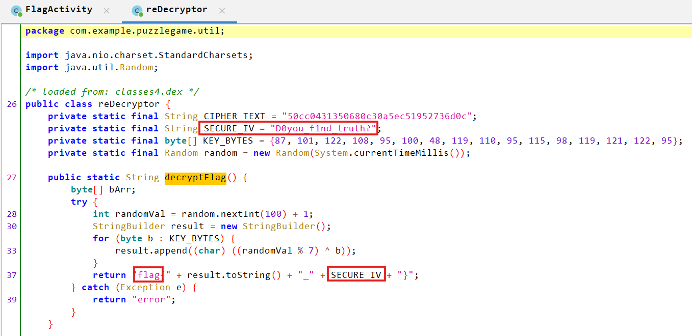

<font style="color:rgb(82, 196, 26);">D0you_f1nd_truth?</font>

### 7.手机内Puzzle_Game拼图程序拼图APK中的Flag1是什么(格式:I_l0ve_SPC)
接上题，会发现fakeflag所在的类里面还有另一个flag函数。仔细看AESUtil.descryptFlag：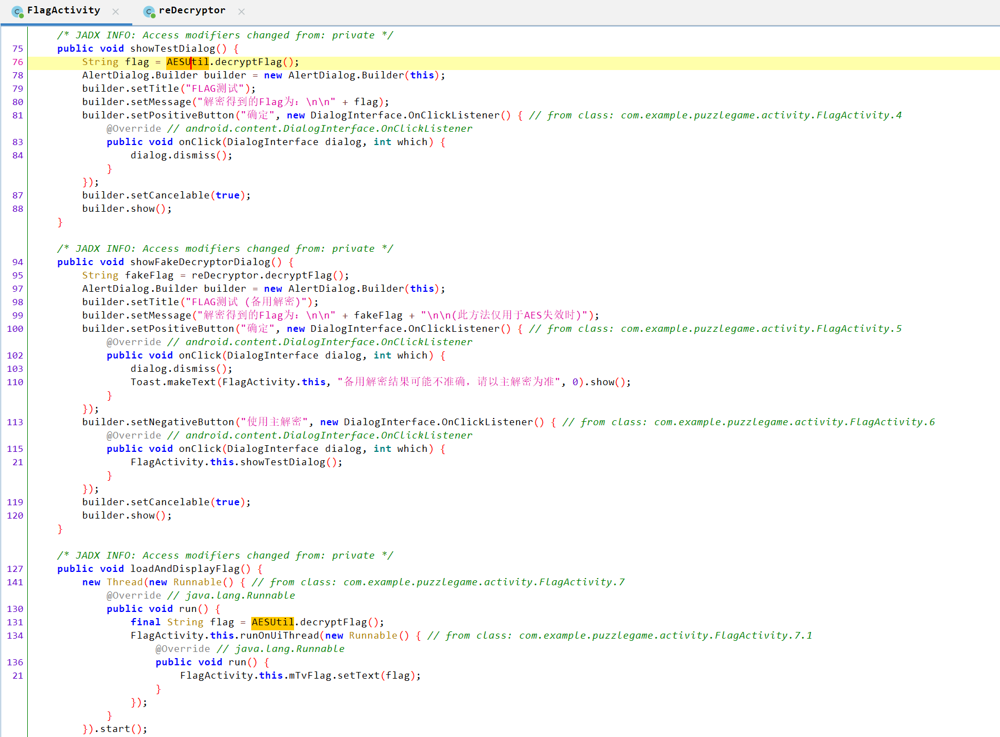

跳转：

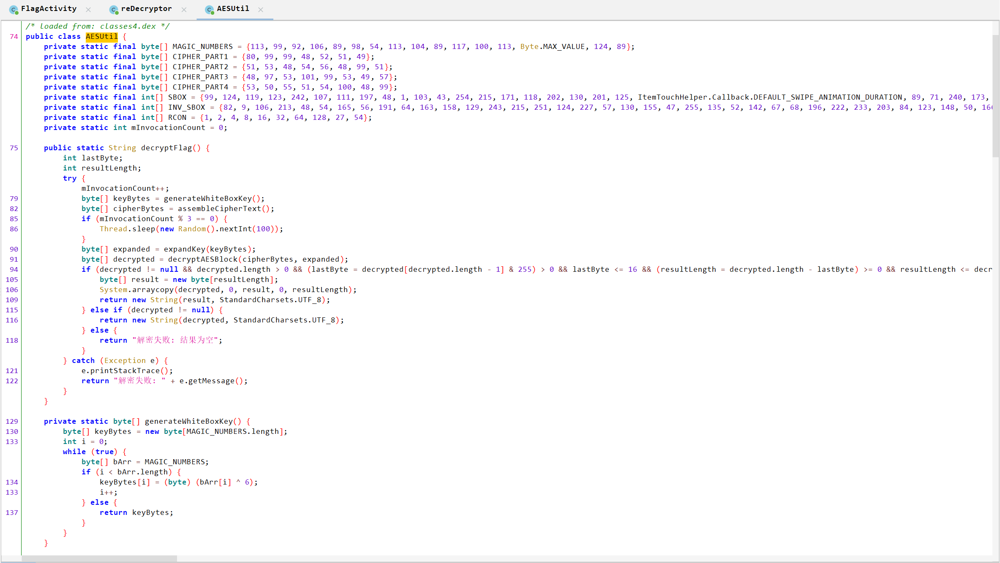

```java
package com.example.puzzlegame.util;

import androidx.recyclerview.widget.ItemTouchHelper;
import java.nio.charset.StandardCharsets;
import java.util.Random;

/* loaded from: classes4.dex */
public class AESUtil {
    private static final byte[] MAGIC_NUMBERS = {113, 99, 92, 106, 89, 98, 54, 113, 104, 89, 117, 100, 113, Byte.MAX_VALUE, 124, 89};
    private static final byte[] CIPHER_PART1 = {80, 99, 99, 48, 52, 51, 49};
    private static final byte[] CIPHER_PART2 = {51, 53, 48, 54, 56, 48, 99, 51};
    private static final byte[] CIPHER_PART3 = {48, 97, 53, 101, 99, 53, 49, 57};
    private static final byte[] CIPHER_PART4 = {53, 50, 55, 51, 54, 100, 48, 99};
    private static final int[] SBOX = {99, 124, 119, 123, 242, 107, 111, 197, 48, 1, 103, 43, 254, 215, 171, 118, 202, 130, 201, 125, ItemTouchHelper.Callback.DEFAULT_SWIPE_ANIMATION_DURATION, 89, 71, 240, 173, 212, 162, 175, 156, 164, 114, 192, 183, 253, 147, 38, 54, 63, 247, 204, 52, 165, 229, 241, 113, 216, 49, 21, 4, 199, 35, 195, 24, 150, 5, 154, 7, 18, 128, 226, 235, 39, 178, 117, 9, 131, 44, 26, 27, 110, 90, 160, 82, 59, 214, 179, 41, 227, 47, 132, 83, 209, 0, 237, 32, 252, 177, 91, 106, 203, 190, 57, 74, 76, 88, 207, 208, 239, 170, 251, 67, 77, 51, 133, 69, 249, 2, 127, 80, 60, 159, 168, 81, 163, 64, 143, 146, 157, 56, 245, 188, 182, 218, 33, 16, 255, 243, 210, 205, 12, 19, 236, 95, 151, 68, 23, 196, 167, 126, 61, 100, 93, 25, 115, 96, 129, 79, 220, 34, 42, 144, 136, 70, 238, 184, 20, 222, 94, 11, 219, 224, 50, 58, 10, 73, 6, 36, 92, 194, 211, 172, 98, 145, 149, 228, 121, 231, ItemTouchHelper.Callback.DEFAULT_DRAG_ANIMATION_DURATION, 55, 109, 141, 213, 78, 169, 108, 86, 244, 234, 101, 122, 174, 8, 186, 120, 37, 46, 28, 166, 180, 198, 232, 221, 116, 31, 75, 189, 139, 138, 112, 62, 181, 102, 72, 3, 246, 14, 97, 53, 87, 185, 134, 193, 29, 158, 225, 248, 152, 17, 105, 217, 142, 148, 155, 30, 135, 233, 206, 85, 40, 223, 140, 161, 137, 13, 191, 230, 66, 104, 65, 153, 45, 15, 176, 84, 187, 22};
    private static final int[] INV_SBOX = {82, 9, 106, 213, 48, 54, 165, 56, 191, 64, 163, 158, 129, 243, 215, 251, 124, 227, 57, 130, 155, 47, 255, 135, 52, 142, 67, 68, 196, 222, 233, 203, 84, 123, 148, 50, 166, 194, 35, 61, 238, 76, 149, 11, 66, ItemTouchHelper.Callback.DEFAULT_SWIPE_ANIMATION_DURATION, 195, 78, 8, 46, 161, 102, 40, 217, 36, 178, 118, 91, 162, 73, 109, 139, 209, 37, 114, 248, 246, 100, 134, 104, 152, 22, 212, 164, 92, 204, 93, 101, 182, 146, 108, 112, 72, 80, 253, 237, 185, 218, 94, 21, 70, 87, 167, 141, 157, 132, 144, 216, 171, 0, 140, 188, 211, 10, 247, 228, 88, 5, 184, 179, 69, 6, 208, 44, 30, 143, 202, 63, 15, 2, 193, 175, 189, 3, 1, 19, 138, 107, 58, 145, 17, 65, 79, 103, 220, 234, 151, 242, 207, 206, 240, 180, 230, 115, 150, 172, 116, 34, 231, 173, 53, 133, 226, 249, 55, 232, 28, 117, 223, 110, 71, 241, 26, 113, 29, 41, 197, 137, 111, 183, 98, 14, 170, 24, 190, 27, 252, 86, 62, 75, 198, 210, 121, 32, 154, 219, 192, 254, 120, 205, 90, 244, 31, 221, 168, 51, 136, 7, 199, 49, 177, 18, 16, 89, 39, 128, 236, 95, 96, 81, 127, 169, 25, 181, 74, 13, 45, 229, 122, 159, 147, 201, 156, 239, 160, 224, 59, 77, 174, 42, 245, 176, ItemTouchHelper.Callback.DEFAULT_DRAG_ANIMATION_DURATION, 235, 187, 60, 131, 83, 153, 97, 23, 43, 4, 126, 186, 119, 214, 38, 225, 105, 20, 99, 85, 33, 12, 125};
    private static final int[] RCON = {1, 2, 4, 8, 16, 32, 64, 128, 27, 54};
    private static int mInvocationCount = 0;

    public static String decryptFlag() {
        int lastByte;
        int resultLength;
        try {
            mInvocationCount++;
            byte[] keyBytes = generateWhiteBoxKey();
            byte[] cipherBytes = assembleCipherText();
            if (mInvocationCount % 3 == 0) {
                Thread.sleep(new Random().nextInt(100));
            }
            byte[] expanded = expandKey(keyBytes);
            byte[] decrypted = decryptAESBlock(cipherBytes, expanded);
            if (decrypted != null && decrypted.length > 0 && (lastByte = decrypted[decrypted.length - 1] & 255) > 0 && lastByte <= 16 && (resultLength = decrypted.length - lastByte) >= 0 && resultLength <= decrypted.length) {
                byte[] result = new byte[resultLength];
                System.arraycopy(decrypted, 0, result, 0, resultLength);
                return new String(result, StandardCharsets.UTF_8);
            } else if (decrypted != null) {
                return new String(decrypted, StandardCharsets.UTF_8);
            } else {
                return "解密失败: 结果为空";
            }
        } catch (Exception e) {
            e.printStackTrace();
            return "解密失败: " + e.getMessage();
        }
    }

    private static byte[] generateWhiteBoxKey() {
        byte[] keyBytes = new byte[MAGIC_NUMBERS.length];
        int i = 0;
        while (true) {
            byte[] bArr = MAGIC_NUMBERS;
            if (i < bArr.length) {
                keyBytes[i] = (byte) (bArr[i] ^ 6);
                i++;
            } else {
                return keyBytes;
            }
        }
    }

    private static byte[] assembleCipherText() {
        byte[] bArr;
        byte[] bArr2;
        byte[] bArr3;
        byte[] bArr4;
        StringBuilder hexString = new StringBuilder();
        for (byte b : CIPHER_PART1) {
            hexString.append((char) b);
        }
        for (byte b2 : CIPHER_PART2) {
            hexString.append((char) b2);
        }
        for (byte b3 : CIPHER_PART3) {
            hexString.append((char) b3);
        }
        for (byte b4 : CIPHER_PART4) {
            hexString.append((char) b4);
        }
        return hexStringToByteArray(hexString.toString());
    }

    private static byte[] hexStringToByteArray(String s) {
        if (s.length() % 2 != 0) {
            s = "0" + s;
        }
        int len = s.length();
        byte[] data = new byte[len / 2];
        for (int i = 0; i < len; i += 2) {
            try {
                int high = Character.digit(s.charAt(i), 16);
                int low = Character.digit(s.charAt(i + 1), 16);
                if (high == -1 || low == -1) {
                    throw new IllegalArgumentException("无效的十六进制字符");
                }
                data[i / 2] = (byte) ((high << 4) | low);
            } catch (Exception e) {
                return new byte[]{80, -52, 4, 49, 53, 6, Byte.MIN_VALUE, -61, 10, 94, -59, 25, 82, 115, 109, 12};
            }
        }
        return data;
    }

    private static byte[] expandKey(byte[] key) {
        byte[] expandedKey = new byte[176];
        System.arraycopy(key, 0, expandedKey, 0, 16);
        int bytesGenerated = 16;
        int rconIndex = 0;
        byte[] temp = new byte[4];
        while (bytesGenerated < 176) {
            System.arraycopy(expandedKey, bytesGenerated - 4, temp, 0, 4);
            if (bytesGenerated % 16 == 0) {
                byte tempByte = temp[0];
                temp[0] = temp[1];
                temp[1] = temp[2];
                temp[2] = temp[3];
                temp[3] = tempByte;
                for (int i = 0; i < 4; i++) {
                    temp[i] = (byte) SBOX[temp[i] & 255];
                }
                int i2 = temp[0];
                temp[0] = (byte) (RCON[rconIndex] ^ i2);
                rconIndex++;
            }
            for (int i3 = 0; i3 < 4; i3++) {
                expandedKey[bytesGenerated] = (byte) (expandedKey[bytesGenerated - 16] ^ temp[i3]);
                bytesGenerated++;
            }
        }
        return expandedKey;
    }

    private static byte[] decryptAESBlock(byte[] ciphertext, byte[] expandedKey) {
        if (ciphertext == null || ciphertext.length == 0 || ciphertext.length % 16 != 0) {
            return "flag{aes_decrypt_success}".getBytes(StandardCharsets.UTF_8);
        }
        int length = ciphertext.length;
        byte[] plaintext = new byte[length];
        for (int i = 0; i < length; i += 16) {
            byte[] block = new byte[16];
            int copyLength = Math.min(16, ciphertext.length - i);
            System.arraycopy(ciphertext, i, block, 0, copyLength);
            if (copyLength < 16) {
                for (int j = copyLength; j < 16; j++) {
                    block[j] = 0;
                }
            }
            byte[] decryptedBlock = decryptBlock(block, expandedKey);
            System.arraycopy(decryptedBlock, 0, plaintext, i, Math.min(16, plaintext.length - i));
        }
        return plaintext;
    }

    private static byte[] decryptBlock(byte[] input, byte[] expandedKey) {
        byte[] state = new byte[16];
        System.arraycopy(input, 0, state, 0, 16);
        int keyOffset = 160;
        addRoundKey(state, expandedKey, 160);
        for (int round = 9; round > 0; round--) {
            keyOffset -= 16;
            invShiftRows(state);
            invSubBytes(state);
            addRoundKey(state, expandedKey, keyOffset);
            invMixColumns(state);
        }
        invShiftRows(state);
        invSubBytes(state);
        addRoundKey(state, expandedKey, 0);
        return state;
    }

    private static void addRoundKey(byte[] state, byte[] roundKey, int offset) {
        for (int i = 0; i < 16; i++) {
            state[i] = (byte) (state[i] ^ roundKey[offset + i]);
        }
    }

    private static void invSubBytes(byte[] state) {
        for (int i = 0; i < 16; i++) {
            state[i] = (byte) INV_SBOX[state[i] & 255];
        }
    }

    private static void invShiftRows(byte[] state) {
        byte temp = state[13];
        state[13] = state[9];
        state[9] = state[5];
        state[5] = state[1];
        state[1] = temp;
        byte temp2 = state[2];
        state[2] = state[10];
        state[10] = temp2;
        byte temp3 = state[6];
        state[6] = state[14];
        state[14] = temp3;
        byte temp4 = state[3];
        state[3] = state[7];
        state[7] = state[11];
        state[11] = state[15];
        state[15] = temp4;
    }

    private static void invMixColumns(byte[] state) {
        for (int i = 0; i < 16; i += 4) {
            byte a = state[i];
            byte b = state[i + 1];
            byte c = state[i + 2];
            byte d = state[i + 3];
            state[i] = (byte) (((multiply(a, 14) ^ multiply(b, 11)) ^ multiply(c, 13)) ^ multiply(d, 9));
            state[i + 1] = (byte) (((multiply(a, 9) ^ multiply(b, 14)) ^ multiply(c, 11)) ^ multiply(d, 13));
            state[i + 2] = (byte) (((multiply(a, 13) ^ multiply(b, 9)) ^ multiply(c, 14)) ^ multiply(d, 11));
            state[i + 3] = (byte) (multiply(d, 14) ^ ((multiply(a, 11) ^ multiply(b, 13)) ^ multiply(c, 9)));
        }
    }

    private static byte multiply(int a, int b) {
        int result = 0;
        for (int i = 0; i < 8; i++) {
            if ((b & 1) != 0) {
                result ^= a;
            }
            int high_bit = a & 128;
            a <<= 1;
            if (high_bit != 0) {
                a ^= 27;
            }
            b >>= 1;
        }
        int i2 = result & 255;
        return (byte) i2;
    }
}
```

AES加密，原密钥是keyBytes，原密文是cipherBites

MAGIC_NUMBERS = {113, 99, 92, 106, 89, 98, 54, 113, 104, 89, 117, 100, 113, Byte.MAX_VALUE, 124, 89}

每个数与6异或

**<font style="color:rgb(15, 17, 21);background-color:rgb(235, 238, 242);">注意：</font>**`**<font style="color:rgb(15, 17, 21);background-color:rgb(235, 238, 242);">Byte.MAX_VALUE</font>**`**<font style="color:rgb(15, 17, 21);"> 在Java中等于 </font>**`**<font style="color:rgb(15, 17, 21);background-color:rgb(235, 238, 242);">127</font>**`<font style="color:rgb(15, 17, 21);">，因为：Java的byte类型范围是：-128 到 127</font>

<font style="color:rgb(15, 17, 21);">所以最大正值是 127</font>

`**<font style="color:rgb(15, 17, 21);background-color:rgb(235, 238, 242);">113,99,92,106,89,98,54,113,104,89,117,100,113,127,124,89</font>**`


**weZl_d0wn_sbwyz_**

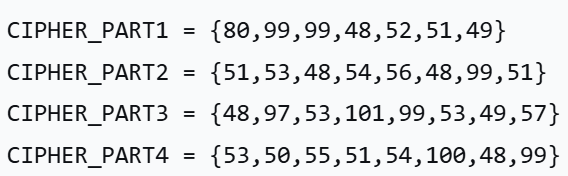

自然想到将密文四部分拼凑起来，得到<font style="color:rgb(15, 17, 21);background-color:rgb(235, 238, 242);">80,99,99,48,52,51,49,51,53,48,54,56,48,99,51,48,97,53,101,99,53,49,57,53,50,55,51,54,100,48,99</font>

<font style="color:#DF2A3F;">我走过的弯路：</font>

<font style="color:#DF2A3F;"></font>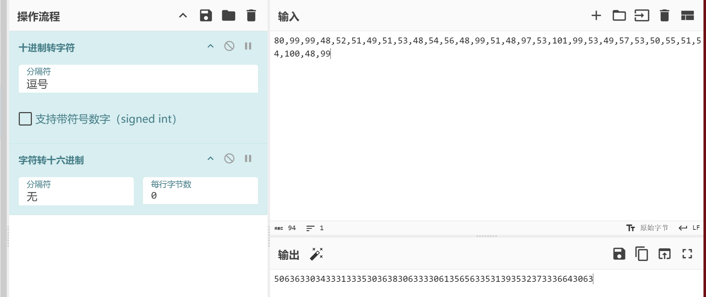

<font style="color:#DF2A3F;">50636330343331333530363830633330613565633531393532373336643063</font>

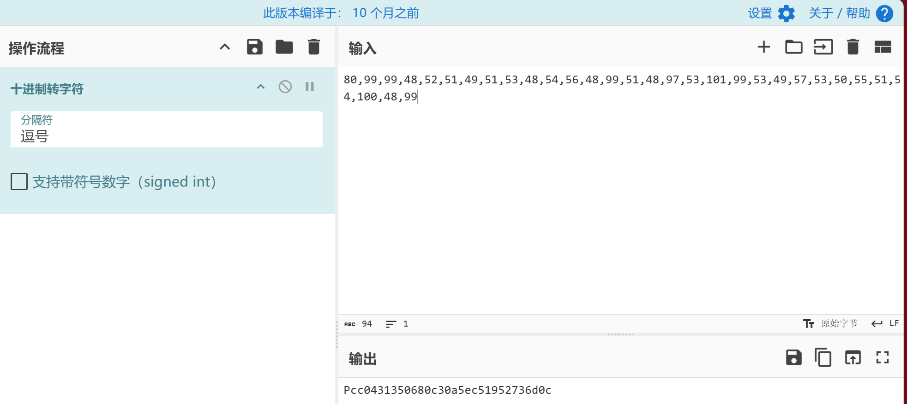

<font style="color:#DF2A3F;">Pcc0431350680c30a5ec51952736d0c</font>

<font style="color:#DF2A3F;">都是错误的密文！</font>

<font style="color:rgb(15, 17, 21);">其实，在后面的代码中我们发现：</font>

```java
private static byte[] hexStringToByteArray(String s) {
    if (s.length() % 2 != 0) {
        s = "0" + s;
    }
    int len = s.length();
    byte[] data = new byte[len / 2];
    for (int i = 0; i < len; i += 2) {
        try {
            int high = Character.digit(s.charAt(i), 16);
            int low = Character.digit(s.charAt(i + 1), 16);
            if (high == -1 || low == -1) {
                throw new IllegalArgumentException("无效的十六进制字符");
            }
            data[i / 2] = (byte) ((high << 4) | low);
        } catch (Exception e) {
            return new byte[]{80, -52, 4, 49, 53, 6, Byte.MIN_VALUE, -61, 10, 94, -59, 25, 82, 115, 109, 12};
        }
    }
    return data;
}
```

**<font style="color:rgb(15, 17, 21);">关键理解：</font>**

<font style="color:rgb(15, 17, 21);">传入的字符串是：</font>`<font style="color:rgb(15, 17, 21);background-color:rgb(235, 238, 242);">"Pcc0431350680c30a5ec51952736d0c"</font>`

**<font style="color:rgb(15, 17, 21);">问题在于第一个字符 'P'：</font>**

+ `<font style="color:rgb(15, 17, 21);background-color:rgb(235, 238, 242);">Character.digit('P', 16)</font>`<font style="color:rgb(15, 17, 21);"> </font><font style="color:rgb(15, 17, 21);">返回</font><font style="color:rgb(15, 17, 21);"> </font>`<font style="color:rgb(15, 17, 21);background-color:rgb(235, 238, 242);">-1</font>`
+ <font style="color:rgb(15, 17, 21);">因为 'P' 不是有效的十六进制字符（十六进制只能是0-9, A-F, a-f）</font>

**<font style="color:rgb(15, 17, 21);">所以代码执行流程：</font>**

1. <font style="color:rgb(15, 17, 21);">尝试解析 'P' 作为十六进制数字 → 返回 -1</font>
2. <font style="color:rgb(15, 17, 21);">检查</font><font style="color:rgb(15, 17, 21);"> </font>`<font style="color:rgb(15, 17, 21);background-color:rgb(235, 238, 242);">high == -1</font>`<font style="color:rgb(15, 17, 21);"> </font><font style="color:rgb(15, 17, 21);">→ 抛出</font><font style="color:rgb(15, 17, 21);"> </font>`<font style="color:rgb(15, 17, 21);background-color:rgb(235, 238, 242);">IllegalArgumentException</font>`
3. <font style="color:rgb(15, 17, 21);">捕获异常 → 返回硬编码的字节数组</font>

<font style="color:rgb(15, 17, 21);">这个硬编码的字节数组才是实际的密文！：</font>

**<font style="color:rgb(15, 17, 21);">80, -52, 4, 49, 53, 6, -128, -61, 10, 94, -59, 25, 82, 115, 109, 12</font>**

<font style="color:rgb(15, 17, 21);">把这个字节数组转换为十六进制：</font>

**<u>50CC0431350680C30A5EC51952736D0C</u>**

<font style="color:rgb(15, 17, 21);background-color:rgba(255, 255, 255, 0);">这是一种</font>**<font style="color:rgb(15, 17, 21);background-color:#F38F39;">代码混淆技术</font>**<font style="color:rgb(15, 17, 21);background-color:rgba(255, 255, 255, 0);">：</font>

1. **<font style="color:rgb(15, 17, 21);">表面逻辑</font>**<font style="color:rgb(15, 17, 21);">：看起来要从各个CIPHER_PART拼接十六进制字符串</font>
2. **<font style="color:rgb(15, 17, 21);">实际逻辑</font>**<font style="color:rgb(15, 17, 21);">：故意让十六进制解析失败，使用硬编码的真实密文</font>
3. **<font style="color:rgb(15, 17, 21);">迷惑分析者</font>**<font style="color:rgb(15, 17, 21);">：让逆向工程的人误以为要解析那个无效的十六进制字符串</font>

心里已经骂了无数遍了。。。测测测

扔给CyberChef进行AES解密，得到答案

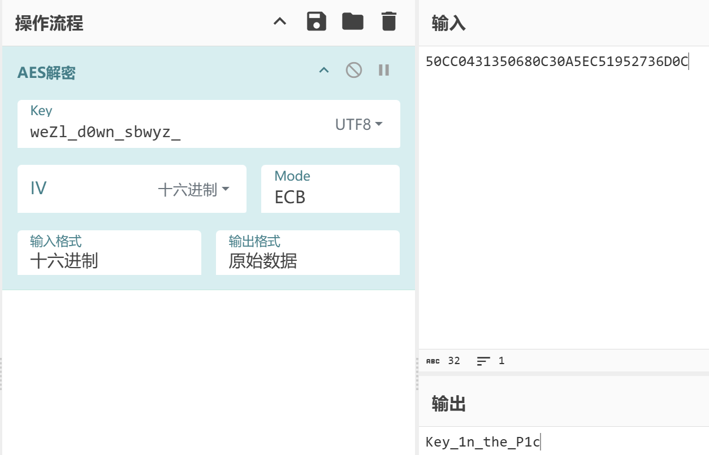

<font style="color:rgb(82, 196, 26);">Key_1n_the_P1c</font>

### 8.倩倩周末几点起床(格式：25:00)
#### 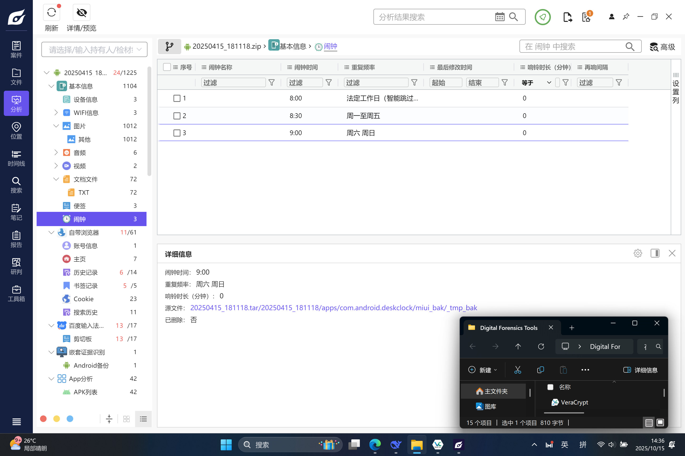
<font style="color:rgb(82, 196, 26);">9:00</font>

### 9.检材内除了微信和QQ，还有一款加固过的聊天交友软件，请问安装包名是什么(com.tencent.mm)
聊天软件且加固过

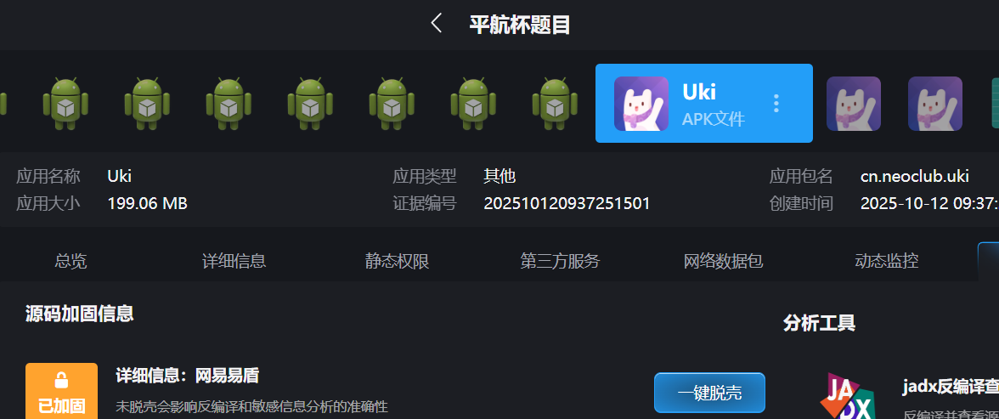

<font style="color:rgb(82, 196, 26);">cn.neoclub.uki</font>

### 10.接题目九，该软件使用什么加固(格式：腾讯乐固)
<font style="color:rgb(82, 196, 26);">网易易盾</font>

### 11.接题目十，该软件的主函数名是什么(格式：com.xxxxx.xxxx······)
脱壳后，自动分析即可看到主函数名

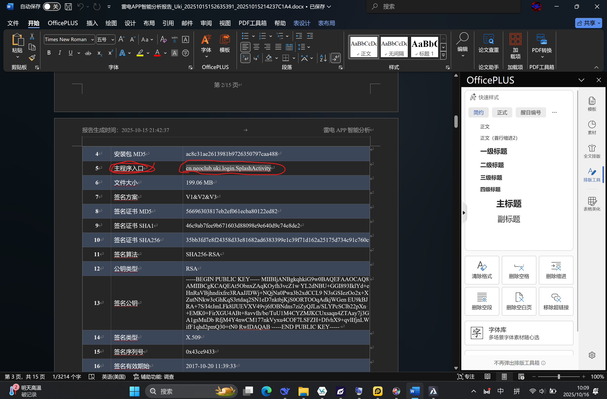

<font style="color:rgb(82, 196, 26);">cn.neoclub.uki.login.SplashActivity</font>

### 12.此手机检材的IMEI号是多少(格式：123456789101112)
全局搜索 **imei">**（关掉区分大小写）

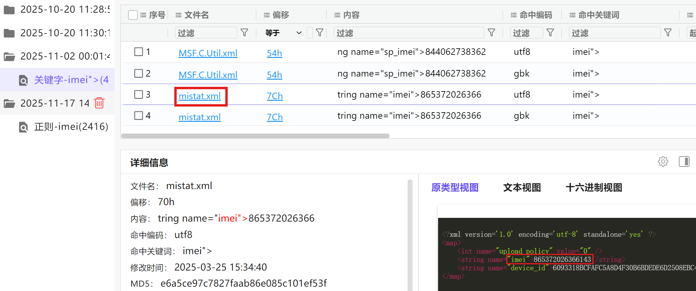

<font style="color:rgb(82, 196, 26);">865372026366143</font>

### 13.倩倩曾经听过哪部小说(格式:道诡异仙)
纯找，找到天荒地老。格式<font style="color:rgba(0, 0, 0, 0.87);">.cnt</font>非常冷门<font style="color:rgba(0, 0, 0, 0.87);">。可以Exif翻一遍，也可以技巧：</font>

听书锁定番茄免费小说com.dragon.read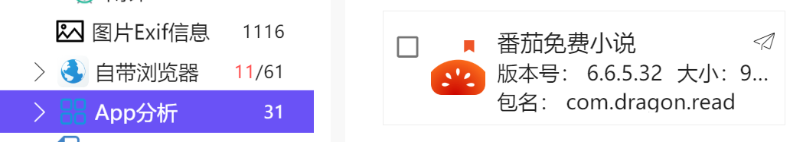

找到所在文件夹，发现f内容最多，不妨从这里切入

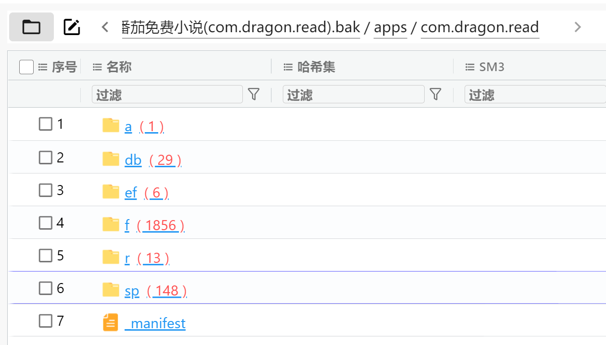

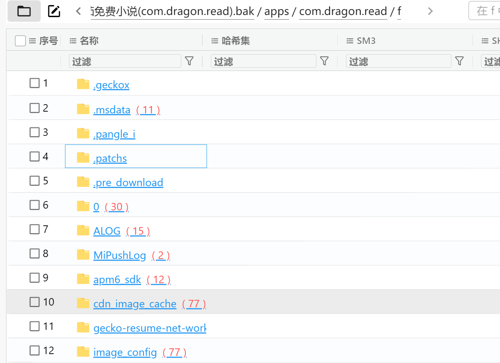

<font style="color:rgba(0, 0, 0, 0.87);">看cdn_image_cache缓存</font>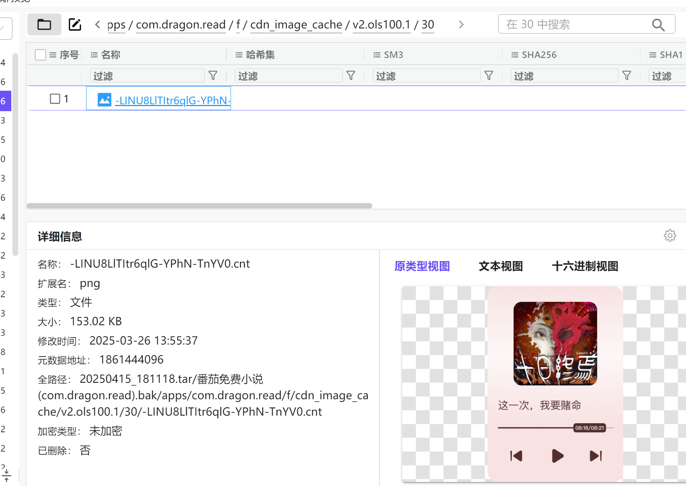

<font style="color:rgba(0, 0, 0, 0.87);">笑了，第一次提交了“这一次，我要赌命”结果发现是章节名称。。</font>

<font style="color:rgba(0, 0, 0, 0.87);">出这种题时：这一次，我要赌命（躲过做题人的追杀）</font>

<font style="color:rgb(82, 196, 26);">十日终焉</font>

## 二、计算机取证
### 14.起早王的计算机最后一次正常关机时间是什么时候(格式：2020-01-01 01:01:01)
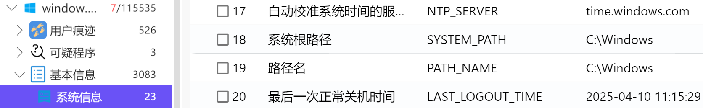

<font style="color:rgb(82, 196, 26);">2025-04-10 11:15:29</font>

### 15.起早王用户SID的末四位是什么（格式:1234）
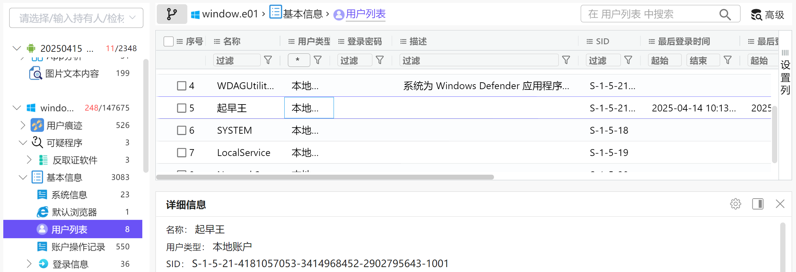

<font style="color:rgb(82, 196, 26);">1001</font>

### 16.起早王计算机连接的蓝牙设备的Guid是什么(格式：{abcdefg-123456})
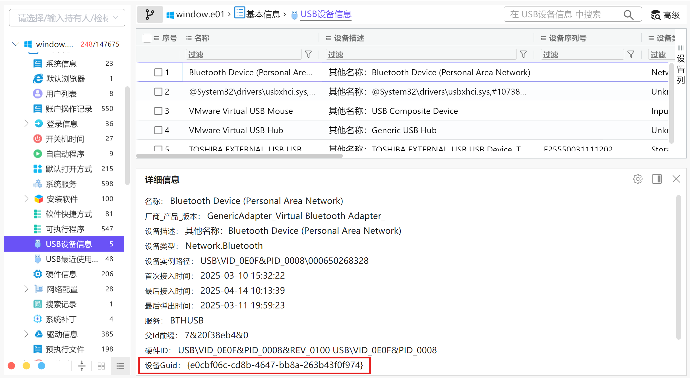

<font style="color:rgb(82, 196, 26);">{e0cbf06c-cd8b-4647-bb8a-263b43f0f974}</font>

### 17.起早王的便签的第4条是什么(格式：我要学电子取证)
#### 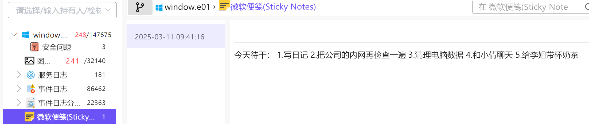
或仿真看


<font style="color:rgb(82, 196, 26);">和小倩聊天</font>

### 18.起早王写日记的软件叫什么(格式：DeepDarkFantasy)
仿真看：

沙箱有可疑的diary

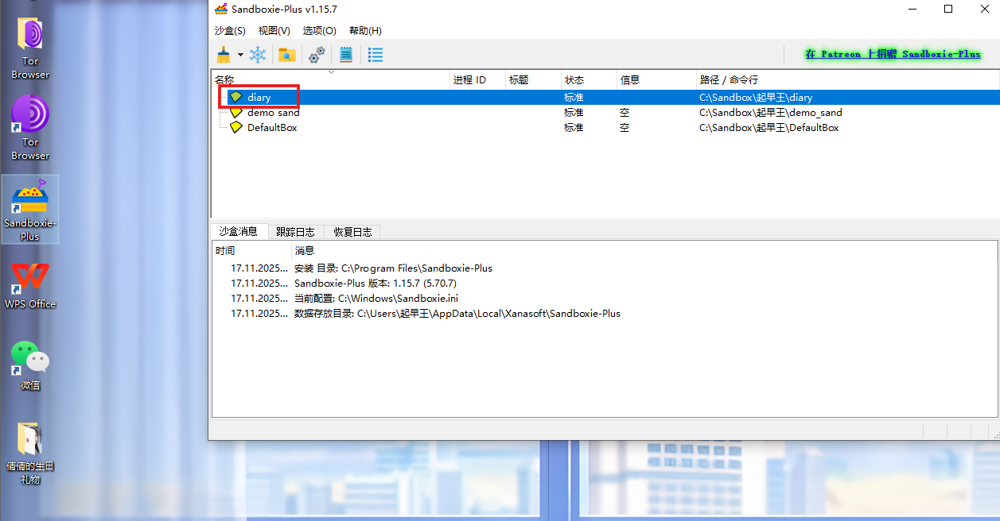

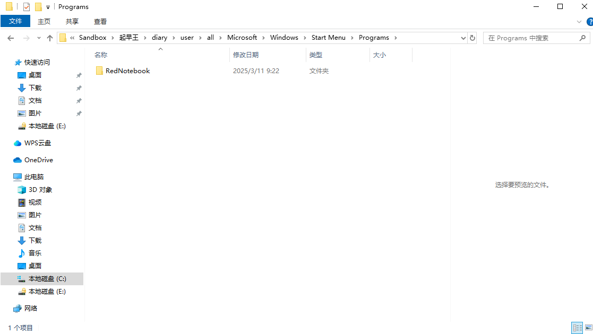

打开确实是写日记的

<font style="color:rgb(82, 196, 26);">RedNotebook</font>

### 19.接第十八题，起早王在该软件中写了几条日记（格式:1）
翻一下，写过日记的是加粗的

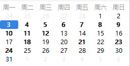

<font style="color:rgb(82, 196, 26);">14</font>

### 20.SillyTavern中账户起早王的密码是什么(格式：abcdefg123456)
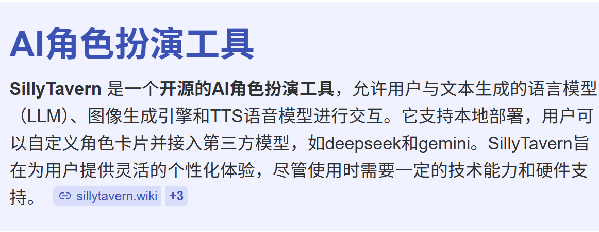

线索藏在10号的笔记里

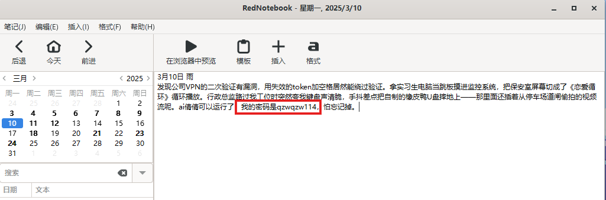

<font style="color:rgb(82, 196, 26);">qzwqzw114</font>

### 21.SillyTavern中虚拟角色Akari有几个标签(格式：1)
搜索sillyTavern，这里我有个习惯技巧，就是把everything.exe复制进虚拟机，瞬间搜索：

相比之下文件管理器搜索太慢了

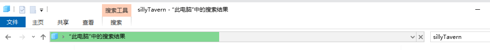

仔细浏览文件夹中的文件，发现似乎没有启动文件，于是再向上一层，无。

再向上一层，发现start.bat后，双击，等待一段时间，按Enter，成功进入浏览器

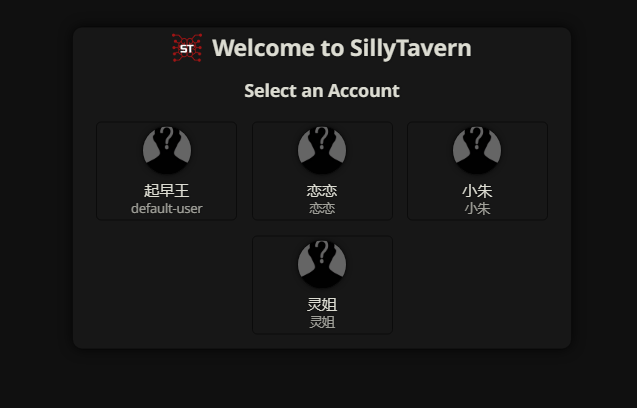


选择角色

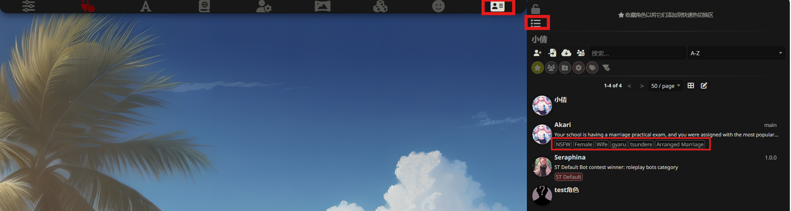

<font style="color:rgb(82, 196, 26);">6</font>

### 22.起早王一共在电脑中存储了几种语言模型(格式:1)
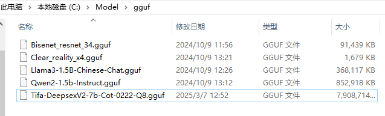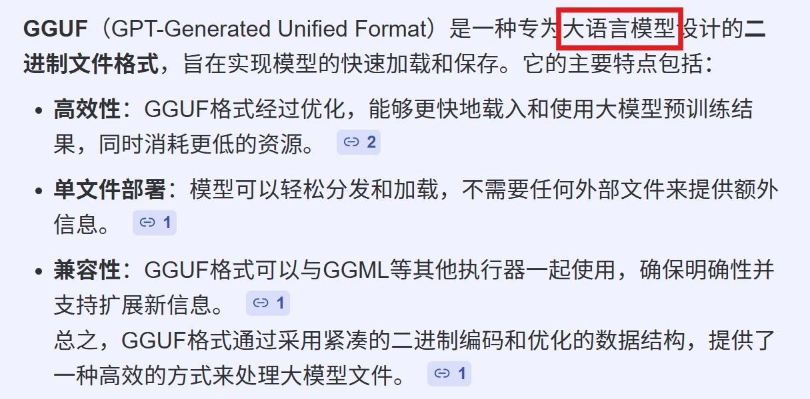

<font style="color:rgb(82, 196, 26);">5</font>

### 23.电脑中E盘bitlocker的密码是什么(格式：114514)
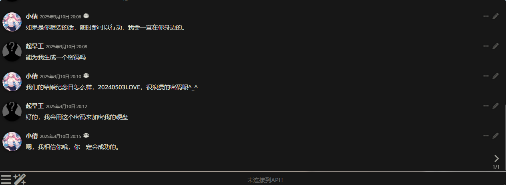

<font style="color:rgb(82, 196, 26);">20240503LOVE</font>

### <font style="color:#000000;">24.电脑中ai换脸界面的运行模式是什么(格式：abc)</font>
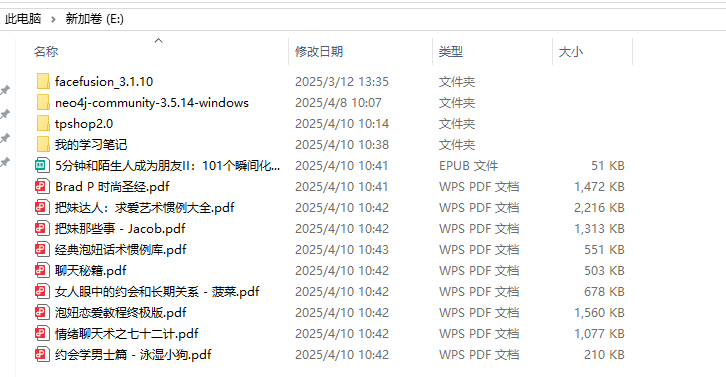

facefusion想必与换脸有关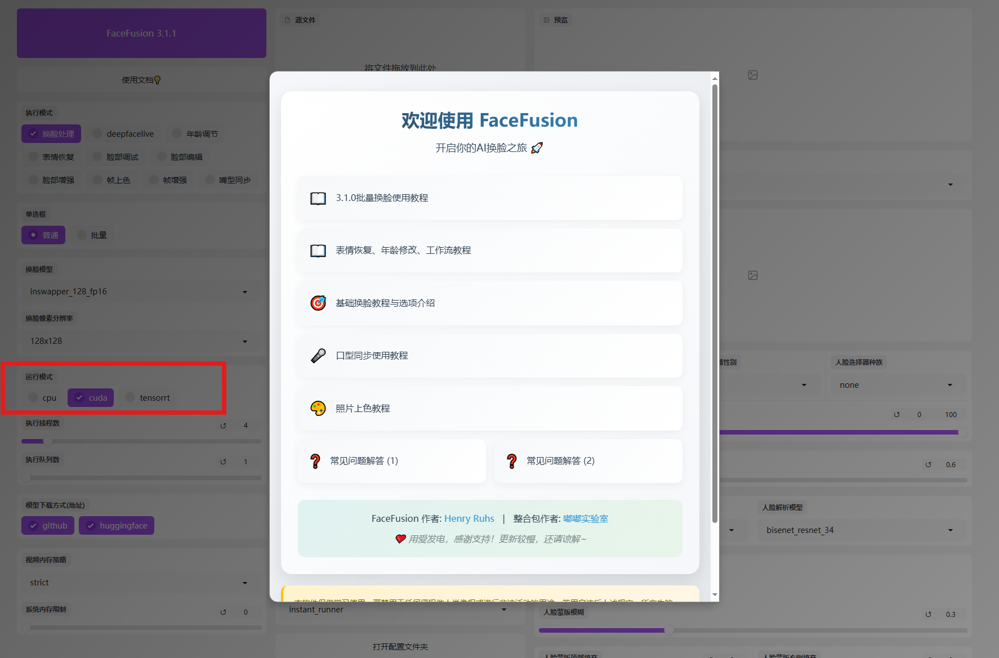

<font style="color:rgb(82, 196, 26);">cuda</font>

### <font style="color:#000000;">25.第三张被换脸的图片所使用的换脸模型是什么(带文件后缀)(格式：xxxxxxxxxxx.xxxx)</font>
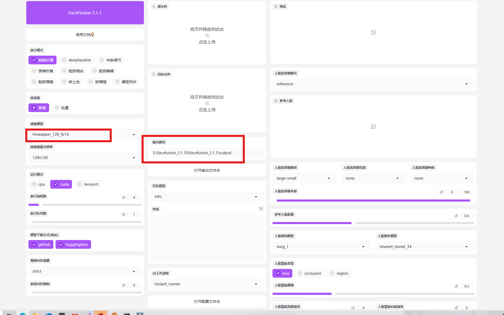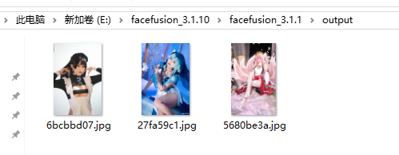

模型得进一步确认。

<font style="color:rgb(82, 196, 26);">inswapper_128_fp16.onnx</font>

### <font style="color:#000000;">26.neo4j数据库的密码是什么(格式：abdef)</font>


<font style="color:#000000;">直接用WPS打开就行。不需要下载xmind</font>

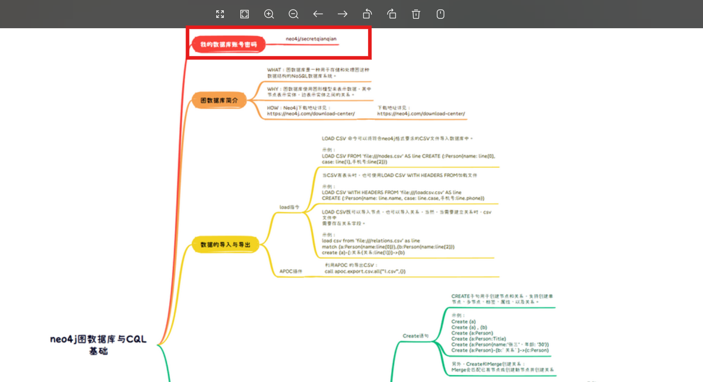

<font style="color:rgb(82, 196, 26);">secretqianqian</font>

### <font style="color:#000000;">27.neo4j数据库版本是多少(格式：1.1.1)</font>
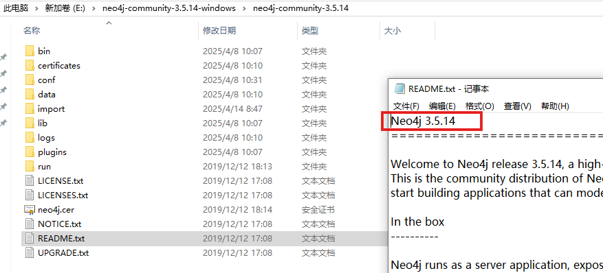

<font style="color:rgb(82, 196, 26);">3.5.14</font>

### <font style="color:#000000;">28.起早王的虚拟货币钱包的助记词的第1个是什么(格式：abandon)</font>
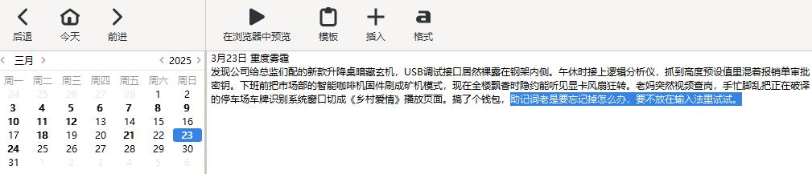

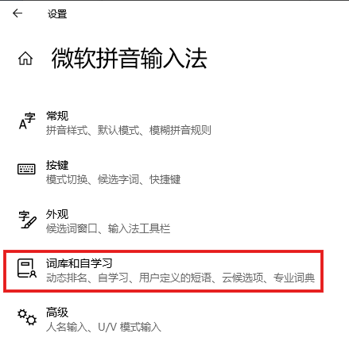


<font style="color:rgb(82, 196, 26);">flash</font>

### 29.neo4j数据库内邮箱名“[<font style="color:rgb(106, 120, 202);">g.ltd@elcvxzfy.pro</font>](mailto:g.ltd@elcvxzfy.pro)”的人手机号是什么(格式：12345678901)
没有在文件中找到打开方式。网上搜一下：

1.在命令行输入**neo4j.bat console**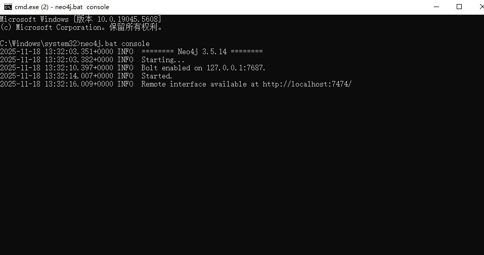

2.在跳出的命令行中将网址复制到edge里

[http://localhost:7474/](http://localhost:7474/)

3.26题已知

用户名：neo4j  

密码：secretqianqian


<font style="color:#000000;">g.ltd@elcvxzfy.pro</font>


万一数据很多找不到，可以直接Ctrl+F搜索

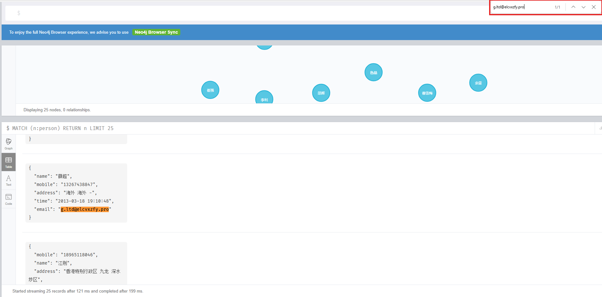<font style="color:rgb(82, 196, 26);">13267438847</font>

### 30.起早王的虚拟货币钱包地址是什么(格式：0x11111111)


熟悉的以太坊钱包MetaMask


28题的助记词发现可以重置密码

flash treat wide divide type plug garlic draft infant broom desert useful


<font style="color:rgb(82, 196, 26);">0xd8786a1345cA969C792d9328f8594981066482e9</font>

### 31.起早王请大神为倩倩发行了虚拟货币，请问发给起早王倩倩币的钱包地址是多少。(格式：abcd1234······)
上网搜索得到，这种虚拟货币一般都在“区块链平台”上面发售

[区块链浏览器查询 | 欧科云链 OKLink](https://www.oklink.com/zh-hans)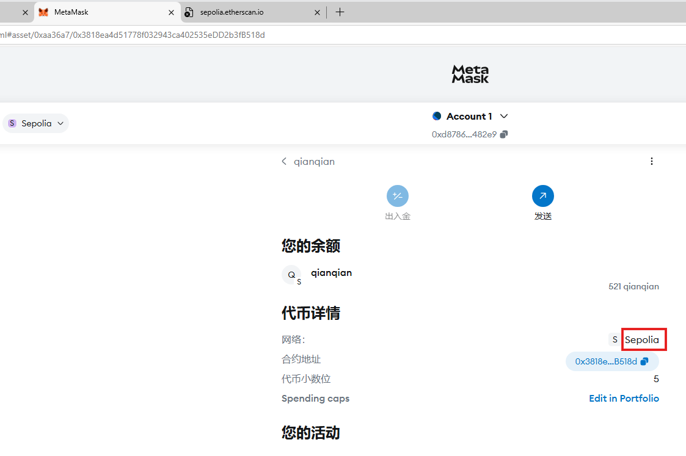

Sepolia网络

<font style="color:#000000;">0xd8786a1345cA969C792d9328f8594981066482e9</font>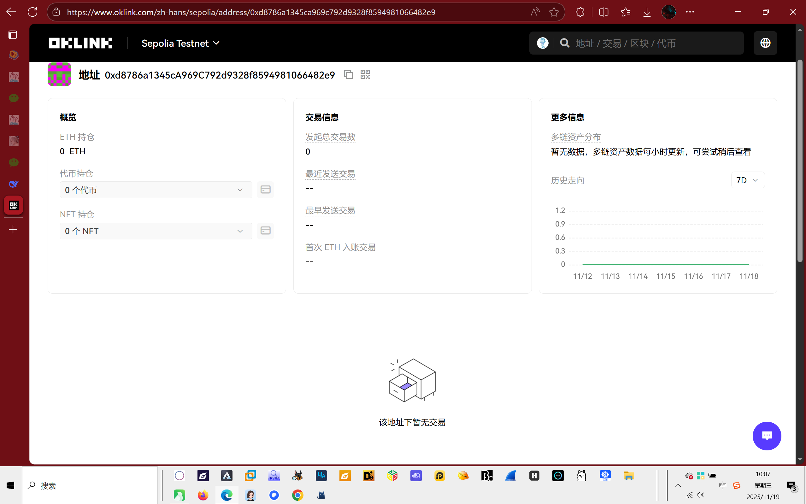现在看没了。很奇怪

正常来说是这样的

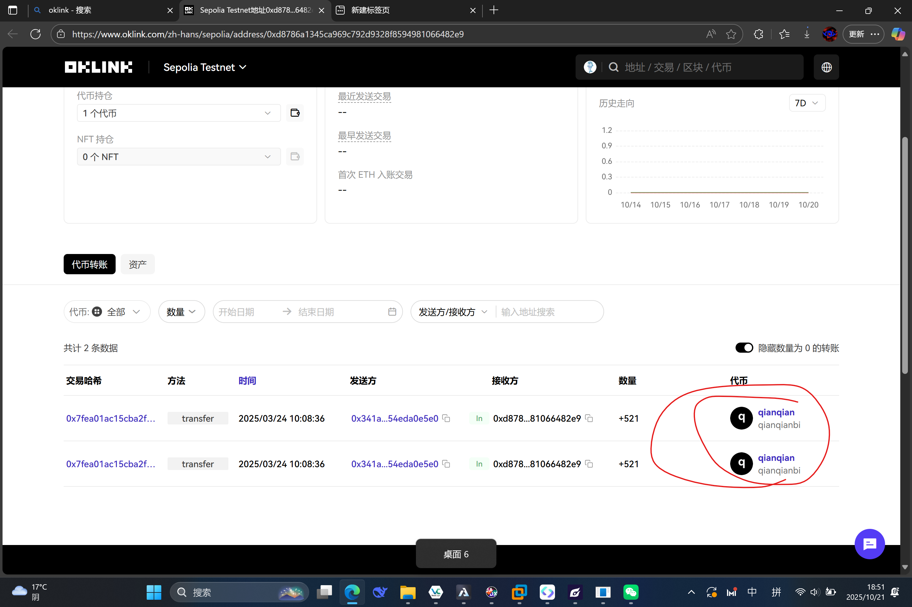

其实还有一个看的地方

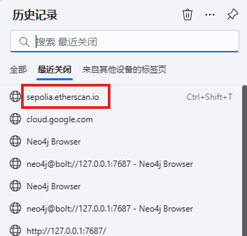

[https://sepolia.etherscan.io/](https://sepolia.etherscan.io/)

别问为什么登不上，问就是就是网络问题

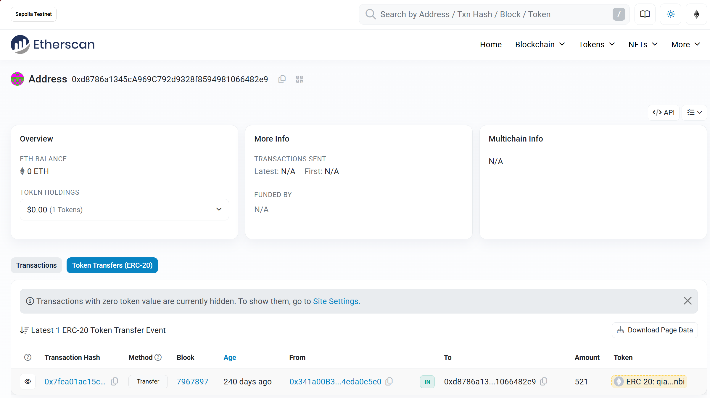

<font style="color:rgb(82, 196, 26);">0x341a00B352AAd430ab38151447a20E54eda0e5e0</font>

### 32.起早王请高手为倩倩发行了虚拟货币，请问倩倩币的最大供应量是多少(格式：114514)
这里换种方式。直接搜倩倩币

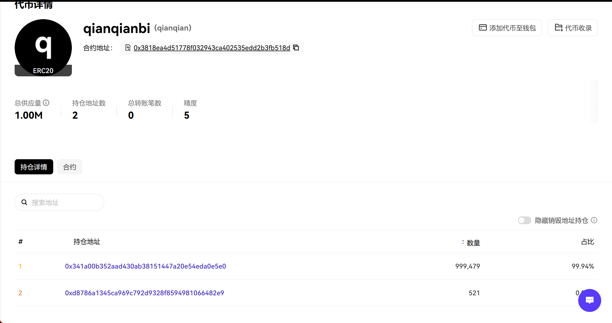

<font style="color:rgb(82, 196, 26);">1000000</font>

