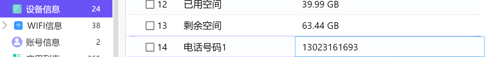
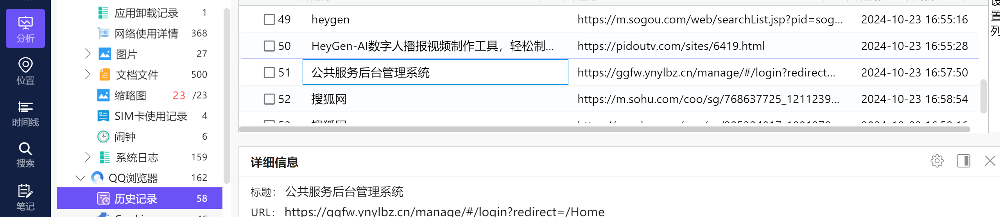
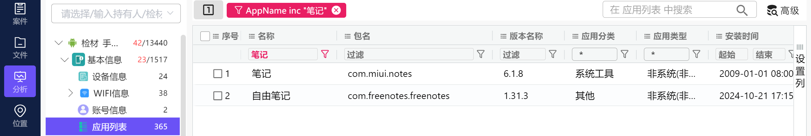
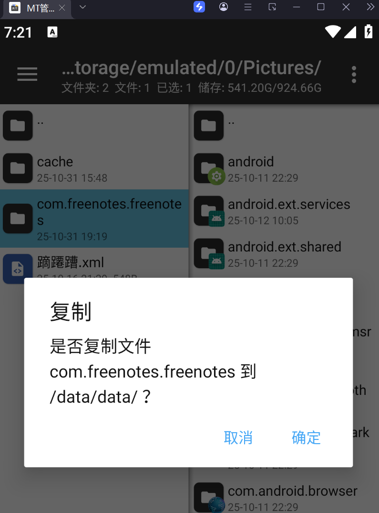
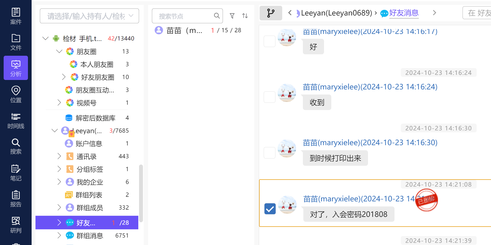
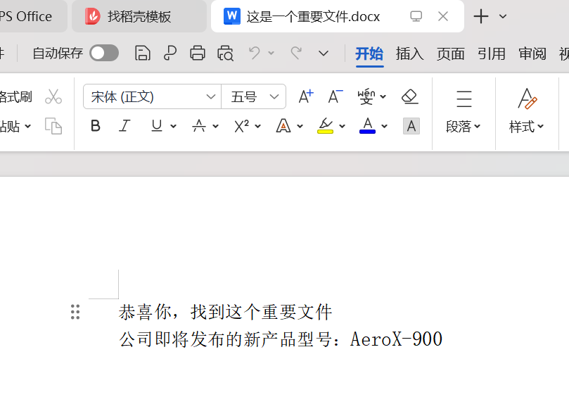
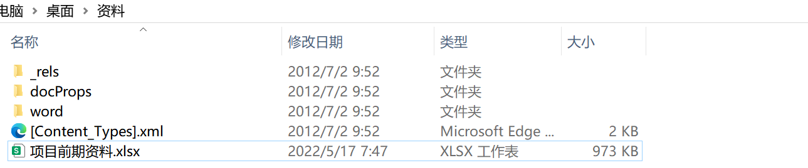

## 一、手机取证
### 1.请找出嫌疑人的手机号
13023161693

### 2.嫌疑人曾经访问的公共服务后台管理系统的 URL 是？（答题格式：https://abc/...）

 https://ggfw.ynylbz.cn/manage/#/login?redirect=/Home

### 3.找出嫌疑人在笔记中记录的接头地点；（答案格式：需与实际完全一致）
首先找手机里的笔记软件一个是自带的，一个是后装的，首先看后装的。

翻找数据库，无收获。

尝试用检材数据覆盖，这很关键，必须学会！！！

安装到模拟器后，将备份里的文件拷贝到相应的目录，如db=databases，f=files

进入模拟器，打开文件管理，进入**/data/data**

### 4.找出嫌疑人的接头暗号；（答案格式：需与实际完全一致）

### 5.找出嫌疑人 10 月 23 日开的腾讯会议的入会密码
201808

### 6.找出嫌疑人公司即将发布的新产品型号；（答案格式：需与实际大小写完全一致）

类似19500000的八位密码，爆破

压缩包密码20001027

AeroX-900

### 7.找到嫌疑人曾经发送的项目前期资料文件，计算其 SHA256；（答案格式：如遇字母全大写）
后缀改为zip，解压得：2425440B48170763AEA97931D806249A298AFAC72A4BED92A6494E6789ACDA19

### 8.嫌疑人曾进行过一次交易，请问嫌疑人与转账的接收者什么时候成为好友？（答案格式：2021-01-01 01:01:01）
2024-10-23 15:33:21

### 9.写出嫌疑人钱包账户的导入时间；(北京时区，答案格式：1990-01-01 01:01:01)

熟悉的以太坊钱包

  
 

