## 前言
挂载密码：}2N|n_yxdt!G/Ru}|_zdn$@?6@CD8E

看网上wp，说这次出题人把有关题目的部分图片全给在缓存里了

 位置：/media/0/Android/data/com.miui.gallery/files/gallery_disk_cache/full_size  
 （**用X-ways的话要把.dd改成.tar**，不然看不了）

容器 SHA-256: c0b92e1d2f22e26b9ff22451e49e23cd5b6e7ec4a4b655f4698d36faf162d8b0

## 一、手机取证
### 1.登录的直播APP的IDX是什么？[标准格式：25236541]

找数据库。db里用包名**com.huodong.yanyu过滤**

** **在**miao.db**的**login**里面找到了idx的值 

35248617

### 2.目前直播的等级名称是什么？[标准格式：碌碌无为]
法一：火眼OCR图片文本识别工具

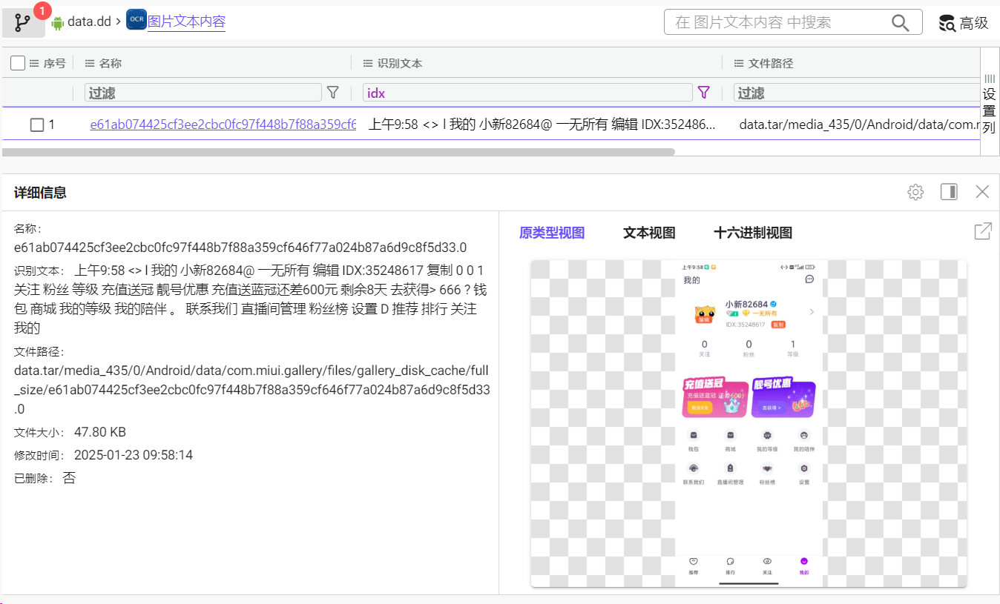

法二：根据useridx的值，进一步找到烟雨直播的**缓存文件**。

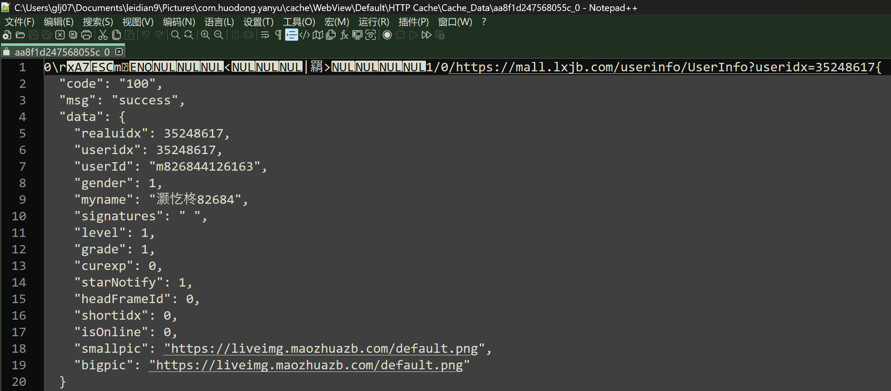

通过https://mall.lxjb.com/userinfo/UserInfo?useridx=35248617得到用户信息和等级：

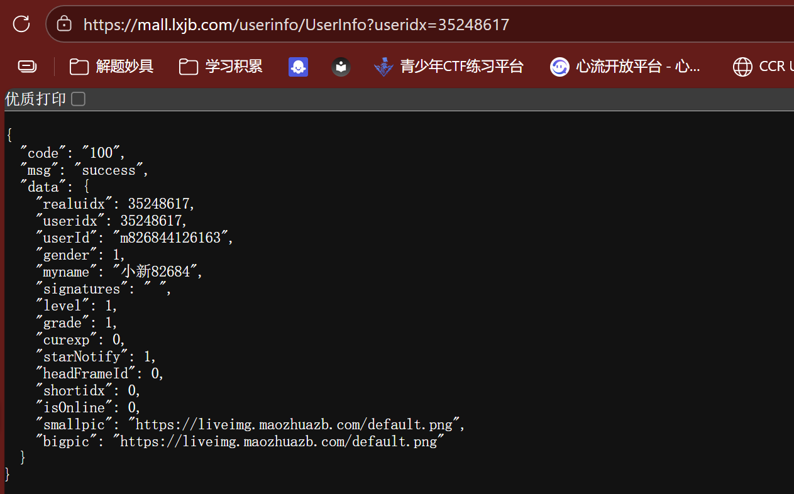

level

安装烟雨直播，注册账号查看，等级1的账号等级名称为：

一无所有  
法三：

1.找到含嫌疑人的软件数据的文件夹。

雷电模拟器内Ctrl+5打开共享文件夹，导入嫌疑人的含软件数据的文件夹。

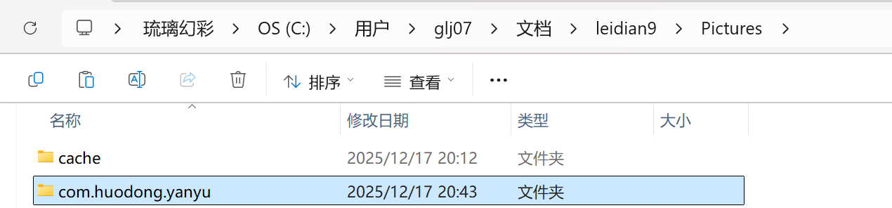

MT管理器：左边共享文件夹，右边/data/data

左键长按复制包到/data/data。

一般来说是可以的。但是这个应用不行。

一无所有

### 3.地图中哪座山有绝望坡

3个地图软件。最后是在白马地图shared_prefs目录中发现搜索历史：

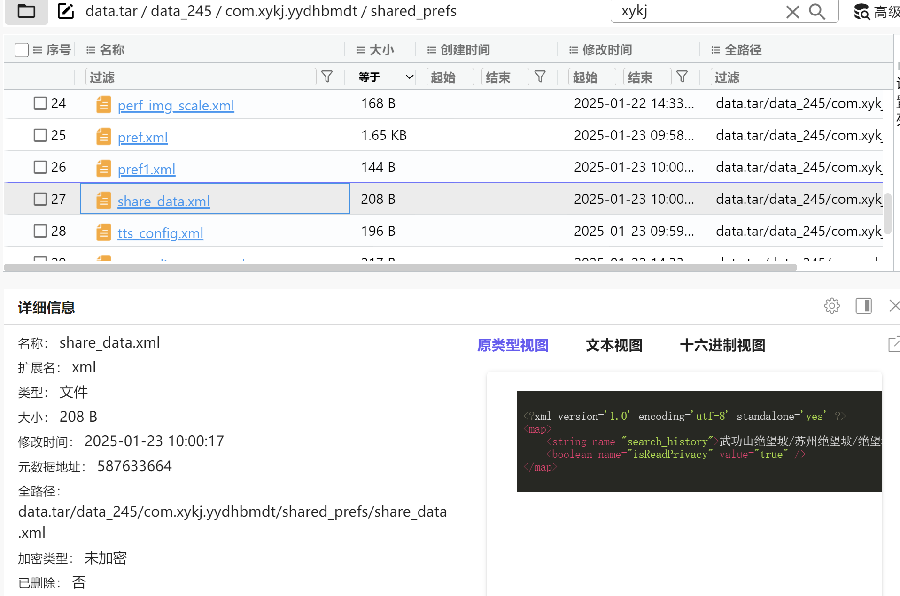

武功山

### 4.手机的历史 SIM 卡中, 中国电信卡的 IMSI
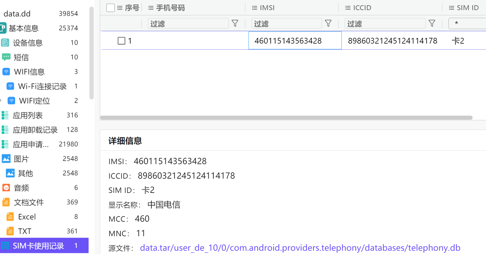

460115143563428

### 5.1月22日16:40的会议号是多少？[标准格式：xxx-xxx-xxx]

法一：筛选

输入20250122搜索定位

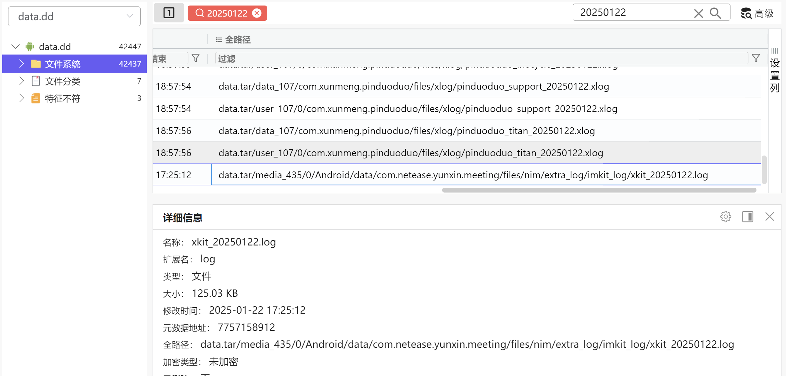

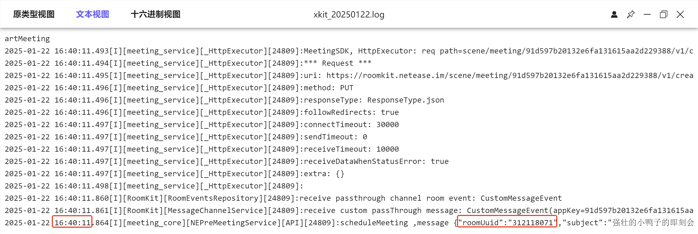

法二：仿真数据

 依旧借助MT管理器，覆盖数据进/data/data。直接查看：

这个软件仿真成功了。

312-118-071

### 6.网易会议中个人会议号是多少？[标准格式：2523654199]

267-982-3922

### 7.记账软件中一共记了几笔？[标准格式：9]
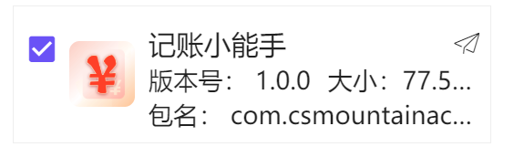

查看数据库

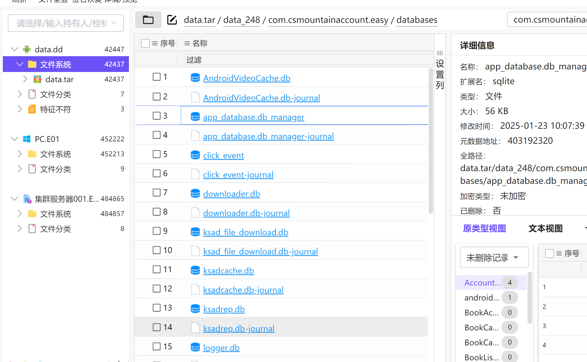

4

### 8.谁给了机主100000？[标准格式：某某]
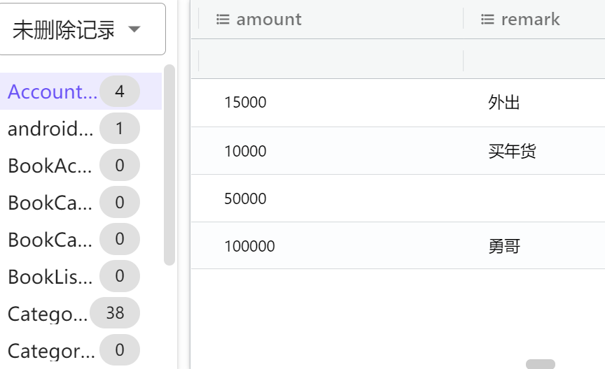

勇哥

### 9. 聊天软件是否需要手机号登录？[标准格式：填写是或者否]
翻下来只有这个聊天软件

夜神模拟器查看登录页面，发现不需要手机

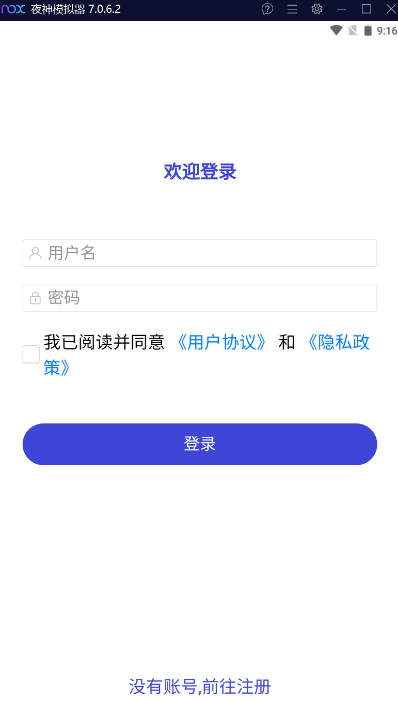

否

### 10. 机主的给对方的活有多少钱？[标准格式：1万]
聊天软件已知，肯定看聊天记录。老规矩，翻找数据库。

value一列自适应显示。发现聊天记录：

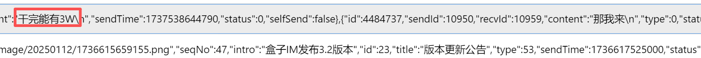

3万

### 11. 机主的手机号是多少？[标准格式：13652492155]
网易会议的日志里有：

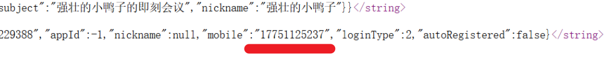

17751125237

### 12. 手机的IMEI1后四位是多少？[标准格式：2536]

1055

### 13. 手机上一共有几个地图软件？[标准格式：9]

3

## 二、计算机取证
### 1.网卡的Mac地址是多少？[标准格式：XX-XX-XX-XX-XX-XX]

 计算机安装了 2 张物理网卡。选第一个的原因：

法一：仿真， `ipconfig` 查看**默认网卡**

法二： Windows Registry Recovery 查看 `ROOT\ControlSet001\Services\Tcpip\Linkage` 中存储的网卡绑定顺序: 。

最后选择第一个。

00-0C-29-BF-8B-30

### 2. 系统内部版本号是多少？[标准格式：12345]

 18363

### 3. 计算机系统开机密码是多少？[标准格式：根据实际值填写]
看便签

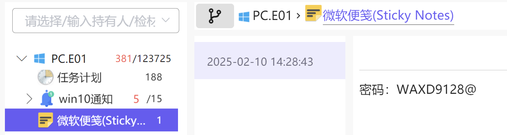

 WAXD9128@  

###  4.分析计算机检材中手机流量包，黑客虚拟身份的密码是什么？
仿真查看：

这个**.saz**就是Fiddler的存储文件，Fiddler加载文件, 搜索"login"关键字

a12345678

### 5.分析计算机检材中手机流量包，黑客人员使用的夜神模拟器的手机型号是什么？

夜神是NOX

搜索"device", 在命中流量包中看到向 NOX 的服务器发送的模拟器信息：

model就是型号。

SM-G955N

### 6.分析计算机检材中手机流量包，黑客看视频的时间是几月份？
搜索video

May。

5

### 7.分析计算机检材中手机流量包，“天戮宇宙”出自哪个小说平台？
搜索book。点开图像翻找。

仔细看图，虽然很糊

起点中文网

### 8.在手机模拟器中勒索软件 APK 包的 sha256 值是多少？

### 9.接上题，勒索软件的解锁密码是什么？

### 10.signed_xz.exe 程序 SHA1 后 6 位是什么？

### 11.signed_xz.exe 程序中的函数名为 curl_version_info 的函数地址是什么？

### 12.signed_xz.exe 程序中节名为 .reloc 的虚拟地址是什么？

### 13.澳门新葡京 APK 包名是什么？
com.suijideszzuiji.cocosandroid

### 14.澳门新葡京 APK 是否加固，加固则说明是什么加固？
由上图得。

未加固

### 15.澳门新葡京 APK 是否会往手机的 SD 卡中写入数据，若是则该权限的名称为？
法一：现成工具

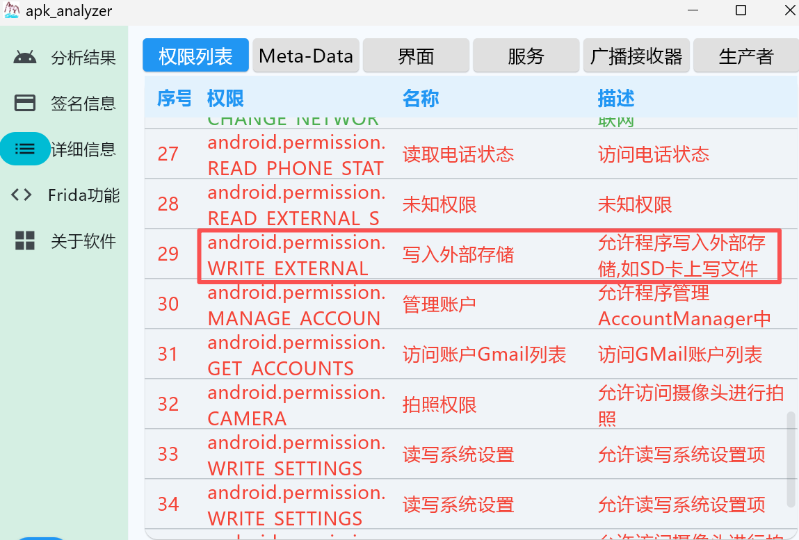

法二：在 JEB 中查看 Manifest:

android.permission.WRITE_EXTERNAL_STORAGE

### 16.澳门新葡京 APK 登录的 api 地址是什么？
在 JEB 中查看 Manifest, 找到应用的 MainActivity:

### 17.澳门新葡京 APK 其中关于腾讯运营商的服务留存的 QQ 号是多少？

### 18.请分析 Navicat 中 root 用户的密码是什么？

##  服务器取证
## 服务器重构
集群服务器，三个全部仿真

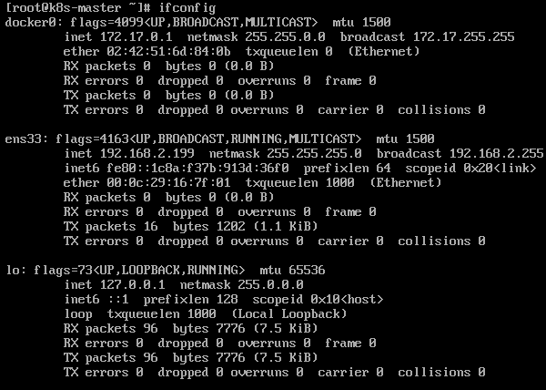

192.168.2.199

另两个同理

| HostName | IP |
| --- | --- |
| k8s-master | 192.168.2.199 |
| k8s-node1 | 192.168.2.200 |
| k8s-node2 | 192.168.2.201 |

将 VMware 的 NAT 虚拟网卡的网段设置为与服务器内静态 IP 一致的 `192.168.2.0/24`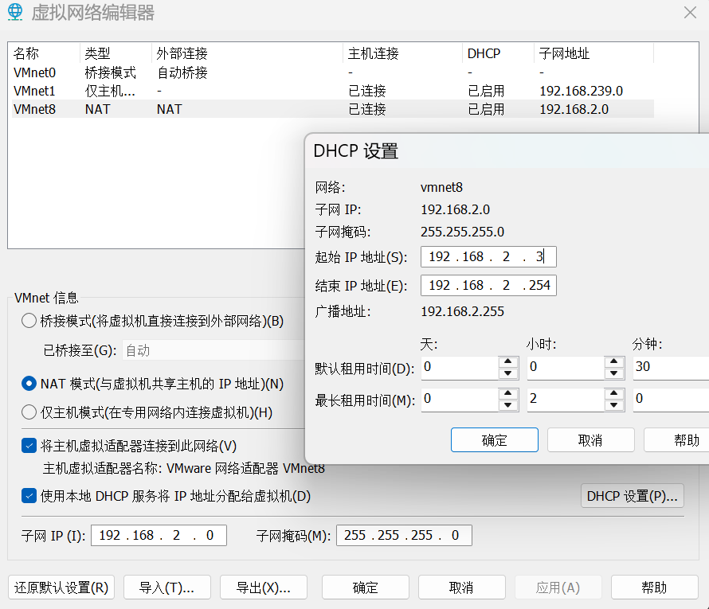

`systemctl status sshd`，发现sshd处于激活状态

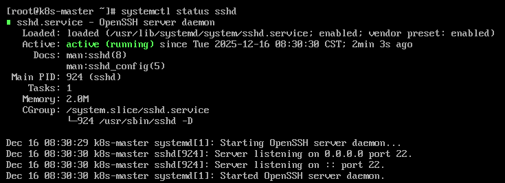

但hexhub连接失败

这是因为火眼安全模式：

把网络连接模式从**仅主机**改为**NAT模式**

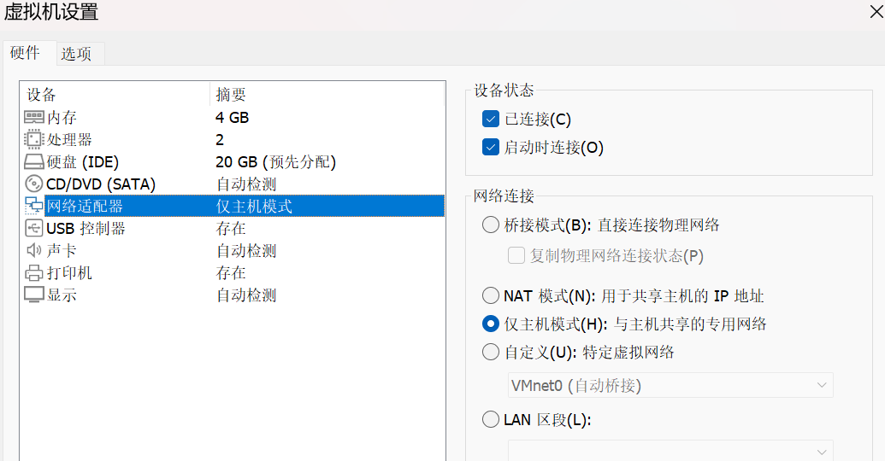

以后记得火眼仿真时在高级设置里选择NAT模式。

###  1.该集群主节点操作系统版本是什么？
法一：火眼

法二：`cat /etc/redhat-release`

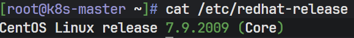

 7.9.2009

### 2. 该集群创建时间(GMT)是什么时候？[格式：2025-08-19 21:48:21]  
`kubectl get nodes`被拒绝：

`kubeadm` 查看证书信息, 发现证书已过期:  

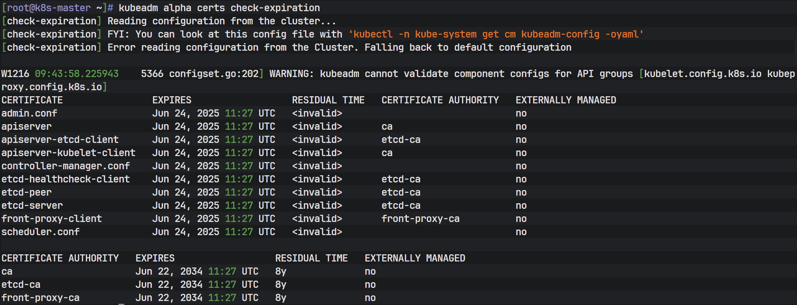

法一：k8s-kubeadm证书过期续订解决方法:

[https://blog.csdn.net/Harry_z666/article/details/128015175?spm=a2c6h.12873639.article-detail.4.47e41d1eQGQQwU](https://blog.csdn.net/Harry_z666/article/details/128015175?spm=a2c6h.12873639.article-detail.4.47e41d1eQGQQwU)

 法二：重新火眼仿真, 在高级设置中指定系统时间（不过期就行）:  

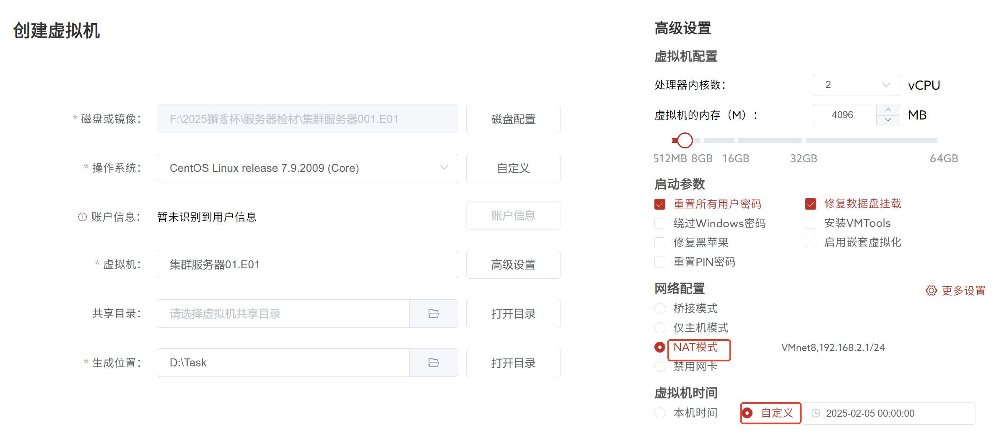

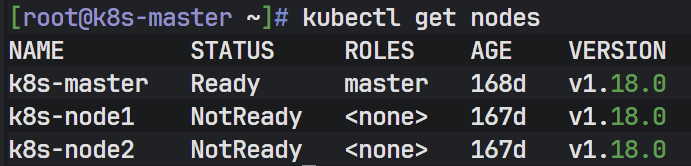

`kubectl describe node`  

**法一：**`**kubectl cluster-info dump**`

**法二：**参考了xc大王的wp

`**kubectl get namespace default -o yaml**`

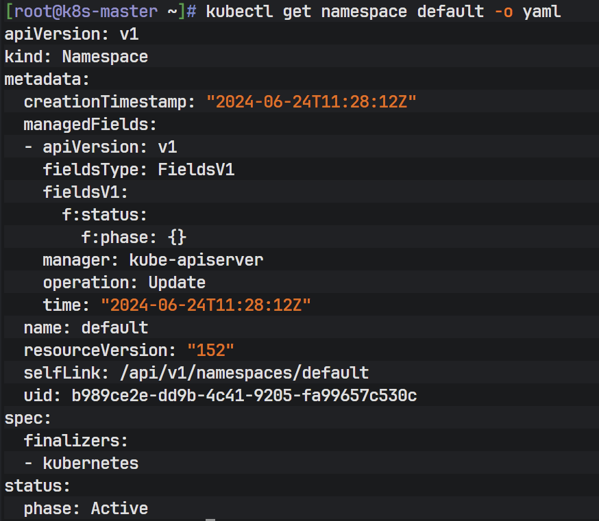

原因：

  
namespace比nodes更早  
什么是nodes？什么是namespace？  
**1. Node（节点）**  
Kubernetes 集群中的 **工作机器**（物理服务器或虚拟机），用来运行你的应用程序。  
e.g.你的 Kubernetes 集群有 3 个节点，相当于 3 台服务器在干活。  
**2. Namespace（命名空间）**  
Kubernetes 里的 **逻辑分组**，用来隔离不同的项目、团队或环境。

 2024-06-24 11:28:12

###  3.该集群共有多少个命名空间？ 
`kubectl get namespace`

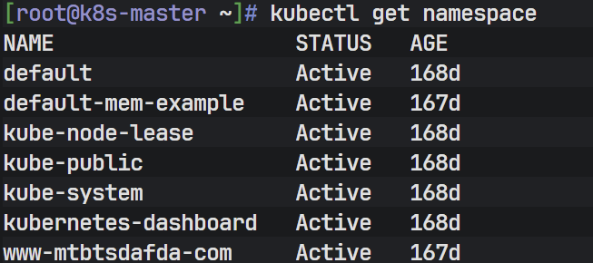

7

### 4.该集群所有命名空间内总共有多少个 pod？
需要修复 2 个 Node 节点才能获取到全部的 pod 信息.

查看 2 个 Node 节点的 kubelet 服务状态, 发现服务无法正常启动:

###  5.该集群所使用的 cni 网络插件及其版本是什么？  

### 6.打金平台的后台登录地址跳转文件是？[标准格式：abc.php]

###   
7.打金平台密码加密算法是？[标准格式：abc]
###   
8.打金平台中"13067137585"用户的累计产量有多少？[标准格式：100.00]
###   
9.打金平台会员组最高溢价比例是多少？[标准格式：10.00]
###   
10.打金平台会员推广人数最多的会员其姓名是？[标准格式：名字]
###   
11.打金平台最早一次备份数据库的时间（Asia/Shanghai）是？[标准格式：2024-01-01-01:01:01]
###   
12.金瑞币（JINRUI COIN）平台图片上传平台是哪种类型？[标准格式：腾讯云ABC]
###   
13.金瑞币平台手机直充接口是什么？[标准格式：http://xxx.xxx.xxx/xxx]
###   
14.金瑞币平台后台登录地址是？[标准格式：http://xxx/xxx/xxx.xxx]  
15.金瑞币平台中密码加密盐值是？[标准格式：AbC1d]
###   
16.金瑞币平台中交易手续费是百分之多少？[标准格式：100]
###   
17.金瑞币平台中目前有几种充值方式？[标准格式：100]
###   
18.二号集群节点有源代码的网站目录有几个？（正在运行的除外）[标准格式：1]
###   
19.二号集群节点memcached端口是？[标准格式：100]
###   
20.盲盒平台中余额最多的用户是？[标准格式：AbC1d]  
21.盲盒平台可选二级域名有多少个？[标准格式：100]
###   
22.盲盒平台的支付密钥是？[标准格式：AbC1d]
###   
23.盲盒平台中拥有分站的用户名是？[标准格式：123abc]
###   
24.借贷平台（www.jiedai0rmr.com）中验证码发送接口域名是？[标准格式：http://xxx.xxx.xxx/]
###   
25.借贷平台后台登录密码的加密算法中共使用了多少次hash函数加密？[标准格式：10]
###   
26.接上题，借贷平台中后台登录的密码额外加密字符串？[标准格式：123ABc+]
###   
27.借贷平台中一共有多少借款订单？[标准格式：100]
###   
28.借贷平台中"包玉莲"的收款卡号是？[标准格式：1000]
###   
29.借贷平台中贷款最大限额是多少？[标准格式：100]
###   
30.请综合该集群一共有多少个网站数？[标准格式：100]
###   
 
