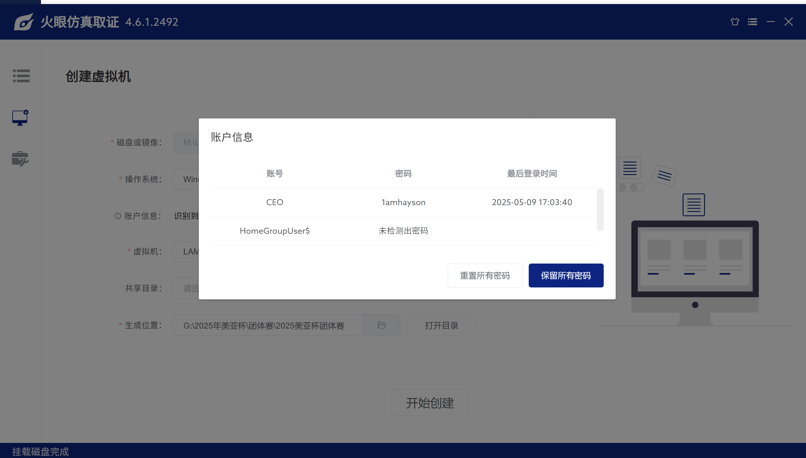

## 案件介绍

警方调查发现一宗虚拟货币投资诈骗案件, 涉及"优盛金融控股有限公司"(Manson Finance Holding Company)旗下的一项投资计划. 据该公司首席执行官林嘉熙表示, 该计划目前仍处于筹备阶段, 但是财务总监梁雪媚则称她在一次线上会议上, 收到林嘉熙的指示启动该计划. 林嘉熙对此坚决否认, 同时指出他从未参与相关的线上会议并提供了充分不在场的证明, 证明其当时正在外地休假, 同时怀疑有人利用 AI 变面技术参与公司的线上会议. 经初步调查, 警方相信案件背后涉及一个由密码学与隐写术爱好者组成的犯罪团伙. 请各参赛队伍根据所提供的资料, 深入分析各类线索, 并承接个人赛已掌握的证据还原案件真相, 设法破解被刻意隐藏的加密钱包登录资料, 为受害人追回损失. 背景资料 优盛金融控股公司(Manson Finance Holding Company)于 2025 年初在注册成立, 主营业务为金融业跨业整合投资, 控股范围包括信托业、证券业、期货业、创投业、外汇融资等, 近期计划拓展业务. 男子 LAM Ka-hei(林嘉熙), 英文名为 Hayson, 40 岁, 已婚, 香港出生, 在优盛金融控股公司任职首席执行官. 林嘉熙先生计划开发加密货币投资项目, 项目由财务总监梁雪媚小姐领导的销售团队进行市场调研及筹划. 女子 LEUNG Suet-mei(梁雪媚), 英文名为 May, 45 岁, 已婚, 香港出生, 在优盛金融控股公司任职财务总监. 梁雪媚小姐领导销售团队进行加密货币投资项目市场调研及筹划. 男子 WONG Chi-wah(黄智华), 英文名为 Titus, 30 岁, 已婚, 香港出生, 在优盛金融控股公司任职信息技术部主管, 负责管理公司的计算机及网络系统. 为配合公司发展, 将公司客户资料及其财务状况整合到人工智能系统, 授权员工可通过公司网页直接查询相关资料, 并利用人工智能进行大数据分析. 附加资料 梁燕玲与陈民浩为同居情侣关系 梁燕玲通过陈民浩认识冯子超 三人均为密码学(Crypto)及隐写术(Stego)爱好者 陈民浩经常驾车接载三人前往郊区聚餐, 并一同钻研相关技术话题

## 检材下载

下载链接：[https://pan.baidu.com/s/1cnGvrFoMa1m6o-W50MU20A?pwd=481p](https://pan.baidu.com/s/1cnGvrFoMa1m6o-W50MU20A?pwd=481p)

哈希值：`F919932C3279518CBA1700C590AFF374B739679C51226B38EC65BBEA698351ED`

挂载密码：`ZgxQaeiAUe3nrnZ9zEnI3nAxuPIrIPl9`

