# 前言：

**案情介绍**
警方接获报案，前往西贡布袋澳处理一宗“伤人”事件。经初步调查，怀疑男子陈民浩以木棍袭击男子冯子超，导致冯子超头部受伤昏迷。冯子超已被送往医院救治，陈民浩则因涉嫌“伤人”罪被警方当场拘捕，被捕后一直保持缄默，拒绝交代案情细节。 进一步调查显示，两人冲突疑因女子梁燕玲而起。根据现场迹象推断，梁燕玲曾于事发时在场出现，经警方多方搜索后，至今仍未能与她取得联络。请参赛者根据提供的资料，深入分析线索，寻找梁燕玲下落，并还原事件真相。 Green Technology Supply Co. Ltd.（绿创科技系统有限公司）为本港网络工程公司，主要业务是为企业客户铺设网络服务及安装各类服务器。 男子 FUNG Chi-chiu（冯子超），英文名为Duncan，30岁，未婚，香港出生，在Green Technology Supply Co. Ltd.任职工程师。 男子 CHAN Man-ho（陈民浩），英文名为Hogan，35岁，未婚，香港出生，在Green Technology Supply Co. Ltd. 任职系统工程师。 女子 LEUNG Yin-ling（梁燕玲），英文名为Ling，28岁，未婚，香港出生，现为自由职业平面设计师。 梁燕玲与陈民浩为同居情侣关系 梁燕玲通过陈民浩认识冯子超 三人均为密码学（Crypto）及隐写术（Stego）爱好者 陈民浩经常驾车接载三人前往郊区聚餐，并一同钻研相关技术话题

**检材下载**

下载链接：[https://pan.baidu.com/s/1cnGvrFoMa1m6o-W50MU20A?pwd=481p](https://pan.baidu.com/s/1cnGvrFoMa1m6o-W50MU20A?pwd=481p)

哈希值：`SHA256: ba7a59bda48932ae5507c4872a0492ee080cd8e6222d9e86fad961038801826e`

挂载/解压密码：`FEYn0MJLYy9zTQRFHlXGRkVqXv3IkE8h`

# 前期工作：
直接导入苹果检材加载不出，首先想到找每个检材的manifest.plist，破解苹果备份密码。

密码从四位数开始试。

Chan

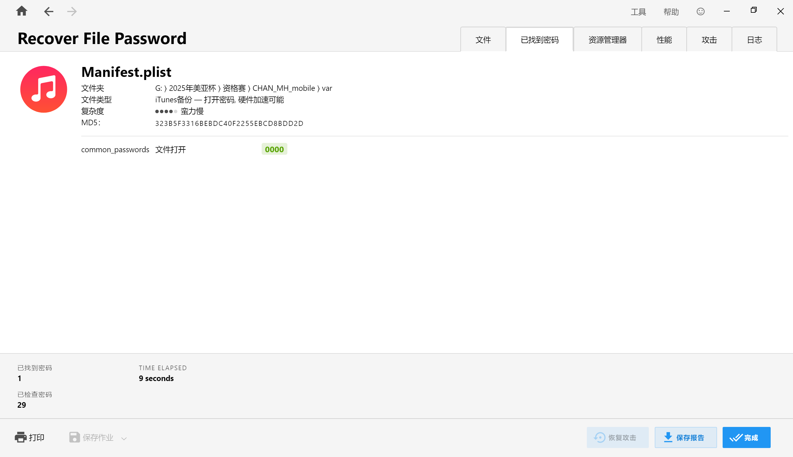

FUNG


Leung

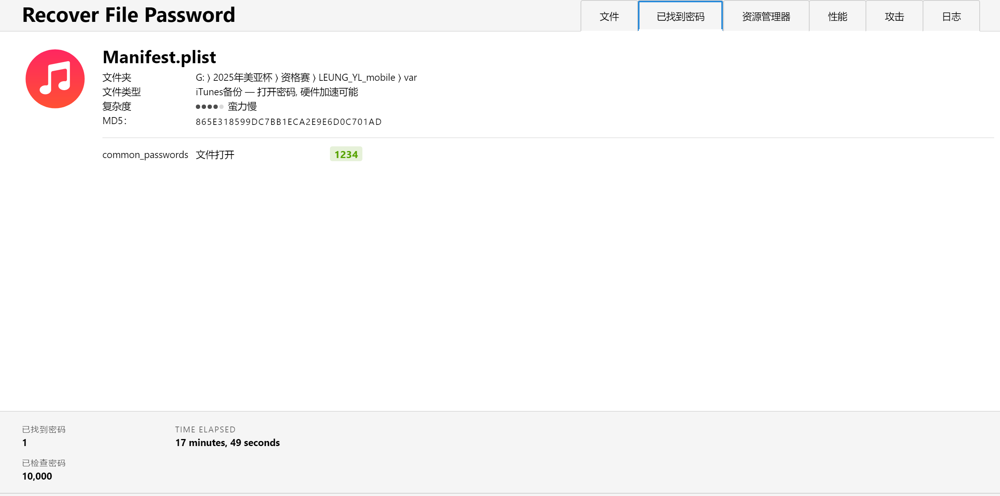

# 一、手机取证
### 1.请你使用CHAN_MH.zip检材回答以下问题这个智能手机是什么操作系统?  
A. iOS 17.1.1          B. iOS 17.2.1        C. iOS 17.3.1          D. iOS 17.0.1
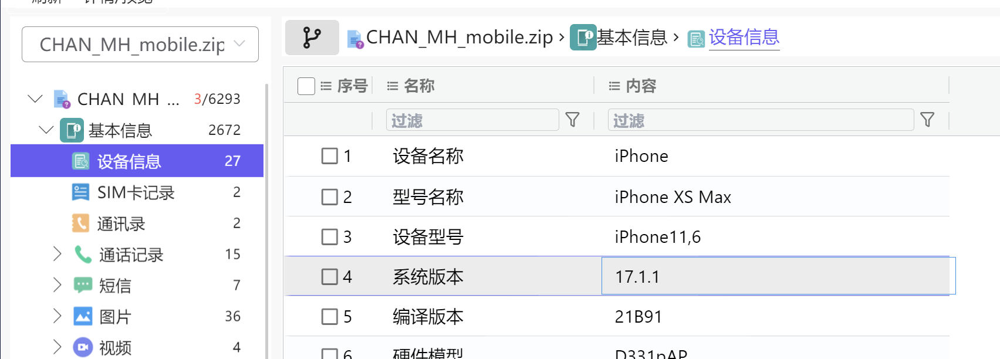

正确答案：A. iOS 17.1.1

### 2.在这个手机中，有多少组国际移动设备识别码(IMEI)号码? (请以阿拉伯数字作答)
IMEI全称InternationalMobileEquipmentIdentity

火眼只看到一个：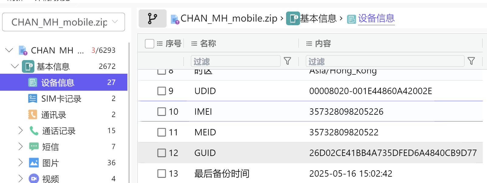

火眼查看的文件是/var/info.plist

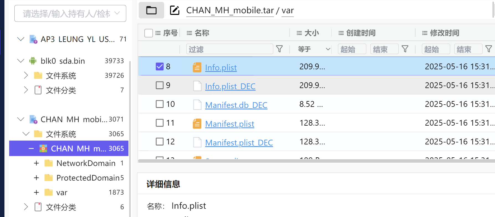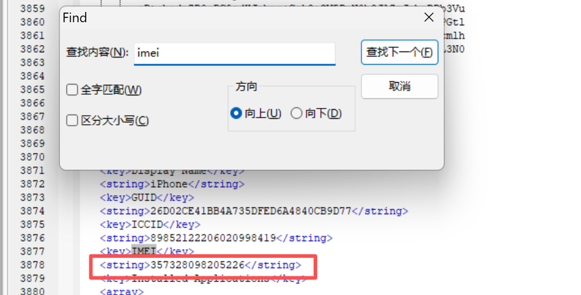

然而压缩包里有个iDevice_info.txt。里面显示两个IMEI：

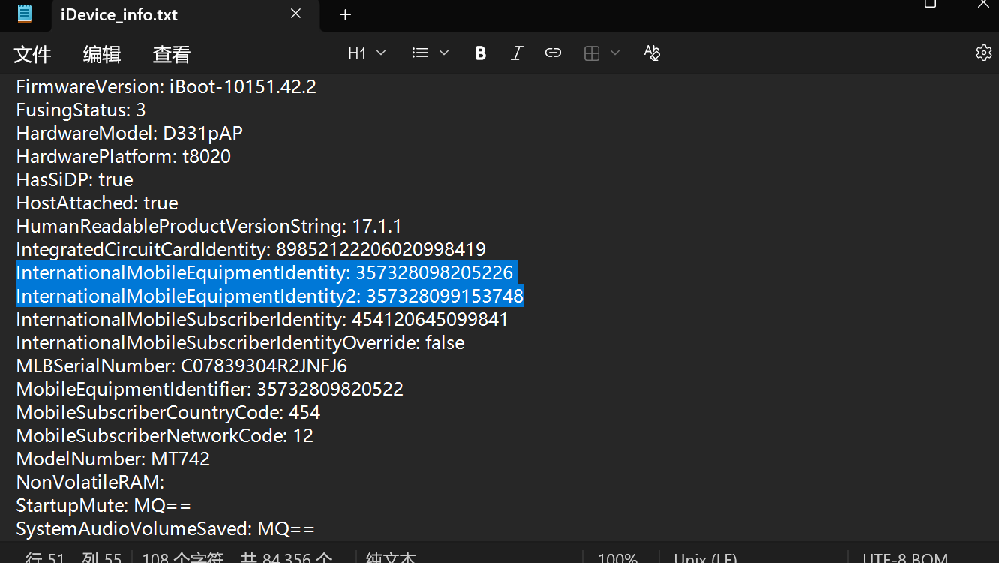

357328098205226 和 357328099153748

看下来可能是这个原因：/var/info.plist可能只读取了主 SIM 卡的 IMEI。
而iDevice_info.txt是 `ideviceinfo`（第三方取证工具）生成的汇总信息。这类工具会查询所有可用的 IMEI，因此更完整正确。

正确答案：2

### 3.承上题，以下哪一个才是正确的国际移动设备识别码(IMEI)号码?
A. 357328098205226     B. 357328097205226     C. 357328096205226     D. 357328095205226

如上所述。

正确答案：A. 357328098205226

### 4.请指出最后使用的使用者身分模组(SIM)的集成电路卡识别码(ICCID)
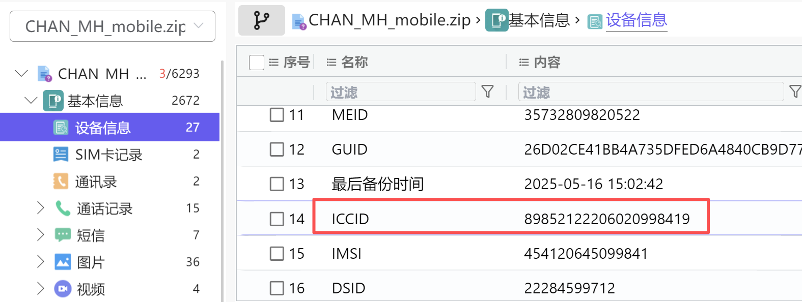

正确答案：A. 89852122206020998419

### 5.请指出最后使用的Apple ID是多少？(请依照参赛材料中的原文作答，注意区分大小写、空格及符号)
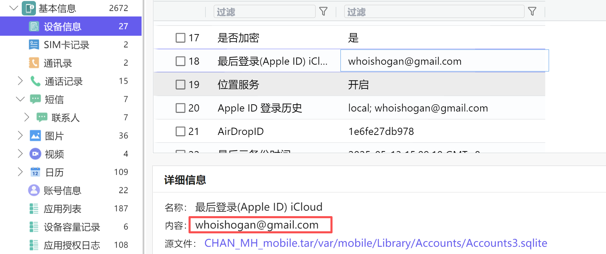

正确答案：whoishogan@gmail.com

### 6.蓝牙模组中的蓝牙地址是多少？(请以下格式作答:xx:xx:xx:xx:xx:xx)
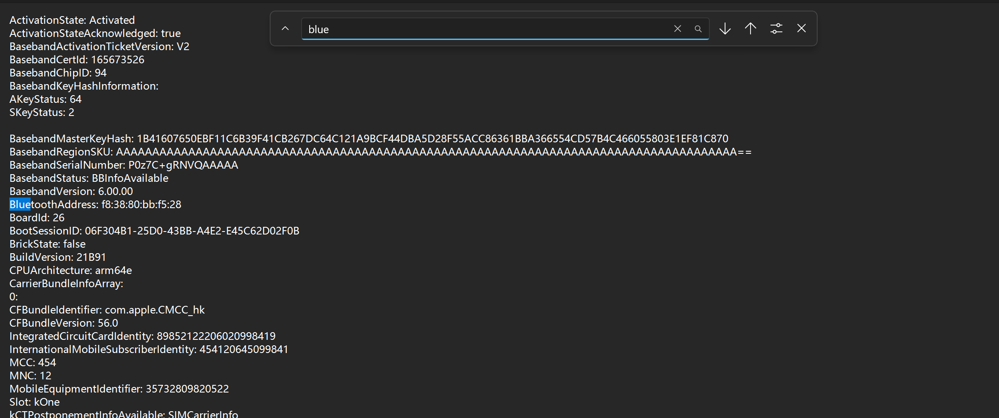

正确答案：f8:38:80:bb:f5:28

### 7.这个智能手机曾经启动「个人热点」分享网络，请问他的「热点」名称？(请依照参赛材料中的原文作答，注意区分大小写、空格及符号)
苹果手机热点名应该和设备名一样

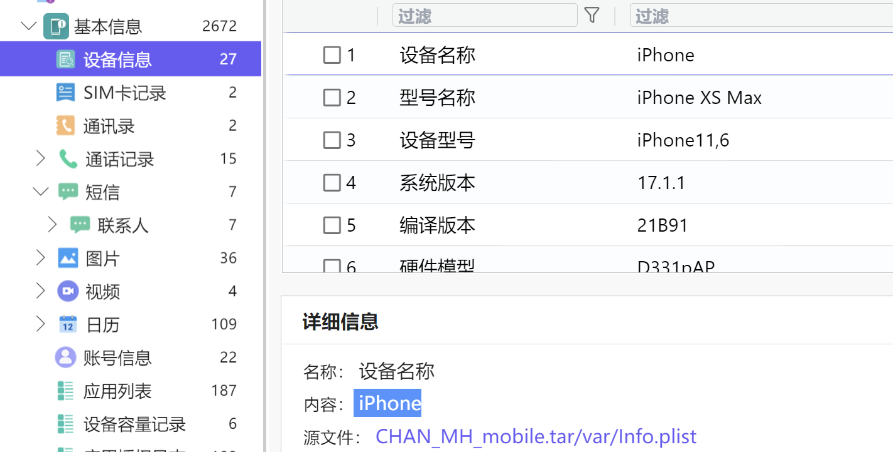

正确答案：iPhone

### 8.这个智能手机没有连接过以下哪一个服务集标识符(SSID)
A. Hongn Home        B. CMHK        C. 1010 free wifi         D. ErrorError

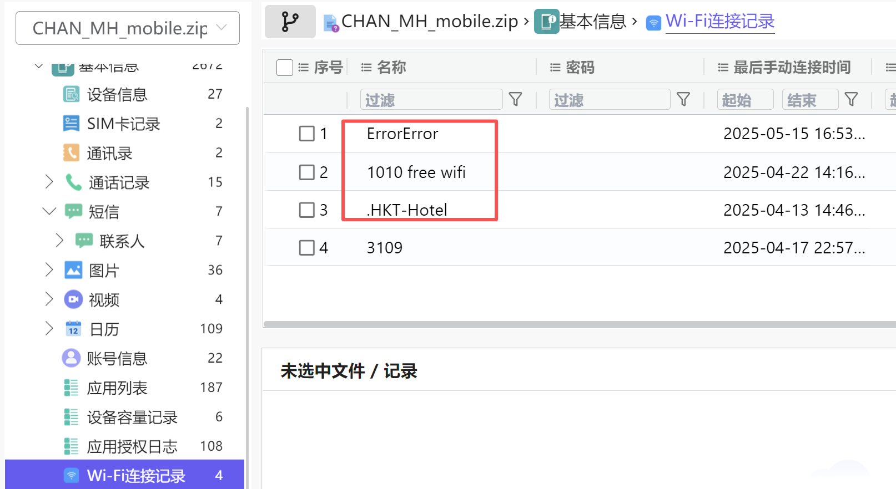

CD连接看得出来。B连接过是因为下一题提示了。

正确答案：A. Hongn Home

### 9.[美亚也没答案]请指出首次连接服务集识别码(SSID)名称为" CMHK"的无线区域网络(Wi-Fi)的日期及时间(请以GMT +8时区及以下格式作答: yyyy-MM-dd HH:mm:ss)
正确答案：正确答案

### 10.安装了以下即时哪个通讯软件?  i) WhatsApp   ii) WeChat    iii) WhatsApp Business    iv) QQ
A. 只有 i) 和 ii)       B. 只有 i), ii) 和 iii)       C. 只有 i), ii) 和 iv)        D. 以上皆是


正确答案：A. 只有 i) 和 ii)

### 11.承上题，请指出即时通讯软件"WhatsApp"的版本(请依照参赛材料中的原文作答，注意区分大小写、空格及符号)
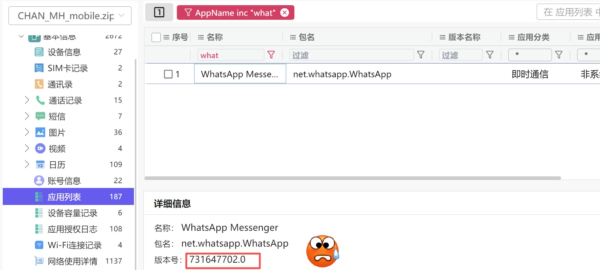

火眼参考的是var\Manifest.plist。


但是这版本号一看就不对。还得另寻他处：

火眼搜WhatsApp，找到plist搜索version：

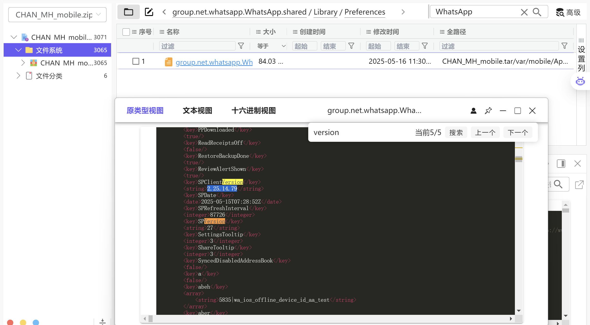

正确答案：2.25.14.79

### 12.陈民浩的手机中，总共安装3个文件传输软件，封包名称分别为com.apple.Sharing.AirDropUI、com.lenovo.anyshare、com.estmob.paprika，其中有哪一个软件曾经用来传送/接收文件功能?

A. com.apple.Sharing.AirDropUI   B. com.lenovo.anyshare   C. com.estmob.paprika

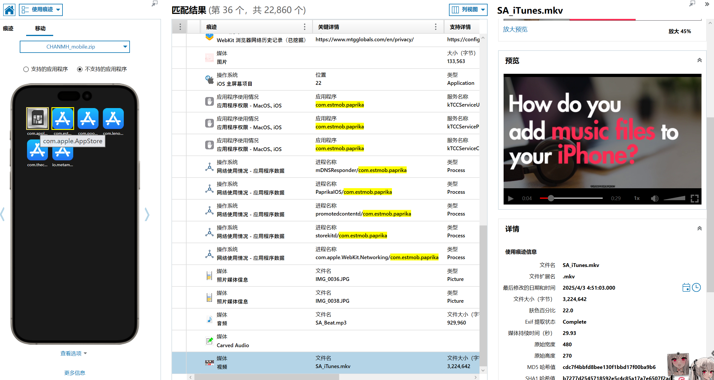

看到只有C是有传输的文件的。其他未找到

正确答案：C. com.estmob.paprika

### 13.承上题，与其有传送/接收过资料装置的装置ID是多少? (请依照参赛材料中的原文作答，注意区分大小写、空格及符号)
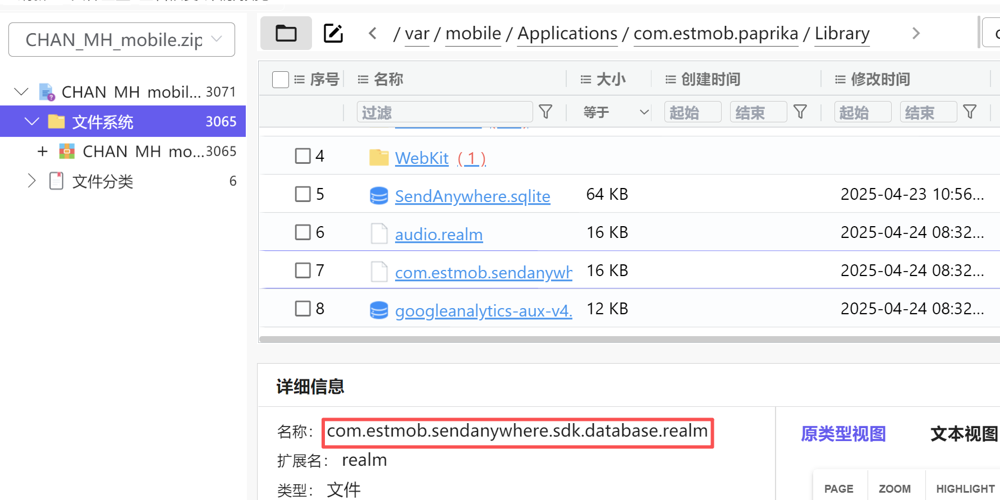

把realm文件复制到桌面。

用realm studio打开：

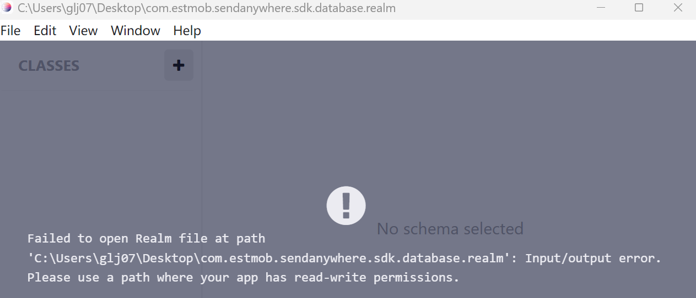

现在是只读模式，需要修改属性才能打开：

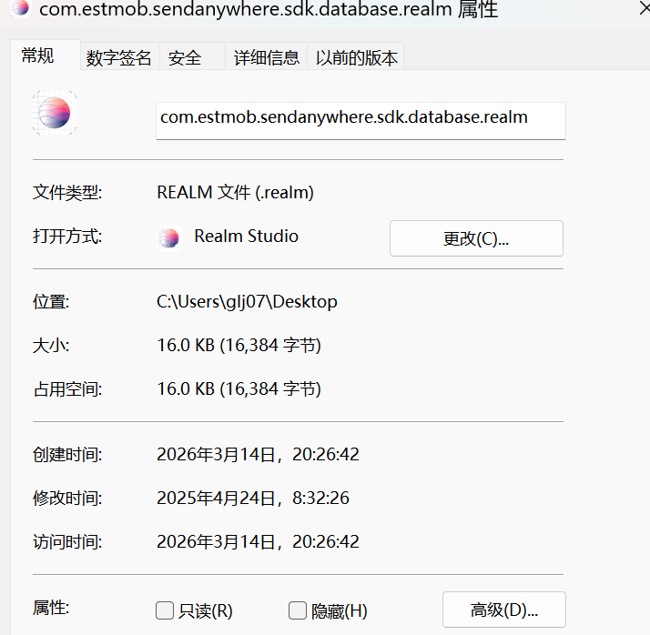

小细节：火眼文件夹下是锁上的，无法修改属性。因此分析时建议复制到桌面。

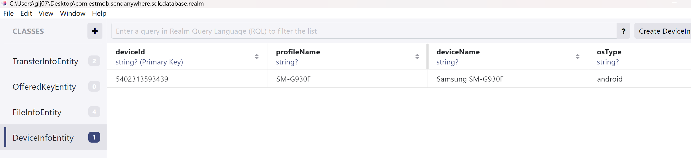

正确答案：5402313593439

### 14.承上题，这个装置名称是?(请依照参赛材料中的原文作答，注意区分大小写、空格及符号)

如上图所示。
也就是 blk0_sda.bin 这个设备

正确答案：Samsung SM-G930F

### 15.承上题，本机装置的装置ID是多少?(请依照参赛材料中的原文作答，注意区分大小写、空格及符号)

属性表里有：
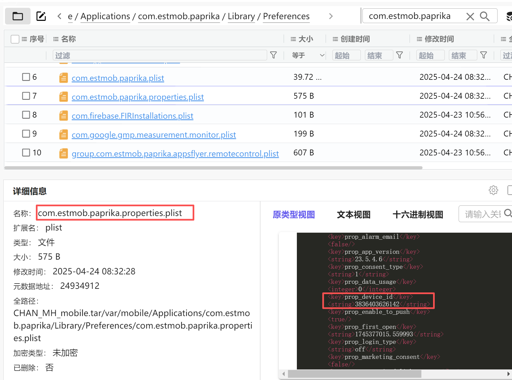
应用数据库也看到传输设备id
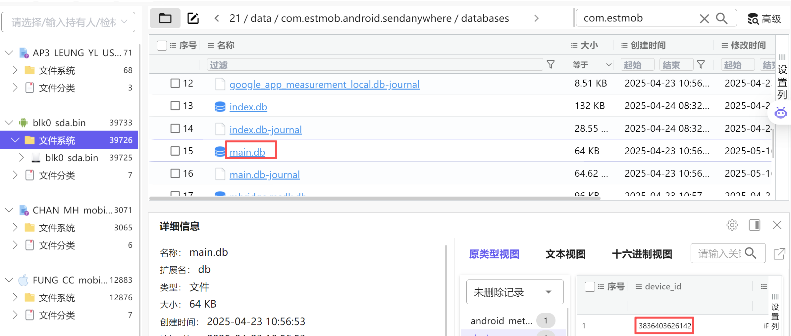

正确答案：3836403626142

### 16.承上题，陈民浩的手机(CHAN_MH_mobile.zip)是传送方或是接收方?

A. 传送方     B. 接收方      C. 传送及接收方

详见17、18题的分析，看到是安卓手机截的图，显然是由陈民浩的安卓手机发送给他的 iPhone 手机的:

正确答案：B. 接收方

### 17.根据传送档案的名称，判断是以下哪一类型? (单选)

A. 屏幕截图    B. 手机拍摄影片    C. PDF文件    D. zip压缩文件

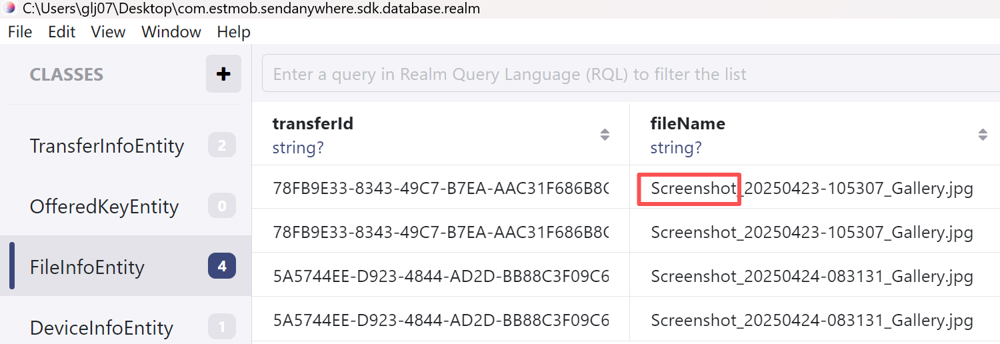

正确答案：A. 屏幕截图

### 18.承上题，接收至哪一个装置?

A. CHAN_MH_mobile.zip

B. blk0_sda.bin

C. FUNG_CC_mobile.zip

D. LAM_KH_Mobile.zip

E. WONG_CW_mobile.zip

挑一个照片索引搜索，定位到blk0_sda.bin：

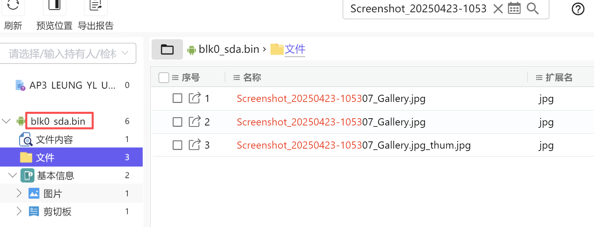

正确答案：B. blk0_sda.bin

### 19.承上题，传送方是通过此文档传输软件的哪个模式作出传送?

A. SEND_PARTIALLY

B. SEND_PAPRIKA

C. SEND_DIRECTLY

D. SEND_BYCLOUD

E. SEND_BLUETOOTH

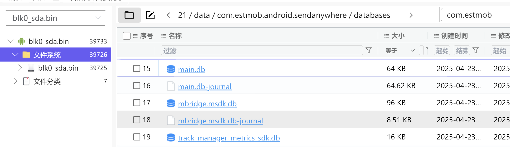
在blk0_sda.bin里查找相应软件数据库：
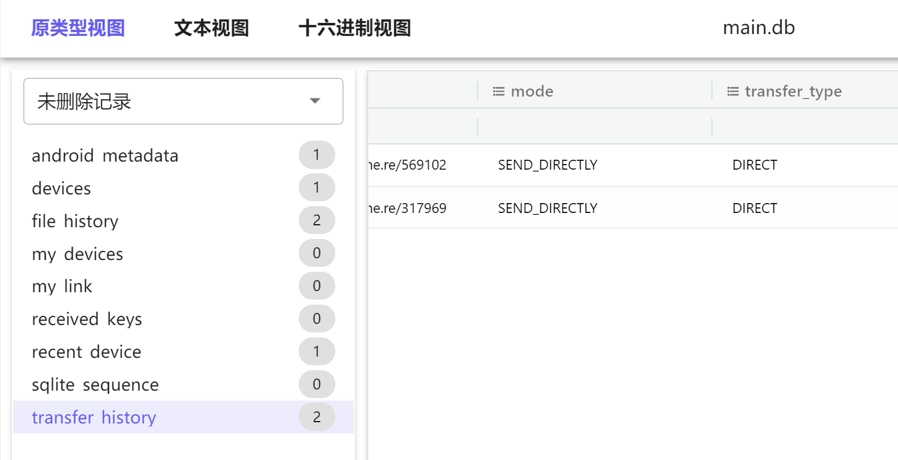

正确答案：C. SEND_DIRECTLY

### 20.从来没有安装以下哪个网络浏览器？
  
A. Safari    B. Chrome    C. Firefox     D. edge

这题说的设备是那个苹果手机。


正确答案：B. Chrome、C. Firefox、D. edge
### 21.承上题，网络浏览器Safari有多少个书签(Bookmark)记录？(请以阿拉伯数字作答)


正确答案：9
### 22.承上题，曾经通过Safari浏览器用下列哪一个字词进行过搜索?

A.非法处理尸体最高刑罚

B. escape room hong kong

C. cypto wallet

D. 非法处理尸体


正确答案：A. 非法处理尸体最高刑罚、B. escape room hong kong、C. cypto wallet

### 23.有多少个图片文件曾经储存到iCloud?(请以阿拉伯数字作答)
搜索cloud，找到backup数据库。
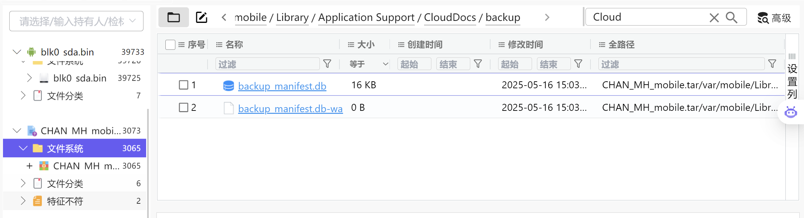

一共两个图片。
正确答案：2
### 24.相册中有多少张图片是通过屏幕截图功能取得？(请以阿拉伯数字作答)


正确答案：15
### 25、请参考参赛材料FUNG_CC_mobile.zip回答以下问题这部智能手机连接过多少个 Wi-Fi 网络？(请以阿拉伯数字作答)


正确答案：2
### 26.这部智能手机曾经连接过以下哪个无线网络？i) THREE_WIFI  ii) wanchai  iii)iPhone(2)    iv) Router
A. 只有 i)

B. 只有 ii) 和 iii)

C. 只有 ii), iii) 和 iv)

D. 以上皆是
如上图。

正确答案：B. 只有 ii) 和 iii)
### 27.这部手提手机最早连接(非热点)Wi-Fi的时间是什么？(请以GMT +8时区及以下格式作答: yyyy-MM-dd HH:mm:ss)
非热点WiFi指的是wanchai。iPhone一般是热点。
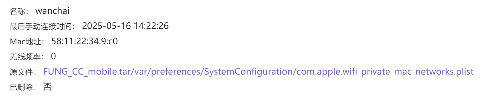
这里只看得到最后手动连接时间。
去com.apple.wifi-private-mac-networks.plist找一下：
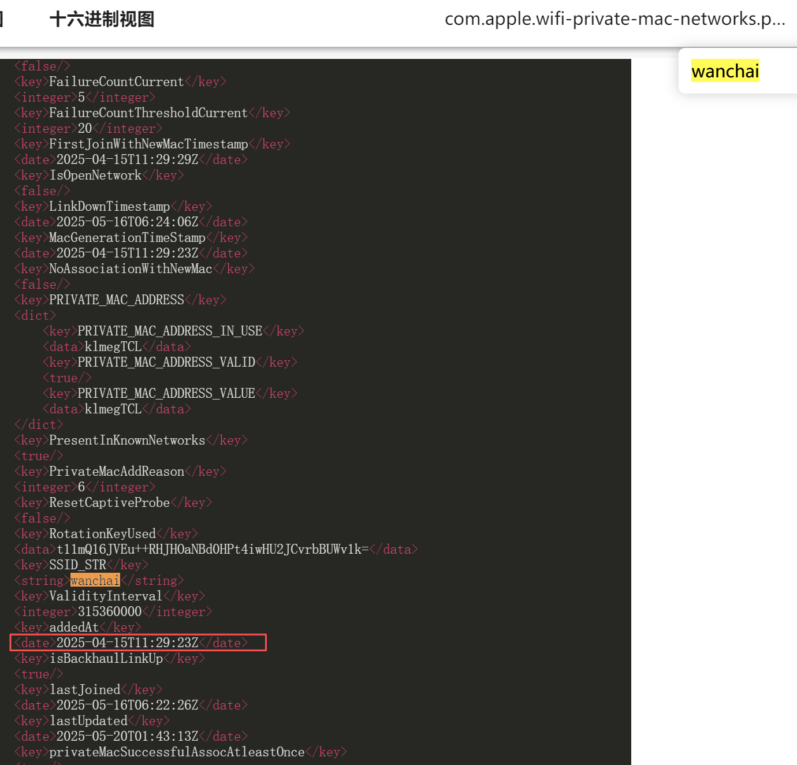
```
2025-04-15T11:29:23Z
```
要求的是GMT+8（格林尼治时间+08：00）
Z 是 ISO 8601里的标记，表示零时区
所以要加8小时
正确答案：2025-04-15 19:29:23
### 28.承上题，请列出这个连接的服务集识别码(SSID)?
(请依照参赛材料中的原文作答，注意区分大小写、空格及符号)

SSID（Service Set Identifier） 就是无线局域网（Wi‑Fi）的“网络名称”，用来区分不同的无线网络。
所以这题答案就是wanchai。
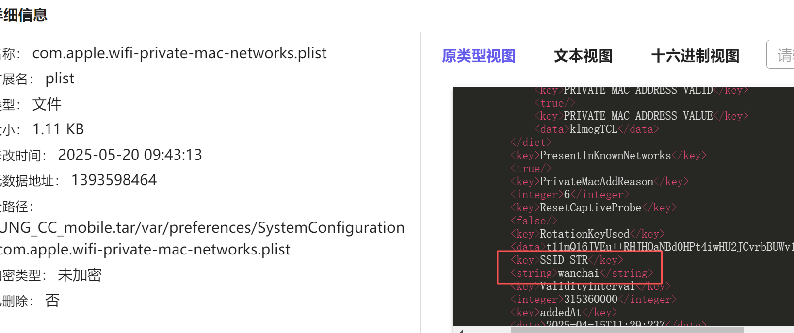
正确答案：wanchai
### 29.承上题，请列出这个连接的登入金钥?(请依照参赛材料中的原文作答，注意区分大小写、空格及符号)
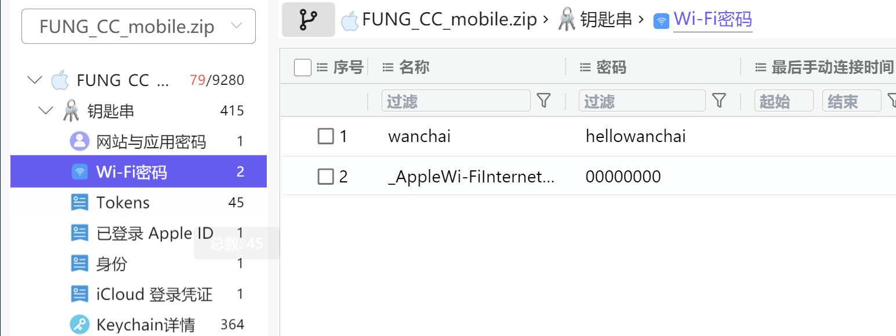

正确答案：hellowanchai
### 30.相册中有两张图像互换格式图片(gif)「IMG_0057.GIF」及「IMG_0062.GIF」，请指出由哪一个软件拍摄?
  
A. Infltr

B. Discreet

C. Meitu

D. Prisma

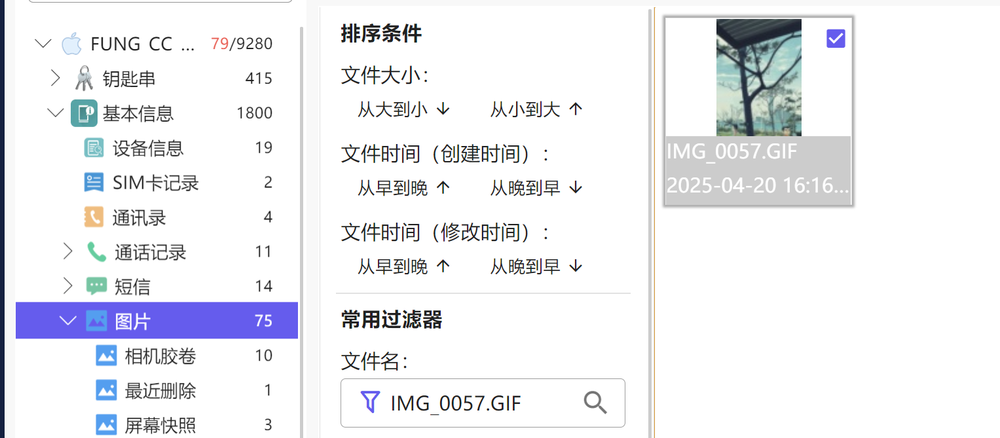
应用里对应找即可。
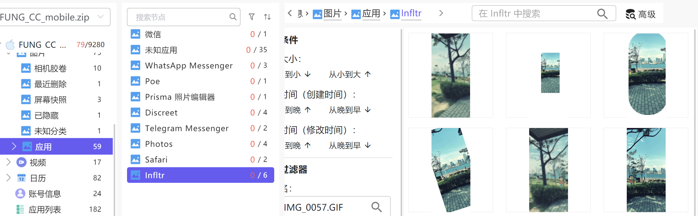
正确答案：A. Infltr

### 31.曾经以空投(AirDrop)方式成功传送了文件到另外一个装置，以下哪一个陈述是正确的？
  
A. 传送了一个图片文件

B. 传送了两个图片文件

C. 传送了一个图片文件及一个文件

D. 传送了一个图片文件及两个文件

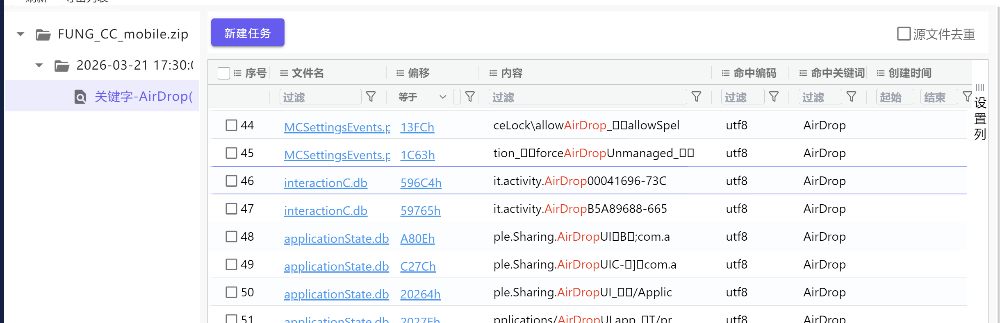
最后锁定interactionC.db。
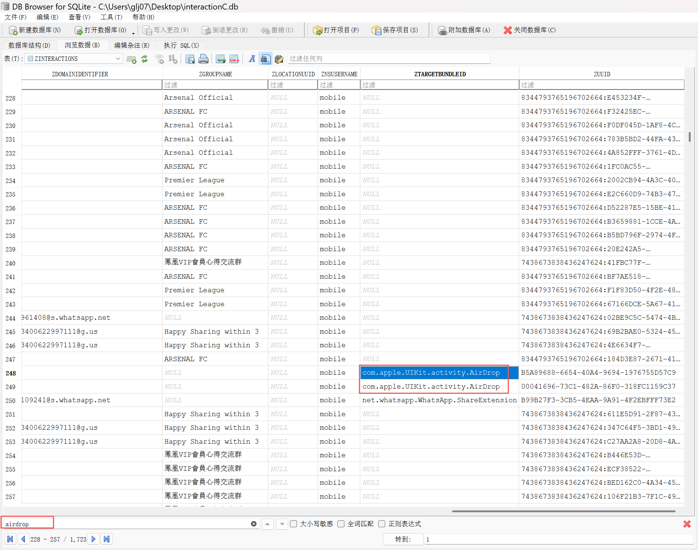
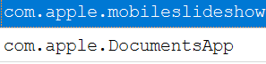

正确答案：C. 传送了一个图片文件及一个文件
### 32.原生APP「相片」中，有一个图片文件曾经通过空投"AirDrop"方式成功传送，请指出这个图片文件的文件全名(请包含扩展名，依照参赛材料中的原文作答，注意区分大小写、空格及符号)


### 33.承上题，请写出这个图片文件的开始传送的日期及时间？(请以GMT +8时区及以下格式作答: yyyy-MM-dd HH:mm:ss)


### 34.请指出哪一个多媒体文件同时储存在APP「文件」(套件识别码: com.apple.DocumentsApp)及APP「照片」(套件识别码: com.apple.mobileslideshow)中？(请包含扩展名，依照参赛材料中的原文作答，注意区分大小写、空格及符号)


### 35.请指出在APP「照片」(套件识别码: com.apple.mobileslideshow)中的图片文件「IMG_0079.JPG」是由哪一个APP拍摄？(请依照参赛材料中的原文作答，注意区分大小写、空格及符号)


### 36.承上题，已知该图片文件是由上述APP所拍摄，并其后储存在APP「照片」(套件识别码: com.apple.mobileslideshow)成「IMG_0079.JPG」，请问该图片的原文件名称？ (请依照参赛材料中的原文作答，注意区分大小写、空格及符号)


### 37.承上题，请指出原文件的建立时间？(请以GMT +8时区及以下格式作答: yyyy-MM-dd HH:mm:ss)


### 38.请指出在APP「照片」(套件识别码: com.apple.mobileslideshow)中，储存多媒体文件「IMG_0014.MOV」与储存「IMG_0016.MOV」之间有没有其他多媒体文件储存到APP「照片」中？
A. 有

B. 没有

C. 有拍摄，但没有储存

D. 无法确认


### 39.承上题，以下哪个陈述是正确描述上一题的答案？
  
A. 制作多媒体文件「IMG_0015.MOV」时，直接储存到隐藏相册中

B. 制作作多媒体文件「IMG_0015.MOV」时，直接上传到iCloud

C. 制作多媒体文件「IMG_0014.MOV」时用了缩时摄影

D. 制作多媒体文件「IMG_0015.MOV」时名称被更改为「IMG_0016.MOV」


### 40.APP「照片」(套件识别码: com.apple.mobileslideshow)中，「IMG_0027.HEIC」的原地理位置信息(WGS84)是？
A. (22.2816569, 114.1756115)

B. (22.2826366666667, 114.168503333333)

C. (22.2826216666667, 114.168525)

D. (22.2826216666667, 114.168503333333)


### 41.曾经通过网络浏览器「Safari」下载了多少个图片文件？
  
A. 1

B. 2

C. 3

D. 4


### 42.多媒体文件「 IMG_0004.MOV」曾被修改后再储存成另一个文件，该文件名称是?

A. IMG_0085.mov

B. IMG_0086.mov

C. IMG_0087.mov

D. IMG_0088.mov


### 43.曾经通过人工智能聊天APP "POE"查询一个问题，请列出这个问题的完整句子？(请依照参赛材料中的原文作答，注意区分大小写、空格及符号)


### 44.承上题，请指出提问的日期及时间(答题格式: yyyy-MM-dd HH:mm:ss 作答, GMT+8)


### 45.承上题，当时使用的是哪一个机器人?(请依照参赛材料中的原文作答，注意区分大小写、空格及符号)


### 46.承上题，当时的使用者名称是？(请依照参赛材料中的原文作答，注意区分大小写、空格及符号)


### 47.请指出即时通讯软件"WeChat"的 "WeChat ID"(请依照参赛材料中的原文作答，注意区分大小写、空格及符号)


### 48.承上题，这个"WeChat ID"关注了多少个「视频号」？
  
A. 1

B. 2

C. 3

D. 4


### 49.请指出即时通讯软件WhatsApp的WhatsApp ID(请依照参赛材料中的原文作答，注意区分大小写、空格及符号)


### 50.即时通讯软件WhatsApp中，封存了下列哪个聊天群？
  
A. 凤凰VIP会员心得交流群

B. 币淘 群组1

C. Sportsmen

D. Titus Wong Manson Finance


### 51.即时通讯软件WhatsApp中，总共追踪了多少个频道？(请以阿拉伯数字作答)


### 52.即时通讯软件「WhatsApp」中，下列哪个是群组 "Investors" 的管理员？i) 85254974406@s.whatsapp.net ii) 85260927726@s.whatsapp.net iii) 85254961408@s.whatsapp.net
A. 只有 i)

B. 只有 i) 和 ii)

C. 只有 ii) 和 iii)

D. 以上皆是


### 53.即时通讯软件「WhatsApp」中，群组 "Investors" 的群组ID？(请依照参赛材料中的原文作答，注意区分大小写、空格及符号)


### 54.即时通讯软件「WhatsApp」中，「社群」名称是什么？(请依照参赛材料中的原文作答，注意区分大小写、空格及符号)


### 55.承上题，请指出这个社群的群组图案的哈希值（SHA256格式）

A. B1A3706C574F81A3EE084FB9509997E06349E86D904D1DC10B879D1D5ED83125

B. B8BA258402925E139CAFBBBBBC809EC160B70BB03DBD4D0F3063F58F69D0B956

C. E43ADC646295BC5011577D4E733B6289D31A5E11ACB45285BE1FF530260DF383

D. 20E64C78F9926548CEEFB1783991A4AD71A6631F3C86002254342E323A898C6A


### 56.即时通讯软件「WhatsApp」中，找出WhatsApp ID:85254961408@s.whatsapp.net曾经是在而现在已经不在的群组，请指出该群组的名称。(请依照参赛材料中的原文作答，注意区分大小写、空格及符号)


### 57.即时通讯软件「WhatsApp」中，总共出现了多少个「投票」活动？(请以阿拉伯数字作答)


### 58.承上题，总共在多少个「投票」活动中作出了投票？(请以阿拉伯数字作答)


### 59.即时通讯软件「WhatsApp」中，根据群组「 IQ COIN 💰💰💰💰」对话内容正在策划，哪一种犯罪计划？
  
A. 诈骗

B. 抢劫

C. 谋杀

D. 以上都不对


### 60.承上题，该群组建立者的WhatsApp ID是什么？(请依照参赛材料中的原文作答，注意区分大小写、空格及符号)


### 61.承上题，该群组的建立时间是什么？(请以GMT +8时区及以下格式作答: yyyy-MM-dd HH:mm:ss)


### 62.根据你分析结果。三人因感情瓜葛内讧因而发生这次袭击事件。你怀疑梁燕玲曾到袭击现场，你将你的发现通知警察。警察扩大现场搜索范围，终于在案发现场附近，发现陈民浩名下的小汽车，车上发现一部智能手机。请你以参赛材料LEUNG_YL_Mobile.zip回答以下问题参考LEUNG_YL_Mobile.zip，该手机用作注册iCloud的email?

A. lingleung1502@gmail.com

B. lingleung1502@yahoo.com.hk

C. lingleung1503@gmail.com

D. lingl1502@gmail.com

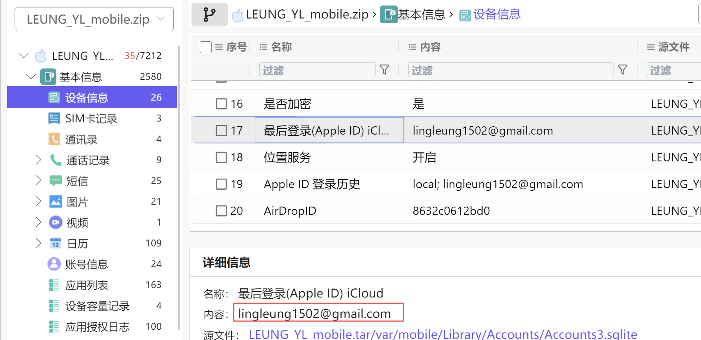

正确答案：A. lingleung1502@gmail.com
### 63.参考LEUNG_YL_Mobile.zip，文件IMG_0021.HEIC 所拍摄的相机型号是甚么?

A. iPhone SE (3rd generation)

B. iPhone SE (2nd generation)

C. iPhone 12 mini

D. iPhone XR

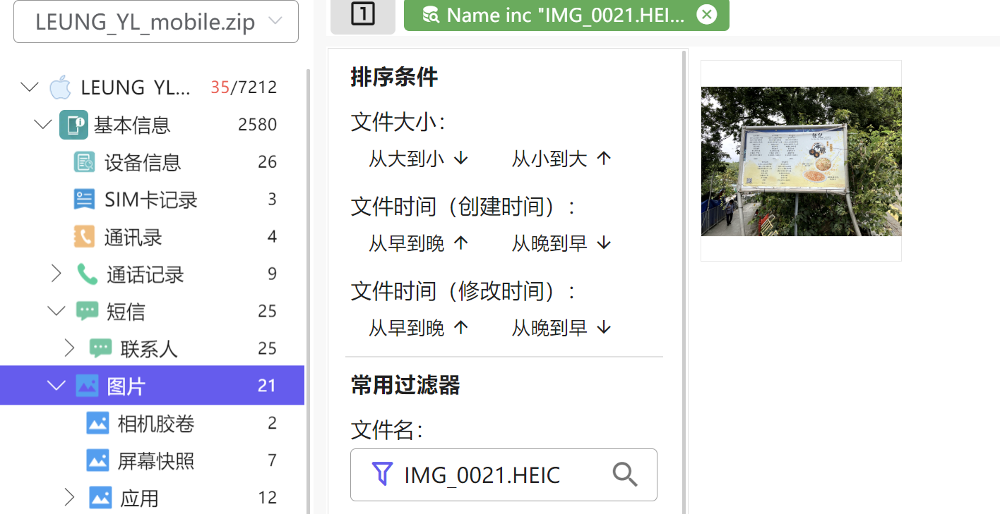
资源管理器打开，查看属性。
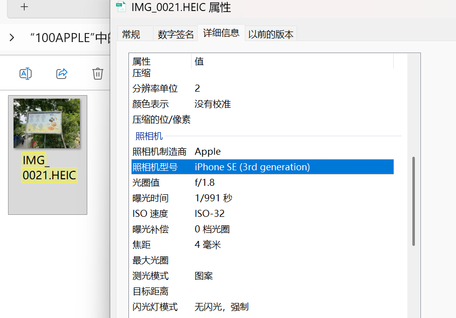

正确答案：A. iPhone SE (3rd generation)

### 64.参考LEUNG_YL_Mobile.zip，文件IMG_0005.JPG所拍摄的座标(WGS 84)是多少？(请以纬度,经度的顺序及以下格式作答xx.xxxxxx,xx.xxxxxx)
同样，在资源管理器中打开。使用exiftool查看详细信息。并未发现座标。
需要跳转到源文件查看数据库Photos.sqlite。
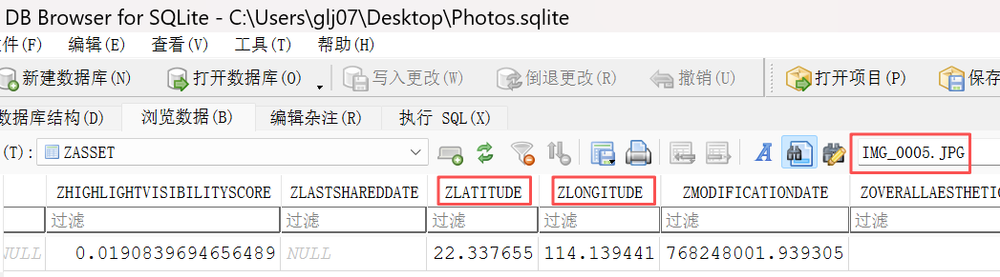

正确答案：22.337655,114.139441
### 65.参考LEUNG_YL_Mobile.zip，文件IMG_0022.JPG是以下哪种方向拍摄?
  
A. 不旋转

B. 旋转180度

C. 顺时针90度

D. 逆时针90度

查看EXIF信息：
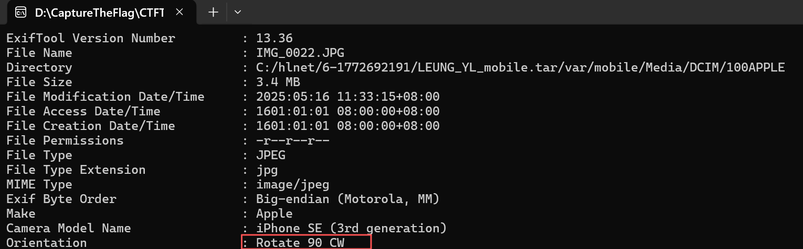
Rotate 90 CW 的意思是 顺时针旋转 90 度（CW = Clockwise），相当于Right top
而“逆时针”是 CCW = Counterclockwise

正确答案：C. 顺时针90度
### 66.文件IMG_0022.JPG的建立时间(GMT +08:00)是?(请以GMT +8时区及以下格式作答: yyyy-MM-dd HH:mm:ss)
依旧是EXIF信息：
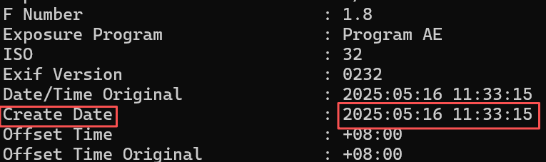
正确答案：2025-05-16 11:33:15
### 67.参考LEUNG_YL_Mobile.zip，在WhatsApp与 85254974406@s.whatsapp.net 聊天对话中，于2025-05-16 11:33:39时的信息所传送的座标(WGS 84)是多少?(请以纬度,经度顺序及以下格式作答xx.xxxxxxxxxxxx, xxx.xxxxxxxxxxxx)
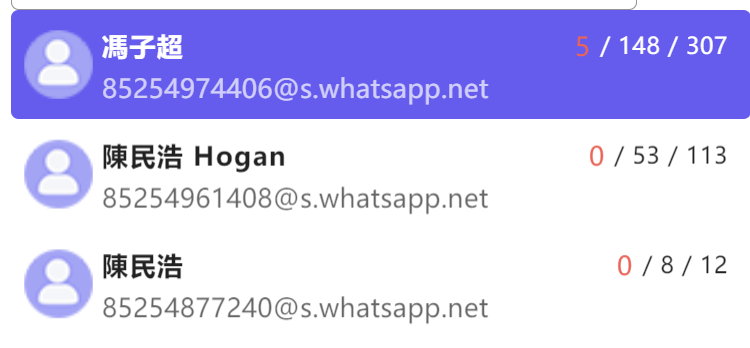
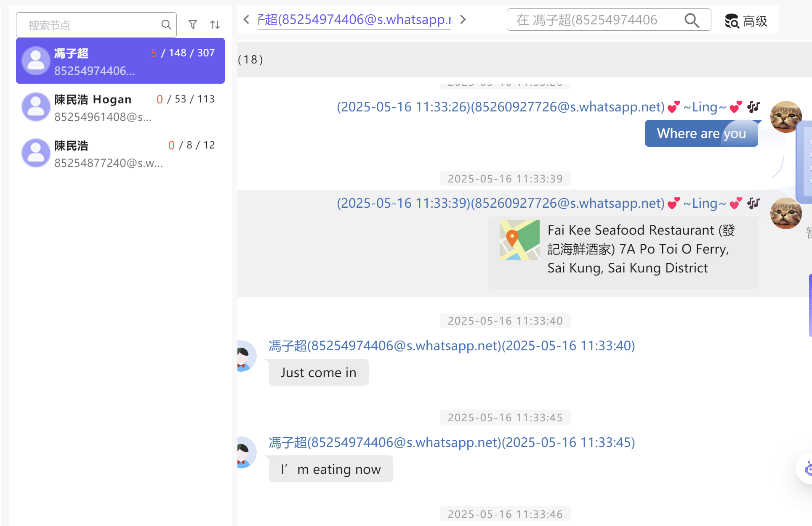
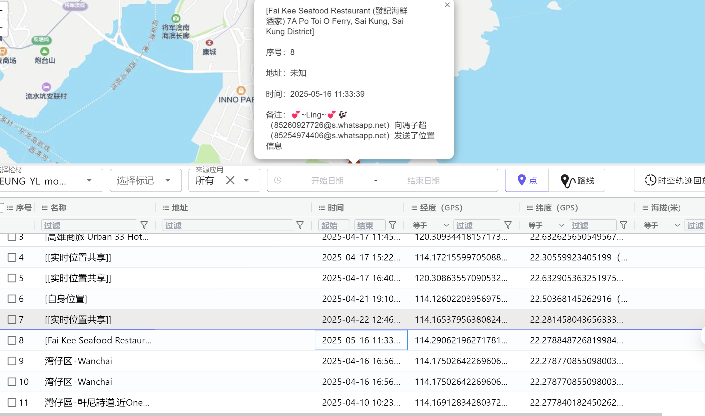
114.29062196271781，22.278848726819984
### 68.参考LEUNG_YL_Mobile.zip，在WhatsApp 与 "85254974406@s.whatsapp.net”聊天对话中，于2025-05-16 11:33:39时的信息所传送的座标(WGS 84)所指的餐厅英文名称是? (请依照参赛材料中的原文作答，注意区分大小写、空格及符号)


### 69.参考LEUNG_YL_Mobile.zip，在WhatsApp 中聊天群组ID 120363401289578356里，于2025-04-29 08:31:02，机主传送了一个PDF 文件，该PDF的内容是什么？(请依照参赛材料中的原文作答，注意区分大小写、空格及符号)


### 70.参考LEUNG_YL_Mobile.zip，在WhatsApp 中聊天群组ID 120363401289578356里，有多少个参加者？

A. 2

B. 3

C. 4

D. 5


### 71.参考LEUNG_YL_Mobile.zip，于2025-04-25 17:11:37 时使用WhatsApp 所拨打的手机号码是多少?

A. 85254962307

B. 85254961408

C. 85254974406

D. 85254993306


### 72.参考LEUNG_YL_Mobile.zip，总共有多少个WhatsApp的通话记录? (包括拨打、接收及未接来电)

A. 4

B. 5

C. 6

D. 7


### 73.参考LEUNG_YL_Mobile.zip，WhatsApp 聊天群组ID 120363400622997111 的群组名称是?
  
A. Investors

B. Foodies

C. We are 3

D. Happy Sharing within 3


### 74.参考LEUNG_YL_Mobile.zip，WhatsApp 聊天群组Happy Sharing within 3 于2025-04-17 10:12:34 传送的WGS 84座标是多少?
  
A. 22.323436345441, 113.276894376508

B. 22.326923370361, 114.168403625488

C. 21.239876452236, 115.925422314543

D. 20.124955642236, 114.168403625488


### 75.参考LEUNG_YL_Mobile.zip，Instagram 的版本是?

A. 375.2.0.15.82 (722575504)

B. 376.1.0.14.56 (722575504)

C. 376.1.0.27.82 (722575504)

D. 376.0.0.17.23 (722575504)


### 76.参考LEUNG_YL_Mobile.zip，社交媒体软件Instagram 的安装时间?(请以GMT+8时区及格式YYYY-MM-DD hh:mm:ss作答)


### 77.跟据你的分析，警察在香港西贡蕉坑，找到一个行李箱，内藏一名女子尸体，身上没有任何身份证明文件，裤袋内搜获一个U盘，根据法医初步检验，死者头部及颈部有明显瘀伤，相信曾发生激烈争执，死因为气管受压导致窒息，死亡时间相信是在2025-05-16 0900时至1000时 。调查人员初步检查这个U盘，没有发现可疑资料，现在交由你进行电子数据鉴定工作。请参考参赛材料LEUNG_YL_USB.E01，答以下问题参考LEUNG_YL_USB.E01，这个U盘里有多少个分区？(请以阿拉伯数字作答)


### 78.参考LEUNG_YL_USB.E01，这个U盘里的分区结构是什么？(请以英文大写作答)


### 79.参考LEUNG_YL_USB.E01，以下哪项描述是正确的？i) U盘的总容量是16GBii) 文件系统包括 FAT32、exFAT 和 NTFSiii) exFAT 分区的容量是 16GBiv) 分区标签名是 "SanDisk"
  
A. 只有 i) 和 ii)

B. 只有 i) 和 iii)

C. 只有 ii) 和 iv)

D. 以上皆非


### 80.参考LEUNG_YL_USB.E01，以下哪项描述是正确的？i) 此U盘曾连接到一台名为 "PC" 的电脑ii) U盘内存有一个已加密的压缩文件iii) 已加密的压缩文件的创建日期系 2025-05-15

A. 只有 ii)

B. 只有 iii)

C. 只有 ii) 和 iii)

D. 以上皆是


### 81.承上题，该压缩文件的解压密码是多少？(请依照参赛材料中的原文作答，注意区分大小写、空格及符号)


### 82.参考LEUNG_YL_USB.E01，以下哪项描述是正确的？i) 这是一个可引导U盘ii) 有一个分区标签名为 "EFI"iii) 卷标日期为 2025-05-15 (UTC +8)iv) 有一个分区的总容量小于 500 MB

A. 只有 i)

B. 只有 i) 和 ii)

C. 只有 i), iii) 和 iv)

D. 以上皆是


### 83.tammy.txt文件的内容是什么？(请依照参赛材料中的原文作答，注意区分大小写、空格及符号)


### 84.文件“xcontainer”的加密算法是什么？(请依照参赛材料中的原文作答，注意区分大小写、空格及符号)


### 85.分析文档 "xcontainer" 的属性。关于此磁盘镜像，以下哪项描述是正确的？i) 大小为 4943872 字节ii) 文件系统是 FAT iii) 没有嵌入式备份头iv) 块大小为 128 位

A. 只有 i) 和 ii)

B. 只有 ii) 和 iv)

C. 只有 ii), iii) 和 iv)

D. 以上皆是


### 86.WinPE 启动后，系统会自动将核心映像挂载在哪个虚拟机？

A. C:

B. D:

C. X:

D. Z:


### 87.下列哪些 Windows PE 指令在预设环境下无法执行？i) Powershellii). Eventvwriii). HostnameiV). Diskpart

A. 只有 i) 和 ii)

B. 只有 iii) 和 iv)

C. 只有 i), ii) 和 iii)

D. 以上皆是


### 88.必须包含哪个文件，才能启动 Windows PE环境？

A. WEPE64.wim

B. install.wim

C. WinPE.log

D. hiberfil.sys


### 89.若要判断一个U盘是否为可开机的Windows PE，以下哪些文件必须存在？i) WEPE64.wim 或 boot.wimii) bootmgriii) EFI\Boot\bootx64.efiiv) hiberfil.sys

A. 只有 ii 和 iv

B. 只有 i), ii) 和 iii)

C. 只有 i) 和 iv)

D. 以上皆是

### 90.这个 WinPE U盘的操作环境 (Operating Environment) 是基于哪一个 Windows 版本？

A. Windows 7

B. Windows 8.1

C. Windows 10 PE

D. Windows 11 PE

### 91.根据你综合多项通讯软件的对话记录，浏览记录及资料分析，发现冯子超、陈民浩伙同女子梁燕玲共同做了一宗涉及加密货币投资的诈骗案件，因东窗事发打算携赃而逃。女子梁燕玲负责处理有关清洗黑钱事项，警察相信梁燕玲携带同相关材料逃跑，请你运用电子数据鉴定技巧寻找与加密货币相关的材料，尽快启动冻结程序。参考LEUNG_YL_USB.E01，该U盘盘有一个加密的文件，该文件所用的加密软件名称是? (只需回答软件名称，不需要回答软件版本，(请依照参赛材料中的原文作答，注意区分大小写、空格及符号)


### 92.参考LEUNG_YL_USB.E01，请列出与IQ Coin有关的虚拟钱包的地址(请依照参赛材料中的原文作答，注意区分大小写、空格及符号)


### 93.承上题，这个钱包属于哪一种加密货币(请以英文大写作答)


### 94.承上题，这个钱包总共有多少次存入记录？(请以阿拉伯数字作答)


### 95.承上题，存入款项的支账地址是什么？(请依照参赛材料中的原文作答，注意区分大小写、空格及符号)


### 96.承上题，这项交易传送了多少BEP-20 IQ Coin?(请以阿拉伯数字依照参赛材料中的原文作答，注意区分大小写、空格及符号和不用标点符号 )


### 97.助记词是由加密货币钱包生成的一系列单词，帮助用户恢复其私钥。助记词通常由12到24个单词组成

A. 正确

B. 错误


### 98.根据你的信息警察查知这个加密钱包涉及近期一宗巨额诈骗案，请你查出这个钱包余额额度，警察将会进行冻结程序<br>请指出包含有疑似助记词的文件的希哈值(MD5格式)(请以阿拉伯数字和英文大写作答)


# 二、U盘取证

