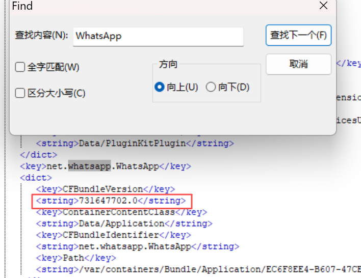
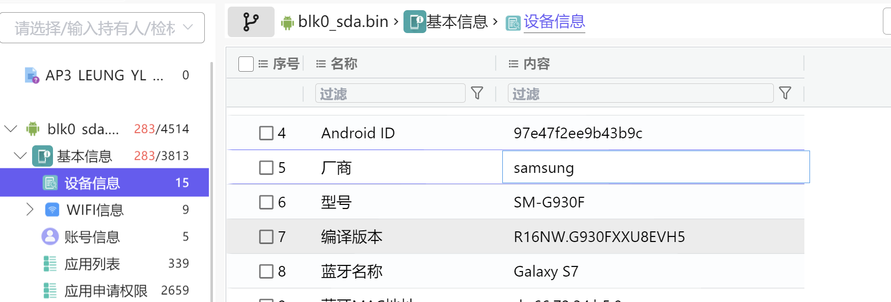
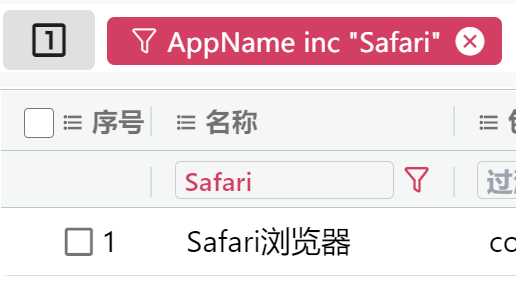
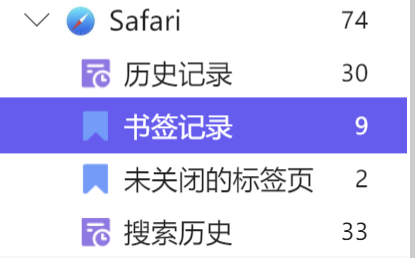
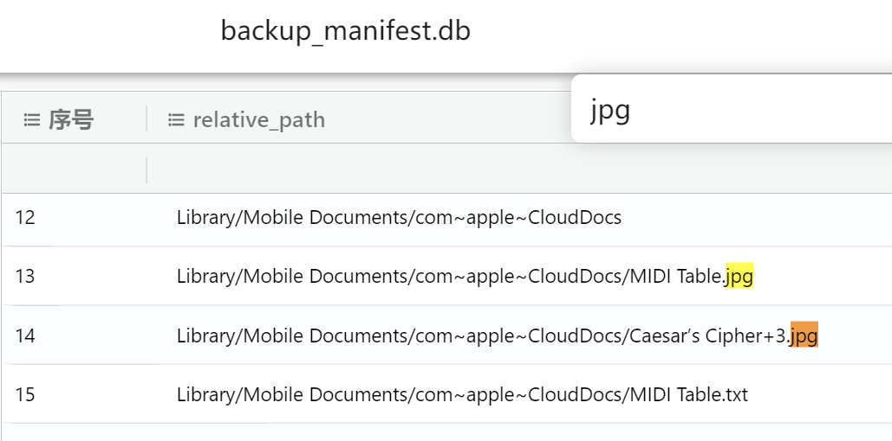
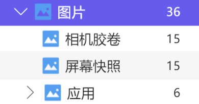
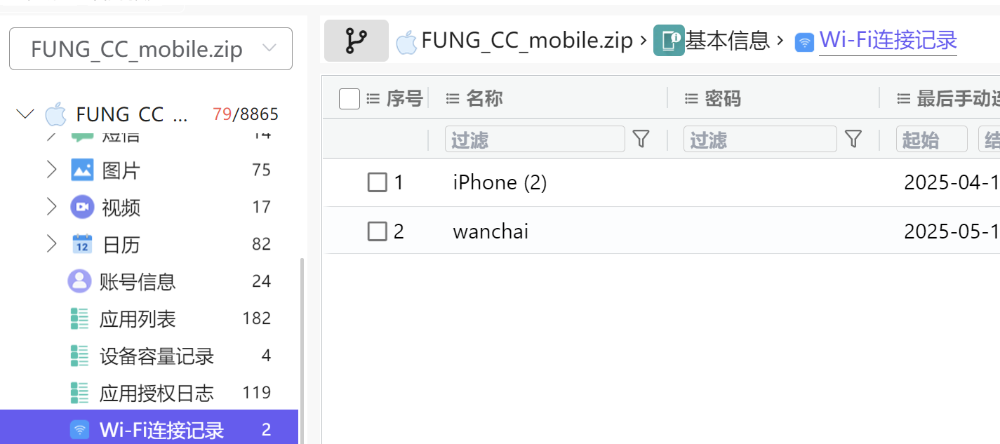

# 前言：

**案情介绍**
警方接获报案，前往西贡布袋澳处理一宗“伤人”事件。经初步调查，怀疑男子陈民浩以木棍袭击男子冯子超，导致冯子超头部受伤昏迷。冯子超已被送往医院救治，陈民浩则因涉嫌“伤人”罪被警方当场拘捕，被捕后一直保持缄默，拒绝交代案情细节。 进一步调查显示，两人冲突疑因女子梁燕玲而起。根据现场迹象推断，梁燕玲曾于事发时在场出现，经警方多方搜索后，至今仍未能与她取得联络。请参赛者根据提供的资料，深入分析线索，寻找梁燕玲下落，并还原事件真相。 Green Technology Supply Co. Ltd.（绿创科技系统有限公司）为本港网络工程公司，主要业务是为企业客户铺设网络服务及安装各类服务器。 男子 FUNG Chi-chiu（冯子超），英文名为Duncan，30岁，未婚，香港出生，在Green Technology Supply Co. Ltd.任职工程师。 男子 CHAN Man-ho（陈民浩），英文名为Hogan，35岁，未婚，香港出生，在Green Technology Supply Co. Ltd. 任职系统工程师。 女子 LEUNG Yin-ling（梁燕玲），英文名为Ling，28岁，未婚，香港出生，现为自由职业平面设计师。 梁燕玲与陈民浩为同居情侣关系 梁燕玲通过陈民浩认识冯子超 三人均为密码学（Crypto）及隐写术（Stego）爱好者 陈民浩经常驾车接载三人前往郊区聚餐，并一同钻研相关技术话题

**检材下载**

下载链接：[https://pan.baidu.com/s/1cnGvrFoMa1m6o-W50MU20A?pwd=481p](https://pan.baidu.com/s/1cnGvrFoMa1m6o-W50MU20A?pwd=481p)

哈希值：`SHA256: ba7a59bda48932ae5507c4872a0492ee080cd8e6222d9e86fad961038801826e`

挂载/解压密码：`FEYn0MJLYy9zTQRFHlXGRkVqXv3IkE8h`

# 前期工作：
直接导入苹果检材加载不出，首先想到找每个检材的manifest.plist，破解苹果备份密码。

密码从四位数开始试。

Chan

FUNG

Leung

# 一、手机取证
### 1.请你使用CHAN_MH.zip检材回答以下问题这个智能手机是什么操作系统?  
A. iOS 17.1.1          B. iOS 17.2.1        C. iOS 17.3.1          D. iOS 17.0.1

正确答案：A. iOS 17.1.1

### 2.在这个手机中，有多少组国际移动设备识别码(IMEI)号码? (请以阿拉伯数字作答)
IMEI全称InternationalMobileEquipmentIdentity

火眼只看到一个：

火眼查看的文件是/var/info.plist

然而压缩包里有个iDevice_info.txt。里面显示两个IMEI：

357328098205226 和 357328099153748

看下来可能是这个原因：/var/info.plist可能只读取了主 SIM 卡的 IMEI。
而iDevice_info.txt是 `ideviceinfo`（第三方取证工具）生成的汇总信息。这类工具会查询所有可用的 IMEI，因此更完整正确。

正确答案：2

### 3.承上题，以下哪一个才是正确的国际移动设备识别码(IMEI)号码?
A. 357328098205226     B. 357328097205226     C. 357328096205226     D. 357328095205226

如上所述。

正确答案：A. 357328098205226

### 4.请指出最后使用的使用者身分模组(SIM)的集成电路卡识别码(ICCID)

正确答案：A. 89852122206020998419

### 5.请指出最后使用的Apple ID是多少？(请依照参赛材料中的原文作答，注意区分大小写、空格及符号)

正确答案：whoishogan@gmail.com

### 6.蓝牙模组中的蓝牙地址是多少？(请以下格式作答:xx:xx:xx:xx:xx:xx)

正确答案：f8:38:80:bb:f5:28

### 7.这个智能手机曾经启动「个人热点」分享网络，请问他的「热点」名称？(请依照参赛材料中的原文作答，注意区分大小写、空格及符号)
苹果手机热点名应该和设备名一样

正确答案：iPhone

### 8.这个智能手机没有连接过以下哪一个服务集标识符(SSID)
A. Hongn Home        B. CMHK        C. 1010 free wifi         D. ErrorError

CD连接看得出来。B连接过是因为下一题提示了。

正确答案：A. Hongn Home

### 9.[美亚也没答案]请指出首次连接服务集识别码(SSID)名称为" CMHK"的无线区域网络(Wi-Fi)的日期及时间(请以GMT +8时区及以下格式作答: yyyy-MM-dd HH:mm:ss)
正确答案：正确答案

### 10.安装了以下即时哪个通讯软件?  i) WhatsApp   ii) WeChat    iii) WhatsApp Business    iv) QQ
A. 只有 i) 和 ii)       B. 只有 i), ii) 和 iii)       C. 只有 i), ii) 和 iv)        D. 以上皆是

正确答案：A. 只有 i) 和 ii)

### 11.承上题，请指出即时通讯软件"WhatsApp"的版本(请依照参赛材料中的原文作答，注意区分大小写、空格及符号)

火眼参考的是var\Manifest.plist。

但是这版本号一看就不对。还得另寻他处：

火眼搜WhatsApp，找到plist搜索version：

正确答案：2.25.14.79

### 12.陈民浩的手机中，总共安装3个文件传输软件，封包名称分别为com.apple.Sharing.AirDropUI、com.lenovo.anyshare、com.estmob.paprika，其中有哪一个软件曾经用来传送/接收文件功能?

A. com.apple.Sharing.AirDropUI   B. com.lenovo.anyshare   C. com.estmob.paprika

看到只有C是有传输的文件的。其他未找到

正确答案：C. com.estmob.paprika

### 13.承上题，与其有传送/接收过资料装置的装置ID是多少? (请依照参赛材料中的原文作答，注意区分大小写、空格及符号)

把realm文件复制到桌面。

用realm studio打开：

现在是只读模式，需要修改属性才能打开：

小细节：火眼文件夹下是锁上的，无法修改属性。因此分析时建议复制到桌面。

正确答案：5402313593439

### 14.承上题，这个装置名称是?(请依照参赛材料中的原文作答，注意区分大小写、空格及符号)

如上图所示。
也就是 blk0_sda.bin 这个设备

正确答案：Samsung SM-G930F

### 15.承上题，本机装置的装置ID是多少?(请依照参赛材料中的原文作答，注意区分大小写、空格及符号)

属性表里有：

应用数据库也看到传输设备id

正确答案：3836403626142

### 16.承上题，陈民浩的手机(CHAN_MH_mobile.zip)是传送方或是接收方?

A. 传送方     B. 接收方      C. 传送及接收方

详见17、18题的分析，看到是安卓手机截的图，显然是由陈民浩的安卓手机发送给他的 iPhone 手机的:

正确答案：B. 接收方

### 17.根据传送档案的名称，判断是以下哪一类型? (单选)

A. 屏幕截图    B. 手机拍摄影片    C. PDF文件    D. zip压缩文件

正确答案：A. 屏幕截图

### 18.承上题，接收至哪一个装置?

A. CHAN_MH_mobile.zip

B. blk0_sda.bin

C. FUNG_CC_mobile.zip

D. LAM_KH_Mobile.zip

E. WONG_CW_mobile.zip

挑一个照片索引搜索，定位到blk0_sda.bin：

正确答案：B. blk0_sda.bin

### 19.承上题，传送方是通过此文档传输软件的哪个模式作出传送?

A. SEND_PARTIALLY

B. SEND_PAPRIKA

C. SEND_DIRECTLY

D. SEND_BYCLOUD

E. SEND_BLUETOOTH

在blk0_sda.bin里查找相应软件数据库：

正确答案：C. SEND_DIRECTLY

### 20.从来没有安装以下哪个网络浏览器？
  
A. Safari    B. Chrome    C. Firefox     D. edge

这题说的设备是那个苹果手机。

正确答案：B. Chrome、C. Firefox、D. edge
### 21.承上题，网络浏览器Safari有多少个书签(Bookmark)记录？(请以阿拉伯数字作答)

正确答案：9
### 22.承上题，曾经通过Safari浏览器用下列哪一个字词进行过搜索?

A.非法处理尸体最高刑罚

B. escape room hong kong

C. cypto wallet

D. 非法处理尸体

正确答案：A. 非法处理尸体最高刑罚、B. escape room hong kong、C. cypto wallet

### 23.有多少个图片文件曾经储存到iCloud?(请以阿拉伯数字作答)
搜索cloud，找到backup数据库。

一共两个图片。
正确答案：2
### 24.相册中有多少张图片是通过屏幕截图功能取得？(请以阿拉伯数字作答)

正确答案：15
### 25、请参考参赛材料FUNG_CC_mobile.zip回答以下问题这部智能手机连接过多少个 Wi-Fi 网络？(请以阿拉伯数字作答)

正确答案：2
### 26.这部智能手机曾经连接过以下哪个无线网络？i) THREE_WIFI  ii) wanchai  iii)iPhone(2)    iv) Router
A. 只有 i)

B. 只有 ii) 和 iii)

C. 只有 ii), iii) 和 iv)

D. 以上皆是
如上图。

正确答案：B. 只有 ii) 和 iii)
### 27.这部手提手机最早连接(非热点)Wi-Fi的时间是什么？(请以GMT +8时区及以下格式作答: yyyy-MM-dd HH:mm:ss)

### 28.承上题，请列出这个连接的服务集识别码(SSID)?
(请依照参赛材料中的原文作答，注意区分大小写、空格及符号)
### 29.承上题，请列出这个连接的登入金钥?(请依照参赛材料中的原文作答，注意区分大小写、空格及符号)
### 30.相册中有两张图像互换格式图片(gif)「IMG_0057.GIF」及「IMG_0062.GIF」，请指出由哪一个软件拍摄?
  
A. Infltr

B. Discreet

C. Meitu

D. Prisma

### 31.曾经以空投(AirDrop)方式成功传送了文件到另外一个装置，以下哪一个陈述是正确的？
  
A. 传送了一个图片文件

B. 传送了两个图片文件

C. 传送了一个图片文件及一个文件

D. 传送了一个图片文件及两个文件

### 32.原生APP「相片」中，有一个图片文件曾经通过空投"AirDrop"方式成功传送，请指出这个图片文件的文件全名(请包含扩展名，依照参赛材料中的原文作答，注意区分大小写、空格及符号)
### 33.
### 34.
### 35.
### 36.
### 37.
### 38.
### 39.
### 40.
### 41.
### 42.
### 43.
### 44.
### 45.
### 46.
### 47.
### 48.
### 49.
### 50.
### 51.
### 52.
### 53.
### 54.
### 55.
### 56.
### 57.
### 58.
### 59.
### 60.

# 二、U盘取证

