# 题型
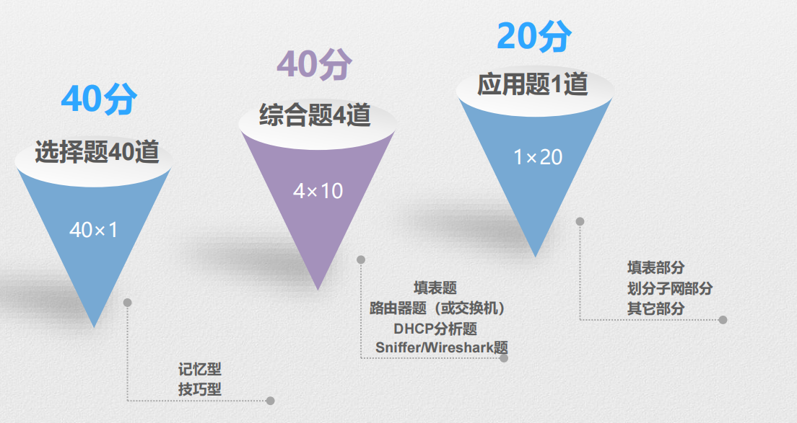
# 选择题
## 停机时间与系统可用性

## IP地址块转子网掩码

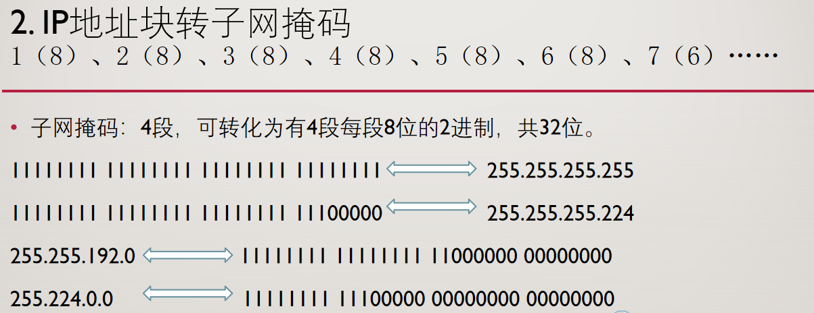
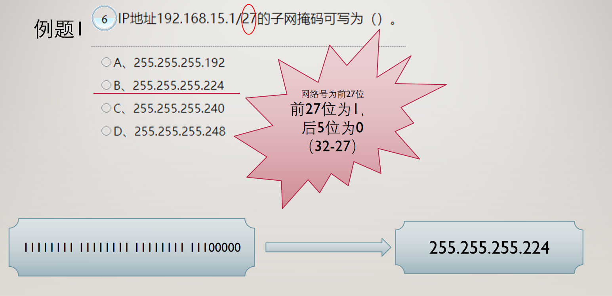
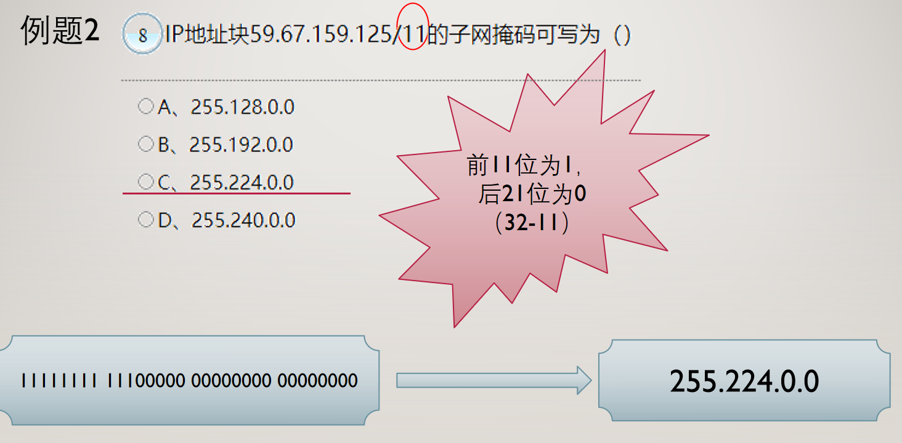

## 二进制和十进制的转换
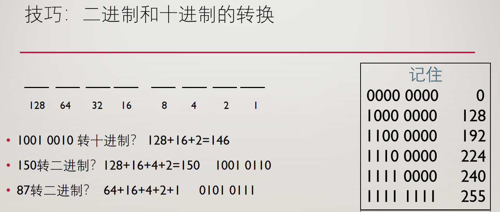

## BGP（边界网关协议）
**高频：约出现24 次**

1. 边界网关协议（Border Gateway Protocol），是**外部**而不是内部网关协议(是不同自治系统(AS)的路由器之间使用的协议)。
一个 BGP 发言人使用 **TCP**（不是 UDP）与其他自治系统的 BGP发言人交换路由信息。
2. BGP 协议交换路由信息的节点数是以自治系统数为单位的，BGP 交换路由信息的节点数不小于自治系统数。
3. BGP 采用**路由向量协议**，而RIP采用距离向量协议。
4. BGP 发言人通过 **update** 而不是 noticfication 分组通知相邻系统，使用 update 分组更新路由时，一个报文只能增加一条路由。
5. **open 分组**用来与相邻的另一个 BGP 发言人建立关系，两个BGP 发言人需要**周期性**地（不是不定期）交换 **keepalive** 分组来确认双方的相邻关系。
6. BGP 路由选择协议执行中使用的四个分组为打开(open)、更新(update)、保活(keepalive)和通知(notification)分组。

## 集线器
**高频 21 次**

1. 工作在**物理层**，连接到一个集线器的所有结点**共享/属于**（不是独立）一个冲突域。
2. 每次**只有一个**结点能够发送数据，而其他的结点都处于接收数据的状态（多个节点可以同时接受数据帧）。连接到集线器的节点发送数据时，该**节点**将执行 **CSMA/CD（不是 CA）**介质访问控制方法。
3. 在网络链路中串接一个集线器可以监听该链路中的数据包。
4. 集线器**不是基于MAC 地址/网卡地址/IP 地址**完成数据转发（基于 MAC 地址的是网桥或交换机等），而是信源结点利用一对发送线将数据通过集线器内部的总线广播出去。
5. 集线器使用双绞线连接工作站。
6. 使用 Sniffer 在网络设备的一个端口上能够捕捉到与之属于同一 VLAN 的不同端口的所有通信流量的设备是**集线器**。
## OSPF 协议
**高频 21 次**

1. OSPF（开放式最短路径优先，Open Shortest Path First） 是**内部**网关协议的一种，采用最短路径算法，使用**分布式链路状态协议**。
2. 对于规模很大的网络，OSPF 通过**划分区域**来提高路由更新收敛速度。每个区域有一个**32 位**的区域标识符，区域内路由器**不超过 200 个**。
3. 一个 OSPF 区域内每个路由器的链路状态数据库包含着 **本区域(不是全网)** 的拓扑结构信息，不知道其他区域的网络拓扑。
4. 链路状态“度量”主要指**费用、距离、延时、带宽**等，没有路径。
5. 当链路状态发生变化时用**洪泛法**向 **所有(不是相邻)** 路由器发送此信息。
6. 链路状态数据库中保存的是全网的**拓扑结构图**，而非一个完整的路由表，也不是只保存下一跳路由器的数据。
7. 为确保链路状态数据库一致，OSPF 每隔**一段时间**（不确定）刷新一次数据库中的链路状态。
## 攻击
**必考 30 次**

1. SYN：同步序列编号（Synchronize Sequence Numbers）。是TCP/IP建立连接时使用的握手信号。在客户机和服务器之间建立正常的TCP网络连接时，客户机首先发出一个SYN消息，服务器使用SYN+ACK应答表示接收到了这个消息，最后客户机再以ACK消息响应。这样在客户机和服务器之间才能建立起可靠的TCP连接，数据才可以在客户机和服务器之间传递。**SYN Flooding 攻击**：使用无效的 IP 地址，利用 TCP 连接的三次握手过程，使得受害主机处于开放会话的请求之中，直至连接超时。在此期间，受害主机将会连续接受这种会话请求,最终因**耗尽资源**而停止响应。
2. **DDos 攻击（Distributed Denial of Service）**：利用攻破的多个系统发送大量请求去集中攻击其他目标，受害设备因为无法处理而拒绝服务。
3. **SQL 注入攻击**：属于利用系统漏洞，基于网络的入侵防护系统和基于主机入侵防护系统都难以阻断。防火墙（基于网络的防护系统）无法阻断这种攻击。
4. **Land 攻击**：向某个设备发送数据包，并将数据包的源 IP 地址和目的地址都设置成攻击目标的地址。
5. **协议欺骗攻击**：通过伪造某台主机的 IP 地址窃取特权的攻击。有以下几种：（1）IP 欺骗攻击。（2）ARP 欺骗攻击。（3）DNS 欺骗攻击。（4）源路由欺骗攻击。
6. **DNS 欺骗攻击**：攻击者采用某种欺骗手段，使用户查询服务器进行域名解析时获得一个错误的 IP 地址，从而可将用户引导到错误的 Internet 站点。
7. **IP 欺骗攻击**：通过伪造某台主机的 IP 地址骗取特权，进而进行攻击的技术。
8. **Cookie 篡改攻击**：通过对 Cookie 的篡改可以实现非法访问目标站点，基于网络的入侵防护系统无法阻断。
9. **Smurf 攻击**：攻击者冒充受害主机的 IP 地址，向一个大的网络发送 echo request 的定向广播包，此网络的许多主机都做出回应，受害主机会收到大龄的 echo reply 消息。基于网络的入侵防护系统可以阻断 Smurf 攻击。
10. 基于网络的防护系统无法阻断 **Cookie 篡改、DNS 欺骗、SQL注入**。
11. 基于网络的入侵防护系统和基于主机入侵防护系统都难以阻断的是**跨站脚本攻击、SQL 注入攻击**。
## IPS（入侵防护系统）
**中频 12 次**

1. 入侵防护系统(IPS)整合了防火墙技术和入侵检测技术，工作在 **In-Line（内联）模式**，具备**嗅探**功能。
2. IPS 主要分为基于主机的 IPS(HIPS)、基于网络的 IPS(NIPS)和应用 IPS(AIPS)。
3. **HIPS** 部署于受保护的主机系统中，可以**监视内核的系统调用，阻挡攻击**。
4. **NIPS** 布置于网络出口处，一般串联于防火墙与路由器之间（串接在被保护的链路中）。NIPS 对攻击的**误报（不是漏报）** 会导致合法的通信被阻断。
5. **AIPS** 一般部署在受保护的应用服务器前端。
## RPR（弹性分组环）
**高频 20 次**

RPR是一种用于**城域网**（MAN）的新型第二层（数据链路层）环形拓扑结构，旨在提供高
效、公平、可扩展的数据传输服务。
1. RPR 与 FDDI 一样使用**双环结构**。
2. RPR 环中每一个节点都执行 **SRP（Spatial Reuse Protocol，空间重用协议） 公平算法**（不是 DPT、MPLS）。
3. 传统的 FDDI 环，当**源结点**向**目的节点**成功发送一个数据帧之后，这个数据帧由**源结点**从环中回收。但 RPR 环，这个数据帧由**目的结点**从环中回收（RPR通过“目的结点收回数据帧”的机制提高带宽利用率，避免数据帧在环中无限循环）。
4. RPR 环限制数据帧只在源节点和目的节点之间的光纤段上传输。
5. RPR 采用自愈环设计思路，能在 **50ms**（不是 30ms）时间内隔离故障结点和光纤段。
6. RPR 可以对不同的业务数据分配不同的优先级，是一种用于直接在光纤上高效传输 IP 分组的传输技术。
7. 两个 RPR 结点间的裸光纤最大长度可达 **100 公里**。
8. RPR 的 **外环（顺时针）** 和 **内环（逆时针）** **都可以**用 **统计复用** 的方法传输分组和控制分组（不是频分复用FDM，即Frequency Division Multiplexing）。
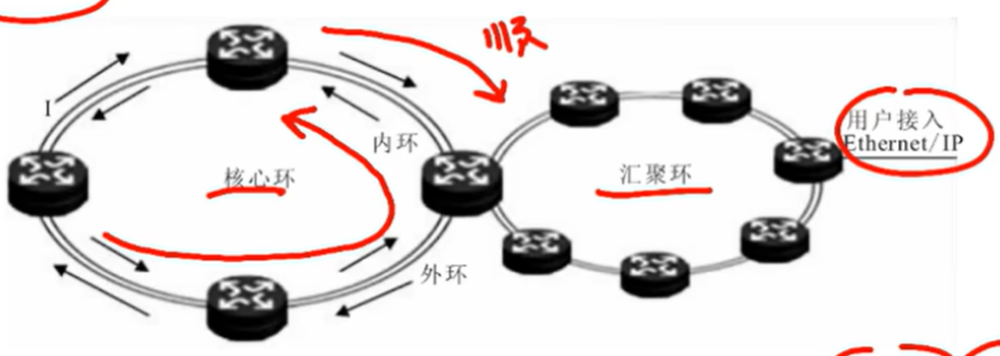
## 路由器技术
**中频 15 次**

1. 路由器的包转发能力与端口数量、端口速率、包长度和包类型有关。（没有端口类型）
2. **高性能**路由器一般采用采用**可交换式**的结构，**传统**的核心路由器采用**共字背板**的结构。
3. **丢包率**是衡量路由器超负荷工作时的性能指标之一。(“路由表容量”不是)
4. **吞吐量**是指路由器的包转发能力，包括端口吞吐量与整机吞吐量。**背板能力**决定路由器吞吐量。（不是吞吐量决定了路由器的背板能力）
5. **突发处理能力**是以最小帧间隔发送数据包而不引起丢失的最大发送速率来衡量的，**不单单是以最小帧间隔值来衡量的**。
6. 语音视频业务对延时抖动要求**较高**。
7. 路由器的**服务质量**主要表现在队列管理机制、端口硬件队列管理和支持的 QoS（Quality of Service）协议类型上。(不是包转发效率)
8. 路由器通过路由表来决定包转发路径。
9. 路由器的队列管理机制是指路由器的队列调度算法和拥塞管理机制。
## 城域网
**高频 25 次**

1. 宽带城域网保证服务质量 QoS（Quality of Service）要求的技术有：资源预留(**RSVP**)、区分服务(**DiffServ**)与多协议标记交换(**MPLS**)。网络服务质量表现在延时、抖动、吞吐量与丢包率。
2. 宽带城域网以 TCP/IP 路由协议为基础。能够为用户提供带宽保证，实现流量工程。
3. 可以利用 NAT 技术解决 IP 地址资源不足的问题。
4. 利用传统的电信网络进行网络管理称为“**带内**”，而利用 IP网络及协议进行网络管理的则称为“**带外**”。对汇聚层及其以上设备采取带外管理，而对汇聚层以下采用带内管理。
5. 宽带城域网**带外**网络管理是指利用网络管理协议 **SNMP** 建立网络管理系统。
6. 网络业务包括 Internet 接入业务、内容提供业务、视频与多媒体业务、数据专线业务、语音业务等。
7. 设计一个宽带城域网将涉及“三个平台一个出口”，即网络平台、业务平台、管理平台和**城市宽带出口**。
8. **核心交换层**的基本功能：①核心交换层将多个**汇聚层**连接起来，为汇聚层的网络提供高速分组转发，为整个城市提供一个高速、安全与具有 QoS保障能力的数据传输环境。②核心交换层实现与主干网络的互联，提供城市的宽带 IP出口。③核心交换层提供宽带城域网的用户访问 Internet 所需要的路由访问。

9. **汇聚层**的基本功能是：①汇接**接入层**的用户流量，进行数据分组传输的汇聚、转发与交换。②根据接入层的用户流量，进行本地路由、过滤、流量均衡、QoS 优先级管理，以及安全控制、IP 地址转换、流量整行等处理。③根据处理结果把用户流量转发到核心交换层或在本地进行路由处理。

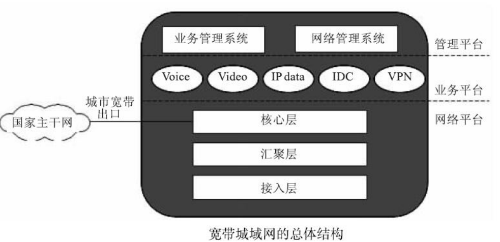

## 接入技术
**高频26 次**

1. 光纤传输系统的中继距离可达 **100km** 以上。
2. **Cable Modem（电缆调制解调器）** 利用 **频分复用（FDM）** 的方法将信道分为**上行信道**和**下行信道**，把用户计算机与有线电视同轴电缆连接起来。Cable Modem 的传输速率可以达到 **10～36Mbps**。
3. **ADSL** （Asymmetric Digital Subscriber Line，非对称数字用户线）使用一对铜双绞线，具有**非对称**技术特性，下行速率远高于上行速率，以适应大多数用户“下载多、上传少”的需求。
4. 宽带接入技术主要有：数字用户线 **xDSL** 技术、光纤同轴电缆混合网 **HFC** 技术、**光纤接入技术**、**无线接入技术**与**局域网接入技术**。（没有 **SDH**）
5. 无线接入技术主要有：**WLAN、WiMAX、WiFi、WMAN 和 Ad hoc** 等。
6. **APON（宽带无源光网络，ATM+PON）、DWDM、EPON** 是光纤接入技术。
7. “三网融合”中的三网是指**计算机网络、电信通信网和广播电视网**。
8. **HFC 接入方式采用共享式**的传输方式，HFC 网上的用户越多，每个用户实际可用的带宽就越窄（非独享）。HFC通过Cable Modem连接用户计算机和有线电视同轴电缆。
9. 按 **IEEE 802.16** 标准建立的无线网络，基站之间采用**全双工**、宽带通信方式工作。
10. 将传输速率提高到 **54Mbps** 的是 **802.11a 和 802.11g**，**802.11b** 将传输速度提高到 **11Mbps**。
11. 远距离（WMAN、WIMAX）无线宽带接入网采用 **802.16**（134mbps）标准。**IEEE 802.15** 标准专门从事 **WPAN（无线个人局域网）** 标准化工作，是适用于短程无线通信的标准。
12. OC-1 51.84 Mbit/s  OC-X  51.84×X Mbit/s
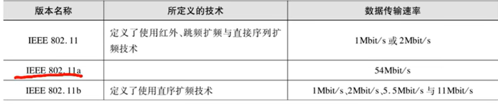
## 网络服务质量QoS
1. 资源预留协议 **Resource Reservation Protocol**  RSVP 
2. 区分服务 **Differentiated Service** Diffserv
3. 多协议标签交换 **Multiprotocol Label Switching** MPLS

## 蓝牙
**低频9 次**

1. 工作频段在 **2.402GHz~2.480GHz** 的 **ISM** 频段。
2. 同步信道速率 **64kbps**。
3. 跳频速率为 **1600 次/秒**，频点数是 **79 个频点/MHz**。
4. 非对称的异步信道速率为 **723.2kbps/57.6kbps**，对称的异步信道速率为 **433.9kbps（全双工）**。
5. 发射功率为 **0dBm（1mW）** 时，覆盖 **1～10 米**，**20dBm（100mW）** 时覆盖 **100 米**。
6. 信道间隔为 **1MHz**。
7. 标称数据速率是 **1Mbps**。
8. 话音编码方式为 **CVSD 或对数 PCM**。

## 布线
**必考34 次**

1. 双绞线可以避免电磁干扰。
2. **嵌入式插座**用来连接双绞线。（不是连接楼层配线架）
3. **多介质插座**用来连接**铜缆和光纤**，满足用户“光纤到桌面”的需求。
4. **建筑群子系统**可以是多种布线方式的任意组合。（“一般用双绞线连接”错）
5. **STP** 比 **UTP** 成本高、复杂，但抗干扰能力强、辐射小。
6. 作为水平布线系统电缆时，**UTP 电缆长度通常应在 90 米以内**。
7. **管理子系统**设置在楼层配线间内，提供与其他子系统连接的手段。
8. 对于高速率终端可采用**光纤直接到桌面**的方案。
9. **适配器**用于连接不同信号的数模转换或数据速率转换装置。
10. 在建筑群布线子系统所采用的铺设方式中，能够对线缆保护最有利的方式是**地下管道布线（管道内布线）**，较好的是**巷道布线**，最不利的是**直埋布线**。
11. **ISO/IEC 18011** 不是综合布线系统的标准。
12. 综合布线采用在**管理子系统**中更改、增加、交换、扩展线缆的方式来改变线缆路由。
13. **干线线缆**铺设经常采用**点对点结合**和**分支结合**两种方式。
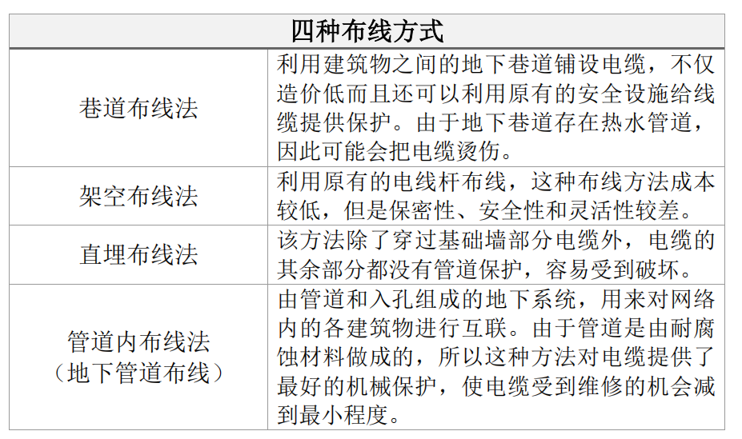

## 服务器技术
**中频11 次**

1. **热插拔**功能允许用户在不切断电源的情况下更换硬盘、板卡、电源等（不能更换主板、主背板）。
2. 集群技术中，如果一台主机出现故障，不会影响正常服务，但会影响系统性能。
3. 磁盘性能表现在**存储容量和 I/O 速度**。
4. 服务器总体性能取决于 **CPU 数量、CPU 主频、系统内存、网络速度**。（只写 CPU 数量错）
5. **RAID** 技术可以提高磁盘存储容量但是**不能提高容错能力**。
6. 采用 **RISC** 结构处理器的服务器通常使用 **UNIX** 系统（不是 Windows、Android）。
7. **NUMA** 技术将对称多处理器（SMP）和集群（Cluster）技术结合起来。
8. **对称多处理技术（SMP）**可以在多 CPU 结构的服务器中均衡负载。
9. 通常用 **MTBF** 度量可靠性，用 **MTBR** 度量可维护性，系统可用性：**MTBF/(MTBF+MTBR)**。路由器可用性可用 MTBF 描述。

## DNS 服务器
**中频19 次**

1. 动态更新允许客户机在发生更改时动态更新其资源记录。
2. DNS 服务器中的**根服务器被自动加入**系统中，不需管理员手工配置。
3. 主机记录的**生存时间（TTL）**指该记录被客户端查询到、放在缓存中的持续时间。
4. DNS 服务器配置的主要参数：**正向查找域、反向查找域、资源记录、转发器**。
5. **转发器**是网络上的 DNS 服务器（不是路由器），用于外域名的 DNS 查询。
6. **反向查找区域**用于将 IP 地址解析为域名，可手工增加主机的指针记录。
7. **正向查找区域**用于将域名解析为 IP 地址，正向查找区域自动增加主机的指针记录。
8. DNS 服务器的 IP 地址不是由 DHCP 动态分配，应设置为**静态固定地址**。
9. DNS 服务器常用资源记录：**主机地址、邮件交换器、别名**（没有 FTP 服务器记录）。别名记录用于将别名映射到标准 DNS 域名。
10. 缺省情况下，Windows 2003 系统中未安装 DNS 服务。
11. DNS 服务器按层次分为 **根 DNS 服务器、顶级域（TLD）服务器、权威 DNS 服务器**。
12. 命令：`ipconfig` 显示当前 TCP/IP 网络配置；`netstat` 显示本机与远程计算机的基于 TCP/IP 的 NetBIOS 统计及连接信息；`pathping` 将报文发送到所经过的所有路由器并统计；`route` 显示或修改本地 IP 路由表；`nslookup` 测试正向与反向查找区域；`ping` 测试正向查找区域。

## WWW 服务器
**高频20 次**

1. Web 站点可以配置**静态和动态 IP 地址**。
2. 建立 Web 站点时必须为该站点指定一个**主目录**（不一定在本地服务器），也可以是虚拟的子目录。
3. 访问 Web 站点时不一定需要设置默认文档；设置了默认页面访问时会直接打开 `default.html` 等。若未设置默认文档，访问站点需提供首页文件名。
4. 访问 Web 站点可使用站点**域名或 IP 地址**。
5. 性能选项包括影响带宽使用的属性、客户端 Web 连接数量（不包括超时时间）。带宽限制选项限制可用带宽；连接选项可设置客户端 Web 连接数量。
6. 主目录选项卡可配置主目录读取/写入等权限，并设置网页文件路径。
7. 目录安全选项卡可配置**身份验证和访问控制、IP 地址和域名限制、安全通信**（不可配置主目录访问权限）。
8. 网站选项包括网站标识、连接限制、连接超时时间、日志记录及格式；网站连接超时指 HTTP 连接保持时间。带宽选项能限制可用带宽。
9. 作为网络标识的有 **IP 地址、非 TCP 端口号、主机头、网站描述**（没有主目录）。
10. Windows 2003 添加操作系统组件 **IIS** 即可实现 Web 服务，建立 Web 站点前必须安装。
11. Web 站点可以动态获取 IP 地址；一台服务器上可构建多个网站。
12. 缺省情况下 Windows 2003 系统没有安装 DNS 服务。

## FTP 服务器
**高频25 次**

1. 初始状态下没有设置管理员密码，可直接进入 Serv-U 管理程序。
2. FTP 服务器缺省端口号为 **21**，也可选择其他端口号。
3. FTP 服务器可以使用动态 IP 地址，服务器 IP 地址可配置为空（代表全部 IP 地址，空不是 0.0.0.0）。
4. 服务器可构建多个由 **IP 地址和端口号**识别的虚拟服务器（域），不是只依靠 IP 地址。
5. 添加 “anonymous” 系统自动判定为匿名用户（不是创建新域时自动添加）。
6. 服务器最大用户数指服务器允许同时在线的最大用户数量。
7. 用户上传下载选项要求 FTP 客户端下载信息的同时也要上传文件（不是配置上传下载速率）。
8. 服务器选项不提供 “IP 访问选项”；用户常规选项不包含 “用户主目录”。
9. 配置域存储位置时，小的域用 **INI 文件**存储，大的域用**注册表**存储。
10. 配置服务器域名时，可使用域名或其他描述（不必是合格域名）。
11. 需要管理员权限才能在 Serv-U FTP 服务器中注册用户（用户不可自行注册）。
12. 域创建完成后需添加用户才能访问；用户包括匿名和命名用户。匿名用户名必须为 **"anonymous"**，且不会要求输入密码。
13. Serv-U 中限制用户名上传信息占用存储空间的选项是**用户配额**。
14. 服务器可构建多个由 IP 地址和端口号识别的虚拟服务器。
15. 服务器最大上传或下载速度指整个服务器占用的带宽。
16. 选择拦截 **FTP BOUNCE** 和 **FXP** 后，不允许在两个 FTP 服务器间传输文件。
17. 对用户数大于 **500** 的域，存放在注册表中可提供更高性能。
18. 访问 FTP 服务器除了专用客户端（如 CuteFTP），还可用浏览器。
19. 检查匿名用户密码选项指匿名用户登录需用**电子邮件地址**作为密码。

## 邮件（Winmail 邮件服务器）
**必考30 次**

1. Winmail 邮件服务器支持基于 Web 方式的访问和管理，安装前需先装 **IIS**。
2. Winmail 允许用户自行注册新邮箱（输入邮箱名、密码等），域名固定不可自行设置；Winmail 用户不可以使用 Outlook 自行注册。
3. 在 **Winmail 快速设置向导**中创建新用户时，输入用户名、域名及用户密码（不是系统邮箱密码、管理员密码），可选择是否允许客户注册新邮箱。
4. 建立邮件路由时，需在 DNS 服务器中建立该邮件服务器**主机记录和邮件交换器记录**（缺一不可）。
5. 发送邮件用 **SMTP**，接收/读取邮件用 **POP3 或 IMAP**；浏览器查看邮件会用 **HTTP**；**CMIP** 不属于电子邮件协议。
6. 邮件交换器记录只能在服务器上配置，不能通过浏览器配置。
7. 管理工具包括系统设置、域名设置、用户和组设置、系统状态和系统日志等（不包含邮件管理）。
8. 在 **域名设置**中可增加/删除域，用于构建虚拟邮件服务器；域名设置可设置是否允许自行注册新用户。
9. 系统设置包括 **SMTP 设置、邮件过滤、更改管理员密码**（没有域名设置）。
10. 使用 Outlook 等客户端软件只能访问 Winmail 邮件服务器，不能管理 Winmail 邮件服务器。
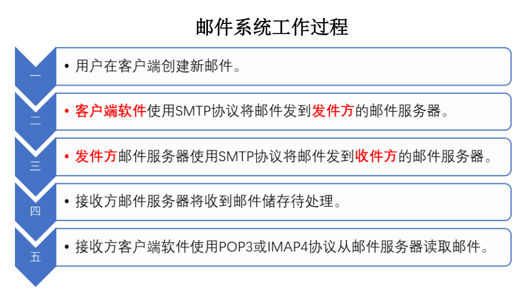
## 生成树协议
**中频15 次**

1. IEEE 制定的最早 STP 标准是 **IEEE 802.1D**。IEEE 802.1d 是当前流行的 STP 标准，透明网桥标准 STP 定义在 IEEE 802.1d 标准中。
2. 交换机之间传递 BPDU，有两种类型：**配置 BPDU**（不超过/小于 35 字节）和**拓扑变化通知 BPDU**（不超过/小于 4 字节）。
3. STP 默认每 **2 秒**发送一次 BPDU，拓扑变化时也发送新的 BPDU。
4. 阻塞端口仍是激活端口，但**只能接收 BPDU**。
5. 生成树协议是**二层链路管理协议**。
6. STP 运行在**交换机和网桥**设备上（不是路由器），通过计算建立稳定的树状结构网络。
7. **Bridge ID** 用 8 个字节表示，由 2 字节优先级值和 6 字节交换机 MAC 地址组成。优先级增值量 **4096**，范围 **0-61440**，默认 **32768**。
8. Bridge ID 值最小的成为**根网桥/根交换机**。

## IEEE
**必考31 次**

1. IEEE 802.11 的三个物理层定义包括两个扩频技术（**FHSS、DSSS**）和一个红外传播规范。
2. 802.11 无线传输频道定义在 **2.4GHz ISM** 频段，传输速率 **1Mbps 和 2Mbps**。
3. IEEE 802.11 在 MAC 子层引入 **RTS/CTS** 选项。
4. 802.11 定义两种设备：无线结点和无线接入点。
5. 无线接入点 **AP** 作用是提供无线与有线网络之间的桥接。
6. IEEE 802.11 运作模式分为**点对点模式**和**基本模式**。
7. 点对点模式指无线网卡之间通信方式，最多允许 **256 台 PC** 连接。
8. 基本模式指无线网络扩展或无线/有线并存时的通信方式，接入点负责频段管理及漫游等工作，一个接入点最多连接 **1024 台 PC**。
9. 802.11b 最大容量 **33Mbps**，传输速率 **11Mbps**；802.11a 和 802.11g 传输速率 **54Mbps**。
10. IEEE 802.11b 使用开放的 **2.4GHz** 频段，无需申请即可使用。
11. IEEE 802.1d 是当前最流行的 STP 标准。
12. 802.11 标准重点在局域网范围的移动结点通信；**802.16** 标准重点在建筑物之间数据通信；**802.16a** 增加非视距和无线网格网支持，用于固定结点接入。
13. IEEE 802.11 运行在 **2.4GHz ISM**，最大速率 **1~2Mbps**。
14. IEEE 802.11b 运行在 **2.4GHz ISM**，最大速率 **11Mbps**，最大容量 **33Mbps**。
15. IEEE 802.11a 运行在 **5GHz UNII**，最大速率 **54Mbps**，最大容量 **432Mbps**。
16. IEEE 802.11g 运行在 **2.4GHz ISM**，最大速率 **54Mbps**，实际吞吐量 **28~31Mbps**，最大容量 **162Mbps**。
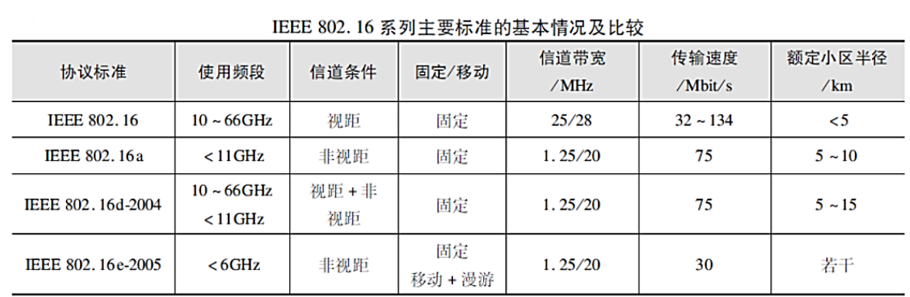
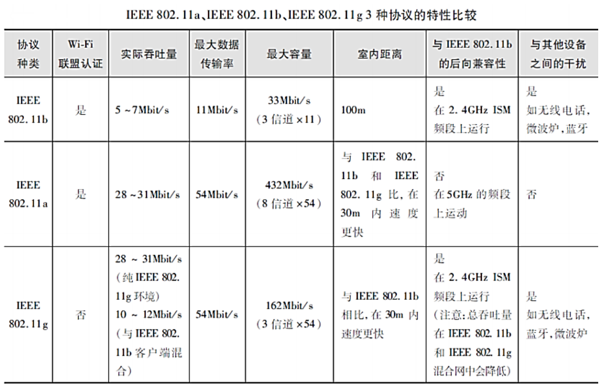
## VLAN 标识的描述
**中频15 次**

1. VLAN 工作在 OSI 第二层（数据链路层），不是网络层；VLAN 之间通信必须通过**路由器**。
2. VLAN 以**交换式网络**为基础。
3. 建立不给定名字的 VLAN，系统自动按缺省 VLAN 名（**VLAN00xxx**）建立，xxx 是 VLAN ID。
4. IEEE 802.1Q 标准规定用于标识 VLAN 的 VLAN ID 用 **12 bit** 表示。
5. 每个 VLAN 都是一个独立的逻辑网络、**单一广播域**。
6. 按每个连接到交换机设备的 **MAC 地址**定义 VLAN 成员是**动态 VLAN**。
7. VLAN 的划分不受用户物理位置和物理网段限制，也不受交换机区段限制。
8. VLAN ID 标准范围 **1~1005**，扩展范围 **1025~4096**。
9. 标准范围内可用于 Ethernet 的 VLAN ID 为 **2~1000**。
10. VLAN 使用一个 **VLAN 名（VLAN name）**和 **VLAN 号（VLAN ID）**标识。VLAN 名用 **1~32** 个字符表示，可为字母和数字。
11. ID 为 **1** 的 VLAN 是系统默认 VLAN，通常用于设备管理，不能删除（无法执行 `no vlan 1`）。**2~1000** 用于 Ethernet VLANs，**1002~1005** 预留给 FDDI 和 Token Ring VLANs，**1025~4094** 为扩展 VLAN ID，其他为保留。
## DHCP 服务器
**中频22 次**

（1）**作用域**

1. **作用域**是用于网络的可能 IP 地址的完整连续范围，**并不负责 IP 地址分配**。定义了作用域并应用排除范围之后，必须**激活**才可为客户机分配地址，剩余的地址在作用域内形成可用的**地址池**。
2. DHCP 服务器可为多个网段分配 IP 地址；如果有多个网段 IP 地址，则需要配置多个**作用域、地址池**。
3. 在 DHCP 服务器中新建作用域时，在**租约期限**中不可调整的时间单位是**周**。
4. 作用域配置信息有**作用域 IP 地址范围、作用域名称、保留、排除**。（无 DHCP 服务器地址）
5. 新建作用域时，必须输入的信息是**起始 IP 地址和结束 IP 地址**。

（2）**排除**

6. **排除**是 DHCP 服务器**不分配**的 IP 地址。
7. **排除范围**是作用域内从 DHCP 服务中排除的有限 IP 地址序列。添加排除的 IP 地址范围，只需输入**起始 IP 地址**和**结束 IP 地址**；如果想排除一个单独的 IP 地址，只需要输入起始 IP 地址即可（结束 IP 地址省略）。添加排除时**不需要**获取客户机的 **MAC 地址**信息。（添加保留时需要）

（3）**租约**

8. **租约**是客户机可使用指派的 IP 地址期间 DHCP 服务器指定的时间长度。（不能控制用户上网时间）租约期限决定租约何时期满，以及客户端需要向服务器对它进行更新的频率。

（4）**保留**

9. 使用**保留**创建通过 DHCP 服务器的**永久地址租约指派**，客户端可以释放该租约。保留地址可以使用作用域地址范围中的**任何 IP 地址**（包括被排出的 IP 地址序列）。保留确保了子网上指定的硬件设备始终可使用相同的 IP 地址。
10. 新建保留时，需输入**保留名称、IP 地址、MAC 地址、描述和支持类型**等项目。（无子网掩码）

（5）**续约**

11. **续约**：默认的地址租约期限为 **8 天**，租约到期前客户端需要续订，续订由客户端软件**自动完成**。地址租约期限的最小可调整单位是**分钟**。
12. 客户机与 DHCP 服务器在**同一网段**时，采用收到 **DHCP 发现**消息的子网所处的网段分配 IP 地址。不在同一网段时，选择转发 **DHCP 发现**消息的中继所在的子网网段（需修改该消息中的相关字段）。收到非中继转发的 **DHCP 发现**消息时，会选择收到该消息的子网所处的网段分配 IP 地址。（不是任选）

# 综合题

## 一、填表题
## 二、路由器题（或交换机）

##  三、DHCP分析题

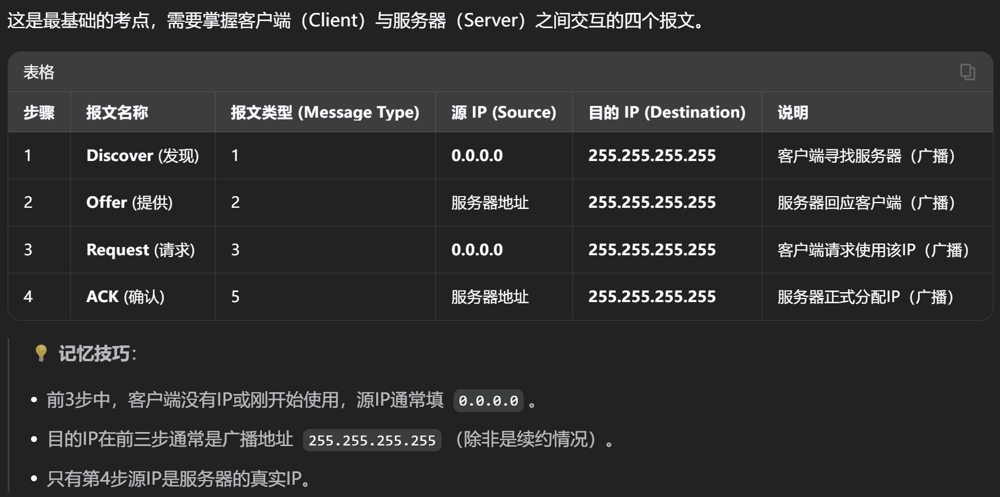

## 四、Sniffer或Wireshark题

# 应用题

## 一、填表部分
### 方法

### 应用

## 二、划分子网部分

### 方法
### 应用

## 三、其他部分

### 方法
### 应用

# 真题练习
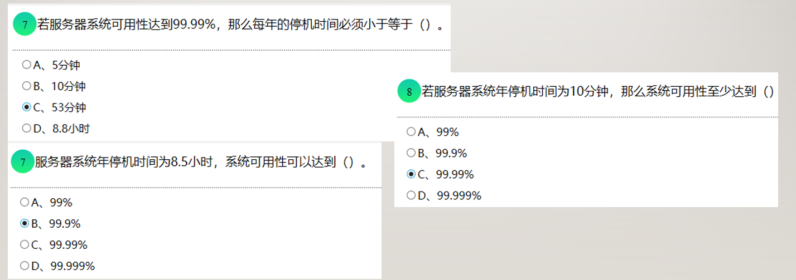

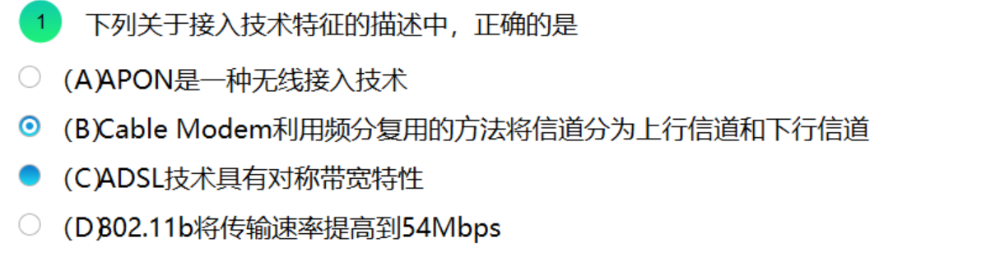

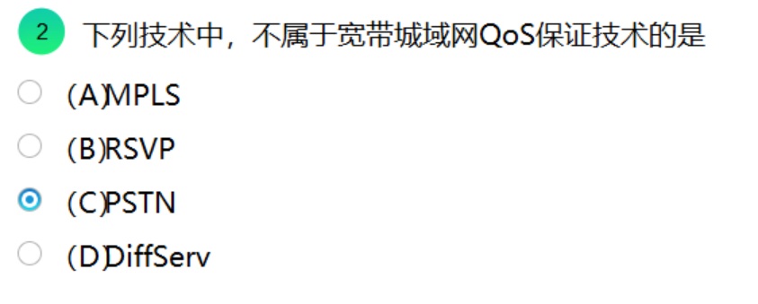
