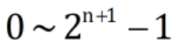

# 第1章 概论

# 第2章 数据的机器层次表示
## 2.1 数值数据的表示

基数：r进制的基数为r

二进制（Binary）：后缀B。
八进制（Octal）：后缀为Q或O（易与0混淆），一般采用Q。
十进制（Decimal）：后缀D。
十六进制（Hexadecimal）：后缀H。

二进制转十六进制：
整数部分从低位开始，小数部分从高位开始，每四位一组，首尾不足四位的补零，然后每组用一位的十六进制数表示。
十六进制转二进制：

例：4FB.CA➡️(0)100 1111 1011 1100 1010
### 2.1.2无符号数和带符号数
无符号数：整个机器字长的全部二进制位均表示数值位（没有符号位），相当于数的绝对值。
机器字长为n+1位的无符号数的表示范围是：

### 2.1.3 原码表示法
定义：最高位是符号位，符号位为0时表示该数为正，符号位为1时表示该数为负，数值部分与真值相同。

