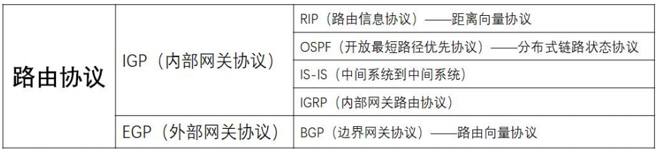

# 选择题

## BGP（边界网关协议）
==高频：约出现24 次==

1. 边界网关协议（Border Gateway Protocol），是==外部==而不是内部网关协议(是不同自治系统(AS)的路由器之间使用的协议)。
2. 一个 BGP 发言人使用 ==TCP==（不是 UDP）与其他自治系统的 BGP发言人交换路由信息。
3. BGP 协议交换路由信息的节点数是以自治系统数为单位的，BGP 交换路由信息的节点数不小于自治系统数。
4. BGP 采用==路由向量协议==，而RIP采用距离向量协议。
5. BGP 发言人通过 ==update== 而不是 noticfication 分组通知相邻系统，使用 update 分组更新路由时，一个报文只能增加一条路由。
6. ==open 分组==用来与相邻的另一个 BGP 发言人建立关系，两个BGP 发言人需要==周期性==地（不是不定期）交换 ==keepalive== 分组来确认双方的相邻关系。
7. BGP 路由选择协议执行中使用的四个分组为打开(open)、更新(update)、保活(keepalive)和通知(notification)分组。
