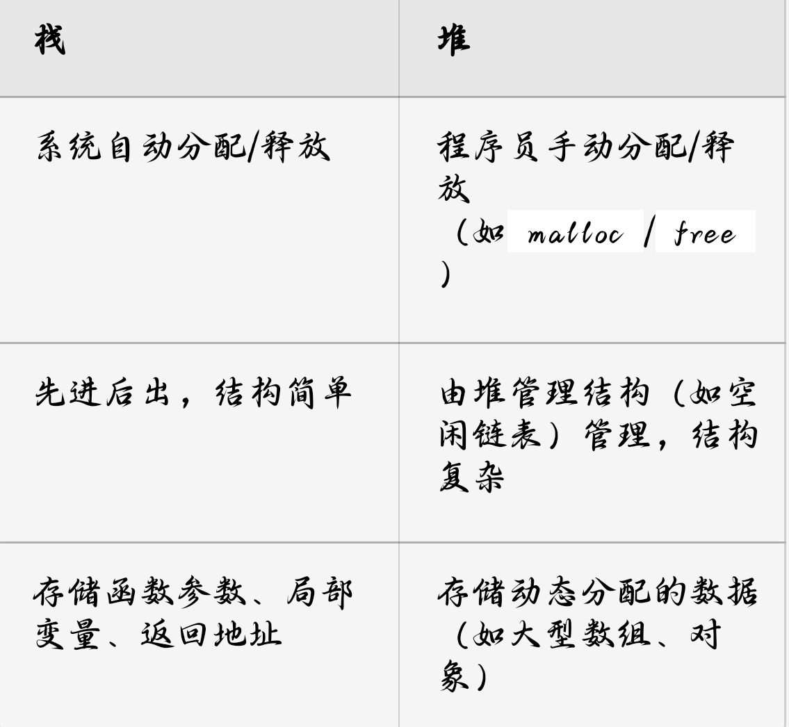

一、缓冲区溢出漏洞  
缓冲区是一块连续的内存区域，用于存放程序运行时加载到内存的运行代码和数据。  
缓冲区溢出是指程序运行时，向固定大小的缓冲区写入超过其容量的数据，多余的数据会越过缓冲区的边界覆盖相邻内存空间，从而造成溢出。

1. 栈溢出漏洞  
检查或者检查不充分，将转向执行恶意程序。  
非静态局部变量存放在栈中。下面举例说明栈溢出。

```c
void stack_overflow(char* argument) {
    char local[4];
    for (int i = 0; argument[i]; i++) {
        local[i] = argument[i];
    }
}
```

上述样例程序中，函数 `stack_overflow` 被调用时栈布局如图 4-2 所示。图中 `local` 是栈中保存局部变量的缓冲区。根据 `char local[4]` 预先分配的大小为 4 字节，当向 `local` 中写入超过 4 字节的字符时，就会发生溢出。例如，`AAAABBBBCCCCDDDD` 为参数调用，当函数执行后，栈顶布局如图 4-2 所示。可以看出输入参数中 `CCCC` 覆盖了返回地址，当 `stack_overflow` 执行结束，根据栈中返回地址返回时，程序将转到地址 `CCCC` 并执行此地址指向的程序，如果 `CCCC` 地址为攻击代码的入口地址，会调用攻击代码。


2. 堆溢出漏洞  
基于栈溢出的缓冲区溢出防范措施。


当被调用的子函数中写入数据的长度超过栈帧中预留的局部变量空间时，就会发生栈溢出。




 

