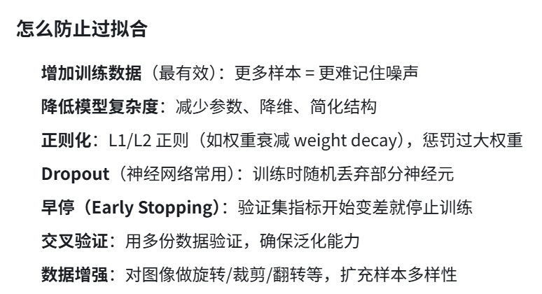

二、前置知识
2.1模型训练中的"记忆"现象
现代深度学习模型具有很强的拟合能力。当模型在训练数据上反复学习时，它对见过的样本会产生有偏向
的输出一一这就是模型的"记忆"。
经验风险最小化（ERM）训练范式迫使模型在训练集上最小化损失函数，模型参数会隐式记住训练样本的分布特征
#### 过拟合（Overfitting）
过拟合越严重，模型对训练样本和非训练样本的输出差异越大
**一句话定义**：模型在训练数据上表现极好，但在新数据（测试集/真实场景）上表现很差的现象。通俗说就是**背答案背得太熟，不会举一反三**

即使模型测试准确率很高，这种"记忆"也可能以置信度差异的形式泄露一一模型给见过的样本分配更高
的预测置信度
