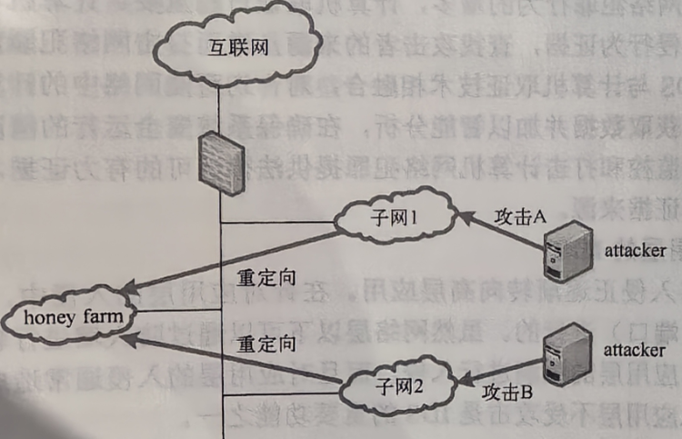

## 一、蜜罐
蜜罐（honey pot）是一种信息收集系统。狭义上的蜜罐指网络防御措施的一种，可以是刻意设置的目标，其存在的价值就在于被攻击甚至攻陷。同时，它必须能记录下被攻击的方式、手段和入侵者寻找到的系统漏洞等，以方便网络维护人员提前找到相应的对策。而广义上的蜜罐也可以是一种攻击手段，用来替代正常的服务提供者，诱捕普通网络用户前来使用，从而获取敏感信息或者不正当利益的方式，下面主要讲述狭义上的蜜罐系统。

蜜罐作为一种软件应用系统，用来充当入侵诱饵，它通常伪装成看似有利用价值的网络、数据、计算系统，用来吸引黑客攻击。由于蜜罐事实上并不需要对网络提供任何有价值的服务，所以任何对蜜罐的尝试都是可疑的，这些尝试会被记录、监测与分析，从而可能了解攻击方的入侵方式和入侵手段等，也可以因此随时了解针对组织服务器发动的最新的攻击和漏洞，甚至可以通过窃听数据包之间的联系，收集入侵者所用的种种工具，并且进而侵彻对方的社交网络。另外，蜜罐在拖延入侵者对真正目标的攻击上也有一定作用，可以作为第一道防线，承担迷惑和误导入侵者的功能。

蜜罐技术主要分为低交互蜜罐和高交互蜜罐，交互度直接体现着入侵者可以在蜜罐上进行攻击活动的自由度。

低交互蜜罐又称伪系统蜜罐，该系统依然以真实系统为基础，切割出部分功能和区域，用于模拟出实系统的部分功能和弱点，引诱入侵者对其发动试探或者攻击。但是整个区域对于真实的入侵者之间的交互极其有限，因为它提供的所有服务都是模拟的行为，只能对攻击行为做出简单的应答，并对攻击行为做记录和分析。

多数低蜜罐一般都作为端口预警使用，承担监控一个或者多个端口的监测工作。如果这些特定的端口被触发，则发出警告并记录其行为。但是蜜罐本身不会构造完整的合法服务，所以它引入系统的风险最小，不会被入侵者入侵并作为其下一步攻击的跳板。但是通过低交互蜜罐能够收集的信息也相对有限，同时由于低交互蜜罐通常是切割出的虚拟功能或系统，在这些虚拟的功能上通常都会遗留一些独有的指纹信息，入侵者可以通过这些信息来判断和绕过蜜罐系统。

高交互蜜罐又称实系统蜜罐，它是完全真实的蜜罐：运行着真实的系统，有真实的服务响应，带着真实的漏洞。它甚至模拟每个模拟操作系统的网络堆栈，从而实现对 Nmap 和 Xprobe 之类指纹扫描程序的欺骗。

高交互蜜罐的优点体现在对入侵者提供真实的系统。当入侵者获得 root 权限后，受系统、数据真实性的迷惑，更多活动和行为将被记录下来。缺点是被入侵的可能性很高，并且被成功攻破后的危害性也很大。入侵者每一个动作都会引起系统真实的反应，例如被溢出、渗透，甚至夺取 root 权限等。如果整个蜜罐被入侵，那么它就会成为入侵者下一步攻击的跳板。通常应另有一套系统用于检测高交互蜜罐的异常情况，如果出现高交互蜜罐被侵入的情况，那么后备系统会立即对蜜罐予以脱机。高蜜罐在提升入侵者的活动自由度、获取更加真实和可靠的第一手材料的同时，也相应地加大了部署和维护的复杂度，扩大了入侵风险。

## 二、蜜网
蜜网（honey network）是在蜜罐技术上逐渐发展起来的一种高交互性的蜜罐，在一台或多台蜜罐主机基础上，结合防火墙、路由器、入侵检测等组成的网络系统。这一网络系统是隐藏在防火墙后面的，所有进出的资料都会受到监控、捕获及控制。与传统蜜罐技术的差异在于，蜜网构成了一个黑客诱捕网络体系架构，在这个架构中，可以包含一个或多个蜜罐，同时保证网络的高度可控性，以及提供多种工具以方便对攻击信息的采集和分析。另外，蜜网架构注重整合资源，将真实的系统、蜜罐系统、各种服务、防火墙及入侵检测等资源有机结合在一起，具有多层次的数据控制机制，全面的数据捕获机制，并能够辅助研究人员对捕获的数据进行深入分析。因此，蜜网也可理解为一个集防火墙、入侵检测、数据分析软件、各类蜜罐等于一体的综合体。

整个蜜网体系主要由蜜网网关、虚拟蜜罐、物理蜜罐和监控机等组成。蜜网体系结构解决了三大核心功能：数据控制、数据捕获和数据分析。蜜罐与蜜网的研究主要涉及的关键技术有：网络欺骗、数据捕获、数据控制、数据分析等。

### 1. 网络欺骗
由于蜜罐与蜜网的价值是在其被探测、攻击或者攻陷的时候才得到体现。网络欺骗技术是使蜜网系统在网络上与真实的主机系统难以区分。所以没有网络欺骗功能的蜜罐是没有价值的，网络欺骗技术因此也是蜜网技术体系中最为关键的核心技术和难题。网络欺骗技术的强与弱从一个侧面也反映了蜜罐本身的价值。目前，蜜罐主要的网络欺骗技术有如下几种：模拟服务端口、模拟系统漏洞和应用服务、IP 空间欺骗、流量仿真、网络动态配置、组织信息欺骗、网络服务等。

### 2. 数据捕获
数据捕获就是在网络入侵者无察觉的情况下，完整地记录所有进入蜜网系统的连接行为及其活动。蜜网系统通常采用 3 种层次捕获数据，分别是防火墙、IDS 和蜜罐主机。防火墙位于蜜网系统的前面，数据捕获是蜜网的重要功能，只有捕获了攻击者的入侵数据，才能对其进行分析整理，才能对防火墙和入侵检测等系统进行规则调整。蜜网的主动防御功能能否得以充分的体现关键在于捕获的数据是否真实、是否详实、是否丰富，所以要从不同方面、不同角度去进行数据的搜集，同时还要考虑数据的真实性。

### 3. 数据控制
数据控制就是通过设置策略限制攻击者的活动进行网络防护。如果攻击者进入蜜网，既要给攻击者一定的活动自由，也要对攻击者的活动进行限制，不能让攻击者危害蜜网之外的系统，更不能让攻击者发现数据控制的活动。限制攻击者的方法可以采取限制其从蜜罐向外的连接数量和在蜜网中的活动能力。为了防止因单个机制被攻破而导致系统沦陷，通常采用多层次的数据控制机制。

### 4. 数据分析
数据分析就是把蜜网系统所捕获到的数据记录进行分析处理，提取入侵规则，从中分析是否有新的入侵特征。数据分析包括网络协议分析、网络行为分析和攻击特征分析等。分析的主要目的有两个：一个是分析攻击者在蜜网系统中的活动、扫描击键行为、非法访问系统所使用工具、攻击目的何在以及提取攻击特征；另一个是对攻击者的行为建立数据统计模型，看其是否具有攻击特征，若有则发出预警，保护其他正常网络，避免受到相同攻击。

## 三、蜜场
蜜场（honey farm）是在蜜罐技术的基础上发展起来的，它的优点是“逻辑上分散部署，物理上集中部署”，这就使得在分布式网络中部署蜜罐成为一件相对容易的事。蜜场系统主要由具有诱骗服务模块的受保护子网和集中部署的蜜罐群组成。蜜场系统的体系结构如图 7-26 所示，它由重定向器、前端处理器、控制中心及集中部署的蜜罐群组成。

蜜场的工作原理比较简单：将所有的蜜罐都集中部署在一个独立的网络中，这个网络成为蜜场的中心；在每个需要进行监控的子网中布置一个重定向器（redirector），重定向器以软件形式存在，它监听对未用地址或端口的非法访问，但它们不直接响应，而是把这些非法访问通过某种保密的方式重定向到被严密监控的蜜场中心；蜜场中心选择某台蜜罐对攻击信息进行响应，然后把响应传回到具有非法访问的子网中去，并且利用一些手段对攻击信息进行收集和分析。

